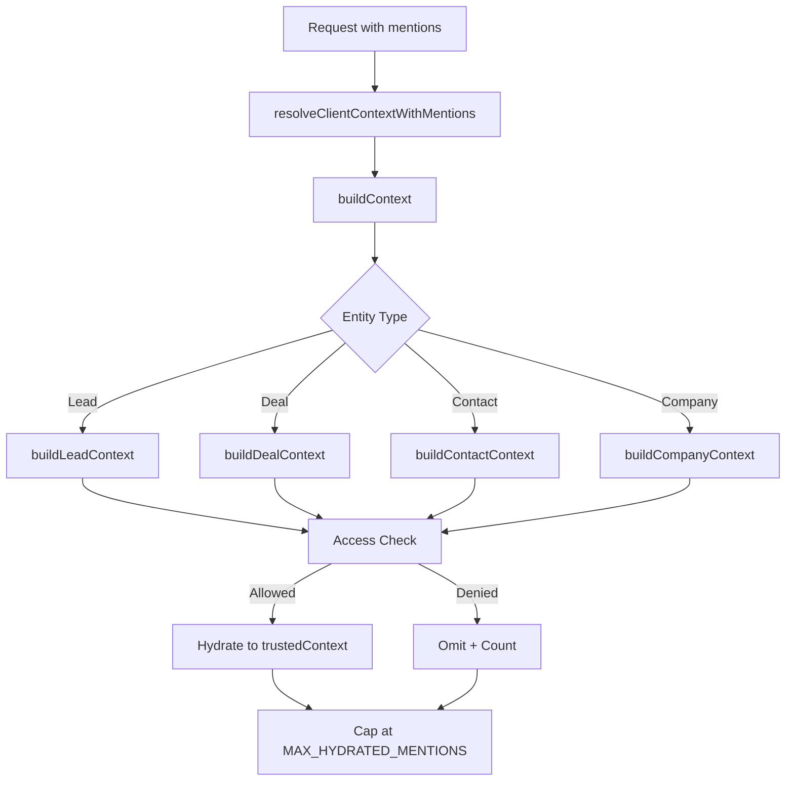

## Overview

The AI Assistant Module provides intelligent, context-aware assistance across CRM, real estate, and market research domains. This specification documents the architecture, recent optimizations, and integration patterns as of version 0.44.

<Note>
**Last Updated:** 2026-06-07 — Lever 1 centralized access-scope contract implementation (`crm-assistant-v0.44-centralized-access-scope`)
</Note>

## Recent Updates (v0.44)

### Centralized Access-Scope Contract

<Tip>
This optimization reduces per-turn token count by ~10k characters while maintaining identical access control behavior.
</Tip>

The paragraph-length `all`/`my`/`team` scope contract that was previously embedded in every `crm_records` tool description has been centralized into a single **"Access scope (`view` / `scope`) rules"** block in the `SYSTEM_PROMPT`.

#### Key Changes

<Steps>
<Step title="Centralized Contract Block">
The common access-scope documentation now lives in `assembleSystemPrompt` as a shared block for the `crm_records` group, positioned outside the real-estate anchors that `assembleSystemPrompt` strips.
</Step>

<Step title="Shared Constants">
Individual tool descriptions now reference the centralized contract via:
- `CRM_SCOPE_VIEW_DESCRIBE` 
- `CRM_SCOPE_TEAMID_DESCRIBE` constants
- `crmScopeViewDescribe(myClause)` helper in `src/modules/crm/shared/ai/scope-describe.constants.ts`
</Step>

<Step title="Entity-Specific Semantics">
Load-bearing entity-specific `my` semantics are appended as short clauses where needed.
</Step>
</Steps>

#### Affected Tools

The centralization applies to these `crm_records` tools:

<CardGroup cols={2}>
<Card title="Search Tools" icon="magnifying-glass">
- `searchLeads`
- `searchDeals`
- `searchContacts`
- `searchCompanies`
- `searchCommissionPayments`
</Card>

<Card title="Aggregate Tools" icon="chart-line">
- `*Summary` tools
- `*Velocity` tools
- Pipeline aggregates
- Duplicate detection
- Repeated participant analysis
</Card>

<Card title="Monitor Tools" icon="bell">
- Follow-up monitors
- Needs-attention monitors
</Card>

<Card title="Analytics Tools" icon="chart-pie">
- `getMyTopAreas`
- `getMyTopCommunities`
</Card>
</CardGroup>

#### Unchanged Elements

<Warning>
This is **de-duplication and centralization, NOT truncation**. All access control logic remains byte-for-byte identical.
</Warning>

The following remain unchanged:
- `access_denied_to_view` recovery contract
- `appliedScope`/`scope` echo behavior
- Access check logic
- `BadRequestException("... view='team' requires teamId")` guards
- All executor implementation logic

<Info>
Task (`my`/`team`/`all` tier) and event (`my`/`team`/`org` calendar) `scope` parameters are **intentionally NOT folded in** — they have distinct semantics, are already concise, and contain no raw permission keys.
</Info>

#### Token Savings & Performance

```json
{
  "model_facing_reduction": "~10,000 characters per turn",
  "diagnostic_snapshot_delta": "~1.3% (understates actual savings)",
  "primary_benefit": "Latency reduction (prompt-cache-independent)",
  "reason": "Tool-schema prefix is part of cached prompt prefix"
}
```

<Check>
Parity is eval-gated via `pnpm eval:differential`. The diagnostic `tool-registry-snapshot.json` only captures top-level `description` + `inputSchemaHint`, so its byte delta understates the model-facing reduction.
</Check>

### Security Gate: No Permission Leaks

The `ai-tool-descriptions-no-permission-leak.spec.ts` AST gate is now **ACTIVE** (flipped from `describe.skip`).

#### RBAC Key Cleanup

Raw RBAC keys in model-facing descriptions have been replaced with human-readable terms:

| Before | After |
|--------|-------|
| `team_crm.view` | "team-level CRM access" |
| `system.admin / crm.view` | "CRM or admin access" |

<Note>
The model receives `tool.description` + the Zod `inputSchema` (via `.describe()` → JSON Schema, adapted by `AiToolBridgeService.adaptTool`), making this a real per-turn token reduction.
</Note>

### Performance Metrics

The `eval:cost-baseline` command now reports per-LLM-call latency percentiles:

```bash
pnpm eval:cost-baseline
```

**New Metrics:**
- p50 (median) `duration_ms`
- p90 `duration_ms`
- p95 `duration_ms`
- max `duration_ms`

<Tip>
The slimming's primary benefit is latency reduction, which is prompt-cache-independent since the tool-schema prefix is part of the cached prompt prefix.
</Tip>

## Intent Router Improvements

### Active Entity as Signal (Not Override)

<Warning>
**Bug Fix:** Previously, active entity context would force-route queries even when they contradicted the user's intent.
</Warning>

#### Previous Behavior

`AiIntentRouterService.resolveHeuristicGroup` (Tier A) would immediately return the `clientContext.activeEntity.type` / `pageType` group before inspecting the message. This caused off-domain questions on CRM surfaces to be incorrectly routed.

**Example:** "What's the off-plan market in Arjan?" asked on a lead detail page would force-route to `crm_records`, excluding all `real-estate.*` market tools.

#### New Behavior

Tier A now evaluates in this order:

<Steps>
<Step title="No Keyword Family">
Fall back to active-entity group (the only signal)

**Example:** "What do you know about this lead?" on a lead surface stays `crm_records`
</Step>

<Step title="Single Family Agreeing">
One keyword family that AGREES with (or there is no) entity group → use that group

**Result:** Fast hit, no model call needed
</Step>

<Step title="Single Family Conflicting">
One keyword family that CONFLICTS with entity group → abstain (`null`)

**Result:** Tier B's lite classifier re-routes based on message text
</Step>

<Step title="Mixed Families">
Two or more keyword families (mixed) → abstain regardless of context

**Result:** Falls through to Tier B classification
</Step>
</Steps>

<Info>
Tier B, Phase 3, and Phase 4 narrowing logic remain unchanged. No prompt or registry version bump required (Tier A is a pre-prompt routing decision).
</Info>

#### Test Coverage

New unit tests cover:
- Conflict scenarios (entity vs. message intent)
- Agreement scenarios
- No-keyword scenarios
- Mixed-keyword-on-entity scenarios

## Market & Regulations Research (v0.42)

### Phase-Split Prompt Architecture

<CardGroup cols={2}>
<Card title="Route Phase" icon="route">
**Lean pre-call prompt**
- `MARKET_REGULATIONS_ROUTE_PROMPT`
- Low reasoning settings
- Fast initial classification
</Card>

<Card title="Answer Phase" icon="message">
**Full answer prompt**
- `MARKET_REGULATIONS_ANSWER_PROMPT`
- Tier-default reasoning settings
- Comprehensive response generation
</Card>
</CardGroup>

Per-step model swapping is achieved via `wrapWithProviderOptions`.

### Research Depth Control

Users can select research depth via the **"Deep Research" toggle**:

<Tabs>
<Tab title="Fast Research">
```typescript
{
  researchDepth: 'fast',
  behavior: {
    sources: 'a few scraped sources',
    timeout: 'tight',
    calls: 1
  }
}
```
</Tab>

<Tab title="Deep Research">
```typescript
{
  researchDepth: 'deep',
  behavior: {
    sources: 'larger pool',
    timeout: 'extended',
    calls: 'up to 3',
    strategy: 'compare and synthesize'
  }
}
```

Max calls per turn resolved via `resolveMaxCallsPerTurn`.
</Tab>
</Tabs>

### Source Quality Ranking

The `rankRealEstateWebResults` function prioritizes sources:

```typescript
// Priority order
1. UAE government/regulator sites
2. Press and news outlets
3. Property portals
4. Recency factor
5. Relevance score
```

<Check>
Citations now reflect the **best sources**, not Firecrawl's raw scraping order.
</Check>

<Info>
CRM persona research behavior remains unchanged.
</Info>

## Entity Mentions System

### Real-Estate @ Tagging

<Note>
The mention picker now supports the SAME 8 real-estate entities added to global search.
</Note>

#### Supported Entity Types

<AccordionGroup>
<Accordion title="Indexed Entities">
- `inventory-unit` (indexed in primary database)
</Accordion>

<Accordion title="Federated Propwise Labs Entities">
- `area`
- `community`
- `subcommunity`
- `secondary-project`
- `secondary-building`
- `off-plan-project`
- `off-plan-building`
</Accordion>
</AccordionGroup>

#### Implementation Details

```typescript
// New constants drive the mention system
AI_MENTION_ENTITY_TYPES // Allowed mention types
MENTION_TYPE_TO_SEARCH_TYPE // Type mapping
SEARCH_TYPE_TO_MENTION_SCOPE // Scope mapping
```

**Schema Changes:**
- `AiAssistantEntityRefDto.id` relaxed from `@IsUUID()` to non-empty string
- Labs IDs are numeric-as-string
- Optional `label` field added

<Warning>
Real-estate mentions have **NO hydration builder**. They ride as bare `{ type, id, label }` references.
</Warning>

The model resolves these via existing market-analytics and catalogue tools by ID (per `ai-assistant-tool-design.mdc`).

#### Frontend Integration

<Steps>
<Step title="Live Search">
The `@` picker live-searches all taggable types as the user types, reading the trigger query via `unstable_useTriggerPopoverScopeContextOptional`.
</Step>

<Step title="Icon & Label Reuse">
Reuses global-search icon and label mapping for consistency.
</Step>
</Steps>

### Mention Typeahead API

**Endpoint:** `GET /ai-assistant/mentions`

<Tabs>
<Tab title="Real Queries (≥ min length)">
Routes through shared `SearchService`:
- `search_document_acl` permission gate
- Per-hit `canView` recompute
- `title`/`subtitle` formatting

Minimum query length defined by `SEARCH_MIN_QUERY_LENGTH`.
</Tab>

<Tab title="Empty/Short Queries">
Falls back to live `previewMentions` path.

Also used when search errors occur.
</Tab>
</Tabs>

### Global Mention Pre-Hydration

<Warning>
**Bug Fix:** Previously, `@`-mentions took ~51s to process because mentions were dropped during request handling.
</Warning>

#### Root Cause

The chat surface sends `@`-mentioned records as a **top-level** `request.mentions` array, but:
1. The orchestrator only forwarded `request.clientContext` to `buildContext`
2. The context builder only read `clientContext.mentions`
3. **Result:** Mentions were dropped entirely

This forced the model to guess records via slow `searchLeads` calls that often missed.

#### Two-Part Fix

<Steps>
<Step title="Wiring Fix">
New exported pure helper `resolveClientContextWithMentions(request)`:
- Folds top-level `request.mentions` onto `clientContext.mentions`
- De-duplicates by `type:id`
- Runs before `buildContext`
- Merged context persisted on `metadata.clientContext`
</Step>

<Step title="Global Pre-Hydration">
`AiContextBuilderService.buildGlobalContext` now pre-hydrates each accessible `@`-mention into `trustedContext.mentionedEntities`:

```typescript
// Delegates to same per-entity builders used by detail scopes
buildLeadContext()
buildDealContext()
buildContactContext()
buildCompanyContext()
buildAgencyCommissionContext()
```

Starts with empty base context for clean hydration.
</Step>
</Steps>

#### Behavior & Limits

<Info>
**Access Control:** Delegated builders enforce access. Inaccessible/not-found mentions are omitted and counted, never disclosed.
</Info>

```typescript
{
  hydratedMentionsPerTurn: AI_ASSISTANT_MAX_HYDRATED_MENTIONS, // 4
  contextSizeLimit: AI_ASSISTANT_CONTEXT_SNAPSHOT_MAX_BYTES,
  fallback: "Bare {type,id} reference preserved for tool-call fallback"
}
```

<Note>
**Scope:** Global-only today. Entity-detail scopes continue hydrating their active entity and list extra mentions as bare references.
</Note>

#### Result

The model receives the lead's full projection inline and answers in **ONE pass** with no tool round-trips.

## Property Catalogue Tools

### Server-Authoritative Place Listings

<Warning>
After FOUR incidents where gpt-5.5 Max misrouted resolved IDs in different ways, plain "properties in `<place>`" queries are now server-authoritative.
</Warning>

#### Previous Misrouting Patterns

```typescript
// Observed misrouting examples
developerId → subcommunityId
wrong-level same-number subcommunityId:56 (intended Arjan → actual JVC)
1-smear bounds error
```

### New Tool: `listPropertiesInPlace`

**Provider:** `OffPlanAiToolsProvider`

<CardGroup cols={2}>
<Card title="Input" icon="input-text">
Takes ONLY the place NAME

No ID, level, or field parameters
</Card>

<Card title="Process" icon="gears">
1. Resolves via `PropwiseLabsService.resolveLocationByName`
2. Searches BOTH catalogues scoped by resolved ID
3. Combines and prepares results
</Card>
</CardGroup>

#### Response Format

```typescript
{
  found: boolean,
  place: {
    name: string,
    level: string,
    id: string
  },
  total: number,
  counts: {
    offPlan: number,
    secondary: number
  },
  items: [
    {
      kind: 'off-plan' | 'secondary',
      // ... property details
    }
  ]
}
```

<Info>
Returns a single combined prepared window with off-plan properties first, then secondary properties (up to `LIST_IN_PLACE_MAX_ITEMS` = 18).
</Info>

#### Routing Logic

The **"Property-catalogue routing"** prompt rule now:

<Tabs>
<Tab title="Plain Place Query">
Routes to `listPropertiesInPlace` (single tool)

**Example:** "Show me properties in Arjan"
</Tab>

<Tab title="Filtered Query">
Uses manual resolve + two-call path (existing behavior)

**Example:** "Show me 2-bedroom properties in Arjan under 1M AED"
</Tab>
</Tabs>

### Frontend Card Pagination

<Steps>
<Step title="Card Extraction">
`extract-cards.ts` maps `listPropertiesInPlace` per-row to secondary/off-plan cards.

Added to `ENTITY_CARD_TOOL_NAMES`.
</Step>

<Step title="Initial Display">
`AiCardCollection` shows the first **6 cards** automatically.
</Step>

<Step title="Interactive Pagination">
User clicks **"Show more"** to reveal **6 additional cards** at a time.

<Check>
Instant reveal, no re-fetch required. Replaces static "+N more…" line.
</Check>
</Step>
</Steps>

<Note>
**Registry Update Required:** New tool + descriptions require regenerating `evals/fixtures/tool-registry-snapshot.json` with `pnpm eval:snapshot-registry`.
</Note>

#### Evaluation Updates

Eval `re-property-catalogue-arjan-not-ashjar-001` updated to assert `listPropertiesInPlace` behavior.

## Unit Valuations

### Secondary-Only Scope

<Warning>
**Domain Correction:** AI unit valuations exist ONLY for SECONDARY (resale/ready) units, NOT off-plan/pre-launch.
</Warning>

#### Tool-Layer Changes

<Steps>
<Step title="getUnitEvaluation Description">
Now scopes the tool to secondary units explicitly.

Instructs the model for off-plan units to:
- Explain AI valuations are only available for secondary units
- NOT call the tool
- NOT fabricate a value

<Info>
`soft` enforcement via description + upstream `503`→`valuationUnavailable`. No server-side `marketType` guard.
</Info>
</Step>

<Step title="searchUnits Point-Lookup Optimization">
`validateInput` now collapses a `unitNumber` POINT lookup to its **most-specific scope**:

```typescript
// Scope hierarchy (most to least specific)
building > project > subcommunity > community > area
```

**Rationale:** A unit lives in ONE building, so redundant broader/sibling parent IDs are dropped.

<Warning>
Weak models frequently pad a real `buildingId` with GUESSED parent `areaId`/`communityId`/`subcommunityId`, which can over-constrain the Labs lookup to zero results.
</Warning>
</Step>
</Steps>

### Evaluation Updates

<Tabs>
<Tab title="Labs Stub">
```typescript
// OFF-PLAN Tiger units (9001-9003)
return { valuationUnavailable: true, statusCode: 503 }

// SECONDARY fixtures (Samana Green unit 9201)
return { cached_real_valuation }
```
</Tab>

<Tab title="Test Cases">
**Updated:**
- `re-unit-evaluation-worth-001` → points at secondary unit 9201

**New:**
- `re-offplan-unit-valuation-declined-001` → asserts assistant explains off-plan isn't valuated and surfaces NO fabricated value

**Coverage:**
- `evaluate-unit` coverage intent notes secondary-only

<Check>
All three valuation eval cases pass 3/3 after snapshot regeneration.
</Check>
</Tab>
</Tabs>

## Task Management

### Placeholder UUID Hardening

<Warning>
**Bug Fix:** RFC 9562 reserved sentinel UUIDs previously triggered false `ForbiddenException` errors.
</Warning>

#### Problem

Models sometimes over-fill `assigneeId` / `teamId` with placeholder UUIDs:
- Nil UUID: `00000000-0000-0000-0000-000000000000`
- Max UUID: `ffffffff-ffff-ffff-ffff-ffffffffffff`

This would trip a false "you do not have access to filter tasks by that team member" error on owner `scope:'my'` calls.

#### Solution

`listMyTasks.validateInput` now runs parameters through shared `normalizeOptionalUuid`:

```typescript
normalizeOptionalUuid(value) {
  if (isNilUuid(value) || isMaxUuid(value)) {
    return undefined; // Drop sentinel UUIDs
  }
  return value;
}
```

#### Description Updates

Field and tool descriptions now instruct the model to:
1. Resolve real IDs via `searchOrgUsers` / `searchTeams`
2. Omit the parameter entirely when unknown

## Architecture Patterns

### System Prompt Assembly

```typescript
assembleSystemPrompt({
  group: 'crm_records',
  components: [
    'COMMON_RULES',
    'ACCESS_SCOPE_RULES', // Centralized contract block
    'TOOL_SPECIFIC_GUIDANCE',
    'ENTITY_ANCHORS'
  ]
})
```

<Info>
The access-scope block sits outside real-estate anchors that `assembleSystemPrompt` strips for non-RE contexts.
</Info>

### Model-Facing Schema

The model receives:

<Steps>
<Step title="Tool Description">
Via `tool.description` field
</Step>

<Step title="Input Schema">
Zod schema converted to JSON Schema via `.describe()`

Adapted by `AiToolBridgeService.adaptTool`
</Step>
</Steps>

<Note>
The diagnostic `tool-registry-snapshot.json` only captures top-level `description` + `inputSchemaHint`, so byte deltas understate model-facing reductions.
</Note>

### Access Control Flow



## Testing & Validation

### Evaluation Commands

<CodeGroup>

```bash Terminal - Snapshot Registry
# Regenerate tool registry snapshot
pnpm eval:snapshot-registry
```

```bash Terminal - Differential Testing
# Test parity after centralization
pnpm eval:differential
```

```bash Terminal - Cost Baseline
# Generate latency percentiles + token metrics
pnpm eval:cost-baseline
```

</CodeGroup>

### Active Security Gates

<Check>
`ai-tool-descriptions-no-permission-leak.spec.ts` — AST-based validation that no raw RBAC keys leak into model-facing descriptions.
</Check>

### Test Coverage Areas

<CardGroup cols={2}>
<Card title="Intent Router" icon="route">
- Conflict scenarios
- Agreement scenarios
- No-keyword fallbacks
- Mixed-keyword handling
</Card>

<Card title="Valuations" icon="chart-line">
- Secondary unit evaluation
- Off-plan declination
- Point-lookup scope collapse
</Card>

<Card title="Mentions" icon="at">
- Wiring correctness
- Access enforcement
- Hydration limits
- Fallback behavior
</Card>

<Card title="Place Listings" icon="map">
- Server-authoritative routing
- Dual-catalogue search
- Card pagination
- Result ranking
</Card>
</CardGroup>

## Configuration Constants

```typescript
// Mention System
AI_ASSISTANT_MAX_HYDRATED_MENTIONS = 4
AI_ASSISTANT_CONTEXT_SNAPSHOT_MAX_BYTES = <limit>
SEARCH_MIN_QUERY_LENGTH = <min_chars>

// Property Listings
LIST_IN_PLACE_MAX_ITEMS = 18
CARDS_PER_PAGE = 6

// Research Depth
researchDepth: 'fast' | 'deep'
```

## Migration Notes

<Warning>
When upgrading to v0.44, ensure tool registry snapshots are regenerated after deploying the centralized access-scope contract changes.
</Warning>

<Steps>
<Step title="Deploy Backend">
Deploy the updated AI assistant module with centralized contracts.
</Step>

<Step title="Regenerate Snapshots">
```bash
pnpm eval:snapshot-registry
```
</Step>

<Step title="Run Differential Tests">
```bash
pnpm eval:differential
```

Verify all access control behavior remains identical.
</Step>

<Step title="Update Evaluations">
Update any custom evaluation fixtures that reference old tool descriptions.
</Step>
</Steps>

## Performance Considerations

### Token Efficiency

<Tip>
The centralized access-scope contract reduces token count by ~10k characters per turn while maintaining byte-for-byte identical access control logic.
</Tip>

**Impact Areas:**
- Lower per-turn costs
- Reduced latency (prompt-cache-independent)
- Faster tool-schema processing

### Latency Metrics

Monitor these percentiles after deployment:

```typescript
{
  p50: "Median latency",
  p90: "90th percentile",
  p95: "95th percentile", 
  max: "Maximum observed"
}
```

Available via `pnpm eval:cost-baseline`.

### Research Performance

| Research Depth | Sources | Calls | Use Case |
|----------------|---------|-------|----------|
| Fast | Few | 1 | Quick market checks |
| Deep | Large pool | Up to 3 | Comprehensive research |

## Related Documentation

<CardGroup cols={2}>
<Card title="Tool Design Guide" icon="wrench" href="#">
`ai-assistant-tool-design.mdc`
</Card>

<Card title="Search Service" icon="magnifying-glass" href="#">
Global search integration patterns
</Card>

<Card title="Propwise Labs API" icon="building" href="#">
Federated entity resolution
</Card>

<Card title="Access Control" icon="shield" href="#">
RBAC implementation guide
</Card>
</CardGroup>