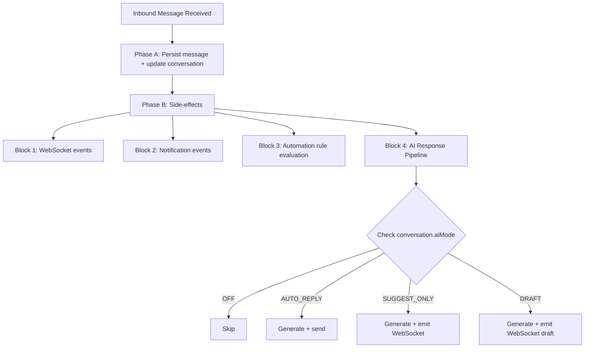

# AI Conversation System Specification

<Info>
Last Updated: 2026-03-04  
Status: Draft
</Info>

## Overview

The AI Conversation System enables automated and AI-assisted responses within the unified messaging module. It integrates with the existing webhook processing pipeline, conversation model, and template system to provide four modes of AI interaction controlled per-conversation.

### AI modes

| Mode           | Behavior                                                                                                    |
| -------------- | ----------------------------------------------------------------------------------------------------------- |
| `OFF`          | No AI involvement. Messages routed to human agents only.                                                    |
| `AUTO_REPLY`   | AI generates and sends responses automatically as `senderType = BOT`.                                       |
| `SUGGEST_ONLY` | AI generates a suggested response and emits it via WebSocket. Agent sees suggestion but must send manually. |
| `DRAFT`        | AI pre-fills the reply input box. Agent can edit before sending.                                            |

### Mode cascade (new conversations)

When a new conversation is created, the AI mode is determined by cascade:

```
ChannelAccount.defaultAiMode ?? Organization.settings.defaultAiMode ?? AiMode.OFF
```

<Note>
Agents can override the mode at any time via the conversation header toggle (`PUT /messaging/conversations/:id/ai-mode`).
</Note>

## AI decision pipeline

### Interception point

AI processing occurs in **Phase B** of the webhook processor, after the message has been persisted (Phase A). This ensures:

- Message persistence is never blocked by AI processing
- AI failures are non-critical (logged, not thrown)  
- The inbound message is available for context composition

### Pipeline flow



<Steps>
<Step title="Check conversation AI mode">
Determine if AI processing should occur based on the conversation's current AI mode setting.
</Step>

<Step title="Check escalation triggers">
Evaluate escalation triggers before generating. If escalation triggered → set aiMode = OFF, notify agent, skip.
</Step>

<Step title="Compose prompt context">
Build the context window from system prompts, knowledge base, CRM data, and conversation history.
</Step>

<Step title="Call LLM provider">
Make the API call to the configured LLM provider with the composed context.
</Step>

<Step title="Process response by mode">
Handle the LLM response according to the conversation's AI mode (auto-reply, suggest, or draft).
</Step>

<Step title="Increment counters">
Update conversation.aiMessageCount for tracking and escalation purposes.
</Step>
</Steps>

### Latency budget

<Warning>
**Target:** < 5 seconds end-to-end for AI response generation
</Warning>

**Breakdown:**
- Context composition: < 200ms
- LLM API call: < 4s (with timeout)
- Response processing + send: < 800ms

**Timeout handling:** If LLM call exceeds 8s, abort and log warning. Do not retry in the message pipeline — the opportunity has passed.

<Tip>
For high-volume deployments, AI processing can be moved to a dedicated pg-boss queue (`ai-response`) to decouple it from the webhook worker entirely.
</Tip>

## LLM integration architecture

### Provider abstraction

```typescript
interface LlmProvider {
  generateResponse(request: LlmRequest): Promise<LlmResponse>;
  countTokens(text: string): number;
}

interface LlmRequest {
  systemPrompt: string;
  messages: LlmMessage[];
  maxTokens: number;
  temperature: number;
}

interface LlmMessage {
  role: 'system' | 'user' | 'assistant';
  content: string;
}

interface LlmResponse {
  content: string;
  tokensUsed: { prompt: number; completion: number };
  model: string;
  finishReason: string;
}
```

### Supported providers

<CardGroup cols={3}>
<Card title="OpenAI" icon="openai">
GPT-4o, GPT-4o-mini via `openai` npm package
</Card>

<Card title="Google Gemini" icon="google">
Gemini 2.0 Flash, Pro via `@google/generative-ai`
</Card>

<Card title="Anthropic" icon="anthropic">
Claude Sonnet, Haiku via `@anthropic-ai/sdk`
</Card>
</CardGroup>

Provider selection is configured per organization via `Organization.settings`:

```typescript
interface OrganizationSettings {
  defaultAiMode?: AiMode;
  ai?: {
    provider: 'openai' | 'gemini' | 'anthropic';
    model: string;
    apiKey: string; // encrypted at rest
    maxTokensPerResponse: number; // default 500
    temperature: number; // default 0.7
  };
}
```

### Conversation context composition

The AI context window is built from multiple sources, ordered by priority:

1. **System Prompt** — from the matched AI_PROMPT MessageTemplate or default org-level prompt
2. **Knowledge Context** — relevant chunks from RAG pipeline via `EmbeddingService.findSimilar()`
3. **CRM Context** — person name, lead details (budget, timeline, intent), property interests
4. **Conversation History** — last N messages (configurable, default 20), formatted as user/assistant turns

### Token budget management

```
Total Budget = Organization.settings.ai.maxTokensPerResponse (completion)
                + calculated prompt tokens (context)

Context Priority (when trimming needed):
1. System prompt (never trimmed)
2. Last 5 messages (never trimmed)
3. CRM context (trimmed second)
4. Knowledge context (trimmed first)
5. Older messages (trimmed by removing oldest first)
```

<Info>
- Token counting uses the provider's tokenizer (tiktoken for OpenAI, approximate for others)
- Maximum context window: 8,000 tokens for prompt (conservative default)
- If total context exceeds budget, trim knowledge chunks first, then older messages
</Info>

## AI response generation service

### Service: `AiResponseService`

**Module:** `src/modules/messaging/services/ai-response.service.ts`  
**Registered in:** `MessagingModule.providers`

### Method: `processInboundMessage`

```typescript
async processInboundMessage(
  conversation: Conversation,
  inboundMessage: Message,
  em: EntityManager,
): Promise<void>
```

### Processing flow

<Tabs>
<Tab title="AUTO_REPLY">
- Create outbound Message with `senderType = SenderType.BOT`
- Create MessageOutbox entry (transactional outbox pattern)
- Update conversation stats (lastMessageAt, lastMessagePreview)
- Emit WebSocket `new-message` event
</Tab>

<Tab title="SUGGEST_ONLY">
- Emit WebSocket event `ai-suggestion` to the conversation room:
```typescript
{
  conversationId: string;
  suggestion: string;
  generatedAt: Date;
}
```
- Agent sees the suggestion in the UI and can accept/modify/dismiss
</Tab>

<Tab title="DRAFT">
- Emit WebSocket event `ai-draft` to the conversation room:
```typescript
{
  conversationId: string;
  draft: string;
  generatedAt: Date;
}
```
- Frontend pre-fills the reply input with the draft text
</Tab>
</Tabs>

### Error handling

<AccordionGroup>
<Accordion title="LLM API errors">
Log with full context, do not throw. Agent is not blocked.
</Accordion>

<Accordion title="Token limit exceeded">
Trim context and retry once with reduced context.
</Accordion>

<Accordion title="Provider unavailable">
Log error, emit WebSocket event `ai-error` to notify the agent.
</Accordion>

<Accordion title="Rate limiting">
Respect provider rate limits. If rate-limited, skip and log.
</Accordion>
</AccordionGroup>

### Default system prompt

```
You are a helpful real estate assistant for {organizationName}.
Answer questions about properties, pricing, availability, and services.
Be professional, concise, and helpful. If you cannot answer a question,
politely suggest the customer speak with a human agent.
Do not make up information about specific properties or pricing.
```

## Human escalation logic

### Escalation triggers

Escalation triggers are configurable per organization via `Organization.settings.ai.escalation`:

```typescript
interface EscalationConfig {
  maxAiMessages: number; // default 5 — escalate after N AI exchanges
  keywords: string[]; // e.g., ["speak to agent", "human", "manager"]
  sentimentThreshold?: number; // 0.0-1.0, escalate below threshold (future)
  confidenceThreshold?: number; // 0.0-1.0, escalate below threshold (future)
}
```

### Trigger evaluation order

<Steps>
<Step title="Keyword detection">
Check inbound message text against `escalation.keywords` (case-insensitive substring match). Fastest check, done first.
</Step>

<Step title="Message count">
If `conversation.aiMessageCount >= escalation.maxAiMessages`, escalate. Prevents infinite AI loops.
</Step>

<Step title="Sentiment analysis (Future)">
If implemented, check sentiment score of inbound message. Below threshold triggers escalation.
</Step>

<Step title="Confidence score (Future)">
If LLM response includes a confidence indicator below threshold, escalate after sending the response.
</Step>
</Steps>

### Escalation actions

When any trigger fires:

```typescript
// 1. Update conversation
conversation.aiMode = AiMode.OFF;
conversation.aiEscalatedAt = new Date();

// 2. Notify assigned agent (or team)
eventEmitter.emit('ai.escalated', {
  conversationId: conversation.id,
  organizationId: conversation.organization.id,
  reason: triggerType, // 'keyword' | 'max_messages' | 'sentiment' | 'confidence'
  triggerDetail: string, // the keyword matched, count reached, etc.
});

// 3. Emit WebSocket event
gateway.emitToConversation(conversation.id, 'ai-escalated', {
  conversationId: conversation.id,
  reason: triggerType,
  escalatedAt: conversation.aiEscalatedAt,
});

// 4. (Optional) Send a handoff message to the customer
// "I'm connecting you with a human agent who can help further."
```

<Note>
After escalation, an agent can manually re-enable AI via the conversation toggle (`PUT /messaging/conversations/:id/ai-mode`). This resets `aiEscalatedAt` to null and `aiMessageCount` to 0.
</Note>

## AI analytics

### Metrics to track

| Metric                            | Source                                                | Aggregation         |
| --------------------------------- | ----------------------------------------------------- | ------------------- |
| AI conversations count            | `conversation.aiMessageCount > 0`                     | Per org, per period |
| Human-only conversations          | `conversation.aiMessageCount = 0 AND aiMode = OFF`    | Per org, per period |
| Escalation count                  | `conversation.aiEscalatedAt IS NOT NULL`              | Per org, per period |
| Escalation rate                   | Escalated / Total AI conversations                   | Percentage          |
| Average AI messages per conversation | `AVG(aiMessageCount)` where `aiMessageCount > 0`   | Number              |
| Response time                     | Time from inbound message to AI response sent        | Milliseconds        |
| Token usage                       | Sum of prompt + completion tokens                     | Per org, per period |

<Check>
These metrics enable organizations to monitor AI performance, optimize escalation thresholds, and track cost efficiency across different AI modes.
</Check>