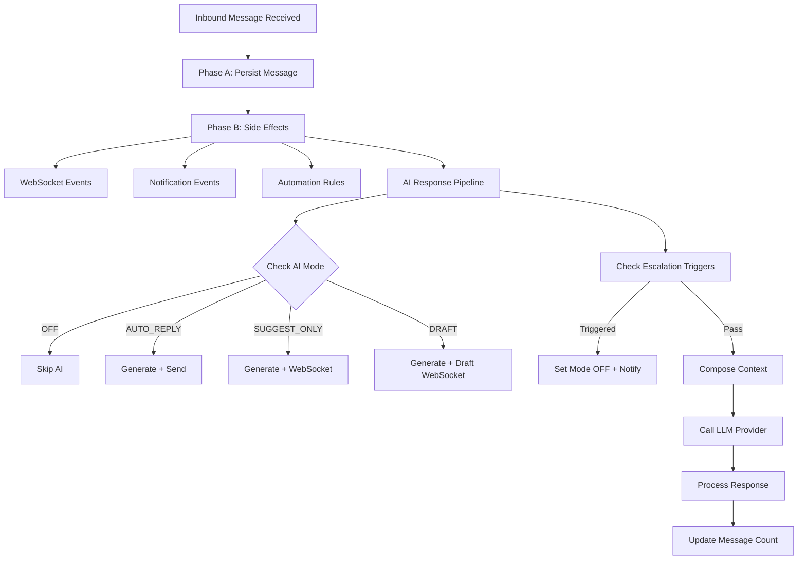

## Overview

The AI Conversation System enables automated and AI-assisted responses within the unified messaging module. It integrates with the existing webhook processing pipeline, conversation model, and template system to provide four modes of AI interaction controlled per-conversation.

<Note>
This system is designed to enhance agent productivity while maintaining conversation quality through intelligent escalation triggers and mode flexibility.
</Note>

### AI Modes

The system supports four distinct AI interaction modes:

<AccordionGroup>
  <Accordion title="OFF Mode">
    No AI involvement. Messages are routed to human agents only. This is the default fallback mode.
  </Accordion>
  
  <Accordion title="AUTO_REPLY Mode">
    AI generates and sends responses automatically with `senderType = BOT`. Fully automated customer interactions.
  </Accordion>
  
  <Accordion title="SUGGEST_ONLY Mode">
    AI generates suggested responses and emits them via WebSocket. Agents see suggestions but must send manually.
  </Accordion>
  
  <Accordion title="DRAFT Mode">
    AI pre-fills the reply input box with generated content. Agents can edit before sending.
  </Accordion>
</AccordionGroup>

### Mode Cascade for New Conversations

When a new conversation is created, the AI mode is determined by this cascade:

```
ChannelAccount.defaultAiMode ?? Organization.settings.defaultAiMode ?? AiMode.OFF
```

<Tip>
Agents can override the mode at any time via the conversation header toggle using `PUT /messaging/conversations/:id/ai-mode`.
</Tip>

## AI Decision Pipeline

### Interception Point

AI processing occurs in **Phase B** of the webhook processor, after the message has been persisted (Phase A). This ensures:

- Message persistence is never blocked by AI processing
- AI failures are non-critical (logged, not thrown)
- The inbound message is available for context composition

### Pipeline Flow



### Latency Budget

<Warning>
Strict performance requirements must be maintained to ensure real-time messaging experience.
</Warning>

| Component | Target | Maximum |
|-----------|--------|---------|
| Context composition | < 200ms | 500ms |
| LLM API call | < 4s | 8s |
| Response processing | < 800ms | 1.5s |
| **Total** | **< 5s** | **10s** |

**Timeout handling:** If LLM call exceeds 8s, abort and log warning. Do not retry in the message pipeline — the opportunity has passed.

### Queue-Based Alternative (Future)

For high-volume deployments, AI processing can be moved to a dedicated pg-boss queue (`ai-response`) to decouple it from the webhook worker entirely. The current Phase B approach is simpler and sufficient for initial rollout.

## LLM Integration Architecture

### Provider Abstraction

The system uses a provider abstraction pattern to support multiple LLM services:

<CodeGroup>
```typescript LLM Provider Interface
interface LlmProvider {
  generateResponse(request: LlmRequest): Promise<LlmResponse>;
  countTokens(text: string): number;
}

interface LlmRequest {
  systemPrompt: string;
  messages: LlmMessage[];
  maxTokens: number;
  temperature: number;
}

interface LlmMessage {
  role: 'system' | 'user' | 'assistant';
  content: string;
}

interface LlmResponse {
  content: string;
  tokensUsed: { prompt: number; completion: number };
  model: string;
  finishReason: string;
}
```

```typescript Organization Settings
interface OrganizationSettings {
  defaultAiMode?: AiMode;
  ai?: {
    provider: 'openai' | 'gemini' | 'anthropic';
    model: string;
    apiKey: string; // encrypted at rest
    maxTokensPerResponse: number; // default 500
    temperature: number; // default 0.7
  };
}
```
</CodeGroup>

### Supported Providers

<CardGroup cols={3}>
  <Card title="OpenAI" icon="brain">
    Uses `openai` npm package
    Models: GPT-4o, GPT-4o-mini
  </Card>
  <Card title="Google Gemini" icon="google">
    Uses `@google/generative-ai`
    Models: Gemini 2.0 Flash, Pro
  </Card>
  <Card title="Anthropic" icon="robot">
    Uses `@anthropic-ai/sdk`
    Models: Claude Sonnet, Haiku
  </Card>
</CardGroup>

### Conversation Context Composition

The AI context window is built from multiple sources, ordered by priority:

<Steps>
  <Step title="System Prompt">
    From the matched AI_PROMPT MessageTemplate via `findAiPromptTemplate()` or default org-level prompt
  </Step>
  
  <Step title="Knowledge Context">
    Relevant chunks from the RAG pipeline via `EmbeddingService.findSimilar()` (if available)
  </Step>
  
  <Step title="CRM Context">
    Person name, lead details (budget, timeline, intent), property interests
  </Step>
  
  <Step title="Conversation History">
    Last N messages (configurable, default 20), formatted as user/assistant turns
  </Step>
</Steps>

### Token Budget Management

<Info>
Total Budget = Organization.settings.ai.maxTokensPerResponse (completion) + calculated prompt tokens (context)
</Info>

**Context Priority (when trimming needed):**
1. System prompt (never trimmed)
2. Last 5 messages (never trimmed)
3. CRM context (trimmed second)
4. Knowledge context (trimmed first)
5. Older messages (trimmed by removing oldest first)

**Limits:**
- Token counting uses the provider's tokenizer (tiktoken for OpenAI, approximate for others)
- Maximum context window: 8,000 tokens for prompt (conservative default)
- If total context exceeds budget, trim knowledge chunks first, then older messages

## AI Response Generation Service

### Service Configuration

**Module:** `src/modules/messaging/services/ai-response.service.ts`  
**Registered in:** `MessagingModule.providers`

### Main Method: `processInboundMessage`

```typescript
async processInboundMessage(
  conversation: Conversation,
  inboundMessage: Message,
  em: EntityManager,
): Promise<void>
```

### Processing Flow

<Steps>
  <Step title="Mode Check">
    If `conversation.aiMode === AiMode.OFF`, return immediately.
  </Step>
  
  <Step title="Escalation Check">
    Evaluate escalation triggers before generating. If triggered, abort.
  </Step>
  
  <Step title="Find AI Prompt Template">
    ```typescript
    const template = await templateService.findAiPromptTemplate(
      conversation.organization.id,
      conversation.channelAccount.id,
      conversation.tags,
    );
    const systemPrompt = template?.systemPrompt?.prompt ?? template?.body ?? DEFAULT_SYSTEM_PROMPT;
    ```
  </Step>
  
  <Step title="Build Context">
    - Load last N messages for conversation
    - Load PersonChannel → Person → Lead context (if linked)
    - Query knowledge base for relevant chunks (if EmbeddingService available)
    - Compose `LlmRequest` with token budget enforcement
  </Step>
  
  <Step title="Call LLM Provider">
    ```typescript
    const llmResponse = await llmProvider.generateResponse(request);
    ```
  </Step>
  
  <Step title="Process by Mode">
    Handle response based on conversation's AI mode
  </Step>
  
  <Step title="Update Counters">
    ```typescript
    conversation.aiMessageCount += 1;
    await em.flush();
    ```
  </Step>
</Steps>

### Mode-Specific Processing

<Tabs>
  <Tab title="AUTO_REPLY">
    - Create outbound Message with `senderType = SenderType.BOT`
    - Create MessageOutbox entry (transactional outbox pattern)
    - Update conversation stats (lastMessageAt, lastMessagePreview)
    - Emit WebSocket `new-message` event
  </Tab>
  
  <Tab title="SUGGEST_ONLY">
    - Emit WebSocket event `ai-suggestion` to the conversation room:
    ```typescript
    {
      conversationId: string;
      suggestion: string;
      generatedAt: Date;
    }
    ```
    - Agent sees the suggestion in the UI and can accept/modify/dismiss
  </Tab>
  
  <Tab title="DRAFT">
    - Emit WebSocket event `ai-draft` to the conversation room:
    ```typescript
    {
      conversationId: string;
      draft: string;
      generatedAt: Date;
    }
    ```
    - Frontend pre-fills the reply input with the draft text
  </Tab>
</Tabs>

### Error Handling

<Warning>
All AI errors are non-critical and should not block agent workflow.
</Warning>

- **LLM API errors:** Log with full context, do not throw. Agent is not blocked.
- **Token limit exceeded:** Trim context and retry once with reduced context.
- **Provider unavailable:** Log error, emit WebSocket event `ai-error` to notify the agent.
- **Rate limiting:** Respect provider rate limits. If rate-limited, skip and log.

### Default System Prompt

```
You are a helpful real estate assistant for {organizationName}.
Answer questions about properties, pricing, availability, and services.
Be professional, concise, and helpful. If you cannot answer a question,
politely suggest the customer speak with a human agent.
Do not make up information about specific properties or pricing.
```

## Human Escalation Logic

### Escalation Triggers

Escalation triggers are configurable per organization via `Organization.settings.ai.escalation`:

```typescript
interface EscalationConfig {
  maxAiMessages: number; // default 5 — escalate after N AI exchanges
  keywords: string[]; // e.g., ["speak to agent", "human", "manager"]
  sentimentThreshold?: number; // 0.0-1.0, escalate below threshold (future)
  confidenceThreshold?: number; // 0.0-1.0, escalate below threshold (future)
}
```

### Trigger Evaluation Order

<Steps>
  <Step title="Keyword Detection">
    Check inbound message text against `escalation.keywords` (case-insensitive substring match). Fastest check, done first.
  </Step>
  
  <Step title="Message Count">
    If `conversation.aiMessageCount >= escalation.maxAiMessages`, escalate. Prevents infinite AI loops.
  </Step>
  
  <Step title="Sentiment Analysis (Future)">
    If implemented, check sentiment score of inbound message. Below threshold triggers escalation.
  </Step>
  
  <Step title="Confidence Score (Future)">
    If LLM response includes a confidence indicator below threshold, escalate after sending the response.
  </Step>
</Steps>

### Escalation Actions

When any trigger fires:

```typescript
// 1. Update conversation
conversation.aiMode = AiMode.OFF;
conversation.aiEscalatedAt = new Date();

// 2. Notify assigned agent (or team)
eventEmitter.emit('ai.escalated', {
  conversationId: conversation.id,
  organizationId: conversation.organization.id,
  reason: triggerType, // 'keyword' | 'max_messages' | 'sentiment' | 'confidence'
  triggerDetail: string, // the keyword matched, count reached, etc.
});

// 3. Emit WebSocket event
gateway.emitToConversation(conversation.id, 'ai-escalated', {
  conversationId: conversation.id,
  reason: triggerType,
  escalatedAt: conversation.aiEscalatedAt,
});

// 4. (Optional) Send a handoff message to the customer
// "I'm connecting you with a human agent who can help further."
```

### Re-enabling AI

<Check>
After escalation, an agent can manually re-enable AI via the conversation toggle (`PUT /messaging/conversations/:id/ai-mode`). This resets `aiEscalatedAt` to null and `aiMessageCount` to 0.
</Check>

## AI Analytics

### Metrics to Track

| Metric | Source | Aggregation |
|--------|--------|-------------|
| AI conversations count | `conversation.aiMessageCount > 0` | Per org, per period |
| Human-only conversations | `conversation.aiMessageCount = 0 AND aiMode = OFF` | Per org, per period |
| Escalation count | `conversation.aiEscalatedAt IS NOT NULL` | Per org, per period |
| Escalation rate | Escalated / Total AI conversations | Percentage |
| Average AI messages per conversation | `AVG(aiMessageCount)` where `aiMessageCount > 0` | Per org, per period |
| Response time by mode | WebSocket event timestamps | Per mode, per org |
| Token usage | Sum from `LlmResponse.tokensUsed` | Per org, per provider |
| Cost tracking | Tokens × provider pricing | Per org, per period |

### Implementation Notes

<Info>
Analytics data should be collected asynchronously via event listeners to avoid impacting real-time performance. Consider using a dedicated analytics service or data warehouse for complex queries.
</Info>