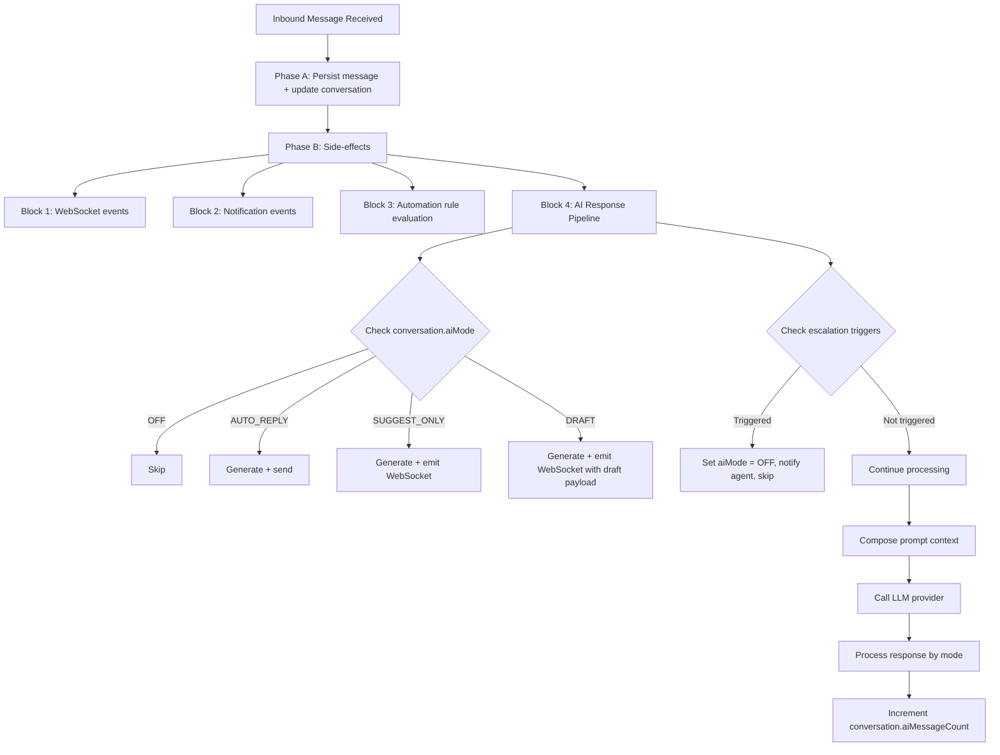

## Overview

The AI Conversation System enables automated and AI-assisted responses within the unified messaging module. It integrates with the existing webhook processing pipeline, conversation model, and template system to provide four modes of AI interaction controlled per-conversation.

<Info>
This system processes messages after they've been persisted to ensure message delivery is never blocked by AI processing failures.
</Info>

## AI Modes

The system supports four distinct AI interaction modes:

<CardGroup cols={2}>
  <Card title="OFF" icon="power-off">
    No AI involvement. Messages routed to human agents only.
  </Card>
  <Card title="AUTO_REPLY" icon="robot">
    AI generates and sends responses automatically as `senderType = BOT`.
  </Card>
  <Card title="SUGGEST_ONLY" icon="lightbulb">
    AI generates a suggested response and emits it via WebSocket. Agent sees suggestion but must send manually.
  </Card>
  <Card title="DRAFT" icon="edit">
    AI pre-fills the reply input box. Agent can edit before sending.
  </Card>
</CardGroup>

### Mode cascade for new conversations

When a new conversation is created, the AI mode is determined by the following cascade:

```
ChannelAccount.defaultAiMode ?? Organization.settings.defaultAiMode ?? AiMode.OFF
```

<Note>
Agents can override the mode at any time via the conversation header toggle using `PUT /messaging/conversations/:id/ai-mode`.
</Note>

## AI Decision Pipeline

### Interception point

AI processing occurs in **Phase B** of the webhook processor, after the message has been persisted (Phase A). This ensures:

- Message persistence is never blocked by AI processing
- AI failures are non-critical (logged, not thrown)
- The inbound message is available for context composition

### Pipeline flow



<Warning>
If escalation is triggered before generating a response, the AI mode is automatically set to OFF and the agent is notified.
</Warning>

### Latency budget

<Tabs>
  <Tab title="Target Performance">
    - **Target:** < 5 seconds end-to-end for AI response generation
    - **Context composition:** < 200ms
    - **LLM API call:** < 4s (with timeout)
    - **Response processing + send:** < 800ms
  </Tab>
  <Tab title="Timeout Handling">
    If LLM call exceeds 8 seconds:
    - Abort the request
    - Log warning with full context
    - Do not retry in the message pipeline
    - The opportunity for real-time response has passed
  </Tab>
</Tabs>

<Tip>
For high-volume deployments, AI processing can be moved to a dedicated pg-boss queue (`ai-response`) to decouple it from the webhook worker entirely.
</Tip>

## LLM Integration Architecture

### Provider abstraction

```typescript
interface LlmProvider {
  generateResponse(request: LlmRequest): Promise<LlmResponse>;
  countTokens(text: string): number;
}

interface LlmRequest {
  systemPrompt: string;
  messages: LlmMessage[];
  maxTokens: number;
  temperature: number;
}

interface LlmMessage {
  role: 'system' | 'user' | 'assistant';
  content: string;
}

interface LlmResponse {
  content: string;
  tokensUsed: { prompt: number; completion: number };
  model: string;
  finishReason: string;
}
```

### Supported providers

| Provider      | SDK                     | Models Available      |
| ------------- | ----------------------- | -------------------- |
| OpenAI        | `openai` npm package    | GPT-4o, GPT-4o-mini  |
| Google Gemini | `@google/generative-ai` | Gemini 2.0 Flash, Pro |
| Anthropic     | `@anthropic-ai/sdk`     | Claude Sonnet, Haiku |

Provider configuration is stored per organization:

```typescript
interface OrganizationSettings {
  defaultAiMode?: AiMode;
  ai?: {
    provider: 'openai' | 'gemini' | 'anthropic';
    model: string;
    apiKey: string; // encrypted at rest
    maxTokensPerResponse: number; // default 500
    temperature: number; // default 0.7
  };
}
```

### Conversation context composition

The AI context window is built from multiple sources, ordered by priority:

<Steps>
  <Step title="System Prompt">
    From the matched AI_PROMPT MessageTemplate (via `findAiPromptTemplate`) or a default org-level prompt
  </Step>
  <Step title="Knowledge Context">
    Relevant chunks from the RAG pipeline via `EmbeddingService.findSimilar()` (if available)
  </Step>
  <Step title="CRM Context">
    Person name, lead details (budget, timeline, intent), property interests
  </Step>
  <Step title="Conversation History">
    Last N messages (configurable, default 20), formatted as user/assistant turns
  </Step>
</Steps>

### Token budget management

```
Total Budget = Organization.settings.ai.maxTokensPerResponse (completion)
                + calculated prompt tokens (context)
```

**Context Priority (when trimming needed):**

1. **System prompt** (never trimmed)
2. **Last 5 messages** (never trimmed)  
3. **CRM context** (trimmed second)
4. **Knowledge context** (trimmed first)
5. **Older messages** (trimmed by removing oldest first)

<Note>
- Token counting uses the provider's tokenizer (tiktoken for OpenAI, approximate for others)
- Maximum context window: 8,000 tokens for prompt (conservative default)
- If total context exceeds budget, trim knowledge chunks first, then older messages
</Note>

## AI Response Generation Service

### Service implementation

**Module:** `src/modules/messaging/services/ai-response.service.ts`  
**Registered in:** `MessagingModule.providers`

### Core method: `processInboundMessage`

```typescript
async processInboundMessage(
  conversation: Conversation,
  inboundMessage: Message,
  em: EntityManager,
): Promise<void>
```

### Processing flow

<Steps>
  <Step title="Mode Check">
    If `conversation.aiMode === AiMode.OFF`, return immediately.
  </Step>
  
  <Step title="Escalation Check">
    Evaluate escalation triggers before generating. If triggered, abort processing.
  </Step>
  
  <Step title="Find AI Prompt Template">
    ```typescript
    const template = await templateService.findAiPromptTemplate(
      conversation.organization.id,
      conversation.channelAccount.id,
      conversation.tags,
    );
    const systemPrompt = template?.systemPrompt?.prompt ?? template?.body ?? DEFAULT_SYSTEM_PROMPT;
    ```
  </Step>
  
  <Step title="Build Context">
    - Load last N messages for conversation
    - Load PersonChannel → Person → Lead context (if linked)
    - Query knowledge base for relevant chunks (if EmbeddingService available)
    - Compose `LlmRequest` with token budget enforcement
  </Step>
  
  <Step title="Call LLM Provider">
    ```typescript
    const llmResponse = await llmProvider.generateResponse(request);
    ```
  </Step>
  
  <Step title="Process by Mode">
    <Tabs>
      <Tab title="AUTO_REPLY">
        - Create outbound Message with `senderType = SenderType.BOT`
        - Create MessageOutbox entry (transactional outbox pattern)
        - Update conversation stats (lastMessageAt, lastMessagePreview)
        - Emit WebSocket `new-message` event
      </Tab>
      <Tab title="SUGGEST_ONLY">
        Emit WebSocket event `ai-suggestion` to the conversation room:
        ```typescript
        {
          conversationId: string;
          suggestion: string;
          generatedAt: Date;
        }
        ```
        Agent sees the suggestion in the UI and can accept/modify/dismiss
      </Tab>
      <Tab title="DRAFT">
        Emit WebSocket event `ai-draft` to the conversation room:
        ```typescript
        {
          conversationId: string;
          draft: string;
          generatedAt: Date;
        }
        ```
        Frontend pre-fills the reply input with the draft text
      </Tab>
    </Tabs>
  </Step>
  
  <Step title="Update Counters">
    ```typescript
    conversation.aiMessageCount += 1;
    await em.flush();
    ```
  </Step>
</Steps>

### Error handling

<AccordionGroup>
  <Accordion title="LLM API Errors">
    Log with full context, do not throw. Agent is not blocked from continuing the conversation.
  </Accordion>
  
  <Accordion title="Token Limit Exceeded">
    Trim context and retry once with reduced context. If still exceeding, skip AI processing.
  </Accordion>
  
  <Accordion title="Provider Unavailable">
    Log error and emit WebSocket event `ai-error` to notify the agent of the issue.
  </Accordion>
  
  <Accordion title="Rate Limiting">
    Respect provider rate limits. If rate-limited, skip processing and log the event.
  </Accordion>
</AccordionGroup>

### Default system prompt

```
You are a helpful real estate assistant for {organizationName}.
Answer questions about properties, pricing, availability, and services.
Be professional, concise, and helpful. If you cannot answer a question,
politely suggest the customer speak with a human agent.
Do not make up information about specific properties or pricing.
```

## Human Escalation Logic

### Escalation triggers

Escalation triggers are configurable per organization via `Organization.settings.ai.escalation`:

```typescript
interface EscalationConfig {
  maxAiMessages: number; // default 5 — escalate after N AI exchanges
  keywords: string[]; // e.g., ["speak to agent", "human", "manager"]
  sentimentThreshold?: number; // 0.0-1.0, escalate below threshold (future)
  confidenceThreshold?: number; // 0.0-1.0, escalate below threshold (future)
}
```

### Trigger evaluation order

<Steps>
  <Step title="Keyword Detection">
    Check inbound message text against `escalation.keywords` (case-insensitive substring match). Fastest check, done first.
  </Step>
  
  <Step title="Message Count">
    If `conversation.aiMessageCount >= escalation.maxAiMessages`, escalate. Prevents infinite AI loops.
  </Step>
  
  <Step title="Sentiment Analysis (Future)">
    If implemented, check sentiment score of inbound message. Below threshold triggers escalation.
  </Step>
  
  <Step title="Confidence Score (Future)">
    If LLM response includes a confidence indicator below threshold, escalate after sending the response.
  </Step>
</Steps>

### Escalation actions

When any trigger fires:

```typescript
// 1. Update conversation
conversation.aiMode = AiMode.OFF;
conversation.aiEscalatedAt = new Date();

// 2. Notify assigned agent (or team)
eventEmitter.emit('ai.escalated', {
  conversationId: conversation.id,
  organizationId: conversation.organization.id,
  reason: triggerType, // 'keyword' | 'max_messages' | 'sentiment' | 'confidence'
  triggerDetail: string, // the keyword matched, count reached, etc.
});

// 3. Emit WebSocket event
gateway.emitToConversation(conversation.id, 'ai-escalated', {
  conversationId: conversation.id,
  reason: triggerType,
  escalatedAt: conversation.aiEscalatedAt,
});

// 4. (Optional) Send a handoff message to the customer
// "I'm connecting you with a human agent who can help further."
```

<Check>
After escalation, an agent can manually re-enable AI via the conversation toggle (`PUT /messaging/conversations/:id/ai-mode`). This resets `aiEscalatedAt` to null and `aiMessageCount` to 0.
</Check>

## AI Analytics

### Metrics to track

| Metric | Source | Aggregation |
|--------|--------|-------------|
| AI conversations count | `conversation.aiMessageCount > 0` | Per org, per period |
| Human-only conversations | `conversation.aiMessageCount = 0 AND aiMode = OFF` | Per org, per period |
| Escalation count | `conversation.aiEscalatedAt IS NOT NULL` | Per org, per period |
| Escalation rate | Escalated / Total AI conversations | Per org, per period |
| Average AI messages per conversation | `AVG(aiMessageCount)` where `aiMessageCount > 0` | Per org, per period |
| LLM token usage | Sum from `LlmResponse.tokensUsed` | Per org, per provider |
| Response generation latency | Timing from AI pipeline | P50, P95, P99 |

<Note>
Analytics data should be aggregated daily and stored in a separate analytics table to avoid impacting operational queries on the main conversation table.
</Note>