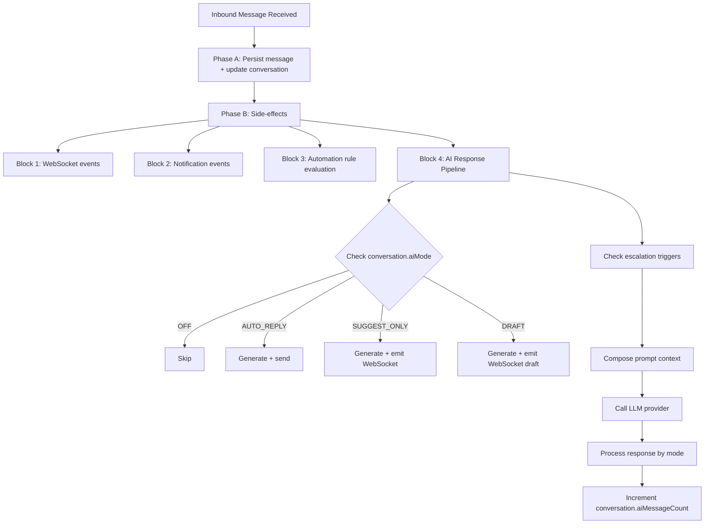

# AI Conversation System Specification v27

<Info>
Last Updated: 2026-05-23  
Status: Draft
</Info>

## Overview

The AI Conversation System enables automated and AI-assisted responses within the unified messaging module. It integrates with the existing webhook processing pipeline, conversation model, and template system to provide four modes of AI interaction controlled per-conversation.

<Warning>
**Vocabulary note:** Both the messaging AI and the internal CRM assistant must speak **"assignment" / "assignee" / "assigned to"** to users — never "stakeholder", even when the underlying DTO field is still named `stakeholders`. See `Docs/STAKEHOLDER_SYSTEM.md` → "Vocabulary" and `Docs/AI_MODULE_SPECIFICATION.md` → "Assignment vocabulary (v0.11)".
</Warning>

## Internal Assistant Boundary

This specification covers customer-facing messaging AI: inbound messages, conversation modes, suggestions, drafts, and optional auto-replies inside the messaging pipeline. The native Propwise CRM sidebar assistant is a separate internal-user surface under `src/modules/ai-assistant` with `POST /v1/ai-assistant/chat`.

<Note>
The internal assistant:

- Uses `ai_conversation`, `ai_message`, and `ai_tool_call` tables, not the messaging `conversation` / `message` tables
- Runs with the current user's tenant token and never uses a service-account "see everything" mode
- Fetches CRM context through existing services and resource checks instead of accepting browser-supplied entity payloads
- Is read-only in V1; drafts and suggestions are allowed, but sending messages or mutating CRM records requires a later explicit approval protocol
- Enforces a **scope + refusal + groundedness + Propwise-glossary + multi-turn-follow-ups + lead-routing** system prompt
</Note>

Provider abstractions and cost/budget controls may converge later, but prompt versions and runtime policies remain distinct from customer messaging AI prompts.

## AI Modes

| Mode           | Behavior                                                                                                    |
| -------------- | ----------------------------------------------------------------------------------------------------------- |
| `OFF`          | No AI involvement. Messages routed to human agents only.                                                    |
| `AUTO_REPLY`   | AI generates and sends responses automatically as `senderType = BOT`.                                       |
| `SUGGEST_ONLY` | AI generates a suggested response and emits it via WebSocket. Agent sees suggestion but must send manually. |
| `DRAFT`        | AI pre-fills the reply input box. Agent can edit before sending.                                            |

### Mode Cascade (New Conversations)

When a new conversation is created, the AI mode is determined by cascade:

```
ChannelAccount.defaultAiMode ?? Organization.settings.defaultAiMode ?? AiMode.OFF
```

<Tip>
Agents can override the mode at any time via the conversation header toggle (`PUT /messaging/conversations/:id/ai-mode`).
</Tip>

## AI Decision Pipeline

### Interception Point

AI processing occurs in **Phase B** of the webhook processor, after the message has been persisted (Phase A). This ensures:

- Message persistence is never blocked by AI processing
- AI failures are non-critical (logged, not thrown)
- The inbound message is available for context composition

### Pipeline Flow



<Steps>
<Step title="Message persistence">
Phase A ensures the inbound message is persisted and conversation is updated transactionally
</Step>

<Step title="Side-effect processing">
Phase B handles non-critical operations including AI response generation
</Step>

<Step title="AI mode evaluation">
Check the conversation's AI mode and proceed accordingly
</Step>

<Step title="Response generation">
Generate and process the AI response based on the selected mode
</Step>
</Steps>

### Latency Budget

<CardGroup cols={2}>
<Card title="Target Performance" icon="clock">
- **Total:** < 5 seconds end-to-end
- **Context composition:** < 200ms
- **LLM API call:** < 4s (with timeout)
- **Response processing:** < 800ms
</Card>

<Card title="Timeout Handling" icon="triangle-exclamation">
If LLM call exceeds 8s, abort and log warning. Do not retry in the message pipeline — the opportunity has passed.
</Card>
</CardGroup>

### Queue-Based Alternative (Future)

<Info>
For high-volume deployments, AI processing can be moved to a dedicated pg-boss queue (`ai-response`) to decouple it from the webhook worker entirely. The current Phase B approach is simpler and sufficient for initial rollout.
</Info>

## LLM Integration Architecture

### Provider Abstraction

```typescript
interface LlmProvider {
  generateResponse(request: LlmRequest): Promise<LlmResponse>;
  countTokens(text: string): number;
}

interface LlmRequest {
  systemPrompt: string;
  messages: LlmMessage[];
  maxTokens: number;
  temperature: number;
}

interface LlmMessage {
  role: 'system' | 'user' | 'assistant';
  content: string;
}

interface LlmResponse {
  content: string;
  tokensUsed: { prompt: number; completion: number };
  model: string;
  finishReason: string;
}
```

### Supported Providers

| Provider      | SDK                     | Notes                 |
| ------------- | ----------------------- | --------------------- |
| OpenAI        | `openai` npm package    | GPT-4o, GPT-4o-mini   |
| Google Gemini | `@google/generative-ai` | Gemini 2.0 Flash, Pro |
| Anthropic     | `@anthropic-ai/sdk`     | Claude Sonnet, Haiku  |

Provider selection is configured per organization via `Organization.settings`:

```typescript
interface OrganizationSettings {
  defaultAiMode?: AiMode;
  ai?: {
    provider: 'openai' | 'gemini' | 'anthropic';
    model: string;
    apiKey: string; // encrypted at rest
    maxTokensPerResponse: number; // default 500
    temperature: number; // default 0.7
  };
}
```

### Conversation Context Composition

The AI context window is built from multiple sources, ordered by priority:

<Steps>
<Step title="System Prompt">
From the matched AI_PROMPT MessageTemplate (via `findAiPromptTemplate`); when no template matches, the hardcoded fallback string is used
</Step>

<Step title="Knowledge Context">
Relevant chunks from the RAG pipeline via `EmbeddingService.generateEmbedding(query, apiKey)` + pgvector cosine search on `knowledge_chunks`
</Step>

<Step title="CRM Context">
Person name, lead details (budget, timeline, intent), property interests
</Step>

<Step title="Conversation History">
Last N messages (configurable, default 20), formatted as user/assistant turns
</Step>
</Steps>

### Token Budget Management

```
Total Budget = Organization.settings.ai.maxTokensPerResponse (completion)
                + calculated prompt tokens (context)

Context Priority (when trimming needed):
1. System prompt (never trimmed)
2. Last 5 messages (never trimmed)
3. CRM context (trimmed second)
4. Knowledge context (trimmed first)
5. Older messages (trimmed by removing oldest first)
```

<Note>
- Token counting uses the provider's tokenizer (tiktoken for OpenAI, approximate for others)
- Maximum context window: 8,000 tokens for prompt (conservative default)
- If total context exceeds budget, trim knowledge chunks first, then older messages
</Note>

## AI Response Generation Service

### Service: `AiResponseService`

**Module:** `src/modules/messaging/services/ai-response.service.ts`  
**Registered in:** `MessagingModule.providers`

### Method: `processInboundMessage`

```typescript
async processInboundMessage(
  conversation: Conversation,
  inboundMessage: Message,
  em: EntityManager,
): Promise<void>
```

### Processing Flow

<Steps>
<Step title="Mode Check">
If `conversation.aiMode === AiMode.OFF`, return immediately
</Step>

<Step title="Escalation Check">
Evaluate escalation triggers before generating. If triggered, abort
</Step>

<Step title="Find AI Prompt Template">
```typescript
const template = await templateService.findAiPromptTemplate(
  conversation.organization.id,
  conversation.channelAccount.id,
  conversation.tags,
);
const systemPrompt = template?.systemPrompt?.prompt ?? template?.body ?? DEFAULT_SYSTEM_PROMPT;
```
</Step>

<Step title="Build Context">
- Load last N messages for conversation
- Load PersonChannel → Person → Lead context (if linked)
- Query knowledge base for relevant chunks (if EmbeddingService available)
- Compose `LlmRequest` with token budget enforcement
</Step>

<Step title="Call LLM Provider">
```typescript
const llmResponse = await llmProvider.generateResponse(request);
```
</Step>

<Step title="Process by Mode">
<Tabs>
<Tab title="AUTO_REPLY">
- Create outbound Message with `senderType = SenderType.BOT`
- Create MessageOutbox entry (transactional outbox pattern)
- Update conversation stats (lastMessageAt, lastMessagePreview)
- Emit WebSocket `new-message` event
</Tab>

<Tab title="SUGGEST_ONLY">
Emit WebSocket event `ai-suggestion` to the conversation room:
```typescript
{
  conversationId: string;
  suggestion: string;
  generatedAt: Date;
}
```
Agent sees the suggestion in the UI and can accept/modify/dismiss
</Tab>

<Tab title="DRAFT">
Emit WebSocket event `ai-draft` to the conversation room:
```typescript
{
  conversationId: string;
  draft: string;
  generatedAt: Date;
}
```
Frontend pre-fills the reply input with the draft text
</Tab>
</Tabs>
</Step>

<Step title="Update Counters">
```typescript
conversation.aiMessageCount += 1;
await em.flush();
```
</Step>
</Steps>

### Error Handling

<AccordionGroup>
<Accordion title="LLM API Errors">
Log with full context, do not throw. Agent is not blocked.
</Accordion>

<Accordion title="Token Limit Exceeded">
Trim context and retry once with reduced context.
</Accordion>

<Accordion title="Provider Unavailable">
Log error, emit WebSocket event `ai-error` to notify the agent.
</Accordion>

<Accordion title="Rate Limiting">
Respect provider rate limits. If rate-limited, skip and log.
</Accordion>
</AccordionGroup>

### Default Fallback Prompt

When `findAiPromptTemplate(...)` finds no matching `AI_PROMPT` `MessageTemplate` for the conversation, the conversation pipeline falls back to this hardcoded string:

<Warning>
This is **not** a DB row — the `SystemPrompt` entity that previously stored an org-overridable default has been removed.
</Warning>

```
You are a helpful real estate assistant for {organization_name}. 
Respond professionally and helpfully to customer inquiries about properties, 
viewings, and real estate services. Keep responses concise and action-oriented.
```