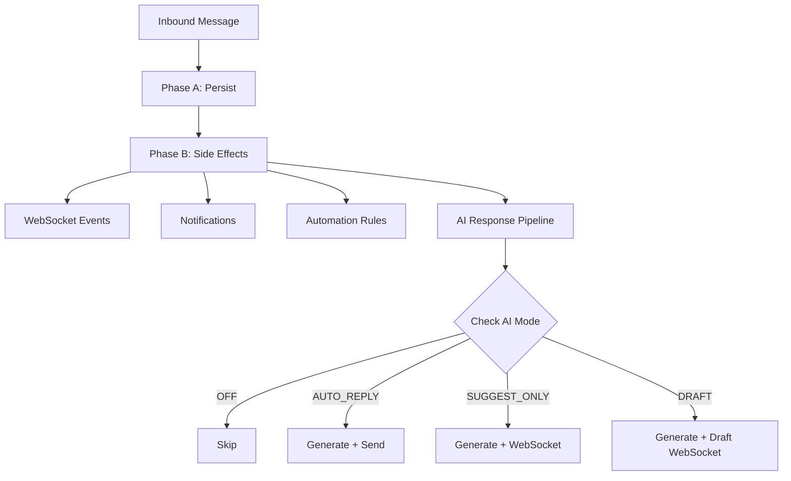

## Overview

The AI Conversation System enables automated and AI-assisted responses within the unified messaging module. It integrates with the existing webhook processing pipeline, conversation model, and template system to provide four modes of AI interaction controlled per-conversation.

## AI Interaction Modes

<AccordionGroup>
  <Accordion title="OFF - No AI involvement">
    Messages are routed to human agents only. The AI system is completely disabled for the conversation.
  </Accordion>
  
  <Accordion title="AUTO_REPLY - Fully automated responses">
    AI generates and sends responses automatically with `senderType = BOT`. The customer receives immediate automated replies.
  </Accordion>
  
  <Accordion title="SUGGEST_ONLY - AI-assisted suggestions">
    AI generates a suggested response and emits it via WebSocket. The agent sees the suggestion but must send it manually.
  </Accordion>
  
  <Accordion title="DRAFT - Pre-filled responses">
    AI pre-fills the reply input box. The agent can edit the draft before sending to the customer.
  </Accordion>
</AccordionGroup>

### Mode Selection Cascade

When a new conversation is created, the AI mode is determined by this cascade:

```
ChannelAccount.defaultAiMode → Organization.settings.defaultAiMode → AiMode.OFF
```

<Note>
Agents can override the mode at any time via the conversation header toggle using `PUT /messaging/conversations/:id/ai-mode`.
</Note>

## AI Processing Pipeline

### Integration Point

AI processing occurs in **Phase B** of the webhook processor, after message persistence. This ensures:

- Message persistence is never blocked by AI processing
- AI failures are non-critical (logged, not thrown)
- The inbound message is available for context composition

### Pipeline Flow

<Steps>
  <Step title="Message Reception">
    Inbound message is received and enters Phase A for persistence
  </Step>
  
  <Step title="Message Persistence">
    Message is persisted and conversation is updated (transactional)
  </Step>
  
  <Step title="Side Effects Processing">
    Non-critical operations including WebSocket events, notifications, and automation rules
  </Step>
  
  <Step title="AI Response Pipeline">
    AI processing begins with mode checking and escalation evaluation
  </Step>
</Steps>



### Performance Requirements

<CardGroup cols={2}>
  <Card title="Target Latency" icon="clock">
    < 5 seconds end-to-end for AI response generation
  </Card>
  
  <Card title="Timeout Handling" icon="warning">
    8 second timeout on LLM calls with abort and warning log
  </Card>
</CardGroup>

**Latency Breakdown:**
- Context composition: < 200ms
- LLM API call: < 4s (with timeout)
- Response processing + send: < 800ms

<Warning>
If LLM call exceeds 8s, abort and log warning. Do not retry in the message pipeline — the opportunity has passed.
</Warning>

## LLM Provider Integration

### Provider Interface

```typescript
interface LlmProvider {
  generateResponse(request: LlmRequest): Promise<LlmResponse>;
  countTokens(text: string): number;
}

interface LlmRequest {
  systemPrompt: string;
  messages: LlmMessage[];
  maxTokens: number;
  temperature: number;
}

interface LlmResponse {
  content: string;
  tokensUsed: { prompt: number; completion: number };
  model: string;
  finishReason: string;
}
```

### Supported Providers

<Tabs>
  <Tab title="OpenAI">
    - **SDK:** `openai` npm package
    - **Models:** GPT-4o, GPT-4o-mini
    - **Features:** Full chat completions API support
  </Tab>
  
  <Tab title="Google Gemini">
    - **SDK:** `@google/generative-ai`
    - **Models:** Gemini 2.0 Flash, Pro
    - **Features:** Multi-modal capabilities
  </Tab>
  
  <Tab title="Anthropic">
    - **SDK:** `@anthropic-ai/sdk`
    - **Models:** Claude Sonnet, Haiku
    - **Features:** Large context windows
  </Tab>
</Tabs>

### Organization Configuration

```typescript
interface OrganizationSettings {
  defaultAiMode?: AiMode;
  ai?: {
    provider: 'openai' | 'gemini' | 'anthropic';
    model: string;
    apiKey: string; // encrypted at rest
    maxTokensPerResponse: number; // default 500
    temperature: number; // default 0.7
  };
}
```

## Context Composition

### Context Sources (Priority Order)

<Steps>
  <Step title="System Prompt">
    From matched AI_PROMPT MessageTemplate or default org-level prompt
  </Step>
  
  <Step title="Knowledge Context">
    Relevant chunks from RAG pipeline via `EmbeddingService.findSimilar()`
  </Step>
  
  <Step title="CRM Context">
    Person name, lead details (budget, timeline, intent), property interests
  </Step>
  
  <Step title="Conversation History">
    Last N messages (configurable, default 20), formatted as user/assistant turns
  </Step>
</Steps>

### Token Budget Management

```
Total Budget = maxTokensPerResponse (completion) + calculated prompt tokens (context)

Context Trimming Priority:
1. System prompt (never trimmed)
2. Last 5 messages (never trimmed)  
3. CRM context (trimmed second)
4. Knowledge context (trimmed first)
5. Older messages (trimmed oldest first)
```

<Info>
Maximum context window: 8,000 tokens for prompt (conservative default). Token counting uses provider-specific tokenizers when available.
</Info>

## AI Response Service

### Service Implementation

**Module:** `src/modules/messaging/services/ai-response.service.ts`
**Registration:** `MessagingModule.providers`

### Core Method

```typescript
async processInboundMessage(
  conversation: Conversation,
  inboundMessage: Message,
  em: EntityManager,
): Promise<void>
```

### Processing Logic

<Steps>
  <Step title="Mode Validation">
    Check if `conversation.aiMode === AiMode.OFF` and return if disabled
  </Step>
  
  <Step title="Escalation Check">
    Evaluate escalation triggers before generating response
  </Step>
  
  <Step title="Template Resolution">
    Find appropriate AI prompt template using organization and channel context
  </Step>
  
  <Step title="Context Building">
    Compose LLM request with conversation history, CRM data, and knowledge base
  </Step>
  
  <Step title="LLM Generation">
    Call configured LLM provider with assembled context
  </Step>
  
  <Step title="Mode-Specific Processing">
    Handle response based on conversation AI mode
  </Step>
  
  <Step title="Counter Updates">
    Increment `conversation.aiMessageCount`
  </Step>
</Steps>

### Mode-Specific Response Handling

<Tabs>
  <Tab title="AUTO_REPLY">
    ```typescript
    // Create outbound message
    const message = new Message({
      senderType: SenderType.BOT,
      content: llmResponse.content,
      // ... other properties
    });
    
    // Create outbox entry
    const outbox = new MessageOutbox({ message });
    
    // Update conversation stats
    conversation.lastMessageAt = new Date();
    conversation.lastMessagePreview = truncate(llmResponse.content);
    
    // Emit WebSocket event
    gateway.emitToConversation(conversationId, 'new-message', messageData);
    ```
  </Tab>
  
  <Tab title="SUGGEST_ONLY">
    ```typescript
    // Emit suggestion to agents
    gateway.emitToConversation(conversationId, 'ai-suggestion', {
      conversationId,
      suggestion: llmResponse.content,
      generatedAt: new Date(),
    });
    ```
  </Tab>
  
  <Tab title="DRAFT">
    ```typescript
    // Emit draft to pre-fill input
    gateway.emitToConversation(conversationId, 'ai-draft', {
      conversationId,
      draft: llmResponse.content,
      generatedAt: new Date(),
    });
    ```
  </Tab>
</Tabs>

### Error Handling Strategy

<Warning>
All LLM-related errors are caught and logged without throwing. Agents are never blocked by AI failures.
</Warning>

- **API Errors:** Log with full context, continue normal flow
- **Token Limits:** Trim context and retry once with reduced context  
- **Rate Limiting:** Respect provider limits, skip and log if rate-limited
- **Provider Unavailable:** Emit WebSocket `ai-error` event to notify agent

### Default System Prompt

```
You are a helpful real estate assistant for {organizationName}.
Answer questions about properties, pricing, availability, and services.
Be professional, concise, and helpful. If you cannot answer a question,
politely suggest the customer speak with a human agent.
Do not make up information about specific properties or pricing.
```

## Human Escalation System

### Escalation Triggers Configuration

```typescript
interface EscalationConfig {
  maxAiMessages: number; // default 5 — escalate after N AI exchanges
  keywords: string[]; // e.g., ["speak to agent", "human", "manager"]
  sentimentThreshold?: number; // 0.0-1.0, escalate below threshold (future)
  confidenceThreshold?: number; // 0.0-1.0, escalate below threshold (future)
}
```

### Trigger Evaluation Order

<Steps>
  <Step title="Keyword Detection">
    Check inbound message against escalation keywords (case-insensitive)
  </Step>
  
  <Step title="Message Count Limit">
    Escalate if `conversation.aiMessageCount >= maxAiMessages`
  </Step>
  
  <Step title="Sentiment Analysis">
    (Future) Check sentiment score below threshold
  </Step>
  
  <Step title="Confidence Score">
    (Future) Escalate if LLM confidence below threshold
  </Step>
</Steps>

### Escalation Actions

When any trigger fires:

<CodeGroup>
```typescript Conversation Updates
conversation.aiMode = AiMode.OFF;
conversation.aiEscalatedAt = new Date();
```

```typescript Event Emission
eventEmitter.emit('ai.escalated', {
  conversationId: conversation.id,
  organizationId: conversation.organization.id,
  reason: triggerType,
  triggerDetail: matchedKeyword,
});
```

```typescript WebSocket Notification
gateway.emitToConversation(conversation.id, 'ai-escalated', {
  conversationId: conversation.id,
  reason: triggerType,
  escalatedAt: conversation.aiEscalatedAt,
});
```
</CodeGroup>

<Tip>
After escalation, agents can manually re-enable AI via the conversation toggle. This resets `aiEscalatedAt` to null and `aiMessageCount` to 0.
</Tip>

## Analytics and Monitoring

### Key Metrics

<CardGroup cols={2}>
  <Card title="AI Conversation Count" icon="robot">
    Conversations with `aiMessageCount > 0`
  </Card>
  
  <Card title="Human-Only Count" icon="user">
    Conversations with `aiMessageCount = 0 AND aiMode = OFF`
  </Card>
  
  <Card title="Escalation Count" icon="arrow-up">
    Conversations with `aiEscalatedAt IS NOT NULL`
  </Card>
  
  <Card title="Escalation Rate" icon="percentage">
    Escalated conversations / Total AI conversations
  </Card>
</CardGroup>

### Performance Monitoring

| Metric | Description | Alert Threshold |
| --- | --- | --- |
| Response Time | End-to-end AI response generation | > 5 seconds |
| Error Rate | Failed AI generations / Total attempts | > 5% |
| Token Usage | Average tokens per response | > 80% of limit |
| Escalation Rate | Escalations / AI conversations | > 20% |

<Check>
The AI conversation system provides comprehensive analytics to help organizations optimize their AI settings and monitor customer satisfaction.
</Check>