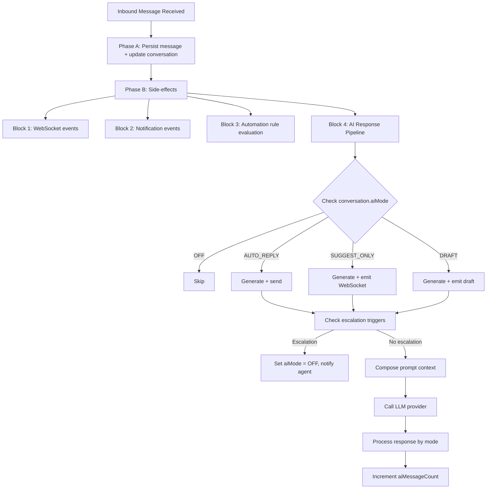

## Overview

The AI Conversation System enables automated and AI-assisted responses within the unified messaging module. It integrates with the existing webhook processing pipeline, conversation model, and template system to provide four modes of AI interaction controlled per-conversation.

<Note>
**Vocabulary note:** Both the messaging AI and the internal CRM assistant must speak **"assignment" / "assignee" / "assigned to"** to users — never "stakeholder", even when the underlying DTO field is still named `stakeholders`. See `Docs/STAKEHOLDER_SYSTEM.md` → "Vocabulary" and `Docs/AI_MODULE_SPECIFICATION.md` → "Assignment vocabulary (v0.11)".
</Note>

## Internal Assistant Boundary

This specification covers customer-facing messaging AI: inbound messages, conversation modes, suggestions, drafts, and optional auto-replies inside the messaging pipeline. The native Propwise CRM sidebar assistant is a separate internal-user surface under `src/modules/ai-assistant` with `POST /v1/ai-assistant/chat`.

<AccordionGroup>
  <Accordion title="Internal Assistant Characteristics">
    The internal assistant:

    - Uses `ai_conversation`, `ai_message`, and `ai_tool_call` tables, not the messaging `conversation` / `message` tables
    - Runs with the current user's tenant token and never uses a service-account "see everything" mode
    - Fetches CRM context through existing services and resource checks instead of accepting browser-supplied entity payloads
    - Is read-only in V1; drafts and suggestions are allowed, but sending messages or mutating CRM records requires a later explicit approval protocol
    - Enforces a **scope + refusal + groundedness + Propwise-glossary + multi-turn-follow-ups + lead-routing** system prompt

    **Current version:** `AI_ASSISTANT_SYSTEM_PROMPT_VERSION = crm-assistant-v0.6-lead-routing`

    The multi-turn-follow-ups contract was introduced in `v0.5-multi-turn-affirmation`. Out-of-scope topics (markets, weather, news, general world knowledge, personal advice) are declined without tool calls; factual claims about specific leads/deals/contacts/properties must be backed by trusted context or a same-turn tool result.
  </Accordion>

  <Accordion title="Multi-turn Behavior">
    Short affirmatives ("yes do that", "ok pull it") resolve to the offered follow-up tool, never re-call an already-executed tool with the same input, and treat prior-turn tool replays as summary-only (re-call the tool to refresh `<source>` evidence).

    Lead field/filter glossary questions are grounded through the read-only `getLeadSchemaGlossary` / `getCrmSchemaGlossary` tool surface; natural-language stage prompts must resolve through `listLeadStages` before `searchLeads.stageId`.

    See `Docs/AI_MODULE_SPECIFICATION.md` § Internal CRM Assistant → System Prompt and § Multi-turn coherence.
  </Accordion>
</AccordionGroup>

<Info>
Provider abstractions and cost/budget controls may converge later, but prompt versions and runtime policies remain distinct from customer messaging AI prompts.
</Info>

## AI Modes

The system supports four distinct AI interaction modes:

| Mode           | Behavior                                                                                                    |
| -------------- | ----------------------------------------------------------------------------------------------------------- |
| `OFF`          | No AI involvement. Messages routed to human agents only.                                                    |
| `AUTO_REPLY`   | AI generates and sends responses automatically as `senderType = BOT`.                                       |
| `SUGGEST_ONLY` | AI generates a suggested response and emits it via WebSocket. Agent sees suggestion but must send manually. |
| `DRAFT`        | AI pre-fills the reply input box. Agent can edit before sending.                                            |

### Mode Cascade (New Conversations)

When a new conversation is created, the AI mode is determined by cascade:

```typescript
ChannelAccount.defaultAiMode ?? Organization.settings.defaultAiMode ?? AiMode.OFF
```

<Tip>
Agents can override the mode at any time via the conversation header toggle using the endpoint: `PUT /messaging/conversations/:id/ai-mode`
</Tip>

## AI Decision Pipeline

### Interception Point

AI processing occurs in **Phase B** of the webhook processor, after the message has been persisted (Phase A). This ensures:

<CardGroup cols={2}>
  <Card title="Non-blocking Persistence" icon="database">
    Message persistence is never blocked by AI processing
  </Card>
  <Card title="Graceful Failures" icon="shield-check">
    AI failures are non-critical (logged, not thrown)
  </Card>
  <Card title="Context Availability" icon="message">
    The inbound message is available for context composition
  </Card>
  <Card title="Isolated Processing" icon="layer-group">
    Side-effects run in isolated try-catch blocks
  </Card>
</CardGroup>

### Pipeline Flow



<Steps>
  <Step title="Phase A: Message Persistence">
    Persist the inbound message and update conversation metadata in a transactional operation.
  </Step>

  <Step title="Phase B: Side-effects Processing">
    Execute non-critical side-effects in isolated blocks:
    - WebSocket events (new-message, new-conversation)
    - Notification events (NewMessageEvent)
    - Automation rule evaluation
    - AI Response Pipeline
  </Step>

  <Step title="AI Mode Check">
    Evaluate the conversation's AI mode and proceed accordingly:
    - `OFF`: Skip AI processing
    - `AUTO_REPLY`: Generate and automatically send response
    - `SUGGEST_ONLY`: Generate suggestion for agent review
    - `DRAFT`: Generate draft for agent editing
  </Step>

  <Step title="Escalation Check">
    Before generating, check escalation triggers. If triggered, set `aiMode = OFF`, notify the agent, and skip generation.
  </Step>

  <Step title="Context Composition">
    Build the AI context window from system prompt, knowledge base, CRM data, and conversation history.
  </Step>

  <Step title="LLM Generation">
    Call the configured LLM provider with the composed context and generate the response.
  </Step>

  <Step title="Response Processing">
    Process the generated response according to the conversation's AI mode.
  </Step>

  <Step title="Counter Update">
    Increment `conversation.aiMessageCount` and flush changes.
  </Step>
</Steps>

### Latency Budget

<Warning>
Target end-to-end latency: **< 5 seconds** for AI response generation
</Warning>

**Breakdown:**
- Context composition: < 200ms
- LLM API call: < 4s (with timeout)
- Response processing + send: < 800ms

**Timeout handling:** If LLM call exceeds 8s, abort and log warning. Do not retry in the message pipeline — the opportunity has passed.

### Queue-Based Alternative (Future)

<Info>
For high-volume deployments, AI processing can be moved to a dedicated pg-boss queue (`ai-response`) to decouple it from the webhook worker entirely. The current Phase B approach is simpler and sufficient for initial rollout.
</Info>

## LLM Integration Architecture

### Provider Abstraction

The system uses a provider abstraction layer to support multiple LLM vendors:

```typescript
interface LlmProvider {
  generateResponse(request: LlmRequest): Promise<LlmResponse>;
  countTokens(text: string): number;
}

interface LlmRequest {
  systemPrompt: string;
  messages: LlmMessage[];
  maxTokens: number;
  temperature: number;
}

interface LlmMessage {
  role: 'system' | 'user' | 'assistant';
  content: string;
}

interface LlmResponse {
  content: string;
  tokensUsed: { prompt: number; completion: number };
  model: string;
  finishReason: string;
}
```

### Supported Providers

<Tabs>
  <Tab title="OpenAI">
    **SDK:** `openai` npm package
    
    **Models:** GPT-4o, GPT-4o-mini
    
    Uses the official OpenAI SDK for API integration.
  </Tab>
  <Tab title="Google Gemini">
    **SDK:** `@google/generative-ai`
    
    **Models:** Gemini 2.0 Flash, Pro
    
    Integrates with Google's Generative AI API.
  </Tab>
  <Tab title="Anthropic">
    **SDK:** `@anthropic-ai/sdk`
    
    **Models:** Claude Sonnet, Haiku
    
    Uses the official Anthropic SDK.
  </Tab>
</Tabs>

### Organization Configuration

Provider selection is configured per organization via `Organization.settings`:

```typescript
interface OrganizationSettings {
  defaultAiMode?: AiMode;
  ai?: {
    provider: 'openai' | 'gemini' | 'anthropic';
    model: string;
    apiKey: string; // encrypted at rest
    maxTokensPerResponse: number; // default 500
    temperature: number; // default 0.7
  };
}
```

<Note>
API keys are encrypted at rest for security.
</Note>

### Conversation Context Composition

The AI context window is built from multiple sources, ordered by priority:

<Steps>
  <Step title="System Prompt">
    Sourced from the matched AI_PROMPT MessageTemplate via `findAiPromptTemplate`. When no template matches, a hardcoded fallback string is used.
    
    <Info>
    The legacy `system_prompts` table was dropped by `Migration20260419000000_drop_n8n_artifacts`. There is no longer a separate `SystemPrompt` DB entity.
    </Info>
  </Step>

  <Step title="Knowledge Context">
    Relevant chunks from the RAG pipeline via `EmbeddingService.generateEmbedding(query, apiKey)` + pgvector cosine search on `knowledge_chunks` (if the org has an `OrganizationLlmKey` configured).
  </Step>

  <Step title="CRM Context">
    Person name, lead details (budget, timeline, intent), property interests linked to the conversation.
  </Step>

  <Step title="Conversation History">
    Last N messages (configurable, default 20), formatted as user/assistant turns.
  </Step>
</Steps>

### Token Budget Management

```
Total Budget = Organization.settings.ai.maxTokensPerResponse (completion)
                + calculated prompt tokens (context)
```

**Context Priority (when trimming needed):**

1. System prompt (never trimmed)
2. Last 5 messages (never trimmed)
3. CRM context (trimmed second)
4. Knowledge context (trimmed first)
5. Older messages (trimmed by removing oldest first)

<Warning>
- Token counting uses the provider's tokenizer (tiktoken for OpenAI, approximate for others)
- Maximum context window: 8,000 tokens for prompt (conservative default)
- If total context exceeds budget, trim knowledge chunks first, then older messages
</Warning>

## AI Response Generation Service

### Service Overview

<CardGroup cols={2}>
  <Card title="Service Name" icon="code">
    `AiResponseService`
  </Card>
  <Card title="Module Path" icon="folder">
    `src/modules/messaging/services/ai-response.service.ts`
  </Card>
  <Card title="Registration" icon="puzzle-piece">
    `MessagingModule.providers`
  </Card>
  <Card title="Primary Method" icon="function">
    `processInboundMessage`
  </Card>
</CardGroup>

### Method: `processInboundMessage`

```typescript
async processInboundMessage(
  conversation: Conversation,
  inboundMessage: Message,
  em: EntityManager,
): Promise<void>
```

### Processing Flow

<Steps>
  <Step title="Mode Check">
    If `conversation.aiMode === AiMode.OFF`, return immediately without processing.
  </Step>

  <Step title="Escalation Check">
    Evaluate escalation triggers before generating (see section 3d). If triggered, abort.
  </Step>

  <Step title="Find AI Prompt Template">
    ```typescript
    const template = await templateService.findAiPromptTemplate(
      conversation.organization.id,
      conversation.channelAccount.id,
      conversation.tags,
    );
    const systemPrompt = template?.systemPrompt?.prompt ?? template?.body ?? DEFAULT_SYSTEM_PROMPT;
    ```
  </Step>

  <Step title="Build Context">
    - Load last N messages for conversation
    - Load PersonChannel → Person → Lead context (if linked)
    - Query knowledge base for relevant chunks (if EmbeddingService available)
    - Compose `LlmRequest` with token budget enforcement
  </Step>

  <Step title="Call LLM Provider">
    ```typescript
    const llmResponse = await llmProvider.generateResponse(request);
    ```
  </Step>

  <Step title="Process by Mode">
    <Tabs>
      <Tab title="AUTO_REPLY">
        - Create outbound Message with `senderType = SenderType.BOT`
        - Create MessageOutbox entry (transactional outbox pattern)
        - Update conversation stats (lastMessageAt, lastMessagePreview)
        - Emit WebSocket `new-message` event
      </Tab>
      <Tab title="SUGGEST_ONLY">
        Emit WebSocket event `ai-suggestion` to the conversation room:
        ```typescript
        {
          conversationId: string;
          suggestion: string;
          generatedAt: Date;
        }
        ```
        Agent sees the suggestion in the UI and can accept/modify/dismiss
      </Tab>
      <Tab title="DRAFT">
        Emit WebSocket event `ai-draft` to the conversation room:
        ```typescript
        {
          conversationId: string;
          draft: string;
          generatedAt: Date;
        }
        ```
        Frontend pre-fills the reply input with the draft text
      </Tab>
    </Tabs>
  </Step>

  <Step title="Update Counters">
    ```typescript
    conversation.aiMessageCount += 1;
    await em.flush();
    ```
  </Step>
</Steps>

### Error Handling

<AccordionGroup>
  <Accordion title="LLM API Errors">
    Log with full context, do not throw. Agent is not blocked from responding manually.
  </Accordion>

  <Accordion title="Token Limit Exceeded">
    Trim context and retry once with reduced context according to the priority rules.
  </Accordion>

  <Accordion title="Provider Unavailable">
    Log error, emit WebSocket event `ai-error` to notify the agent of the failure.
  </Accordion>

  <Accordion title="Rate Limiting">
    Respect provider rate limits. If rate-limited, skip and log. Do not retry immediately.
  </Accordion>
</AccordionGroup>

### Default Fallback Prompt

When `findAiPromptTemplate(...)` finds no matching `AI_PROMPT` `MessageTemplate` for the conversation, the conversation pipeline falls back to this hardcoded string:

<Note>
This is **not** a DB row — the `SystemPrompt` entity that previously stored an org-overridable default has been removed.
</Note>

```
You are a helpful real estate assistant for {organization_name}. 

Respond to customer inquiries professionally and courteously. 
Use the provided context about the customer and their interests to personalize your response.
Keep responses concise and actionable.
If you don't know something, admit it rather than guessing.
```

## Related Documentation

<CardGroup cols={2}>
  <Card title="Stakeholder System" icon="users" href="/backend/stakeholder-system">
    Assignment vocabulary and stakeholder management
  </Card>
  <Card title="AI Module Specification" icon="brain" href="/backend/ai/ai-module-specification">
    Internal CRM assistant and AI tooling
  </Card>
  <Card title="Messaging Module" icon="messages" href="/backend/messaging/messaging-module">
    Unified messaging system architecture
  </Card>
  <Card title="Webhook Processing" icon="webhook" href="/backend/messaging/webhook-processing">
    Message ingestion and processing pipeline
  </Card>
</CardGroup>

---

**Last Updated:** 2026-05-23  
**Status:** Draft
