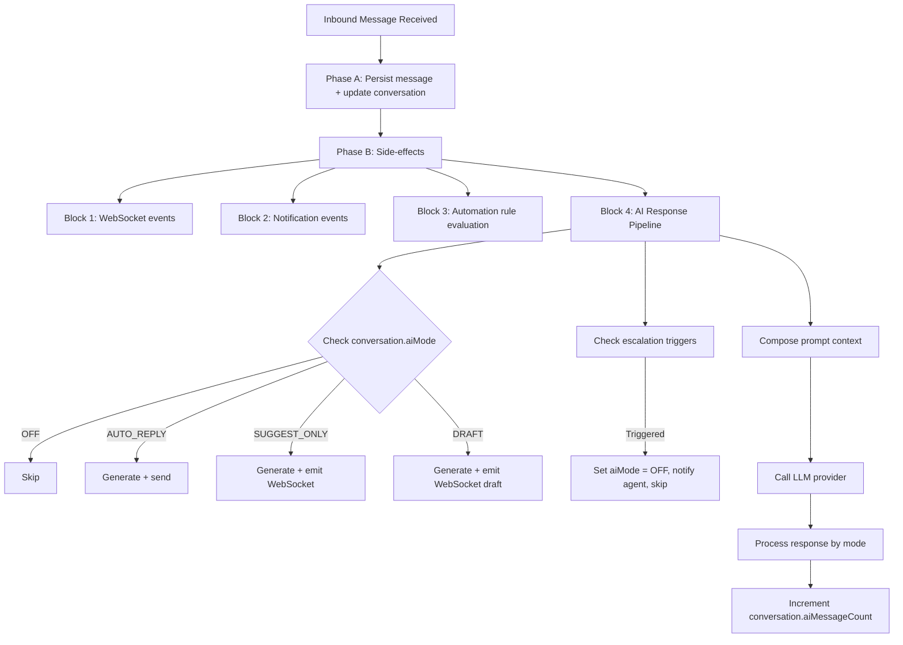

## Overview

The AI Conversation System enables automated and AI-assisted responses within the unified messaging module. It integrates with the existing webhook processing pipeline, conversation model, and template system to provide four modes of AI interaction controlled per-conversation.

<Note>
**Vocabulary note:** Both the messaging AI and the internal CRM assistant must speak **"assignment" / "assignee" / "assigned to"** to users — never "stakeholder", even when the underlying DTO field is still named `stakeholders`. See `Docs/STAKEHOLDER_SYSTEM.md` → "Vocabulary" and `Docs/AI_MODULE_SPECIFICATION.md` → "Assignment vocabulary (v0.11)".
</Note>

## Internal Assistant Boundary

This specification covers customer-facing messaging AI: inbound messages, conversation modes, suggestions, drafts, and optional auto-replies inside the messaging pipeline. The native Propwise CRM sidebar assistant is a separate internal-user surface under `src/modules/ai-assistant` with `POST /v1/ai-assistant/chat`.

### Internal Assistant Characteristics

The internal assistant:

- Uses `ai_conversation`, `ai_message`, and `ai_tool_call` tables, not the messaging `conversation` / `message` tables
- Runs with the current user's tenant token and never uses a service-account "see everything" mode
- Fetches CRM context through existing services and resource checks instead of accepting browser-supplied entity payloads
- Is read-only in V1; drafts and suggestions are allowed, but sending messages or mutating CRM records requires a later explicit approval protocol
- Enforces a **scope + refusal + groundedness + Propwise-glossary + multi-turn-follow-ups + lead-routing** system prompt

<Info>
Current version: `AI_ASSISTANT_SYSTEM_PROMPT_VERSION = crm-assistant-v0.6-lead-routing`

The multi-turn-follow-ups contract was introduced in `v0.5-multi-turn-affirmation`. Out-of-scope topics (markets, weather, news, general world knowledge, personal advice) are declined without tool calls.
</Info>

### System Prompt Requirements

Factual claims about specific leads/deals/contacts/properties must be backed by trusted context or a same-turn tool result. Short affirmatives ("yes do that", "ok pull it") resolve to the offered follow-up tool, never re-call an already-executed tool with the same input, and treat prior-turn tool replays as summary-only (re-call the tool to refresh `<source>` evidence).

Lead field/filter glossary questions are grounded through the read-only `getLeadSchemaGlossary` / `getCrmSchemaGlossary` tool surface; natural-language stage prompts must resolve through `listLeadStages` before `searchLeads.stageId`. See `Docs/AI_MODULE_SPECIFICATION.md` § Internal CRM Assistant → System Prompt and § Multi-turn coherence.

<Warning>
Provider abstractions and cost/budget controls may converge later, but prompt versions and runtime policies remain distinct from customer messaging AI prompts.
</Warning>

## AI Modes

The system supports four distinct AI interaction modes:

| Mode | Behavior |
|------|----------|
| `OFF` | No AI involvement. Messages routed to human agents only. |
| `AUTO_REPLY` | AI generates and sends responses automatically as `senderType = BOT`. |
| `SUGGEST_ONLY` | AI generates a suggested response and emits it via WebSocket. Agent sees suggestion but must send manually. |
| `DRAFT` | AI pre-fills the reply input box. Agent can edit before sending. |

### Mode Cascade (New Conversations)

When a new conversation is created, the AI mode is determined by cascade:

```typescript
ChannelAccount.defaultAiMode ?? Organization.settings.defaultAiMode ?? AiMode.OFF
```

<Tip>
Agents can override the mode at any time via the conversation header toggle (`PUT /messaging/conversations/:id/ai-mode`).
</Tip>

## Agent Availability Gate

Enabling AI requires that `AiAgentResolverService.resolveForConversation()` resolves an agent for the conversation's channel.

<Warning>
Resolution has **no ORG-scoped fallback for PERSONAL channels**: a PERSONAL channel account resolves only a PERSONAL agent owned by that channel's owner and matching the channel; if none exists it returns `null` (it does **not** borrow an ORGANIZATION agent).
</Warning>

Without a gate, toggling AI on for such a channel would set `aiMode = true` while the runtime silently produces no reply.

### Server Implementation (Fail-Closed)

`ConversationService.updateAiModeForUser()` rejects `aiMode = true` with `BadRequestException('No AI agent is configured for this channel.')` when the resolver returns no agent.

**Guard order:**
1. `canReply` (403)
2. 24h-window-open (400)
3. agent-resolves (400)

<Check>
`aiMode = false` is always allowed.
</Check>

### Client Implementation (Disabled Toggle)

`ConversationDetailDto.aiAgentAvailable` (`= !!resolvedAgent`, reused from the same resolver call in `getConversationDetailForUser`) drives the header toggle.

When `false`, the toggle is disabled with tooltip "No AI agent is configured for this channel." — unless AI is already on, in which case the user can still turn it OFF.

## AI Decision Pipeline

### Interception Point

AI processing occurs in **Phase B** of the webhook processor, after the message has been persisted (Phase A). This ensures:

- Message persistence is never blocked by AI processing
- AI failures are non-critical (logged, not thrown)
- The inbound message is available for context composition

### Pipeline Flow



### Latency Budget

<Tabs>
  <Tab title="Target Breakdown">
    **Target:** < 5 seconds end-to-end for AI response generation

    - Context composition: < 200ms
    - LLM API call: < 4s (with timeout)
    - Response processing + send: < 800ms
  </Tab>
  <Tab title="Timeout Handling">
    If LLM call exceeds 8s, abort and log warning.
    
    <Warning>
    Do not retry in the message pipeline — the opportunity has passed.
    </Warning>
  </Tab>
</Tabs>

### Queue-Based Alternative (Future)

<Info>
For high-volume deployments, AI processing can be moved to a dedicated pg-boss queue (`ai-response`) to decouple it from the webhook worker entirely. The current Phase B approach is simpler and sufficient for initial rollout.
</Info>

## LLM Integration Architecture

### Provider Abstraction

```typescript
interface LlmProvider {
  generateResponse(request: LlmRequest): Promise<LlmResponse>;
  countTokens(text: string): number;
}

interface LlmRequest {
  systemPrompt: string;
  messages: LlmMessage[];
  maxTokens: number;
  temperature: number;
}

interface LlmMessage {
  role: 'system' | 'user' | 'assistant';
  content: string;
}

interface LlmResponse {
  content: string;
  tokensUsed: { prompt: number; completion: number };
  model: string;
  finishReason: string;
}
```

### Supported Providers

| Provider | SDK | Notes |
|----------|-----|-------|
| OpenAI | `openai` npm package | GPT-4o, GPT-4o-mini |
| Google Gemini | `@google/generative-ai` | Gemini 2.0 Flash, Pro |
| Anthropic | `@anthropic-ai/sdk` | Claude Sonnet, Haiku |

### Provider Configuration

Provider selection is configured per organization via `Organization.settings`:

```typescript
interface OrganizationSettings {
  defaultAiMode?: AiMode;
  ai?: {
    provider: 'openai' | 'gemini' | 'anthropic';
    model: string;
    apiKey: string; // encrypted at rest
    maxTokensPerResponse: number; // default 500
    temperature: number; // default 0.7
  };
}
```

## Conversation Context Composition

The AI context window is built from multiple sources, ordered by priority:

<Steps>
  <Step title="System Prompt">
    From the matched AI_PROMPT MessageTemplate (via `findAiPromptTemplate`). When no template matches, the hardcoded fallback string is used.
    
    <Note>
    There is no longer a separate `SystemPrompt` DB entity — the legacy `system_prompts` table was dropped by `Migration20260419000000_drop_n8n_artifacts`.
    </Note>
  </Step>
  
  <Step title="Knowledge Context">
    Relevant chunks from the RAG pipeline via `EmbeddingService.generateEmbedding(query, apiKey)` + pgvector cosine search on `knowledge_chunks` (if the org has an `OrganizationLlmKey` configured).
  </Step>
  
  <Step title="CRM Context">
    Person name, lead details (budget, timeline, intent), property interests.
  </Step>
  
  <Step title="Conversation History">
    Last N messages (configurable, default 20), formatted as user/assistant turns.
  </Step>
</Steps>

## Token Budget Management

```
Total Budget = Organization.settings.ai.maxTokensPerResponse (completion)
                + calculated prompt tokens (context)
```

### Context Priority (When Trimming Needed)

<Steps>
  <Step title="System prompt">
    Never trimmed
  </Step>
  
  <Step title="Last 5 messages">
    Never trimmed
  </Step>
  
  <Step title="CRM context">
    Trimmed second
  </Step>
  
  <Step title="Knowledge context">
    Trimmed first
  </Step>
  
  <Step title="Older messages">
    Trimmed by removing oldest first
  </Step>
</Steps>

### Token Budget Parameters

- Token counting uses the provider's tokenizer (tiktoken for OpenAI, approximate for others)
- Maximum context window: 8,000 tokens for prompt (conservative default)
- If total context exceeds budget, trim knowledge chunks first, then older messages

## AI Response Generation Service

### Service Architecture

<CardGroup cols={2}>
  <Card title="Service Location" icon="code">
    `src/modules/messaging/services/ai-response.service.ts`
  </Card>
  <Card title="Module Registration" icon="plug">
    `MessagingModule.providers`
  </Card>
</CardGroup>

### Method: `processInboundMessage`

```typescript
async processInboundMessage(
  conversation: Conversation,
  inboundMessage: Message,
  em: EntityManager,
): Promise<void>
```

## Processing Flow

<Steps>
  <Step title="Mode Check">
    If `conversation.aiMode === AiMode.OFF`, return immediately.
  </Step>
  
  <Step title="Escalation Check">
    Evaluate escalation triggers before generating. If triggered, abort.
  </Step>
  
  <Step title="Find AI Prompt Template">
    ```typescript
    const template = await templateService.findAiPromptTemplate(
      conversation.organization.id,
      conversation.channelAccount.id,
      conversation.tags,
    );
    const systemPrompt = template?.systemPrompt?.prompt ?? template?.body ?? DEFAULT_SYSTEM_PROMPT;
    ```
  </Step>
  
  <Step title="Build Context">
    - Load last N messages for conversation
    - Load PersonChannel → Person → Lead context (if linked)
    - Query knowledge base for relevant chunks (if EmbeddingService available)
    - Compose `LlmRequest` with token budget enforcement
  </Step>
  
  <Step title="Call LLM Provider">
    ```typescript
    const llmResponse = await llmProvider.generateResponse(request);
    ```
  </Step>
  
  <Step title="Process by Mode">
    Response handling varies based on conversation AI mode.
  </Step>
</Steps>

### Mode-Specific Processing

<Tabs>
  <Tab title="AUTO_REPLY">
    - Create outbound Message with `senderType = SenderType.BOT`
    - Create MessageOutbox entry (transactional outbox pattern)
    - Update conversation stats (lastMessageAt, lastMessagePreview)
    - Emit WebSocket `new-message` event
  </Tab>
  
  <Tab title="SUGGEST_ONLY">
    Emit WebSocket event `ai-suggestion` to the conversation room:
    
    ```typescript
    {
      conversationId: string;
      suggestionText: string;
      generatedAt: Date;
    }
    ```
  </Tab>
  
  <Tab title="DRAFT">
    Emit WebSocket event `ai-draft` to the conversation room:
    
    ```typescript
    {
      conversationId: string;
      draftText: string;
      generatedAt: Date;
    }
    ```
  </Tab>
</Tabs>

## Related Documentation

<CardGroup cols={2}>
  <Card title="Stakeholder System" icon="users" href="/docs/STAKEHOLDER_SYSTEM">
    Assignment and stakeholder vocabulary guidelines
  </Card>
  <Card title="AI Module Specification" icon="brain" href="/docs/AI_MODULE_SPECIFICATION">
    Complete AI module architecture and specifications
  </Card>
  <Card title="Messaging Module" icon="message" href="/backend/messaging">
    Unified messaging system documentation
  </Card>
  <Card title="Template System" icon="file-lines" href="/backend/templates">
    Message template configuration
  </Card>
</CardGroup>

## Status and Versioning

<Info>
**Last Updated:** 2026-05-23  
**Status:** Draft  
**Version:** v36
</Info>