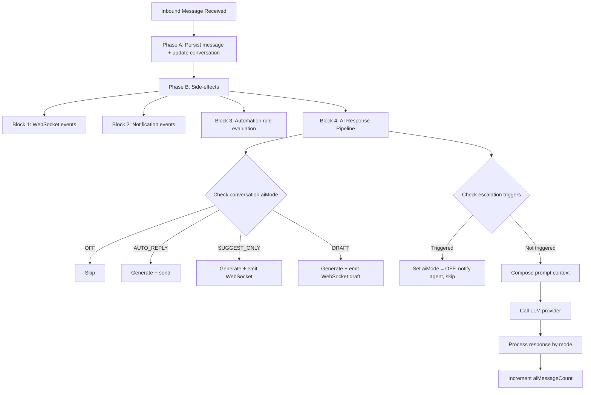

## Overview

The AI Conversation System enables automated and AI-assisted responses within the unified messaging module. It integrates with the existing webhook processing pipeline, conversation model, and template system to provide four modes of AI interaction controlled per-conversation.

<Note>
**Vocabulary note:** Both the messaging AI and the internal CRM assistant must speak **"assignment" / "assignee" / "assigned to"** to users — never "stakeholder", even when the underlying DTO field is still named `stakeholders`. See `Docs/STAKEHOLDER_SYSTEM.md` → "Vocabulary" and `Docs/AI_MODULE_SPECIFICATION.md` → "Assignment vocabulary (v0.11)".
</Note>

### Document metadata

- **Last Updated:** 2026-05-23
- **Status:** Draft
- **Version:** v38

## Internal assistant boundary

This specification covers customer-facing messaging AI: inbound messages, conversation modes, suggestions, drafts, and optional auto-replies inside the messaging pipeline. The native Propwise CRM sidebar assistant is a separate internal-user surface under `src/modules/ai-assistant` with `POST /v1/ai-assistant/chat`.

<Info>
The internal assistant:
- Uses `ai_conversation`, `ai_message`, and `ai_tool_call` tables, not the messaging `conversation` / `message` tables
- Runs with the current user's tenant token and never uses a service-account "see everything" mode
- Fetches CRM context through existing services and resource checks instead of accepting browser-supplied entity payloads
- Is read-only in V1; drafts and suggestions are allowed, but sending messages or mutating CRM records requires a later explicit approval protocol
</Info>

The internal assistant enforces a **scope + refusal + groundedness + Propwise-glossary + multi-turn-follow-ups + lead-routing** system prompt:

- **Current version:** `AI_ASSISTANT_SYSTEM_PROMPT_VERSION = crm-assistant-v0.6-lead-routing`
- **Multi-turn contract:** Introduced in `v0.5-multi-turn-affirmation`
- **Scope enforcement:** Out-of-scope topics (markets, weather, news, general world knowledge, personal advice) are declined without tool calls
- **Groundedness:** Factual claims about specific leads/deals/contacts/properties must be backed by trusted context or a same-turn tool result
- **Follow-up handling:** Short affirmatives ("yes do that", "ok pull it") resolve to the offered follow-up tool, never re-call an already-executed tool with the same input
- **Tool replay:** Prior-turn tool replays are treated as summary-only (re-call the tool to refresh `<source>` evidence)
- **Schema grounding:** Lead field/filter glossary questions are grounded through the read-only `getLeadSchemaGlossary` / `getCrmSchemaGlossary` tool surface
- **Stage resolution:** Natural-language stage prompts must resolve through `listLeadStages` before `searchLeads.stageId`

See `Docs/AI_MODULE_SPECIFICATION.md` § Internal CRM Assistant → System Prompt and § Multi-turn coherence.

<Warning>
Provider abstractions and cost/budget controls may converge later, but prompt versions and runtime policies remain distinct from customer messaging AI prompts.
</Warning>

## AI modes

The system supports four distinct modes of AI interaction:

<CardGroup cols={2}>
  <Card title="OFF" icon="circle-xmark">
    No AI involvement. Messages routed to human agents only.
  </Card>
  <Card title="AUTO_REPLY" icon="robot">
    AI generates and sends responses automatically as `senderType = BOT`.
  </Card>
  <Card title="SUGGEST_ONLY" icon="lightbulb">
    AI generates a suggested response and emits it via WebSocket. Agent sees suggestion but must send manually.
  </Card>
  <Card title="DRAFT" icon="pen-to-square">
    AI pre-fills the reply input box. Agent can edit before sending.
  </Card>
</CardGroup>

### Mode cascade (new conversations)

When a new conversation is created, the AI mode is determined by cascade:

```typescript
ChannelAccount.defaultAiMode ?? Organization.settings.defaultAiMode ?? AiMode.OFF
```

<Tip>
Agents can override the mode at any time via the conversation header toggle (`PUT /messaging/conversations/:id/ai-mode`).
</Tip>

### Agent availability gate (toggle enablement)

Enabling AI requires that `AiAgentResolverService.resolveForConversation()` resolves an agent for the conversation's channel. Resolution has **no ORG-scoped fallback for PERSONAL channels**: a PERSONAL channel account resolves only a PERSONAL agent owned by that channel's owner and matching the channel; if none exists it returns `null` (it does **not** borrow an ORGANIZATION agent).

<Warning>
Without a gate, toggling AI on for such a channel would set `aiMode = true` while the runtime silently produces no reply.
</Warning>

#### Server-side (fail-closed)

`ConversationService.updateAiModeForUser()` rejects `aiMode = true` with `BadRequestException('No AI agent is configured for this channel.')` when the resolver returns no agent.

**Guard order:**
1. `canReply` (403)
2. 24h-window-open (400)
3. agent-resolves (400)

<Note>
`aiMode = false` is always allowed.
</Note>

#### Client-side (disabled toggle)

`ConversationDetailDto.aiAgentAvailable` (`= !!resolvedAgent`, reused from the same resolver call in `getConversationDetailForUser`) drives the header toggle.

When `false`, the toggle is disabled with tooltip "No AI agent is configured for this channel." — unless AI is already on, in which case the user can still turn it OFF.

## AI decision pipeline

### Interception point

AI processing occurs in **Phase B** of the webhook processor, after the message has been persisted (Phase A). This ensures:

<Check>Message persistence is never blocked by AI processing</Check>
<Check>AI failures are non-critical (logged, not thrown)</Check>
<Check>The inbound message is available for context composition</Check>

### Pipeline flow



### Latency budget

<Info>
**Target:** < 5 seconds end-to-end for AI response generation
</Info>

**Breakdown:**
- Context composition: < 200ms
- LLM API call: < 4s (with timeout)
- Response processing + send: < 800ms

<Warning>
**Timeout handling:** If LLM call exceeds 8s, abort and log warning. Do not retry in the message pipeline — the opportunity has passed.
</Warning>

### Queue-based alternative (future)

For high-volume deployments, AI processing can be moved to a dedicated pg-boss queue (`ai-response`) to decouple it from the webhook worker entirely. The current Phase B approach is simpler and sufficient for initial rollout.

## LLM integration architecture

### Provider abstraction

```typescript
interface LlmProvider {
  generateResponse(request: LlmRequest): Promise<LlmResponse>;
  countTokens(text: string): number;
}

interface LlmRequest {
  systemPrompt: string;
  messages: LlmMessage[];
  maxTokens: number;
  temperature: number;
}

interface LlmMessage {
  role: 'system' | 'user' | 'assistant';
  content: string;
}

interface LlmResponse {
  content: string;
  tokensUsed: { prompt: number; completion: number };
  model: string;
  finishReason: string;
}
```

### Supported providers

<Tabs>
  <Tab title="OpenAI">
    **SDK:** `openai` npm package
    
    **Models:** GPT-4o, GPT-4o-mini
  </Tab>
  <Tab title="Google Gemini">
    **SDK:** `@google/generative-ai`
    
    **Models:** Gemini 2.0 Flash, Pro
  </Tab>
  <Tab title="Anthropic">
    **SDK:** `@anthropic-ai/sdk`
    
    **Models:** Claude Sonnet, Haiku
  </Tab>
</Tabs>

Provider selection is configured per organization via `Organization.settings`:

```typescript
interface OrganizationSettings {
  defaultAiMode?: AiMode;
  ai?: {
    provider: 'openai' | 'gemini' | 'anthropic';
    model: string;
    apiKey: string; // encrypted at rest
    maxTokensPerResponse: number; // default 500
    temperature: number; // default 0.7
  };
}
```

### Conversation context composition

The AI context window is built from multiple sources, ordered by priority:

<Steps>
  <Step title="System prompt">
    From the matched AI_PROMPT MessageTemplate (via `findAiPromptTemplate`); when no template matches, the hardcoded fallback string is used.
    
    <Note>
    There is no longer a separate `SystemPrompt` DB entity — the legacy `system_prompts` table was dropped by `Migration20260419000000_drop_n8n_artifacts`.
    </Note>
  </Step>
  <Step title="Knowledge context">
    Relevant chunks from the RAG pipeline via `EmbeddingService.generateEmbedding(query, apiKey)` + pgvector cosine search on `knowledge_chunks` (if the org has an `OrganizationLlmKey` configured).
  </Step>
  <Step title="CRM context">
    Person name, lead details (budget, timeline, intent), property interests.
  </Step>
  <Step title="Conversation history">
    Last N messages (configurable, default 20), formatted as user/assistant turns.
  </Step>
</Steps>

### Token budget management

```
Total Budget = Organization.settings.ai.maxTokensPerResponse (completion)
                + calculated prompt tokens (context)
```

**Context Priority (when trimming needed):**

1. System prompt (never trimmed)
2. Last 5 messages (never trimmed)
3. CRM context (trimmed second)
4. Knowledge context (trimmed first)
5. Older messages (trimmed by removing oldest first)

<Info>
- Token counting uses the provider's tokenizer (tiktoken for OpenAI, approximate for others)
- Maximum context window: 8,000 tokens for prompt (conservative default)
- If total context exceeds budget, trim knowledge chunks first, then older messages
</Info>

## AI response generation service

### Service overview

**Module:** `src/modules/messaging/services/ai-response.service.ts`

**Registered in:** `MessagingModule.providers`

### Method: processInboundMessage

```typescript
async processInboundMessage(
  conversation: Conversation,
  inboundMessage: Message,
  em: EntityManager,
): Promise<void>
```

### Processing flow

<Steps>
  <Step title="Mode check">
    If `conversation.aiMode === AiMode.OFF`, return immediately.
  </Step>
  
  <Step title="Escalation check">
    Evaluate escalation triggers before generating (see 3d). If triggered, abort.
  </Step>
  
  <Step title="Find AI prompt template">
    ```typescript
    const template = await templateService.findAiPromptTemplate(
      conversation.organization.id,
      conversation.channelAccount.id,
      conversation.tags,
    );
    const systemPrompt = template?.systemPrompt?.prompt ?? 
                         template?.body ?? 
                         DEFAULT_SYSTEM_PROMPT;
    ```
  </Step>
  
  <Step title="Build context">
    - Load last N messages for conversation
    - Load PersonChannel → Person → Lead context (if linked)
    - Query knowledge base for relevant chunks (if EmbeddingService available)
    - Compose `LlmRequest` with token budget enforcement
  </Step>
  
  <Step title="Call LLM provider">
    ```typescript
    const llmResponse = await llmProvider.generateResponse(request);
    ```
  </Step>
  
  <Step title="Process by mode">
    <Accordion title="AUTO_REPLY">
      - Create outbound Message with `senderType = SenderType.BOT`
      - Create MessageOutbox entry (transactional outbox pattern)
      - Update conversation stats (lastMessageAt, lastMessagePreview)
      - Emit WebSocket `new-message` event
    </Accordion>
    
    <Accordion title="SUGGEST_ONLY">
      Emit WebSocket event `ai-suggestion` to the conversation room:
      ```typescript
      {
        conversationId: string;
        suggestion: {
          content: string;
          generatedAt: Date;
          tokensUsed: number;
        };
      }
      ```
    </Accordion>
    
    <Accordion title="DRAFT">
      Emit WebSocket event `ai-draft` to the conversation room:
      ```typescript
      {
        conversationId: string;
        draft: {
          content: string;
          generatedAt: Date;
          tokensUsed: number;
        };
      }
      ```
      
      <Note>
      The frontend pre-fills the message input box with this content.
      </Note>
    </Accordion>
  </Step>
  
  <Step title="Increment counter">
    Update `conversation.aiMessageCount` (for analytics and escalation triggers).
  </Step>
</Steps>

### Error handling

All AI processing errors are caught, logged, and do not propagate to the webhook processor:

```typescript
try {
  await aiResponseService.processInboundMessage(conversation, message, em);
} catch (error) {
  logger.error('AI response generation failed', {
    conversationId: conversation.id,
    error: error.message,
    stack: error.stack,
  });
  // Continue processing - AI failure is non-critical
}
```

<Warning>
AI failures never block message persistence or other side-effects.
</Warning>

## Escalation triggers

### Trigger conditions

The system automatically escalates conversations to human agents when certain conditions are met:

<CardGroup cols={2}>
  <Card title="Sentiment threshold" icon="face-frown">
    Negative sentiment detected in customer message (configurable threshold).
  </Card>
  <Card title="Message count limit" icon="hashtag">
    AI has handled N messages without human intervention (default: 10).
  </Card>
  <Card title="Explicit request" icon="hand">
    Customer explicitly requests human agent ("talk to a person", "human please", etc.).
  </Card>
  <Card title="Unresolved intent" icon="circle-question">
    AI confidence score below threshold for 3 consecutive messages.
  </Card>
</CardGroup>

### Escalation behavior

When an escalation trigger fires:

<Steps>
  <Step title="Set mode to OFF">
    `conversation.aiMode = AiMode.OFF`
  </Step>
  <Step title="Create system message">
    Insert a system message: "This conversation has been escalated to a human agent."
  </Step>
  <Step title="Notify agents">
    Emit WebSocket event `conversation-escalated` to all agents with access.
  </Step>
  <Step title="Send notification">
    Create notification for assigned agents (via NewConversationNeedsAttentionEvent).
  </Step>
  <Step title="Log escalation">
    Record escalation reason in conversation metadata for analytics.
  </Step>
</Steps>

### Configuration

Escalation triggers are configured per organization:

```typescript
interface OrganizationSettings {
  ai?: {
    escalation?: {
      enabled: boolean;
      sentimentThreshold: number; // -1 to 1, default -0.5
      maxAiMessages: number; // default 10
      minConfidence: number; // 0 to 1, default 0.6
      consecutiveFailures: number; // default 3
      humanRequestKeywords: string[]; // default: ["human", "person", "agent", "representative"]
    };
  };
}
```

## WebSocket events

### Event types

<Tabs>
  <Tab title="ai-suggestion">
    **Emitted when:** AI generates a suggestion in SUGGEST_ONLY mode
    
    **Payload:**
    ```typescript
    {
      conversationId: string;
      suggestion: {
        content: string;
        generatedAt: Date;
        tokensUsed: number;
      };
    }
    ```
    
    **Room:** `conversation:${conversationId}`
  </Tab>
  
  <Tab title="ai-draft">
    **Emitted when:** AI generates a draft in DRAFT mode
    
    **Payload:**
    ```typescript
    {
      conversationId: string;
      draft: {
        content: string;
        generatedAt: Date;
        tokensUsed: number;
      };
    }
    ```
    
    **Room:** `conversation:${conversationId}`
  </Tab>
  
  <Tab title="conversation-escalated">
    **Emitted when:** Conversation is escalated to human agents
    
    **Payload:**
    ```typescript
    {
      conversationId: string;
      reason: EscalationReason;
      timestamp: Date;
    }
    ```
    
    **Room:** `organization:${organizationId}:agents`
  </Tab>
</Tabs>

## Analytics and monitoring

### Metrics tracked

<AccordionGroup>
  <Accordion title="Conversation-level metrics">
    - `aiMessageCount`: Total AI-generated messages in conversation
    - `aiMode`: Current AI mode setting
    - `escalatedAt`: Timestamp of escalation (if applicable)
    - `escalationReason`: Reason for escalation
  </Accordion>
  
  <Accordion title="Message-level metrics">
    - `senderType`: BOT vs HUMAN
    - `tokensUsed`: Token count for generation
    - `responseTime`: Time from inbound to outbound
    - `confidence`: AI confidence score (0-1)
  </Accordion>
  
  <Accordion title="Organization-level metrics">
    - Total AI messages sent
    - Average response time
    - Escalation rate
    - Token consumption (cost tracking)
    - Mode distribution (AUTO vs SUGGEST vs DRAFT)
  </Accordion>
</AccordionGroup>

### Logging requirements

<CodeGroup>
```typescript AiResponseService
logger.info('AI response generated', {
  conversationId,
  mode: conversation.aiMode,
  tokensUsed: response.tokensUsed,
  responseTime: Date.now() - startTime,
  model: response.model,
});
```

```typescript Escalation
logger.warn('Conversation escalated', {
  conversationId,
  reason: trigger.reason,
  aiMessageCount: conversation.aiMessageCount,
  lastMessages: lastN.map(m => m.id),
});
```

```typescript Error
logger.error('LLM provider error', {
  conversationId,
  provider: config.ai.provider,
  model: config.ai.model,
  error: error.message,
  retryable: isRetryable(error),
});
```
</CodeGroup>

## Security and privacy

### API key management

<Warning>
All LLM provider API keys MUST be encrypted at rest using `@propwise/crypto` module.
</Warning>

```typescript
// Encryption on save
const encryptedKey = await cryptoService.encrypt(
  settings.ai.apiKey,
  'organization-settings',
);

// Decryption on use
const apiKey = await cryptoService.decrypt(
  encryptedKey,
  'organization-settings',
);
```

### Data handling

<CardGroup cols={2}>
  <Card title="PII filtering" icon="user-shield">
    Remove phone numbers, email addresses, and credit card numbers from context before sending to LLM.
  </Card>
  <Card title="Conversation isolation" icon="lock">
    Only include messages from the current conversation in context window.
  </Card>
  <Card title="Tenant boundary" icon="building">
    Never leak data across organizations. Use `em.scope()` for all queries.
  </Card>
  <Card title="Audit trail" icon="file-lines">
    Log all AI interactions with conversation ID and user context for compliance.
  </Card>
</CardGroup>

### Rate limiting

Per-organization rate limits protect against runaway costs:

```typescript
interface OrganizationSettings {
  ai?: {
    rateLimits?: {
      messagesPerHour: number; // default 1000
      tokensPerDay: number; // default 500000
      costPerMonth: number; // dollar limit, default 1000
    };
  };
}
```

<Info>
When limits are exceeded, AI processing is temporarily disabled and alerts are sent to organization admins.
</Info>

## Testing strategy

### Unit tests

<Steps>
  <Step title="Service methods">
    - Mode cascade resolution
    - Context composition with token budget
    - Escalation trigger evaluation
    - Error handling and fallbacks
  </Step>
  
  <Step title="Provider adapters">
    - Request/response transformation
    - Token counting accuracy
    - Timeout handling
    - Error mapping
  </Step>
</Steps>

### Integration tests

<Steps>
  <Step title="Full pipeline">
    - Inbound message → AI response → outbound message
    - WebSocket event emission
    - Conversation state updates
  </Step>
  
  <Step title="Multi-provider">
    - OpenAI, Gemini, Anthropic parity
    - Fallback behavior when provider unavailable
  </Step>
  
  <Step title="Escalation flow">
    - Trigger conditions → mode change → notifications
  </Step>
</Steps>

### Load tests

<Info>
Target: 100 concurrent conversations with AI enabled, < 5s p95 response time
</Info>

## Migration and rollout

### Phase 1: Infrastructure

<Steps>
  <Step title="Deploy provider services">
    Register OpenAI, Gemini, Anthropic adapters
  </Step>
  <Step title="Add organization settings">
    Migrate existing orgs to default settings
  </Step>
  <Step title="Deploy AiResponseService">
    With AI processing disabled (feature flag)
  </Step>
</Steps>

### Phase 2: Pilot

<Steps>
  <Step title="Enable for internal testing">
    Propwise organization only, SUGGEST_ONLY mode
  </Step>
  <Step title="Monitor metrics">
    Response quality, latency, token usage
  </Step>
  <Step title="Iterate on prompts">
    Refine system prompts based on feedback
  </Step>
</Steps>

### Phase 3: Beta

<Steps>
  <Step title="Select beta customers">
    5-10 organizations with high message volume
  </Step>
  <Step title="Enable AUTO_REPLY">
    With conservative escalation triggers
  </Step>
  <Step title="Collect feedback">
    Weekly check-ins, analytics review
  </Step>
</Steps>

### Phase 4: General availability

<Steps>
  <Step title="Document feature">
    User guides, API docs, video tutorials
  </Step>
  <Step title="Enable for all orgs">
    Default to OFF, allow opt-in
  </Step>
  <Step title="Monitor at scale">
    Cost, quality, support tickets
  </Step>
</Steps>

## Related documentation

<CardGroup cols={2}>
  <Card title="AI Module Specification" href="/ai/ai-module-specification">
    Internal CRM assistant architecture
  </Card>
  <Card title="Stakeholder System" href="/crm/stakeholder-system">
    Assignment vocabulary and entity relationships
  </Card>
  <Card title="Messaging Module" href="/messaging/overview">
    Core conversation and message models
  </Card>
  <Card title="Webhook Processing" href="/messaging/webhook-processing">
    Inbound message pipeline phases
  </Card>
</CardGroup>