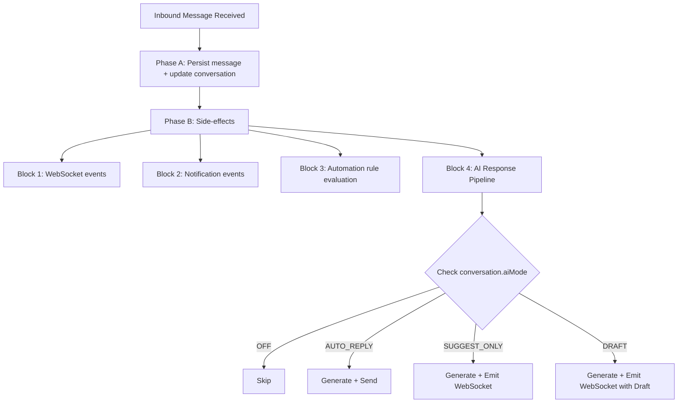

## Overview

The AI Conversation System enables automated and AI-assisted responses within the unified messaging module. It integrates with the existing webhook processing pipeline, conversation model, and template system to provide four modes of AI interaction controlled per-conversation.

<Info>
This system operates in Phase B of the webhook processor, ensuring message persistence is never blocked by AI processing.
</Info>

## AI Modes

The system supports four distinct AI interaction modes:

| Mode | Behavior |
|------|----------|
| `OFF` | No AI involvement. Messages routed to human agents only. |
| `AUTO_REPLY` | AI generates and sends responses automatically as `senderType = BOT`. |
| `SUGGEST_ONLY` | AI generates a suggested response and emits it via WebSocket. Agent sees suggestion but must send manually. |
| `DRAFT` | AI pre-fills the reply input box. Agent can edit before sending. |

### Mode Cascade for New Conversations

When a new conversation is created, the AI mode is determined by this cascade:

```
ChannelAccount.defaultAiMode ?? Organization.settings.defaultAiMode ?? AiMode.OFF
```

<Note>
Agents can override the mode at any time via the conversation header toggle using `PUT /messaging/conversations/:id/ai-mode`.
</Note>

## AI Decision Pipeline

### Interception Point

AI processing occurs in **Phase B** of the webhook processor, after the message has been persisted (Phase A). This ensures:

- Message persistence is never blocked by AI processing
- AI failures are non-critical (logged, not thrown)
- The inbound message is available for context composition

### Pipeline Flow



<Steps>
<Step title="Check AI Mode">
Evaluate the conversation's AI mode setting to determine processing path.
</Step>

<Step title="Check Escalation Triggers">
Before generating, verify if escalation conditions are met. If triggered, set `aiMode = OFF`, notify agent, and skip processing.
</Step>

<Step title="Compose Prompt Context">
Build the context window from system prompts, knowledge base, CRM data, and conversation history.
</Step>

<Step title="Call LLM Provider">
Execute the API call to the configured LLM provider with appropriate timeout handling.
</Step>

<Step title="Process Response by Mode">
Handle the response according to the conversation's AI mode (auto-reply, suggest, or draft).
</Step>

<Step title="Update Counters">
Increment `conversation.aiMessageCount` for escalation tracking.
</Step>
</Steps>

### Performance Requirements

<CardGroup cols={2}>
<Card title="Latency Budget" icon="clock">
**Target:** < 5 seconds end-to-end
- Context composition: < 200ms
- LLM API call: < 4s (with timeout)
- Response processing: < 800ms
</Card>

<Card title="Timeout Handling" icon="triangle-exclamation">
**Limit:** 8 seconds maximum
If exceeded, abort and log warning. Do not retry in the message pipeline.
</Card>
</CardGroup>

<Warning>
For high-volume deployments, consider moving AI processing to a dedicated pg-boss queue (`ai-response`) to decouple it from the webhook worker entirely.
</Warning>

## LLM Integration Architecture

### Provider Abstraction

The system uses a standardized interface for LLM providers:

<CodeGroup>
```typescript LLM Provider Interface
interface LlmProvider {
  generateResponse(request: LlmRequest): Promise<LlmResponse>;
  countTokens(text: string): number;
}

interface LlmRequest {
  systemPrompt: string;
  messages: LlmMessage[];
  maxTokens: number;
  temperature: number;
}

interface LlmMessage {
  role: 'system' | 'user' | 'assistant';
  content: string;
}

interface LlmResponse {
  content: string;
  tokensUsed: { prompt: number; completion: number };
  model: string;
  finishReason: string;
}
```

```typescript Organization Settings
interface OrganizationSettings {
  defaultAiMode?: AiMode;
  ai?: {
    provider: 'openai' | 'gemini' | 'anthropic';
    model: string;
    apiKey: string; // encrypted at rest
    maxTokensPerResponse: number; // default 500
    temperature: number; // default 0.7
  };
}
```
</CodeGroup>

### Supported Providers

<Tabs>
<Tab title="OpenAI">
**SDK:** `openai` npm package  
**Models:** GPT-4o, GPT-4o-mini  
**Features:** Full function calling, vision capabilities
</Tab>

<Tab title="Google Gemini">
**SDK:** `@google/generative-ai`  
**Models:** Gemini 2.0 Flash, Pro  
**Features:** Multimodal input, fast inference
</Tab>

<Tab title="Anthropic">
**SDK:** `@anthropic-ai/sdk`  
**Models:** Claude Sonnet, Haiku  
**Features:** Long context, safety-focused
</Tab>
</Tabs>

### Context Composition

The AI context window is built from multiple sources in priority order:

<AccordionGroup>
<Accordion title="System Prompt" icon="terminal">
From the matched AI_PROMPT MessageTemplate via `findAiPromptTemplate()` or a default org-level prompt. This component is never trimmed from the context.
</Accordion>

<Accordion title="Knowledge Context" icon="database">
Relevant chunks from the RAG pipeline via `EmbeddingService.findSimilar()` if available. First to be trimmed when token budget is exceeded.
</Accordion>

<Accordion title="CRM Context" icon="user">
Person name, lead details (budget, timeline, intent), and property interests. Trimmed second when budget constraints apply.
</Accordion>

<Accordion title="Conversation History" icon="messages">
Last N messages (configurable, default 20), formatted as user/assistant turns. Last 5 messages are never trimmed.
</Accordion>
</AccordionGroup>

### Token Budget Management

```
Total Budget = Organization.settings.ai.maxTokensPerResponse (completion)
                + calculated prompt tokens (context)

Context Priority (when trimming needed):
1. System prompt (never trimmed)
2. Last 5 messages (never trimmed)
3. CRM context (trimmed second)
4. Knowledge context (trimmed first)
5. Older messages (trimmed by removing oldest first)
```

<Tip>
Token counting uses the provider's tokenizer (tiktoken for OpenAI, approximate for others). Maximum context window is 8,000 tokens for prompt (conservative default).
</Tip>

## AI Response Generation Service

### Service Implementation

**Module:** `src/modules/messaging/services/ai-response.service.ts`  
**Registered in:** `MessagingModule.providers`

### Core Method

```typescript
async processInboundMessage(
  conversation: Conversation,
  inboundMessage: Message,
  em: EntityManager,
): Promise<void>
```

### Processing Logic

<Steps>
<Step title="Mode Validation">
If `conversation.aiMode === AiMode.OFF`, return immediately without processing.
</Step>

<Step title="Escalation Check">
Evaluate escalation triggers before generating response. If triggered, abort the AI process.
</Step>

<Step title="Template Resolution">
```typescript
const template = await templateService.findAiPromptTemplate(
  conversation.organization.id,
  conversation.channelAccount.id,
  conversation.tags,
);
const systemPrompt = template?.systemPrompt?.prompt ?? 
                    template?.body ?? 
                    DEFAULT_SYSTEM_PROMPT;
```
</Step>

<Step title="Context Building">
- Load last N messages for conversation
- Load PersonChannel → Person → Lead context (if linked)
- Query knowledge base for relevant chunks (if EmbeddingService available)
- Compose `LlmRequest` with token budget enforcement
</Step>

<Step title="LLM API Call">
```typescript
const llmResponse = await llmProvider.generateResponse(request);
```
</Step>

<Step title="Response Processing">
Handle the response according to the conversation's AI mode.
</Step>

<Step title="Counter Updates">
```typescript
conversation.aiMessageCount += 1;
await em.flush();
```
</Step>
</Steps>

### Mode-Specific Processing

<Tabs>
<Tab title="AUTO_REPLY">
- Create outbound Message with `senderType = SenderType.BOT`
- Create MessageOutbox entry (transactional outbox pattern)
- Update conversation stats (lastMessageAt, lastMessagePreview)
- Emit WebSocket `new-message` event
</Tab>

<Tab title="SUGGEST_ONLY">
Emit WebSocket event `ai-suggestion` to the conversation room:
```typescript
{
  conversationId: string;
  suggestion: string;
  generatedAt: Date;
}
```
Agent sees the suggestion in the UI and can accept/modify/dismiss.
</Tab>

<Tab title="DRAFT">
Emit WebSocket event `ai-draft` to the conversation room:
```typescript
{
  conversationId: string;
  draft: string;
  generatedAt: Date;
}
```
Frontend pre-fills the reply input with the draft text.
</Tab>
</Tabs>

### Error Handling

<Warning>
All AI processing errors are non-critical and must not block the message pipeline.
</Warning>

- **LLM API errors:** Log with full context, do not throw. Agent workflow continues uninterrupted.
- **Token limit exceeded:** Trim context and retry once with reduced context window.
- **Provider unavailable:** Log error, emit WebSocket event `ai-error` to notify the agent.
- **Rate limiting:** Respect provider rate limits. If rate-limited, skip processing and log.

### Default System Prompt

```
You are a helpful real estate assistant for {organizationName}.
Answer questions about properties, pricing, availability, and services.
Be professional, concise, and helpful. If you cannot answer a question,
politely suggest the customer speak with a human agent.
Do not make up information about specific properties or pricing.
```

## Human Escalation Logic

### Escalation Configuration

Escalation triggers are configurable per organization:

```typescript
interface EscalationConfig {
  maxAiMessages: number; // default 5 — escalate after N AI exchanges
  keywords: string[]; // e.g., ["speak to agent", "human", "manager"]
  sentimentThreshold?: number; // 0.0-1.0, escalate below threshold (future)
  confidenceThreshold?: number; // 0.0-1.0, escalate below threshold (future)
}
```

### Trigger Evaluation Order

<Steps>
<Step title="Keyword Detection">
Check inbound message text against `escalation.keywords` (case-insensitive substring match). This is the fastest check and runs first.
</Step>

<Step title="Message Count">
If `conversation.aiMessageCount >= escalation.maxAiMessages`, trigger escalation to prevent infinite AI loops.
</Step>

<Step title="Sentiment Analysis (Future)">
When implemented, check sentiment score of inbound message. Below threshold triggers escalation.
</Step>

<Step title="Confidence Score (Future)">
If LLM response includes a confidence indicator below threshold, escalate after sending the response.
</Step>
</Steps>

### Escalation Actions

When any trigger fires, the system executes these actions:

<CodeGroup>
```typescript Update Conversation
// 1. Update conversation
conversation.aiMode = AiMode.OFF;
conversation.aiEscalatedAt = new Date();
```

```typescript Notify Agent
// 2. Notify assigned agent (or team)
eventEmitter.emit('ai.escalated', {
  conversationId: conversation.id,
  organizationId: conversation.organization.id,
  reason: triggerType, // 'keyword' | 'max_messages' | 'sentiment' | 'confidence'
  triggerDetail: string, // the keyword matched, count reached, etc.
});
```

```typescript WebSocket Event
// 3. Emit WebSocket event
gateway.emitToConversation(conversation.id, 'ai-escalated', {
  conversationId: conversation.id,
  reason: triggerType,
  escalatedAt: conversation.aiEscalatedAt,
});
```

```typescript Optional Handoff Message
// 4. (Optional) Send a handoff message to the customer
// "I'm connecting you with a human agent who can help further."
```
</CodeGroup>

<Note>
After escalation, an agent can manually re-enable AI via the conversation toggle (`PUT /messaging/conversations/:id/ai-mode`). This resets `aiEscalatedAt` to null and `aiMessageCount` to 0.
</Note>

## AI Analytics

### Key Metrics

Track these metrics for AI system performance and optimization:

| Metric | Source | Aggregation |
|--------|--------|-------------|
| AI conversations count | `conversation.aiMessageCount > 0` | Per org, per period |
| Human-only conversations | `conversation.aiMessageCount = 0 AND aiMode = OFF` | Per org, per period |
| Escalation count | `conversation.aiEscalatedAt IS NOT NULL` | Per org, per period |
| Escalation rate | Escalated / Total AI conversations | Percentage |
| Average AI messages per conversation | `AVG(conversation.aiMessageCount WHERE > 0)` | Per org, per period |
| Response time distribution | LLM API call duration tracking | Histogram |
| Token usage | Sum of `tokensUsed` from LLM responses | Per org, per model |
| Provider error rate | Failed API calls / Total calls | Percentage |

### Implementation Notes

<Check>
All metrics should be collected asynchronously to avoid impacting real-time performance.
</Check>

- Use time-series data collection for trending analysis
- Implement dashboards for real-time monitoring of AI system health
- Set up alerts for escalation rate spikes or provider error increases
- Track cost metrics based on token usage and provider pricing