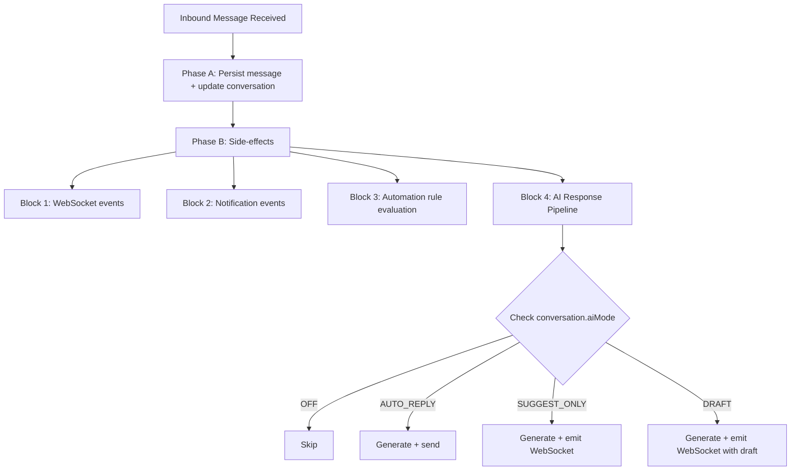

## Overview

The AI Conversation System enables automated and AI-assisted responses within the unified messaging module. It integrates with the existing webhook processing pipeline, conversation model, and template system to provide four modes of AI interaction controlled per-conversation.

<Info>
This specification covers the complete AI conversation system including automated responses, escalation logic, and LLM integration patterns.
</Info>

### AI Modes

The system supports four distinct AI interaction modes:

| Mode           | Behavior                                                                                                    |
| -------------- | ----------------------------------------------------------------------------------------------------------- |
| `OFF`          | No AI involvement. Messages routed to human agents only.                                                    |
| `AUTO_REPLY`   | AI generates and sends responses automatically as `senderType = BOT`.                                       |
| `SUGGEST_ONLY` | AI generates a suggested response and emits it via WebSocket. Agent sees suggestion but must send manually. |
| `DRAFT`        | AI pre-fills the reply input box. Agent can edit before sending.                                            |

### Mode Cascade for New Conversations

When a new conversation is created, the AI mode is determined by cascade:

```
ChannelAccount.defaultAiMode ?? Organization.settings.defaultAiMode ?? AiMode.OFF
```

<Note>
Agents can override the mode at any time via the conversation header toggle using `PUT /messaging/conversations/:id/ai-mode`.
</Note>

## AI Decision Pipeline

### Interception Point

AI processing occurs in **Phase B** of the webhook processor, after the message has been persisted (Phase A). This ensures:

- Message persistence is never blocked by AI processing
- AI failures are non-critical (logged, not thrown)
- The inbound message is available for context composition

### Pipeline Flow



### Latency Budget

<Warning>
Target latency is critical for user experience. Monitor these thresholds carefully.
</Warning>

- **Target:** < 5 seconds end-to-end for AI response generation
- **Breakdown:**
  - Context composition: < 200ms
  - LLM API call: < 4s (with timeout)
  - Response processing + send: < 800ms
- **Timeout handling:** If LLM call exceeds 8s, abort and log warning. Do not retry in the message pipeline — the opportunity has passed.

### Queue-Based Alternative (Future)

For high-volume deployments, AI processing can be moved to a dedicated pg-boss queue (`ai-response`) to decouple it from the webhook worker entirely. The current Phase B approach is simpler and sufficient for initial rollout.

## LLM Integration Architecture

### Provider Abstraction

<CodeGroup>

```typescript LLM Provider Interface
interface LlmProvider {
  generateResponse(request: LlmRequest): Promise<LlmResponse>;
  countTokens(text: string): number;
}

interface LlmRequest {
  systemPrompt: string;
  messages: LlmMessage[];
  maxTokens: number;
  temperature: number;
}

interface LlmMessage {
  role: 'system' | 'user' | 'assistant';
  content: string;
}

interface LlmResponse {
  content: string;
  tokensUsed: { prompt: number; completion: number };
  model: string;
  finishReason: string;
}
```

```typescript Organization Settings
interface OrganizationSettings {
  defaultAiMode?: AiMode;
  ai?: {
    provider: 'openai' | 'gemini' | 'anthropic';
    model: string;
    apiKey: string; // encrypted at rest
    maxTokensPerResponse: number; // default 500
    temperature: number; // default 0.7
  };
}
```

</CodeGroup>

### Supported Providers

| Provider      | SDK                     | Notes                 |
| ------------- | ----------------------- | --------------------- |
| OpenAI        | `openai` npm package    | GPT-4o, GPT-4o-mini   |
| Google Gemini | `@google/generative-ai` | Gemini 2.0 Flash, Pro |
| Anthropic     | `@anthropic-ai/sdk`     | Claude Sonnet, Haiku  |

Provider selection is configured per organization via `Organization.settings`.

### Conversation Context Composition

The AI context window is built from multiple sources, ordered by priority:

<Steps>
<Step title="System Prompt">
From the matched AI_PROMPT MessageTemplate (via `findAiPromptTemplate`) or a default org-level prompt
</Step>

<Step title="Knowledge Context">
Relevant chunks from the RAG pipeline via `EmbeddingService.findSimilar()` (if available)
</Step>

<Step title="CRM Context">
Person name, lead details (budget, timeline, intent), property interests
</Step>

<Step title="Conversation History">
Last N messages (configurable, default 20), formatted as user/assistant turns
</Step>
</Steps>

### Token Budget Management

<Tip>
Token management is critical for cost control and context quality.
</Tip>

```
Total Budget = Organization.settings.ai.maxTokensPerResponse (completion)
                + calculated prompt tokens (context)

Context Priority (when trimming needed):
1. System prompt (never trimmed)
2. Last 5 messages (never trimmed)
3. CRM context (trimmed second)
4. Knowledge context (trimmed first)
5. Older messages (trimmed by removing oldest first)
```

**Key Constraints:**
- Token counting uses the provider's tokenizer (tiktoken for OpenAI, approximate for others)
- Maximum context window: 8,000 tokens for prompt (conservative default)
- If total context exceeds budget, trim knowledge chunks first, then older messages

## AI Response Generation Service

### Service Implementation

**Module:** `src/modules/messaging/services/ai-response.service.ts`  
**Registered in:** `MessagingModule.providers`

### Core Method

<CodeGroup>

```typescript Method Signature
async processInboundMessage(
  conversation: Conversation,
  inboundMessage: Message,
  em: EntityManager,
): Promise<void>
```

```typescript Template Resolution
const template = await templateService.findAiPromptTemplate(
  conversation.organization.id,
  conversation.channelAccount.id,
  conversation.tags,
);
const systemPrompt = template?.systemPrompt?.prompt ?? template?.body ?? DEFAULT_SYSTEM_PROMPT;
```

</CodeGroup>

### Processing Flow

<Tabs>
<Tab title="AUTO_REPLY Mode">
- Create outbound Message with `senderType = SenderType.BOT`
- Create MessageOutbox entry (transactional outbox pattern)
- Update conversation stats (lastMessageAt, lastMessagePreview)
- Emit WebSocket `new-message` event
</Tab>

<Tab title="SUGGEST_ONLY Mode">
- Emit WebSocket event `ai-suggestion` to the conversation room:
```typescript
{
  conversationId: string;
  suggestion: string;
  generatedAt: Date;
}
```
- Agent sees the suggestion in the UI and can accept/modify/dismiss
</Tab>

<Tab title="DRAFT Mode">
- Emit WebSocket event `ai-draft` to the conversation room:
```typescript
{
  conversationId: string;
  draft: string;
  generatedAt: Date;
}
```
- Frontend pre-fills the reply input with the draft text
</Tab>
</Tabs>

### Error Handling

<Warning>
All AI errors must be non-blocking. Agent workflow should never be interrupted.
</Warning>

- **LLM API errors:** Log with full context, do not throw. Agent is not blocked.
- **Token limit exceeded:** Trim context and retry once with reduced context.
- **Provider unavailable:** Log error, emit WebSocket event `ai-error` to notify the agent.
- **Rate limiting:** Respect provider rate limits. If rate-limited, skip and log.

### Default System Prompt

```
You are a helpful real estate assistant for {organizationName}.
Answer questions about properties, pricing, availability, and services.
Be professional, concise, and helpful. If you cannot answer a question,
politely suggest the customer speak with a human agent.
Do not make up information about specific properties or pricing.
```

## Human Escalation Logic

### Escalation Triggers

Escalation triggers are configurable per organization:

<CodeGroup>

```typescript Escalation Configuration
interface EscalationConfig {
  maxAiMessages: number; // default 5 — escalate after N AI exchanges
  keywords: string[]; // e.g., ["speak to agent", "human", "manager"]
  sentimentThreshold?: number; // 0.0-1.0, escalate below threshold (future)
  confidenceThreshold?: number; // 0.0-1.0, escalate below threshold (future)
}
```

```typescript Escalation Actions
// 1. Update conversation
conversation.aiMode = AiMode.OFF;
conversation.aiEscalatedAt = new Date();

// 2. Notify assigned agent (or team)
eventEmitter.emit('ai.escalated', {
  conversationId: conversation.id,
  organizationId: conversation.organization.id,
  reason: triggerType,
  triggerDetail: string,
});

// 3. Emit WebSocket event
gateway.emitToConversation(conversation.id, 'ai-escalated', {
  conversationId: conversation.id,
  reason: triggerType,
  escalatedAt: conversation.aiEscalatedAt,
});
```

</CodeGroup>

### Trigger Evaluation Order

<Steps>
<Step title="Keyword Detection">
Check inbound message text against `escalation.keywords` (case-insensitive substring match). Fastest check, done first.
</Step>

<Step title="Message Count">
If `conversation.aiMessageCount >= escalation.maxAiMessages`, escalate. Prevents infinite AI loops.
</Step>

<Step title="Sentiment Analysis (Future)">
If implemented, check sentiment score of inbound message. Below threshold triggers escalation.
</Step>

<Step title="Confidence Score (Future)">
If LLM response includes a confidence indicator below threshold, escalate after sending the response.
</Step>
</Steps>

### Re-enabling AI

<Check>
After escalation, an agent can manually re-enable AI via the conversation toggle (`PUT /messaging/conversations/:id/ai-mode`). This resets `aiEscalatedAt` to null and `aiMessageCount` to 0.
</Check>

## AI Analytics

### Key Metrics

<CardGroup cols={2}>
<Card title="AI Conversations Count" icon="robot">
Track conversations with `aiMessageCount > 0` per organization and period
</Card>

<Card title="Human-only Conversations" icon="user">
Monitor conversations with `aiMessageCount = 0 AND aiMode = OFF`
</Card>

<Card title="Escalation Count" icon="arrow-up">
Count conversations where `aiEscalatedAt IS NOT NULL`
</Card>

<Card title="Escalation Rate" icon="percentage">
Calculate: Escalated / Total AI conversations
</Card>
</CardGroup>

### Metrics Tracking Table

| Metric                            | Source                                                | Aggregation         |
| --------------------------------- | ----------------------------------------------------- | ------------------- |
| AI conversations count            | `conversation.aiMessageCount > 0`                     | Per org, per period |
| Human-only conversations          | `conversation.aiMessageCount = 0 AND aiMode = OFF`    | Per org, per period |
| Escalation count                  | `conversation.aiEscalatedAt IS NOT NULL`              | Per org, per period |
| Escalation rate                   | Escalated / Total AI conversations                    | Percentage          |

<Note>
These metrics provide crucial insights into AI performance and help optimize the escalation thresholds for each organization.
</Note>