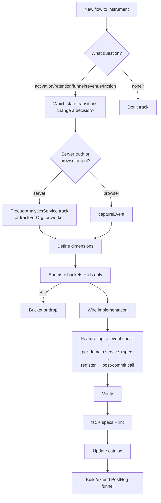

A playbook for an AI agent (or engineer) asked to "add analytics" to a feature. It answers three questions in order: **what** to track, **why**, and **how** to wire it.

<Note>
Pair this guide with the [Analytics System documentation](./analytics-system) (the primitives) and the [Analytics Event Catalog](./event-catalog) (what already exists—check it first to avoid duplicates and to match naming).
</Note>

## Mindset: events serve questions, not the other way around

<Warning>
Do **not** start by listing every button. Start from a business question and work backwards. Every event you add must earn its place in a named funnel or metric. If you can't say which question an event answers, don't add it.
</Warning>

The questions worth instrumenting almost always fall into:

- **Activation** — did a new org reach value? (`org_created` → `integration_connected` → first `lead_created`)
- **Retention / engagement** — do they come back / use the feature? (`*_viewed`, weekly actives)
- **Conversion funnel** — where do they drop off? (`opened` → `submitted` → server `completed`)
- **Revenue / supply** — what drives money? (`unit_added` → `unit_transaction_recorded`)
- **Friction / quality** — what fails or frustrates? (`*_failed`, paywall shown, abandonment)

### Anti-patterns

<Warning>
Do **not** track:
- Per-keystroke noise
- Success-only events (capture failure too or the funnel lies)
- Anything already answerable from the DB/git
- Raw values that belong in a bucket
</Warning>

## Decide what to track

Map the flow to events by following these steps:

<Steps>
  <Step title="Sketch the flow">
    Draw the sequence of states a user/org passes through in your feature.
  </Step>

  <Step title="Identify meaningful transitions">
    For each state transition, ask: "would a drop here change a decision?" If yes → create an event.
  </Step>

  <Step title="Collapse noise">
    One event per real stage, not per re-render. 
    
    - Multi-step wizard → one event per step advance + one `*_abandoned` for drop-off
    - Bulk operation → one summary event with counts, never one event per row
  </Step>

  <Step title="Split client vs server truth">
    **Server-authoritative outcomes** (created, completed, won, counts, status) → backend
    
    **Intent / engagement / drop-off** (opened, switched, viewed, abandoned) → frontend (the server never sees an abandon)
  </Step>

  <Step title="Write the funnel first">
    Document the funnel(s) the events feed *before* coding—that validates the set is sufficient and minimal.
  </Step>
</Steps>

## Decide dimensions

For each event, list properties that let you *slice* the funnel.

### Allowed dimension types

<CardGroup cols={2}>
  <Card title="Enums / categoricals" icon="list">
    Status, type, source, role, provider, side (the system-type, never an org-customizable display name)
  </Card>
  
  <Card title="Buckets" icon="bucket">
    `bucketValue` (money), `bucketDays` (duration/tenure), `bucketCount` (counts). Never the raw figure.
  </Card>
  
  <Card title="Booleans" icon="toggle-on">
    `has_company_link`, `had_errors`, `is_primary`
  </Card>
  
  <Card title="Opaque ids" icon="key">
    `deal_id`, `entity_id` as funnel join keys (not content)
  </Card>
</CardGroup>

<Info>
**Changed-field tracking** — send field **names** (schema), never their values.
</Info>

### PII hard-exclusions

<Warning>
**Never track:** names, emails, phones, addresses, notes, titles, message text, record contents, raw money, credentials, raw errors, IPs. 

When in doubt, bucket it or drop it.
</Warning>

## Decide attribution

Choose the appropriate tracking method based on context:

| Context | Use | distinctId |
|---------|-----|------------|
| User action in a request | `track(...)` | `userId` from CLS |
| System / webhook / cron / **queue worker** | `trackForOrg(..., orgId)` | `org-{orgId}` |
| Frontend (browser) | `captureEvent(feature, event, props)` | ambient posthog-js identity |

<Note>
All events attach the `organization` group → funnels aggregate by org. If a funnel's conversion unit is an entity (e.g. a deal), aggregate by a shared id instead (HogQL `coalesce(...)`).
</Note>

## Backend implementation

<Steps>
  <Step title="Add feature tag">
    Add to `POSTHOG_FEATURE` in `posthog.constants.ts` (and `FEATURE` in the FE `features.ts` if there's a client side).
  </Step>

  <Step title="Define event names">
    Add a `<DOMAIN>_EVENTS` const block in `posthog-events.constants.ts`.
    
    ```typescript
    export const CONTACT_IMPORT_EVENTS = {
      SUBMITTED: 'contact_import_submitted',
      COMPLETED: 'contact_import_completed',
      FAILED: 'contact_import_failed',
    } as const;
    ```
  </Step>

  <Step title="Create domain analytics service">
    Create `modules/<domain>/<domain>-analytics.service.ts`. Mirror `deal-analytics.service.ts`:
    
    - Constructor injects `ProductAnalyticsService`
    - Private `emit()` wraps `track` in `try/catch`
    - Private `emitForOrg()` wrapping `trackForOrg` if a worker path exists
    - One method per event for enum mapping + bucketing
    
    ```typescript
    @Injectable()
    export class ContactImportAnalyticsService {
      constructor(
        @Optional() private readonly analytics?: ProductAnalyticsService,
      ) {}

      private emit(userId: string, event: string, properties: Record<string, any>) {
        try {
          this.analytics?.track(userId, event, properties);
        } catch (error) {
          // Silent fail - analytics never blocks business logic
        }
      }

      contactImportSubmitted(userId: string, fileCount: number) {
        this.emit(userId, CONTACT_IMPORT_EVENTS.SUBMITTED, {
          feature: POSTHOG_FEATURE.CONTACT_IMPORT,
          file_count: bucketCount(fileCount),
        });
      }
    }
    ```
  </Step>

  <Step title="Add test spec">
    Create `*.service.spec.ts`:
    
    - Assert bucketed/enum dimensions
    - Assert raw values are NOT present
    - Assert it never throws
    
    ```typescript
    describe('ContactImportAnalyticsService', () => {
      it('should bucket file counts', () => {
        // Test implementation
      });
      
      it('should never expose raw PII', () => {
        // Test implementation
      });
    });
    ```
  </Step>

  <Step title="Register service">
    Add the service to its module's `providers` (and `exports` if another module's worker needs it).
    
    ```typescript
    @Module({
      providers: [ContactImportAnalyticsService],
      exports: [ContactImportAnalyticsService],
    })
    export class ContactImportModule {}
    ```
  </Step>

  <Step title="Wire call sites">
    Capture data inside the txn into an outer `let`, fire **after** commit:
    
    ```typescript
    let importId: string;
    await this.db.transaction(async (tx) => {
      importId = await this.createImport(tx, data);
    });
    
    this.contactImportAnalytics?.contactImportSubmitted(ctx.userId, fileCount);
    ```
    
    Keep it a one-liner.
  </Step>

  <Step title="Worker path (if needed)">
    Fire `trackForOrg`-backed methods from the queue handler. Read final counts via a service snapshot getter (raw counts never leave the worker—bucket them in the analytics service).
  </Step>
</Steps>

### Constructor injection gotcha

<Warning>
Adding a constructor param breaks specs differently by construction style. **Check the spec first** (`grep "new <Service>(" ...spec.ts` vs `Test.createTestingModule`).
</Warning>

To avoid breaking 90+ tests:

- **Make the new param trailing + optional** (`?`) so positional specs (`new Service(a,b,c)`) keep compiling without the extra arg
- Guard every call with `?.`
- **Test-module specs** also need **`@Optional()`** on the param, or DI fails to resolve a non-global provider

<Tip>
Analytics is best-effort, so `?.`-guarded optional is correct semantically too.
</Tip>

## Frontend implementation

<Steps>
  <Step title="Add event definitions">
    Add the events to the right `*_EVENTS` const in `src/lib/analytics/events.ts`, add the `*EventName` type, and union it into `AnalyticsEventName`.
    
    ```typescript
    export const CONTACT_IMPORT_EVENTS = {
      SUBMITTED: 'contact_import_submitted',
      FILE_SELECTED: 'contact_import_file_selected',
      ABANDONED: 'contact_import_abandoned',
    } as const;
    
    export type ContactImportEventName = 
      typeof CONTACT_IMPORT_EVENTS[keyof typeof CONTACT_IMPORT_EVENTS];
    ```
  </Step>

  <Step title="Fire events">
    Use `captureEvent(FEATURE.<x>, <EVENTS>.<NAME>, { ...dims })` at the handler/callback.
    
    ```typescript
    const handleSubmit = () => {
      captureEvent(
        FEATURE.CONTACT_IMPORT,
        CONTACT_IMPORT_EVENTS.SUBMITTED,
        { file_count: files.length }
      );
      // ... business logic
    };
    ```
  </Step>

  <Step title="Mount-once view events">
    Create an engagement island with a `useRef` guard (see `src/components/analytics/*`).
    
    ```typescript
    const hasTrackedView = useRef(false);
    
    useEffect(() => {
      if (!hasTrackedView.current) {
        captureEvent(FEATURE.CONTACT_IMPORT, CONTACT_IMPORT_EVENTS.VIEWED);
        hasTrackedView.current = true;
      }
    }, []);
    ```
  </Step>

  <Step title="Generic components">
    For shared components used by multiple features, don't hardcode a feature's events inside them.
    
    Add **optional callback props** (`onFileSelected`, `onAbandoned`, …) and let the feature-specific wrapper supply handlers that call `captureEvent`. Keeps siblings uninstrumented.
    
    ```typescript
    // Generic component
    interface FileUploaderProps {
      onFileSelected?: (file: File) => void;
    }
    
    // Feature wrapper
    <FileUploader 
      onFileSelected={(file) => 
        captureEvent(FEATURE.CONTACT_IMPORT, CONTACT_IMPORT_EVENTS.FILE_SELECTED)
      }
    />
    ```
  </Step>
</Steps>

## Verification checklist

<Tabs>
  <Tab title="Backend">
    <Check>Backend touched-file typecheck: `npx tsc --noEmit -p tsconfig.json`, then grep your files</Check>
    
    <Info>
    Known pre-existing errors (ignore): `event.service.spec`, `task.service.spec`, `contact.controller.spec`, two `calendar/*e2e`, ai-agent `InboundPersistedEvent`
    </Info>
    
    <Check>Specs: `npx jest <name>.spec` — run the touched services' specs to confirm no constructor-arity / DI regressions</Check>
    
    <Check>Lint: `npx eslint --fix <files>`</Check>
  </Tab>
  
  <Tab title="Frontend">
    <Check>Typecheck: `npx tsc --noEmit`</Check>
    
    <Check>Lint: `npx eslint <files>`</Check>
  </Tab>
  
  <Tab title="Documentation">
    <Check>**Update the catalog** — add the new events to `ANALYTICS_EVENT_CATALOG.md` under their feature with:
    - Fired-from location
    - Attribution method
    - Dimensions
    - Funnel membership
    - Status
    </Check>
  </Tab>
</Tabs>

## Naming conventions

Follow these rules for consistent event naming:

<AccordionGroup>
  <Accordion title="Case and tense">
    Use `snake_case`, present/past as fits: `lead_created`, `contact_import_submitted`
  </Accordion>
  
  <Accordion title="Structure">
    Shape: `<object>_<verb>` or `<feature>_<object>_<verb>` when collision-prone (`contact_import_completed`)
  </Accordion>
  
  <Accordion title="Frontend ↔ Backend">
    A server-truth outcome and its client-intent counterpart are **distinct events** (`contact_import_submitted` FE vs `contact_import_completed` BE), joined by the org group.
  </Accordion>
  
  <Accordion title="Registry alignment">
    Keep the FE registry and BE constants names identical where the same logical event exists.
  </Accordion>
</AccordionGroup>

## Decision flow reference



<Tip>
Use this flow as a checklist when instrumenting any new feature. Each step validates the previous one and ensures you're building a complete, maintainable analytics implementation.
</Tip>

## Quick reference table

| Question | Answer |
|----------|--------|
| When to track? | When the event answers an activation, retention, conversion, revenue, or friction question |
| Where to track outcomes? | Backend (`track` or `trackForOrg`) |
| Where to track intent? | Frontend (`captureEvent`) |
| What dimensions? | Enums, buckets, booleans, opaque ids—never PII or raw values |
| How to avoid breaking tests? | Trailing optional param with `@Optional()` decorator |
| How to verify? | tsc → specs → lint → update catalog |

---

<CardGroup cols={2}>
  <Card title="Analytics System" icon="chart-line" href="./analytics-system">
    Learn about the underlying analytics primitives and architecture
  </Card>
  
  <Card title="Event Catalog" icon="book" href="./event-catalog">
    Browse existing events to avoid duplicates and match naming conventions
  </Card>
</CardGroup>