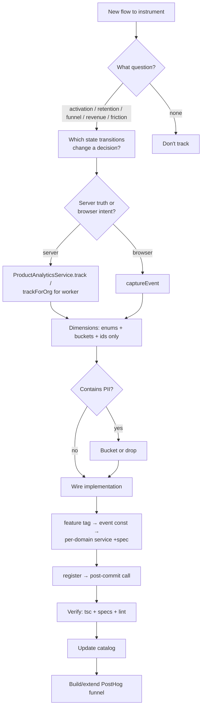

<Info>
This guide is designed for engineers and AI agents adding analytics to features. It answers three questions in order: **what** to track, **why**, and **how** to wire it.

Pair with the [Analytics System](/backend/analytics/system) (primitives) and [Analytics Event Catalog](/backend/analytics/event-catalog) (existing events) to avoid duplicates and match naming conventions.
</Info>

## Mindset: Events Serve Questions

<Warning>
Do **not** start by listing every button. Start from a business question and work backwards.

Every event you add must earn its place in a named funnel or metric. If you can't say which question an event answers, don't add it.
</Warning>

The questions worth instrumenting almost always fall into:

<CardGroup cols={2}>
  <Card title="Activation" icon="rocket">
    Did a new org reach value?
    
    `org_created` → `integration_connected` → first `lead_created`
  </Card>
  
  <Card title="Retention / Engagement" icon="repeat">
    Do they come back and use the feature?
    
    `*_viewed`, weekly actives
  </Card>
  
  <Card title="Conversion Funnel" icon="filter">
    Where do they drop off?
    
    `opened` → `submitted` → server `completed`
  </Card>
  
  <Card title="Revenue / Supply" icon="dollar-sign">
    What drives money?
    
    `unit_added` → `unit_transaction_recorded`
  </Card>
  
  <Card title="Friction / Quality" icon="triangle-exclamation">
    What fails or frustrates?
    
    `*_failed`, paywall shown, abandonment
  </Card>
</CardGroup>

### Anti-patterns

<Warning>
Do **not** track:

- Per-keystroke noise
- Success-only events (capture failure too or the funnel lies)
- Anything already answerable from the DB/git
- Raw values that belong in a bucket
</Warning>

## Step 1: Decide What to Track

<Steps>
  <Step title="Sketch the flow">
    Draw the sequence of states a user/org passes through.
  </Step>
  
  <Step title="Identify meaningful transitions">
    For each state transition, ask: "Would a drop here change a decision?"
    
    If yes → create an event.
  </Step>
  
  <Step title="Collapse noise">
    One event per real stage, not per re-render.
    
    - **Multi-step wizard** → one event per step advance + one `*_abandoned` for drop-off
    - **Bulk operation** → one summary event with counts, never one event per row
  </Step>
  
  <Step title="Split client vs server truth">
    <Tabs>
      <Tab title="Server Events">
        **Server-authoritative outcomes** → backend
        
        - `created`, `completed`, `won`
        - Counts, status changes
        - Final truth after validation
      </Tab>
      
      <Tab title="Client Events">
        **Intent / engagement / drop-off** → frontend
        
        - `opened`, `switched`, `viewed`, `abandoned`
        - The server never sees an abandon
      </Tab>
    </Tabs>
  </Step>
  
  <Step title="Validate with funnels">
    Write the funnel(s) the events feed **before** coding.
    
    This validates the set is sufficient and minimal.
  </Step>
</Steps>

## Step 2: Decide Dimensions

For each event, list properties that let you **slice** the funnel.

### Allowed Dimension Types

<AccordionGroup>
  <Accordion title="Enums / Categoricals">
    System types, never org-customizable display names:
    
    - `status`, `type`, `source`, `role`, `provider`, `side`
  </Accordion>
  
  <Accordion title="Buckets">
    Bucketed values only, never raw figures:
    
    - `bucketValue` (money)
    - `bucketDays` (duration/tenure)
    - `bucketCount` (counts)
  </Accordion>
  
  <Accordion title="Booleans">
    Binary flags:
    
    - `has_company_link`, `had_errors`, `is_primary`
  </Accordion>
  
  <Accordion title="Opaque IDs">
    Funnel join keys, not content:
    
    - `deal_id`, `entity_id`
  </Accordion>
  
  <Accordion title="Changed-field Tracking">
    Send field **names** (schema), never their values.
  </Accordion>
</AccordionGroup>

### PII Hard-Exclusions

<Warning>
**Never track:**

- Names, emails, phones, addresses
- Notes, titles, message text
- Record contents, raw money
- Credentials, raw errors, IPs

When in doubt, bucket it or drop it.
</Warning>

## Step 3: Decide Attribution

Use the appropriate tracking method based on context:

| Context | Method | distinctId |
|---------|--------|------------|
| User action in a request | `track(...)` | `userId` from CLS |
| System / webhook / cron / **queue worker** | `trackForOrg(..., orgId)` | `org-{orgId}` |
| Frontend (browser) | `captureEvent(feature, event, props)` | ambient posthog-js identity |

<Note>
All events attach the `organization` group → funnels aggregate by org.

If a funnel's conversion unit is an entity (e.g., a deal), aggregate by a shared id instead (HogQL `coalesce(...)`).
</Note>

## Step 4: Backend Implementation

<Steps>
  <Step title="Add feature tag">
    Add to `POSTHOG_FEATURE` in `posthog.constants.ts`
    
    (and `FEATURE` in FE `features.ts` if there's a client side)
  </Step>
  
  <Step title="Define event names">
    Add a `<DOMAIN>_EVENTS` const block in `posthog-events.constants.ts`
    
    ```typescript
    export const CONTACT_IMPORT_EVENTS = {
      SUBMITTED: 'contact_import_submitted',
      COMPLETED: 'contact_import_completed',
      FAILED: 'contact_import_failed',
    } as const;
    ```
  </Step>
  
  <Step title="Create per-domain analytics service">
    Create `modules/<domain>/<domain>-analytics.service.ts`
    
    Mirror the pattern from `deal-analytics.service.ts`:
    
    ```typescript
    @Injectable()
    export class ContactImportAnalyticsService {
      constructor(
        @Optional() private readonly analytics?: ProductAnalyticsService,
      ) {}
      
      private emit(event: string, userId: string, properties: Record<string, any>) {
        try {
          this.analytics?.track(event, userId, properties);
        } catch (error) {
          // Analytics failures should not break features
        }
      }
      
      private emitForOrg(event: string, orgId: string, properties: Record<string, any>) {
        try {
          this.analytics?.trackForOrg(event, orgId, properties);
        } catch (error) {
          // Analytics failures should not break features
        }
      }
      
      contactImportSubmitted(ctx: { userId: string; source: string; count: number }) {
        this.emit(CONTACT_IMPORT_EVENTS.SUBMITTED, ctx.userId, {
          source: ctx.source,
          count_bucket: bucketCount(ctx.count),
        });
      }
    }
    ```
  </Step>
  
  <Step title="Add tests">
    Create `<domain>-analytics.service.spec.ts`
    
    Assert:
    - Bucketed/enum dimensions are correct
    - Raw values are NOT present
    - Service never throws
    
    ```typescript
    describe('ContactImportAnalyticsService', () => {
      it('should bucket raw counts', () => {
        // test implementation
      });
      
      it('should not include raw values', () => {
        // test implementation
      });
      
      it('should not throw on analytics failure', () => {
        // test implementation
      });
    });
    ```
  </Step>
  
  <Step title="Register the service">
    Add to the module's `providers` (and `exports` if another module's worker needs it)
    
    ```typescript
    @Module({
      providers: [ContactImportAnalyticsService],
      exports: [ContactImportAnalyticsService],
    })
    export class ContactImportModule {}
    ```
  </Step>
  
  <Step title="Wire call sites">
    Capture data inside the transaction into an outer `let`, fire **after** commit:
    
    ```typescript
    let analyticsCtx: { userId: string; source: string; count: number };
    
    await this.db.transaction(async (tx) => {
      // ... business logic
      analyticsCtx = { userId, source, count: results.length };
    });
    
    this.contactImportAnalytics?.contactImportSubmitted(analyticsCtx);
    ```
    
    Keep it a one-liner.
  </Step>
  
  <Step title="Add worker path (if needed)">
    Fire `trackForOrg`-backed methods from the queue handler.
    
    Read final counts via a service snapshot getter. Raw counts never leave the worker—bucket them in the analytics service.
  </Step>
</Steps>

### Constructor Injection Gotcha

<Warning>
Adding a constructor parameter breaks specs differently by construction style.

**Check the spec first:** `grep "new <Service>(" ...spec.ts` vs `Test.createTestingModule`
</Warning>

<Tabs>
  <Tab title="Make Parameter Optional">
    Make the new param trailing + optional (`?`) so positional specs (`new Service(a,b,c)`) keep compiling without the extra arg.
    
    Guard every call with `?.`
  </Tab>
  
  <Tab title="Add @Optional() Decorator">
    Test-module specs also need **`@Optional()`** on the param, or DI fails to resolve a non-global provider and the whole suite errors.
  </Tab>
</Tabs>

<Tip>
Analytics is best-effort, so `?.`-guarded optional is correct semantically too.
</Tip>

## Step 5: Frontend Implementation

<Steps>
  <Step title="Define events">
    Add events to the right `*_EVENTS` const in `src/lib/analytics/events.ts`
    
    ```typescript
    export const CONTACT_IMPORT_EVENTS = {
      SUBMITTED: 'contact_import_submitted',
      ABANDONED: 'contact_import_abandoned',
    } as const;
    
    export type ContactImportEventName = typeof CONTACT_IMPORT_EVENTS[keyof typeof CONTACT_IMPORT_EVENTS];
    ```
    
    Union it into `AnalyticsEventName`.
  </Step>
  
  <Step title="Fire events">
    Use `captureEvent` at the handler/callback:
    
    ```typescript
    captureEvent(
      FEATURE.CONTACT_IMPORT,
      CONTACT_IMPORT_EVENTS.SUBMITTED,
      {
        source: 'csv',
        count_bucket: bucketCount(contacts.length),
      }
    );
    ```
  </Step>
  
  <Step title="Handle mount-once view events">
    Use an engagement island with a `useRef` guard:
    
    ```typescript
    const hasCaptured = useRef(false);
    
    useEffect(() => {
      if (!hasCaptured.current) {
        captureEvent(FEATURE.DEAL_VIEW, DEAL_EVENTS.VIEWED, { deal_id });
        hasCaptured.current = true;
      }
    }, [deal_id]);
    ```
    
    See `src/components/analytics/*` for examples.
  </Step>
  
  <Step title="Handle generic/shared components">
    Don't hardcode a feature's events inside shared components.
    
    Add **optional callback props** (`onFileSelected`, `onAbandoned`, …) and let the feature-specific wrapper supply handlers that call `captureEvent`.
    
    ```typescript
    // Generic component
    interface FileUploaderProps {
      onFileSelected?: (file: File) => void;
      onAbandoned?: () => void;
    }
    
    // Feature-specific wrapper
    <FileUploader
      onFileSelected={(file) => {
        captureEvent(FEATURE.CONTACT_IMPORT, CONTACT_IMPORT_EVENTS.FILE_SELECTED, {
          file_type: file.type,
        });
      }}
      onAbandoned={() => {
        captureEvent(FEATURE.CONTACT_IMPORT, CONTACT_IMPORT_EVENTS.ABANDONED, {});
      }}
    />
    ```
    
    Keeps siblings uninstrumented.
  </Step>
</Steps>

## Step 6: Verify Every Change

<Tabs>
  <Tab title="Backend">
    <Check>**Typecheck**</Check>
    
    ```bash
    npx tsc --noEmit -p tsconfig.json
    ```
    
    Then grep your files. Known pre-existing errors (ignore):
    - `event.service.spec`
    - `task.service.spec`
    - `contact.controller.spec`
    - Two `calendar/*e2e`
    - ai-agent `InboundPersistedEvent`
    
    <Check>**Run specs**</Check>
    
    ```bash
    npx jest <name>.spec
    ```
    
    Run the touched services' specs—confirm no constructor-arity / DI regressions.
    
    <Check>**Lint**</Check>
    
    ```bash
    npx eslint --fix <files>
    ```
  </Tab>
  
  <Tab title="Frontend">
    <Check>**Typecheck**</Check>
    
    ```bash
    npx tsc --noEmit
    ```
    
    <Check>**Lint**</Check>
    
    ```bash
    npx eslint <files>
    ```
  </Tab>
</Tabs>

<Warning>
**Update the catalog**

Add the new events to [`ANALYTICS_EVENT_CATALOG.md`](/backend/analytics/event-catalog) under their feature with:

- Fired-from location
- Attribution method
- Dimensions
- Funnel membership
- Status
</Warning>

## Naming Conventions

<AccordionGroup>
  <Accordion title="Case and Tense">
    Use `snake_case`, present/past as fits:
    
    - `lead_created`
    - `contact_import_submitted`
  </Accordion>
  
  <Accordion title="Shape">
    `<object>_<verb>` or `<feature>_<object>_<verb>` when collision-prone:
    
    - `contact_import_completed`
  </Accordion>
  
  <Accordion title="Frontend ↔ Backend">
    A server-truth outcome and its client-intent counterpart are distinct events:
    
    - `contact_import_submitted` (FE)
    - `contact_import_completed` (BE)
    
    Joined by the org group.
  </Accordion>
  
  <Accordion title="Registry Consistency">
    Keep the FE registry and BE constants names identical where the same logical event exists.
  </Accordion>
</AccordionGroup>

## Decision Flow Quick Reference



<Tip>
**Implementation checklist:**

1. ✅ Feature tag in constants
2. ✅ Event names defined
3. ✅ Analytics service created with tests
4. ✅ Service registered in module
5. ✅ Call sites wired (post-commit)
6. ✅ Worker path added (if needed)
7. ✅ Frontend events defined and fired
8. ✅ All verifications passed
9. ✅ Catalog updated
10. ✅ Funnel built in PostHog
</Tip>