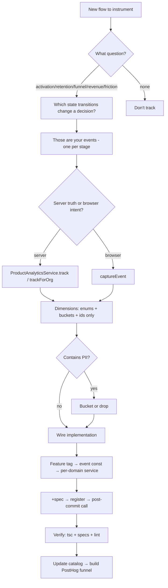

<Note>
This guide answers three questions in order: **what** to track, **why**, and **how** to wire it. Pair with the [Analytics System](/backend/analytics/system) (the primitives) and the [Event Catalog](/backend/analytics/event-catalog) (what already exists).
</Note>

## Mindset: Events Serve Questions

<Warning>
Do **not** start by listing every button. Start from a business question and work backwards. Every event you add must earn its place in a named funnel or metric.
</Warning>

If you can't say which question an event answers, don't add it.

The questions worth instrumenting almost always fall into:

<CardGroup cols={2}>
  <Card title="Activation" icon="rocket">
    Did a new org reach value? (`org_created` → `integration_connected` → first `lead_created`)
  </Card>
  <Card title="Retention / Engagement" icon="repeat">
    Do they come back / use the feature? (`*_viewed`, weekly actives)
  </Card>
  <Card title="Conversion Funnel" icon="filter">
    Where do they drop off? (`opened` → `submitted` → server `completed`)
  </Card>
  <Card title="Revenue / Supply" icon="dollar-sign">
    What drives money? (`unit_added` → `unit_transaction_recorded`)
  </Card>
  <Card title="Friction / Quality" icon="triangle-exclamation">
    What fails or frustrates? (`*_failed`, paywall shown, abandonment)
  </Card>
</CardGroup>

### Anti-patterns

<Warning>
Do **not** track:
- Per-keystroke noise
- Success-only events (capture failure too or the funnel lies)
- Anything already answerable from the DB/git
- Raw values that belong in a bucket
</Warning>

## Step 1: Decide WHAT — Map the Flow to Events

<Steps>
  <Step title="Sketch the flow">
    Draw the sequence of states a user/org passes through
  </Step>
  
  <Step title="Identify meaningful transitions">
    For each state transition, ask "would a drop here change a decision?" If yes → event
  </Step>
  
  <Step title="Collapse noise">
    - One event per real stage, not per re-render
    - Multi-step wizard → one event per step advance + one `*_abandoned` for drop-off
    - Bulk operation → one summary event with counts, never one event per row
  </Step>
  
  <Step title="Split client vs server truth">
    - **Server-authoritative outcomes** (created, completed, won, counts, status) → backend
    - **Intent / engagement / drop-off** (opened, switched, viewed, abandoned) → frontend (the server never sees an abandon)
  </Step>
  
  <Step title="Write the funnel(s) first">
    Document the funnel(s) the events feed *before* coding — that validates the set is sufficient and minimal
  </Step>
</Steps>

## Step 2: Decide DIMENSIONS — Enums + Buckets + IDs Only

For each event, list properties that let you *slice* the funnel.

### Allowed Dimensions

<Tabs>
  <Tab title="Enums / Categoricals">
    Status, type, source, role, provider, side (the system-type, never an org-customizable display name)
    
    ```typescript
    { status: 'active', provider: 'salesforce', role: 'admin' }
    ```
  </Tab>
  
  <Tab title="Buckets">
    - `bucketValue` (money)
    - `bucketDays` (duration/tenure)
    - `bucketCount` (counts)
    
    **Never the raw figure.**
    
    ```typescript
    { bucketValue: '1k-10k', bucketDays: '30-90', bucketCount: '10-50' }
    ```
  </Tab>
  
  <Tab title="Booleans">
    ```typescript
    { has_company_link: true, had_errors: false, is_primary: true }
    ```
  </Tab>
  
  <Tab title="Opaque IDs">
    `deal_id`, `entity_id` as funnel join keys (not content)
    
    ```typescript
    { deal_id: 'deal_abc123', entity_id: 'ent_xyz789' }
    ```
  </Tab>
  
  <Tab title="Changed-field Tracking">
    Send field **names** (schema), never their values
    
    ```typescript
    { changed_fields: ['status', 'assignee', 'priority'] }
    ```
  </Tab>
</Tabs>

### PII Hard-Exclusions

<Warning>
**Never track**: names, emails, phones, addresses, notes, titles, message text, record contents, raw money, credentials, raw errors, IPs.

When in doubt, bucket it or drop it.
</Warning>

## Step 3: Decide ATTRIBUTION

| Context | Use | distinctId |
|---------|-----|------------|
| User action in a request | `track(...)` | `userId` from CLS |
| System / webhook / cron / **queue worker** | `trackForOrg(..., orgId)` | `org-{orgId}` |
| Frontend (browser) | `captureEvent(feature, event, props)` | ambient posthog-js identity |

<Info>
All events attach the `organization` group → funnels aggregate by org. If a funnel's conversion unit is an entity (e.g. a deal), aggregate by a shared id instead (HogQL `coalesce(...)`).
</Info>

## Step 4: Backend Implementation Recipe

<Steps>
  <Step title="Add feature tag">
    Add to `POSTHOG_FEATURE` in `posthog.constants.ts` (and `FEATURE` in the FE `features.ts` if there's a client side)
    
    ```typescript
    export const POSTHOG_FEATURE = {
      // ...
      MY_FEATURE: 'my_feature',
    } as const;
    ```
  </Step>
  
  <Step title="Define event names">
    Add a `<DOMAIN>_EVENTS` const block in `posthog-events.constants.ts`
    
    ```typescript
    export const MY_DOMAIN_EVENTS = {
      ENTITY_CREATED: 'entity_created',
      ENTITY_UPDATED: 'entity_updated',
      ENTITY_DELETED: 'entity_deleted',
    } as const;
    ```
  </Step>
  
  <Step title="Create per-domain service">
    Create `modules/<domain>/<domain>-analytics.service.ts`. Mirror `deal-analytics.service.ts`:
    
    - Constructor injects `ProductAnalyticsService`
    - A private `emit()` wraps `track` in `try/catch`
    - A private `emitForOrg()` wrapping `trackForOrg` if a worker path exists
    - One method per event; it does the enum mapping + bucketing
    
    ```typescript
    @Injectable()
    export class MyDomainAnalyticsService {
      constructor(
        @Optional() private readonly analytics?: ProductAnalyticsService,
      ) {}

      private emit(event: string, userId: string, properties: Record<string, unknown>) {
        try {
          this.analytics?.track(event, userId, properties);
        } catch (error) {
          // silent fail - analytics should never break the app
        }
      }

      entityCreated(ctx: RequestContext, entityId: string, type: string) {
        this.emit(MY_DOMAIN_EVENTS.ENTITY_CREATED, ctx.userId, {
          entity_id: entityId,
          entity_type: type,
          organization: ctx.organizationId,
        });
      }
    }
    ```
  </Step>
  
  <Step title="Add tests">
    Create a `*.service.spec.ts`:
    
    - Assert bucketed/enum dims
    - Assert raw values are NOT present
    - Assert it never throws
    
    ```typescript
    describe('MyDomainAnalyticsService', () => {
      it('should bucket numeric values', () => {
        // test implementation
      });
      
      it('should not include PII', () => {
        // test implementation
      });
    });
    ```
  </Step>
  
  <Step title="Register the service">
    Add the service to its module's `providers` (and `exports` if another module's worker needs it)
    
    ```typescript
    @Module({
      providers: [MyDomainAnalyticsService],
      exports: [MyDomainAnalyticsService],
    })
    export class MyDomainModule {}
    ```
  </Step>
  
  <Step title="Wire call sites">
    Capture data inside the txn into an outer `let`, fire **after** commit:
    
    ```typescript
    let entityId: string;
    await this.db.transaction(async (tx) => {
      const entity = await tx.entity.create({ ... });
      entityId = entity.id;
    });
    
    this.myDomainAnalytics?.entityCreated(ctx, entityId, type);
    ```
    
    Keep it a one-liner.
  </Step>
  
  <Step title="Worker path (if applicable)">
    Fire `trackForOrg`-backed methods from the queue handler; read final counts via a service snapshot getter
    
    Raw counts never leave the worker — bucket them in the analytics service.
  </Step>
</Steps>

### Constructor Injection — The Gotcha

<Warning>
Adding a constructor param breaks specs differently by construction style.
</Warning>

**Check the spec first** (`grep "new <Service>(" ...spec.ts` vs `Test.createTestingModule`):

<Tabs>
  <Tab title="Make it optional">
    Make the new param **trailing + optional** (`?`) so positional specs (`new Service(a,b,c)`) keep compiling without the extra arg
    
    ```typescript
    constructor(
      private readonly someService: SomeService,
      @Optional() private readonly analytics?: ProductAnalyticsService,
    ) {}
    ```
    
    Guard every call with `?.`:
    
    ```typescript
    this.analytics?.track(...);
    ```
  </Tab>
  
  <Tab title="Test-module specs">
    Also need **`@Optional()`** on the param, or DI fails to resolve a non-global provider and the whole suite errors
    
    ```typescript
    @Injectable()
    export class MyService {
      constructor(
        @Optional() private readonly analytics?: ProductAnalyticsService,
      ) {}
    }
    ```
  </Tab>
</Tabs>

<Tip>
Analytics is best-effort, so `?.`-guarded optional is correct semantically too.
</Tip>

## Step 5: Frontend Implementation Recipe

<Steps>
  <Step title="Add events to constants">
    Add the events to the right `*_EVENTS` const in `src/lib/analytics/events.ts`, add the `*EventName` type, and union it into `AnalyticsEventName`
    
    ```typescript
    export const MY_FEATURE_EVENTS = {
      DIALOG_OPENED: 'dialog_opened',
      FORM_SUBMITTED: 'form_submitted',
      FORM_ABANDONED: 'form_abandoned',
    } as const;

    export type MyFeatureEventName = typeof MY_FEATURE_EVENTS[keyof typeof MY_FEATURE_EVENTS];
    export type AnalyticsEventName = ... | MyFeatureEventName;
    ```
  </Step>
  
  <Step title="Fire events at call sites">
    Use `captureEvent(FEATURE.<x>, <EVENTS>.<NAME>, { ...dims })` at the handler/callback
    
    ```typescript
    const handleSubmit = async (data: FormData) => {
      captureEvent(
        FEATURE.MY_FEATURE,
        MY_FEATURE_EVENTS.FORM_SUBMITTED,
        { field_count: data.fields.length }
      );
      
      await submitForm(data);
    };
    ```
  </Step>
  
  <Step title="Mount-once view events">
    Use an engagement island with a `useRef` guard (see `src/components/analytics/*`)
    
    ```typescript
    const MyFeatureView = () => {
      const hasTrackedView = useRef(false);
      
      useEffect(() => {
        if (!hasTrackedView.current) {
          captureEvent(FEATURE.MY_FEATURE, MY_FEATURE_EVENTS.VIEW_LOADED, {});
          hasTrackedView.current = true;
        }
      }, []);
      
      return <div>...</div>;
    };
    ```
  </Step>
  
  <Step title="Generic/shared components">
    Don't hardcode a feature's events inside them. Add **optional callback props** (`onFileSelected`, `onAbandoned`, …) and let the feature-specific wrapper supply handlers that call `captureEvent`
    
    ```typescript
    // Generic component
    interface FilePickerProps {
      onFileSelected?: (file: File) => void;
    }
    
    // Feature-specific wrapper
    <FilePicker
      onFileSelected={(file) => {
        captureEvent(FEATURE.MY_FEATURE, MY_FEATURE_EVENTS.FILE_SELECTED, {
          file_type: file.type,
        });
      }}
    />
    ```
    
    Keeps siblings uninstrumented.
  </Step>
</Steps>

## Step 6: Verify Every Change

<Check>
Run the following checks for every analytics change:
</Check>

<AccordionGroup>
  <Accordion title="Backend Typecheck">
    ```bash
    npx tsc --noEmit -p tsconfig.json
    ```
    
    Then grep your files. Known pre-existing errors (ignore):
    - `event.service.spec`
    - `task.service.spec`
    - `contact.controller.spec`
    - Two `calendar/*e2e`
    - ai-agent `InboundPersistedEvent`
  </Accordion>
  
  <Accordion title="Specs">
    ```bash
    npx jest <name>.spec
    ```
    
    Run the touched services' specs — confirm no constructor-arity / DI regressions.
  </Accordion>
  
  <Accordion title="Lint">
    Backend:
    ```bash
    npx eslint --fix <files>
    ```
    
    Frontend:
    ```bash
    npx tsc --noEmit
    npx eslint <files>
    ```
  </Accordion>
  
  <Accordion title="Update the Catalog">
    Update the [Event Catalog](/backend/analytics/event-catalog) — add the new events under their feature with:
    - Fired-from location
    - Attribution
    - Dimensions
    - Funnel
    - Status
  </Accordion>
</AccordionGroup>

## Naming Conventions

<Tabs>
  <Tab title="Format">
    Use `snake_case`, present/past as fits:
    
    ```
    lead_created
    contact_import_submitted
    dialog_opened
    ```
  </Tab>
  
  <Tab title="Shape">
    `<object>_<verb>` or `<feature>_<object>_<verb>` when collision-prone:
    
    ```
    contact_created
    contact_import_completed
    deal_stage_changed
    ```
  </Tab>
  
  <Tab title="FE ↔ BE Pairing">
    A server-truth outcome and its client-intent counterpart are distinct events, joined by the org group:
    
    | Frontend | Backend |
    |----------|---------|
    | `contact_import_submitted` | `contact_import_completed` |
    | `dialog_opened` | `entity_created` |
    | `form_abandoned` | — |
  </Tab>
  
  <Tab title="Registry Sync">
    Keep the FE registry and BE constants names identical where the same logical event exists
    
    ```typescript
    // Frontend
    export const MY_EVENTS = {
      ENTITY_CREATED: 'entity_created',
    };
    
    // Backend
    export const MY_EVENTS = {
      ENTITY_CREATED: 'entity_created',
    };
    ```
  </Tab>
</Tabs>

## Decision Flow Quick Reference



<Tip>
Always start from a business question and work backwards. If you can't name the funnel or metric an event feeds, don't add it.
</Tip>