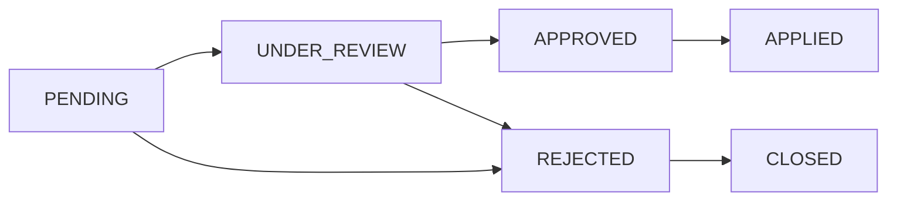

# Complete API Specification

This comprehensive API specification covers all endpoints for developer search, entity management, lookups, mutations, and change requests. All endpoints use RESTful conventions and require appropriate authentication.

<Note>
All endpoints require proper authentication unless otherwise specified. Bearer tokens are used for most endpoints, while developer search uses API key authentication.
</Note>

## 1. Developer Search

Fuzzy search for developers by name using PostgreSQL `pg_trgm` similarity matching.

### `GET /developers/search`

**Authentication:** API key (`ApiAuthGuard`)

<Info>
This endpoint uses PostgreSQL's `pg_trgm` extension for fuzzy text matching, providing intelligent search results even with partial or misspelled names.
</Info>

#### Query Parameters

| Parameter | Type   | Required | Default | Constraints  |
|-----------|--------|----------|---------|--------------|
| `q`       | string | yes      | —       | min length 1 |
| `limit`   | int    | no       | `10`    | 1–50         |

#### How It Works

<Steps>
<Step title="Query Processing">
Trims the query string `q` and runs `similarity()` against both `name_en` and `name_ar` columns
</Step>
<Step title="Filtering">
Filters rows where either similarity score is greater than 0.15
</Step>
<Step title="Sorting">
Orders results by the highest of the two similarity scores (descending)
</Step>
<Step title="Limiting">
Returns up to `limit` results
</Step>
</Steps>

<Warning>
This endpoint requires the `pg_trgm` PostgreSQL extension to be installed and enabled.
</Warning>

#### Response `200 OK`

```json
[
  {
    "id": 42,
    "nameEn": "Emaar Properties",
    "nameAr": "إعمار العقارية",
    "developerNumber": "DEV-001",
    "logo": "https://…/logo.png",
    "logoDark": "https://…/logo-dark.png",
    "licenseUrl": "https://…/license.pdf",
    "similarity": 0.85
  }
]
```

<Note>
All fields except `id` and `similarity` are nullable.
</Note>

### Developer Entity Schema

The `developers` table contains the following structure:

<AccordionGroup>
<Accordion title="Core Developer Fields">

| Column                   | Type                 | Notes                      |
|--------------------------|----------------------|----------------------------|
| `id`                     | int PK               | auto-increment             |
| `source_developer_id`    | varchar(50)          | unique, external source ID |
| `developer_number`       | varchar(50)          | nullable                   |
| `name_en`                | varchar(500)         | nullable, indexed          |
| `name_ar`                | varchar(500)         | nullable, indexed          |
| `registration_date`      | date                 | nullable                   |

</Accordion>

<Accordion title="License Information">

| Column                | Type                 | Notes     |
|-----------------------|----------------------|-----------|
| `license_source`      | FK → license_sources | nullable  |
| `license_type`        | FK → license_types   | nullable  |
| `license_number`      | varchar(100)         | nullable  |
| `license_issue_date`  | date                 | nullable  |
| `license_expiry_date` | date                 | nullable  |
| `license_url`         | varchar(500)         | nullable  |

</Accordion>

<Accordion title="Contact & Business Details">

| Column                   | Type                | Notes     |
|--------------------------|---------------------|-----------|
| `chamber_of_commerce_no` | varchar(100)        | nullable  |
| `legal_status`           | FK → legal_statuses | nullable  |
| `webpage`                | varchar(500)        | nullable  |
| `phone`                  | varchar(100)        | nullable  |
| `fax`                    | varchar(100)        | nullable  |
| `logo`                   | varchar(500)        | nullable  |
| `logo_dark`              | varchar(500)        | nullable  |

</Accordion>

<Accordion title="Timestamps">

| Column       | Type        | Notes               |
|--------------|-------------|---------------------|
| `created_at` | timestamptz | default `now()`     |
| `updated_at` | timestamptz | auto-updated        |
| `deleted_at` | timestamptz | nullable, soft-delete |

</Accordion>
</AccordionGroup>

**Relationships:** 
- `projects` (one-to-many via `developer`)
- `masterProjects` (one-to-many via `masterDeveloper`)

## 2. Entity GET Endpoints

All endpoints require a Bearer token (`Authorization: Bearer <token>`). All list endpoints return a paginated envelope:

```json
{
  "data": [...],
  "total": 1234,
  "page": 1,
  "limit": 20
}
```

### Configurable Includes

<Tip>
Every entity supports an optional `include` query parameter that controls which relations and computed fields are returned, helping optimize response size and query performance.
</Tip>

| Value           | Behavior                                                          |
|-----------------|-------------------------------------------------------------------|
| _(omitted)_     | Default relations populated (backward-compatible, same as before) |
| `none`          | No relations or stats — only scalar fields                       |
| `all`           | All allowed relations and stats                                   |
| `field1,field2` | Only the specified relations/stats                               |

<Warning>
Invalid `include` values return `400` with the list of allowed options. Virtual includes like `stats` and `buildingAreas` control expensive aggregate queries rather than ORM relations.
</Warning>

### 2.1 Developers

#### `GET /api/developers`

<Tabs>
<Tab title="Parameters">

| Parameter   | Type   | Required | Default  | Constraints                                              |
|-------------|--------|----------|----------|----------------------------------------------------------|
| `page`      | int    | no       | `1`      | ≥ 1                                                      |
| `limit`     | int    | no       | `20`     | 1–100                                                    |
| `sortBy`    | string | no       | `nameEn` | `id`, `nameEn`, `nameAr`, `developerNumber`, `createdAt` |
| `sortOrder` | string | no       | `asc`    | `asc`, `desc`                                            |
| `nameEn`    | string | no       | —        | substring filter                                         |
| `nameAr`    | string | no       | —        | substring filter                                         |
| `search`    | string | no       | —        | searches `nameEn`, `nameAr`                              |
| `include`   | string | no       | —        | allowed: `stats`                                         |

</Tab>
<Tab title="Response">

**Default includes (list):** _(none)_

**Response item:**

| Field             | Type   | Always Present |
|-------------------|--------|----------------|
| `id`              | number | yes            |
| `nameEn`          | string | —              |
| `nameAr`          | string | —              |
| `developerNumber` | string | —              |
| `logo`            | string | —              |
| `logoDark`        | string | —              |

</Tab>
</Tabs>

#### `GET /api/developers/:id`

| Parameter | Type           | Required |
|-----------|----------------|----------|
| `id`      | int (path)     | yes      |
| `include` | string (query) | no       |

**Default includes (detail):** `stats`  
**Allowed includes:** `stats`

**Response (extends list item):**

| Field               | Type   | Notes                                                               |
|---------------------|--------|---------------------------------------------------------------------|
| `sourceDeveloperId` | string | always present                                                      |
| `stats`             | object | `{ projectsCount, masterProjectsCount }` — only if `stats` included |

### 2.2 Cities

#### `GET /api/cities`

<Tabs>
<Tab title="Parameters">

| Parameter   | Type   | Required | Default  | Constraints                                    |
|-------------|--------|----------|----------|------------------------------------------------|
| `page`      | int    | no       | `1`      | ≥ 1                                            |
| `limit`     | int    | no       | `20`     | 1–100                                          |
| `sortBy`    | string | no       | `nameEn` | `id`, `nameEn`, `nameAr`, `state`, `createdAt` |
| `sortOrder` | string | no       | `asc`    | `asc`, `desc`                                  |
| `nameEn`    | string | no       | —        | substring filter                               |
| `nameAr`    | string | no       | —        | substring filter                               |
| `search`    | string | no       | —        | searches `nameEn`, `nameAr`, `state.nameEn`    |
| `stateId`   | int    | no       | —        | filter by state                                |
| `include`   | string | no       | —        | allowed: `state`, `stats`                      |

</Tab>
<Tab title="Response">

**Default includes (list):** `state`

**Response item:**

| Field    | Type                   | Notes       |
|----------|------------------------|-------------|
| `id`     | number                 | always      |
| `nameEn` | string                 | always      |
| `nameAr` | string                 | —           |
| `state`  | `{ id, nameEn, code }` | if included |

</Tab>
</Tabs>

#### `GET /api/cities/:id`

**Default includes (detail):** `state`, `stats`

**Response (extends list item):**

| Field   | Type   | Notes                                                                                                                         |
|---------|--------|-------------------------------------------------------------------------------------------------------------------------------|
| `stats` | object | `{ areasCount, projectsCount, buildingsCount, unitsCount, transactionsCount, rentContractsCount }` — only if `stats` included |

### 2.3 Areas

#### `GET /api/areas`

<Tabs>
<Tab title="Parameters">

| Parameter   | Type   | Required | Default  | Constraints                                                         |
|-------------|--------|----------|----------|---------------------------------------------------------------------|
| `page`      | int    | no       | `1`      | ≥ 1                                                                 |
| `limit`     | int    | no       | `20`     | 1–100                                                               |
| `sortBy`    | string | no       | `nameEn` | `id`, `nameEn`, `nameAr`, `city`, `municipalityNumber`, `createdAt` |
| `sortOrder` | string | no       | `asc`    | `asc`, `desc`                                                       |
| `nameEn`    | string | no       | —        | substring filter                                                    |
| `nameAr`    | string | no       | —        | substring filter                                                    |
| `search`    | string | no       | —        | searches `nameEn`, `nameAr`, `city.nameEn`                          |
| `cityId`    | int    | no       | —        | filter by city                                                      |
| `include`   | string | no       | —        | allowed: `city`, `city.state`, `stats`                              |

</Tab>
<Tab title="Response">

**Default includes (list):** `city`

**Response item:**

| Field                | Type             | Notes       |
|----------------------|------------------|-------------|
| `id`                 | number           | always      |
| `nameEn`             | string           | always      |
| `nameAr`             | string           | —           |
| `municipalityNumber` | string           | —           |
| `imageUrl`           | string           | —           |
| `city`               | `{ id, nameEn }` | if included |

</Tab>
</Tabs>

#### `GET /api/areas/:id`

**Default includes (detail):** `city`, `stats`  
**Allowed includes:** `city`, `city.state`, `stats`

**Response (extends list item):**

| Field          | Type   | Notes                                                                                  |
|----------------|--------|----------------------------------------------------------------------------------------|
| `sourceAreaId` | string | always                                                                                 |
| `stats`        | object | `{ projectsCount, buildingsCount, unitsCount, transactionsCount, rentContractsCount }` |

### 2.4 Communities

#### `GET /api/communities`

<Tabs>
<Tab title="Parameters">

| Parameter   | Type   | Required | Default  | Constraints                                   |
|-------------|--------|----------|----------|-----------------------------------------------|
| `page`      | int    | no       | `1`      | ≥ 1                                           |
| `limit`     | int    | no       | `20`     | 1–100                                         |
| `sortBy`    | string | no       | `nameEn` | `id`, `nameEn`, `nameAr`, `area`, `createdAt` |
| `sortOrder` | string | no       | `asc`    | `asc`, `desc`                                 |
| `nameEn`    | string | no       | —        | substring filter                              |
| `nameAr`    | string | no       | —        | substring filter                              |
| `search`    | string | no       | —        | searches `nameEn`, `nameAr`, `area.nameEn`    |
| `areaId`    | int    | no       | —        | filter by area                                |
| `include`   | string | no       | —        | allowed: `area`, `area.city`, `stats`         |

</Tab>
<Tab title="Response">

**Default includes (list):** `area`

**Response item:**

| Field    | Type             | Notes       |
|----------|------------------|-------------|
| `id`     | number           | always      |
| `nameEn` | string           | always      |
| `nameAr` | string           | —           |
| `area`   | `{ id, nameEn }` | if included |

</Tab>
</Tabs>

#### `GET /api/communities/:id`

**Default includes (detail):** `area`, `stats`  
**Allowed includes:** `area`, `area.city`, `area.city.state`, `stats`

**Response (extends list item):**

| Field              | Type   | Notes                                                                                  |
|--------------------|--------|----------------------------------------------------------------------------------------|
| `sourceCommunityId`| string | always                                                                                 |
| `stats`            | object | `{ projectsCount, buildingsCount, unitsCount, transactionsCount, rentContractsCount }` |

## 3. Lookup Endpoints

<Info>
Lookup endpoints provide reference data for dropdowns, filters, and validation. These endpoints typically return simple key-value pairs or basic entity information.
</Info>

### Common Lookup Response Format

Most lookup endpoints return arrays of objects with the following structure:

```json
[
  {
    "id": 1,
    "nameEn": "English Name",
    "nameAr": "Arabic Name",
    "code": "CODE"
  }
]
```

### Available Lookup Endpoints

<CardGroup cols={2}>
<Card title="License Sources" href="#license-sources">
Get all available license sources
</Card>
<Card title="License Types" href="#license-types">
Get all license type options
</Card>
<Card title="Legal Statuses" href="#legal-statuses">
Get all legal status options
</Card>
<Card title="Property Types" href="#property-types">
Get all property type classifications
</Card>
</CardGroup>

## 4. Direct Entity Mutations

<Warning>
Direct mutations bypass the change request system and immediately modify data. Use with caution in production environments.
</Warning>

### Mutation Authentication

All mutation endpoints require:
- Valid Bearer token
- Appropriate user permissions
- CSRF protection (where applicable)

### Common Mutation Patterns

<Steps>
<Step title="Validation">
Request payload is validated against entity schema
</Step>
<Step title="Authorization">
User permissions are checked for the specific operation
</Step>
<Step title="Execution">
Database transaction is executed with optimistic locking
</Step>
<Step title="Response">
Updated entity is returned with success status
</Step>
</Steps>

### Error Responses

<Tabs>
<Tab title="Validation Error">
```json
{
  "statusCode": 400,
  "message": "Validation failed",
  "errors": [
    {
      "field": "nameEn",
      "message": "Name is required"
    }
  ]
}
```
</Tab>
<Tab title="Authorization Error">
```json
{
  "statusCode": 403,
  "message": "Insufficient permissions"
}
```
</Tab>
<Tab title="Not Found">
```json
{
  "statusCode": 404,
  "message": "Entity not found"
}
```
</Tab>
</Tabs>

## 5. Change Requests

<Tip>
The change request system provides a controlled workflow for data modifications, allowing for review and approval processes before changes are applied.
</Tip>

### Change Request Workflow

<Steps>
<Step title="Submission">
User submits a change request with proposed modifications
</Step>
<Step title="Review">
Authorized reviewers examine the proposed changes
</Step>
<Step title="Approval/Rejection">
Reviewers approve or reject the change request
</Step>
<Step title="Application">
Approved changes are automatically applied to the target entities
</Step>
</Steps>

### Change Request Types

| Type | Description | Auto-Apply |
|------|-------------|------------|
| `CREATE` | New entity creation | No |
| `UPDATE` | Modify existing entity | No |
| `DELETE` | Soft delete entity | No |
| `BULK_UPDATE` | Multiple entity updates | No |

### Change Request Status Flow



<Check>
This API specification covers all major endpoints and functionality. For specific implementation details or additional endpoints, refer to the individual service documentation.
</Check>