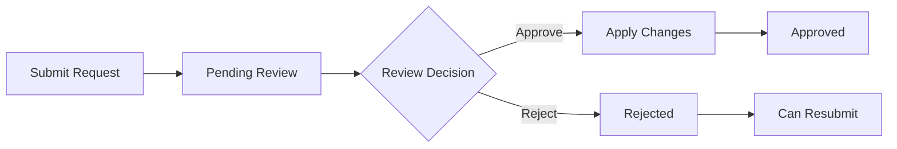

# Comprehensive API Specification

This document provides a comprehensive overview of all available API endpoints, including developer search, entity management, lookups, mutations, and change request workflows.

## Table of Contents

<CardGroup cols={2}>
  <Card title="Developer Search" href="#developer-search">
    Fuzzy search for developers by name
  </Card>
  <Card title="Entity GET Endpoints" href="#entity-get-endpoints">
    Read operations for all entities
  </Card>
  <Card title="Lookup Endpoints" href="#lookup-endpoints">
    Reference data and metadata
  </Card>
  <Card title="Direct Entity Mutations" href="#direct-entity-mutations">
    Direct create, update, delete operations
  </Card>
  <Card title="Change Requests" href="#change-requests">
    Workflow-based entity modifications
  </Card>
</CardGroup>

## Developer Search

Fuzzy search for developers by name using PostgreSQL `pg_trgm` similarity.

### `GET /developers/search`

<Note>
  **Authentication:** API key required (`ApiAuthGuard`)
</Note>

#### Query Parameters

| Parameter | Type   | Required | Default | Constraints  |
| --------- | ------ | -------- | ------- | ------------ |
| `q`       | string | yes      | —       | min length 1 |
| `limit`   | int    | no       | `10`    | 1–50         |

#### How It Works

<Steps>
  <Step title="Query Processing">
    Trims the `q` parameter and runs `similarity()` against both `name_en` and `name_ar` columns
  </Step>
  <Step title="Filtering">
    Filters rows where either similarity score > 0.15
  </Step>
  <Step title="Ordering">
    Orders by the highest of the two similarity scores (descending)
  </Step>
  <Step title="Limiting">
    Returns up to `limit` results
  </Step>
</Steps>

<Warning>
  Requires the `pg_trgm` PostgreSQL extension to be installed and enabled
</Warning>

#### Response `200 OK`

```json
[
  {
    "id": 42,
    "nameEn": "Emaar Properties",
    "nameAr": "إعمار العقارية",
    "developerNumber": "DEV-001",
    "logo": "https://example.com/logo.png",
    "logoDark": "https://example.com/logo-dark.png",
    "licenseUrl": "https://example.com/license.pdf",
    "similarity": 0.85
  }
]
```

<Info>
  All fields except `id` and `similarity` are nullable
</Info>

### Developer Entity Schema

The `developers` table contains the following columns:

<AccordionGroup>
  <Accordion title="Core Fields">
    | Column | Type | Notes |
    | ------ | ---- | ----- |
    | `id` | int PK | auto-increment |
    | `source_developer_id` | varchar(50) | unique, external source ID |
    | `developer_number` | varchar(50) | nullable |
    | `name_en` | varchar(500) | nullable, indexed |
    | `name_ar` | varchar(500) | nullable, indexed |
  </Accordion>
  
  <Accordion title="Registration & License">
    | Column | Type | Notes |
    | ------ | ---- | ----- |
    | `registration_date` | date | nullable |
    | `license_source` | FK → license_sources | nullable |
    | `license_type` | FK → license_types | nullable |
    | `license_number` | varchar(100) | nullable |
    | `license_issue_date` | date | nullable |
    | `license_expiry_date` | date | nullable |
  </Accordion>
  
  <Accordion title="Business Details">
    | Column | Type | Notes |
    | ------ | ---- | ----- |
    | `chamber_of_commerce_no` | varchar(100) | nullable |
    | `legal_status` | FK → legal_statuses | nullable |
    | `webpage` | varchar(500) | nullable |
    | `phone` | varchar(100) | nullable |
    | `fax` | varchar(100) | nullable |
  </Accordion>
  
  <Accordion title="Media & Metadata">
    | Column | Type | Notes |
    | ------ | ---- | ----- |
    | `license_url` | varchar(500) | nullable |
    | `logo` | varchar(500) | nullable |
    | `logo_dark` | varchar(500) | nullable |
    | `created_at` | timestamptz | default `now()` |
    | `updated_at` | timestamptz | auto-updated |
    | `deleted_at` | timestamptz | nullable, soft-delete |
  </Accordion>
</AccordionGroup>

**Relationships:** 
- `projects` (one-to-many via `developer`)
- `masterProjects` (one-to-many via `masterDeveloper`)

## Entity GET Endpoints

<Warning>
  All endpoints require a Bearer token (`Authorization: Bearer <token>`)
</Warning>

All list endpoints return a paginated envelope:

```json
{
  "data": [...],
  "total": 1234,
  "page": 1,
  "limit": 20
}
```

### Configurable Includes

Every entity supports an optional `include` query parameter that controls which relations and computed fields are returned:

| Value | Behavior |
| ----- | -------- |
| _(omitted)_ | Default relations populated (backward-compatible) |
| `none` | No relations or stats — only scalar fields |
| `all` | All allowed relations and stats |
| `field1,field2` | Only the specified relations/stats |

<Tip>
  Invalid values return `400` with the list of allowed options. Virtual includes like `stats` and `buildingAreas` control expensive aggregate queries rather than ORM relations.
</Tip>

### Developers

#### `GET /api/developers`

<Tabs>
  <Tab title="Parameters">
    | Parameter | Type | Required | Default | Constraints |
    | --------- | ---- | -------- | ------- | ----------- |
    | `page` | int | no | `1` | ≥ 1 |
    | `limit` | int | no | `20` | 1–100 |
    | `sortBy` | string | no | `nameEn` | `id`, `nameEn`, `nameAr`, `developerNumber`, `createdAt` |
    | `sortOrder` | string | no | `asc` | `asc`, `desc` |
    | `nameEn` | string | no | — | substring filter |
    | `nameAr` | string | no | — | substring filter |
    | `search` | string | no | — | searches `nameEn`, `nameAr` |
    | `include` | string | no | — | allowed: `stats` |
  </Tab>
  
  <Tab title="Response">
    **Default includes (list):** _(none)_

    | Field | Type | Always present |
    | ----- | ---- | -------------- |
    | `id` | number | yes |
    | `nameEn` | string | — |
    | `nameAr` | string | — |
    | `developerNumber` | string | — |
    | `logo` | string | — |
    | `logoDark` | string | — |
  </Tab>
</Tabs>

#### `GET /api/developers/:id`

| Parameter | Type | Required |
| --------- | ---- | -------- |
| `id` | int (path) | yes |
| `include` | string (query) | no |

**Default includes (detail):** `stats`  
**Allowed includes:** `stats`

**Response (extends list item):**

| Field | Type | Notes |
| ----- | ---- | ----- |
| `sourceDeveloperId` | string | always present |
| `stats` | object | `{ projectsCount, masterProjectsCount }` — only if `stats` included |

### Cities

#### `GET /api/cities`

<Tabs>
  <Tab title="Parameters">
    | Parameter | Type | Required | Default | Constraints |
    | --------- | ---- | -------- | ------- | ----------- |
    | `page` | int | no | `1` | ≥ 1 |
    | `limit` | int | no | `20` | 1–100 |
    | `sortBy` | string | no | `nameEn` | `id`, `nameEn`, `nameAr`, `state`, `createdAt` |
    | `sortOrder` | string | no | `asc` | `asc`, `desc` |
    | `nameEn` | string | no | — | substring filter |
    | `nameAr` | string | no | — | substring filter |
    | `search` | string | no | — | searches `nameEn`, `nameAr`, `state.nameEn` |
    | `stateId` | int | no | — | filter by state |
    | `include` | string | no | — | allowed: `state`, `stats` |
  </Tab>
  
  <Tab title="Response">
    **Default includes (list):** `state`

    | Field | Type | Notes |
    | ----- | ---- | ----- |
    | `id` | number | always |
    | `nameEn` | string | always |
    | `nameAr` | string | — |
    | `state` | `{ id, nameEn, code }` | if included |
  </Tab>
</Tabs>

#### `GET /api/cities/:id`

**Default includes (detail):** `state`, `stats`

**Response (extends list item):**

| Field | Type | Notes |
| ----- | ---- | ----- |
| `stats` | object | `{ areasCount, projectsCount, buildingsCount, unitsCount, transactionsCount, rentContractsCount }` — only if `stats` included |

### Areas

#### `GET /api/areas`

<Tabs>
  <Tab title="Parameters">
    | Parameter | Type | Required | Default | Constraints |
    | --------- | ---- | -------- | ------- | ----------- |
    | `page` | int | no | `1` | ≥ 1 |
    | `limit` | int | no | `20` | 1–100 |
    | `sortBy` | string | no | `nameEn` | `id`, `nameEn`, `nameAr`, `city`, `municipalityNumber`, `createdAt` |
    | `sortOrder` | string | no | `asc` | `asc`, `desc` |
    | `nameEn` | string | no | — | substring filter |
    | `nameAr` | string | no | — | substring filter |
    | `search` | string | no | — | searches `nameEn`, `nameAr`, `city.nameEn` |
    | `cityId` | int | no | — | filter by city |
    | `include` | string | no | — | allowed: `city`, `city.state`, `stats` |
  </Tab>
  
  <Tab title="Response">
    **Default includes (list):** `city`

    | Field | Type | Notes |
    | ----- | ---- | ----- |
    | `id` | number | always |
    | `nameEn` | string | always |
    | `nameAr` | string | — |
    | `municipalityNumber` | string | — |
    | `imageUrl` | string | — |
    | `city` | `{ id, nameEn }` | if included |
  </Tab>
</Tabs>

#### `GET /api/areas/:id`

**Default includes (detail):** `city`, `stats`  
**Allowed includes:** `city`, `city.state`, `stats`

**Response (extends list item):**

| Field | Type | Notes |
| ----- | ---- | ----- |
| `sourceAreaId` | string | always |
| `stats` | object | `{ projectsCount, buildingsCount, unitsCount, transactionsCount, rentContractsCount }` |

### Communities

#### `GET /api/communities`

<Tabs>
  <Tab title="Parameters">
    | Parameter | Type | Required | Default | Constraints |
    | --------- | ---- | -------- | ------- | ----------- |
    | `page` | int | no | `1` | ≥ 1 |
    | `limit` | int | no | `20` | 1–100 |
    | `sortBy` | string | no | `nameEn` | `id`, `nameEn`, `nameAr`, `area`, `createdAt` |
    | `sortOrder` | string | no | `asc` | `asc`, `desc` |
    | `nameEn` | string | no | — | substring filter |
    | `nameAr` | string | no | — | substring filter |
    | `search` | string | no | — | searches `nameEn`, `nameAr`, `area.nameEn` |
    | `areaId` | int | no | — | filter by area |
    | `include` | string | no | — | allowed: `area`, `area.city`, `area.city.state`, `stats` |
  </Tab>
  
  <Tab title="Response">
    **Default includes (list):** `area`

    | Field | Type | Notes |
    | ----- | ---- | ----- |
    | `id` | number | always |
    | `nameEn` | string | always |
    | `nameAr` | string | — |
    | `area` | `{ id, nameEn }` | if included |
  </Tab>
</Tabs>

## Lookup Endpoints

<Info>
  Lookup endpoints provide reference data and metadata for the application. Most support basic filtering and sorting.
</Info>

### States

#### `GET /api/states`

Returns available states/provinces.

```json
[
  {
    "id": 1,
    "nameEn": "Dubai",
    "nameAr": "دبي",
    "code": "DU"
  }
]
```

### License Sources

#### `GET /api/license-sources`

Returns available license issuing authorities.

### License Types

#### `GET /api/license-types`

Returns different types of licenses that can be issued.

### Legal Statuses

#### `GET /api/legal-statuses`

Returns available legal entity statuses.

## Direct Entity Mutations

<Warning>
  Direct mutations bypass the change request workflow and immediately modify entities. Use with caution in production environments.
</Warning>

### Developers

#### `POST /api/developers`

Create a new developer entity.

<CodeGroup>
```json Request Body
{
  "sourceDeveloperId": "EXT-DEV-123",
  "nameEn": "New Developer LLC",
  "nameAr": "المطور الجديد ذ.م.م",
  "developerNumber": "DEV-456",
  "licenseNumber": "LIC-789",
  "phone": "+971-4-1234567",
  "webpage": "https://newdeveloper.com"
}
```

```json Response
{
  "id": 123,
  "sourceDeveloperId": "EXT-DEV-123",
  "nameEn": "New Developer LLC",
  "nameAr": "المطور الجديد ذ.م.م",
  "developerNumber": "DEV-456",
  "createdAt": "2024-01-15T10:30:00Z"
}
```
</CodeGroup>

#### `PUT /api/developers/:id`

Update an existing developer entity.

#### `DELETE /api/developers/:id`

Soft delete a developer entity (sets `deleted_at` timestamp).

<Note>
  Deleted developers are excluded from search results and list endpoints by default.
</Note>

### Cities

#### `POST /api/cities`

Create a new city entity.

#### `PUT /api/cities/:id`

Update an existing city.

#### `DELETE /api/cities/:id`

Soft delete a city.

### Areas

#### `POST /api/areas`

Create a new area entity.

#### `PUT /api/areas/:id`

Update an existing area.

#### `DELETE /api/areas/:id`

Soft delete an area.

## Change Requests

Change requests provide a workflow-based approach to entity modifications, allowing for approval processes and audit trails.

<Check>
  Change requests are the recommended approach for production entity modifications as they provide better traceability and control.
</Check>

### Creating Change Requests

#### `POST /api/change-requests`

Submit a new change request for entity modification.

<CodeGroup>
```json Create Developer Request
{
  "entityType": "developer",
  "operation": "create",
  "data": {
    "nameEn": "Proposed Developer",
    "nameAr": "المطور المقترح",
    "licenseNumber": "PROP-123"
  },
  "reason": "Adding new developer from verified source"
}
```

```json Update Developer Request
{
  "entityType": "developer",
  "entityId": 42,
  "operation": "update",
  "data": {
    "nameEn": "Updated Developer Name",
    "phone": "+971-4-9876543"
  },
  "reason": "Correcting contact information"
}
```

```json Delete Developer Request
{
  "entityType": "developer",
  "entityId": 42,
  "operation": "delete",
  "reason": "Developer no longer active"
}
```
</CodeGroup>

### Managing Change Requests

#### `GET /api/change-requests`

List all change requests with filtering options.

| Parameter | Type | Description |
| --------- | ---- | ----------- |
| `status` | string | Filter by status: `pending`, `approved`, `rejected` |
| `entityType` | string | Filter by entity type: `developer`, `city`, `area`, `community` |
| `operation` | string | Filter by operation: `create`, `update`, `delete` |

#### `GET /api/change-requests/:id`

Get details of a specific change request.

#### `PUT /api/change-requests/:id/approve`

Approve a pending change request.

<Steps>
  <Step title="Validation">
    Verify the change request is in `pending` status
  </Step>
  <Step title="Apply Changes">
    Execute the requested operation on the target entity
  </Step>
  <Step title="Update Status">
    Mark the change request as `approved`
  </Step>
  <Step title="Audit Log">
    Record the approval in the audit trail
  </Step>
</Steps>

#### `PUT /api/change-requests/:id/reject`

Reject a pending change request.

```json
{
  "reason": "Insufficient documentation provided"
}
```

<Tip>
  Providing a detailed rejection reason helps requesters understand what needs to be corrected for resubmission.
</Tip>

### Change Request Workflow



<Info>
  Change requests maintain a complete audit trail including who submitted, reviewed, and approved each request along with timestamps and reasons.
</Info>