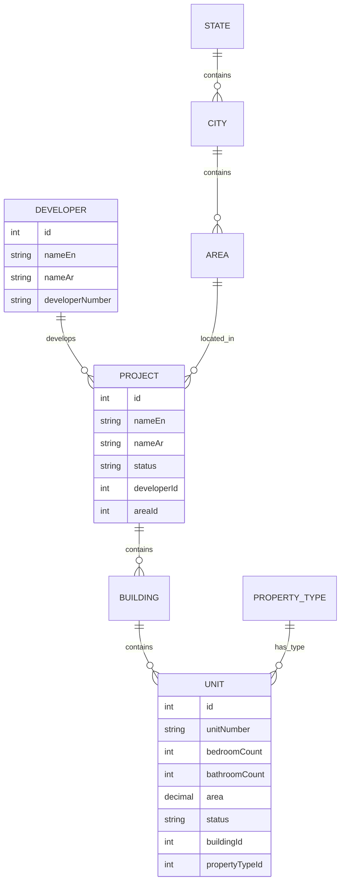

# PropWise Labs API Complete Reference

Complete API reference for external consumers (non-admin endpoints).

## Overview

### Base URL

All endpoints are prefixed with `/api`. Example:

```
https://your-domain.com/api/projects
```

### Authentication

The API supports two authentication methods:

<Tabs>
<Tab title="API Client Token (Recommended)">
1. Obtain an API key and secret from an admin
2. Exchange them for a short-lived Bearer token via `POST /api/auth/token`
3. Include the token on every request: `Authorization: Bearer <token>`
</Tab>
<Tab title="JWT (Dashboard Users)">
- Obtained via `POST /api/auth/login` (admin dashboard)
- Sent as `Authorization: Bearer <token>` or via the `access_token` httpOnly cookie
</Tab>
</Tabs>

Both methods are accepted on all external-facing endpoints. The API tries JWT first, then falls back to API key token.

#### Access Levels for API Clients

| Level   | Permissions                                                                                            |
| ------- | ------------------------------------------------------------------------------------------------------ |
| `basic` | Read-only access to all entity, lookup, analytics, and change-request endpoints                        |
| `super` | All of `basic` plus direct entity mutations (PATCH projects, PATCH buildings, POST/PATCH/DELETE units) |

### Paginated Response Envelope

All list endpoints return:

```json
{
  "data": [ ... ],
  "total": 1234,
  "page": 1,
  "limit": 20
}
```

Standard pagination query parameters:

| Param       | Type   | Default        | Constraints        |
| ----------- | ------ | -------------- | ------------------ |
| `page`      | int    | `1`            | >= 1               |
| `limit`     | int    | `20`           | 1--100             |
| `sortBy`    | string | _(per-entity)_ | allowlisted fields |
| `sortOrder` | string | `asc`          | `asc`, `desc`      |

### Configurable Includes

Most entity GET endpoints support an optional `include` query parameter that controls which relations and computed fields are returned:

| Value           | Behavior                                          |
| --------------- | ------------------------------------------------- |
| _(omitted)_     | Default relations populated (backward-compatible) |
| `none`          | No relations or stats -- only scalar fields       |
| `all`           | All allowed relations and stats                   |
| `field1,field2` | Only the specified relations/stats                |

<Note>Invalid values return `400` with the list of allowed options. Virtual includes like `stats` and `buildingAreas` control expensive aggregate queries rather than ORM relations.</Note>

### Error Response Format

<CodeGroup>
```json Standard Errors
{
  "statusCode": 404,
  "message": "Project not found",
  "error": "Not Found"
}
```

```json Validation Errors (400)
{
  "statusCode": 400,
  "message": [
    "limit must not be greater than 100",
    "sortBy must be one of the following values: id, name, area, status, createdAt"
  ],
  "error": "Bad Request"
}
```

```json Change Request Validation Errors (400)
{
  "message": "Validation failed",
  "errors": [{ 
    "path": "projects[0]", 
    "field": "name", 
    "message": "name should not be empty" 
  }]
}
```
</CodeGroup>

| Status | Meaning                                                              |
| ------ | -------------------------------------------------------------------- |
| `400`  | Validation error, bad request                                        |
| `401`  | Missing or invalid authentication                                    |
| `403`  | Insufficient permissions (e.g. `basic` client attempting a mutation) |
| `404`  | Entity not found                                                     |
| `409`  | Conflict (stale update in change requests)                           |

### Global Request Rules

<Info>
- All request bodies are JSON (`Content-Type: application/json`)
- Unknown fields in request bodies and query params are rejected (`forbidNonWhitelisted`)
- Query params are auto-coerced to their declared types (e.g. `"1"` becomes `1` for int fields)
- Comma-separated ID lists (e.g. `areaIds=1,2,3`) are parsed into integer arrays
- Soft-deleted records are excluded from all results
</Info>

## Authentication

### Exchange API Credentials for Token

<CodeGroup>
```bash cURL
curl -X POST https://your-domain.com/api/auth/token \
  -H "Content-Type: application/json" \
  -d '{
    "apiKey": "your-api-key",
    "apiSecret": "your-api-secret"
  }'
```

```javascript JavaScript
const response = await fetch('/api/auth/token', {
  method: 'POST',
  headers: { 'Content-Type': 'application/json' },
  body: JSON.stringify({
    apiKey: 'your-api-key',
    apiSecret: 'your-api-secret'
  })
});
```
</CodeGroup>

**Endpoint:** `POST /api/auth/token`

**Auth:** None (public endpoint)

**Request body:**

| Field       | Type   | Required | Constraints |
| ----------- | ------ | -------- | ----------- |
| `apiKey`    | string | yes      | non-empty   |
| `apiSecret` | string | yes      | non-empty   |

**Response `200 OK`:**

```json
{
  "access_token": "eyJhbGciOiJIUzI1NiIs...",
  "token_type": "Bearer",
  "expires_in": 1800
}
```

| Field          | Type   | Description                                        |
| -------------- | ------ | -------------------------------------------------- |
| `access_token` | string | JWT token to use in `Authorization: Bearer` header |
| `token_type`   | string | Always `"Bearer"`                                  |
| `expires_in`   | number | Token lifetime in seconds (default 1800 = 30 min)  |

**Error responses:**

| Status | Condition                 |
| ------ | ------------------------- |
| `401`  | Invalid API key or secret |
| `401`  | API client is disabled    |

## Entity Endpoints

<Warning>All entity endpoints require authentication via `ApiAuthGuard` (JWT or API client token).</Warning>

All list endpoints return the [paginated envelope](#paginated-response-envelope).

### Developers

#### List Developers

**Endpoint:** `GET /api/developers`

| Param       | Type   | Required | Default  | Constraints                                                                                           |
| ----------- | ------ | -------- | -------- | ----------------------------------------------------------------------------------------------------- |
| `page`      | int    | no       | `1`      | >= 1                                                                                                  |
| `limit`     | int    | no       | `20`     | 1--100                                                                                                |
| `sortBy`    | string | no       | `nameEn` | `id`, `nameEn`, `nameAr`, `developerNumber`, `createdAt`                                              |
| `sortOrder` | string | no       | `asc`    | `asc`, `desc`                                                                                         |
| `nameEn`    | string | no       | --       | substring filter                                                                                      |
| `nameAr`    | string | no       | --       | substring filter                                                                                      |
| `search`    | string | no       | --       | searches `nameEn`, `nameAr`                                                                           |
| `include`   | string | no       | --       | allowed: `licenseSource`, `licenseType`, `legalStatus`, `parentDeveloper`, `childDevelopers`, `stats` |

**Default includes (list):** _(none)_

**Response item:**

| Field             | Type   | Always present |
| ----------------- | ------ | -------------- |
| `id`              | number | yes            |
| `nameEn`          | string | --             |
| `nameAr`          | string | --             |
| `developerNumber` | string | --             |
| `logo`            | string | --             |
| `logoDark`        | string | --             |
| `licenseUrl`      | string | --             |

#### Get Developer by ID

**Endpoint:** `GET /api/developers/:id`

| Param     | Type           | Required |
| --------- | -------------- | -------- |
| `id`      | int (path)     | yes      |
| `include` | string (query) | no       |

**Default includes (detail):** `licenseSource`, `licenseType`, `legalStatus`, `parentDeveloper`, `childDevelopers`, `stats`
**Allowed includes:** `licenseSource`, `licenseType`, `legalStatus`, `parentDeveloper`, `childDevelopers`, `stats`

**Response (extends list item):**

| Field               | Type             | Notes                                                                |
| ------------------- | ---------------- | -------------------------------------------------------------------- |
| `sourceDeveloperId` | string           | always present                                                       |
| `licenseSource`     | `{ id, nameEn }` | if included                                                          |
| `licenseType`       | `{ id, nameEn }` | if included                                                          |
| `legalStatus`       | `{ id, nameEn }` | if included                                                          |
| `parentDeveloper`   | `{ id, nameEn }` | if included                                                          |
| `childDevelopers`   | array            | `[{ id, nameEn }]` -- if included                                    |
| `stats`             | object           | `{ projectsCount, masterProjectsCount }` -- only if `stats` included |

#### Search Developers

Fuzzy search for developers by name using PostgreSQL `pg_trgm` similarity.

**Endpoint:** `GET /api/developers/search`

| Param   | Type   | Required | Default | Constraints  |
| ------- | ------ | -------- | ------- | ------------ |
| `q`     | string | yes      | --      | min length 1 |
| `limit` | int    | no       | `10`    | 1--50        |

**How it works:**

<Steps>
<Step title="Process Query">
Trims `q`, then runs `similarity()` against both `name_en` and `name_ar` columns
</Step>
<Step title="Filter Results">
Filters rows where either similarity score > 0.15
</Step>
<Step title="Sort by Relevance">
Orders by the highest of the two scores (descending)
</Step>
<Step title="Limit Results">
Returns up to `limit` results
</Step>
</Steps>

**Response `200 OK`:**

```json
[
  {
    "id": 42,
    "nameEn": "Emaar Properties",
    "nameAr": "إعمار العقارية",
    "developerNumber": "DEV-001",
    "logo": "https://example.com/logo.png",
    "logoDark": "https://example.com/logo-dark.png",
    "licenseUrl": "https://example.com/license.pdf",
    "similarity": 0.85
  }
]
```

<Note>All fields except `id` and `similarity` are nullable.</Note>

### Cities

#### List Cities

**Endpoint:** `GET /api/cities`

| Param       | Type   | Required | Default  | Constraints                                    |
| ----------- | ------ | -------- | -------- | ---------------------------------------------- |
| `page`      | int    | no       | `1`      | >= 1                                           |
| `limit`     | int    | no       | `20`     | 1--100                                         |
| `sortBy`    | string | no       | `nameEn` | `id`, `nameEn`, `nameAr`, `state`, `createdAt` |
| `sortOrder` | string | no       | `asc`    | `asc`, `desc`                                  |
| `nameEn`    | string | no       | --       | substring filter                               |
| `nameAr`    | string | no       | --       | substring filter                               |
| `search`    | string | no       | --       | searches `nameEn`, `nameAr`, `state.nameEn`    |
| `stateId`   | int    | no       | --       | filter by state                                |
| `include`   | string | no       | --       | allowed: `state`, `stats`                      |

**Default includes (list):** `state`

**Response item:**

| Field    | Type                   | Notes       |
| -------- | ---------------------- | ----------- |
| `id`     | number                 | always present |
| `nameEn` | string                 | --          |
| `nameAr` | string                 | --          |
| `state`  | `{ id, nameEn }`      | if included |
| `stats`  | `{ projectsCount }`   | if included |

## Lookup Endpoints

Lookup endpoints provide reference data for dropdowns, filters, and form validation. All endpoints require authentication.

### Areas

**Endpoint:** `GET /api/areas`

Returns all area types (communities, sub-communities, etc.) with hierarchical relationships.

| Param     | Type   | Required | Default |
| --------- | ------ | -------- | ------- |
| `cityId`  | int    | no       | --      |
| `stateId` | int    | no       | --      |
| `type`    | string | no       | --      |

**Response:**

```json
[
  {
    "id": 1,
    "nameEn": "Dubai Marina",
    "nameAr": "مارينا دبي",
    "type": "community",
    "city": { "id": 1, "nameEn": "Dubai" },
    "state": { "id": 1, "nameEn": "Dubai" },
    "parentArea": { "id": 2, "nameEn": "Dubai" }
  }
]
```

### Property Types

**Endpoint:** `GET /api/property-types`

Returns all property types (apartment, villa, townhouse, etc.).

**Response:**

```json
[
  {
    "id": 1,
    "nameEn": "Apartment",
    "nameAr": "شقة",
    "category": "residential"
  }
]
```

## Direct Entity Mutations

<Warning>These endpoints require `super` level API client access.</Warning>

### Update Project

**Endpoint:** `PATCH /api/projects/:id`

**Request body:**

```json
{
  "nameEn": "Updated Project Name",
  "nameAr": "اسم المشروع المحدث",
  "description": "Updated description",
  "status": "active"
}
```

All fields are optional. Only provided fields will be updated.

### Create Unit

**Endpoint:** `POST /api/units`

**Request body:**

```json
{
  "buildingId": 123,
  "unitNumber": "A-101",
  "bedroomCount": 2,
  "bathroomCount": 2,
  "area": 1200.5,
  "propertyTypeId": 1,
  "status": "available"
}
```

### Update Unit

**Endpoint:** `PATCH /api/units/:id`

Similar to project updates - all fields optional, only provided fields updated.

### Delete Unit

**Endpoint:** `DELETE /api/units/:id`

<Warning>This performs a soft delete. The unit will be marked as deleted but not removed from the database.</Warning>

## Change Requests

Change requests allow batch operations with validation and approval workflows.

### Submit Change Request

**Endpoint:** `POST /api/change-requests`

**Request body:**

```json
{
  "type": "bulk_update",
  "description": "Update project statuses",
  "changes": {
    "projects": [
      {
        "id": 1,
        "nameEn": "Updated Name",
        "status": "active"
      }
    ],
    "units": [
      {
        "id": 100,
        "status": "sold",
        "salePrice": 850000
      }
    ]
  }
}
```

### Get Change Request Status

**Endpoint:** `GET /api/change-requests/:id`

**Response:**

```json
{
  "id": 123,
  "type": "bulk_update",
  "status": "pending",
  "description": "Update project statuses",
  "submittedAt": "2024-01-15T10:30:00Z",
  "submittedBy": { "id": 1, "email": "user@example.com" },
  "changes": { /* original changes */ },
  "validationErrors": [],
  "approvedAt": null,
  "approvedBy": null
}
```

## Market Analytics

Analytics endpoints provide market insights and trends.

### Market Trends

**Endpoint:** `GET /api/analytics/market-trends`

| Param      | Type   | Required | Default | Constraints           |
| ---------- | ------ | -------- | ------- | --------------------- |
| `areaId`   | int    | no       | --      | filter by area        |
| `cityId`   | int    | no       | --      | filter by city        |
| `period`   | string | no       | `1y`    | `1m`, `3m`, `6m`, `1y` |
| `metric`   | string | no       | `price` | `price`, `volume`, `inventory` |

**Response:**

```json
{
  "period": "1y",
  "metric": "price",
  "data": [
    {
      "date": "2024-01-01",
      "value": 850000,
      "change": 5.2,
      "volume": 145
    }
  ],
  "summary": {
    "averageValue": 875000,
    "totalChange": 12.5,
    "totalVolume": 1250
  }
}
```

### Price Comparisons

**Endpoint:** `GET /api/analytics/price-comparisons`

Compare prices across different areas, property types, or time periods.

**Response:**

```json
{
  "comparisons": [
    {
      "area": { "id": 1, "nameEn": "Dubai Marina" },
      "propertyType": { "id": 1, "nameEn": "Apartment" },
      "averagePrice": 950000,
      "medianPrice": 875000,
      "pricePerSqft": 1100,
      "sampleSize": 45
    }
  ]
}
```

## Unit Evaluation (AI Valuation)

AI-powered property valuation using machine learning models.

### Get Unit Valuation

**Endpoint:** `POST /api/unit-evaluations`

**Request body:**

```json
{
  "unitId": 123,
  "evaluationDate": "2024-01-15",
  "includeComparables": true
}
```

**Response:**

```json
{
  "unitId": 123,
  "evaluationDate": "2024-01-15T00:00:00Z",
  "estimatedValue": 950000,
  "confidence": 0.85,
  "priceRange": {
    "low": 900000,
    "high": 1000000
  },
  "comparables": [
    {
      "unitId": 124,
      "similarity": 0.92,
      "recentSalePrice": 925000,
      "saleDate": "2024-01-10T00:00:00Z"
    }
  ],
  "factors": {
    "location": 0.25,
    "size": 0.20,
    "condition": 0.15,
    "amenities": 0.10,
    "market": 0.30
  }
}
```

### Bulk Unit Evaluations

**Endpoint:** `POST /api/unit-evaluations/bulk`

**Request body:**

```json
{
  "unitIds": [123, 124, 125],
  "evaluationDate": "2024-01-15"
}
```

Returns array of individual evaluations.

## Appendix A: Enum Reference

<AccordionGroup>
<Accordion title="Project Status Values">
```json
[
  "planning",
  "approved", 
  "under_construction",
  "completed",
  "delivered",
  "on_hold",
  "cancelled"
]
```
</Accordion>

<Accordion title="Unit Status Values">
```json
[
  "available",
  "reserved",
  "sold",
  "rented",
  "off_market",
  "under_construction"
]
```
</Accordion>

<Accordion title="Property Type Categories">
```json
[
  "residential",
  "commercial", 
  "industrial",
  "mixed_use",
  "hospitality",
  "retail"
]
```
</Accordion>
</AccordionGroup>

## Appendix B: Entity Relationships



---

<CardGroup cols={2}>
<Card title="Authentication Guide" href="#authentication">
Get started with API authentication and token management
</Card>
<Card title="Entity Endpoints" href="#entity-endpoints">
Explore all available entity CRUD operations
</Card>
<Card title="Change Requests" href="#change-requests">
Learn about batch operations and approval workflows  
</Card>
<Card title="Market Analytics" href="#market-analytics">
Access market trends and property insights
</Card>
</CardGroup>