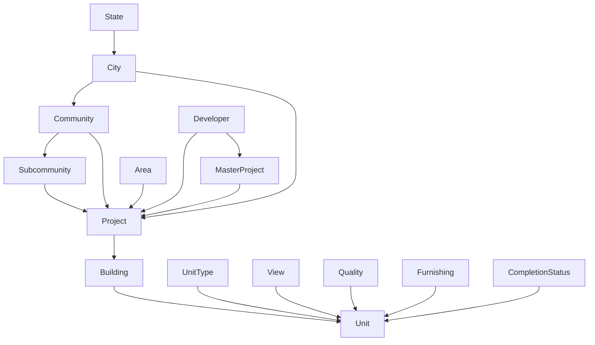

## Overview

### Base URL

All endpoints are prefixed with `/api`. Example:

```
https://your-domain.com/api/projects
```

### Authentication Methods

The API supports two authentication methods for different use cases:

<Tabs>
  <Tab title="API Client Token">
    **For external consumers:**
    
    1. Obtain an API key and secret from an admin
    2. Exchange them for a short-lived Bearer token via `POST /api/auth/token`
    3. Include the token on every request: `Authorization: Bearer <token>`
  </Tab>
  <Tab title="JWT">
    **For internal/dashboard users:**
    
    - Obtained via `POST /api/auth/login` (admin dashboard)
    - Sent as `Authorization: Bearer <token>` or via the `access_token` httpOnly cookie
  </Tab>
</Tabs>

Both methods are accepted on all external-facing endpoints. The API tries JWT first, then falls back to API key token.

### Access Levels

| Level   | Permissions                                                                                            |
| ------- | ------------------------------------------------------------------------------------------------------ |
| `basic` | Read-only access to all entity, lookup, analytics, and change-request endpoints                        |
| `super` | All of `basic` plus direct entity mutations (PATCH projects, PATCH buildings, POST/PATCH/DELETE units) |

### Paginated Response Envelope

All list endpoints return a consistent envelope structure:

```json
{
  "data": [ ... ],
  "total": 1234,
  "page": 1,
  "limit": 20
}
```

**Standard pagination query parameters:**

| Parameter   | Type   | Default        | Constraints        |
| ----------- | ------ | -------------- | ------------------ |
| `page`      | int    | `1`            | >= 1               |
| `limit`     | int    | `20`           | 1--100             |
| `sortBy`    | string | _(per-entity)_ | allowlisted fields |
| `sortOrder` | string | `asc`          | `asc`, `desc`      |

### Configurable Includes

<Info>
Most entity GET endpoints support an optional `include` query parameter that controls which relations and computed fields are returned.
</Info>

| Value           | Behavior                                          |
| --------------- | ------------------------------------------------- |
| _(omitted)_     | Default relations populated (backward-compatible) |
| `none`          | No relations or stats -- only scalar fields       |
| `all`           | All allowed relations and stats                   |
| `field1,field2` | Only the specified relations/stats                |

<Warning>
Invalid values return `400` with the list of allowed options. Virtual includes like `stats` and `buildingAreas` control expensive aggregate queries rather than ORM relations.
</Warning>

### Error Response Format

<CodeGroup>

```json Standard Error
{
  "statusCode": 404,
  "message": "Project not found",
  "error": "Not Found"
}
```

```json Validation Error
{
  "statusCode": 400,
  "message": [
    "limit must not be greater than 100",
    "sortBy must be one of the following values: id, name, area, status, createdAt"
  ],
  "error": "Bad Request"
}
```

```json Change Request Validation Error
{
  "message": "Validation failed",
  "errors": [
    {
      "path": "projects[0]",
      "field": "name",
      "message": "name should not be empty"
    }
  ]
}
```

</CodeGroup>

**HTTP Status Codes:**

| Status | Meaning                                                              |
| ------ | -------------------------------------------------------------------- |
| `400`  | Validation error, bad request                                        |
| `401`  | Missing or invalid authentication                                    |
| `403`  | Insufficient permissions (e.g. `basic` client attempting a mutation) |
| `404`  | Entity not found                                                     |
| `409`  | Conflict (stale update in change requests)                           |

### Global Request Rules

<Check>
- All request bodies are JSON (`Content-Type: application/json`)
- Unknown fields in request bodies and query params are rejected (`forbidNonWhitelisted`)
- Query params are auto-coerced to their declared types (e.g. `"1"` becomes `1` for int fields)
- Comma-separated ID lists (e.g. `areaIds=1,2,3`) are parsed into integer arrays
- Soft-deleted records are excluded from all results
</Check>

---

## Authentication

### Exchange API Credentials for Token

<Warning>
Tokens expire after 30 minutes (1800 seconds). You must request a new token before expiration.
</Warning>

```http
POST /api/auth/token
```

Exchange API client credentials for a short-lived Bearer token.

**Authentication:** None (public endpoint)

**Request Body:**

```json
{
  "apiKey": "your-api-key",
  "apiSecret": "your-api-secret"
}
```

| Field       | Type   | Required | Constraints |
| ----------- | ------ | -------- | ----------- |
| `apiKey`    | string | yes      | non-empty   |
| `apiSecret` | string | yes      | non-empty   |

**Response `200 OK`:**

```json
{
  "access_token": "eyJhbGciOiJIUzI1NiIs...",
  "token_type": "Bearer",
  "expires_in": 1800
}
```

| Field          | Type   | Description                                        |
| -------------- | ------ | -------------------------------------------------- |
| `access_token` | string | JWT token to use in `Authorization: Bearer` header |
| `token_type`   | string | Always `"Bearer"`                                  |
| `expires_in`   | number | Token lifetime in seconds (default 1800 = 30 min)  |

**Error Responses:**

| Status | Condition                 |
| ------ | ------------------------- |
| `401`  | Invalid API key or secret |
| `401`  | API client is disabled    |

---

## Entity Endpoints

<Note>
All entity endpoints require authentication via `ApiAuthGuard` (JWT or API client token). All list endpoints return the paginated envelope format.
</Note>

### Developers

#### List Developers

```http
GET /api/developers
```

Retrieve a paginated list of developers with optional filtering and sorting.

**Query Parameters:**

| Parameter   | Type   | Required | Default  | Constraints                                                                                           |
| ----------- | ------ | -------- | -------- | ----------------------------------------------------------------------------------------------------- |
| `page`      | int    | no       | `1`      | >= 1                                                                                                  |
| `limit`     | int    | no       | `20`     | 1--100                                                                                                |
| `sortBy`    | string | no       | `nameEn` | `id`, `nameEn`, `nameAr`, `developerNumber`, `createdAt`                                              |
| `sortOrder` | string | no       | `asc`    | `asc`, `desc`                                                                                         |
| `nameEn`    | string | no       | --       | substring filter                                                                                      |
| `nameAr`    | string | no       | --       | substring filter                                                                                      |
| `search`    | string | no       | --       | searches `nameEn`, `nameAr`                                                                           |
| `include`   | string | no       | --       | allowed: `licenseSource`, `licenseType`, `legalStatus`, `parentDeveloper`, `childDevelopers`, `stats` |

**Default includes (list):** _(none)_

**Response Item Fields:**

| Field             | Type   | Always present |
| ----------------- | ------ | -------------- |
| `id`              | number | yes            |
| `nameEn`          | string | --             |
| `nameAr`          | string | --             |
| `developerNumber` | string | --             |
| `logo`            | string | --             |
| `logoDark`        | string | --             |
| `licenseUrl`      | string | --             |

#### Get Developer by ID

```http
GET /api/developers/:id
```

Retrieve detailed information about a specific developer.

**Path Parameters:**

| Parameter | Type | Required |
| --------- | ---- | -------- |
| `id`      | int  | yes      |

**Query Parameters:**

| Parameter | Type   | Required |
| --------- | ------ | -------- |
| `include` | string | no       |

**Default includes (detail):** `licenseSource`, `licenseType`, `legalStatus`, `parentDeveloper`, `childDevelopers`, `stats`

**Allowed includes:** `licenseSource`, `licenseType`, `legalStatus`, `parentDeveloper`, `childDevelopers`, `stats`

**Response Fields (extends list item):**

| Field               | Type             | Notes                                                                |
| ------------------- | ---------------- | -------------------------------------------------------------------- |
| `sourceDeveloperId` | string           | always present                                                       |
| `licenseSource`     | `{ id, nameEn }` | if included                                                          |
| `licenseType`       | `{ id, nameEn }` | if included                                                          |
| `legalStatus`       | `{ id, nameEn }` | if included                                                          |
| `parentDeveloper`   | `{ id, nameEn }` | if included                                                          |
| `childDevelopers`   | array            | `[{ id, nameEn }]` -- if included                                    |
| `stats`             | object           | `{ projectsCount, masterProjectsCount }` -- only if `stats` included |

#### Search Developers

```http
GET /api/developers/search
```

Fuzzy search for developers by name using PostgreSQL `pg_trgm` similarity.

**Query Parameters:**

| Parameter | Type   | Required | Default | Constraints  |
| --------- | ------ | -------- | ------- | ------------ |
| `q`       | string | yes      | --      | min length 1 |
| `limit`   | int    | no       | `10`    | 1--50        |

<Info>
**How it works:**

1. Trims `q`, then runs `similarity()` against both `name_en` and `name_ar` columns
2. Filters rows where either similarity score > 0.15
3. Orders by the highest of the two scores (descending)
4. Returns up to `limit` results
</Info>

**Response `200 OK`:**

```json
[
  {
    "id": 42,
    "nameEn": "Emaar Properties",
    "nameAr": "إعمار العقارية",
    "developerNumber": "DEV-001",
    "logo": "https://example.com/logo.png",
    "logoDark": "https://example.com/logo-dark.png",
    "licenseUrl": "https://example.com/license.pdf",
    "similarity": 0.85
  }
]
```

<Note>
All fields except `id` and `similarity` are nullable.
</Note>

---

### Cities

#### List Cities

```http
GET /api/cities
```

**Query Parameters:**

| Parameter   | Type   | Required | Default  | Constraints                                    |
| ----------- | ------ | -------- | -------- | ---------------------------------------------- |
| `page`      | int    | no       | `1`      | >= 1                                           |
| `limit`     | int    | no       | `20`     | 1--100                                         |
| `sortBy`    | string | no       | `nameEn` | `id`, `nameEn`, `nameAr`, `state`, `createdAt` |
| `sortOrder` | string | no       | `asc`    | `asc`, `desc`                                  |
| `nameEn`    | string | no       | --       | substring filter                               |
| `nameAr`    | string | no       | --       | substring filter                               |
| `search`    | string | no       | --       | searches `nameEn`, `nameAr`, `state.nameEn`    |
| `stateId`   | int    | no       | --       | filter by state                                |
| `include`   | string | no       | --       | allowed: `state`, `stats`                      |

**Default includes (list):** `state`

**Response Item Fields:**

| Field    | Type             | Notes                                     |
| -------- | ---------------- | ----------------------------------------- |
| `id`     | number           | always present                            |
| `nameEn` | string           | --                                        |
| `nameAr` | string           | --                                        |
| `state`  | `{ id, nameEn }` | if included (default on list)             |
| `stats`  | object           | `{ projectsCount }` -- only if `included` |

#### Get City by ID

```http
GET /api/cities/:id
```

**Path Parameters:**

| Parameter | Type | Required |
| --------- | ---- | -------- |
| `id`      | int  | yes      |

**Query Parameters:**

| Parameter | Type   | Required |
| --------- | ------ | -------- |
| `include` | string | no       |

**Default includes (detail):** `state`, `stats`

**Allowed includes:** `state`, `stats`

---

### States

#### List States

```http
GET /api/states
```

**Query Parameters:**

| Parameter   | Type   | Required | Default  | Constraints                             |
| ----------- | ------ | -------- | -------- | --------------------------------------- |
| `page`      | int    | no       | `1`      | >= 1                                    |
| `limit`     | int    | no       | `20`     | 1--100                                  |
| `sortBy`    | string | no       | `nameEn` | `id`, `nameEn`, `nameAr`, `createdAt`   |
| `sortOrder` | string | no       | `asc`    | `asc`, `desc`                           |
| `nameEn`    | string | no       | --       | substring filter                        |
| `nameAr`    | string | no       | --       | substring filter                        |
| `search`    | string | no       | --       | searches `nameEn`, `nameAr`             |
| `include`   | string | no       | --       | allowed: `cities`, `stats`              |

**Default includes (list):** _(none)_

**Response Item Fields:**

| Field    | Type   | Always present |
| -------- | ------ | -------------- |
| `id`     | number | yes            |
| `nameEn` | string | --             |
| `nameAr` | string | --             |

#### Get State by ID

```http
GET /api/states/:id
```

**Path Parameters:**

| Parameter | Type | Required |
| --------- | ---- | -------- |
| `id`      | int  | yes      |

**Query Parameters:**

| Parameter | Type   | Required |
| --------- | ------ | -------- |
| `include` | string | no       |

**Default includes (detail):** `cities`, `stats`

**Allowed includes:** `cities`, `stats`

**Response Fields (extends list item):**

| Field    | Type  | Notes                                      |
| -------- | ----- | ------------------------------------------ |
| `cities` | array | `[{ id, nameEn }]` -- if included          |
| `stats`  | object| `{ projectsCount }` -- only if `included`  |

---

### Communities

#### List Communities

```http
GET /api/communities
```

**Query Parameters:**

| Parameter   | Type   | Required | Default  | Constraints                                                 |
| ----------- | ------ | -------- | -------- | ----------------------------------------------------------- |
| `page`      | int    | no       | `1`      | >= 1                                                        |
| `limit`     | int    | no       | `20`     | 1--100                                                      |
| `sortBy`    | string | no       | `nameEn` | `id`, `nameEn`, `nameAr`, `city`, `createdAt`               |
| `sortOrder` | string | no       | `asc`    | `asc`, `desc`                                               |
| `nameEn`    | string | no       | --       | substring filter                                            |
| `nameAr`    | string | no       | --       | substring filter                                            |
| `search`    | string | no       | --       | searches `nameEn`, `nameAr`, `city.nameEn`, `state.nameEn`  |
| `cityId`    | int    | no       | --       | filter by city                                              |
| `stateId`   | int    | no       | --       | filter by state                                             |
| `include`   | string | no       | --       | allowed: `city`, `stats`                                    |

**Default includes (list):** `city`

**Response Item Fields:**

| Field    | Type             | Notes                                     |
| -------- | ---------------- | ----------------------------------------- |
| `id`     | number           | always present                            |
| `nameEn` | string           | --                                        |
| `nameAr` | string           | --                                        |
| `city`   | `{ id, nameEn }` | if included (default on list)             |
| `stats`  | object           | `{ projectsCount }` -- only if `included` |

#### Get Community by ID

```http
GET /api/communities/:id
```

**Path Parameters:**

| Parameter | Type | Required |
| --------- | ---- | -------- |
| `id`      | int  | yes      |

**Query Parameters:**

| Parameter | Type   | Required |
| --------- | ------ | -------- |
| `include` | string | no       |

**Default includes (detail):** `city`, `stats`

**Allowed includes:** `city`, `stats`

---

### Sub-Communities

#### List Sub-Communities

```http
GET /api/subcommunities
```

**Query Parameters:**

| Parameter     | Type   | Required | Default  | Constraints                                                                 |
| ------------- | ------ | -------- | -------- | --------------------------------------------------------------------------- |
| `page`        | int    | no       | `1`      | >= 1                                                                        |
| `limit`       | int    | no       | `20`     | 1--100                                                                      |
| `sortBy`      | string | no       | `nameEn` | `id`, `nameEn`, `nameAr`, `community`, `createdAt`                          |
| `sortOrder`   | string | no       | `asc`    | `asc`, `desc`                                                               |
| `nameEn`      | string | no       | --       | substring filter                                                            |
| `nameAr`      | string | no       | --       | substring filter                                                            |
| `search`      | string | no       | --       | searches `nameEn`, `nameAr`, `community.nameEn`, `city.nameEn`, `state.nameEn` |
| `communityId` | int    | no       | --       | filter by community                                                         |
| `cityId`      | int    | no       | --       | filter by city                                                              |
| `stateId`     | int    | no       | --       | filter by state                                                             |
| `include`     | string | no       | --       | allowed: `community`, `stats`                                               |

**Default includes (list):** `community`

**Response Item Fields:**

| Field       | Type             | Notes                                     |
| ----------- | ---------------- | ----------------------------------------- |
| `id`        | number           | always present                            |
| `nameEn`    | string           | --                                        |
| `nameAr`    | string           | --                                        |
| `community` | `{ id, nameEn }` | if included (default on list)             |
| `stats`     | object           | `{ projectsCount }` -- only if `included` |

#### Get Sub-Community by ID

```http
GET /api/subcommunities/:id
```

**Path Parameters:**

| Parameter | Type | Required |
| --------- | ---- | -------- |
| `id`      | int  | yes      |

**Query Parameters:**

| Parameter | Type   | Required |
| --------- | ------ | -------- |
| `include` | string | no       |

**Default includes (detail):** `community`, `stats`

**Allowed includes:** `community`, `stats`

---

### Projects

#### List Projects

```http
GET /api/projects
```

**Query Parameters:**

| Parameter       | Type   | Required | Default     | Constraints                                                                                           |
| --------------- | ------ | -------- | ----------- | ----------------------------------------------------------------------------------------------------- |
| `page`          | int    | no       | `1`         | >= 1                                                                                                  |
| `limit`         | int    | no       | `20`        | 1--100                                                                                                |
| `sortBy`        | string | no       | `name`      | `id`, `name`, `area`, `status`, `createdAt`                                                           |
| `sortOrder`     | string | no       | `asc`       | `asc`, `desc`                                                                                         |
| `name`          | string | no       | --          | substring filter                                                                                      |
| `search`        | string | no       | --          | searches `name`, `community`, `city`, `developer`, `masterProject`                                    |
| `masterProject` | string | no       | --          | substring filter on master project name                                                               |
| `status`        | enum   | no       | --          | see [ProjectStatus](#project-status)                                                                  |
| `cityId`        | int    | no       | --          | filter by city                                                                                        |
| `communityId`   | int    | no       | --          | filter by community                                                                                   |
| `developerId`   | int    | no       | --          | filter by developer                                                                                   |
| `areaIds`       | string | no       | --          | comma-separated list of area IDs                                                                      |
| `include`       | string | no       | --          | allowed: `developer`, `city`, `community`, `subcommunity`, `masterProject`, `areas`, `stats`          |

**Default includes (list):** `developer`, `city`, `community`

**Response Item Fields:**

| Field          | Type             | Notes                         |
| -------------- | ---------------- | ----------------------------- |
| `id`           | number           | always present                |
| `name`         | string           | always present                |
| `area`         | number           | --                            |
| `status`       | string           | enum                          |
| `developer`    | `{ id, nameEn }` | if included (default on list) |
| `city`         | `{ id, nameEn }` | if included (default on list) |
| `community`    | `{ id, nameEn }` | if included (default on list) |
| `subcommunity` | `{ id, nameEn }` | if included                   |
| `masterProject`| `{ id, name }`   | if included                   |

#### Get Project by ID

```http
GET /api/projects/:id
```

**Path Parameters:**

| Parameter | Type | Required |
| --------- | ---- | -------- |
| `id`      | int  | yes      |

**Query Parameters:**

| Parameter | Type   | Required |
| --------- | ------ | -------- |
| `include` | string | no       |

**Default includes (detail):** `developer`, `city`, `community`, `subcommunity`, `masterProject`, `areas`, `stats`

**Allowed includes:** `developer`, `city`, `community`, `subcommunity`, `masterProject`, `areas`, `stats`

**Response Fields (extends list item):**

| Field   | Type   | Notes                                                                        |
| ------- | ------ | ---------------------------------------------------------------------------- |
| `areas` | array  | `[{ id, nameEn }]` -- if included                                            |
| `stats` | object | `{ buildingsCount, unitsCount, avgPricePerSqft }` -- only if `stats` included|

#### Update Project

<Warning>
Requires `super` access level.
</Warning>

```http
PATCH /api/projects/:id
```

**Path Parameters:**

| Parameter | Type | Required |
| --------- | ---- | -------- |
| `id`      | int  | yes      |

**Request Body (all fields optional):**

```json
{
  "name": "Updated Project Name",
  "area": 50000,
  "status": "UNDER_CONSTRUCTION",
  "masterProjectId": 5,
  "developerId": 10,
  "communityId": 20,
  "subcommunityId": 30,
  "areaIds": [1, 2, 3]
}
```

| Field             | Type     | Constraints                    |
| ----------------- | -------- | ------------------------------ |
| `name`            | string   | optional, non-empty if present |
| `area`            | number   | optional, > 0                  |
| `status`          | enum     | see [ProjectStatus](#project-status) |
| `masterProjectId` | int/null | optional                       |
| `developerId`     | int/null | optional                       |
| `communityId`     | int/null | optional                       |
| `subcommunityId`  | int/null | optional                       |
| `areaIds`         | int[]    | optional array of area IDs     |

**Response `200 OK`:** Updated project object (same structure as GET by ID)

---

### Buildings

#### List Buildings

```http
GET /api/buildings
```

**Query Parameters:**

| Parameter     | Type   | Required | Default     | Constraints                                                                              |
| ------------- | ------ | -------- | ----------- | ---------------------------------------------------------------------------------------- |
| `page`        | int    | no       | `1`         | >= 1                                                                                     |
| `limit`       | int    | no       | `20`        | 1--100                                                                                   |
| `sortBy`      | string | no       | `name`      | `id`, `name`, `project`, `createdAt`                                                     |
| `sortOrder`   | string | no       | `asc`       | `asc`, `desc`                                                                            |
| `name`        | string | no       | --          | substring filter                                                                         |
| `search`      | string | no       | --          | searches `name`, `project.name`                                                          |
| `projectId`   | int    | no       | --          | filter by project                                                                        |
| `include`     | string | no       | --          | allowed: `project`, `stats`                                                              |

**Default includes (list):** `project`

**Response Item Fields:**

| Field     | Type           | Notes                         |
| --------- | -------------- | ----------------------------- |
| `id`      | number         | always present                |
| `name`    | string         | always present                |
| `project` | `{ id, name }` | if included (default on list) |
| `stats`   | object         | `{ unitsCount }` -- only if `stats` included |

#### Get Building by ID

```http
GET /api/buildings/:id
```

**Path Parameters:**

| Parameter | Type | Required |
| --------- | ---- | -------- |
| `id`      | int  | yes      |

**Query Parameters:**

| Parameter | Type   | Required |
| --------- | ------ | -------- |
| `include` | string | no       |

**Default includes (detail):** `project`, `stats`

**Allowed includes:** `project`, `stats`

#### Update Building

<Warning>
Requires `super` access level.
</Warning>

```http
PATCH /api/buildings/:id
```

**Path Parameters:**

| Parameter | Type | Required |
| --------- | ---- | -------- |
| `id`      | int  | yes      |

**Request Body (all fields optional):**

```json
{
  "name": "Updated Building Name",
  "projectId": 42
}
```

| Field       | Type   | Constraints                    |
| ----------- | ------ | ------------------------------ |
| `name`      | string | optional, non-empty if present |
| `projectId` | int    | optional, must exist           |

**Response `200 OK`:** Updated building object (same structure as GET by ID)

---

### Units

#### List Units

```http
GET /api/units
```

**Query Parameters:**

| Parameter        | Type   | Required | Default     | Constraints                                                                                    |
| ---------------- | ------ | -------- | ----------- | ---------------------------------------------------------------------------------------------- |
| `page`           | int    | no       | `1`         | >= 1                                                                                           |
| `limit`          | int    | no       | `20`        | 1--100                                                                                         |
| `sortBy`         | string | no       | `unitNumber`| `id`, `unitNumber`, `builtUpArea`, `plotArea`, `price`, `bedrooms`, `building`, `createdAt`   |
| `sortOrder`      | string | no       | `asc`       | `asc`, `desc`                                                                                  |
| `unitNumber`     | string | no       | --          | substring filter                                                                               |
| `search`         | string | no       | --          | searches `unitNumber`, `building.name`, `project.name`                                         |
| `buildingId`     | int    | no       | --          | filter by building                                                                             |
| `projectId`      | int    | no       | --          | filter by project                                                                              |
| `bedrooms`       | int    | no       | --          | exact match                                                                                    |
| `bathrooms`      | int    | no       | --          | exact match                                                                                    |
| `minPrice`       | number | no       | --          | minimum price filter                                                                           |
| `maxPrice`       | number | no       | --          | maximum price filter                                                                           |
| `minBuiltUpArea` | number | no       | --          | minimum built-up area                                                                          |
| `maxBuiltUpArea` | number | no       | --          | maximum built-up area                                                                          |
| `include`        | string | no       | --          | allowed: `building`, `project`, `unitType`, `view`, `quality`, `furnishing`, `completionStatus`|

**Default includes (list):** `building`, `project`

**Response Item Fields:**

| Field         | Type           | Notes                         |
| ------------- | -------------- | ----------------------------- |
| `id`          | number         | always present                |
| `unitNumber`  | string         | always present                |
| `builtUpArea` | number         | --                            |
| `plotArea`    | number         | --                            |
| `price`       | number         | --                            |
| `bedrooms`    | number         | --                            |
| `bathrooms`   | number         | --                            |
| `building`    | `{ id, name }` | if included (default on list) |
| `project`     | `{ id, name }` | if included (default on list) |

#### Get Unit by ID

```http
GET /api/units/:id
```

**Path Parameters:**

| Parameter | Type | Required |
| --------- | ---- | -------- |
| `id`      | int  | yes      |

**Query Parameters:**

| Parameter | Type   | Required |
| --------- | ------ | -------- |
| `include` | string | no       |

**Default includes (detail):** `building`, `project`, `unitType`, `view`, `quality`, `furnishing`, `completionStatus`

**Allowed includes:** `building`, `project`, `unitType`, `view`, `quality`, `furnishing`, `completionStatus`

**Response Fields (extends list item):**

| Field              | Type             | Notes       |
| ------------------ | ---------------- | ----------- |
| `unitType`         | `{ id, nameEn }` | if included |
| `view`             | `{ id, nameEn }` | if included |
| `quality`          | `{ id, nameEn }` | if included |
| `furnishing`       | `{ id, nameEn }` | if included |
| `completionStatus` | `{ id, nameEn }` | if included |

#### Create Unit

<Warning>
Requires `super` access level.
</Warning>

```http
POST /api/units
```

**Request Body:**

```json
{
  "unitNumber": "A-101",
  "buildingId": 5,
  "builtUpArea": 1200,
  "plotArea": 1500,
  "price": 850000,
  "bedrooms": 2,
  "bathrooms": 2,
  "unitTypeId": 1,
  "viewId": 2,
  "qualityId": 3,
  "furnishingId": 1,
  "completionStatusId": 2
}
```

| Field                 | Type   | Required | Constraints         |
| --------------------- | ------ | -------- | ------------------- |
| `unitNumber`          | string | yes      | non-empty           |
| `buildingId`          | int    | yes      | must exist          |
| `builtUpArea`         | number | no       | > 0 if present      |
| `plotArea`            | number | no       | > 0 if present      |
| `price`               | number | no       | >= 0 if present     |
| `bedrooms`            | int    | no       | >= 0 if present     |
| `bathrooms`           | int    | no       | >= 0 if present     |
| `unitTypeId`          | int    | no       | must exist          |
| `viewId`              | int    | no       | must exist          |
| `qualityId`           | int    | no       | must exist          |
| `furnishingId`        | int    | no       | must exist          |
| `completionStatusId`  | int    | no       | must exist          |

**Response `201 Created`:** Created unit object (same structure as GET by ID)

#### Update Unit

<Warning>
Requires `super` access level.
</Warning>

```http
PATCH /api/units/:id
```

**Path Parameters:**

| Parameter | Type | Required |
| --------- | ---- | -------- |
| `id`      | int  | yes      |

**Request Body (all fields optional):**

Same fields as CREATE, all optional.

**Response `200 OK`:** Updated unit object (same structure as GET by ID)

#### Delete Unit

<Warning>
Requires `super` access level. This is a soft delete.
</Warning>

```http
DELETE /api/units/:id
```

**Path Parameters:**

| Parameter | Type | Required |
| --------- | ---- | -------- |
| `id`      | int  | yes      |

**Response `200 OK`:**

```json
{
  "message": "Unit deleted successfully"
}
```

---

## Lookup Endpoints

<Info>
Lookup endpoints provide reference data for enums and classification fields. All require authentication and return paginated results.
</Info>

### Areas

```http
GET /api/areas
```

**Query Parameters:**

| Parameter   | Type   | Required | Default  | Constraints                           |
| ----------- | ------ | -------- | -------- | ------------------------------------- |
| `page`      | int    | no       | `1`      | >= 1                                  |
| `limit`     | int    | no       | `20`     | 1--100                                |
| `sortBy`    | string | no       | `nameEn` | `id`, `nameEn`, `nameAr`, `createdAt` |
| `sortOrder` | string | no       | `asc`    | `asc`, `desc`                         |
| `nameEn`    | string | no       | --       | substring filter                      |
| `nameAr`    | string | no       | --       | substring filter                      |
| `search`    | string | no       | --       | searches `nameEn`, `nameAr`           |

**Response Item:**

```json
{
  "id": 1,
  "nameEn": "Residential",
  "nameAr": "سكني"
}
```

### Unit Types

```http
GET /api/unit-types
```

Same pagination and filters as `/api/areas`.

**Response Item:**

```json
{
  "id": 1,
  "nameEn": "Apartment",
  "nameAr": "شقة"
}
```

### Views

```http
GET /api/views
```

Same pagination and filters as `/api/areas`.

**Response Item:**

```json
{
  "id": 1,
  "nameEn": "Sea View",
  "nameAr": "إطلالة بحرية"
}
```

### Quality Grades

```http
GET /api/quality-grades
```

Same pagination and filters as `/api/areas`.

**Response Item:**

```json
{
  "id": 1,
  "nameEn": "Premium",
  "nameAr": "ممتاز"
}
```

### Furnishing Types

```http
GET /api/furnishing-types
```

Same pagination and filters as `/api/areas`.

**Response Item:**

```json
{
  "id": 1,
  "nameEn": "Fully Furnished",
  "nameAr": "مفروش بالكامل"
}
```

### Completion Statuses

```http
GET /api/completion-statuses
```

Same pagination and filters as `/api/areas`.

**Response Item:**

```json
{
  "id": 1,
  "nameEn": "Ready",
  "nameAr": "جاهز"
}
```

### License Sources

```http
GET /api/license-sources
```

Same pagination and filters as `/api/areas`.

**Response Item:**

```json
{
  "id": 1,
  "nameEn": "DLD",
  "nameAr": "دائرة الأراضي والأملاك"
}
```

### License Types

```http
GET /api/license-types
```

Same pagination and filters as `/api/areas`.

**Response Item:**

```json
{
  "id": 1,
  "nameEn": "Commercial",
  "nameAr": "تجاري"
}
```

### Legal Statuses

```http
GET /api/legal-statuses
```

Same pagination and filters as `/api/areas`.

**Response Item:**

```json
{
  "id": 1,
  "nameEn": "Active",
  "nameAr": "نشط"
}
```

---

## Direct Entity Mutations

<Warning>
All mutation endpoints require `super` access level. Refer to the entity endpoint sections for detailed specifications:
- [Update Project](#update-project)
- [Update Building](#update-building)
- [Create Unit](#create-unit)
- [Update Unit](#update-unit)
- [Delete Unit](#delete-unit)
</Warning>

---

## Change Requests

<Info>
Change requests provide a workflow for proposing bulk modifications across multiple entities. They support creating, updating, and deleting projects, buildings, and units in a single request.
</Info>

### Submit Change Request

```http
POST /api/change-requests
```

Submit a new change request with proposed modifications. All fields are optional, but at least one operation must be provided.

**Request Body:**

<CodeGroup>

```json Full Example
{
  "projects": {
    "create": [
      {
        "name": "New Luxury Project",
        "area": 50000,
        "status": "UNDER_CONSTRUCTION",
        "developerId": 10,
        "communityId": 5
      }
    ],
    "update": [
      {
        "id": 42,
        "name": "Updated Project Name",
        "status": "COMPLETED"
      }
    ],
    "delete": [99]
  },
  "buildings": {
    "create": [
      {
        "name": "Tower A",
        "projectId": 42
      }
    ],
    "update": [
      {
        "id": 10,
        "name": "Renamed Tower"
      }
    ],
    "delete": [88]
  },
  "units": {
    "create": [
      {
        "unitNumber": "A-101",
        "buildingId": 10,
        "builtUpArea": 1200,
        "bedrooms": 2
      }
    ],
    "update": [
      {
        "id": 500,
        "price": 950000
      }
    ],
    "delete": [777]
  }
}
```

```json Minimal Example
{
  "projects": {
    "update": [
      {
        "id": 42,
        "status": "COMPLETED"
      }
    ]
  }
}
```

</CodeGroup>

**Validation Rules:**

<Steps>

<Step title="Entity Validation">
Each operation is validated according to the same rules as direct mutations (see entity endpoint sections).
</Step>

<Step title="Cross-Operation Validation">
- CREATE operations cannot reference entities being deleted in the same request
- UPDATE and DELETE operations must reference existing entities
- All foreign key references must be valid
</Step>

<Step title="Batch Validation">
All operations are validated before any are executed. If any operation fails validation, the entire request is rejected.
</Step>

</Steps>

**Response `201 Created`:**

```json
{
  "id": 123,
  "status": "PENDING",
  "submittedBy": {
    "id": 1,
    "name": "API Client Name"
  },
  "submittedAt": "2024-01-15T10:30:00.000Z",
  "projects": { ... },
  "buildings": { ... },
  "units": { ... }
}
```

**Error Response `400 Bad Request`:**

```json
{
  "message": "Validation failed",
  "errors": [
    {
      "path": "projects[0]",
      "field": "name",
      "message": "name should not be empty"
    },
    {
      "path": "units[2]",
      "field": "buildingId",
      "message": "Building with id 999 not found"
    }
  ]
}
```

### List Change Requests

```http
GET /api/change-requests
```

**Query Parameters:**

| Parameter   | Type   | Required | Default       | Constraints                                      |
| ----------- | ------ | -------- | ------------- | ------------------------------------------------ |
| `page`      | int    | no       | `1`           | >= 1                                             |
| `limit`     | int    | no       | `20`          | 1--100                                           |
| `sortBy`    | string | no       | `submittedAt` | `id`, `status`, `submittedAt`, `reviewedAt`      |
| `sortOrder` | string | no       | `desc`        | `asc`, `desc`                                    |
| `status`    | enum   | no       | --            | `PENDING`, `APPROVED`, `REJECTED`                |

**Response Item:**

```json
{
  "id": 123,
  "status": "PENDING",
  "submittedBy": {
    "id": 1,
    "name": "API Client Name"
  },
  "submittedAt": "2024-01-15T10:30:00.000Z",
  "reviewedBy": null,
  "reviewedAt": null,
  "rejectionReason": null
}
```

### Get Change Request by ID

```http
GET /api/change-requests/:id
```

**Path Parameters:**

| Parameter | Type | Required |
| --------- | ---- | -------- |
| `id`      | int  | yes      |

**Response `200 OK`:**

Same structure as submit response, including full `projects`, `buildings`, and `units` operation details.

### Update Change Request

```http
PATCH /api/change-requests/:id
```

<Note>
Only `PENDING` change requests can be updated. Approved or rejected requests are immutable.
</Note>

**Path Parameters:**

| Parameter | Type | Required |
| --------- | ---- | -------- |
| `id`      | int  | yes      |

**Request Body:**

Same structure as submit, all fields optional. Only provided operations are replaced; omitted operations remain unchanged.

**Response `200 OK`:** Updated change request object

**Error Response `409 Conflict`:**

```json
{
  "statusCode": 409,
  "message": "Change request has already been reviewed",
  "error": "Conflict"
}
```

### Delete Change Request

```http
DELETE /api/change-requests/:id
```

<Note>
Only `PENDING` change requests can be deleted. This is a hard delete.
</Note>

**Path Parameters:**

| Parameter | Type | Required |
| --------- | ---- | -------- |
| `id`      | int  | yes      |

**Response `200 OK`:**

```json
{
  "message": "Change request deleted successfully"
}
```

---

## Market Analytics

<Info>
Market analytics endpoints provide aggregated statistics and trends across projects, buildings, and units. Results can be filtered by location and time period.
</Info>

### Project Statistics

```http
GET /api/analytics/projects
```

Get aggregated statistics across all projects.

**Query Parameters:**

| Parameter     | Type   | Required | Constraints                    |
| ------------- | ------ | -------- | ------------------------------ |
| `cityId`      | int    | no       | filter by city                 |
| `communityId` | int    | no       | filter by community            |
| `developerId` | int    | no       | filter by developer            |
| `status`      | enum   | no       | see [ProjectStatus](#project-status) |
| `startDate`   | string | no       | ISO 8601 date (filters createdAt) |
| `endDate`     | string | no       | ISO 8601 date (filters createdAt) |

**Response `200 OK`:**

```json
{
  "totalProjects": 150,
  "byStatus": {
    "UNDER_CONSTRUCTION": 45,
    "COMPLETED": 90,
    "PLANNED": 15
  },
  "byDeveloper": [
    {
      "developerId": 10,
      "developerName": "Emaar Properties",
      "projectCount": 25
    }
  ],
  "totalArea": 5000000,
  "avgProjectArea": 33333.33
}
```

### Unit Price Trends

```http
GET /api/analytics/units/price-trends
```

Get price trends over time for units matching the specified filters.

**Query Parameters:**

| Parameter     | Type   | Required | Constraints                                |
| ------------- | ------ | -------- | ------------------------------------------ |
| `projectId`   | int    | no       | filter by project                          |
| `buildingId`  | int    | no       | filter by building                         |
| `bedrooms`    | int    | no       | exact match                                |
| `unitTypeId`  | int    | no       | filter by unit type                        |
| `startDate`   | string | no       | ISO 8601 date (filters createdAt)          |
| `endDate`     | string | no       | ISO 8601 date (filters createdAt)          |
| `groupBy`     | enum   | no       | `month`, `quarter`, `year` (default: month)|

**Response `200 OK`:**

```json
{
  "currency": "AED",
  "dataPoints": [
    {
      "period": "2024-01",
      "avgPrice": 1200000,
      "avgPricePerSqft": 1500,
      "minPrice": 850000,
      "maxPrice": 2500000,
      "unitCount": 45
    },
    {
      "period": "2024-02",
      "avgPrice": 1250000,
      "avgPricePerSqft": 1550,
      "minPrice": 900000,
      "maxPrice": 2600000,
      "unitCount": 52
    }
  ]
}
```

### Inventory Summary

```http
GET /api/analytics/inventory
```

Get current inventory statistics across all units.

**Query Parameters:**

| Parameter     | Type   | Required | Constraints             |
| ------------- | ------ | -------- | ----------------------- |
| `projectId`   | int    | no       | filter by project       |
| `cityId`      | int    | no       | filter by city          |
| `communityId` | int    | no       | filter by community     |
| `developerId` | int    | no       | filter by developer     |

**Response `200 OK`:**

```json
{
  "totalUnits": 5000,
  "byBedrooms": {
    "studio": 500,
    "1": 1500,
    "2": 2000,
    "3": 800,
    "4+": 200
  },
  "byUnitType": [
    {
      "unitTypeId": 1,
      "unitTypeName": "Apartment",
      "count": 4000
    },
    {
      "unitTypeId": 2,
      "unitTypeName": "Villa",
      "count": 1000
    }
  ],
  "byCompletionStatus": {
    "READY": 3000,
    "UNDER_CONSTRUCTION": 1500,
    "PLANNED": 500
  },
  "avgBuiltUpArea": 1250,
  "totalValue": 6250000000
}
```

---

## Unit Evaluation (AI Valuation)

<Info>
The Unit Evaluation API provides AI-powered property valuations based on unit characteristics, location, and market conditions.
</Info>

### Request Valuation

```http
POST /api/unit-evaluation
```

Request an AI valuation for a unit based on its characteristics.

**Request Body:**

```json
{
  "projectId": 42,
  "buildingId": 10,
  "builtUpArea": 1200,
  "plotArea": 1500,
  "bedrooms": 2,
  "bathrooms": 2,
  "unitTypeId": 1,
  "viewId": 2,
  "qualityId": 3,
  "furnishingId": 1,
  "completionStatusId": 2
}
```

| Field                | Type   | Required | Constraints     |
| -------------------- | ------ | -------- | --------------- |
| `projectId`          | int    | yes      | must exist      |
| `buildingId`         | int    | no       | must exist      |
| `builtUpArea`        | number | yes      | > 0             |
| `plotArea`           | number | no       | > 0             |
| `bedrooms`           | int    | yes      | >= 0            |
| `bathrooms`          | int    | no       | >= 0            |
| `unitTypeId`         | int    | yes      | must exist      |
| `viewId`             | int    | no       | must exist      |
| `qualityId`          | int    | no       | must exist      |
| `furnishingId`       | int    | no       | must exist      |
| `completionStatusId` | int    | no       | must exist      |

**Response `200 OK`:**

```json
{
  "estimatedValue": 1250000,
  "pricePerSqft": 1041.67,
  "confidence": "HIGH",
  "range": {
    "low": 1150000,
    "high": 1350000
  },
  "factors": [
    {
      "factor": "location",
      "impact": "positive",
      "weight": 0.35,
      "description": "Prime location in high-demand community"
    },
    {
      "factor": "unitType",
      "impact": "neutral",
      "weight": 0.15,
      "description": "Standard apartment configuration"
    },
    {
      "factor": "view",
      "impact": "positive",
      "weight": 0.20,
      "description": "Premium sea view adds significant value"
    }
  ],
  "comparables": [
    {
      "unitId": 789,
      "price": 1230000,
      "pricePerSqft": 1025,
      "similarity": 0.92
    }
  ],
  "timestamp": "2024-01-15T10:30:00.000Z",
  "modelVersion": "v2.1.0"
}
```

**Response Fields:**

| Field            | Type   | Description                                          |
| ---------------- | ------ | ---------------------------------------------------- |
| `estimatedValue` | number | AI-estimated market value in AED                     |
| `pricePerSqft`   | number | Estimated price per square foot                      |
| `confidence`     | enum   | `LOW`, `MEDIUM`, `HIGH` -- model confidence level    |
| `range.low`      | number | Lower bound of valuation range (-8%)                 |
| `range.high`     | number | Upper bound of valuation range (+8%)                 |
| `factors`        | array  | Contributing factors with weights and impacts        |
| `comparables`    | array  | Similar units used for comparison (up to 5)          |
| `timestamp`      | string | ISO 8601 timestamp of valuation                      |
| `modelVersion`   | string | AI model version used for valuation                  |

<Warning>
Valuations are estimates only and should not be used as the sole basis for financial decisions. Always consult with qualified real estate professionals.
</Warning>

### Batch Valuation

```http
POST /api/unit-evaluation/batch
```

Request valuations for multiple units in a single request.

**Request Body:**

```json
{
  "units": [
    {
      "projectId": 42,
      "builtUpArea": 1200,
      "bedrooms": 2,
      "unitTypeId": 1
    },
    {
      "projectId": 43,
      "builtUpArea": 1500,
      "bedrooms": 3,
      "unitTypeId": 1
    }
  ]
}
```

<Note>
Maximum 50 units per batch request. Each unit follows the same validation rules as single valuation.
</Note>

**Response `200 OK`:**

```json
{
  "results": [
    {
      "index": 0,
      "success": true,
      "valuation": { /* same structure as single valuation */ }
    },
    {
      "index": 1,
      "success": false,
      "error": "Project with id 43 not found"
    }
  ],
  "summary": {
    "total": 2,
    "successful": 1,
    "failed": 1
  }
}
```

---

## Appendix A: Enum Reference

### Project Status

| Value                  | Description                       |
| ---------------------- | --------------------------------- |
| `PLANNED`              | Project is in planning phase      |
| `UNDER_CONSTRUCTION`   | Project is under construction     |
| `COMPLETED`            | Project construction is completed |
| `ON_HOLD`              | Project is temporarily on hold    |
| `CANCELLED`            | Project has been cancelled        |

### Confidence Level

| Value    | Description                               |
| -------- | ----------------------------------------- |
| `LOW`    | Limited comparable data available         |
| `MEDIUM` | Moderate comparable data available        |
| `HIGH`   | Strong comparable data and market signals |

### Change Request Status

| Value      | Description                                |
| ---------- | ------------------------------------------ |
| `PENDING`  | Awaiting admin review                      |
| `APPROVED` | Approved and applied to database           |
| `REJECTED` | Rejected with reason provided              |

---

## Appendix B: Entity Relationships



**Key Relationships:**

<AccordionGroup>

<Accordion title="Geographic Hierarchy">
- **State** → **City** → **Community** → **Subcommunity**
- Projects can be associated at any level of this hierarchy
- Higher levels automatically include lower levels (e.g., filtering by city includes all communities in that city)
</Accordion>

<Accordion title="Project Structure">
- **Developer** creates one or more **Projects**
- **MasterProject** can contain multiple **Projects** (optional relationship)
- **Project** contains multiple **Buildings**
- **Project** can be tagged with multiple **Areas** (e.g., "Residential", "Commercial")
</Accordion>

<Accordion title="Unit Details">
- **Building** contains multiple **Units**
- **Unit** has one **UnitType** (Apartment, Villa, Townhouse, etc.)
- **Unit** has optional classification fields: **View**, **Quality**, **Furnishing**, **CompletionStatus**
</Accordion>

<Accordion title="Developer Hierarchy">
- **Developer** can have a parent-child relationship with other developers
- `parentDeveloper` indicates the owning developer entity
- `childDevelopers` are subsidiary entities
</Accordion>

</AccordionGroup>

---

<Card title="Need Help?" icon="question" href="mailto:support@propwise.ai">
  Contact our support team for API assistance
</Card>