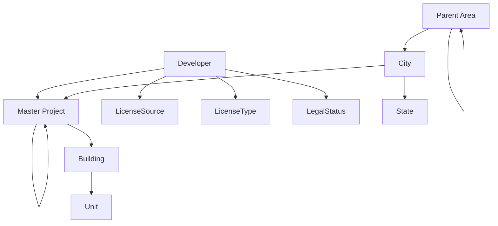

## Overview

The PropWise Labs API provides comprehensive access to real estate data including projects, buildings, units, developers, and market analytics. This reference covers all non-admin endpoints available to external consumers.

### Base URL

All endpoints are prefixed with `/api`. Example:

```
https://your-domain.com/api/projects
```

<Note>
Replace `your-domain.com` with your actual API domain.
</Note>

### Authentication Methods

The API supports two authentication methods:

<Tabs>
  <Tab title="API Client Token">
    For external consumers:
    1. Obtain an API key and secret from an admin
    2. Exchange them for a short-lived Bearer token via `POST /api/auth/token`
    3. Include the token on every request: `Authorization: Bearer <token>`
  </Tab>
  <Tab title="JWT">
    For internal/dashboard users:
    - Obtained via `POST /api/auth/login` (admin dashboard)
    - Sent as `Authorization: Bearer <token>` or via `access_token` httpOnly cookie
  </Tab>
</Tabs>

### Access Levels

| Level   | Permissions                                                                                            |
| ------- | ------------------------------------------------------------------------------------------------------ |
| `basic` | Read-only access to all entity, lookup, analytics, and change-request endpoints                        |
| `super` | All of `basic` plus direct entity mutations (PATCH projects, PATCH buildings, POST/PATCH/DELETE units) |

### Paginated Response Format

All list endpoints return:

```json
{
  "data": [ ... ],
  "total": 1234,
  "page": 1,
  "limit": 20
}
```

Standard pagination parameters:

| Parameter   | Type   | Default        | Constraints        |
| ----------- | ------ | -------------- | ------------------ |
| `page`      | int    | `1`            | >= 1               |
| `limit`     | int    | `20`           | 1-100              |
| `sortBy`    | string | _(per-entity)_ | allowlisted fields |
| `sortOrder` | string | `asc`          | `asc`, `desc`      |

### Configurable Includes

Most entity GET endpoints support an optional `include` query parameter:

| Value           | Behavior                                          |
| --------------- | ------------------------------------------------- |
| _(omitted)_     | Default relations populated (backward-compatible) |
| `none`          | No relations or stats -- only scalar fields       |
| `all`           | All allowed relations and stats                   |
| `field1,field2` | Only the specified relations/stats                |

<Warning>
Invalid include values return `400` with the list of allowed options.
</Warning>

### Error Response Format

<Tabs>
  <Tab title="Standard Errors">
    ```json
    {
      "statusCode": 404,
      "message": "Project not found",
      "error": "Not Found"
    }
    ```
  </Tab>
  <Tab title="Validation Errors">
    ```json
    {
      "statusCode": 400,
      "message": [
        "limit must not be greater than 100",
        "sortBy must be one of the following values: id, name, area, status, createdAt"
      ],
      "error": "Bad Request"
    }
    ```
  </Tab>
  <Tab title="Change Request Errors">
    ```json
    {
      "message": "Validation failed",
      "errors": [{ 
        "path": "projects[0]", 
        "field": "name", 
        "message": "name should not be empty" 
      }]
    }
    ```
  </Tab>
</Tabs>

### HTTP Status Codes

| Status | Meaning                                                              |
| ------ | -------------------------------------------------------------------- |
| `400`  | Validation error, bad request                                        |
| `401`  | Missing or invalid authentication                                    |
| `403`  | Insufficient permissions (e.g. `basic` client attempting a mutation) |
| `404`  | Entity not found                                                     |
| `409`  | Conflict (stale update in change requests)                           |

<Info>
All request bodies must be JSON (`Content-Type: application/json`). Unknown fields in requests are rejected, and soft-deleted records are excluded from all results.
</Info>

## Authentication

### Exchange API Credentials for Token

<CodeGroup>
```bash cURL
curl -X POST https://your-domain.com/api/auth/token \
  -H "Content-Type: application/json" \
  -d '{
    "apiKey": "your-api-key",
    "apiSecret": "your-api-secret"
  }'
```

```javascript JavaScript
const response = await fetch('/api/auth/token', {
  method: 'POST',
  headers: {
    'Content-Type': 'application/json'
  },
  body: JSON.stringify({
    apiKey: 'your-api-key',
    apiSecret: 'your-api-secret'
  })
});

const { access_token } = await response.json();
```

```python Python
import requests

response = requests.post('/api/auth/token', json={
    'apiKey': 'your-api-key',
    'apiSecret': 'your-api-secret'
})

token = response.json()['access_token']
```
</CodeGroup>

**Request Body**

| Field       | Type   | Required | Description                    |
| ----------- | ------ | -------- | ------------------------------ |
| `apiKey`    | string | yes      | Your API key                   |
| `apiSecret` | string | yes      | Your API secret                |

**Response `200 OK`**

```json
{
  "access_token": "eyJhbGciOiJIUzI1NiIs...",
  "token_type": "Bearer",
  "expires_in": 1800
}
```

| Field          | Type   | Description                                        |
| -------------- | ------ | -------------------------------------------------- |
| `access_token` | string | JWT token to use in `Authorization: Bearer` header |
| `token_type`   | string | Always `"Bearer"`                                  |
| `expires_in`   | number | Token lifetime in seconds (default 1800 = 30 min) |

<Warning>
Tokens expire after 30 minutes. You'll need to request a new token when the current one expires.
</Warning>

## Entity Endpoints

All entity endpoints require authentication via JWT or API client token.

### Developers

#### List Developers

<CodeGroup>
```bash cURL
curl -H "Authorization: Bearer YOUR_TOKEN" \
  "https://your-domain.com/api/developers?page=1&limit=20&include=stats"
```

```javascript JavaScript
const response = await fetch('/api/developers?include=stats', {
  headers: {
    'Authorization': 'Bearer YOUR_TOKEN'
  }
});

const { data, total, page, limit } = await response.json();
```
</CodeGroup>

**Query Parameters**

| Parameter   | Type   | Required | Default  | Description                                      |
| ----------- | ------ | -------- | -------- | ------------------------------------------------ |
| `page`      | int    | no       | `1`      | Page number                                      |
| `limit`     | int    | no       | `20`     | Items per page (1-100)                          |
| `sortBy`    | string | no       | `nameEn` | Sort field: `id`, `nameEn`, `nameAr`, `developerNumber`, `createdAt` |
| `sortOrder` | string | no       | `asc`    | Sort direction: `asc`, `desc`                    |
| `nameEn`    | string | no       | --       | Filter by English name (substring)               |
| `nameAr`    | string | no       | --       | Filter by Arabic name (substring)                |
| `search`    | string | no       | --       | Search in `nameEn`, `nameAr`                     |
| `include`   | string | no       | --       | Include relations: `licenseSource`, `licenseType`, `legalStatus`, `parentDeveloper`, `childDevelopers`, `stats` |

**Response**

```json
{
  "data": [
    {
      "id": 1,
      "nameEn": "Emaar Properties",
      "nameAr": "إعمار العقارية",
      "developerNumber": "DEV-001",
      "logo": "https://example.com/logo.png",
      "logoDark": "https://example.com/logo-dark.png",
      "licenseUrl": "https://example.com/license.pdf"
    }
  ],
  "total": 150,
  "page": 1,
  "limit": 20
}
```

#### Get Developer by ID

<CodeGroup>
```bash cURL
curl -H "Authorization: Bearer YOUR_TOKEN" \
  "https://your-domain.com/api/developers/1?include=all"
```

```javascript JavaScript
const response = await fetch('/api/developers/1?include=all', {
  headers: {
    'Authorization': 'Bearer YOUR_TOKEN'
  }
});

const developer = await response.json();
```
</CodeGroup>

**Path Parameters**

| Parameter | Type | Required | Description   |
| --------- | ---- | -------- | ------------- |
| `id`      | int  | yes      | Developer ID  |

**Query Parameters**

| Parameter | Type   | Required | Description |
| --------- | ------ | -------- | ----------- |
| `include` | string | no       | Include relations (same options as list) |

**Default includes:** `licenseSource`, `licenseType`, `legalStatus`, `parentDeveloper`, `childDevelopers`, `stats`

**Response**

```json
{
  "id": 1,
  "nameEn": "Emaar Properties",
  "nameAr": "إعمار العقارية",
  "developerNumber": "DEV-001",
  "sourceDeveloperId": "EMAAR-001",
  "logo": "https://example.com/logo.png",
  "logoDark": "https://example.com/logo-dark.png",
  "licenseUrl": "https://example.com/license.pdf",
  "licenseSource": { "id": 1, "nameEn": "DLD" },
  "licenseType": { "id": 1, "nameEn": "Master Developer" },
  "legalStatus": { "id": 1, "nameEn": "LLC" },
  "parentDeveloper": { "id": 2, "nameEn": "Emaar Group" },
  "childDevelopers": [
    { "id": 3, "nameEn": "Emaar Development" }
  ],
  "stats": {
    "projectsCount": 45,
    "masterProjectsCount": 12
  }
}
```

#### Search Developers

Fuzzy search for developers by name using PostgreSQL similarity matching.

<CodeGroup>
```bash cURL
curl -H "Authorization: Bearer YOUR_TOKEN" \
  "https://your-domain.com/api/developers/search?q=emaar&limit=5"
```

```javascript JavaScript
const response = await fetch('/api/developers/search?q=emaar&limit=5', {
  headers: {
    'Authorization': 'Bearer YOUR_TOKEN'
  }
});

const results = await response.json();
```
</CodeGroup>

**Query Parameters**

| Parameter | Type   | Required | Default | Description          |
| --------- | ------ | -------- | ------- | -------------------- |
| `q`       | string | yes      | --      | Search query         |
| `limit`   | int    | no       | `10`    | Max results (1-50)   |

<Info>
Search uses PostgreSQL `pg_trgm` similarity with a threshold of 0.15. Results are ordered by similarity score (highest first).
</Info>

**Response**

```json
[
  {
    "id": 1,
    "nameEn": "Emaar Properties",
    "nameAr": "إعمار العقارية",
    "developerNumber": "DEV-001",
    "logo": "https://example.com/logo.png",
    "logoDark": "https://example.com/logo-dark.png",
    "licenseUrl": "https://example.com/license.pdf",
    "similarity": 0.85
  }
]
```

### Cities

#### List Cities

<CodeGroup>
```bash cURL
curl -H "Authorization: Bearer YOUR_TOKEN" \
  "https://your-domain.com/api/cities?include=state,stats"
```

```javascript JavaScript
const response = await fetch('/api/cities?include=state,stats', {
  headers: {
    'Authorization': 'Bearer YOUR_TOKEN'
  }
});

const { data } = await response.json();
```
</CodeGroup>

**Query Parameters**

| Parameter   | Type   | Required | Default  | Description                                      |
| ----------- | ------ | -------- | -------- | ------------------------------------------------ |
| `page`      | int    | no       | `1`      | Page number                                      |
| `limit`     | int    | no       | `20`     | Items per page (1-100)                          |
| `sortBy`    | string | no       | `nameEn` | Sort field: `id`, `nameEn`, `nameAr`, `state`, `createdAt` |
| `sortOrder` | string | no       | `asc`    | Sort direction: `asc`, `desc`                    |
| `nameEn`    | string | no       | --       | Filter by English name (substring)               |
| `nameAr`    | string | no       | --       | Filter by Arabic name (substring)                |
| `search`    | string | no       | --       | Search in `nameEn`, `nameAr`, `state.nameEn`     |
| `stateId`   | int    | no       | --       | Filter by state ID                               |
| `include`   | string | no       | --       | Include relations: `state`, `stats`              |

**Default includes:** `state`

**Response**

```json
{
  "data": [
    {
      "id": 1,
      "nameEn": "Dubai",
      "nameAr": "دبي",
      "state": {
        "id": 1,
        "nameEn": "Dubai",
        "nameAr": "دبي"
      }
    }
  ],
  "total": 25,
  "page": 1,
  "limit": 20
}
```

### Projects

Projects represent real estate developments and can be either master projects (containing multiple sub-projects) or standalone projects.

#### List Projects

<CodeGroup>
```bash cURL
curl -H "Authorization: Bearer YOUR_TOKEN" \
  "https://your-domain.com/api/projects?include=developer,city,masterProject&status=active"
```

```javascript JavaScript
const response = await fetch('/api/projects?include=developer,city,masterProject&status=active', {
  headers: {
    'Authorization': 'Bearer YOUR_TOKEN'
  }
});

const { data } = await response.json();
```
</CodeGroup>

**Query Parameters**

<AccordionGroup>
  <Accordion title="Pagination & Sorting">
    | Parameter   | Type   | Default  | Description |
    | ----------- | ------ | -------- | ----------- |
    | `page`      | int    | `1`      | Page number |
    | `limit`     | int    | `20`     | Items per page (1-100) |
    | `sortBy`    | string | `name`   | Sort field: `id`, `name`, `area`, `status`, `createdAt` |
    | `sortOrder` | string | `asc`    | Sort direction: `asc`, `desc` |
  </Accordion>

  <Accordion title="Filtering">
    | Parameter           | Type     | Description |
    | ------------------- | -------- | ----------- |
    | `name`              | string   | Filter by name (substring) |
    | `search`            | string   | Search in name, developer name, city name |
    | `status`            | string   | Filter by status: `active`, `completed`, `cancelled`, `on_hold` |
    | `developerId`       | int      | Filter by developer ID |
    | `cityId`            | int      | Filter by city ID |
    | `masterProjectId`   | int      | Filter by master project ID |
    | `isMasterProject`   | boolean  | Filter master projects vs sub-projects |
    | `hasUnits`          | boolean  | Filter projects with/without units |
  </Accordion>

  <Accordion title="Includes">
    | Parameter | Type   | Description |
    | --------- | ------ | ----------- |
    | `include` | string | Relations: `developer`, `city`, `masterProject`, `subProjects`, `buildings`, `stats` |
  </Accordion>
</AccordionGroup>

**Response**

```json
{
  "data": [
    {
      "id": 1,
      "name": "Downtown Dubai",
      "description": "Mixed-use development in the heart of Dubai",
      "area": 500000.5,
      "status": "active",
      "isMasterProject": true,
      "launchDate": "2023-01-15",
      "completionDate": "2026-12-31",
      "developer": {
        "id": 1,
        "nameEn": "Emaar Properties",
        "nameAr": "إعمار العقارية"
      },
      "city": {
        "id": 1,
        "nameEn": "Dubai",
        "nameAr": "دبي"
      }
    }
  ],
  "total": 89,
  "page": 1,
  "limit": 20
}
```

#### Get Project by ID

<CodeGroup>
```bash cURL
curl -H "Authorization: Bearer YOUR_TOKEN" \
  "https://your-domain.com/api/projects/1?include=all"
```

```javascript JavaScript
const response = await fetch('/api/projects/1?include=all', {
  headers: {
    'Authorization': 'Bearer YOUR_TOKEN'
  }
});

const project = await response.json();
```
</CodeGroup>

**Default includes:** `developer`, `city`, `masterProject`, `subProjects`, `buildings`, `stats`

**Response**

```json
{
  "id": 1,
  "name": "Downtown Dubai",
  "description": "Mixed-use development in the heart of Dubai",
  "area": 500000.5,
  "status": "active",
  "isMasterProject": true,
  "launchDate": "2023-01-15",
  "completionDate": "2026-12-31",
  "createdAt": "2023-01-01T00:00:00.000Z",
  "updatedAt": "2023-06-15T10:30:00.000Z",
  "developer": {
    "id": 1,
    "nameEn": "Emaar Properties",
    "nameAr": "إعمار العقارية"
  },
  "city": {
    "id": 1,
    "nameEn": "Dubai",
    "nameAr": "دبي"
  },
  "masterProject": null,
  "subProjects": [
    {
      "id": 2,
      "name": "Burj Khalifa",
      "status": "completed"
    }
  ],
  "buildings": [
    {
      "id": 1,
      "name": "Tower A",
      "floors": 50
    }
  ],
  "stats": {
    "buildingsCount": 15,
    "unitsCount": 1250,
    "totalArea": 500000.5
  }
}
```

### Buildings

Buildings belong to projects and contain units.

#### List Buildings

<CodeGroup>
```bash cURL
curl -H "Authorization: Bearer YOUR_TOKEN" \
  "https://your-domain.com/api/buildings?projectId=1&include=project,units"
```

```javascript JavaScript
const response = await fetch('/api/buildings?projectId=1&include=project,units', {
  headers: {
    'Authorization': 'Bearer YOUR_TOKEN'
  }
});

const { data } = await response.json();
```
</CodeGroup>

**Query Parameters**

| Parameter     | Type   | Default    | Description |
| ------------- | ------ | ---------- | ----------- |
| `page`        | int    | `1`        | Page number |
| `limit`       | int    | `20`       | Items per page (1-100) |
| `sortBy`      | string | `name`     | Sort field: `id`, `name`, `floors`, `createdAt` |
| `sortOrder`   | string | `asc`      | Sort direction |
| `name`        | string | --         | Filter by name (substring) |
| `projectId`   | int    | --         | Filter by project ID |
| `floors`      | int    | --         | Filter by floor count |
| `include`     | string | --         | Relations: `project`, `units`, `stats` |

**Response**

```json
{
  "data": [
    {
      "id": 1,
      "name": "Tower A",
      "description": "Luxury residential tower",
      "floors": 50,
      "createdAt": "2023-01-01T00:00:00.000Z",
      "project": {
        "id": 1,
        "name": "Downtown Dubai"
      },
      "stats": {
        "unitsCount": 250,
        "totalArea": 25000.0
      }
    }
  ],
  "total": 15,
  "page": 1,
  "limit": 20
}
```

### Units

Units are individual properties within buildings.

#### List Units

<CodeGroup>
```bash cURL
curl -H "Authorization: Bearer YOUR_TOKEN" \
  "https://your-domain.com/api/units?buildingId=1&bedrooms=2&include=building,project"
```

```javascript JavaScript
const response = await fetch('/api/units?buildingId=1&bedrooms=2&include=building,project', {
  headers: {
    'Authorization': 'Bearer YOUR_TOKEN'
  }
});

const { data } = await response.json();
```
</CodeGroup>

**Query Parameters**

<AccordionGroup>
  <Accordion title="Pagination & Sorting">
    | Parameter   | Type   | Default     | Description |
    | ----------- | ------ | ----------- | ----------- |
    | `page`      | int    | `1`         | Page number |
    | `limit`     | int    | `20`        | Items per page (1-100) |
    | `sortBy`    | string | `unitNumber`| Sort field: `id`, `unitNumber`, `floor`, `area`, `price`, `bedrooms`, `bathrooms`, `createdAt` |
    | `sortOrder` | string | `asc`       | Sort direction |
  </Accordion>

  <Accordion title="Filtering">
    | Parameter      | Type     | Description |
    | -------------- | -------- | ----------- |
    | `unitNumber`   | string   | Filter by unit number (substring) |
    | `buildingId`   | int      | Filter by building ID |
    | `projectId`    | int      | Filter by project ID |
    | `floor`        | int      | Filter by floor number |
    | `bedrooms`     | int      | Filter by bedroom count |
    | `bathrooms`    | int      | Filter by bathroom count |
    | `unitType`     | string   | Filter by type: `apartment`, `villa`, `townhouse`, `penthouse`, `studio`, `office`, `retail`, `parking` |
    | `status`       | string   | Filter by status: `available`, `sold`, `reserved`, `rented` |
    | `minArea`      | number   | Minimum area filter |
    | `maxArea`      | number   | Maximum area filter |
    | `minPrice`     | number   | Minimum price filter |
    | `maxPrice`     | number   | Maximum price filter |
  </Accordion>

  <Accordion title="Includes">
    | Parameter | Type   | Description |
    | --------- | ------ | ----------- |
    | `include` | string | Relations: `building`, `project` |
  </Accordion>
</AccordionGroup>

**Response**

```json
{
  "data": [
    {
      "id": 1,
      "unitNumber": "A-1201",
      "floor": 12,
      "area": 1200.5,
      "price": 2500000,
      "bedrooms": 2,
      "bathrooms": 3,
      "unitType": "apartment",
      "status": "available",
      "building": {
        "id": 1,
        "name": "Tower A"
      },
      "project": {
        "id": 1,
        "name": "Downtown Dubai"
      }
    }
  ],
  "total": 250,
  "page": 1,
  "limit": 20
}
```

## Lookup Endpoints

Lookup endpoints provide reference data for dropdowns and filters.

### Areas

Areas represent geographical regions and can be hierarchical (parent-child relationships).

<CodeGroup>
```bash cURL
curl -H "Authorization: Bearer YOUR_TOKEN" \
  "https://your-domain.com/api/areas?cityId=1&include=parent,children"
```

```javascript JavaScript
const response = await fetch('/api/areas?cityId=1&include=parent,children', {
  headers: {
    'Authorization': 'Bearer YOUR_TOKEN'
  }
});

const { data } = await response.json();
```
</CodeGroup>

**Query Parameters**

| Parameter   | Type   | Description |
| ----------- | ------ | ----------- |
| `cityId`    | int    | Filter by city ID |
| `parentId`  | int    | Filter by parent area ID |
| `search`    | string | Search in `nameEn`, `nameAr` |
| `include`   | string | Relations: `city`, `parent`, `children`, `stats` |

**Response**

```json
{
  "data": [
    {
      "id": 1,
      "nameEn": "Downtown",
      "nameAr": "وسط المدينة",
      "city": {
        "id": 1,
        "nameEn": "Dubai"
      },
      "parent": null,
      "children": [
        {
          "id": 2,
          "nameEn": "DIFC",
          "nameAr": "مركز دبي المالي العالمي"
        }
      ]
    }
  ],
  "total": 45,
  "page": 1,
  "limit": 20
}
```

### Property Types

<CodeGroup>
```bash cURL
curl -H "Authorization: Bearer YOUR_TOKEN" \
  "https://your-domain.com/api/property-types"
```

```javascript JavaScript
const response = await fetch('/api/property-types', {
  headers: {
    'Authorization': 'Bearer YOUR_TOKEN'
  }
});

const { data } = await response.json();
```
</CodeGroup>

**Response**

```json
{
  "data": [
    {
      "id": 1,
      "nameEn": "Apartment",
      "nameAr": "شقة",
      "description": "Multi-story residential building unit"
    },
    {
      "id": 2,
      "nameEn": "Villa",
      "nameAr": "فيلا",
      "description": "Standalone residential house"
    }
  ],
  "total": 8,
  "page": 1,
  "limit": 20
}
```

## Direct Entity Mutations

<Warning>
Direct mutations require `super` level API access. `basic` level clients will receive a `403 Forbidden` error.
</Warning>

### Update Project

<CodeGroup>
```bash cURL
curl -X PATCH "https://your-domain.com/api/projects/1" \
  -H "Authorization: Bearer YOUR_TOKEN" \
  -H "Content-Type: application/json" \
  -d '{
    "name": "Updated Project Name",
    "description": "New description",
    "status": "active"
  }'
```

```javascript JavaScript
const response = await fetch('/api/projects/1', {
  method: 'PATCH',
  headers: {
    'Authorization': 'Bearer YOUR_TOKEN',
    'Content-Type': 'application/json'
  },
  body: JSON.stringify({
    name: 'Updated Project Name',
    description: 'New description',
    status: 'active'
  })
});

const updatedProject = await response.json();
```
</CodeGroup>

**Request Body** (partial update)

| Field            | Type    | Validation |
| ---------------- | ------- | ---------- |
| `name`           | string  | min 1 char |
| `description`    | string  | optional   |
| `area`           | number  | > 0        |
| `status`         | string  | enum: `active`, `completed`, `cancelled`, `on_hold` |
| `launchDate`     | string  | ISO date   |
| `completionDate` | string  | ISO date   |
| `cityId`         | int     | valid city ID |
| `masterProjectId`| int     | valid project ID |

### Create Unit

<CodeGroup>
```bash cURL
curl -X POST "https://your-domain.com/api/units" \
  -H "Authorization: Bearer YOUR_TOKEN" \
  -H "Content-Type: application/json" \
  -d '{
    "unitNumber": "A-1501",
    "buildingId": 1,
    "floor": 15,
    "area": 1500.0,
    "bedrooms": 3,
    "bathrooms": 2,
    "unitType": "apartment",
    "price": 3000000
  }'
```

```javascript JavaScript
const response = await fetch('/api/units', {
  method: 'POST',
  headers: {
    'Authorization': 'Bearer YOUR_TOKEN',
    'Content-Type': 'application/json'
  },
  body: JSON.stringify({
    unitNumber: 'A-1501',
    buildingId: 1,
    floor: 15,
    area: 1500.0,
    bedrooms: 3,
    bathrooms: 2,
    unitType: 'apartment',
    price: 3000000
  })
});

const newUnit = await response.json();
```
</CodeGroup>

**Required Fields**

| Field        | Type   | Validation |
| ------------ | ------ | ---------- |
| `unitNumber` | string | unique within building |
| `buildingId` | int    | valid building ID |
| `floor`      | int    | >= 0 |
| `area`       | number | > 0 |
| `unitType`   | string | enum: `apartment`, `villa`, `townhouse`, `penthouse`, `studio`, `office`, `retail`, `parking` |

**Optional Fields**

| Field       | Type   | Validation |
| ----------- | ------ | ---------- |
| `bedrooms`  | int    | >= 0 |
| `bathrooms` | int    | >= 0 |
| `price`     | number | > 0 |
| `status`    | string | enum: `available`, `sold`, `reserved`, `rented` (default: `available`) |

### Update Unit

<CodeGroup>
```bash cURL
curl -X PATCH "https://your-domain.com/api/units/1" \
  -H "Authorization: Bearer YOUR_TOKEN" \
  -H "Content-Type: application/json" \
  -d '{
    "price": 3200000,
    "status": "reserved"
  }'
```

```javascript JavaScript
const response = await fetch('/api/units/1', {
  method: 'PATCH',
  headers: {
    'Authorization': 'Bearer YOUR_TOKEN',
    'Content-Type': 'application/json'
  },
  body: JSON.stringify({
    price: 3200000,
    status: 'reserved'
  })
});

const updatedUnit = await response.json();
```
</CodeGroup>

### Delete Unit

<CodeGroup>
```bash cURL
curl -X DELETE "https://your-domain.com/api/units/1" \
  -H "Authorization: Bearer YOUR_TOKEN"
```

```javascript JavaScript
const response = await fetch('/api/units/1', {
  method: 'DELETE',
  headers: {
    'Authorization': 'Bearer YOUR_TOKEN'
  }
});

// Returns 204 No Content on success
```
</CodeGroup>

<Warning>
Unit deletion is permanent and cannot be undone. Consider updating the status to `unavailable` instead.
</Warning>

## Change Requests

Change requests provide a workflow for proposing and reviewing changes to entities before they're applied to the live data.

### Create Change Request

<CodeGroup>
```bash cURL
curl -X POST "https://your-domain.com/api/change-requests" \
  -H "Authorization: Bearer YOUR_TOKEN" \
  -H "Content-Type: application/json" \
  -d '{
    "entityType": "project",
    "description": "Update project details and add new buildings",
    "changes": {
      "projects": [
        {
          "id": 1,
          "name": "Updated Downtown Dubai",
          "description": "Enhanced mixed-use development"
        }
      ],
      "buildings": [
        {
          "name": "Tower C",
          "floors": 60,
          "projectId": 1
        }
      ]
    }
  }'
```

```javascript JavaScript
const response = await fetch('/api/change-requests', {
  method: 'POST',
  headers: {
    'Authorization': 'Bearer YOUR_TOKEN',
    'Content-Type': 'application/json'
  },
  body: JSON.stringify({
    entityType: 'project',
    description: 'Update project details and add new buildings',
    changes: {
      projects: [{
        id: 1,
        name: 'Updated Downtown Dubai',
        description: 'Enhanced mixed-use development'
      }],
      buildings: [{
        name: 'Tower C',
        floors: 60,
        projectId: 1
      }]
    }
  })
});

const changeRequest = await response.json();
```
</CodeGroup>

**Request Body**

| Field        | Type   | Required | Description |
| ------------ | ------ | -------- | ----------- |
| `entityType` | string | yes      | Primary entity type: `project`, `building`, `unit`, `developer` |
| `description`| string | yes      | Description of changes |
| `changes`    | object | yes      | Changes object with entity arrays |

**Changes Object Structure**

The `changes` object can contain arrays for different entity types:

```json
{
  "changes": {
    "projects": [
      { "id": 1, "name": "Updated Name" },  // Update existing
      { "name": "New Project" }             // Create new (no ID)
    ],
    "buildings": [...],
    "units": [...],
    "developers": [...]
  }
}
```

<Note>
- Include `id` field to update existing entities
- Omit `id` field to create new entities
- All changes are validated before the request is saved
</Note>

### List Change Requests

<CodeGroup>
```bash cURL
curl -H "Authorization: Bearer YOUR_TOKEN" \
  "https://your-domain.com/api/change-requests?status=pending&include=user"
```

```javascript JavaScript
const response = await fetch('/api/change-requests?status=pending&include=user', {
  headers: {
    'Authorization': 'Bearer YOUR_TOKEN'
  }
});

const { data } = await response.json();
```
</CodeGroup>

**Query Parameters**

| Parameter    | Type   | Description |
| ------------ | ------ | ----------- |
| `status`     | string | Filter by status: `pending`, `approved`, `rejected` |
| `entityType` | string | Filter by entity type |
| `userId`     | int    | Filter by user who created the request |
| `include`    | string | Relations: `user` |

**Response**

```json
{
  "data": [
    {
      "id": 1,
      "entityType": "project",
      "description": "Update project details and add new buildings",
      "status": "pending",
      "changes": {
        "projects": [
          {
            "id": 1,
            "name": "Updated Downtown Dubai",
            "description": "Enhanced mixed-use development"
          }
        ]
      },
      "createdAt": "2023-06-15T10:30:00.000Z",
      "user": {
        "id": 1,
        "name": "John Smith",
        "email": "john@example.com"
      }
    }
  ],
  "total": 5,
  "page": 1,
  "limit": 20
}
```

### Get Change Request by ID

<CodeGroup>
```bash cURL
curl -H "Authorization: Bearer YOUR_TOKEN" \
  "https://your-domain.com/api/change-requests/1"
```

```javascript JavaScript
const response = await fetch('/api/change-requests/1', {
  headers: {
    'Authorization': 'Bearer YOUR_TOKEN'
  }
});

const changeRequest = await response.json();
```
</CodeGroup>

**Response includes full details with validation results:**

```json
{
  "id": 1,
  "entityType": "project",
  "description": "Update project details",
  "status": "pending",
  "changes": {
    "projects": [
      {
        "id": 1,
        "name": "Updated Downtown Dubai",
        "description": "Enhanced mixed-use development"
      }
    ]
  },
  "validationResult": {
    "isValid": true,
    "errors": []
  },
  "createdAt": "2023-06-15T10:30:00.000Z",
  "updatedAt": "2023-06-15T10:30:00.000Z"
}
```

## Market Analytics

Market analytics endpoints provide aggregated data and insights.

### Project Statistics

<CodeGroup>
```bash cURL
curl -H "Authorization: Bearer YOUR_TOKEN" \
  "https://your-domain.com/api/analytics/projects/stats?cityId=1&developerId=1"
```

```javascript JavaScript
const response = await fetch('/api/analytics/projects/stats?cityId=1&developerId=1', {
  headers: {
    'Authorization': 'Bearer YOUR_TOKEN'
  }
});

const stats = await response.json();
```
</CodeGroup>

**Query Parameters**

| Parameter     | Type | Description |
| ------------- | ---- | ----------- |
| `cityId`      | int  | Filter by city |
| `developerId` | int  | Filter by developer |
| `status`      | string | Filter by project status |

**Response**

```json
{
  "totalProjects": 150,
  "activeProjects": 89,
  "completedProjects": 45,
  "totalArea": 15750000.5,
  "averageProjectSize": 105000.0,
  "statusBreakdown": {
    "active": 89,
    "completed": 45,
    "cancelled": 12,
    "on_hold": 4
  }
}
```

### Unit Price Trends

<CodeGroup>
```bash cURL
curl -H "Authorization: Bearer YOUR_TOKEN" \
  "https://your-domain.com/api/analytics/units/price-trends?cityId=1&unitType=apartment&period=6m"
```

```javascript JavaScript
const response = await fetch('/api/analytics/units/price-trends?cityId=1&unitType=apartment&period=6m', {
  headers: {
    'Authorization': 'Bearer YOUR_TOKEN'
  }
});

const trends = await response.json();
```
</CodeGroup>

**Query Parameters**

| Parameter  | Type   | Description |
| ---------- | ------ | ----------- |
| `cityId`   | int    | Filter by city |
| `unitType` | string | Filter by unit type |
| `period`   | string | Time period: `1m`, `3m`, `6m`, `1y`, `2y` |

**Response**

```json
{
  "period": "6m",
  "unitType": "apartment",
  "trends": [
    {
      "month": "2023-01",
      "averagePrice": 2750000,
      "averagePricePerSqft": 1250,
      "totalUnits": 145,
      "averageArea": 1200.5
    },
    {
      "month": "2023-02",
      "averagePrice": 2825000,
      "averagePricePerSqft": 1275,
      "totalUnits": 167,
      "averageArea": 1215.2
    }
  ]
}
```

## Reference

### Status Enums

<AccordionGroup>
  <Accordion title="Project Status">
    | Value       | Description |
    | ----------- | ----------- |
    | `active`    | Project is currently under development |
    | `completed` | Project construction is finished |
    | `cancelled` | Project has been cancelled |
    | `on_hold`   | Project is temporarily paused |
  </Accordion>

  <Accordion title="Unit Status">
    | Value      | Description |
    | ---------- | ----------- |
    | `available`| Unit is available for sale/rent |
    | `sold`     | Unit has been sold |
    | `reserved` | Unit is reserved but not yet sold |
    | `rented`   | Unit is currently rented |
  </Accordion>

  <Accordion title="Unit Types">
    | Value       | Description |
    | ----------- | ----------- |
    | `apartment` | Multi-story building unit |
    | `villa`     | Standalone house |
    | `townhouse` | Attached house in a row |
    | `penthouse` | Top-floor luxury unit |
    | `studio`    | Single-room unit |
    | `office`    | Commercial office space |
    | `retail`    | Commercial retail space |
    | `parking`   | Parking space |
  </Accordion>
</AccordionGroup>

### Entity Relationships



<CardGroup cols={2}>
  <Card title="Rate Limits" icon="clock">
    Standard rate limits apply:
    - 1000 requests per hour per API key
    - 100 requests per minute per IP
  </Card>
  <Card title="Data Freshness" icon="refresh">
    Data is updated in real-time for mutations.
    Analytics data is refreshed every 15 minutes.
  </Card>
  <Card title="Webhook Support" icon="webhook">
    Webhooks available for entity changes.
    Contact support to configure endpoints.
  </Card>
  <Card title="SDK Libraries" icon="code">
    Official SDKs available for:
    JavaScript/Node.js, Python, PHP
  </Card>
</CardGroup>