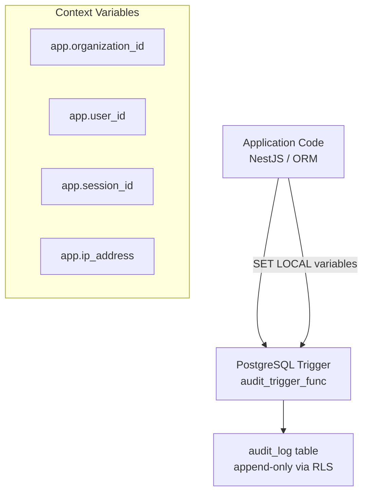

The audit log system provides a tamper-proof, automatic record of every data change across the CRM. Every `INSERT`, `UPDATE`, and `DELETE` on ~35 tables is captured atomically at the database level, including what changed, who changed it, from which session, and from which IP address.

<Note>
The system is built on PostgreSQL triggers so it is impossible to bypass from application code — even raw SQL queries or bulk imports are captured.
</Note>

## Architecture



### Key design principles

| Principle | Implementation |
|---|---|
| **Atomic capture** | Trigger fires inside the same transaction as the data change — either both succeed or both roll back |
| **Bypass-proof** | Writes happen at the DB level; application code has no `em.persist()` path to the table |
| **Immutable records** | RLS policies deny UPDATE and DELETE; INSERT is denied to the application role |
| **Tenant-scoped reads** | RLS SELECT policy enforces `organization_id` isolation |
| **Sensitive data stripped** | Trigger removes `password`, `refresh_token`, `hashed_token`, `refresh_token_hash` before storing snapshots |

## Database schema

```sql
CREATE TABLE "audit_log" (
  "id"               UUID        NOT NULL DEFAULT gen_random_uuid() PRIMARY KEY,
  "occurred_at"      TIMESTAMPTZ NOT NULL DEFAULT clock_timestamp(),
  "user_id"          UUID        NULL,       -- NULL for system/cron actions
  "organization_id"  UUID        NOT NULL,
  "session_id"       UUID        NULL,       -- NULL when not in a user session
  "action"           TEXT        NOT NULL CHECK ("action" IN ('INSERT', 'UPDATE', 'DELETE')),
  "table_name"       TEXT        NOT NULL,
  "record_id"        UUID        NOT NULL,
  "old_data"         JSONB       NULL,       -- NULL for INSERT
  "new_data"         JSONB       NULL,       -- NULL for DELETE
  "changed_fields"   TEXT[]      NULL,       -- Populated for UPDATE only
  "ip_address"       TEXT        NULL,
  "is_system_action" BOOLEAN     NOT NULL DEFAULT false
);
```

### Indexes

| Index | Columns | Purpose |
|---|---|---|
| `idx_audit_org_time` | `organization_id, occurred_at DESC` | Default list view — org-scoped feed |
| `idx_audit_record` | `table_name, record_id, occurred_at DESC` | Change history for a specific record |
| `idx_audit_user_time` | `user_id, occurred_at DESC` | Activity feed for a specific user |
| `idx_audit_table_time` | `organization_id, table_name, occurred_at DESC` | Filter by entity type within an org |
| `idx_audit_log_session_id` | `session_id, occurred_at DESC` (partial, WHERE NOT NULL) | Per-session activity trace |

## Row-level security (RLS)

Four policies enforce the append-only, tenant-isolated contract:

<AccordionGroup>
<Accordion title="RLS policies">

| Policy | Operation | Rule |
|---|---|---|
| `audit_log_select` | SELECT | Allow if `organization_id` matches `app.organization_id`, or `app.bypass_rls = 'true'` |
| `audit_log_no_insert` | INSERT | `WITH CHECK (false)` — always denied to application role |
| `audit_log_no_update` | UPDATE | `USING (false)` — always denied |
| `audit_log_no_delete` | DELETE | `USING (false)` — always denied |

</Accordion>
</AccordionGroup>

<Info>
The trigger functions use `SECURITY DEFINER` so they run with elevated privileges and can insert despite the INSERT policy. Application code cannot.
</Info>

## Trigger functions

### `audit_trigger_func()` — general purpose

Attached to all ~35 audited tables. Reads context variables from the transaction, builds old/new snapshots, strips sensitive fields, and inserts into `audit_log`.

**Tables audited:**
`lead`, `deal`, `contact`, `person`, `company`, `deal_contact`, `contact_company_role`,
`commission_payment`, `entity_stakeholder`, `entity_transfer`, `lead_stage`, `deal_stage`,
`lead_stage_history`, `deal_stage_history`, `entity_stakeholder_history`, `user`,
`user_org_roles`, `organization`, `role`, `permission`, `invitation`, `team`,
`team_membership`, `team_membership_role`, `secondary_unit`, `inventory_unit_ownership`,
`inventory_unit_transaction`, `shared_deal`, `shared_listing`, `unit_access_grant`,
`unit_access_request`, `developer_project_link`, `system_config`, `email_integrations`, `api_key`

**Logic:**
- `DELETE` → record old_data, record_id from OLD row
- `INSERT` → record new_data, record_id from NEW row
- `UPDATE` → record both, compute changed_fields (array of column names that differ)

**Sensitive field stripping (applied after snapshot):**
```sql
v_old_data := v_old_data - 'password' - 'refresh_token' - 'hashed_token' - 'refresh_token_hash';
v_new_data := v_new_data - 'password' - 'refresh_token' - 'hashed_token' - 'refresh_token_hash';
```

### `audit_session_trigger_func()` — session table

Dedicated trigger for the `session` table. Reads `organization_id` and `user_id` directly from the row (not from `SET LOCAL`) since session operations often run outside a normal tenant transaction.

<Warning>
**Heartbeat filtering:** UPDATE events where only `last_active_at`, `activity_count`, or `last_activity_type` changed are silently discarded to avoid high-frequency noise:

```sql
IF v_changed_fields <@ ARRAY['last_active_at', 'activity_count', 'last_activity_type'] THEN
  RETURN NULL;
END IF;
```
</Warning>

## Context propagation

Every write transaction sets PostgreSQL session-local variables so the trigger can identify who made the change:

```typescript
// In TenantContext.executeInOrg()
SET LOCAL app.organization_id = '<uuid>';
SET LOCAL app.bypass_rls      = 'false';
SET LOCAL app.user_id         = '<uuid>';      -- from CLS (auth guard)
SET LOCAL app.session_id      = '<uuid>';      -- from CLS (auth guard)
SET LOCAL app.ip_address      = '<ip>';        -- from CLS (auth guard), sanitized
```

<Tip>
These are `SET LOCAL` — they are scoped to the transaction and automatically cleared on commit or rollback. No manual cleanup required.
</Tip>

When `app.bypass_rls = 'true'` (system/cron operations), the trigger sets `is_system_action = true` in the audit row.

## Backend API

### Endpoints

| Method | Path | Description | Auth |
|---|---|---|---|
| `GET` | `/audit` | All events for requesting user's org | JWT |
| `GET` | `/audit/record/:tableName/:recordId` | Change history for a specific record | JWT |
| `GET` | `/audit/user/:userId` | All events triggered by a specific user | JWT |
| `GET` | `/system-admin/audit` | Cross-org audit log | System Admin JWT |

### Query parameters (all endpoints)

| Parameter | Type | Description |
|---|---|---|
| `tableName` | `string` | Filter by database table name |
| `recordId` | `UUID` | Filter by specific record |
| `userId` | `UUID` | Filter by user who made the change |
| `action` | `INSERT \| UPDATE \| DELETE` | Filter by action type |
| `from` | ISO 8601 | Start of date range |
| `to` | ISO 8601 | End of date range (must be ≥ `from`) |
| `sessionId` | `UUID` | Filter by session |
| `page` | `number` (min 1) | Page number, 1-based |
| `limit` | `number` (1–100) | Items per page, default 50 |

### Response shape

```typescript
{
  data: AuditLogEntry[];
  page: number;
  limit: number;
  total: number;       // exact total matching count
  totalPages: number;
  hasMore: boolean;
}
```

### Pagination

Server-side pagination using `LIMIT`/`OFFSET`. The backend always runs `findAndCount` to return an exact `total` — no client-side estimation.

## Frontend UI

Located at: `src/app/home/settings/audit-logs/page.tsx`

### Features

<CardGroup cols={2}>
<Card title="Grouped view" icon="layer-group">
Multiple events on the same record are collapsed into a single expandable row showing event count as plain text
</Card>
<Card title="Flat view" icon="list">
Toggle to see every event as its own row
</Card>
<Card title="Event labels" icon="tag">
Human-readable labels derived from `(tableName, action)` pairs (e.g., "Lead Created", "Login", "Stage Changed")
</Card>
<Card title="Event badges" icon="circle">
Action labels displayed as color-coded badges
</Card>
</CardGroup>

Additional features:
- **Filter bar**: Filter by table name, action type, user ID, date range (with "Apply" / "Clear" controls)
- **Detail sheet**: Click any row to see full `oldData`/`newData` JSONB diff
- **Pagination bar**: Numbered pages with smart ellipsis, first/last navigation, "rows per page" selector (10/25/50/100), "go to page" input

### Data flow

```mermaid
graph TD
    A[User changes page/filters] --> B[queryParams = {...filters, page, limit}]
    B --> C[useQuery → AuditLogApi.getAll]
    C --> D[GET /audit?page=X&limit=Y&tableName=...]
    D --> E[Backend: LIMIT/OFFSET query + COUNT]
    E --> F[{data, total, totalPages, hasMore}]
    F --> G[PaginationBar renders correct page state]
```

## Migrations

| Migration | Description |
|---|---|
| `Migration20260220000000_add_audit_log` | Initial table, trigger function, and triggers on ~35 tables |
| `Migration20260220100000_audit_session_login_logout` | Dedicated session trigger with token field stripping |
| `Migration20260220110000_fix_session_audit_heartbeat_noise` | Adds heartbeat filtering to session trigger |
| `Migration20260220200000_simplify_audit_log_single_table` | Converts from partitioned table to single well-indexed table |
| `Migration20260223000000_audit_log_session_id_uuid` | Alters `session_id` column from `TEXT` to `UUID`, rebuilds trigger functions with correct casts |
| `Migration20260224000000_audit_log_hardening` | Adds UPDATE/DELETE deny policies + partial index on `session_id` |

<Note>
**Partitioning decision**: Partitioning was removed at <1M rows because a single indexed table is simpler to operate and equally fast at this scale. Revisit when the table exceeds 50M rows or when per-tenant retention/archival is required.
</Note>

## Security considerations

<AccordionGroup>
<Accordion title="Security mitigations">

| Concern | Mitigation |
|---|---|
| Audit records tampered with | RLS denies UPDATE and DELETE to all application roles |
| INSERT from application code | RLS `WITH CHECK (false)` on INSERT; trigger uses SECURITY DEFINER to bypass this |
| SQL injection via context vars | All UUIDs validated with `isValidUUID()` before `SET LOCAL`; IP sanitized with regex |
| Cross-tenant data exposure | RLS SELECT policy enforces `organization_id = app.organization_id` |
| Sensitive data in snapshots | Trigger strips password, token fields before writing `old_data`/`new_data` |
| `SECURITY DEFINER` search path | `SET search_path = public` prevents search path injection attacks |

</Accordion>
</AccordionGroup>

## Known limitations

<Warning>
**`changed_fields` misses newly-populated NULL columns**: The diff iterates `old_data` keys only. If a column was `NULL` (not present in JSONB) before an UPDATE, it won't appear in `changed_fields` even if it now has a value.
</Warning>