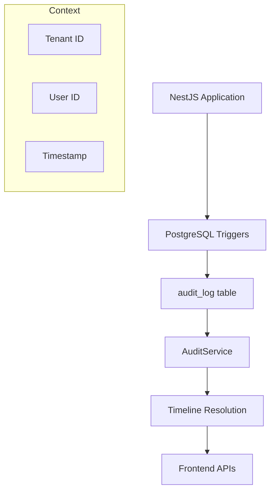

The audit module provides comprehensive tracking and querying capabilities for all data changes within the PropWise CRM system. It captures create, update, and delete operations across all entities through PostgreSQL triggers, storing them in an immutable audit log. The module includes timeline resolution functionality to convert raw audit entries into human-readable timeline events for frontend consumption.

<Note>
The system is built on PostgreSQL triggers so it captures all data changes automatically at the database level, ensuring comprehensive audit coverage.
</Note>

## Architecture

The audit system follows a trigger-based approach where all data changes are captured automatically at the database level:

- **Database Triggers**: PostgreSQL `audit_trigger_func()` captures all CUD operations
- **Read-Only Entity**: `AuditLog` entity is strictly for querying, never persisted by application code  
- **Timeline Resolution**: Converts raw audit data into semantic timeline events
- **Multi-tenant**: Audit logs are scoped by tenant context
- **Performance**: Indexed by tenant, timestamp, and table for efficient querying



## Entities

### AuditLog

The core audit log entity that maps to the `audit_log` database table:

```typescript
class AuditLog {
  id: string;                    // Primary key (UUID)
  tenantId: string;             // Tenant isolation
  tableName: string;            // Source table name
  recordId: string;             // ID of the affected record
  action: AuditAction;          // CREATE | UPDATE | DELETE
  oldValues?: Record<string, unknown>;  // Previous values (UPDATE/DELETE)
  newValues?: Record<string, unknown>;  // New values (CREATE/UPDATE)
  changedFields?: string[];     // List of changed field names
  userId?: string;              // User who made the change
  timestamp: Date;              // When the change occurred
}
```

### AuditAction

Enumeration of possible audit actions:

```typescript
enum AuditAction {
  CREATE = 'CREATE',
  UPDATE = 'UPDATE', 
  DELETE = 'DELETE'
}
```

<Warning>
The `AuditLog` entity is read-only. Application code should never attempt to persist audit entries directly — they are automatically generated by database triggers.
</Warning>

## API Endpoints

### User Audit Endpoints

**GET /audit**

Query audit logs for the current tenant with filtering and pagination support.

```typescript
// Query parameters
class AuditLogQueryDto {
  page?: number = 1;
  limit?: number = 20;
  tableName?: string;
  action?: AuditAction;
  recordId?: string;
  startDate?: string;  // ISO 8601
  endDate?: string;    // ISO 8601
}

// Response
interface PaginatedResponse<AuditLogDto> {
  data: AuditLogDto[];
  pagination: {
    page: number;
    limit: number;
    totalPages: number;
    totalItems: number;
  };
}
```

**GET /audit/:recordId/timeline**

Get timeline events for a specific record with resolved timeline messages for frontend display.

### System Admin Endpoints

**GET /system-admin/audit**

Cross-tenant audit log access for system administrators with additional tenant filtering capabilities.

```typescript
class SystemAdminAuditQueryDto extends AuditLogQueryDto {
  tenantId?: string;  // Filter by specific tenant
}
```

<Warning>
The system admin endpoint bypasses tenant isolation. Use carefully when accessing cross-tenant data.
</Warning>

## Timeline Event Types

The module defines semantic event types for different audit scenarios:

<Tabs>
<Tab title="Lead Events">

```typescript
enum LeadTimelineEvents {
  LEAD_CREATED = 'lead_created',
  LEAD_STAGE_CHANGED = 'lead_stage_changed', 
  LEAD_CONVERTED = 'lead_converted',
  LEAD_DISQUALIFIED = 'lead_disqualified',
  LEAD_SCORE_CHANGED = 'lead_score_changed'
}
```

</Tab>

<Tab title="Deal Events">

```typescript
enum DealTimelineEvents {
  DEAL_CREATED = 'deal_created',
  DEAL_STAGE_CHANGED = 'deal_stage_changed',
  DEAL_VALUE_CHANGED = 'deal_value_changed',
  DEAL_WON = 'deal_won',
  DEAL_LOST = 'deal_lost'
}
```

</Tab>

<Tab title="Contact & Property Events">

```typescript
enum ContactPropertyEvents {
  CONTACT_CREATED = 'contact_created',
  CONTACT_UPDATED = 'contact_updated',
  PROPERTY_CREATED = 'property_created',
  PROPERTY_UPDATED = 'property_updated'
}
```

</Tab>
</Tabs>

## Business Rules

### Data Capture Rules
- All database changes are captured automatically via triggers
- Sensitive fields (passwords, tokens) are automatically filtered out
- Audit entries are immutable once created
- Failed transactions do not generate audit entries (same transaction scope)

### Timeline Resolution Rules
- Each audit log entry maps to exactly one `TimelineEventType`
- Timeline messages include user information and change context
- Stage changes include both old and new stage names
- User information is resolved at query time, not stored in audit log

### Access Control
- Users can only access audit logs for their tenant
- System administrators can access cross-tenant audit data
- Record-level access follows the same permissions as the source entity

## Integration Points

### Authentication & Authorization
- Requires valid JWT token via `AuthGuard`
- System admin endpoints require `@SystemAdmin` decorator
- User context provided via `@GetCurrentUser` decorator

### Tenant Context
- All queries are automatically scoped by `TenantContext`
- Cross-tenant access restricted to system administrators

### Entity References
- Resolves user information from `User` entity
- Resolves stage information from `LeadStage` and `DealStage` entities
- Generic design supports any entity with UUID primary keys

## Patterns and Conventions

### Query Patterns
- Paginated responses using shared pagination utilities
- Date filtering with ISO 8601 string format
- Consistent filter parameter naming across endpoints

### Error Handling
- Invalid UUIDs return 400 Bad Request
- Missing records return empty results (not 404)
- Database errors bubble up as 500 Internal Server Error

### Performance Considerations
- Database indexes on `tenant_id`, `timestamp`, `table_name`
- Pagination prevents large result sets
- Timeline resolution done at query time, not storage time

### Security
- Sensitive field filtering at database trigger level
- Tenant isolation enforced at query level
- No direct audit log manipulation through application code

## Frontend Integration

<CardGroup cols={2}>
<Card title="Timeline View" icon="clock">
Human-readable timeline events with resolved messages and user context
</Card>
<Card title="Filtered Queries" icon="filter">
Support for filtering by date range, entity type, action, and user
</Card>
<Card title="Pagination" icon="list">
Efficient pagination for large audit datasets
</Card>
<Card title="Cross-tenant Admin" icon="users">
System administrator access to cross-tenant audit data
</Card>
</CardGroup>

<Info>
The audit module seamlessly integrates with the frontend through well-defined DTOs and consistent API patterns, providing both raw audit data and human-readable timeline events.
</Info>