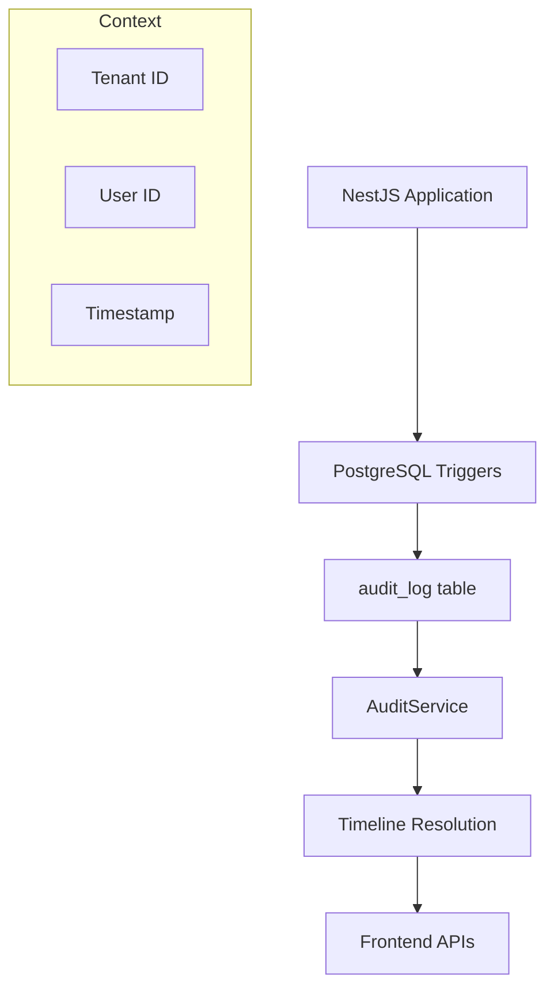

The audit module provides comprehensive tracking and querying capabilities for all data changes within the PropWise CRM system. It captures create, update, and delete operations across all entities through PostgreSQL triggers, storing them in an immutable audit log. The module includes timeline resolution functionality to convert raw audit entries into human-readable timeline events for frontend consumption.

<Note>
The system is built on PostgreSQL triggers so it captures all data changes automatically at the database level, ensuring comprehensive audit coverage.
</Note>

## Architecture

The audit system follows a trigger-based approach where all data changes are captured automatically at the database level:

- **Database Triggers**: PostgreSQL `audit_trigger_func()` captures all CUD operations
- **Read-Only Entity**: `AuditLog` entity is strictly for querying, never persisted by application code  
- **Timeline Resolution**: Converts raw audit data into semantic timeline events
- **Multi-tenant**: Audit logs are scoped by tenant context
- **Performance**: Indexed by tenant, timestamp, and table for efficient querying



## Entities

### AuditLog

The core audit log entity that maps to the `audit_log` database table:

```typescript
class AuditLog {
  id: string;                    // Primary key (UUID)
  tenantId: string;             // Tenant isolation
  tableName: string;            // Source table name
  recordId: string;             // ID of the affected record
  action: AuditAction;          // CREATE | UPDATE | DELETE
  oldValues?: Record<string, unknown>;  // Previous values (UPDATE/DELETE)
  newValues?: Record<string, unknown>;  // New values (CREATE/UPDATE)
  changedFields?: string[];     // List of changed field names
  userId?: string;              // User who made the change
  timestamp: Date;              // When the change occurred
}
```

### AuditAction

Enumeration of possible audit actions:

```typescript
enum AuditAction {
  CREATE = 'CREATE',
  UPDATE = 'UPDATE', 
  DELETE = 'DELETE'
}
```

<Warning>
The `AuditLog` entity is read-only. Application code should never attempt to persist audit entries directly — they are automatically generated by database triggers.
</Warning>

## API Endpoints

### User Audit Endpoints

**GET /audit**

Query audit logs for the current tenant with filtering and pagination support.

```typescript
// Query parameters
class AuditLogQueryDto {
  page?: number = 1;
  limit?: number = 20;
  tableName?: string;
  action?: AuditAction;
  recordId?: string;
  startDate?: string;  // ISO 8601
  endDate?: string;    // ISO 8601
}

// Response
interface PaginatedResponse<AuditLogDto> {
  data: AuditLogDto[];
  pagination: {
    page: number;
    limit: number;
    totalPages: number;
    totalItems: number;
  };
}
```

**GET /audit/:recordId/timeline**

Get timeline events for a specific record with resolved timeline messages for frontend display.

### System Admin Endpoints

**GET /system-admin/audit**

Cross-tenant audit log access for system administrators with additional tenant filtering capabilities.

```typescript
class SystemAdminAuditQueryDto extends AuditLogQueryDto {
  tenantId?: string;  // Filter by specific tenant
}
```

<Warning>
The system admin endpoint bypasses tenant isolation. Use carefully when accessing cross-tenant data.
</Warning>

## Timeline Event Types

The module defines semantic event types for different audit scenarios:

```typescript
enum TimelineEventType {
  // Lead Events
  LEAD_CREATED = 'lead_created',
  LEAD_STAGE_CHANGED = 'lead_stage_changed', 
  LEAD_CONVERTED = 'lead_converted',
  LEAD_DISQUALIFIED = 'lead_disqualified',
  LEAD_SCORE_CHANGED = 'lead_score_changed',
  
  // Deal Events  
  DEAL_CREATED = 'deal_created',
  DEAL_STAGE_CHANGED = 'deal_stage_changed',
  DEAL_VALUE_CHANGED = 'deal_value_changed',
  DEAL_WON = 'deal_won',
  DEAL_LOST = 'deal_lost',
  
  // Contact Events
  CONTACT_CREATED = 'contact_created',
  CONTACT_UPDATED = 'contact_updated',
  
  // Property Events
  PROPERTY_CREATED = 'property_created',
  PROPERTY_UPDATED = 'property_updated'
}
```

## Business Rules

### Data Capture Rules
- All database changes are captured automatically via triggers
- Sensitive fields (passwords, tokens) are automatically filtered out
- Audit entries are immutable once created
- Failed transactions do not generate audit entries (same transaction scope)

### Timeline Resolution Rules
- Each audit log entry maps to exactly one `TimelineEventType`
- Timeline messages include user information and change context
- Stage changes include both old and new stage names
- User information is resolved at query time, not stored in audit log

### Access Control
- Users can only access audit logs for their tenant
- System administrators can access cross-tenant audit data
- Record-level access follows the same permissions as the source entity

## Integration Points

### Authentication & Authorization
- Requires valid JWT token via `AuthGuard`
- System admin endpoints require `@SystemAdmin` decorator
- User context provided via `@GetCurrentUser` decorator

### Tenant Context
- All queries are automatically scoped by `TenantContext`
- Cross-tenant access restricted to system administrators

### Entity References
- Resolves user information from `User` entity
- Resolves stage information from `LeadStage` and `DealStage` entities
- Generic design supports any entity with UUID primary keys

## Patterns and Conventions

### Query Patterns
- Paginated responses using shared pagination utilities
- Date filtering with ISO 8601 string format
- Consistent filter parameter naming across endpoints

## Error Handling

### Standard Error Responses

<AccordionGroup>
<Accordion title="400 Bad Request">
Returned for invalid UUID format in record ID parameters or malformed query parameters.
</Accordion>
<Accordion title="404 Not Found">
Missing records return empty results rather than 404 errors to maintain consistent API behavior.
</Accordion>
<Accordion title="500 Internal Server Error">
Database connection issues or unexpected system errors bubble up as internal server errors.
</Accordion>
</AccordionGroup>

<Note>
The audit system prioritizes data consistency over strict HTTP semantics. Empty result sets are returned instead of 404 errors to distinguish between "no audit data" and "resource not found" scenarios.
</Note>

## Performance Considerations

### Database Optimization
- **Primary Indexes**: `tenant_id`, `timestamp`, `table_name` for efficient querying
- **Pagination Strategy**: Prevents large result sets from impacting system performance
- **Query-time Resolution**: Timeline resolution happens during queries, not at storage time to reduce write overhead

### Scaling Strategies
- Audit log tables can be partitioned by date for large datasets
- Read replicas can be used for audit queries without impacting operational database
- Archival strategies can move older audit data to cold storage

<Tip>
For high-volume systems, consider implementing audit log partitioning and archival policies to maintain query performance over time.
</Tip>

## Security

### Data Protection
- **Sensitive Field Filtering**: Passwords, tokens, and other sensitive data are automatically filtered at the database trigger level
- **Tenant Isolation**: All queries are automatically scoped by tenant context to prevent cross-tenant data access
- **Immutable Logs**: No direct manipulation of audit logs through application code ensures data integrity

### Access Control
- Standard authentication required for all endpoints
- System admin endpoints have additional authorization checks
- Record-level access follows source entity permissions

<Warning>
The audit system captures all data changes, including sensitive operations. Ensure proper access controls are in place and consider data retention policies for compliance requirements.
</Warning>

## Frontend Integration

<CardGroup cols={2}>
<Card title="Timeline View" icon="clock">
Human-readable timeline events with resolved messages and user context
</Card>
<Card title="Filtered Queries" icon="filter">
Support for filtering by date range, entity type, action, and user
</Card>
<Card title="Pagination" icon="list">
Efficient pagination for large audit datasets
</Card>
<Card title="Cross-tenant Admin" icon="users">
System administrator access to cross-tenant audit data
</Card>
</CardGroup>

<Info>
The audit module seamlessly integrates with the frontend through well-defined DTOs and consistent API patterns, providing both raw audit data and human-readable timeline events.
</Info>