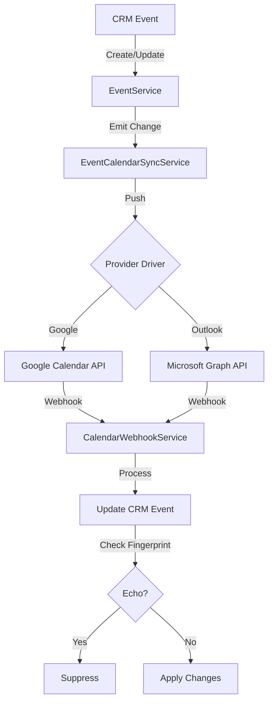

<Warning>
This document is intentionally blunt: the calendar integration is not a simple "push event to Google" feature. It is a distributed sync system with two hostile external providers, eventually consistent mailboxes, webhook retries, token expiry, RLS, notifications, and user actions happening from both CRM and external calendars.
</Warning>

## Executive Summary

The system has three calendar layers:

<CardGroup cols={3}>
  <Card title="CRM Calendar Feed" icon="calendar">
    Primary routes for personal workload, organization stacked calendar, and team views
  </Card>
  <Card title="CRM Events" icon="calendar-days">
    EventService owns the internal event source of truth, invitees, RSVP status, and notifications
  </Card>
  <Card title="Calendar Integrations" icon="link">
    Google and Outlook drivers push CRM events outward and process provider webhooks back into CRM
  </Card>
</CardGroup>

### CRM Calendar Feed Routes

The CRM calendar feed provides three primary access patterns:

<AccordionGroup>
  <Accordion title="GET /v1/calendar/me - Personal Calendar">
    Personal workload view showing:
    - CRM tasks and subtasks
    - CRM events
    - External calendar items (when viewing yourself)
    
    Legacy routes **`GET /v1/calendar`** and **`GET /v1/calendar/agenda`** delegate to the same handlers as **`/me`** and **`/me/agenda`**.
  </Accordion>

  <Accordion title="GET /v1/calendar/org - Organization Stacked Calendar">
    Organization view with `userIds` parameter (1-10 other org members):
    - Response format: `{ rosterUserIds, itemsByUserId }`
    - Shows personal-scope tasks/subtasks + CRM events per subject
    - No external calendar items included
    - Viewer ID in the query is ignored
  </Accordion>

  <Accordion title="GET /v1/calendar/teams/:teamId - Team Calendar">
    Team view requiring:
    - `team.admin`, `team_crm.*`, or `team_sales.*` permissions on that team, OR
    - Org admin/owner role
    
    Shows CRM-only items per roster member (authenticated user is excluded from the roster; use **`/me`** for self).
  </Accordion>
</AccordionGroup>

### Agenda Endpoints

<Tabs>
  <Tab title="Personal Agenda">
    **`GET /v1/calendar/me/agenda`** (and legacy `/calendar/agenda`)
    
    Serves the personal merged agenda list:
    - Optional inclusive `from` parameter
    - Forward scan up to a server lookahead cap
    - **No** `limit`/`cursor` pagination (see `calendar-agenda.constants.ts`)
    - Response includes **`truncated: true`** when merge loop exits before reaching lookahead horizon
    - **`truncated: false`** when scan ran through full lookahead window
    
    <Info>
    Clients can use the `truncated` flag to show that more items may exist beyond what was merged.
    </Info>
  </Tab>

  <Tab title="Timeline Agenda">
    **`GET /v1/calendar/me/agenda/timeline`**
    
    Serves the CRM web agenda list with **day-window pagination**:
    - Merged probe → local `fromDay`/`toDay` in the viewer `Time-Zone` header
    - Full refetch for that window
    - `nextCursor` for the following page
    
    See `calendar-timeline.*` for implementation details.
  </Tab>
</Tabs>

### Intended Model

The calendar system follows these core principles:

<Steps>
  <Step title="CRM Events as Source of Truth">
    CRM events are the canonical business record for all event data.
  </Step>
  
  <Step title="Creator Updates">
    Creator calendar copies can update CRM event details when changed externally.
  </Step>
  
  <Step title="Invitee RSVP Only">
    Invitee calendar copies can only update RSVP status (not event details).
  </Step>
  
  <Step title="External Items Read-Only">
    External-only items are displayed read-only and are not imported into CRM.
  </Step>
  
  <Step title="Echo Suppression">
    Provider echoes are suppressed with change IDs, fingerprints, ETags, and short time windows.
  </Step>
</Steps>

### Key Risks and Guardrails

<Warning>
The biggest risk is that the system is trying to make two different calendar providers behave like one coherent event bus. That is inherently fragile.
</Warning>

The code has several good guardrails, but some areas are still production-dangerous:

- **CRM-originated outbound sync without durable queue** (listener path)
- **Remaining provider HTTP inside tenant transactions** (now **without** multi-second Outlook shadow polling)
- **Provider-specific edge cases** around recurring events, all-day events, deleted invitees, and Outlook mailbox-local event IDs

### Webhook Authenticity

<Tabs>
  <Tab title="Google Calendar">
    Google stores a **separate** `watchChannelVerifyToken`:
    - Sent as the `token` in `events.watch`
    - Echoed as `X-Goog-Channel-Token`
    - **Not the same** as the channel `id` (legacy rows may still equate the two)
    
    When `watchResourceId` is present, inbound notifications must also match `X-Goog-Resource-Id`.
  </Tab>

  <Tab title="Outlook Calendar">
    Outlook requires `clientState` to equal the integration UUID.
    
    When Microsoft Graph includes **`validationTokens`** on a change-notification batch:
    - JWTs are verified via JWKS
    - Verification happens before handler returns `202`
    - Audience: `app.outlookCalendar.webhookValidationAudience` (defaults to calendar app client ID)
  </Tab>
</Tabs>

### Production Requirements

<Check>
In **production** (`buildAppConfig().isProduction`):
- `GOOGLE_CALENDAR_WEBHOOK_URL` must be **https** and must not target localhost
- `OUTLOOK_CALENDAR_WEBHOOK_URL` must be **https** and must not target localhost
- Public calendar webhooks are throttled
- Outlook batches are capped before async sync fan-out
</Check>

### Durability and RLS

<Info>
**Outlook shadow mapping retries are durable:** `calendar_sync_outbox` operation `outlook-shadow-reconcile` + pg-boss execute worker (with backoff), not in-process timers.
</Info>

<Check>
**RLS Protection:** `calendar_sync_outbox`, `calendar_external_cache`, and `calendar_oauth_intent` are RLS-protected like other org tables.
</Check>

## Main Files

### Calendar Integration Module

<CodeGroup>

```typescript src/modules/integrations/calendar-integration/
calendar-integration.module.ts
calendar-integration.service.ts
event-calendar-sync.service.ts
calendar-webhook.service.ts
calendar-webhook.controller.ts
calendar-watch-renewal.handler.ts
microsoft-graph-webhook-validation.util.ts
```

```typescript src/common/constants/
event-calendar-sync.constants.ts
// Timeouts, backoff, HTTP status aliases, all-day UTC components
// NO magic numbers in event-calendar-sync.service.ts
```

</CodeGroup>

### Provider Drivers

<CodeGroup>

```typescript drivers/calendar-driver.interface.ts
// Base interface for calendar providers
export interface CalendarDriver {
  provider: CalendarProvider;
  pushEvent(params: PushEventParams): Promise<PushEventResult>;
  deleteEvent(params: DeleteEventParams): Promise<void>;
  // ... other methods
}
```

```typescript drivers/calendar-driver.registry.ts
// Registry pattern for provider lookup
export class CalendarDriverRegistry {
  getDriver(provider: CalendarProvider): CalendarDriver;
}
```

```typescript drivers/
google-calendar.driver.ts
outlook-calendar.driver.ts
```

</CodeGroup>

### OAuth Implementation

<AccordionGroup>
  <Accordion title="SignedPayloadService">
    **`src/common/security/signed-payload.service.ts`**
    
    HMAC-SHA256 tokens: `v1.<base64url(envelope)>.<base64url(sig)>`
    
    Envelope structure:
    - `purpose`
    - `iat` (issued at)
    - `exp` (expiration)
    - JSON `payload`
    
    Calendar OAuth uses:
    - Purpose: **`calendar.oauth.state`**
    - Payload: `{ userId, organizationId }`
    - Secret: `app.signedPayload.stateSecret`
  </Accordion>

  <Accordion title="OAuth Flow Service">
    **`src/modules/integrations/oauth/calendar-oauth-flow.service.ts`**
    
    - Delegates `signState` / `verifyState` to `SignedPayloadService`
    - TTL: `CALENDAR_OAUTH_STATE_TTL_MS`
    - Shared callback helpers for both providers
  </Accordion>

  <Accordion title="Provider Controllers">
    - **`src/modules/integrations/oauth/google-calendar-oauth.controller.ts`**
    - **`src/modules/integrations/oauth/outlook-calendar-oauth.controller.ts`**
  </Accordion>
</AccordionGroup>

### CRM Calendar/Event Side

<Tabs>
  <Tab title="Calendar Services">
    ```typescript
    src/modules/crm/calendar/
    ├── calendar.service.ts
    ├── calendar-cache.service.ts
    ├── calendar.dto.ts
    ├── calendar-agenda.constants.ts
    ├── calendar-agenda-cursor.util.ts
    ├── calendar-timeline.constants.ts
    ├── calendar-timeline.util.ts
    └── calendar-timeline-cursor.util.ts
    ```
  </Tab>

  <Tab title="Event Services">
    ```typescript
    src/modules/crm/event/
    ├── event.service.ts
    ├── event-notification-recipients.util.ts
    ├── event-change-detection.util.ts
    └── calendar-sync.constants.ts
    ```
    
    <Note>
    **event-change-detection.util.ts** provides deep equality for `customFields` and sorted id arrays.
    </Note>
  </Tab>
</Tabs>

### Data Model

<Steps>
  <Step title="Core Entities">
    - `calendar-integration.entity.ts` - Integration configuration and OAuth tokens
    - `calendar-event-mapping.entity.ts` - Maps CRM events to provider events
  </Step>

  <Step title="Key Migrations">
    - `Migration20260422100000_AddCalendarIntegration.ts`
    - `Migration20260427140000_OutlookCalendarProviderAndSchema.ts`
    - `Migration20260427150000_CalendarEventMappingICalUid.ts`
    - `Migration20260427160000_CalendarEchoSuppressionColumns.ts`
    - `Migration20260427170000_CalendarEventMappingLastOutboundFingerprint.ts`
    - `Migration20260428140000_CalendarSyncOutbox.ts`
    - `Migration20260428160000_CalendarSyncOutboxActiveIdempotencyUnique.ts`
    - `Migration20260428180000_EnableCalendarSyncOutboxRls.ts`
    - `Migration20260428200000_CalendarIntegrationSyncHealthColumns.ts`
  </Step>
</Steps>

### MikroORM Snapshot Hygiene

<Warning>
`migrations/.snapshot-neondb.json` is the baseline for `npx mikro-orm migration:check` / `migration:create`.

If `migration:check` reports a large diff unrelated to your change, the snapshot has drifted from the entity metadata the team expects.

**Do NOT merge a `migration:create` dump that tries to recreate unrelated tables.**
</Warning>

To fix drift:
1. Use dev database with all migrations applied
2. Regenerate the snapshot per MikroORM guidance
3. Verify the diff matches your intended changes only

## Personal Agenda Timeline

**Endpoint:** `GET /v1/calendar/me/agenda/timeline`

Used by the CRM web **agenda** view for infinite scroll. Same merged shapes as **`/calendar/me`** (`CalendarItemDto`).

### Configuration

<AccordionGroup>
  <Accordion title="Viewer Zone">
    Requires the standard **`Time-Zone`** request header (IANA format).
    
    - Invalid/missing timezone → defaults to `UTC`
    - See `TimezoneMiddleware` / `TimezoneParam` for implementation
  </Accordion>

  <Accordion title="Sort Order">
    Items are sorted by:
    - **Tasks:** By **due date** (`startDate` on the DTO mirrors due)
    - **CRM events and externals:** By **start time**
    - **Tie-breaker:** Stable sort by source + id
    
    Implementation in `calendar-timeline.util.ts`
  </Accordion>

  <Accordion title="Probe Logic">
    From the page anchor day:
    
    1. Fetch a merged window of **`CALENDAR_TIMELINE_PROBE_LOOKAHEAD_DAYS`** (default 60 days)
    2. Merge-sort all items
    3. Apply first-page visibility rule:
       - Tasks: `max(from, now)`
       - Events/externals: Also kept when they **overlap the viewer's local "today"** even if `start` is before the floor
    4. Take the first **`CALENDAR_TIMELINE_PAGE_TARGET`** (40 rows)
  </Accordion>

  <Accordion title="Day Span Calculation">
    Union of local calendar days each row touches:
    
    - **Date-only tasks:** Use `dueDate` `YYYY-MM-DD` prefix
    - **Timed items:** Use Luxon in the viewer zone
    - **All-day events:** Walk date labels
    
    **`fromDay` is floored at the page anchor** (`anchorBoundedDaySpan`):
    - Multi-day CRM events/externals can contribute keys **before** the anchor while still overlapping the probe window
    - Without the floor, clamp + `nextCursor` could repeat and clients would refetch the same cursor
    
    `D_min` / `D_max` are clamped to **`CALENDAR_TIMELINE_MAX_DAY_SPAN`** days.
  </Accordion>
</AccordionGroup>

### Request Flow

<Steps>
  <Step title="Authoritative Fetch">
    `collectMergedCalendarItems` for `[startOf(D_min), endOf(D_max)]` in the viewer zone.
    
    <Info>
    CRM events already use **interval overlap** in `EventService.getCalendarEvents`.
    </Info>
  </Step>

  <Step title="Item Processing">
    Timeline items include optional **`agendaDayKeys: string[]`** for this endpoint only.
    
    These are the server-authoritative viewer-local day buckets the row should render in, clipped to the response window (`fromDay`–`toDay`).
  </Step>

  <Step title="Response Building">
    Items whose clipped `agendaDayKeys` is empty are **dropped server-side** before the response is built.
    
    They do not belong to this page window and will appear correctly on the next page.
  </Step>
</Steps>

### Response Format

```typescript
{
  window: {
    fromDay: string,      // YYYY-MM-DD
    toDay: string,        // YYYY-MM-DD
    timeZone: string      // IANA timezone
  },
  items: CalendarItemDto[],
  nextCursor: string,     // base64 JSON: { v, nextDay }
  hasMore: boolean
}
```

<Note>
`nextCursor` contains `{ v, nextDay }` where `nextDay` is the local calendar day **after** `toDay`.
</Note>

### Client Rendering Rules

<Warning>
Clients must follow these rules to correctly render agenda items:
</Warning>

<Steps>
  <Step title="Group by agendaDayKeys">
    When `agendaDayKeys` is present, group agenda rows by these server-provided keys.
  </Step>

  <Step title="Skip Empty Arrays">
    If `agendaDayKeys` is a defined but empty array, skip the row entirely.
    
    **Do NOT** fall back to browser-local date parsing, which would misplace the row.
  </Step>

  <Step title="Fallback for Legacy">
    Browser-local parsing is only a fallback for rows where `agendaDayKeys` is entirely absent (non-timeline callers, legacy paths).
  </Step>

  <Step title="Use Response Window">
    Use the response `window.toDay` as the loaded-through boundary for infinite scroll.
  </Step>
</Steps>

### West-of-UTC All-Day Event Issue (Fixed)

<Tip>
All-day CRM events are stored as UTC midnight (`T00:00:00.000Z`).

The authoritative UTC refetch range for a page ending at local `toDay` must extend appropriately to capture events that may appear to start the previous day in UTC but actually belong to `toDay` in the viewer's timezone.

This issue has been addressed in the current implementation.
</Tip>

## Calendar Integration Architecture

### Sync Flow Overview



### Provider Drivers

Both Google and Outlook drivers implement the `CalendarDriver` interface:

<CodeGroup>

```typescript Push Event
interface PushEventParams {
  integration: CalendarIntegration;
  event: Event;
  invitees: EventInvitee[];
  // ... other params
}

interface PushEventResult {
  providerEventId: string;
  providerCalendarId: string;
  iCalUID?: string;
  etag?: string;
  // ... other fields
}
```

```typescript Delete Event
interface DeleteEventParams {
  integration: CalendarIntegration;
  mapping: CalendarEventMapping;
  // ... other params
}
```

```typescript Webhook Processing
interface ProcessWebhookParams {
  integration: CalendarIntegration;
  notification: ProviderNotification;
  // ... other params
}
```

</CodeGroup>

### Echo Suppression Strategy

The system uses multiple mechanisms to prevent infinite update loops:

<Tabs>
  <Tab title="Change IDs">
    Each outbound push generates a unique change ID that is stored with the mapping.
    
    When a webhook arrives, the system checks if the change ID matches the last outbound operation.
  </Tab>

  <Tab title="Fingerprints">
    Event content is fingerprinted before pushing to the provider.
    
    Incoming webhooks are fingerprinted and compared against `lastOutboundFingerprint`.
  </Tab>

  <Tab title="ETags">
    Provider ETags are stored in the mapping table.
    
    Conditional updates use ETags to detect concurrent modifications.
  </Tab>

  <Tab title="Time Windows">
    Short time windows (seconds) are used to suppress immediate echoes.
    
    Webhooks that arrive within the suppression window after an outbound push are ignored.
  </Tab>
</Tabs>

### Sync Outbox Pattern

<Info>
The `calendar_sync_outbox` table provides durable, retryable outbound operations.
</Info>

**Key features:**

- **Operation types:** `push-event`, `delete-event`, `outlook-shadow-reconcile`
- **Idempotency:** Unique constraint on `(organizationId, operation, idempotencyKey)` when `status = 'active'`
- **Retry logic:** pg-boss execute worker with exponential backoff
- **RLS protection:** Full row-level security like other org tables

<CodeGroup>

```typescript Enqueue Operation
async enqueueEventPush(params: {
  organizationId: string;
  userId: string;
  eventId: string;
  integrationId: string;
  idempotencyKey: string;
}): Promise<void> {
  await this.calendarSyncOutboxRepo.create({
    organizationId: params.organizationId,
    userId: params.userId,
    operation: 'push-event',
    payload: {
      eventId: params.eventId,
      integrationId: params.integrationId,
    },
    idempotencyKey: params.idempotencyKey,
    status: 'active',
  });
}
```

```typescript Process Outbox
async processOutboxItem(
  item: CalendarSyncOutbox
): Promise<void> {
  try {
    await this.executeOperation(item);
    await this.markComplete(item.id);
  } catch (error) {
    await this.handleRetry(item.id, error);
  }
}
```

</CodeGroup>

### Outlook Shadow Mapping

<Warning>
Outlook mailbox-local event IDs require special handling through shadow mapping.
</Warning>

**Problem:** Outlook returns a mailbox-specific event ID that differs from the iCalUID. When processing webhooks, we need to reconcile these IDs.

**Solution:** Durable `outlook-shadow-reconcile` operations in the sync outbox:

<Steps>
  <Step title="Initial Push">
    When pushing an event to Outlook, we get back a mailbox-local event ID.
  </Step>

  <Step title="Enqueue Reconciliation">
    Enqueue an `outlook-shadow-reconcile` operation to fetch the iCalUID.
  </Step>

  <Step title="Retry with Backoff">
    pg-boss worker executes the reconciliation with exponential backoff.
  </Step>

  <Step title="Update Mapping">
    Once we have the iCalUID, update the calendar event mapping.
  </Step>
</Steps>

<Note>
This replaces the previous in-process timer approach with a durable, RLS-protected queue.
</Note>

## OAuth Flow

### State Token Security

The OAuth flow uses signed state tokens to prevent CSRF attacks:

<CodeGroup>

```typescript Generate State
const state = await this.signedPayloadService.sign({
  purpose: 'calendar.oauth.state',
  payload: {
    userId: user.id,
    organizationId: user.organizationId,
  },
  ttl: CALENDAR_OAUTH_STATE_TTL_MS,
});
```

```typescript Verify State
const { payload } = await this.signedPayloadService.verify(
  state,
  'calendar.oauth.state'
);

// payload: { userId, organizationId }
```

</CodeGroup>

### Google Calendar OAuth

<Steps>
  <Step title="Initiate Flow">
    **`GET /oauth/google-calendar/authorize`**
    
    - Generate signed state token
    - Redirect to Google OAuth consent screen
    - Request scopes: `calendar.events`, `calendar.events.readonly`
  </Step>

  <Step title="Handle Callback">
    **`GET /oauth/google-calendar/callback`**
    
    - Verify state token
    - Exchange authorization code for tokens
    - Store refresh token in `calendar_integration` table
    - Set up webhook watch channel
  </Step>

  <Step title="Token Refresh">
    Automatic token refresh when access token expires:
    
    - Check token expiry before each API call
    - Use refresh token to get new access token
    - Update stored token in database
  </Step>
</Steps>

### Outlook Calendar OAuth

<Steps>
  <Step title="Initiate Flow">
    **`POST /oauth/outlook-calendar/authorize`**
    
    - Generate signed state token
    - Redirect to Microsoft identity platform
    - Request scopes: `Calendars.ReadWrite`, `offline_access`
  </Step>

  <Step title="Handle Callback">
    **`GET /oauth/outlook-calendar/callback`**
    
    - Verify state token
    - Exchange authorization code for tokens
    - Store refresh token in `calendar_integration` table
    - Create webhook subscription
  </Step>

  <Step title="Token Refresh">
    Similar to Google, with Microsoft-specific token endpoint.
  </Step>
</Steps>

### OAuth Intent Table

<Info>
The `calendar_oauth_intent` table (RLS-protected) tracks OAuth flows in progress.
</Info>

Used for:
- Associating the callback with the original user session
- Storing temporary state before token exchange completes
- Preventing replay attacks

## Webhook System

### Google Calendar Webhooks

<Tabs>
  <Tab title="Watch Channel Setup">
    ```typescript
    await googleCalendar.events.watch({
      calendarId: 'primary',
      requestBody: {
        id: channelId,              // UUID
        type: 'web_hook',
        address: webhookUrl,
        token: verifyToken,         // Separate from channel ID
        expiration: expiryTimestamp,
      },
    });
    ```
    
    <Check>
    **Channel expiry:** Google channels expire after ~1 week. The system uses `CalendarWatchRenewalHandler` to automatically renew before expiry.
    </Check>
  </Tab>

  <Tab title="Webhook Verification">
    ```typescript
    // Verify X-Goog-Channel-Token matches stored watchChannelVerifyToken
    const token = req.headers['x-goog-channel-token'];
    if (token !== integration.watchChannelVerifyToken) {
      throw new UnauthorizedException('Invalid channel token');
    }
    
    // Verify X-Goog-Resource-Id matches watchResourceId
    const resourceId = req.headers['x-goog-resource-id'];
    if (resourceId !== integration.watchResourceId) {
      throw new UnauthorizedException('Invalid resource ID');
    }
    ```
  </Tab>

  <Tab title="Notification Processing">
    Google sends notifications with:
    - `X-Goog-Resource-State`: `sync`, `exists`, `not_exists`
    - `X-Goog-Resource-ID`: Resource identifier
    - `X-Goog-Channel-ID`: Watch channel UUID
    - `X-Goog-Channel-Token`: Verify token
    
    <Warning>
    `sync` notifications are sent immediately after watch creation to confirm the channel. They do not represent actual changes.
    </Warning>
  </Tab>
</Tabs>

### Outlook Calendar Webhooks

<Tabs>
  <Tab title="Subscription Setup">
    ```typescript
    await graphClient
      .api('/subscriptions')
      .post({
        changeType: 'created,updated,deleted',
        notificationUrl: webhookUrl,
        resource: '/me/events',
        expirationDateTime: expiryDateTime,
        clientState: integration.id,  // Must match on webhook
      });
    ```
    
    <Check>
    **Subscription expiry:** Outlook subscriptions expire after 3 days maximum. The renewal handler must refresh before expiry.
    </Check>
  </Tab>

  <Tab title="Validation Tokens">
    Microsoft Graph may send `validationTokens` in the notification batch:
    
    ```typescript
    interface ValidationToken {
      token: string;  // JWT
    }
    ```
    
    The system verifies these JWTs using `microsoft-graph-webhook-validation.util.ts`:
    - Fetch Microsoft JWKS endpoint
    - Verify JWT signature
    - Check audience matches `app.outlookCalendar.webhookValidationAudience`
    - Return `202 Accepted` only after successful verification
  </Tab>

  <Tab title="Notification Processing">
    Outlook sends batched notifications:
    
    ```typescript
    interface ChangeNotification {
      subscriptionId: string;
      clientState: string;     // Must match integration.id
      changeType: 'created' | 'updated' | 'deleted';
      resource: string;        // Event URL
      resourceData: {
        id: string;            // Event ID
        '@odata.type': string;
        '@odata.id': string;
      };
    }
    ```
    
    <Warning>
    Outlook batches can contain up to 1000 notifications. The system caps fan-out processing to prevent overload.
    </Warning>
  </Tab>
</Tabs>

### Webhook Throttling

<Info>
Public webhook endpoints are throttled to prevent abuse:
- Rate limit per IP address
- Maximum batch size enforcement (Outlook)
- Webhook authenticity checks before processing
</Info>

### Watch Renewal

<CodeGroup>

```typescript Renewal Handler
@Cron('0 */6 * * *')  // Every 6 hours
async renewExpiringWatches() {
  const expiringIntegrations = await this.findExpiringIntegrations({
    expiresWithin: WATCH_RENEWAL_THRESHOLD,
  });

  for (const integration of expiringIntegrations) {
    await this.renewWatch(integration);
  }
}
```

```typescript Renewal Logic
async renewWatch(integration: CalendarIntegration) {
  const driver = this.driverRegistry.getDriver(integration.provider);
  
  try {
    const result = await driver.renewWebhookWatch(integration);
    
    await this.integrationRepo.update(integration.id, {
      watchChannelId: result.channelId,
      watchChannelExpiry: result.expiry,
      watchResourceId: result.resourceId,
    });
  } catch (error) {
    await this.handleRenewalFailure(integration, error);
  }
}
```

</CodeGroup>

## Event Synchronization

### Outbound Sync (CRM → Provider)

<Steps>
  <Step title="Event Change Detection">
    `EventService` emits changes when:
    - New event created
    - Event details updated (title, time, location, etc.)
    - Invitees added or removed
    - Event deleted
    
    Uses `event-change-detection.util.ts` for deep equality checks on custom fields and sorted ID arrays.
  </Step>

  <Step title="Listener Processing">
    `EventCalendarSyncService` subscribes to event changes:
    
    ```typescript
    @OnEvent('event.created')
    async handleEventCreated(event: Event) {
      const integrations = await this.getActiveIntegrations(event.creatorId);
      
      for (const integration of integrations) {
        await this.pushEventToProvider(integration, event);
      }
    }
    ```
    
    <Warning>
    This listener path currently executes **without** durable queue. If the provider API call fails, the sync may be lost. Consider enqueuing to `calendar_sync_outbox` instead.
    </Warning>
  </Step>

  <Step title="Driver Push">
    Provider driver translates CRM event to provider format:
    
    - Map CRM fields to provider fields
    - Convert timezone information
    - Handle all-day events
    - Set recurrence rules
    - Add invitees as attendees
  </Step>

  <Step title="Mapping Creation">
    On successful push, create `CalendarEventMapping`:
    
    ```typescript
    await this.mappingRepo.create({
      organizationId: event.organizationId,
      eventId: event.id,
      integrationId: integration.id,
      providerEventId: result.providerEventId,
      providerCalendarId: result.providerCalendarId,
      iCalUID: result.iCalUID,
      etag: result.etag,
      lastOutboundFingerprint: fingerprint,
      lastOutboundChangeId: changeId,
    });
    ```
  </Step>

  <Step title="Invitee Sync">
    For each invitee with their own calendar integration:
    - Create read-only copy in their calendar
    - Map RSVP status to provider attendance status
    - Store separate mapping for invitee's copy
  </Step>
</Steps>

### Inbound Sync (Provider → CRM)

<Steps>
  <Step title="Webhook Receipt">
    `CalendarWebhookController` receives notification from provider.
  </Step>

  <Step title="Authenticity Check">
    Verify webhook is legitimate:
    - Google: Check `X-Goog-Channel-Token` and `X-Goog-Resource-Id`
    - Outlook: Check `clientState` and verify validation tokens if present
  </Step>

  <Step title="Echo Suppression">
    Check if this notification is an echo of our own outbound change:
    
    ```typescript
    const mapping = await this.findMapping(providerEventId);
    
    if (this.isEcho(notification, mapping)) {
      // Suppress - this is our own change echoing back
      return;
    }
    ```
    
    Uses:
    - `lastOutboundChangeId` comparison
    - `lastOutboundFingerprint` comparison
    - Timestamp window (within seconds of outbound push)
  </Step>

  <Step title="Permission Check">
    Determine what can be updated:
    
    - **Creator mapping:** Can update all event details
    - **Invitee mapping:** Can only update RSVP status
    - **No mapping:** Ignore (external-only event)
  </Step>

  <Step title="Apply Changes">
    Update CRM event based on provider changes:
    
    ```typescript
    if (isCreatorMapping) {
      await this.eventService.updateFromProvider({
        eventId: mapping.eventId,
        title: providerEvent.title,
        startTime: providerEvent.start,
        endTime: providerEvent.end,
        location: providerEvent.location,
        // ... other fields
      });
    } else {
      // Invitee can only update RSVP
      await this.eventService.updateInviteeRsvp({
        eventId: mapping.eventId,
        userId: mapping.userId,
        status: mapProviderRsvpToCrm(providerEvent.attendeeStatus),
      });
    }
    ```
  </Step>

  <Step title="Update Mapping">
    Store new provider state:
    
    ```typescript
    await this.mappingRepo.update(mapping.id, {
      etag: providerEvent.etag,
      iCalUID: providerEvent.iCalUID,
      lastInboundSyncAt: new Date(),
    });
    ```
  </Step>
</Steps>

### Notification Recipients

The system uses `event-notification-recipients.util.ts` to determine who should receive notifications:

<Tabs>
  <Tab title="RSVP Change Notifications">
    When an invitee changes their RSVP status:
    - Notify event creator
    - Notify other invitees (optional, based on settings)
    - **Do not** notify the invitee who made the change
  </Tab>

  <Tab title="Time Change Notifications">
    When event time/date changes:
    - Notify all invitees
    - Notify creator if change came from provider
    - Use recipient's notification preferences
  </Tab>

  <Tab title="Detail Change Notifications">
    When event details change (title, location, description):
    - Notify invitees based on significance
    - Minor changes may not trigger notifications
    - User preferences respected
  </Tab>
</Tabs>

## Edge Cases and Known Issues

### Recurring Events

<Warning>
Recurring events are particularly complex and provider-dependent.
</Warning>

<AccordionGroup>
  <Accordion title="Google Calendar Recurring Events">
    Google uses:
    - Single event with `recurrence` RRULE array
    - Instances are not separate events
    - Overrides are stored as exceptions
    
    **Challenges:**
    - Editing single occurrence requires creating exception
    - CRM must decide whether to update recurrence rule or create exception
    - Deletions of single occurrences are tracked as `recurringEventId` + `originalStartTime`
  </Accordion>

  <Accordion title="Outlook Recurring Events">
    Outlook uses:
    - Master event with `recurrence` pattern
    - `seriesMasterId` links occurrences to master
    - Exceptions are separate events with `type: 'exception'`
    
    **Challenges:**
    - Need to track series master ID separately
    - Exception events have different event IDs
    - Deleting master deletes all occurrences
  </Accordion>

  <Accordion title="CRM Handling">
    Current approach:
    - CRM events do **not** have first-class recurrence
    - Each occurrence is a separate CRM event
    - Links between recurrence members are informal
    
    <Tip>
    Future improvement: Add proper recurrence support to CRM event model to better align with provider semantics.
    </Tip>
  </Accordion>
</AccordionGroup>

### All-Day Events

<Info>
All-day events are stored as UTC midnight (`T00:00:00.000Z`) in CRM.
</Info>

**Challenges:**

- **West-of-UTC timezones:** An all-day event on 2024-05-15 in `America/Los_Angeles` starts at `2024-05-15T00:00:00-07:00`, which is `2024-05-15T07:00:00Z` in UTC. This is **not** midnight UTC.
- **Agenda timeline queries:** Must account for timezone offset when filtering all-day events.
- **Provider differences:** Google and Outlook handle all-day events differently in their APIs.

**Solution:**

The timeline endpoint now correctly handles all-day events by:
1. Storing all-day flag separately from timestamp
2. Using viewer timezone for day-boundary calculations
3. Including all-day events that overlap the viewer's local date range

See `calendar-timeline.util.ts` for implementation details.

### Deleted Invitees

<Warning>
When an invitee is removed from a CRM event, their provider calendar copy must be deleted.
</Warning>

**Challenges:**

- Invitee may have already responded (RSVP)
- Provider may send webhook about the deletion
- Must not re-create the event if webhook arrives after deletion

**Solution:**

<Steps>
  <Step title="Soft Delete Mapping">
    When removing invitee:
    ```typescript
    await this.mappingRepo.update(inviteeMapping.id, {
      deletedAt: new Date(),
    });
    ```
  </Step>

  <Step title="Delete from Provider">
    ```typescript
    await driver.deleteEvent({
      integration: inviteeIntegration,
      mapping: inviteeMapping,
    });
    ```
  </Step>

  <Step title="Suppress Webhook">
    If provider sends deletion webhook, check `deletedAt`:
    ```typescript
    if (mapping.deletedAt) {
      // We initiated this deletion, suppress webhook
      return;
    }
    ```
  </Step>
</Steps>

### Outlook Mailbox-Local Event IDs

<Warning>
This is one of the most problematic edge cases.
</Warning>

**Problem:**

When you create an event in Outlook via Microsoft Graph, the API returns an event ID like:

```
AAMkAGVmMDEzMTM4LTZmYWUtNDdkNC1hMDZiLTU1OGY5OTZhYmY4OABGAAAAAAAiQ8W967B7TKBjgx9rVEURBwAiIsqMbYjsT5e-T3KzowPTAAAAAAENAAAiIsqMbYjsT5e-T3KzowPTAACvkwCKAAA=
```

This ID is **mailbox-specific**. The same event in another mailbox (e.g., an invitee's) will have a completely different ID.

When webhooks arrive, they reference these mailbox-specific IDs, making it difficult to find the corresponding CRM event.

**Solution:**

Use **iCalUID** as the stable identifier:

<Steps>
  <Step title="Initial Push">
    When pushing event to Outlook, we get back mailbox-local ID.
  </Step>

  <Step title="Enqueue Shadow Reconciliation">
    ```typescript
    await this.syncOutboxService.enqueue({
      operation: 'outlook-shadow-reconcile',
      payload: {
        integrationId: integration.id,
        providerEventId: result.providerEventId,
        mappingId: mapping.id,
      },
      idempotencyKey: `${mapping.id}:shadow`,
    });
    ```
  </Step>

  <Step title="Fetch iCalUID">
    Worker fetches the event again to get iCalUID:
    ```typescript
    const event = await graphClient
      .api(`/me/events/${providerEventId}`)
      .get();
    
    const iCalUID = event.iCalUID;
    ```
  </Step>

  <Step title="Update Mapping">
    ```typescript
    await this.mappingRepo.update(mapping.id, {
      iCalUID: iCalUID,
    });
    ```
  </Step>

  <Step title="Webhook Lookup">
    When webhook arrives, use iCalUID to find mapping:
    ```typescript
    const mapping = await this.mappingRepo.findOne({
      iCalUID: notification.iCalUID,
      integrationId: integration.id,
    });
    ```
  </Step>
</Steps>

<Note>
Shadow reconciliation is now durable via `calendar_sync_outbox` and pg-boss, not in-process timers.
</Note>

## External Calendar Cache

### Purpose

The `calendar_external_cache` table (RLS-protected) stores read-only snapshots of external calendar items:

- Events from provider calendars that are **not** CRM events
- Displayed in personal calendar views (`/calendar/me`)
- **Not synced to CRM** - remain read-only

### Data Flow

<Steps>
  <Step title="Periodic Fetch">
    Background job fetches external events:
    ```typescript
    @Cron('*/15 * * * *')  // Every 15 minutes
    async refreshExternalCalendars() {
      const integrations = await this.getActiveIntegrations();
      
      for (const integration of integrations) {
        await this.fetchAndCacheExternalEvents(integration);
      }
    }
    ```
  </Step>

  <Step title="Filter Out CRM Events">
    Exclude events that have calendar event mappings:
    ```typescript
    const externalEvents = providerEvents.filter(event => {
      return !this.hasCrmMapping(event.id);
    });
    ```
  </Step>

  <Step title="Cache Storage">
    Store external events in cache table:
    ```typescript
    await this.externalCacheRepo.upsert({
      organizationId: integration.organizationId,
      userId: integration.userId,
      provider: integration.provider,
      providerEventId: event.id,
      providerCalendarId: event.calendarId,
      title: event.summary,
      startTime: event.start,
      endTime: event.end,
      // ... other fields
    });
    ```
  </Step>

  <Step title="Merge with CRM">
    Personal calendar endpoint merges CRM and external items:
    ```typescript
    const [crmItems, externalItems] = await Promise.all([
      this.getCrmCalendarItems(userId, dateRange),
      this.getExternalCalendarItems(userId, dateRange),
    ]);
    
    return this.mergeAndSort([...crmItems, ...externalItems]);
    ```
  </Step>
</Steps>

### Cache Invalidation

<Info>
Cache entries are invalidated when:
- Event is deleted from provider (detected via webhook)
- Event is converted to CRM event
- Periodic refresh overwrites stale entries
- Integration is disconnected
</Info>

## Performance Considerations

### Database Queries

<Tabs>
  <Tab title="Calendar Event Mapping Indexes">
    ```sql
    -- Primary lookup by provider event ID
    CREATE INDEX idx_calendar_event_mapping_provider 
    ON calendar_event_mapping(provider_event_id, integration_id)
    WHERE deleted_at IS NULL;
    
    -- Lookup by iCalUID (Outlook shadow reconciliation)
    CREATE INDEX idx_calendar_event_mapping_icaluid
    ON calendar_event_mapping(ical_uid, integration_id)
    WHERE deleted_at IS NULL AND ical_uid IS NOT NULL;
    
    -- Outbound sync queries
    CREATE INDEX idx_calendar_event_mapping_event
    ON calendar_event_mapping(event_id, integration_id)
    WHERE deleted_at IS NULL;
    ```
  </Tab>

  <Tab title="Calendar Sync Outbox Indexes">
    ```sql
    -- Active operations for processing
    CREATE INDEX idx_calendar_sync_outbox_active
    ON calendar_sync_outbox(status, scheduled_at)
    WHERE status IN ('active', 'retrying');
    
    -- Idempotency check (unique constraint)
    CREATE UNIQUE INDEX idx_calendar_sync_outbox_idempotency
    ON calendar_sync_outbox(organization_id, operation, idempotency_key)
    WHERE status = 'active';
    ```
  </Tab>

  <Tab title="External Cache Indexes">
    ```sql
    -- User calendar queries with date range
    CREATE INDEX idx_calendar_external_cache_user_date
    ON calendar_external_cache(user_id, start_time, end_time)
    WHERE deleted_at IS NULL;
    
    -- Provider event lookup
    CREATE INDEX idx_calendar_external_cache_provider
    ON calendar_external_cache(provider_event_id, integration_id)
    WHERE deleted_at IS NULL;
    ```
  </Tab>
</Tabs>

### Query Optimization

<AccordionGroup>
  <Accordion title="Calendar Feed Queries">
    Personal calendar endpoint (`/calendar/me`):
    
    ```typescript
    // Good - uses indexes effectively
    const items = await this.calendarService.getMergedItems({
      userId,
      startTime: from,
      endTime: to,
      includeExternal: true,
    });
    
    // Bad - fetches everything then filters in memory
    const allItems = await this.calendarService.getAllItems(userId);
    const filtered = allItems.filter(item => 
      item.startTime >= from && item.endTime <= to
    );
    ```
    
    <Tip>
    Always push date range filtering to the database query level.
    </Tip>
  </Accordion>

  <Accordion title="Agenda Timeline Queries">
    The timeline endpoint uses a two-phase approach:
    
    1. **Probe:** Fetch wide window, merge-sort, determine day span
    2. **Authoritative:** Refetch exact day span
    
    This prevents over-fetching while ensuring correctness:
    
    ```typescript
    // Phase 1: Probe (cheap, in-memory sort)
    const probeItems = await this.fetchProbeWindow(anchorDay, 60);
    const daySpan = this.calculateDaySpan(probeItems.slice(0, 40));
    
    // Phase 2: Authoritative (exact, indexed query)
    const items = await this.fetchDaySpan(daySpan.fromDay, daySpan.toDay);
    ```
  </Accordion>

  <Accordion title="Webhook Processing">
    Webhook handlers must be fast:
    
    - Return `200` / `202` quickly to provider
    - Enqueue heavy processing asynchronously
    - Use database connection pooling
    - Avoid N+1 queries when processing batches
    
    ```typescript
    @Post('/webhooks/outlook')
    async handleOutlookWebhook(@Body() body: OutlookWebhookBatch) {
      // Fast validation and enqueuing
      await this.validateAndEnqueue(body);
      return { status: 'accepted' };
    }
    
    // Heavy processing happens asynchronously
    @Process('outlook-webhook')
    async processOutlookNotification(job: Job) {
      await this.syncService.processNotification(job.data);
    }
    ```
  </Accordion>
</AccordionGroup>

### Provider API Limits

<Warning>
Both Google and Microsoft have rate limits that can cause sync failures.
</Warning>

<Tabs>
  <Tab title="Google Calendar API">
    **Limits:**
    - 1,000,000 queries per day (per project)
    - 500 queries per 100 seconds per user
    - 10 queries per second per user
    
    **Mitigation:**
    - Use batch requests where possible
    - Implement exponential backoff on 429 responses
    - Cache responses to reduce API calls
    - Use webhooks instead of polling
  </Tab>

  <Tab title="Microsoft Graph API">
    **Limits:**
    - Varies by license tier
    - Throttling headers: `Retry-After`
    - Can be as low as 10,000 requests per hour
    
    **Mitigation:**
    - Respect `Retry-After` header
    - Use `$select` to request only needed fields
    - Batch operations when possible
    - Monitor throttle warnings in responses
  </Tab>
</Tabs>

### Caching Strategy

<Info>
The system uses multiple cache layers to reduce provider API calls.
</Info>

<Steps>
  <Step title="External Calendar Cache">
    15-minute periodic refresh of non-CRM events.
    
    Trades freshness for reduced API load.
  </Step>

  <Step title="Calendar Feed Cache">
    `CalendarCacheService` caches merged calendar responses:
    - TTL: 60 seconds
    - Key: `{userId}:{from}:{to}:{includeExternal}`
    - Invalidated on CRM event changes
  </Step>

  <Step title="Integration Metadata Cache">
    Calendar integration records cached in-memory:
    - TTL: 5 minutes
    - Invalidated on OAuth refresh
    - Reduces database queries for webhook processing
  </Step>
</Steps>

## Monitoring and Observability

### Health Checks

The system tracks sync health in `calendar_integration` table:

```typescript
interface CalendarIntegration {
  // ... other fields
  lastSuccessfulSyncAt: Date | null;
  lastSyncErrorAt: Date | null;
  lastSyncError: string | null;
  syncErrorCount: number;
  webhookFailureCount: number;
  watchChannelExpiry: Date | null;
}
```

<AccordionGroup>
  <Accordion title="Sync Health Dashboard">
    Monitor key metrics:
    - Time since last successful sync
    - Error rate and error types
    - Webhook failures
    - Watch channel expiry status
    
    Alert when:
    - No successful sync in 1 hour
    - Error rate exceeds threshold
    - Watch channel expires soon
  </Accordion>

  <Accordion title="Sync Outbox Metrics">
    Track outbox queue health:
    - Active operation count
    - Retry count distribution
    - Failed operation count
    - Average processing time
    
    Alert when:
    - Queue depth exceeds threshold
    - High retry rate
    - Operations stuck in retrying
  </Accordion>
</AccordionGroup>

### Logging

<CodeGroup>

```typescript Structured Logging
this.logger.info('Calendar event synced', {
  eventId: event.id,
  integrationId: integration.id,
  provider: integration.provider,
  operation: 'push',
  duration: timer.elapsed(),
});
```

```typescript Error Logging
this.logger.error('Calendar sync failed', {
  eventId: event.id,
  integrationId: integration.id,
  provider: integration.provider,
  error: error.message,
  stack: error.stack,
  retryCount: operation.retryCount,
});
```

</CodeGroup>

### Alerting

<Warning>
Set up alerts for these critical conditions:
</Warning>

- **Token expiry:** Refresh token about to expire (alert user to re-authenticate)
- **Watch channel expiry:** Webhook watch about to expire (auto-renew failing)
- **High error rate:** Sync error rate exceeds 10% over 15 minutes
- **Queue backup:** Sync outbox depth exceeds 1000 operations
- **Provider outage:** All sync operations failing for a provider

## Security Considerations

### Token Storage

<Check>
OAuth tokens are encrypted at rest:
- Refresh tokens encrypted with organization-specific key
- Access tokens stored encrypted in `calendar_integration` table
- Encryption key rotation supported
</Check>

### RLS (Row-Level Security)

All calendar tables are RLS-protected:

```sql
-- Example RLS policy for calendar_integration
CREATE POLICY calendar_integration_org_isolation ON calendar_integration
  FOR ALL
  USING (organization_id = current_setting('app.current_organization_id')::uuid);

-- Same pattern for:
-- - calendar_event_mapping
-- - calendar_sync_outbox
-- - calendar_external_cache
-- - calendar_oauth_intent
```

<Warning>
Always set `app.current_organization_id` session variable before queries to ensure RLS enforcement.
</Warning>

### Webhook Authentication

<Tabs>
  <Tab title="Google Verification">
    Two-factor webhook authentication:
    
    1. **Channel token:** Verify `X-Goog-Channel-Token` matches stored `watchChannelVerifyToken`
    2. **Resource ID:** Verify `X-Goog-Resource-Id` matches stored `watchResourceId`
    
    Both must match to process notification.
  </Tab>

  <Tab title="Outlook Verification">
    Three-factor webhook authentication:
    
    1. **Client state:** Verify `clientState` in notification matches integration UUID
    2. **Validation tokens:** If present, verify JWT signatures via Microsoft JWKS
    3. **HTTPS requirement:** Webhook URL must be https in production
  </Tab>
</Tabs>

### HTTPS Enforcement

<Check>
In production (`buildAppConfig().isProduction`):
- `GOOGLE_CALENDAR_WEBHOOK_URL` must be https
- `OUTLOOK_CALENDAR_WEBHOOK_URL` must be https
- Localhost URLs rejected
</Check>

## Testing Strategy

### Unit Tests

<AccordionGroup>
  <Accordion title="Echo Suppression Tests">
    ```typescript
    describe('Echo Suppression', () => {
      it('should suppress webhook if change ID matches', async () => {
        const mapping = createMapping({
          lastOutboundChangeId: 'change-123',
        });
        
        const notification = createNotification({
          changeId: 'change-123',
        });
        
        const result = await service.isEcho(notification, mapping);
        expect(result).toBe(true);
      });
      
      it('should not suppress if fingerprint differs', async () => {
        const mapping = createMapping({
          lastOutboundFingerprint: 'fp-abc',
        });
        
        const notification = createNotification({
          fingerprint: 'fp-xyz',
        });
        
        const result = await service.isEcho(notification, mapping);
        expect(result).toBe(false);
      });
    });
    ```
  </Accordion>

  <Accordion title="Timeline Day Span Tests">
    ```typescript
    describe('Timeline Day Span', () => {
      it('should floor fromDay at page anchor', () => {
        const items = [
          createMultiDayEvent({
            start: '2024-05-10',
            end: '2024-05-13',
          }),
        ];
        
        const span = calculateDaySpan(items, {
          anchorDay: '2024-05-12',
          timeZone: 'America/Los_Angeles',
        });
        
        // Event starts before anchor, but fromDay is floored
        expect(span.fromDay).toBe('2024-05-12');
        expect(span.toDay).toBe('2024-05-13');
      });
    });
    ```
  </Accordion>

  <Accordion title="All-Day Event Tests">
    ```typescript
    describe('All-Day Events', () => {
      it('should handle west-of-UTC timezone correctly', () => {
        const event = createAllDayEvent({
          date: '2024-05-15',
          timeZone: 'America/Los_Angeles',
        });
        
        const dayKeys = calculateAgendaDayKeys(event, {
          timeZone: 'America/Los_Angeles',
        });
        
        expect(dayKeys).toEqual(['2024-05-15']);
      });
    });
    ```
  </Accordion>
</AccordionGroup>

### Integration Tests

<CodeGroup>

```typescript Provider Sync Test
describe('Calendar Sync Integration', () => {
  it('should sync CRM event to Google Calendar', async () => {
    const event = await createTestEvent();
    const integration = await createTestIntegration({
      provider: CalendarProvider.GOOGLE,
    });
    
    await syncService.pushEventToProvider(integration, event);
    
    const mapping = await mappingRepo.findOne({
      eventId: event.id,
      integrationId: integration.id,
    });
    
    expect(mapping).toBeDefined();
    expect(mapping.providerEventId).toBeTruthy();
  });
});
```

```typescript Webhook Processing Test
describe('Webhook Processing', () => {
  it('should update CRM event from provider webhook', async () => {
    const event = await createTestEvent({ title: 'Old Title' });
    const mapping = await createTestMapping({ event });
    
    await webhookController.handleGoogleWebhook({
      resourceId: mapping.watchResourceId,
      channelId: mapping.watchChannelId,
      token: integration.watchChannelVerifyToken,
    });
    
    // Simulate provider API returning updated event
    mockGoogleDriver.getEvent.mockResolvedValue({
      title: 'New Title',
    });
    
    await waitForAsync();
    
    const updated = await eventRepo.findOne(event.id);
    expect(updated.title).toBe('New Title');
  });
});
```

</CodeGroup>

### End-to-End Tests

<Steps>
  <Step title="OAuth Flow">
    Test complete OAuth flow with provider:
    - Initiate OAuth
    - Handle callback
    - Store tokens
    - Verify webhook setup
  </Step>

  <Step title="Event Lifecycle">
    Test full event lifecycle:
    - Create event in CRM
    - Verify pushed to provider
    - Update event in provider
    - Verify updated in CRM
    - Delete event in CRM
    - Verify deleted from provider
  </Step>

  <Step title="RSVP Flow">
    Test invitee RSVP:
    - Create event with invitees
    - Verify invitee calendar copy created
    - Update RSVP in provider
    - Verify RSVP updated in CRM
    - Verify creator notified
  </Step>
</Steps>

## Recommendations

### Short-Term Improvements

<CardGroup cols={2}>
  <Card title="Durable Outbound Queue" icon="database">
    Move all outbound sync operations to `calendar_sync_outbox` instead of direct listener calls.
    
    **Benefits:**
    - Guaranteed delivery
    - Automatic retries
    - Better observability
  </Card>

  <Card title="Provider API Circuit Breaker" icon="power-off">
    Implement circuit breaker pattern for provider API calls.
    
    **Benefits:**
    - Prevent cascading failures
    - Faster failure detection
    - Automatic recovery
  </Card>

  <Card title="Batch Webhook Processing" icon="layer-group">
    Process webhook batches more efficiently with database batching.
    
    **Benefits:**
    - Reduced database round-trips
    - Better throughput
    - Lower latency
  </Card>

  <Card title="Enhanced Monitoring" icon="chart-line">
    Add comprehensive metrics dashboard for calendar sync health.
    
    **Benefits:**
    - Proactive issue detection
    - Better troubleshooting
    - SLA tracking
  </Card>
</CardGroup>

### Long-Term Improvements

<AccordionGroup>
  <Accordion title="First-Class Recurrence Support">
    Add proper recurring event support to CRM event model:
    
    **Current limitations:**
    - Each occurrence is a separate event
    - No true recurrence rules
    - Difficult to sync with provider recurrence
    
    **Proposed solution:**
    - Add `event_recurrence` table
    - Support RRULE format
    - Generate virtual occurrences on-demand
    - Better alignment with Google/Outlook models
  </Accordion>

  <Accordion title="Event Streaming Architecture">
    Replace webhook polling with event streaming:
    
    **Current architecture:**
    - Webhooks trigger individual sync operations
    - Each operation queries database
    - High latency for updates
    
    **Proposed architecture:**
    - Event sourcing for CRM events
    - Real-time event stream
    - Materialized views for queries
    - Better consistency guarantees
  </Accordion>

  <Accordion title="Multi-Provider Deduplication">
    Handle cases where user has both Google and Outlook:
    
    **Current behavior:**
    - Events synced to both providers independently
    - Can create duplicate external items
    - Confusing UX
    
    **Proposed solution:**
    - Use iCalUID as universal identifier
    - Detect cross-provider duplicates
    - Show single unified event
    - Allow user to choose primary provider
  </Accordion>

  <Accordion title="Conflict Resolution UI">
    Provide user-facing conflict resolution:
    
    **Current behavior:**
    - System makes automatic decisions
    - User may not know why changes were ignored
    - No way to override
    
    **Proposed solution:**
    - Detect conflicting changes
    - Present conflict to user
    - Allow manual resolution
    - Store resolution preferences
  </Accordion>
</AccordionGroup>

### Operational Improvements

<Steps>
  <Step title="Runbook Documentation">
    Create operational runbooks for common issues:
    - Token expiry recovery
    - Watch channel renewal failures
    - Provider outage handling
    - Sync queue backup recovery
  </Step>

  <Step title="Admin Tools">
    Build admin tools for troubleshooting:
    - Resync specific event
    - Force webhook renewal
    - Clear echo suppression
    - View sync history
  </Step>

  <Step title="User Self-Service">
    Allow users to manage their own integrations:
    - Reconnect expired integration
    - View sync status
    - Manually trigger sync
    - Disconnect integration
  </Step>
</Steps>

## Conclusion

The calendar integration system is a complex distributed sync engine that bridges CRM events with external calendar providers. While the current implementation has good guardrails and handles many edge cases, it remains inherently fragile due to the impedance mismatch between different calendar systems.

<Tip>
Key takeaways for developers working on this system:
- **Echo suppression is critical** - test thoroughly when modifying sync logic
- **Provider differences matter** - don't assume Google and Outlook behave the same
- **Durability over speed** - use outbox pattern for reliable delivery
- **Monitor actively** - calendar sync issues are often silent until users complain
</Tip>

<Note>
This document reflects the system as of the latest migrations. As the system evolves, keep this documentation updated with new patterns, edge cases, and lessons learned.
</Note>