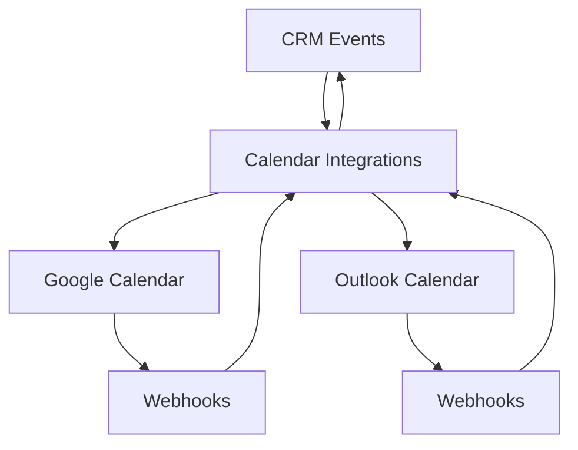

<Warning>
This document provides a deep technical dive into the calendar system architecture. The calendar integration is not a simple "push event to Google" feature—it's a distributed sync system with hostile external providers, eventual consistency, and complex state management.
</Warning>

## Executive Summary

The system operates on three calendar layers with distinct responsibilities and access patterns:

<CardGroup cols={3}>
  <Card title="CRM Calendar Feed" icon="calendar-days">
    Primary routes for personal, organization, and team calendar views
  </Card>
  <Card title="CRM Events" icon="calendar-check">
    Internal event source of truth with invitees and RSVP management
  </Card>
  <Card title="Calendar Integrations" icon="arrows-rotate">
    Google and Outlook drivers handling bidirectional sync
  </Card>
</CardGroup>

### Key API Routes

<AccordionGroup>
  <Accordion title="Personal Calendar Routes">
    - **`GET /v1/calendar/me`** - Personal workload (CRM tasks/subtasks + events + externals)
    - **`GET /v1/calendar/me/agenda`** - Merged agenda list with forward scan
    - **`GET /v1/calendar/me/agenda/timeline`** - CRM web agenda with day-window pagination
  </Accordion>

  <Accordion title="Organization Calendar Routes">
    - **`GET /v1/calendar/org`** - Organization stacked calendar for 1-10 members
    - Response format: `{ rosterUserIds, itemsByUserId }`
    - Excludes external items, shows CRM tasks/subtasks + events per subject
  </Accordion>

  <Accordion title="Team Calendar Routes">
    - **`GET /v1/calendar/teams/:teamId`** - Team-specific calendar view
    - Requires `team.admin`, `team_crm.*`, `team_sales.*`, or org admin/owner permissions
    - Authenticated user excluded from roster (use `/me` for self)
  </Accordion>
</AccordionGroup>

## Architecture Overview

<Note>
The intended model treats CRM events as the canonical business record, with external calendar copies serving as synchronized views that can update certain fields when changed externally.
</Note>

### Data Flow Model



**Sync Behavior:**
- **Creator calendar copies**: Can update CRM event details when changed externally
- **Invitee calendar copies**: Can update RSVP status only
- **External-only items**: Displayed read-only, not imported into CRM
- **Provider echoes**: Suppressed using change IDs, fingerprints, ETags, and time windows

## Main Files Structure

<Tabs>
  <Tab title="Calendar Integration">
    ```
    src/modules/integrations/calendar-integration/
    ├── calendar-integration.module.ts
    ├── calendar-integration.service.ts
    ├── event-calendar-sync.service.ts
    ├── calendar-webhook.service.ts
    ├── calendar-webhook.controller.ts
    └── calendar-watch-renewal.handler.ts
    ```
  </Tab>

  <Tab title="Provider Drivers">
    ```
    src/modules/integrations/calendar-integration/drivers/
    ├── calendar-driver.interface.ts
    ├── calendar-driver.registry.ts
    ├── google-calendar.driver.ts
    └── outlook-calendar.driver.ts
    ```
  </Tab>

  <Tab title="CRM Calendar">
    ```
    src/modules/crm/calendar/
    ├── calendar.service.ts
    ├── calendar-agenda.constants.ts
    ├── calendar-timeline.constants.ts
    ├── calendar-cache.service.ts
    └── calendar.dto.ts
    ```
  </Tab>
</Tabs>

## Personal Agenda Timeline

The **`GET /v1/calendar/me/agenda/timeline`** endpoint powers the CRM web agenda view with infinite scroll capabilities.

<Steps>
  <Step title="Request Processing">
    Requires **`Time-Zone`** header (IANA format). Invalid/missing values default to `UTC`.
  </Step>

  <Step title="Sorting Logic">
    - **Tasks**: Sorted by due date (`startDate` mirrors due)
    - **CRM Events & Externals**: Sorted by start time
    - **Tie-breaking**: Stable sort by source + ID
  </Step>

  <Step title="Probe Window">
    From anchor day, fetches merged window of `CALENDAR_TIMELINE_PROBE_LOOKAHEAD_DAYS` (default: 60 days)
  </Step>

  <Step title="Response Format">
    ```json
    {
      "window": {
        "fromDay": "2024-01-15",
        "toDay": "2024-02-14",
        "timeZone": "America/New_York"
      },
      "items": [...],
      "nextCursor": "base64_encoded_cursor",
      "hasMore": true
    }
    ```
  </Step>
</Steps>

<Info>
The legacy **`GET /v1/calendar/me/agenda`** endpoint remains available for callers that prefer a single forward scan without pagination.
</Info>

## Webhook Security

<Warning>
Webhook authenticity validation is critical for preventing malicious calendar manipulations.
</Warning>

### Google Calendar Webhooks

- **Verification Token**: Separate `watchChannelVerifyToken` (not the same as channel `id`)
- **Resource Validation**: Must match `X-Goog-Resource-Id` when `watchResourceId` is present
- **Channel Token**: Echoed as `X-Goog-Channel-Token` in notifications

### Outlook Calendar Webhooks  

- **Client State**: Must equal the integration UUID
- **JWT Validation**: Microsoft Graph `validationTokens` verified via JWKS
- **Audience Validation**: Uses `app.outlookCalendar.webhookValidationAudience`

```typescript
// Production webhook URL requirements
if (buildAppConfig().isProduction) {
  // Must be HTTPS and not localhost
  GOOGLE_CALENDAR_WEBHOOK_URL: "https://..."
  OUTLOOK_CALENDAR_WEBHOOK_URL: "https://..."
}
```

## OAuth State Security

Calendar OAuth flows use **`SignedPayloadService`** with HMAC-SHA256 for state token security:

<CodeGroup>
  ```typescript Token Structure
  // Format: v1.<base64url(envelope)>.<base64url(signature)>
  const stateToken = signedPayloadService.sign({
    purpose: 'calendar.oauth.state',
    payload: { userId, organizationId },
    ttl: CALENDAR_OAUTH_STATE_TTL_MS
  });
  ```

  ```typescript Verification
  const { payload } = await signedPayloadService.verify(
    stateToken, 
    'calendar.oauth.state'
  );
  // payload: { userId, organizationId }
  ```
</CodeGroup>

<Tip>
The service supports multiple purposes to prevent cross-feature token replay attacks.
</Tip>

## Database Schema

<AccordionGroup>
  <Accordion title="Calendar Integration Entity">
    ```sql
    calendar_integration
    ├── id (uuid, primary key)
    ├── user_id (uuid, foreign key)
    ├── organization_id (uuid, foreign key)  
    ├── provider ('google' | 'outlook')
    ├── provider_account_id (text)
    ├── access_token (text, encrypted)
    ├── refresh_token (text, encrypted)
    ├── expires_at (timestamptz)
    ├── watch_channel_* (webhook subscription data)
    └── sync_health_* (monitoring columns)
    ```
  </Accordion>

  <Accordion title="Calendar Event Mapping Entity">
    ```sql
    calendar_event_mapping
    ├── id (uuid, primary key)
    ├── calendar_integration_id (uuid, foreign key)
    ├── event_id (uuid, foreign key → events table)
    ├── provider_event_id (text)
    ├── ical_uid (text)
    ├── last_outbound_fingerprint (text)
    ├── echo_suppression_* (deduplication fields)
    └── timestamps
    ```
  </Accordion>

  <Accordion title="Calendar Sync Outbox">
    ```sql
    calendar_sync_outbox
    ├── id (uuid, primary key)
    ├── organization_id (uuid, RLS protected)
    ├── operation (text)
    ├── payload (jsonb)
    ├── idempotency_key (text)
    ├── status ('pending' | 'completed' | 'failed')
    └── retry_metadata (jsonb)
    ```
  </Accordion>
</AccordionGroup>

## MikroORM Maintenance

<Warning>
Keep `migrations/.snapshot-neondb.json` in sync with entity metadata to avoid migration conflicts.
</Warning>

<Steps>
  <Step title="Check Migration Status">
    ```bash
    npx mikro-orm migration:check
    ```
  </Step>

  <Step title="Handle Snapshot Drift">
    If `migration:check` reports large unrelated diffs:
    1. Apply all migrations to dev database
    2. Regenerate snapshot per MikroORM guidance
    3. Do NOT merge large unrelated table recreations
  </Step>

  <Step title="Create New Migrations">
    ```bash
    npx mikro-orm migration:create
    ```
  </Step>
</Steps>

## Event Access Control

Events use a multi-layered access control model:

<Tabs>
  <Tab title="Access Rights">
    **READ ACCESS**: Creator OR Invitee OR Org-calendar policy OR Team-calendar visibility
    
    **MODIFY/DELETE**: Creator only (with some exceptions for invitee RSVP updates)
  </Tab>

  <Tab title="Organization Policy">
    Uses same entity-type filters as `GET /v1/calendar/org`
    
    Applies to users with appropriate organization-level permissions
  </Tab>

  <Tab title="Team Visibility">
    Controlled by team membership and role-based permissions:
    - `team.admin`
    - `team_crm.*` 
    - `team_sales.*`
  </Tab>
</Tabs>

## Risk Assessment

<Warning>
The calendar system attempts to make two different providers behave like one coherent event bus, which is inherently fragile.
</Warning>

### High-Risk Areas

1. **In-memory caching** without persistence guarantees
2. **CRM-originated outbound sync** without durable queuing on listener path  
3. **Provider-specific edge cases**:
   - Recurring events handling
   - All-day event timezone issues
   - Deleted invitee synchronization
   - Outlook mailbox-local event ID conflicts

### Mitigation Strategies

- **Durable retry queues**: Outlook shadow mapping uses `calendar_sync_outbox` + pg-boss
- **RLS protection**: Calendar sync outbox is RLS-protected like other org tables
- **Echo suppression**: Multiple layers including change IDs, fingerprints, and ETags
- **Production URL validation**: Webhook endpoints must be HTTPS and non-localhost

<Check>
The system includes several good guardrails, but careful monitoring and testing of edge cases remains essential for production stability.
</Check>