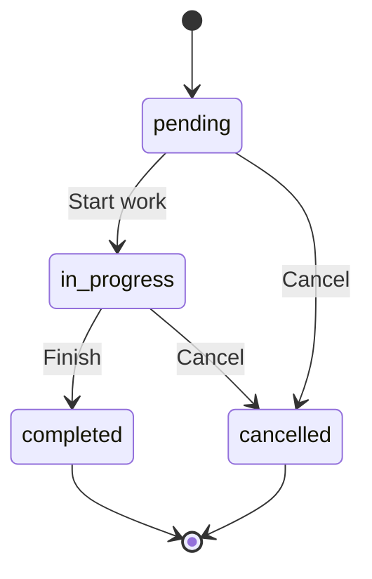

<Note>
**Vocabulary note**: This doc uses "stakeholder" because it describes the engineering subsystem (entity name, table, services). The **user-facing and AI-facing** terms are "Assignment" (the concept) and "Assignee" (the assigned user or team). See `Docs/STAKEHOLDER_SYSTEM.md` → "Vocabulary" for the full policy and which surfaces switched (modal copy, notification copy, audit timeline labels, AI tool descriptions, AI tool boundary JSON keys).
</Note>

<Note>
**Unified inbound lead capture**: Leads arriving from external sources (Property Finder, Bayut/dubizzle, and future Meta/website) are ingested through the source-agnostic `crm/lead-capture` module — `LeadCaptureService.capture()` reuses `PersonService`, `LeadService.createLeadInTransaction`/`findDuplicateLeadMatchInTransaction`, `EntityStakeholderService`, and the `DistributionEngine`. The lead-capture module owns the `CapturedLeadInput` contract, `LeadCaptureSourceRegistry` for adapter registration, org-default `LeadCaptureSettings`, the `CapturedLead` idempotency ledger, and the source-agnostic `lead-ingestion` pg-boss queue + `LeadIngestionWorker`. Full design: `Docs/LEAD_CAPTURE_SPECIFICATION.md`.
</Note>

The activity system serves as the central communication and interaction hub for the CRM module. It uses a lightweight `activity` table as a timeline index with full content stored in specialized channel tables, enabling efficient querying and flexible content storage patterns.

## Architecture overview

### Design principles

The activity system is built on core architectural principles that separate concerns and optimize for performance:

1. **Timeline indexing**: The `activity` table indexes all interactions without storing full content
2. **Channel separation**: Specialized tables (call_log, email_log, whatsapp, etc.) store detailed communication data
3. **Polymorphic targeting**: Activities link to any CRM entity (lead, deal, contact, company) via entity_type/entity_id
4. **Contact bubble-up**: Communication activities automatically surface on contact timelines for unified visibility
5. **Efficient querying**: Timeline queries use the activity index; full content loads on-demand via reference_id

### Activity integration patterns

```
PERSON (Identity Layer)
├── Central identity and preferences
├── person_channel (WhatsApp, Instagram, etc.)
├── person_email, person_phone, person_address
└── Links to: Lead, Contact, unit_ownership, site_visit
              │
              ▼
ACTIVITY (Timeline Index)
├── target_entity_type → 'lead' | 'deal' | 'contact' | 'company'
├── target_entity_id → UUID of target entity
├── contact_id (nullable) → for bubble-up aggregation
├── activity_type + reference_id → points to channel table
├── summary (for quick timeline display)
└── is_pinned, is_important
              │
              ▼ reference_id points to:
┌──────────┬──────────┬──────────┬──────────┬──────────┬──────────┬──────────┬──────────┐
│ call_log │ email_   │ sms_log  │ whatsapp │ meeting  │ site_    │ note     │ task     │
│          │ log      │          │          │          │ visit    │          │          │
│ Content  │ Content  │ Content  │ Content  │ Content  │ Content  │ Content  │ Content  │
│ ONLY     │ ONLY     │ ONLY     │ ONLY     │ ONLY     │ ONLY     │ ONLY     │ ONLY     │
│ (no FKs) │ (no FKs) │ (no FKs) │ (no FKs) │ (no FKs) │ (no FKs) │ (no FKs) │ (no FKs) │
└──────────┴──────────┴──────────┴──────────┴──────────┴──────────┴──────────┴──────────┘
```

<Info>
The CRM module uses **separation of concerns**: the `activity` table handles entity relationships and timeline ordering, while channel tables store communication-specific data. This enables efficient querying and flexible content storage patterns.
</Info>

## Activity table structure

The core activity table serves as a lightweight timeline index linking to detailed channel content:

```sql
activity
├── target_entity_type (lead | deal | contact | company)
├── target_entity_id (UUID)
├── contact_id (UUID, nullable) — for bubble-up visibility
├── activity_type (call, email, sms, whatsapp, meeting, site_visit, note, task, other)
├── reference_id → channel table record (nullable for note/task)
├── summary (text for quick display: "Called +1234567890 • 5 min • Connected")
├── is_pinned, is_important
├── performed_by_id, created_by_id, created_at
├── organization_id, is_deleted
```

<Tabs>
<Tab title="Activity types">
- **call**: Phone call logged in call_log table
- **email**: Email communication in email_log table
- **sms**: SMS message in sms_log table
- **whatsapp**: WhatsApp message in whatsapp table
- **meeting**: In-person or virtual meeting in meeting table
- **site_visit**: Property site visit (Real Estate module)
- **note**: Internal note in note table
- **task**: Action item in task table
- **other**: Custom activity types
</Tab>
<Tab title="Summary formatting">
The `summary` field provides quick context for timeline display:
- **Call**: "Called +1234567890 • 5 min • Connected"
- **Email**: "Email: Re: Property inquiry"
- **WhatsApp**: "WhatsApp: Sent property brochure"
- **Note**: Note title or truncated body text
- **Task**: Task title with due date if set
</Tab>
</Tabs>

## Contact bubble-up logic

The system automatically populates `contact_id` for communication bubble-up visibility, enabling contacts to show activities from related leads and deals:

```typescript
// Company → null (no bubble up)
if (targetType === "company") return null;

// Contact → use contact itself
if (targetType === "contact") return targetId;

// Lead → get from lead.person.contact (if qualified)
if (targetType === "lead") {
  const lead = await em.findOne(Lead, targetId, {
    populate: ["person.contact"],
  });
  return lead?.person?.contact?.id ?? null;
}

// Deal → require selectedContactId from UI for communication
// Deal → null for internal notes/tasks
if (targetType === "deal") {
  if (isCommunicationActivity(activityType)) {
    if (!selectedContactId) throw new BadRequestException("Contact required");
    return selectedContactId;
  }
  return null;
}
```

<Note>
**Deal communication context**: When creating communication activities on deals (calls, emails, WhatsApp), the UI must specify which deal participant (DealContact) the communication is with. Internal activities like notes and tasks don't require contact selection.
</Note>

## Communication channels

The activity system integrates with multiple communication channels, each storing detailed content in specialized tables:

<Tabs>
<Tab title="WhatsApp integration">
```sql
whatsapp
├── from_number, to_number
├── direction (inbound, outbound)
├── message_type (text, image, document, audio, video, location, contact)
├── content: text_body, media_url, caption, filename, mime_type
├── status (pending, sent, delivered, read, failed)
├── sent_at, delivered_at, read_at, failed_at
├── error_message, whatsapp_message_id
├── context: reply_to_message_id, conversation_context
├── organization_id, created_by_id, created_at
```

**WhatsApp workflow**:
<Steps>
<Step title="Message creation">
Create whatsapp record with message content and metadata.
</Step>
<Step title="Activity linking">
Create activity record with `activity_type='whatsapp'` and `reference_id` pointing to whatsapp record.
</Step>
<Step title="Status updates">
Update whatsapp.status as delivery receipts arrive (sent, delivered, read).
</Step>
<Step title="Timeline display">
Activity summary shows message preview and status for quick scanning.
</Step>
</Steps>
</Tab>

<Tab title="Email communication">
```sql
email_log
├── from_email, to_emails[], cc[], bcc[]
├── subject, body_html, body_plain
├── attachments[]
├── direction, status
├── Tracking: opened_at, opened_count, clicked_at, replied_at, bounced_at
├── Threading: thread_id, in_reply_to, message_id
├── Integration: email_integration_id, provider
├── organization_id, created_by_id, created_at
```

**Email tracking features**:
- Open tracking with timestamp and count
- Click tracking for embedded links
- Thread management for conversation context
- Bounce detection and handling
- Multiple recipient support (to, cc, bcc)
</Tab>

<Tab title="Voice calls">
```sql
call_log
├── phone_number
├── direction (inbound, outbound)
├── status (answered, no_answer, busy, voicemail, failed)
├── outcome (connected, no_answer, voicemail, busy, wrong_number, callback_requested)
├── duration_seconds
├── recording_url, recording_duration_seconds
├── notes, call_purpose
├── organization_id, created_by_id, created_at
```

**Call outcomes**:
- **connected**: Successful conversation with contact
- **no_answer**: Phone rang but not picked up
- **voicemail**: Left message in voicemail
- **busy**: Contact's line was busy
- **wrong_number**: Invalid or incorrect phone number
- **callback_requested**: Contact requested callback
</Tab>

<Tab title="SMS messaging">
```sql
sms_log
├── from_number, to_number
├── direction (inbound, outbound)
├── message_body
├── status (pending, sent, delivered, failed, undelivered)
├── sent_at, delivered_at, failed_at
├── error_message, sms_message_id
├── segment_count, encoding
├── organization_id, created_by_id, created_at
```
</Tab>
</Tabs>

## Notes system

Notes are activities with `type='note'` that store internal team information within the polymorphic activity framework.

### Notes architecture

```sql
note
├── title (optional)
├── body (text content)
├── attachments[] (JSONB array: {url, filename, size, mimeType})
├── is_pinned
├── is_private
├── organization_id, created_by_id, created_at
```

### Creating notes

<Steps>
<Step title="Create note content">
Create a `note` record with title, body, and attachments. This table stores content only with no entity foreign keys.
</Step>

<Step title="Create activity link">
Create an `activity` record linking the note to its target entity:
```sql
activity:
├── target_entity_type: 'lead' | 'deal' | 'contact' | 'company'
├── target_entity_id: target-uuid
├── contact_id: null (internal type - no bubble up from Lead/Deal)
├── activity_type: 'note'
├── reference_id: note-uuid
├── summary: note.title || truncate(note.body, 100)
```
</Step>

<Step title="Timeline display">
Notes appear in entity timelines with summary text. Full content loads on-demand via `reference_id`.
</Step>
</Steps>

### Note privacy and access control

<AccordionGroup>
<Accordion title="Privacy levels">
- **Organization-wide notes**: Default visibility to all organization members
- **Private notes**: `is_private = true` - only visible to creator and admin users
- **Team notes**: Visibility controlled by entity stakeholder permissions
- **Role-based access**: Notes respect user role limitations for sensitive information
</Accordion>

<Accordion title="Note management features">
- **Rich text formatting**: Support for formatted content and inline media
- **File attachments**: Multiple file types with size and virus scanning
- **Note templates**: Common note formats for consistent documentation
- **Search and tagging**: Full-text search across note content with tag support
- **Version history**: Track edits and changes for audit purposes
</Accordion>
</AccordionGroup>

## Tasks system

Tasks are activities with `type='task'` representing action items and follow-ups within the unified activity framework.

```sql
task
├── title (required)
├── description (optional text)
├── status (pending, in_progress, completed, cancelled)
├── priority (low, medium, high, urgent)
├── due_date (nullable)
├── assigned_to_id → User (who should complete the task)
├── completed_at, completed_by_id
├── attachments[] (JSONB array: {url, filename, size, mimeType})
├── organization_id, created_by_id, created_at
```

<Tabs>
<Tab title="Task workflow">
<Steps>
<Step title="Task creation">
Create task record with title, description, priority, and optional due date.
</Step>

<Step title="Assignment">
Assign task to specific user via `assigned_to_id`. User receives notification.
</Step>

<Step title="Progress tracking">
Update task status as work progresses: pending → in_progress → completed.
</Step>

<Step title="Completion">
Mark completed with `completed_at` timestamp and `completed_by_id` user reference.
</Step>
</Steps>
</Tab>

<Tab title="Task status flow">

</Tab>

<Tab title="Task priorities">
- **low**: Can be completed when time permits
- **medium**: Should be completed soon (default)
- **high**: Important, complete within 1-2 days
- **urgent**: Critical, complete immediately
</Tab>
</Tabs>

<Warning>
**Task assignment**: Tasks must be assigned to users who have access to the parent entity. The system validates that `assigned_to_id` is an active organization member with appropriate permissions.
</Warning>

## Query patterns

### Core timeline queries

<Tabs>
<Tab title="Entity activity timeline">
```sql
-- Optimized entity timeline with channel content
SELECT 
  a.id, a.activity_type, a.summary, a.created_at, a.is_pinned,
  CASE a.activity_type
    WHEN 'call' THEN json_build_object(
      'phone_number', cl.phone_number,
      'direction', cl.direction,
      'outcome', cl.outcome,
      'duration', cl.duration_seconds
    )
    WHEN 'email' THEN json_build_object(
      'subject', el.subject,
      'from_email', el.from_email,
      'to_emails', el.to_emails
    )
    WHEN 'note' THEN json_build_object(
      'title', n.title,
      'body', LEFT(n.body, 200)
    )
  END as channel_preview
FROM activity a
LEFT JOIN call_log cl ON a.activity_type = 'call' AND a.reference_id = cl.id
LEFT JOIN email_log el ON a.activity_type = 'email' AND a.reference_id = el.id  
LEFT JOIN note n ON a.activity_type = 'note' AND a.reference_id = n.id
WHERE a.target_entity_type = :entityType 
  AND a.target_entity_id = :entityId
  AND a.is_deleted = false
ORDER BY a.is_pinned DESC, a.created_at DESC
LIMIT 50;
```
</Tab>

<Tab title="Contact bubble-up timeline">
```sql
-- Contact timeline with source entity context
SELECT 
  a.id, a.activity_type, a.summary, a.created_at,
  a.target_entity_type as source_type,
  a.target_entity_id as source_id,
  CASE a.target_entity_type
    WHEN 'lead' THEN l.title
    WHEN 'deal' THEN d.title
  END as source_title
FROM activity a
LEFT JOIN lead l ON a.target_entity_type = 'lead' AND a.target_entity_id = l.id
LEFT JOIN deal d ON a.target_entity_type = 'deal' AND a.target_entity_id = d.id
WHERE a.contact_id = :contactId
  AND a.is_deleted = false
ORDER BY a.is_pinned DESC, a.created_at DESC;
```
</Tab>

<Tab title="User activity dashboard">
```sql
-- User's recent activities across all entities
SELECT 
  a.id, a.activity_type, a.summary, a.created_at,
  a.target_entity_type, a.target_entity_id,
  CASE a.target_entity_type
    WHEN 'lead' THEN l.title
    WHEN 'deal' THEN d.title
    WHEN 'contact' THEN p.full_name
    WHEN 'company' THEN c.name
  END as entity_name
FROM activity a
LEFT JOIN lead l ON a.target_entity_type = 'lead' AND a.target_entity_id = l.id
LEFT JOIN deal d ON a.target_entity_type = 'deal' AND a.target_entity_id = d.id
LEFT JOIN contact co ON a.target_entity_type = 'contact' AND a.target_entity_id = co.id
LEFT JOIN person p ON co.person_id = p.id
LEFT JOIN company c ON a.target_entity_type = 'company' AND a.target_entity_id = c.id
WHERE a.created_by_id = :userId
  AND a.organization_id = :orgId
  AND a.is_deleted = false
  AND a.created_at >= CURRENT_DATE - INTERVAL '30 days'
ORDER BY a.created_at DESC
LIMIT 100;
```
</Tab>

<Tab title="Task queries">
```sql
-- User's pending and overdue tasks
SELECT 
  t.id, t.title, t.status, t.priority, t.due_date,
  a.target_entity_type, a.target_entity_id,
  CASE 
    WHEN t.due_date < CURRENT_DATE THEN 'overdue'
    WHEN t.due_date = CURRENT_DATE THEN 'due_today'
    WHEN t.due_date <= CURRENT_DATE + INTERVAL '7 days' THEN 'due_soon'
    ELSE 'on_track'
  END as urgency
FROM task t
JOIN activity a ON a.activity_type = 'task' AND a.reference_id = t.id
WHERE t.assigned_to_id = :userId
  AND t.status IN ('pending', 'in_progress')
  AND t.organization_id = :orgId
ORDER BY 
  CASE urgency
    WHEN 'overdue' THEN 1
    WHEN 'due_today' THEN 2
    WHEN 'due_soon' THEN 3
    ELSE 4
  END,
  t.priority DESC,
  t.due_date ASC;
```
</Tab>
</Tabs>

## Business rules

### Activity creation validation

<AccordionGroup>
<Accordion title="Entity and permission validation">
**Target entity validation**:
```typescript
// Validate target entity exists and is accessible
const targetEntity = await validateTargetEntity(targetEntityType, targetEntityId);
if (!targetEntity) {
  throw new NotFoundException(`${targetEntityType} not found`);
}

// Check user permissions for target entity
const hasPermission = await checkEntityPermission(user, targetEntityType, targetEntityId, 'write');
if (!hasPermission) {
  throw new ForbiddenException('Insufficient permissions');
}

// Validate entity is not archived
if (targetEntity.is_archived) {
  throw new BadRequestException('Cannot create activities for archived entities');
}
```
</Accordion>

<Accordion title="Communication preferences">
**Person preference enforcement**:
```typescript
// Check person-level communication preferences before activity creation
const person = await getPersonWithPreferences(personId);

// Enforce do_not_call preference
if (activityType === 'call' && person.do_not_call) {
  throw new BadRequestException('Person has requested no phone calls');
}

// Enforce do_not_email preference  
if (activityType === 'email' && person.do_not_email) {
  throw new BadRequestException('Person has requested no emails');
}
```
</Accordion>

<Accordion title="Channel validation">
**Communication channel requirements**:
- WhatsApp activities require valid `person_channel` with `channel_type='whatsapp'`
- Email activities require valid `person_email` address
- Call activities require valid `person_phone` number
- SMS activities require valid mobile `person_phone` number
- All channel identifiers must be active and not blocked
</Accordion>
</AccordionGroup>

### Data integrity rules

| Rule Category | Validation Logic |
| ------------- | ---------------- |
| **Referential integrity** | activity.reference_id must exist in matching channel table |
| **Entity consistency** | target_entity_id must exist and belong to specified type |
| **User validation** | All user_id fields must reference active organization users |
| **Contact validity** | contact_id must be valid Contact when specified |
| **Channel matching** | activity.activity_type must match referenced channel table |
| **Organization scope** | All related records must share organization_id |

## Activity lifecycle events

The activity system publishes events for integration with other modules and external systems:

```typescript
// Activity creation events
{
  "event": "activity.created",
  "data": {
    "activity_id": "uuid",
    "activity_type": "call",
    "target_entity_type": "lead",
    "target_entity_id": "uuid", 
    "contact_id": "uuid", // for bubble-up
    "created_by_id": "uuid",
    "organization_id": "uuid",
    "channel_data": {
      "phone_number": "+1234567890",
      "outcome": "connected",
      "duration_seconds": 300
    }
  }
}

// Activity updated events
{
  "event": "activity.updated",
  "data": {
    "activity_id": "uuid",
    "changes": {
      "is_pinned": true,
      "summary": "Updated summary text"
    },
    "updated_by_id": "uuid"
  }
}

// Task completion events
{
  "event": "task.completed",
  "data": {
    "task_id": "uuid",
    "activity_id": "uuid",
    "completed_by_id": "uuid",
    "completed_at": "2024-01-15T10:30:00Z",
    "target_entity_type": "deal",
    "target_entity_id": "uuid"
  }
}
```

## Data consistency guarantees

### Transaction boundaries

<AccordionGroup>
<Accordion title="Activity creation transactions">
**Atomic activity + channel creation**:
```typescript
// All activity creation must be atomic across activity + channel tables
await database.transaction(async (tx) => {
  // 1. Create channel record (call_log, email_log, etc.)
  const channelRecord = await tx.insert(channelTable, channelData);
  
  // 2. Create activity linking record
  const activity = await tx.insert('activity', {
    target_entity_type: entityType,
    target_entity_id: entityId,
    activity_type: type,
    reference_id: channelRecord.id,
    contact_id: resolvedContactId, // computed via bubble-up logic
    summary: generateSummary(channelData),
    created_by_id: userId,
    organization_id: orgId
  });
  
  // 3. Update entity engagement scores
  await updateEntityEngagement(tx, entityType, entityId);
  
  return { activity, channelRecord };
});
```
</Accordion>

<Accordion title="Referential integrity">
**Channel reference validation**:
- The `reference_id` must exist in the corresponding channel table before activity creation
- Orphaned activities are prevented through database foreign key constraints
- Cascade delete rules ensure channel content removal also removes activity records
- Soft delete on activities preserves channel data for audit trails
</Accordion>

<Accordion title="Cross-module consistency">
**Real Estate integration**:
- Site visit activities maintain consistency with property availability
- Lead property interest changes trigger related activity updates
- Unit ownership transfers may affect related activity visibility

**Marketing module integration**:
- Campaign attribution maintained across lead conversion to contact
- Activity source tracking preserved through entity lifecycle
- Marketing opt-out preferences synchronized with communication activities
</Accordion>
</AccordionGroup>

## Performance optimizations

### Database indexes

**Primary indexes for timeline queries**:
```sql
-- Core timeline performance
CREATE INDEX idx_activity_entity_timeline 
ON activity (target_entity_type, target_entity_id, created_at DESC);

-- Contact bubble-up performance  
CREATE INDEX idx_activity_contact_bubble_up
ON activity (contact_id, created_at DESC) 
WHERE contact_id IS NOT NULL;

-- Activity type filtering
CREATE INDEX idx_activity_type_org
ON activity (organization_id, activity_type, created_at DESC)
WHERE is_deleted = false;

-- User activity dashboard
CREATE INDEX idx_activity_created_by
ON activity (created_by_id, created_at DESC)
WHERE is_deleted = false;

-- Task assignment queries
CREATE INDEX idx_task_assigned_status
ON task (assigned_to_id, status, due_date);
```

### Caching strategies

<Tabs>
<Tab title="Timeline caching">
```typescript
// Cache recent entity timelines
const cacheKey = `timeline:${entityType}:${entityId}:page:1`;
const timeline = await redis.get(cacheKey);
if (!timeline) {
  const fresh = await getEntityTimeline(entityType, entityId, 1);
  await redis.setex(cacheKey, 300, JSON.stringify(fresh)); // 5 min cache
  return fresh;
}
```

**Cache invalidation**:
- Invalidate on new activity creation for target entity
- Invalidate on activity update (pin, summary change)
- Invalidate on activity deletion
- Preserve pagination cache across pages
</Tab>

<Tab title="Activity count caching">
```typescript
// Cache activity counts per entity
const countKey = `activity:count:${entityType}:${entityId}`;
const count = await redis.get(countKey);
if (!count) {
  const fresh = await getActivityCount(entityType, entityId);
  await redis.setex(countKey, 600, fresh.toString()); // 10 min cache
  return fresh;
}
```
</Tab>

<Tab title="User task caching">
```typescript
// Cache user's pending task list
const taskKey = `tasks:pending:${userId}`;
const tasks = await redis.get(taskKey);
if (!tasks) {
  const fresh = await getUserPendingTasks(userId);
  await redis.setex(taskKey, 180, JSON.stringify(fresh)); // 3 min cache
  return fresh;
}
```
</Tab>
</Tabs>

## AI module integration

The CRM activity system integrates with the AI module for automated conversation handling and workflow triggers:

<Tabs>
<Tab title="Conversation automation">
- **AI agents** can respond to messaging conversations through WhatsApp, Instagram, and other channels
- **CRM context** is provided to AI agents for personalized responses based on lead/contact history
- **Activity logging**: All AI interactions create activity records for audit trails
- **Human handoff**: AI agents can transfer conversations to users or teams through configured actions
</Tab>

<Tab title="Lead source tracking">
- **sourceConversation**: Leads include reference to originating messaging conversation
- **Context resolution**: CRM workflows can trace back to the original conversation context
- **Attribution**: AI-captured leads properly attribute to conversation source
- **Automation triggers**: Downstream workflows access conversation context for personalized follow-up
</Tab>

<Tab title="CRM tool execution">
- **Data search**: AI actions can query CRM entities through the tool catalog
- **Field updates**: Contact fields can be updated through AI tool execution
- **Stage changes**: Lead lifecycle stages can be progressed through AI actions
- **Service integration**: AI tools invoke CRM services with proper validation and permissions
</Tab>

<Tab title="Workflow integration">
- **AI_AGENT steps**: Workflows can enable AI handling at specific stages
- **Trigger workflows**: AI agents can deliberately start child workflows through the `trigger_workflow` action
- **Bidirectional flow**: Seamless handoff between automated AI handling and workflow-driven processes
- **Context preservation**: Workflow state and AI conversation state remain synchronized
</Tab>
</Tabs>

<Note>
The AI module owns agent configuration, runtime execution, queueing, LLM integration, security controls, and activity logging. The CRM module owns business entities, lifecycle rules, and validation logic. This separation of concerns enables flexible automation while maintaining data integrity.
</Note>

## Real estate integration

Real Estate module entities integrate with the activity system for property-related interactions:

<Tabs>
<Tab title="Site visit activities">
```sql
site_visit
├── person_id → Person (who visited)
├── unit_id → Unit (what they visited)
├── visit_date, duration_minutes
├── feedback_rating, feedback_notes
├── attended_by_id → User (agent who showed property)
├── organization_id, created_at
```

Site visits automatically create activity records with `activity_type='site_visit'` linking to the person's lead or contact.
</Tab>

<Tab title="Property interest tracking">
```sql
lead_property_interest
├── lead_id → Lead
├── unit_id or off_plan_unit_id
├── interest_level (low, medium, high, very_high)
├── notes, created_at

deal_property_interest
├── deal_id → Deal
├── unit_id or off_plan_unit_id
├── originating_interest → LeadPropertyInterest (nullable)
├── notes, created_at
```

Property interest changes trigger activity creation for audit trails and timeline visibility.
</Tab>
</Tabs>

<Note>
Lead property interests remain readable when a lead is archived. Archived leads are read-only, but the CRM lead detail/property-interest endpoint must bypass the Lead `active` filter for the parent lead check so historical property interest context stays visible.
</Note>