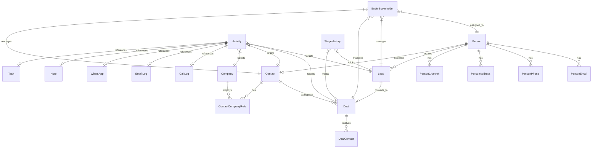

The CRM module provides a comprehensive customer relationship management system built on a Person + Contact architecture. This specification covers the complete module including activity systems, assignment workflows, transfer mechanisms, notes management, stage tracking, and business rules.

## Architecture overview

### Design principles

1. **Person + Contact Model**:
   - `Person` is the hidden identity layer (single source of truth for personal details)
   - `Contact` is the business relationship layer (qualified customers)
   - `Lead` is the sales opportunity layer (unqualified inquiries)
   - `Deal` links to `Contact`, not `Person` directly
2. **Unified Stakeholder Model**: Single table for assignment and commission across leads/deals
3. **Polymorphic Patterns**: Notes, tags, and activities use entity_type/entity_id patterns
4. **Channel Separation**: Activity table indexes timeline; channel tables store full data
5. **Modular Design**: CRM core is independent; Real Estate, Marketing, Channels are optional modules
6. **Company via Contact**: Companies associate with `Contact` via `ContactCompanyRole` (not Person)

### Module boundaries

```
┌─────────────────────────────────────────────────────────────────┐
│                         CRM CORE                                │
│  Person, Lead, Contact, Company, Deal, DealContact             │
│  person_email, person_phone, person_address, person_channel    │
│  person_not_duplicate, contact_company_role                    │
│  entity_stakeholder, entity_transfer, commission_payment       │
│  activity, note, task, tag                                     │
└─────────────────────────────────────────────────────────────────┘
        │                    │                    │
        ▼                    ▼                    ▼
┌──────────────┐    ┌──────────────┐    ┌──────────────┐
│ REAL ESTATE  │    │  MARKETING   │    │   CHANNELS   │
│ development  │    │  campaign    │    │  whatsapp    │
│ unit         │    │  campaign_   │    │  instagram   │
│ site_visit   │    │  lead        │    │  (linked via │
│ lead_property│    │              │    │  person_     │
│ _interest    │    │              │    │  channel)    │
│ unit_owner-  │    │              │    │              │
│ ship→Person  │    │              │    │              │
└──────────────┘    └──────────────┘    └──────────────┘
```

<Info>
The CRM module uses **separation of concerns**: the `activity` table handles entity relationships and timeline ordering, while channel tables store communication-specific data. This enables efficient querying and flexible content storage patterns.
</Info>

### Real Estate → CRM integration

Real Estate entities link to **Person** (not Contact) for identity:

| Real Estate Entity       | Links To    | Rationale                                   |
| ------------------------ | ----------- | ------------------------------------------- |
| `unit_ownership`         | `person_id` | Ownership is about identity, not CRM status |
| `unit_transaction`       | `person_id` | Transaction party is an individual          |
| `site_visit`             | `person_id` | Who visited the property                    |
| `lead_property_interest` | `lead_id`   | Links to Lead for sales context             |
| `deal_property_interest` | `deal_id`   | Links to Deal for transaction context       |

**Deal Property Interest Workflow**:

```
// Deal created FROM Lead:
// Copy primary LeadPropertyInterest → DealPropertyInterest (1:1)
deal.propertyInterest.originatingInterest = leadPropertyInterest

// Deal created directly (walk-in):
// Create DealPropertyInterest with no originating interest
deal.propertyInterest.originatingInterest = null
```

**Access Pattern for Contact**:

```
// Contact page showing ownership
contact.person.unitOwnerships  // All ownerships
contact.person.unitOwnerships.filter(o => o.isActive)  // Current
```

## Core entities

### Person (central identity)

**Purpose**: Single source of truth for human identity and preferences.

```
Person
├── Identity: first_name, last_name, avatar_url, title
├── Demographics: date_of_birth, nationality
├── Social: website, linkedin_url, twitter_url
├── Preferences: preferred_contact_method, timezone
├── Languages: languages (unified array with code and proficiency per entry)
├── Communication Flags: do_not_call, do_not_email
├── Source Tracking: original_source
├── Merge Tracking: merged_into_id, merged_at, merged_by
├── Computed: full_name (getter: first_name + last_name)
└── Related Tables:
    ├── person_email (multiple emails, one primary)
    ├── person_phone (multiple phones, one primary)
    ├── person_address (multiple addresses, one primary)
    ├── person_channel (WhatsApp, Instagram, etc. identities)
    └── person_not_duplicate (deduplication override pairs)
```

**Key Rules**:
- Every Lead, Contact must link to a Person
- Person preferences apply across all contexts (leads, deals, contacts)
- `nationality` is stored on Person so leads and contacts share the same identity profile value
- `original_source` is set once when person first enters system
- Languages array uses unified `UserLanguageEntry` format with code and proficiency per entry

### PersonChannel (communication channels)

**Purpose**: Stores a person's communication channel identities (WhatsApp, Instagram, etc.).

```
person_channel
├── person_id → Person
├── channel_type (whatsapp, instagram, facebook, telegram, sms, webchat)
├── channel_identifier (phone number, username, PSID, etc.)
├── display_name, avatar_url
├── channel_identity_id → WhatsAppUser.id, InstagramUser.id, etc.
├── status (active, inactive, blocked, unsubscribed)
├── is_primary
├── Opt-in: marketing_opt_in, transactional_opt_in
├── Engagement: first_contact_at, last_message_at, message_count
└── Verification: is_verified, verified_at
```

**Key Rules**:
- Similar pattern to `person_email`, `person_phone`, `person_address`
- Channel belongs to Person, not Lead (Person-centric architecture)
- Lead can reference `source_channel_id` for attribution (which channel it came through)
- `channel_identity_id` links to detailed channel entities (WhatsAppUser, InstagramUser)
- One Person can have multiple channels of same type (e.g., multiple WhatsApp numbers)

### PersonNotDuplicate (deduplication overrides)

**Purpose**: Records pairs of persons that have been manually confirmed as NOT duplicates. Prevents the deduplication system from repeatedly flagging the same pair.

```
person_not_duplicate
├── person1_id → Person
├── person2_id → Person
├── marked_by → User (who made the decision)
├── marked_at (when the decision was made)
├── organization_id → Organization
├── Unique constraint: (person1, person2, organization)
```

**Key Rules**:
- Symmetric: if (A, B) is marked as not-duplicate, the system treats (B, A) equivalently
- Organization-scoped: each org maintains its own override decisions
- Used by `PersonNotDuplicateService` to exclude pairs from duplicate detection

<Note>
The PersonNotDuplicate system prevents the same person pairs from being repeatedly flagged as potential duplicates, improving user experience and reducing duplicate review fatigue.
</Note>

### Person merge system

**Purpose**: Consolidates duplicate persons into a single primary record, reassigning all related data.

**API Endpoint**: `POST /persons/:primaryPersonId/merge`

**Merge Workflow**:

<Steps>
<Step title="Validation">
Verify primary person exists and is not deleted. Verify all secondary persons exist and are not deleted. All persons must be in the same organization.
</Step>
<Step title="Field selection">
Accept fieldSelections: `Record<string, string>` (e.g., `{ "firstName": "primary", "lastName": "person-B-id" }`). For each field, pick the value from the specified source person. Fields not listed default to primary person's values.
</Step>
<Step title="Contact info merge">
Reassign all secondary emails, phones, addresses, and channels to the primary person with opt-in per type (mergeAllEmails: boolean).
</Step>
<Step title="Entity reassignment">
Update all related entities (leads, contacts, activities, etc.) to point to the primary person.
</Step>
<Step title="Cleanup">
Soft-delete secondary persons by setting `merged_into_id`, `merged_at`, and `merged_by` fields.
</Step>
</Steps>

### Lead entity

**Purpose**: Represents unqualified sales opportunities in early stages of the sales process.

```
Lead
├── person_id → Person (required)
├── title, description
├── current_stage (inquiry, contacted, qualified, proposal, closed_won, closed_lost)
├── source (website, referral, marketing, cold_call, walk_in)
├── source_channel_id → PersonChannel (attribution)
├── priority (low, medium, high, critical)
├── budget_min, budget_max, budget_currency
├── lead_score (computed)
├── is_qualified
├── qualified_at, qualified_by_id
├── organization_id
└── Timestamps: created_at, updated_at
```

**Key Rules**:
- Every Lead must link to exactly one Person
- Lead qualification promotes to Contact (person.contact_id is set)
- Lead can convert to Deal if person has Contact
- Stage progression triggers automatic score recalculation

### Contact entity

**Purpose**: Represents qualified business relationships with persons who are potential or active customers.

```
Contact
├── person_id → Person (required, unique)
├── contact_status (active, inactive, dormant, blacklisted)
├── customer_type (prospect, customer, former_customer, partner)
├── lifecycle_stage (lead, opportunity, customer, champion, other)
├── lead_source (inherited from originating Lead)
├── first_contact_date
├── last_interaction_date
├── total_deal_value, deal_count
├── satisfaction_score, health_score
├── tags[] (JSONB array)
├── organization_id
└── Timestamps: created_at, updated_at
```

**Key Rules**:
- Contact has 1:1 relationship with Person (person.contact_id)
- Created when Lead is qualified or person enters as qualified prospect
- Deals always link to Contact, not Lead directly
- Aggregated metrics updated via trigger functions

### Company entity

**Purpose**: Represents business entities that employ or are associated with contacts.

```
Company
├── name (required)
├── legal_name, trading_name
├── company_type (corporation, llc, partnership, sole_proprietorship, nonprofit)
├── industry, sub_industry
├── size (startup, small, medium, large, enterprise)
├── revenue_range, employee_count
├── website, linkedin_url
├── registration_number, tax_id
├── description, notes
├── logo_url
├── is_customer, is_partner, is_competitor
├── organization_id
└── Timestamps: created_at, updated_at
```

**Key Rules**:
- Companies link to Contacts via `ContactCompanyRole` (not to Person directly)
- Multiple contacts can be associated with same company in different roles
- Company information is organization-scoped

### Deal entity

**Purpose**: Represents active sales opportunities with qualified contacts.

```
Deal
├── contact_id → Contact (required)
├── originating_lead_id → Lead (nullable, for attribution)
├── title, description
├── current_stage (discovery, qualification, proposal, negotiation, closed_won, closed_lost)
├── deal_value, currency
├── probability_percent
├── expected_close_date, actual_close_date
├── close_reason, loss_reason
├── deal_source (lead_conversion, referral, existing_customer)
├── commission_rate (percentage)
├── is_archived
├── organization_id
└── Timestamps: created_at, updated_at
```

**Key Rules**:
- Deals always link to Contact, establishing clear business relationship
- `originating_lead_id` provides attribution when Deal created from Lead conversion
- Deal stakeholders inherit from Lead stakeholders during conversion
- Stage progression affects probability and forecast calculations

## Assignment and commission system

### Entity stakeholder model

**Purpose**: Unified assignment and commission tracking across all CRM entities.

```
entity_stakeholder
├── entity_type (lead | deal | contact | company)
├── entity_id → target entity UUID
├── person_id → Person (stakeholder)
├── role (primary_agent, co_agent, team_lead, closer, processor, admin)
├── assignment_percentage, commission_percentage
├── assignment_type (manual, auto_assignment, transfer, lead_conversion)
├── assigned_at, assigned_by_id
├── is_active
├── organization_id
```

<Tabs>
<Tab title="Assignment types">
- **manual**: Direct assignment by manager or admin
- **auto_assignment**: System-driven based on rules (territory, round-robin, load balancing)
- **transfer**: Result of entity transfer between users
- **lead_conversion**: Lead stakeholders automatically become Deal stakeholders
</Tab>
<Tab title="Stakeholder roles">
- **primary_agent**: Main responsible person, highest commission
- **co_agent**: Secondary agent, shared responsibility and commission
- **team_lead**: Supervisory role with override permissions
- **closer**: Specialist for deal closing phases
- **processor**: Administrative support for deal completion
- **admin**: Full access without commission entitlement
</Tab>
</Tabs>

### Commission calculation

**Commission Payment Architecture**:

```
commission_payment
├── entity_type, entity_id → source entity
├── person_id → Person receiving commission
├── commission_percentage
├── basis_amount (deal value, fee, etc.)
├── calculated_amount
├── payment_status (pending, approved, paid, disputed)
├── payment_date, payment_reference
├── calculation_notes
├── organization_id
```

**Calculation Rules**:

<AccordionGroup>
<Accordion title="Deal commission calculation">
```typescript
// Commission split across multiple stakeholders
async function calculateDealCommission(dealId: string) {
  const deal = await getDeal(dealId);
  const stakeholders = await getEntityStakeholders('deal', dealId);
  
  const totalCommissionBasis = deal.final_price * deal.commission_rate;
  
  for (const stakeholder of stakeholders) {
    const commissionAmount = totalCommissionBasis * (stakeholder.commission_percentage / 100);
    
    await createCommissionPayment({
      entity_type: 'deal',
      entity_id: dealId,
      person_id: stakeholder.person_id,
      commission_percentage: stakeholder.commission_percentage,
      basis_amount: totalCommissionBasis,
      calculated_amount: commissionAmount,
      payment_status: 'pending'
    });
  }
}
```
</Accordion>

<Accordion title="Lead conversion commission">
When leads convert to deals, lead stakeholders automatically become deal stakeholders with preserved commission percentages:

```typescript
async function convertLeadToDeal(leadId: string, dealData: any) {
  await database.transaction(async (tx) => {
    // Create deal
    const deal = await tx.insert('deal', {
      ...dealData,
      originating_lead_id: leadId
    });
    
    // Copy lead stakeholders to deal
    const leadStakeholders = await getEntityStakeholders('lead', leadId);
    for (const stakeholder of leadStakeholders) {
      await tx.insert('entity_stakeholder', {
        entity_type: 'deal',
        entity_id: deal.id,
        person_id: stakeholder.person_id,
        role: stakeholder.role,
        commission_percentage: stakeholder.commission_percentage,
        assignment_type: 'lead_conversion',
        assigned_at: new Date(),
        assigned_by_id: stakeholder.assigned_by_id
      });
    }
  });
}
```
</Accordion>
</AccordionGroup>

## Transfer system

### Entity transfer workflow

**Purpose**: Manages ownership and assignment changes for leads, deals, contacts, and companies.

```
entity_transfer
├── entity_type, entity_id → target entity
├── from_user_id, to_user_id → transfer parties
├── transfer_reason (lead_routing, deal_assignment, territory_change, workload_balance)
├── transfer_status (pending, accepted, rejected, completed)
├── transfer_notes, acceptance_notes
├── transferred_at, accepted_at
├── organization_id
```

### Transfer process

<Steps>
<Step title="Transfer initiation">
Manager or admin initiates transfer with reason and target user. System validates permissions and creates pending transfer record.
</Step>
<Step title="Stakeholder notification">
System notifies target user of pending transfer. Source user receives transfer notification. All existing stakeholders are informed of pending change.
</Step>
<Step title="Transfer acceptance">
Target user accepts or rejects transfer within specified timeframe. Rejection returns entity to original user with notes.
</Step>
<Step title="Stakeholder updates">
Upon acceptance, system updates entity_stakeholder records:
```typescript
// Replace primary stakeholder
await updateEntityStakeholder({
  entity_type: transferType,
  entity_id: transferEntityId,
  old_person_id: fromUserId,
  new_person_id: toUserId,
  role: 'primary_agent',
  assignment_type: 'transfer'
});
```
</Step>
<Step title="Activity and data transfer">
Activities remain with original timeline but new activities created by new owner. Notes and tasks transfer with appropriate visibility. Commission percentages may be renegotiated.
</Step>
</Steps>

<Warning>
**Transfer Impact**: Historical activities remain visible to original stakeholders with proper permissions. New activities are created by the new owner after transfer completion.
</Warning>

## Activity and communication system

The activity system serves as the central communication and interaction hub, using a lightweight `activity` table as a timeline index with full content stored in specialized channel tables.

### Activity table structure

```sql
activity
├── target_entity_type (lead | deal | contact | company)
├── target_entity_id (UUID)
├── contact_id (UUID, nullable) — for bubble-up visibility
├── activity_type (call, email, sms, whatsapp, meeting, site_visit, note, task, other)
├── reference_id → channel table record (nullable for note/task)
├── summary (text for quick display: "Called +1234567890 • 5 min • Connected")
├── is_pinned, is_important
├── performed_by_id, created_by_id, created_at
├── organization_id, is_deleted
```

### Activity integration patterns

```
PERSON (Identity Layer)
├── Central identity and preferences
├── person_channel (WhatsApp, Instagram, etc.)
├── person_email, person_phone, person_address
└── Links to: Lead, Contact, unit_ownership, site_visit
              │
              ▼
ACTIVITY (Timeline Index)
├── target_entity_type → 'lead' | 'deal' | 'contact' | 'company'
├── target_entity_id → UUID of target entity
├── contact_id (nullable) → for bubble-up aggregation
├── activity_type + reference_id → points to channel table
├── summary (for quick timeline display)
└── is_pinned, is_important
              │
              ▼ reference_id points to:
┌──────────┬──────────┬──────────┬──────────┬──────────┬──────────┬──────────┬──────────┐
│ call_log │ email_   │ sms_log  │ whatsapp │ meeting  │ site_    │ note     │ task     │
│          │ log      │          │          │          │ visit    │          │          │
│ Content  │ Content  │ Content  │ Content  │ Content  │ Content  │ Content  │ Content  │
│ ONLY     │ ONLY     │ ONLY     │ ONLY     │ ONLY     │ ONLY     │ ONLY     │ ONLY     │
│ (no FKs) │ (no FKs) │ (no FKs) │ (no FKs) │ (no FKs) │ (no FKs) │ (no FKs) │ (no FKs) │
└──────────┴──────────┴──────────┴──────────┴──────────┴──────────┴──────────┴──────────┘
```

### Contact bubble-up logic

The system automatically populates `contact_id` for communication bubble-up visibility:

```typescript
// Company → null (no bubble up)
if (targetType === "company") return null;

// Contact → use contact itself
if (targetType === "contact") return targetId;

// Lead → get from lead.person.contact (if qualified)
if (targetType === "lead") {
  const lead = await em.findOne(Lead, targetId, {
    populate: ["person.contact"],
  });
  return lead?.person?.contact?.id ?? null;
}

// Deal → require selectedContactId from UI for communication
// Deal → null for internal notes/tasks
if (targetType === "deal") {
  if (isCommunicationActivity(activityType)) {
    if (!selectedContactId) throw new BadRequestException("Contact required");
    return selectedContactId;
  }
  return null;
}
```

### Communication channels

<Tabs>
<Tab title="WhatsApp integration">
```sql
whatsapp
├── from_number, to_number
├── direction (inbound, outbound)
├── message_type (text, image, document, audio, video, location, contact)
├── content: text_body, media_url, caption, filename, mime_type
├── status (pending, sent, delivered, read, failed)
├── sent_at, delivered_at, read_at, failed_at
├── error_message, whatsapp_message_id
├── context: reply_to_message_id, conversation_context
├── organization_id, created_by_id, created_at
```
</Tab>
<Tab title="Email communication">
```sql
email_log
├── from_email, to_emails[], cc[], bcc[]
├── subject, body_html, body_plain
├── attachments[]
├── direction, status
├── Tracking: opened_at, opened_count, clicked_at, replied_at, bounced_at
├── Threading: thread_id, in_reply_to, message_id
├── Integration: email_integration_id, provider
├── organization_id, created_by_id, created_at
```
</Tab>
<Tab title="Voice calls">
```sql
call_log
├── phone_number
├── direction (inbound, outbound)
├── status (answered, no_answer, busy, voicemail, failed)
├── outcome (connected, no_answer, voicemail, busy, wrong_number, callback_requested)
├── duration_seconds
├── recording_url, recording_duration_seconds
├── notes, call_purpose
├── organization_id, created_by_id, created_at
```
</Tab>
</Tabs>

## Notes system

Notes are activities with `type='note'` that store internal team information within the polymorphic activity framework.

### Notes architecture

```sql
note
├── title (optional)
├── body (text content)
├── attachments[] (JSONB array: {url, filename, size, mimeType})
├── is_pinned
├── is_private
├── organization_id, created_by_id, created_at
```

<Steps>
<Step title="Create note content">
Create a `note` record with title, body, and attachments. This table stores content only with no entity foreign keys.
</Step>
<Step title="Create activity link">
Create an `activity` record linking the note to its target entity:
```sql
activity:
├── target_entity_type: 'lead' | 'deal' | 'contact' | 'company'
├── target_entity_id: target-uuid
├── contact_id: null (internal type - no bubble up from Lead/Deal)
├── activity_type: 'note'
├── reference_id: note-uuid
├── summary: note.title || truncate(note.body, 100)
```
</Step>
<Step title="Timeline display">
Notes appear in entity timelines with summary text. Full content loads on-demand via `reference_id`.
</Step>
</Steps>

### Note privacy and access control

<AccordionGroup>
<Accordion title="Privacy levels">
- **Organization-wide notes**: Default visibility to all organization members
- **Private notes**: `is_private = true` - only visible to creator and admin users
- **Team notes**: Visibility controlled by entity stakeholder permissions
- **Role-based access**: Notes respect user role limitations for sensitive information
</Accordion>
<Accordion title="Note management features">
- **Rich text formatting**: Support for formatted content and inline media
- **File attachments**: Multiple file types with size and virus scanning
- **Note templates**: Common note formats for consistent documentation
- **Search and tagging**: Full-text search across note content with tag support
- **Version history**: Track edits and changes for audit purposes
</Accordion>
</AccordionGroup>

### Tasks system

Tasks are activities with `type='task'` representing action items and follow-ups within the unified activity framework.

```sql
task
├── title (required)
├── description (optional text)
├── status (pending, in_progress, completed, cancelled)
├── priority (low, medium, high, urgent)
├── due_date (nullable)
├── assigned_to_id → User (who should complete the task)
├── completed_at, completed_by_id
├── attachments[] (JSONB array: {url, filename, size, mimeType})
├── organization_id, created_by_id, created_at
```

## Stage history and analytics

### Stage tracking system

**Purpose**: Tracks progression of leads and deals through sales stages with comprehensive analytics.

```sql
stage_history
├── entity_type (lead | deal)
├── entity_id → Lead | Deal
├── from_stage, to_stage
├── changed_by_id, changed_at
├── change_reason, notes
├── days_in_previous_stage
├── organization_id
```

### Stage progression analytics

<Tabs>
<Tab title="Conversion funnel analysis">
```sql
-- Lead stage conversion rates
SELECT 
  from_stage,
  to_stage,
  COUNT(*) as transitions,
  AVG(days_in_previous_stage) as avg_days_in_stage,
  COUNT(CASE WHEN to_stage = 'closed_won' THEN 1 END) as won_count,
  ROUND(
    100.0 * COUNT(CASE WHEN to_stage = 'closed_won' THEN 1 END) / COUNT(*), 
    2
  ) as win_rate
FROM stage_history
WHERE entity_type = 'lead'
  AND changed_at >= CURRENT_DATE - INTERVAL '90 days'
GROUP BY from_stage, to_stage
ORDER BY from_stage, to_stage;
```
</Tab>
<Tab title="Stage duration analytics">
```sql
-- Average time spent in each stage
SELECT 
  from_stage as stage,
  COUNT(*) as entries,
  AVG(days_in_previous_stage) as avg_days,
  PERCENTILE_CONT(0.5) WITHIN GROUP (ORDER BY days_in_previous_stage) as median_days,
  MAX(days_in_previous_stage) as max_days
FROM stage_history
WHERE entity_type = 'deal'
  AND changed_at >= CURRENT_DATE - INTERVAL '180 days'
GROUP BY from_stage
ORDER BY avg_days DESC;
```
</Tab>
<Tab title="User performance by stage">
```sql
-- User performance across stages
SELECT 
  u.full_name,
  sh.from_stage,
  COUNT(*) as stage_transitions,
  AVG(days_in_previous_stage) as avg_stage_duration,
  COUNT(CASE WHEN sh.to_stage = 'closed_won' THEN 1 END) as wins,
  COUNT(CASE WHEN sh.to_stage = 'closed_lost' THEN 1 END) as losses
FROM stage_history sh
JOIN entity_stakeholder es ON sh.entity_type = es.entity_type 
  AND sh.entity_id = es.entity_id
JOIN "user" u ON es.person_id = u.person_id
WHERE sh.entity_type = 'deal'
  AND es.role = 'primary_agent'
  AND sh.changed_at >= CURRENT_DATE - INTERVAL '90 days'
GROUP BY u.id, u.full_name, sh.from_stage
ORDER BY wins DESC, avg_stage_duration ASC;
```
</Tab>
</Tabs>

## Query patterns

### Core timeline queries

<Tabs>
<Tab title="Entity activity timeline">
```sql
-- Optimized entity timeline with channel content
SELECT 
  a.id, a.activity_type, a.summary, a.created_at, a.is_pinned,
  CASE a.activity_type
    WHEN 'call' THEN json_build_object(
      'phone_number', cl.phone_number,
      'direction', cl.direction,
      'outcome', cl.outcome,
      'duration', cl.duration_seconds
    )
    WHEN 'email' THEN json_build_object(
      'subject', el.subject,
      'from_email', el.from_email,
      'to_emails', el.to_emails
    )
    WHEN 'note' THEN json_build_object(
      'title', n.title,
      'body', LEFT(n.body, 200)
    )
  END as channel_preview
FROM activity a
LEFT JOIN call_log cl ON a.activity_type = 'call' AND a.reference_id = cl.id
LEFT JOIN email_log el ON a.activity_type = 'email' AND a.reference_id = el.id  
LEFT JOIN note n ON a.activity_type = 'note' AND a.reference_id = n.id
WHERE a.target_entity_type = :entityType 
  AND a.target_entity_id = :entityId
  AND a.is_deleted = false
ORDER BY a.is_pinned DESC, a.created_at DESC
LIMIT 50;
```
</Tab>
<Tab title="Contact bubble-up timeline">
```sql
-- Contact timeline with source entity context
SELECT 
  a.id, a.activity_type, a.summary, a.created_at,
  a.target_entity_type as source_type,
  a.target_entity_id as source_id,
  CASE a.target_entity_type
    WHEN 'lead' THEN l.title
    WHEN 'deal' THEN d.title
  END as source_title
FROM activity a
LEFT JOIN lead l ON a.target_entity_type = 'lead' AND a.target_entity_id = l.id
LEFT JOIN deal d ON a.target_entity_type = 'deal' AND a.target_entity_id = d.id
WHERE a.contact_id = :contactId
  AND a.is_deleted = false
ORDER BY a.is_pinned DESC, a.created_at DESC;
```
</Tab>
</Tabs>

## Business rules

### Activity creation validation

<AccordionGroup>
<Accordion title="Entity and permission validation">
**Target entity validation**:
```typescript
// Validate target entity exists and is accessible
const targetEntity = await validateTargetEntity(targetEntityType, targetEntityId);
if (!targetEntity) {
  throw new NotFoundException(`${targetEntityType} not found`);
}

// Check user permissions for target entity
const hasPermission = await checkEntityPermission(user, targetEntityType, targetEntityId, 'write');
if (!hasPermission) {
  throw new ForbiddenException('Insufficient permissions');
}

// Validate entity is not archived
if (targetEntity.is_archived) {
  throw new BadRequestException('Cannot create activities for archived entities');
}
```
</Accordion>
<Accordion title="Communication preferences">
**Person preference enforcement**:
```typescript
// Check person-level communication preferences before activity creation
const person = await getPersonWithPreferences(personId);

// Enforce do_not_call preference
if (activityType === 'call' && person.do_not_call) {
  throw new BadRequestException('Person has requested no phone calls');
}

// Enforce do_not_email preference  
if (activityType === 'email' && person.do_not_email) {
  throw new BadRequestException('Person has requested no emails');
}
```
</Accordion>
</AccordionGroup>

### Data integrity rules

| Rule Category | Validation Logic |
| ------------- | ---------------- |
| **Referential integrity** | activity.reference_id must exist in matching channel table |
| **Entity consistency** | target_entity_id must exist and belong to specified type |
| **User validation** | All user_id fields must reference active, organization users |
| **Contact validity** | contact_id must be valid Contact when specified |
| **Channel matching** | activity.activity_type must match referenced channel table |
| **Organization scope** | All related records must share organization_id |

## Entity relationship diagram



## Events and integration

### Activity lifecycle events

```typescript
// Activity creation events
{
  "event": "activity.created",
  "data": {
    "activity_id": "uuid",
    "activity_type": "call",
    "target_entity_type": "lead",
    "target_entity_id": "uuid", 
    "contact_id": "uuid", // for bubble-up
    "created_by_id": "uuid",
    "organization_id": "uuid",
    "channel_data": {
      "phone_number": "+1234567890",
      "outcome": "connected",
      "duration_seconds": 300
    }
  }
}

// Entity transfer events
{
  "event": "entity.transferred",
  "data": {
    "entity_type": "deal",
    "entity_id": "uuid",
    "from_user_id": "uuid",
    "to_user_id": "uuid",
    "transfer_reason": "workload_balance",
    "stakeholder_changes": [...]
  }
}

// Stage progression events
{
  "event": "stage.changed",
  "data": {
    "entity_type": "lead",
    "entity_id": "uuid",
    "from_stage": "contacted",
    "to_stage": "qualified",
    "changed_by_id": "uuid",
    "days_in_previous_stage": 3
  }
}
```

## Data consistency guarantees

### Transaction boundaries

<AccordionGroup>
<Accordion title="Activity creation transactions">
**Atomic activity + channel creation**:
```typescript
// All activity creation must be atomic across activity + channel tables
await database.transaction(async (tx) => {
  // 1. Create channel record (call_log, email_log, etc.)
  const channelRecord = await tx.insert(channelTable, channelData);
  
  // 2. Create activity linking record
  const activity = await tx.insert('activity', {
    target_entity_type: entityType,
    target_entity_id: entityId,
    activity_type: type,
    reference_id: channelRecord.id,
    contact_id: resolvedContactId, // computed via bubble-up logic
    summary: generateSummary(channelData),
    created_by_id: userId,
    organization_id: orgId
  });
  
  // 3. Update entity engagement scores
  await updateEntityEngagement(tx, entityType, entityId);
  
  return { activity, channelRecord };
});
```
</Accordion>
<Accordion title="Transfer consistency">
**Entity transfer atomicity**:
- Transfer initiation, stakeholder updates, and activity reassignment occur within single transaction
- Historical activities maintain visibility with proper permission checks
- Commission calculations updated atomically with stakeholder changes
- Failure at any step rolls back entire transfer process
</Accordion>
<Accordion title="Cross-module consistency">
**Real Estate integration**:
- Site visit activities maintain consistency with property availability
- Lead property interest changes trigger related activity updates
- Unit ownership transfers may affect related activity visibility

**Marketing module integration**:
- Campaign attribution maintained across lead conversion to contact
- Activity source tracking preserved through entity lifecycle
- Marketing opt-out preferences synchronized with communication activities
</Accordion>
</AccordionGroup>

### Referential integrity

| Relationship | Constraint | Validation |
| ------------ | ---------- | ---------- |
| **activity.reference_id** | Must exist in matching channel table | Validated before activity creation |
| **activity.target_entity_id** | Must exist in target entity table | Foreign key constraint with cascade rules |
| **activity.contact_id** | Must be valid Contact when set | Validated via bubble-up logic |
| **entity_stakeholder relationships** | Person and entity must exist and be active | Cross-table consistency validation |
| **commission_payment links** | Must reference valid stakeholder assignments | Validated during commission calculation |
| **stage_history progression** | Stage changes must follow valid transitions | Business rule validation |

## Performance optimizations

### Database indexes

**Primary indexes for timeline queries**:
```sql
-- Core timeline performance
CREATE INDEX idx_activity_entity_timeline 
ON activity (target_entity_type, target_entity_id, created_at DESC);

-- Contact bubble-up performance  
CREATE INDEX idx_activity_contact_bubble_up
ON activity (contact_id, created_at DESC) 
WHERE contact_id IS NOT NULL;

-- Stakeholder assignment queries
CREATE INDEX idx_entity_stakeholder_lookup
ON entity_stakeholder (entity_type, entity_id, is_active);

-- Transfer tracking
CREATE INDEX idx_entity_transfer_status
ON entity_transfer (entity_type, entity_id, transfer_status);

-- Stage progression analytics
CREATE INDEX idx_stage_history_analytics
ON stage_history (entity_type, changed_at, from_stage, to_stage);
```

### Caching strategies

<Tabs>
<Tab title="Timeline caching">
```typescript
// Cache recent entity timelines
const cacheKey = `timeline:${entityType}:${entityId}:page:1`;
const timeline = await redis.get(cacheKey);
if (!timeline) {
  const fresh = await getEntityTimeline(entityType, entityId, 1);
  await redis.setex(cacheKey, 300, JSON.stringify(fresh)); // 5 min cache
  return fresh;
}
```
</Tab>
<Tab title="Stakeholder caching">
```typescript
// Cache entity stakeholder assignments
const stakeholderKey = `stakeholders:${entityType}:${entityId}`;
const stakeholders = await redis.get(stakeholderKey);
if (!stakeholders) {
  const fresh = await getEntityStakeholders(entityType, entityId);
  await redis.setex(stakeholderKey, 600, JSON.stringify(fresh)); // 10 min cache
  return fresh;
}
```
</Tab>
</Tabs>