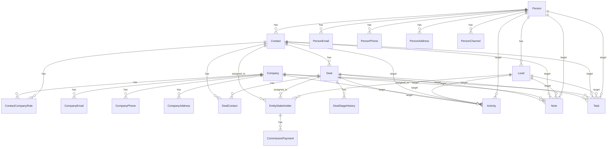

The CRM module follows a **Person + Contact Model** architecture where `Person` is the central identity layer, `Contact` represents qualified business relationships, and `Company` associations occur at the Contact level via `ContactCompanyRole`.

## Architecture overview

### Design principles

<Note>
The CRM core is built on modular design principles with clear separation of concerns:
- **Person** is the hidden identity layer (single source of truth for personal details)
- **Contact** is the business relationship layer (qualified customers)
- **Lead** is the sales opportunity layer (unqualified inquiries)
- **Deal** links to `Contact`, not `Person` directly
- **Company** associations via `Contact` through `ContactCompanyRole` (not Person)
- Unified Stakeholder Model: Single table for assignment and commission across leads/deals
- Polymorphic Patterns: Notes, tags, and activities use entity_type/entity_id patterns
- Channel Separation: Activity table indexes timeline; channel tables store full data
- Modular Design: CRM core is independent; Real Estate, Marketing, Channels are optional modules
</Note>

### Module boundaries

```
┌─────────────────────────────────────────────────────────────────┐
│                         CRM CORE                                │
│  Person, Lead, Contact, Company, Deal, DealContact             │
│  person_email, person_phone, person_address, person_channel    │
│  person_not_duplicate, contact_company_role                    │
│  entity_stakeholder, entity_transfer, commission_payment       │
│  activity, note, task, event, tag                              │
└─────────────────────────────────────────────────────────────────┘
        │                    │                    │
        ▼                    ▼                    ▼
┌──────────────┐    ┌──────────────┐    ┌──────────────┐
│ REAL ESTATE  │    │  MARKETING   │    │   CHANNELS   │
│ development  │    │  campaign    │    │  whatsapp    │
│ unit         │    │  campaign_   │    │  instagram   │
│ site_visit   │    │  lead        │    │  (linked via │
│ lead_property│    │              │    │  person_     │
│ _interest    │    │              │    │  channel)    │
│ unit_owner-  │    │              │    │              │
│ ship→Person  │    │              │    │              │
└──────────────┘    └──────────────┘    └──────────────┘
```

### Real Estate → CRM integration

Real Estate entities link to the CRM layer that owns their business context:

| Real Estate Entity       | Links To     | Rationale                                           |
| ------------------------ | ------------ | --------------------------------------------------- |
| `unit_ownership`         | `contact_id` | Ownership is represented by the org's owner Contact |
| `unit_transaction`       | `person_id`  | Transaction party is an individual                  |
| `site_visit`             | `person_id`  | Who visited the property                            |
| `lead_property_interest` | `lead_id`    | Links to Lead for sales context                     |
| `deal_property_interest` | `deal_id`    | Links to Deal for transaction context               |

<Info>
Lead property interests remain readable when a lead is archived. Archived leads are read-only, but the CRM lead detail/property-interest endpoint must bypass the Lead `active` filter for the parent lead check so historical property interest context stays visible.
</Info>

**Deal Property Interest Workflow**:

```javascript
// Deal created FROM Lead:
// Copy primary LeadPropertyInterest → DealPropertyInterest (1:1)
deal.propertyInterest.originatingInterest = leadPropertyInterest

// Deal created directly (walk-in):
// Create DealPropertyInterest with no originating interest
deal.propertyInterest.originatingInterest = null
```

**Access Pattern for Contact**:

```javascript
// Contact page showing ownership
contact.unitOwnerships  // All ownerships
contact.unitOwnerships.filter(o => o.isActive)  // Current
contact.person  // Identity details for the owner Contact
```

## Core entities

### CRM Public IDs

All core CRM business records expose a stored `publicId` for user-facing references. The format is:

```
{ENTITY_CODE}-{ORG_PREFIX}-{SEQUENCE}
```

Examples: `LEAD-ADNS-001`, `PERS-ADNS-001`, `CONT-ADNS-001`, `COMP-ADNS-001`, `DEAL-ADNS-001`, `COMM-ADNS-001`, `USER-ADNS-001`, `TEAM-ADNS-001`, `LSTG-ADNS-001`, `DSTG-ADNS-001`.

<Note>
- Entity codes make IDs globally unique within an organization across CRM record types
- `ORG_PREFIX` is generated once from the organization's normalized alphanumeric name. Names of 4 characters or fewer use the whole normalized name (`WIK`); longer names use the first 2 and last 2 characters (`Adidas Operations` → `ADNS`, `Adidas` → `ADAS`)
- `SEQUENCE` is scoped by organization and entity type, padded to at least 3 digits, and not capped (`LEAD-ADNS-1000` is valid)
- IDs are allocated by `CrmPublicIdService` from `crm_public_id_counter` in the same transaction as entity creation
- Existing IDs do not change when the organization is renamed
</Note>

**Entity codes**: Lead=`LEAD`, Person=`PERS`, Contact=`CONT`, Company=`COMP`, Deal=`DEAL`, CommissionPayment=`COMM`, organization user membership=`USER`, Team=`TEAM`, LeadStage=`LSTG`, DealStage=`DSTG`.

Organization user memberships also receive stable fallback avatar colors from the user sequence (`organization_users.avatar_bg_color` + `avatar_text_color`). The hue uses a golden-angle spread across a finite HSL palette; colors are display metadata and may repeat in very large organizations, while `public_id` remains the unique user-facing membership identifier.

<Warning>
Global system stages are the exception to the org-sequence format: they have deterministic IDs based on `systemType` (for example `LSTG-NEW`, `LSTG-DISQUALIFIED`, `DSTG-CLOSED-WON`). Org-specific custom/override stages use the normal org-scoped sequence (`LSTG-ADNS-001`, `DSTG-ADNS-001`).
</Warning>

### Person (Central identity)

**Purpose**: Single source of truth for human identity and preferences.

```
Person
├── public_id (coded org-scoped human ID, e.g. PERS-ADNS-001)
├── Identity: first_name, last_name, avatar_url, title
├── Demographics: date_of_birth, nationality
├── Links: links jsonb [{ type, url }] where type is website/facebook/instagram/linkedIn/twitter/tiktok
├── Preferences: timezone
├── Languages: languages (unified array with code and proficiency per entry)
├── Communication Flags: do_not_call, do_not_email
├── Source Tracking: original_source
├── Merge Tracking: merged_into_id, merged_at, merged_by
├── Computed: full_name (getter: first_name + last_name)
└── Related Tables:
    ├── person_email (multiple emails, one primary)
    ├── person_phone (multiple phones, one primary)
    ├── person_address (multiple addresses, one primary)
    ├── person_channel (WhatsApp, Instagram, etc. identities)
    └── person_not_duplicate (deduplication override pairs)
```

**Key Rules**:
- Every Lead, Contact must link to a Person
- `publicId` is generated once at creation using the shared CRM public ID allocator (`PERS-*`)
- Person preferences apply across all contexts (leads, deals, contacts)
- `nationality` is stored on Person so leads and contacts share the same identity profile value
- `original_source` is set once when person first enters system
- Languages array uses unified `UserLanguageEntry` format with code and proficiency per entry
- `links` stores web and social profile links as JSONB entries with `type` and `url`; fixed `website`, `linkedin_url`, and `twitter_url` columns

### PersonEmail

**Purpose**: Stores multiple email addresses per person with primary designation.

```
person_email
├── person_id → Person
├── email
├── email_type (personal, work, other)
├── is_primary
├── is_verified
├── verification_token
├── verified_at
├── bounce_count
└── status (active, inactive, bounced, unsubscribed)
```

### PersonPhone

**Purpose**: Stores multiple phone numbers per person with primary designation.

```
person_phone
├── person_id → Person
├── phone_number
├── phone_type (mobile, home, work, fax, other)
├── is_primary
├── country_code
├── extension
├── is_verified
├── verified_at
└── status (active, inactive, invalid)
```

### PersonAddress

**Purpose**: Stores multiple addresses per person with primary designation.

```
person_address
├── person_id → Person
├── address_line_1, address_line_2
├── city, state, postal_code, country
├── address_type (home, work, billing, other)
├── is_primary
├── coordinates (lat, lng)
└── is_verified
```

<Note>
`person_address` rows use `is_primary` for the primary address and `address_type` for classification (`Home`, `Work`, etc.); there is no separate address label field.
</Note>

### PersonChannel (Communication channels)

**Purpose**: Stores a person's communication channel identities (WhatsApp, Instagram, etc.).

```
person_channel
├── person_id → Person
├── channel_type (whatsapp, instagram, facebook, telegram, sms, webchat)
├── channel_identifier (phone number, username, PSID, etc.)
├── display_name, avatar_url
├── channel_identity_id → WhatsAppUser.id, InstagramUser.id, etc.
├── status (active, inactive, blocked, unsubscribed)
├── is_primary
├── Opt-in: marketing_opt_in, transactional_opt_in
├── Engagement: first_contact_at, last_message_at, message_count
└── Verification: is_verified, verified_at
```

**Key Rules**:
- Similar pattern to `person_email`, `person_phone`, `person_address`
- Channel belongs to Person, not Lead (Person-centric architecture)
- Lead can reference `source_channel_id` for attribution (which channel it came through)
- `channel_identity_id` links to detailed channel entities (WhatsAppUser, InstagramUser)
- One Person can have multiple channels of same type (e.g., multiple WhatsApp numbers)
- Lead list, kanban, and detail DTOs populate `person.channels` so CRM surfaces can show or deep-link messaging actions without making a separate person-channel request

### PersonNotDuplicate (Deduplication overrides)

**Purpose**: Records pairs of persons that have been manually confirmed as NOT duplicates. Prevents the deduplication system from repeatedly flagging the same pair.

```
person_not_duplicate
├── person1_id → Person
├── person2_id → Person
├── marked_by → User (who made the decision)
├── marked_at (when the decision was made)
├── organization_id → Organization
├── Unique constraint: (person1, person2, organization)
```

**Key Rules**:
- Symmetric: if (A, B) is marked as not-duplicate, the system treats (B, A) equivalently
- Organization-scoped: each org maintains its own override decisions
- Used by `PersonNotDuplicateService` to exclude pairs from duplicate detection

### Person merge system

**Purpose**: Consolidates duplicate persons into a single primary record, reassigning all related data.

**API Endpoint**: `POST /persons/:primaryPersonId/merge`

<Steps>
<Step title="Validation">
- Verify primary person exists and is not deleted
- Verify all secondary persons exist and are not deleted  
- All persons must be in the same organization
</Step>
<Step title="Field selection">
- Accept fieldSelections: Record<string, string>
- e.g., `{ "firstName": "primary", "lastName": "person-B-id" }`
- For each field, pick the value from the specified source person
- Fields not listed default to primary person's values
</Step>
<Step title="Contact info merge">
- `mergeAllEmails`: boolean — reassign all secondary emails to primary (isPrimary reset to false)
- `mergeAllPhones`: boolean — reassign all secondary phones to primary (isPrimary reset to false)  
- `mergeAllAddresses`: boolean — reassign all secondary addresses to primary (isPrimary reset to false)
</Step>
<Step title="Channel merge">
- Reassign all PersonChannels from secondary persons to primary
- Reset isPrimary flags to false for merged channels
- Preserve channel relationship history for attribution
</Step>
<Step title="Relationship reassignment">
- Leads: Update all secondary person leads to point to primary person
- Contacts: Update all secondary person contacts to point to primary person
- Activities: Update all activities referencing secondary persons
- Real Estate links: Update unit_ownership, site_visit, unit_transaction references
</Step>
<Step title="Merge record creation">
- Mark secondary persons as merged: `merged_into_id`, `merged_at`, `merged_by`
- Create audit trail of the merge operation
- Soft delete secondary persons (preserve for audit)
</Step>
</Steps>

### Lead entity

**Purpose**: Represents unqualified sales inquiries before they become qualified contacts.

```
Lead
├── public_id (coded org-scoped lead ID, e.g. LEAD-ADNS-001)
├── person_id → Person (required)
├── Status: status (new, contacted, qualified, disqualified, converted)
├── Source Tracking: source, source_channel_id, campaign_id
├── Assignment: assigned_user_id, assigned_at
├── Qualification: qualification_notes, disqualified_reason
├── Conversion: converted_to_contact_id, converted_at, converted_by
├── Priority: priority (low, medium, high, urgent)
├── Score: lead_score (computed)
└── Follow-up: next_follow_up_at, last_contacted_at
```

**Key Rules**:
- Every Lead must link to a Person
- Lead lifecycle: new → contacted → qualified/disqualified → converted (if qualified)
- `source_channel_id` references PersonChannel for attribution
- Upon conversion, Lead remains for attribution; Contact is created

### Contact entity

**Purpose**: Represents qualified business relationships - persons who have engaged meaningfully with the business.

```
Contact
├── public_id (coded org-scoped contact ID, e.g. CONT-ADNS-001)
├── person_id → Person (required)
├── Status: status (active, inactive, archived)
├── Classification: contact_type (customer, prospect, partner, vendor)
├── Value: lifetime_value, annual_value, last_purchase_amount
├── Engagement: last_interaction_at, interaction_count
├── Assignment: assigned_user_id, assigned_at
├── Conversion: originated_from_lead_id (if converted from lead)
├── Business Info: job_title, department
└── Preferences: preferred_communication_frequency
```

**Key Rules**:
- Contact is the primary entity for business relationships
- Deals link to Contact (not Person directly) 
- Company associations via ContactCompanyRole
- `originated_from_lead_id` maintains conversion history

### Company entity

A company represents a business organization within the CRM's **Person + Contact Model** architecture. Companies link to **Contact** (not Person) via `ContactCompanyRole` — reflecting that company associations are business relationships on the Contact layer, not the identity layer.

```
Company
├── public_id (coded org-scoped company ID, e.g. COMP-ADNS-001)
├── Core Info: name, legal_name, industry, website
├── Size Metrics: company_size, number_of_employees, annual_revenue
├── Branding: description, logo_url
├── Social: linkedin_url, twitter_url, facebook_url
├── Related tables:
│   ├── company_email (multiple emails, one primary)
│   ├── company_phone (multiple phones, one primary)
│   └── company_address (multiple addresses, one primary)
└── contact_company_role → Links contacts to company with roles
```

#### Company contact information tables

Similar to the `person_*` pattern, companies have dedicated contact information tables:

<Tabs>
  <Tab title="company_email">
    ```
    company_email
    ├── company_id → Company
    ├── email
    ├── type (primary, billing, support, general)
    ├── is_primary
    ├── is_verified
    └── status (active, inactive, bounced)
    ```
  </Tab>
  <Tab title="company_phone">
    ```
    company_phone
    ├── company_id → Company
    ├── phone_number
    ├── type (primary, billing, support, fax)
    ├── is_primary
    ├── extension
    └── country_code
    ```
  </Tab>
  <Tab title="company_address">
    ```
    company_address
    ├── company_id → Company
    ├── address_line_1, address_line_2
    ├── city, state, postal_code, country
    ├── type (headquarters, billing, shipping, branch)
    ├── is_primary
    └── coordinates (lat, lng)
    ```
  </Tab>
</Tabs>

<Note>
Each company can have multiple entries per contact type (emails, phones, addresses), with one marked as primary. This mirrors the `person_email`, `person_phone`, and `person_address` structure for consistency.
</Note>

### ContactCompanyRole

The junction table that links contacts to companies with role metadata, implementing the business relationship layer of the Person + Contact Model.

```
contact_company_role
├── contact_id → Contact (not Person)
├── company_id → Company
├── role (owner, director, manager, employee, partner, contractor)
├── job_title
├── department
├── is_primary (primary contact for this company)
├── is_decision_maker
├── start_date, end_date
├── is_active (currently active role)
└── notes
```

#### Business rules

<Warning>
Company associations link to **Contact**, not **Person**. This reflects that company relationships are business context established after a person becomes a qualified contact, not part of their core identity.
</Warning>

Key relationship patterns:
- A contact can hold roles at multiple companies
- A company can have multiple contacts  
- The `is_primary` flag marks the primary contact for the company
- Role changes are tracked through `start_date`, `end_date`, and `is_active`
- Historical roles are preserved when `is_active = false`

#### Role system nuances

The role system supports complex business relationships:

<AccordionGroup>
  <Accordion title="Role hierarchy and permissions">
    - `owner`, `director` — typically decision makers with high authority
    - `manager` — departmental leadership, may be decision maker for specific areas
    - `employee` — general staff members
    - `partner` — external business partners with ongoing relationships
    - `contractor` — temporary or project-based relationships
  </Accordion>
  <Accordion title="Decision maker identification">
    - `is_decision_maker` flag can be set independently of role
    - Multiple decision makers per company are supported
    - Useful for complex procurement or sales processes
  </Accordion>
  <Accordion title="Primary contact logic">
    - One `is_primary = true` contact per company
    - Primary contact receives company-wide communications
    - Automatically inherits certain permissions in workflows
  </Accordion>
</AccordionGroup>

### Deal entity

**Purpose**: Represents active sales opportunities linked to qualified contacts.

```
Deal
├── public_id (coded org-scoped deal ID, e.g. DEAL-ADNS-001)
├── contact_id → Contact (not Person)
├── company_id → Company (optional, if B2B deal)
├── Value: amount, currency, probability
├── Timeline: expected_close_date, actual_close_date
├── Status: stage, status (open, won, lost, on_hold)
├── Source: originated_from_lead_id (conversion tracking)
├── Assignment: assigned_user_id, assigned_at
├── Loss Analysis: lost_reason, lost_notes
└── Products: deal_products (line items)
```

**Key Rules**:
- Deals link to Contact (qualified relationship), not Person directly
- `company_id` is optional - for B2B deals involving company context
- Stage progression tracked through Deal history
- Multiple stakeholders supported via `entity_stakeholder`

### DealContact

**Purpose**: Links additional contacts to deals beyond the primary contact relationship.

```
DealContact
├── deal_id → Deal
├── contact_id → Contact
├── role (primary, influencer, decision_maker, user, blocker)
├── influence_level (high, medium, low)
├── is_primary (one per deal)
├── notes
└── added_by → User
```

## Assignment & commission system

The CRM uses a **unified stakeholder model** with a single table for assignment and commission across leads/deals:

```
entity_stakeholder
├── entity_type (lead, deal, contact)
├── entity_id
├── user_id → User
├── role (assignee, co_assignee, closer, referrer)
├── commission_percentage
├── is_active
├── assigned_at, assigned_by
└── commission_earned (calculated field)
```

### Stakeholder roles

<Tabs>
  <Tab title="Primary roles">
    - **assignee** — Primary responsible user
    - **co_assignee** — Supporting team member
    - **closer** — User who closed the deal
    - **referrer** — User who referred the opportunity
  </Tab>
  <Tab title="Commission structure">
    - Each stakeholder can have different commission percentages
    - Total commission percentages can exceed 100% (overlapping rewards)
    - Commission calculated based on deal value and stakeholder percentage
    - `commission_earned` updated when deals close
  </Tab>
</Tabs>

### Commission payment tracking

```
commission_payment
├── public_id (coded org-scoped payment ID, e.g. COMM-ADNS-001)
├── entity_stakeholder_id → EntityStakeholder
├── payment_amount
├── payment_date
├── payment_method
├── payment_reference
├── status (pending, paid, disputed)
└── notes
```

## Transfer system

```
entity_transfer
├── entity_type, entity_id
├── from_user_id → User
├── to_user_id → User
├── transfer_type (assignment, commission, both)
├── reason, notes
├── transferred_by → User
├── transferred_at
└── is_active
```

**Transfer workflows**:

<Tabs>
  <Tab title="Assignment transfer">
    Changes primary assignee, preserves commission structure
  </Tab>
  <Tab title="Commission transfer">
    Transfers commission rights, preserves assignment
  </Tab>
  <Tab title="Both">
    Complete handoff of responsibility and rewards
  </Tab>
</Tabs>

## Activity & communication system

### Polymorphic activity pattern

```
activity
├── entity_type (person, lead, contact, company, deal)
├── entity_id
├── activity_type (call, email, meeting, note, whatsapp_message)
├── channel_type (phone, email, whatsapp, in_person)
├── direction (inbound, outbound)
├── subject, description
├── scheduled_at, completed_at
├── duration_minutes
├── outcome, next_action
├── is_pinned
└── related_channel_message_id → WhatsAppMessage.id, etc.
```

**Key Rules**:
- Activity table indexes timeline; channel tables store full data
- `related_channel_message_id` links to detailed channel entities
- Channel separation: activity aggregates, channels store specifics

### Activity aggregation patterns

<Tabs>
  <Tab title="Person timeline">
    ```sql
    SELECT * FROM activity
    WHERE entity_type = 'person' AND entity_id = :personId
    UNION ALL
    SELECT * FROM activity
    WHERE entity_type = 'lead' AND entity_id IN (
      SELECT id FROM lead WHERE person_id = :personId
    )
    UNION ALL
    SELECT * FROM activity
    WHERE entity_type = 'contact' AND entity_id IN (
      SELECT id FROM contact WHERE person_id = :personId
    )
    ORDER BY is_pinned DESC, created_at DESC;
    ```
  </Tab>
  <Tab title="Company timeline">
    ```sql
    SELECT * FROM activity
    WHERE (entity_type = 'company' AND entity_id = :companyId)
       OR entity_id IN (
         SELECT contact_id FROM contact_company_role
         WHERE company_id = :companyId AND is_active = true
       )
    ORDER BY is_pinned DESC, created_at DESC;
    ```
  </Tab>
</Tabs>

## Notes system

**Purpose**: Polymorphic notes system supporting rich text content across all CRM entities.

```
note
├── entity_type (person, lead, contact, company, deal)
├── entity_id
├── title, content (rich text/markdown)
├── note_type (general, meeting_notes, follow_up, research)
├── visibility (private, team, public)
├── is_pinned
├── created_by → User
├── created_at, updated_at
└── tags[] (searchable tags)
```

### Note categories

<AccordionGroup>
  <Accordion title="Note types">
    - **general** — Standard notes and observations
    - **meeting_notes** — Structured meeting summaries
    - **follow_up** — Action items and next steps
    - **research** — Background information and insights
  </Accordion>
  <Accordion title="Visibility levels">
    - **private** — Only visible to creator
    - **team** — Visible to assigned team members
    - **public** — Visible to all users with entity access
  </Accordion>
</AccordionGroup>

### Task system

```
task
├── entity_type (person, lead, contact, company, deal)
├── entity_id
├── title, description
├── task_type (follow_up, call, email, meeting, research)
├── priority (low, medium, high, urgent)
├── status (pending, in_progress, completed, cancelled)
├── due_date, completed_at
├── assigned_to → User
├── created_by → User
└── reminder_at
```

### Tag system

```
tag
├── name, color
├── entity_types[] (which entities this tag applies to)
├── is_system_tag (vs user-created)
├── usage_count
└── created_by → User

entity_tag
├── entity_type, entity_id
├── tag_id → Tag
├── tagged_by → User
└── tagged_at
```

## Stage history & analytics

### Deal stage tracking

```
deal_stage_history
├── deal_id → Deal
├── from_stage, to_stage
├── changed_by → User
├── changed_at
├── duration_in_previous_stage (minutes)
├── notes
└── automatic_change (boolean)
```

### Analytics aggregations

**Stage conversion metrics**:
- Time spent in each stage (average, median)
- Conversion rates between stages
- Bottleneck identification
- User performance by stage progression

**Revenue analytics**:
- Pipeline value by stage
- Forecasting based on stage probabilities
- Win/loss analysis by various dimensions
- Commission earned vs. pipeline value

## Query patterns

### Access pattern for contact

```sql
-- Contact page showing ownership
SELECT * FROM unit_ownership 
WHERE contact_id = :contactId
  AND is_active = true;
```

### Company aggregation queries

<Tabs>
  <Tab title="Company contacts">
    ```sql
    SELECT c.*, ccr.role, ccr.job_title, ccr.is_primary
    FROM contact c
    JOIN contact_company_role ccr ON c.id = ccr.contact_id
    WHERE ccr.company_id = :companyId 
      AND ccr.is_active = true;
    ```
  </Tab>
  <Tab title="Company deals">
    ```sql
    SELECT d.*, c.person_id
    FROM deal d
    JOIN contact c ON d.contact_id = c.id
    WHERE d.company_id = :companyId
      AND d.status = 'open';
    ```
  </Tab>
  <Tab title="Company revenue">
    ```sql
    SELECT 
      SUM(CASE WHEN status = 'won' THEN amount ELSE 0 END) as closed_revenue,
      SUM(CASE WHEN status = 'open' THEN amount * probability/100 ELSE 0 END) as pipeline_value
    FROM deal d
    WHERE company_id = :companyId;
    ```
  </Tab>
</Tabs>

### Lead conversion tracking

```sql
-- Lead to deal conversion funnel
SELECT 
  l.source,
  COUNT(*) as total_leads,
  COUNT(l.converted_to_contact_id) as converted_leads,
  COUNT(d.id) as deals_created,
  SUM(CASE WHEN d.status = 'won' THEN d.amount ELSE 0 END) as revenue_won
FROM lead l
LEFT JOIN contact c ON l.converted_to_contact_id = c.id
LEFT JOIN deal d ON c.id = d.contact_id
GROUP BY l.source;
```

### Stakeholder performance analysis

```sql
-- User performance across entities
SELECT 
  u.name,
  es.role,
  COUNT(CASE WHEN es.entity_type = 'lead' THEN 1 END) as leads_assigned,
  COUNT(CASE WHEN es.entity_type = 'deal' THEN 1 END) as deals_assigned,
  SUM(es.commission_earned) as total_commission
FROM entity_stakeholder es
JOIN user u ON es.user_id = u.id
WHERE es.is_active = true
GROUP BY u.id, u.name, es.role;
```

## Business rules

<Info>
Key business rules that govern CRM entity relationships and workflows:
</Info>

**Person-centricity**:
- All human identity flows through Person entity
- Contact and Lead reference Person, never duplicate personal data
- Real Estate ownership links to Contact (business relationship), not Person

**Company relationships**:
- Company associations are Contact-level relationships via ContactCompanyRole
- Person can have different company associations as different Contacts
- Primary contact designation per company for communication routing

**Deal qualification**:
- Deals must link to Contact (qualified), not Lead directly  
- Deal origination tracked via `originated_from_lead_id`
- B2B context provided by optional `company_id` reference

**Commission structure**:
- Multiple stakeholders per entity with percentage-based commission
- Commission percentages can overlap (total >100%)
- Transfer system maintains audit trail of responsibility changes

**Data integrity rules**:
- Soft deletes preserve referential integrity
- Merge operations maintain complete audit trails
- Stage history preserves conversion funnel analysis
- Activity aggregation maintains unified timelines

## Entity relationship diagram



## Events & integration

### Domain events

The CRM module publishes domain events for integration with other systems:

<AccordionGroup>
  <Accordion title="Person events">
    - `PersonCreated` — New person added to system
    - `PersonMerged` — Person merge operation completed
    - `PersonUpdated` — Person information changed
    - `PersonChannelAdded` — New communication channel linked
  </Accordion>
  <Accordion title="Lead events">
    - `LeadCreated` — New lead entered system
    - `LeadQualified` — Lead marked as qualified
    - `LeadConverted` — Lead converted to contact
    - `LeadAssigned` — Lead assigned to user
  </Accordion>
  <Accordion title="Deal events">
    - `DealCreated` — New deal opportunity created
    - `DealStageChanged` — Deal progressed to new stage
    - `DealWon` — Deal successfully closed
    - `DealLost` — Deal lost to competitor or abandoned
  </Accordion>
  <Accordion title="Company events">
    - `CompanyCreated` — New company added
    - `ContactCompanyRoleChanged` — Contact's company role updated
    - `CompanyMerged` — Company consolidation completed
  </Accordion>
</AccordionGroup>

### Integration patterns

**Real Estate module integration**:
- Property interest events trigger lead scoring updates
- Site visit events create automatic follow-up tasks
- Transaction events update contact lifetime value

**Marketing module integration**:
- Campaign response events create leads with attribution
- Lead scoring events trigger automated workflows
- Conversion events measure campaign effectiveness

**Communication channel integration**:
- WhatsApp/Instagram message events create activities
- Channel verification events update person channel status
- Opt-in/opt-out events update communication preferences

## Data consistency guarantees

### ACID properties

<Info>
The CRM module maintains strict data consistency through database transactions and domain logic validation:
</Info>

**Atomicity**:
- Person merge operations are atomic - all related entity updates succeed or fail together
- Lead conversion creates Contact and updates Lead status in single transaction
- Commission calculations and payments maintain referential integrity

**Consistency**:
- Business rule validation prevents orphaned records
- Foreign key constraints maintain entity relationships
- Soft delete patterns preserve audit trail integrity

**Isolation**:
- Concurrent operations on same entities use row-level locking
- Deal stage transitions prevent race conditions in commission calculations
- Person merge operations are serialized to prevent data corruption

**Durability**:
- All CRM operations are persisted before returning success
- Event publishing follows outbox pattern for guaranteed delivery
- Audit trails are immutable once created

### Data validation rules

**Entity lifecycle validation**:
- Person cannot be hard deleted if linked to active leads/contacts
- Lead cannot be deleted if converted to contact (maintains attribution)
- Deal stage progression follows configured workflow rules
- Commission percentages validated against business rules

**Cross-entity consistency**:
- Contact company roles maintain bidirectional consistency
- Activity aggregation respects entity visibility rules
- Person channel verification status propagated to related entities

<CardGroup cols={2}>
  <Card title="Contact Management" icon="address-book" href="/backend/crm/contact">
    Business relationship entities linked to companies.
  </Card>
  <Card title="Activities" icon="timeline" href="/backend/crm/activities">
    Activity timeline with company aggregation.
  </Card>
  <Card title="Deal Management" icon="handshake" href="/backend/crm/deals">
    Sales opportunity tracking and stage management.
  </Card>
  <Card title="Assignment System" icon="users" href="/backend/crm/assignments">
    Unified stakeholder and commission management.
  </Card>
</CardGroup>