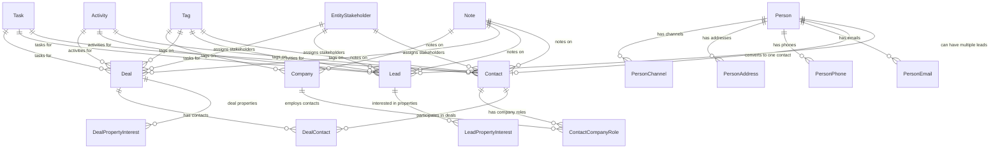

A contact represents the ongoing business relationship with a person. Contact is the **business layer** entity — created when a lead converts.

## Architecture overview

The CRM follows a **Person + Contact Model** design:

- **Person** is the hidden identity layer (single source of truth for personal details)
- **Contact** is the business relationship layer (qualified customers)
- **Lead** is the sales opportunity layer (unqualified inquiries)  
- **Deal** links to Contact, not Person directly

This modular design keeps CRM core independent while allowing Real Estate, Marketing, and Channel modules to extend functionality.

### Design principles

<AccordionGroup>
  <Accordion title="Person + Contact Model">
    - `Person` is the hidden identity layer (single source of truth for personal details)
    - `Contact` is the business relationship layer (qualified customers)
    - `Lead` is the sales opportunity layer (unqualified inquiries)
    - `Deal` links to `Contact`, not `Person` directly
  </Accordion>
  <Accordion title="Unified Stakeholder Model">
    Single table for assignment and commission across leads/deals
  </Accordion>
  <Accordion title="Polymorphic Patterns">
    Notes, tags, and activities use entity_type/entity_id patterns
  </Accordion>
  <Accordion title="Channel Separation">
    Activity table indexes timeline; channel tables store full data
  </Accordion>
  <Accordion title="Modular Design">
    CRM core is independent; Real Estate, Marketing, Channels are optional modules
  </Accordion>
  <Accordion title="Company via Contact">
    Companies associate with `Contact` via `ContactCompanyRole` (not Person)
  </Accordion>
</AccordionGroup>

### Module boundaries

```
┌─────────────────────────────────────────────────────────────────┐
│                         CRM CORE                                │
│  Person, Lead, Contact, Company, Deal, DealContact             │
│  person_email, person_phone, person_address, person_channel    │
│  person_not_duplicate, contact_company_role                    │
│  entity_stakeholder, entity_transfer, commission_payment       │
│  activity, note, task, tag                                     │
└─────────────────────────────────────────────────────────────────┘
        │                    │                    │
        ▼                    ▼                    ▼
┌──────────────┐    ┌──────────────┐    ┌──────────────┐
│ REAL ESTATE  │    │  MARKETING   │    │   CHANNELS   │
│ development  │    │  campaign    │    │  whatsapp    │
│ unit         │    │  campaign_   │    │  instagram   │
│ site_visit   │    │  lead        │    │  (linked via │
│ lead_property│    │              │    │  person_     │
│ _interest    │    │              │    │  channel)    │
│ unit_owner-  │    │              │    │              │
│ ship→Person  │    │              │    │              │
└──────────────┘    └──────────────┘    └──────────────┘
```

---

## Core entities

### Contact entity

```
Contact
├── person_id (required) → Person (OneToOne)
├── Business fields: customer_since, customerType, rating, lifetimeValue
├── Reference: reference_number (nullable, indexed)
├── Internal: internal_notes (text, nullable)
├── Company associations: companyRoles → ContactCompanyRole
├── Deals: dealContacts → DealContact[]
└── Notes: use polymorphic 'note' table
```

**Key rules:**

- One Person has ONE Contact (unlike leads)
- Contact visibility is derived from linked lead assignments
- No direct assignment fields — visibility is inherited
- Deals link to Contact, not Person
- Companies link via `ContactCompanyRole`

### Lead entity

**Purpose**: Sales opportunity layer for unqualified inquiries.

```
Lead
├── person_id (required) → Person
├── Source tracking: source_type, source_details, source_channel_id
├── Stage management: stage, stage_changed_at, stage_changed_by
├── Priority: priority, urgency, temperature
├── Assignment: uses entity_stakeholder system
├── Budget & timeline: budget_min, budget_max, timeline
├── Lead scoring: score, score_updated_at
└── Conversion: converted_to_contact_at, converted_by
```

### Deal entity

**Purpose**: Revenue opportunities linked to contacts.

```
Deal
├── Contact association: dealContacts → DealContact[]
├── Financial: value, currency, probability
├── Stage management: stage, stage_changed_at, stage_changed_by
├── Timeline: expected_close_date, actual_close_date
├── Assignment: uses entity_stakeholder system
├── Source tracking: source, source_lead_id
└── Commission: uses commission_payment system
```

### Company entity

**Purpose**: Business organizations with contact relationships.

```
Company
├── Identity: name, legal_name, registration_number
├── Type: company_type, industry, size
├── Contact info: website, primary_email, primary_phone
├── Address: primary_address
├── Financial: annual_revenue, employee_count
├── Social: linkedin_url, twitter_url
└── Contacts: contactCompanyRoles → ContactCompanyRole[]
```

---

## Person identity system

### Person (Central Identity)

**Purpose**: Single source of truth for human identity and preferences.

```
Person
├── Identity: first_name, last_name, avatar_url, title
├── Demographics: date_of_birth
├── Social: website, linkedin_url, twitter_url
├── Preferences: preferred_contact_method, timezone, preferred_language
├── Communication Flags: do_not_call, do_not_email
├── Source Tracking: original_source, languages[]
├── Merge Tracking: merged_into_id, merged_at, merged_by
├── Computed: full_name (getter: first_name + last_name)
└── Related Tables:
    ├── person_email (multiple emails, one primary)
    ├── person_phone (multiple phones, one primary)
    ├── person_address (multiple addresses, one primary)
    ├── person_channel (WhatsApp, Instagram, etc. identities)
    └── person_not_duplicate (deduplication override pairs)
```

**Key Rules**:

- Every Lead, Contact must link to a Person
- Person preferences apply across all contexts (leads, deals, contacts)
- `original_source` is set once when person first enters system

### PersonChannel (Communication Channels)

**Purpose**: Stores a person's communication channel identities (WhatsApp, Instagram, etc.).

```
person_channel
├── person_id → Person
├── channel_type (whatsapp, instagram, facebook, telegram, sms, webchat)
├── channel_identifier (phone number, username, PSID, etc.)
├── display_name, avatar_url
├── channel_identity_id → WhatsAppUser.id, InstagramUser.id, etc.
├── status (active, inactive, blocked, unsubscribed)
├── is_primary
├── Opt-in: marketing_opt_in, transactional_opt_in
├── Engagement: first_contact_at, last_message_at, message_count
└── Verification: is_verified, verified_at
```

**Key Rules**:

- Similar pattern to `person_email`, `person_phone`, `person_address`
- Channel belongs to Person, not Lead (Person-centric architecture)
- Lead can reference `source_channel_id` for attribution (which channel it came through)
- `channel_identity_id` links to detailed channel entities (WhatsAppUser, InstagramUser)
- One Person can have multiple channels of same type (e.g., multiple WhatsApp numbers)

### PersonNotDuplicate (Deduplication Overrides)

**Purpose**: Records pairs of persons that have been manually confirmed as NOT duplicates.

```
person_not_duplicate
├── person1_id → Person
├── person2_id → Person
├── marked_by → User (who made the decision)
├── marked_at (when the decision was made)
├── organization_id → Organization
├── Unique constraint: (person1, person2, organization)
```

**Key Rules**:

- Symmetric: if (A, B) is marked as not-duplicate, the system treats (B, A) equivalently
- Organization-scoped: each org maintains its own override decisions
- Used by `PersonNotDuplicateService` to exclude pairs from duplicate detection

### Person merge system

**Purpose**: Consolidates duplicate persons into a single primary record.

**API Endpoint**: `POST /persons/:primaryPersonId/merge`

**Merge Workflow**:

<Steps>
<Step title="Validation">
Verify primary person exists and is not deleted. Verify all secondary persons exist and are not deleted. All persons must be in the same organization.
</Step>
<Step title="Field Selection">
Accept fieldSelections: Record<string, string> (e.g., { "firstName": "primary", "lastName": "person-B-id" }). For each field, pick the value from the specified source person. Fields not listed default to primary person's values.
</Step>
<Step title="Contact Info Merge">
- mergeAllEmails: boolean — reassign all secondary emails to primary (isPrimary reset to false)
- mergeAllPhones: boolean — reassign all secondary phones to primary (isPrimary reset to false) 
- mergeAllAddresses: boolean — reassign all secondary addresses to primary (isPrimary reset to false)
</Step>
<Step title="Channel and Relationship Updates">
Reassign channels, leads, contacts, and all related data to the primary person. Update merged_into_id for secondary persons.
</Step>
</Steps>

---

## Assignment and commission system

### Stakeholder assignments

Contact visibility and commissions are managed through the unified **entity_stakeholder** system:

```
entity_stakeholder
├── entity_type ('contact', 'lead', 'deal')
├── entity_id → Contact.id, Lead.id, Deal.id
├── user_id → User (assigned agent/manager)
├── role ('assigned_agent', 'manager', 'split_agent')
├── split_percentage (for commission calculations)
├── assignment_reason, notes
├── assigned_by → User
├── assigned_at, effective_until
└── status (active, inactive)
```

### Commission tracking

Commission payments for contact-related deals use the **commission_payment** entity:

```
commission_payment
├── entity_type ('deal')
├── entity_id → Deal.id
├── recipient_id → User (receiving commission)
├── amount, currency
├── commission_rate
├── payment_status (pending, paid, disputed)
├── payment_date, due_date
├── Related to contact via deal.dealContacts
└── Calculated from entity_stakeholder split_percentage
```

**Commission calculation workflow:**

<Steps>
<Step title="Deal creation">
System identifies contact stakeholders through dealContacts
</Step>
<Step title="Commission calculation">
Applies split_percentage from entity_stakeholder records
</Step>
<Step title="Payment tracking">
Creates commission_payment records for each recipient
</Step>
<Step title="Payment processing">
Updates payment_status as payments are processed
</Step>
</Steps>

---

## Transfer system

Contacts can be transferred between users via the unified **entity_transfer** system:

```
entity_transfer
├── entity_type ('contact', 'lead', 'deal')
├── entity_id → Contact.id, Lead.id, Deal.id
├── from_user_id → User
├── to_user_id → User
├── transfer_reason, transfer_notes
├── status (pending, completed, rejected)
├── requested_by, approved_by
├── timestamps: requested_at, completed_at
└── Transfer affects derived visibility and future assignments
```

**Transfer workflow:**

<Steps>
<Step title="Transfer request">
Create entity_transfer record with status 'pending'
</Step>
<Step title="Approval process">
Manager/admin approves or rejects the transfer
</Step>
<Step title="Assignment update">
Update entity_stakeholder records to reflect new ownership
</Step>
<Step title="Visibility cascade">
Derived visibility updates across related leads and deals
</Step>
</Steps>

Contact transfers affect:
- Derived visibility (through lead assignments)
- Deal assignments where contact is involved
- Future lead assignments for the same person

---

## Activity and communication system

### Activity tracking

The **activity** table provides a unified timeline for all contact interactions:

```
activity
├── target_entity_type ('contact', 'lead', 'deal')
├── target_entity_id → Contact.id, Lead.id, Deal.id
├── contact_id → Contact (for bubble-up visibility)
├── activity_type ('call', 'email', 'meeting', 'note')
├── channel_type, channel_id (for channel-specific activities)
├── subject, description
├── activity_date, duration
├── created_by → User
└── Metadata: is_inbound, outcome, priority
```

**Activity bubble-up logic:**

```typescript
// When lead activity is created:
if (lead.person.contact) {
  activity.contact_id = lead.person.contact.id;
}

// Contact activities are visible to users with contact access
// Lead activities bubble up to contact timeline when contact exists
```

### Communication channels integration

Activities can originate from multiple communication channels:

<Tabs>
  <Tab title="WhatsApp">
    ```
    activity {
      channel_type: 'whatsapp',
      channel_id: whatsapp_message.id,
      activity_type: 'message',
      is_inbound: true
    }
    ```
  </Tab>
  <Tab title="Email">
    ```
    activity {
      channel_type: 'email',
      channel_id: email.id,
      activity_type: 'email',
      is_inbound: false
    }
    ```
  </Tab>
  <Tab title="Phone">
    ```
    activity {
      channel_type: 'phone',
      channel_id: call_log.id,
      activity_type: 'call',
      duration: 300
    }
    ```
  </Tab>
</Tabs>

### Activity backfill on contact creation

When a Contact is created for a Person who has existing lead activities, the system backfills `contactId` to make historical lead activities visible on the new contact's timeline:

```typescript
// In ContactService.create(), after persisting contact:
await activityBackfillService.backfillContactActivities(
  contact.id,
  person.id,
  em,
);

// 1. Find all leads for this person
// 2. Update activities WHERE target_entity_type='lead' AND target_entity_id IN (leadIds)
// 3. SET contact_id = newContactId WHERE contact_id IS NULL
```

This ensures a newly created contact immediately has a complete activity history from all the person's leads.

---

## Notes system

Contacts use the polymorphic **note** system for detailed record-keeping:

```
note
├── entity_type ('contact', 'lead', 'deal', 'company')
├── entity_id → Contact.id, Lead.id, Deal.id, Company.id
├── note_type ('general', 'meeting', 'follow_up', 'internal')
├── title, content (rich text)
├── visibility ('private', 'team', 'organization')
├── priority ('low', 'medium', 'high')
├── tags[] (for categorization)
├── created_by → User
├── assigned_to → User (for actionable notes)
└── due_date (for follow-up notes)
```

### Note types and usage

<AccordionGroup>
  <Accordion title="General notes">
    Standard contact information, preferences, and observations
  </Accordion>
  <Accordion title="Meeting notes">
    Detailed records of client meetings with action items
  </Accordion>
  <Accordion title="Follow-up notes">
    Scheduled reminders with due dates and assignments
  </Accordion>
  <Accordion title="Internal notes">
    Private team communications about the contact
  </Accordion>
</AccordionGroup>

**Query patterns:**

```sql
-- Get all contact notes
SELECT * FROM note 
WHERE entity_type = 'contact' AND entity_id = :contactId
ORDER BY created_at DESC;

-- Get actionable notes due soon
SELECT * FROM note 
WHERE entity_type = 'contact' AND assigned_to = :userId
  AND due_date BETWEEN NOW() AND NOW() + INTERVAL 7 DAY;
```

---

## Stage history and analytics

### Contact lifecycle tracking

While contacts don't have stages like leads, their lifecycle is tracked through related entities:

```
Contact Lifecycle Events:
├── Creation: contact.created_at (when lead converted)
├── Deal participation: dealContact.created_at
├── Company role changes: contactCompanyRole updates
├── Assignment changes: entity_stakeholder updates
└── Transfer events: entity_transfer records
```

### Analytics queries

<Tabs>
  <Tab title="Contact conversion metrics">
    ```sql
    -- Average time from person creation to contact conversion
    SELECT AVG(TIMESTAMPDIFF(SECOND, p.created_at, c.created_at)) as avg_conversion_time
    FROM contact c
    JOIN person p ON c.person_id = p.id
    WHERE c.created_at >= DATE_SUB(NOW(), INTERVAL 30 DAY);
    ```
  </Tab>
  <Tab title="Contact value analysis">
    ```sql
    -- Contacts by lifetime value quartile
    SELECT 
      CASE 
        WHEN lifetime_value <= q1.value THEN 'Q1'
        WHEN lifetime_value <= q2.value THEN 'Q2' 
        WHEN lifetime_value <= q3.value THEN 'Q3'
        ELSE 'Q4'
      END as quartile,
      COUNT(*) as contact_count
    FROM contact c
    CROSS JOIN (SELECT PERCENTILE_CONT(0.25) WITHIN GROUP (ORDER BY lifetime_value) as value FROM contact) q1
    CROSS JOIN (SELECT PERCENTILE_CONT(0.50) WITHIN GROUP (ORDER BY lifetime_value) as value FROM contact) q2  
    CROSS JOIN (SELECT PERCENTILE_CONT(0.75) WITHIN GROUP (ORDER BY lifetime_value) as value FROM contact) q3
    GROUP BY quartile;
    ```
  </Tab>
  <Tab title="Activity engagement">
    ```sql
    -- Contacts by activity engagement level
    SELECT 
      c.id,
      COUNT(a.id) as activity_count,
      MAX(a.activity_date) as last_activity,
      DATEDIFF(NOW(), MAX(a.activity_date)) as days_since_last_activity
    FROM contact c
    LEFT JOIN activity a ON a.contact_id = c.id
    GROUP BY c.id
    HAVING activity_count > 0
    ORDER BY days_since_last_activity ASC;
    ```
  </Tab>
</Tabs>

---

## Task management

The unified **task** system supports actionable items across all CRM entities:

```
task
├── entity_type ('contact', 'lead', 'deal', 'company')
├── entity_id → Contact.id, Lead.id, Deal.id, Company.id
├── task_type ('call', 'email', 'meeting', 'follow_up', 'reminder')
├── title, description
├── priority ('low', 'medium', 'high', 'urgent')
├── status ('pending', 'in_progress', 'completed', 'cancelled')
├── assigned_to → User
├── created_by → User
├── due_date, completed_at
├── estimated_duration
└── tags[] (for categorization)
```

### Task workflows

<Steps>
<Step title="Task creation">
Tasks can be created from notes, activities, or manually by users
</Step>
<Step title="Assignment">
Tasks are assigned to specific users with due dates and priorities
</Step>
<Step title="Tracking">
System tracks task completion rates and overdue tasks
</Step>
<Step title="Follow-up">
Completed tasks can generate follow-up tasks or activities
</Step>
</Steps>

---

## Tag system

The polymorphic **tag** system enables flexible categorization:

```
tag
├── entity_type ('contact', 'lead', 'deal', 'company')
├── entity_id → Contact.id, Lead.id, Deal.id, Company.id
├── tag_name (indexed for fast queries)
├── tag_category ('customer_type', 'interest', 'priority', 'custom')
├── color (for UI display)
├── created_by → User
├── organization_id → Organization
└── timestamps: created_at, updated_at
```

**Tag usage patterns:**

<Tabs>
  <Tab title="Customer segmentation">
    ```
    // Tag contacts by customer type
    tag: { entity_type: 'contact', tag_name: 'VIP', tag_category: 'customer_type' }
    tag: { entity_type: 'contact', tag_name: 'Enterprise', tag_category: 'customer_type' }
    ```
  </Tab>
  <Tab title="Interest tracking">
    ```
    // Tag leads by interest area
    tag: { entity_type: 'lead', tag_name: 'Luxury Properties', tag_category: 'interest' }
    tag: { entity_type: 'lead', tag_name: 'Investment', tag_category: 'interest' }
    ```
  </Tab>
  <Tab title="Deal prioritization">
    ```
    // Tag deals by priority
    tag: { entity_type: 'deal', tag_name: 'Hot Lead', tag_category: 'priority' }
    tag: { entity_type: 'deal', tag_name: 'Closing Soon', tag_category: 'priority' }
    ```
  </Tab>
</Tabs>

---

## Real Estate integration

Real Estate entities link to **Person** (not Contact) for identity tracking:

<Tabs>
  <Tab title="Ownership tracking">
    ```
    // Contact page showing property ownership
    contact.person.unitOwnerships  // All ownerships
    contact.person.unitOwnerships.filter(o => o.isActive)  // Current properties
    ```
  </Tab>
  <Tab title="Deal property workflow">
    ```
    // Deal created FROM Lead:
    // Copy primary LeadPropertyInterest → DealPropertyInterest (1:1)
    deal.propertyInterest.originatingInterest = leadPropertyInterest

    // Deal created directly (walk-in):
    // Create DealPropertyInterest with no originating interest
    deal.propertyInterest.originatingInterest = null
    ```
  </Tab>
</Tabs>

**Real Estate entity links:**

| Real Estate Entity       | Links To    | Rationale                                   |
| ------------------------ | ----------- | ------------------------------------------- |
| `unit_ownership`         | `person_id` | Ownership is about identity, not CRM status |
| `unit_transaction`       | `person_id` | Transaction party is an individual          |
| `site_visit`             | `person_id` | Who visited the property                    |
| `lead_property_interest` | `lead_id`   | Links to Lead for sales context             |
| `deal_property_interest` | `deal_id`   | Links to Deal for transaction context       |

### Lead Property Interest workflow

The Lead Property Interest system tracks property interests from inquiry to deal conversion:

```
lead_property_interest
├── lead_id → Lead
├── unit_id → Unit (specific property)
├── development_id → Development (general interest)
├── interest_type ('purchase', 'rent', 'investment')
├── priority ('primary', 'secondary', 'fallback')
├── budget_min, budget_max
├── preferred_move_in_date
├── requirements (bedrooms, amenities, etc.)
└── status ('active', 'inactive', 'converted')
```

**Conversion workflow:**

<Steps>
<Step title="Lead with property interest">
Lead created with one or more LeadPropertyInterest records
</Step>
<Step title="Lead qualification">
Agent qualifies lead and converts to Contact
</Step>
<Step title="Deal creation">
Deal created from lead, copying primary LeadPropertyInterest → DealPropertyInterest
</Step>
<Step title="Property matching">
System suggests matching properties based on interest criteria
</Step>
</Steps>

---

## Query patterns

### Common contact queries

<AccordionGroup>
  <Accordion title="Contact search with filters">
    ```sql
    SELECT c.*, p.first_name, p.last_name, p.full_name
    FROM contact c
    JOIN person p ON c.person_id = p.id
    WHERE c.is_deleted = false
      AND (p.full_name ILIKE :searchTerm OR c.reference_number ILIKE :searchTerm)
      AND (:customerType IS NULL OR c.customer_type = :customerType)
      AND (:minLifetimeValue IS NULL OR c.lifetime_value >= :minLifetimeValue)
    ORDER BY c.updated_at DESC;
    ```
  </Accordion>
  <Accordion title="Contact with deal summary">
    ```sql
    SELECT 
      c.*,
      p.first_name, p.last_name,
      COUNT(DISTINCT d.id) as deal_count,
      SUM(CASE WHEN d.stage = 'closed_won' THEN d.value ELSE 0 END) as won_value,
      MAX(d.updated_at) as last_deal_activity
    FROM contact c
    JOIN person p ON c.person_id = p.id
    LEFT JOIN deal_contact dc ON dc.contact_id = c.id
    LEFT JOIN deal d ON dc.deal_id = d.id AND d.is_deleted = false
    WHERE c.is_deleted = false
    GROUP BY c.id, p.id;
    ```
  </Accordion>
  <Accordion title="Contacts by assignment">
    ```sql
    SELECT c.*, p.first_name, p.last_name, u.full_name as assigned_agent
    FROM contact c
    JOIN person p ON c.person_id = p.id
    JOIN entity_stakeholder es ON es.entity_type = 'contact' AND es.entity_id = c.id
    JOIN user u ON es.user_id = u.id
    WHERE es.role = 'assigned_agent' AND es.status = 'active'
      AND c.is_deleted = false AND es.is_deleted = false
    ORDER BY u.full_name, c.updated_at DESC;
    ```
  </Accordion>
  <Accordion title="Contact activity timeline">
    ```sql
    SELECT a.*, u.full_name as created_by_name
    FROM activity a
    JOIN user u ON a.created_by = u.id
    WHERE a.contact_id = :contactId
      OR (a.target_entity_type = 'lead' AND a.target_entity_id IN (
        SELECT l.id FROM lead l
        JOIN person p ON l.person_id = p.id
        JOIN contact c ON c.person_id = p.id
        WHERE c.id = :contactId
      ))
    ORDER BY a.activity_date DESC, a.created_at DESC;
    ```
  </Accordion>
</AccordionGroup>

---

## Business rules

### Contact creation rules

<Warning>
Contacts can only be created when a lead converts. Direct contact creation without a lead is not allowed through standard workflows.
</Warning>

1. **One-to-one relationship**: Each person can have only one contact
2. **Lead conversion required**: Contacts are created through lead conversion process
3. **Visibility inheritance**: Contact visibility is derived from person's lead assignments
4. **Historical preservation**: Lead data and activities are preserved after conversion

### Assignment and transfer rules

1. **Stakeholder-based assignments**: Use entity_stakeholder for all contact assignments
2. **Commission splits**: Multiple agents can have commission splits on contact deals
3. **Transfer approvals**: Contact transfers require manager approval above certain value thresholds
4. **Visibility cascade**: Assignment changes affect visibility across related entities

### Data integrity rules

1. **Person relationship**: contact.person_id is required and must be unique
2. **Soft deletes**: Use is_deleted flag, never hard delete contacts with deal history
3. **Activity preservation**: Contact deletion must preserve related activity records
4. **Reference numbers**: When provided, reference_number must be unique within organization

---

## Visibility logic

Contact visibility is derived from the person's lead assignments:

```
Person: John Smith
├── Lead #1 → assigned_to: Agent A
├── Lead #2 → assigned_to: Agent B
└── Contact → Visible to: Agent A, Agent B, Managers, Owners
             NOT visible to: Other agents without lead access
```

**Visibility query:**

```sql
SELECT DISTINCT c.* FROM contact c
JOIN person p ON c.person_id = p.id
WHERE EXISTS (
  SELECT 1 FROM lead l
  JOIN entity_stakeholder es ON es.entity_type = 'lead' AND es.entity_id = l.id
  WHERE l.person_id = p.id AND es.user_id = :user_id
    AND l.is_deleted = false AND es.is_deleted = false
) AND c.is_deleted = false AND c.is_archived = false;
```

---

## Company roles

Contacts link to companies via `ContactCompanyRole`. A contact can hold roles at multiple companies.

```
Contact: John Smith (qualified customer)
├── companyRoles[]:
│   ├── Company: Acme Corp, Role: Manager, isPrimary: true
│   └── Company: XYZ Ltd, Role: Advisor, isPrimary: false
└── Access via: contact.companyRoles → ContactCompanyRole[]
```

See the [Company](/backend/crm/company) page for full `ContactCompanyRole` field details.

---

## Entity relationship diagram



---

<CardGroup cols={2}>
  <Card title="Person" icon="user" href="/backend/crm/person">
    Identity layer linked one-to-one with Contact.
  </Card>
  <Card title="Lead" icon="user-plus" href="/backend/crm/lead">
    Sales opportunity layer that converts to contacts.
  </Card>
  <Card title="Company" icon="building" href="/backend/crm/company">
    Company profiles and ContactCompanyRole associations.
  </Card>
  <Card title="Deal" icon="handshake" href="/backend/crm/deal">
    Revenue opportunities linked to contacts via DealContact.
  </Card>
</CardGroup>