A deal represents a potential revenue transaction in the CRM system. Deals are part of a comprehensive architecture that includes assignment systems, transfer workflows, activity tracking, and analytics capabilities.

## Architecture overview

### Design principles

The CRM module follows key design principles:

1. **Person + Contact Model**:
   - `Person` is the hidden identity layer (single source of truth for personal details)
   - `Contact` is the business relationship layer (qualified customers)
   - `Lead` is the sales opportunity layer (unqualified inquiries)
   - `Deal` links to `Contact`, not `Person` directly
2. **Unified Stakeholder Model**: Single table for assignment and commission across leads/deals
3. **Polymorphic Patterns**: Notes, tags, and activities use entity_type/entity_id patterns
4. **Channel Separation**: Activity table indexes timeline; channel tables store full data
5. **Modular Design**: CRM core is independent; Real Estate, Marketing, Channels are optional modules
6. **Company via Contact**: Companies associate with `Contact` via `ContactCompanyRole` (not Person)

### Module boundaries

```
┌─────────────────────────────────────────────────────────────────┐
│                         CRM CORE                                │
│  Person, Lead, Contact, Company, Deal, DealContact             │
│  person_email, person_phone, person_address, person_channel    │
│  person_not_duplicate, contact_company_role                    │
│  entity_stakeholder, entity_transfer, commission_payment       │
│  activity, note, task, tag                                     │
└─────────────────────────────────────────────────────────────────┘
        │                    │                    │
        ▼                    ▼                    ▼
┌──────────────┐    ┌──────────────┐    ┌──────────────┐
│ REAL ESTATE  │    │  MARKETING   │    │   CHANNELS   │
│ development  │    │  campaign    │    │  whatsapp    │
│ unit         │    │  campaign_   │    │  instagram   │
│ site_visit   │    │  lead        │    │  (linked via │
│ lead_property│    │              │    │  person_     │
│ _interest    │    │              │    │  channel)    │
│ unit_owner-  │    │              │    │              │
│ ship→Person  │    │              │    │              │
└──────────────┘    └──────────────┘    └──────────────┘
```

### Real Estate → CRM integration

Real Estate entities link to **Person** (not Contact) for identity:

| Real Estate Entity       | Links To    | Rationale                                   |
| ------------------------ | ----------- | ------------------------------------------- |
| `unit_ownership`         | `person_id` | Ownership is about identity, not CRM status |
| `unit_transaction`       | `person_id` | Transaction party is an individual          |
| `site_visit`             | `person_id` | Who visited the property                    |
| `lead_property_interest` | `lead_id`   | Links to Lead for sales context             |
| `deal_property_interest` | `deal_id`   | Links to Deal for transaction context       |

**Deal Property Interest Workflow**:

<Tabs>
<Tab title="From lead">
Copy `LeadPropertyInterest` → `DealPropertyInterest` using explicit selection or auto-selection (primary interest first, then first non-deleted as fallback).

```typescript
// Deal created FROM Lead:
// Copy primary LeadPropertyInterest → DealPropertyInterest (1:1)
deal.propertyInterest.originatingInterest = leadPropertyInterest
```

</Tab>
<Tab title="Walk-in">
Create `DealPropertyInterest` with no originating interest.

```typescript
// Deal created directly (walk-in):
// Create DealPropertyInterest with no originating interest
deal.propertyInterest.originatingInterest = null
```

</Tab>
</Tabs>

## Core entities

### Deal entity

```
Deal
├── title (deal name/description)
├── dealContacts[] → DealContact (ALL contacts via junction table)
│   └── isPrimary=true for primary contact
├── originating_lead_id → Lead (optional — source lead for lineage)
├── propertyInterest → DealPropertyInterest (Real Estate, 1:1)
│   └── originatingInterest → LeadPropertyInterest (lineage)
├── stage_id → deal_stage (pipeline position)
├── value, currency, description
├── probability
├── expected_close_date
├── Closure: is_closed, is_won, closed_at, closed_by
├── loss_reason (enum), loss_notes
├── Commission: commission_rate (default 2%), total_commission (calculated on close)
├── Assignment: assigned_to_id → User, assigned_to_team_id → Team
├── Transfer: has_pending_transfer (boolean)
└── Notes: use polymorphic 'note' table
```

**Key rules:**

- All contacts linked via `DealContact` junction table — no direct `contact_id` on Deal
- Exactly one `DealContact` must have `isPrimary=true`
- Access Person via `dealContacts.find(dc => dc.isPrimary).contact.person`
- Access Companies via `dealContacts.find(dc => dc.isPrimary).contact.person.companyRoles`
- `originating_lead_id` is optional for lineage tracking
- All lead stakeholders are inherited to new deals
- Closure uses `isClosed` (boolean) + `isWon` (boolean) + `closedAt` (date) + `closedBy` (user)
- `commissionRate` stored on deal (default 2%); `totalCommission` calculated on close as `value × (commissionRate / 100)`

### DealContact junction table

```
deal_contact
├── deal_id → Deal
├── contact_id → Contact
├── role (buyer, seller, tenant, landlord, investor, guarantor, decision_maker, influencer, other)
├── is_primary
├── notes
```

### Person entity (Central identity)

**Purpose**: Single source of truth for human identity and preferences.

```
Person
├── Identity: first_name, last_name, avatar_url, title
├── Demographics: date_of_birth
├── Social: website, linkedin_url, twitter_url
├── Preferences: preferred_contact_method, timezone
├── Languages: languages (unified array with code and proficiency per entry)
├── Communication Flags: do_not_call, do_not_email
├── Source Tracking: original_source
├── Merge Tracking: merged_into_id, merged_at, merged_by
├── Computed: full_name (getter: first_name + last_name)
└── Related Tables:
    ├── person_email (multiple emails, one primary)
    ├── person_phone (multiple phones, one primary)
    ├── person_address (multiple addresses, one primary)
    ├── person_channel (WhatsApp, Instagram, etc. identities)
    └── person_not_duplicate (deduplication override pairs)
```

**Key rules**:

- Every Lead, Contact must link to a Person
- Person preferences apply across all contexts (leads, deals, contacts)
- `original_source` is set once when person first enters system
- Languages array uses unified `UserLanguageEntry` format with code and proficiency per entry

### PersonChannel (Communication channels)

**Purpose**: Stores a person's communication channel identities (WhatsApp, Instagram, etc.).

```
person_channel
├── person_id → Person
├── channel_type (whatsapp, instagram, facebook, telegram, sms, webchat)
├── channel_identifier (phone number, username, PSID, etc.)
├── display_name, avatar_url
├── channel_identity_id → WhatsAppUser.id, InstagramUser.id, etc.
├── status (active, inactive, blocked, unsubscribed)
├── is_primary
├── Opt-in: marketing_opt_in, transactional_opt_in
├── Engagement: first_contact_at, last_message_at, message_count
└── Verification: is_verified, verified_at
```

**Key rules**:

- Similar pattern to `person_email`, `person_phone`, `person_address`
- Channel belongs to Person, not Lead (Person-centric architecture)
- Lead can reference `source_channel_id` for attribution (which channel it came through)
- `channel_identity_id` links to detailed channel entities (WhatsAppUser, InstagramUser)
- One Person can have multiple channels of same type (e.g., multiple WhatsApp numbers)

### PersonNotDuplicate (Deduplication overrides)

**Purpose**: Records pairs of persons that have been manually confirmed as NOT duplicates. Prevents the deduplication system from repeatedly flagging the same pair.

```
person_not_duplicate
├── person1_id → Person
├── person2_id → Person
├── marked_by → User (who made the decision)
├── marked_at (when the decision was made)
├── organization_id → Organization
├── Unique constraint: (person1, person2, organization)
```

**Key rules**:

- Symmetric: if (A, B) is marked as not-duplicate, the system treats (B, A) equivalently
- Organization-scoped: each org maintains its own override decisions
- Used by `PersonNotDuplicateService` to exclude pairs from duplicate detection

### Person merge system

**Purpose**: Consolidates duplicate persons into a single primary record, reassigning all related data.

**API Endpoint**: `POST /persons/:primaryPersonId/merge`

<Steps>
<Step title="Validation">
- Verify primary person exists and is not deleted
- Verify all secondary persons exist and are not deleted
- All persons must be in the same organization
</Step>

<Step title="Field selection">
- Accept fieldSelections: Record<string, string>
  - e.g., { "firstName": "primary", "lastName": "person-B-id" }
- For each field, pick the value from the specified source person
- Fields not listed default to primary person's values
</Step>

<Step title="Contact info merge (opt-in per type)">
- mergeAllEmails: boolean — reassign all secondary emails to primary
- mergeAllPhones: boolean — reassign all secondary phones to primary
- mergeAllAddresses: boolean — reassign all secondary addresses to primary
</Step>

<Step title="Channel and relationship reassignment">
- Reassign all PersonChannel, ContactCompanyRole records to primary
- Update all related entity foreign keys (leads, contacts, etc.)
- Mark secondary persons as merged (set merged_into_id, merged_at, merged_by)
</Step>
</Steps>

### Contact and Company entities

#### Contact entity

The Contact entity represents business relationships with qualified customers:

```
Contact
├── person_id → Person
├── contact_status (active, inactive, disqualified)
├── qualification_score
├── qualification_notes
├── source, source_detail
├── lead_origin → Lead (if converted from lead)
├── qualified_at, qualified_by
└── Business context via ContactCompanyRole
```

#### Company integration

Companies associate with Contact via `ContactCompanyRole` (not Person directly):

```
contact_company_role
├── contact_id → Contact
├── company_id → Company
├── role ('employee', 'contractor', 'owner', 'partner', 'client')
├── title, department
├── is_primary
├── start_date, end_date
```

Access pattern: `dealContacts.find(dc => dc.isPrimary).contact.person.companyRoles`

#### Company entity

```
Company
├── name, display_name, logo_url
├── company_type (corporation, llc, partnership, nonprofit, government)
├── industry, size_category
├── website, description
├── tax_id, registration_number
├── Primary contact: primary_contact_id → Contact
├── Address: billing_address_id, shipping_address_id → CompanyAddress
├── Parent company: parent_company_id → Company
├── Source: original_source
└── Status: is_active, is_verified
```

#### Lead entity

```
Lead
├── person_id → Person (required link)
├── source, source_detail, source_channel_id → PersonChannel
├── lead_status (new, contacted, qualified, disqualified, converted)
├── lead_score, qualification_notes
├── converted_to_contact_id → Contact (when qualified)
├── converted_at, converted_by
├── disqualified_reason, disqualified_notes
├── Property Interest: → LeadPropertyInterest (1:1)
└── Assignment: via EntityStakeholder table
```

## Assignment & commission system

Deals participate in the unified stakeholder model for assignment and commission tracking.

### EntityStakeholder table

```
entity_stakeholder
├── entity_type ('Deal', 'Lead')
├── entity_id → Deal.id or Lead.id
├── stakeholder_type ('user', 'team')
├── stakeholder_id → User.id or Team.id
├── role ('primary', 'secondary', 'observer')
├── commission_percentage (0-100)
├── is_active
├── assigned_at, assigned_by
```

**Assignment rules:**

- Deals can be assigned to Users or Teams
- Multiple stakeholders per deal with different commission splits
- Commission percentages must total ≤ 100% per deal
- `primary` role indicates main responsibility
- Team assignments create team pool ownership

### Commission payments

When deals close as won, commission payments are automatically generated:

```
commission_payment
├── entity_type ('Deal')
├── entity_id → Deal.id
├── stakeholder_type ('user', 'team')
├── stakeholder_id → User.id or Team.id
├── commission_amount (calculated from deal value × commission_percentage)
├── payment_status ('pending', 'paid', 'cancelled')
├── created_at, paid_at
```

Commission payments are automatically created when a deal is marked as won, calculating the commission amount based on the deal value and each stakeholder's commission percentage.

## Transfer system

Deals can be transferred between users/teams with full audit trails and stakeholder updates.

### EntityTransfer table

```
entity_transfer
├── entity_type ('Deal', 'Lead')
├── entity_id → Deal.id
├── transfer_type ('user_to_user', 'user_to_team', 'team_to_user', 'team_to_team')
├── from_user_id, from_team_id
├── to_user_id, to_team_id
├── reason, notes
├── status ('pending', 'completed', 'cancelled')
├── requested_by, approved_by
├── requested_at, completed_at
```

### Transfer workflow

<Steps>
<Step title="Request transfer">
- Create transfer record with `status = 'pending'`
- Set `deal.has_pending_transfer = true`
</Step>

<Step title="Approval process">
- Manager/admin reviews transfer request
- Can approve, reject, or request modifications
</Step>

<Step title="Complete transfer">
- Update deal assignment (`assigned_to_id`, `assigned_to_team_id`)
- Update stakeholder records (deactivate old, create new)
- Set `status = 'completed'`, `deal.has_pending_transfer = false`
</Step>
</Steps>

**Transfer status transitions:**

- **pending** → **completed**: Approved and processed
- **pending** → **cancelled**: Rejected or withdrawn
- System prevents modifications to deals with `has_pending_transfer = true`

**Business rules:**

- Only one pending transfer per deal at a time
- Transfers require manager/admin approval
- Completing transfer updates all related `entity_stakeholder` records
- Full audit trail maintained with timestamps and user attribution

## Activity & communication system

All deal interactions are tracked through the unified activity system with full channel separation and PersonChannel integration.

### Activity table

```
activity
├── entity_type ('Deal', 'Lead', 'Contact')
├── entity_id → Deal.id
├── activity_type ('call', 'email', 'meeting', 'note', 'whatsapp_message', 'stage_change')
├── direction ('inbound', 'outbound', 'internal')
├── summary, description
├── channel_id → whatsapp_message.id, email.id (detailed data)
├── user_id (who performed the activity)
├── occurred_at
├── duration_minutes (for calls, meetings)
```

### Task system

Tasks are integrated with the activity system for follow-up management:

```
task
├── entity_type ('Deal', 'Lead', 'Contact', 'Person')
├── entity_id → Deal.id
├── assigned_to_id → User
├── title, description
├── task_type ('call', 'email', 'meeting', 'follow_up', 'other')
├── priority ('low', 'medium', 'high', 'urgent')
├── status ('pending', 'in_progress', 'completed', 'cancelled')
├── due_date, completed_at
├── parent_activity_id → Activity (if task created from activity)
```

**Communication tracking:**

- Activity table provides unified timeline view
- Channel-specific tables store full message/call data
- Polymorphic `channel_id` links to detailed records
- PersonChannel links communication identities to Person
- All interactions indexed for analytics and reporting

<Info>
The activity system provides a unified timeline view while maintaining detailed data in channel-specific tables through polymorphic relationships.
</Info>

## Notes system

Deals support the polymorphic notes system for flexible documentation.

### Note table

```
note
├── entity_type ('Deal', 'Lead', 'Contact', 'Person')
├── entity_id → Deal.id
├── title, content
├── note_type ('general', 'meeting', 'follow_up', 'internal')
├── visibility ('public', 'internal', 'private')
├── is_pinned
├── created_by → User
├── created_at, updated_at
├── tags[] (array of tag names)
```

**Note features:**

- Rich text content support
- Tagging system for categorization
- Visibility controls (public/internal/private)
- Pinning for important notes
- Full-text search capabilities

<Info>
Notes are fully polymorphic and can be attached to any entity type. Use `entity_type = 'Deal'` and `entity_id = deal.id` to associate notes with deals.
</Info>

## Stage history & analytics

Deal stage changes are tracked for pipeline analytics and performance measurement.

### Deal stage tracking

```
deal_stage_history
├── deal_id → Deal
├── stage_id → deal_stage
├── entered_at, exited_at
├── duration_days
├── changed_by → User
├── notes
```

**Analytics capabilities:**

- Stage conversion rates
- Average time in each stage
- Pipeline velocity metrics
- Win/loss analysis by stage
- User performance tracking

### Pipeline metrics

The system automatically calculates key performance indicators:

- **Conversion rates**: Percentage of deals progressing from each stage
- **Velocity**: Average time spent in each pipeline stage
- **Revenue forecasting**: Based on deal values and probabilities
- **Team performance**: Individual and team-level metrics

## Query patterns

### Common deal queries

<CodeGroup>
```sql Deal with primary contact
SELECT d.*, 
       dc.contact_id as primary_contact_id,
       c.person_id,
       p.first_name, p.last_name
FROM deals d
JOIN deal_contacts dc ON d.id = dc.deal_id AND dc.is_primary = true
JOIN contacts c ON dc.contact_id = c.id
JOIN persons p ON c.person_id = p.id
WHERE d.organization_id = ?
```

```sql Deal stakeholders with commission
SELECT d.title,
       CASE es.stakeholder_type 
         WHEN 'user' THEN u.first_name || ' ' || u.last_name
         WHEN 'team' THEN t.name
       END as stakeholder_name,
       es.role,
       es.commission_percentage
FROM deals d
JOIN entity_stakeholders es ON es.entity_type = 'Deal' AND es.entity_id = d.id
LEFT JOIN users u ON es.stakeholder_type = 'user' AND es.stakeholder_id = u.id
LEFT JOIN teams t ON es.stakeholder_type = 'team' AND es.stakeholder_id = t.id
WHERE d.id = ? AND es.is_active = true
```

```sql Deal activity timeline
SELECT a.*,
       u.first_name || ' ' || u.last_name as user_name,
       CASE a.activity_type
         WHEN 'whatsapp_message' THEN (SELECT content FROM whatsapp_messages WHERE id = a.channel_id)
         WHEN 'email' THEN (SELECT subject FROM emails WHERE id = a.channel_id)
       END as activity_detail
FROM activities a
JOIN users u ON a.user_id = u.id
WHERE a.entity_type = 'Deal' AND a.entity_id = ?
ORDER BY a.occurred_at DESC
```

```sql Deal with property interest
SELECT d.*,
       dpi.development_id,
       dpi.unit_id,
       dpi.budget_min,
       dpi.budget_max,
       dev.name as development_name,
       u.unit_number
FROM deals d
JOIN deal_property_interests dpi ON d.id = dpi.deal_id
JOIN developments dev ON dpi.development_id = dev.id
LEFT JOIN units u ON dpi.unit_id = u.id
WHERE d.id = ?
```
</CodeGroup>

### Pipeline analytics

<CodeGroup>
```sql Stage conversion rates
SELECT 
    ds.name as stage_name,
    COUNT(*) as total_deals,
    COUNT(CASE WHEN d.is_won = true THEN 1 END) as won_deals,
    ROUND(COUNT(CASE WHEN d.is_won = true THEN 1 END) * 100.0 / COUNT(*), 2) as win_rate
FROM deals d
JOIN deal_stages ds ON d.stage_id = ds.id
WHERE d.created_at >= ? AND d.created_at < ?
GROUP BY ds.id, ds.name
ORDER BY ds.order_index
```

```sql Average time in stages
SELECT 
    ds.name as stage_name,
    AVG(dsh.duration_days) as avg_duration_days,
    COUNT(*) as deals_count
FROM deal_stage_history dsh
JOIN deal_stages ds ON dsh.stage_id = ds.id
WHERE dsh.exited_at IS NOT NULL
GROUP BY ds.id, ds.name
ORDER BY ds.order_index
```

```sql Pipeline velocity metrics
SELECT 
    DATE_TRUNC('month', d.created_at) as month,
    COUNT(*) as deals_created,
    COUNT(CASE WHEN d.is_closed = true THEN 1 END) as deals_closed,
    AVG(CASE WHEN d.is_closed = true THEN 
        EXTRACT(days FROM (d.closed_at - d.created_at)) END) as avg_days_to_close,
    SUM(CASE WHEN d.is_won = true THEN d.value ELSE 0 END) as revenue_won
FROM deals d
WHERE d.created_at >= ? AND d.created_at < ?
GROUP BY DATE_TRUNC('month', d.created_at)
ORDER BY month
```
</CodeGroup>

### Advanced query patterns

<CodeGroup>
```sql Deal transfer history
SELECT et.*,
       fu.first_name || ' ' || fu.last_name as from_user_name,
       ft.name as from_team_name,
       tu.first_name || ' ' || tu.last_name as to_user_name,
       tt.name as to_team_name,
       rb.first_name || ' ' || rb.last_name as requested_by_name,
       ab.first_name || ' ' || ab.last_name as approved_by_name
FROM entity_transfers et
LEFT JOIN users fu ON et.from_user_id = fu.id
LEFT JOIN teams ft ON et.from_team_id = ft.id
LEFT JOIN users tu ON et.to_user_id = tu.id
LEFT JOIN teams tt ON et.to_team_id = tt.id
LEFT JOIN users rb ON et.requested_by = rb.id
LEFT JOIN users ab ON et.approved_by = ab.id
WHERE et.entity_type = 'Deal' AND et.entity_id = ?
ORDER BY et.requested_at DESC
```

```sql Deal notes with user attribution
SELECT n.*,
       u.first_name || ' ' || u.last_name as created_by_name,
       u.avatar_url as created_by_avatar
FROM notes n
JOIN users u ON n.created_by = u.id
WHERE n.entity_type = 'Deal' AND n.entity_id = ?
ORDER BY n.is_pinned DESC, n.created_at DESC
```

```sql Commission payment tracking
SELECT cp.*,
       d.title as deal_title,
       d.value as deal_value,
       CASE cp.stakeholder_type
         WHEN 'user' THEN u.first_name || ' ' || u.last_name
         WHEN 'team' THEN t.name
       END as stakeholder_name
FROM commission_payments cp
JOIN deals d ON cp.entity_type = 'Deal' AND cp.entity_id = d.id
LEFT JOIN users u ON cp.stakeholder_type = 'user' AND cp.stakeholder_id = u.id
LEFT JOIN teams t ON cp.stakeholder_type = 'team' AND cp.stakeholder_id = t.id
WHERE d.organization_id = ? AND cp.payment_status = 'pending'
ORDER BY cp.created_at DESC
```
</CodeGroup>

## Business rules

<AccordionGroup>
<Accordion title="Core entity rules">

| Rule                      | Description                                                                                    |
| ------------------------- | ---------------------------------------------------------------------------------------------- |
| Unified DealContact       | All contacts via `deal_contact` junction table                                                 |
| Primary contact required  | Exactly one DealContact per deal must have `is_primary=true`                                   |
| Deal from lead            | `originating_lead_id` links to source lead (optional)                                          |
| Inherit stakeholders      | Copy all lead stakeholders to new deal                                                         |
| Inherit property interest | Copy `LeadPropertyInterest` → `DealPropertyInterest` (1:1)                                     |
| Walk-in deals             | Deals without leads create `DealPropertyInterest` directly                                     |
| One deal = one property   | 1:1 relationship — multiple units = multiple deals                                             |
| Person preferences apply  | Person preferences apply across all contexts (leads, deals, contacts)                          |
| Company via Contact       | Companies associate with Contact via `ContactCompanyRole` (not Person)                        |

</Accordion>

<Accordion title="Assignment & commission rules">

| Rule                               | Description                                                          |
| ---------------------------------- | -------------------------------------------------------------------- |
| Commission total limit             | Sum of commission_percentage ≤ 100% per deal                        |
| Primary stakeholder required       | At least one stakeholder with `role = 'primary'`                    |
| Team assignment creates pool       | Team-assigned deals have no individual user assignment              |
| Transfer blocks modifications      | Deals with `has_pending_transfer = true` cannot be reassigned       |
| Commission payment auto-creation   | Closing deal as won automatically creates commission_payment records |

</Accordion>

<Accordion title="Transfer system rules">

| Rule                          | Description                                                    |
| ----------------------------- | -------------------------------------------------------------- |
| Pending transfer exclusivity  | Only one pending transfer per deal                             |
| Transfer approval required    | Transfers require manager/admin approval                       |
| Stakeholder update on transfer| Completing transfer updates all entity_stakeholder records    |
| Transfer audit trail          | All transfers logged with timestamps and user attribution     |

</Accordion>

<Accordion title="Activity & communication rules">

| Rule                      | Description                                                        |
| ------------------------- | ------------------------------------------------------------------ |
| Activity timeline order   | Activities ordered by `occurred_at` DESC                          |
| Channel data separation   | Summary in activity table, details in channel-specific tables     |
| User attribution required | All activities must link to a user                                |
| Entity polymorphism       | Activities support Deal, Lead, Contact, Person entity types       |
| PersonChannel integration | Communication channels linked to Person via `person_channel`      |
| Task activity linking     | Tasks can be created from activities via `parent_activity_id`     |

</Accordion>

<Accordion title="Stage & closure rules">

| Rule                      | Description                                                          |
| ------------------------- | -------------------------------------------------------------------- |
| Stage history tracking    | All stage changes automatically logged                               |
| Closure state consistency | `is_closed = true` required when `is_won` is set                     |
| Reopening preserves data  | Reopened deals maintain closure history                              |
| Commission on won closure | Setting `is_won = true` triggers commission payment creation         |

</Accordion>

<Accordion title="Real Estate integration rules">

| Rule                           | Description                                                    |
| ------------------------------ | -------------------------------------------------------------- |
| Property interest inheritance  | Deal from lead copies primary `LeadPropertyInterest`          |
| Walk-in property creation      | Direct deals create `DealPropertyInterest` without lineage    |
| One-to-one property mapping    | Each deal links to exactly one property interest              |
| Ownership links to Person      | Real Estate ownership entities link to Person, not Contact    |
| Site visit attribution         | Site visits link to Person for identity tracking             |

</Accordion>

<Accordion title="Person entity rules">

| Rule                           | Description                                                    |
| ------------------------------ | -------------------------------------------------------------- |
| Person-centric channels       | PersonChannel belongs to Person, not Lead                     |
| Channel attribution            | Lead can reference `source_channel_id` for attribution        |
| Multiple channels per type     | One Person can have multiple channels of same type            |
| Deduplication overrides        | PersonNotDuplicate prevents repeated duplicate flagging       |
| Merge field selection          | Person merge allows selective field picking from sources      |
| Original source immutable      | `original_source` is set once when person first enters system |

</Accordion>
</AccordionGroup>

## Entity relationship diagram

```mermaid
erDiagram
    Person ||--o{ Contact : "has"
    Person ||--o{ PersonEmail : "has"
    Person ||--o{ PersonPhone : "has"
    Person ||--o{ PersonAddress : "has"
    Person ||--o{ PersonChannel : "has"
    Person ||--o{ PersonNotDuplicate : "excludes"
    
    Contact ||--o{ DealContact : "participates"
    Contact ||--o{ ContactCompanyRole : "works_at"
    
    Deal ||--o{ DealContact : "involves"
    Deal ||--|| DealPropertyInterest : "interests"
    Deal ||--o{ EntityStakeholder : "assigned_to"
    Deal ||--o{ EntityTransfer : "transferred"
    Deal ||--o{ Activity : "tracked"
    Deal ||--o{ Note : "documented"
    Deal ||--o{ Task : "requires"
    Deal ||--o{ DealStageHistory : "progresses"
    Deal ||--o{ CommissionPayment : "generates"
    
    Lead ||--o{ EntityStakeholder : "assigned_to"
    Lead ||--|| LeadPropertyInterest : "interests"
    Lead ||--o{ Deal : "converts_to"
    
    Company ||--o{ ContactCompanyRole : "employs"
    
    EntityStakeholder ||--o{ CommissionPayment : "earns"
    
    User ||--o{ EntityStakeholder : "stakeholder"
    Team ||--o{ EntityStakeholder : "stakeholder"
    
    Development ||--o{ DealPropertyInterest : "featured_in"
    Development ||--o{ LeadPropertyInterest : "featured_in"
    Unit ||--o{ DealPropertyInterest : "targets"
    
    DealPropertyInterest ||--o{ LeadPropertyInterest : "originates_from"
    
    PersonChannel ||--o{ WhatsAppUser : "links_to"
    PersonChannel ||--o{ InstagramUser : "links_to"
```



## Events & integration

The deal system publishes events for integration with external systems and analytics platforms.

### Event types

| Event                    | Triggered When                | Payload                                    |
| ------------------------ | ----------------------------- | ------------------------------------------ |
| `deal.created`           | New deal created              | Deal data with primary contact             |
| `deal.stage_changed`     | Deal stage updated            | Previous/new stage, deal ID, changed_by   |
| `deal.stakeholder_added` | Stakeholder assigned to deal  | Stakeholder details, role, commission %   |
| `deal.closed`            | Deal marked as closed         | Deal data, closure reason, commission data |
| `deal.transferred`       | Deal transfer completed       | Transfer details, old/new assignments     |

### Event payload example

```json
{
  "eventType": "deal.stage_changed",
  "entityId": "deal_123",
  "entityType": "Deal", 
  "timestamp": "2024-01-15T10:30:00Z",
  "organizationId": "org_456",
  "data": {
    "dealId": "deal_123",
    "previousStageId": "stage_1", 
    "newStageId": "stage_2",
    "changedBy": "user_789",
    "deal": { /* full deal object */ }
  }
}
```

## Data consistency guarantees

The system provides several consistency guarantees across the deal lifecycle.

### Transactional guarantees

<AccordionGroup>
<Accordion title="Deal creation consistency">
- Deal creation from lead is atomic (deal + stakeholders + property interest)
- Rollback on failure ensures no partial state
- Stakeholder inheritance maintains referential integrity
</Accordion>

<Accordion title="Commission calculation consistency">  
- Commission payments created atomically when deal marked as won
- Total commission percentages validated before payment generation
- Payment records locked during commission calculation
</Accordion>

<Accordion title="Transfer consistency">
- Transfer completion updates all related entities atomically
- Stakeholder records updated consistently across transfer
- No concurrent transfers allowed on same entity
</Accordion>

<Accordion title="Stage history consistency">
- Stage changes logged atomically with deal updates
- Timeline integrity maintained across stage transitions
- Analytics calculations based on consistent stage history
</Accordion>
</AccordionGroup>

### Data validation rules

- **DealContact validation**: Exactly one primary contact enforced at database level
- **Commission total**: Sum of stakeholder commission percentages ≤ 100%
- **Property interest uniqueness**: One-to-one deal to property interest mapping
- **Transfer state**: Pending transfers block concurrent modifications
- **Closure validation**: Cannot set `is_won` without setting `is_closed`

<CardGroup cols={2}>
  <Card title="Contact" icon="address-book" href="/backend/crm/contact">
    Business relationship entities linked to deals via DealContact.
  </Card>
  <Card title="Person" icon="user" href="/backend/crm/person">
    Central identity layer with contact information and channel management.
  </Card>
  <Card
    title="Stakeholder data model"
    icon="database"
    href="/backend/crm/stakeholder-model"
  >
    Stakeholder inheritance and commission payment creation.
  </Card>
  <Card title="Stages" icon="diagram-project" href="/backend/crm/stages">
    Deal pipeline stages, closure, and reopening behavior.
  </Card>
  <Card
    title="Stakeholder API reference"
    icon="arrows-rotate"
    href="/backend/stakeholder-api"
  >
    Bidirectional sync between deal and lead stakeholders.
  </Card>
  <Card title="Transfer system" icon="exchange" href="/backend/crm/transfers">
    Entity transfer workflows and approval processes.
  </Card>
  <Card title="Activity tracking" icon="timeline" href="/backend/crm/activities">
    Communication and interaction tracking across entities.
  </Card>
  <Card title="Notes system" icon="note-sticky" href="/backend/crm/notes">
    Polymorphic notes system with tagging and visibility controls.
  </Card>
  <Card title="Analytics" icon="chart-line" href="/backend/crm/analytics">
    Pipeline analytics, stage tracking, and performance metrics.
  </Card>
  <Card title="Real Estate integration" icon="building" href="/backend/real-estate/property-interests">
    Property interest management and deal-to-property linking.
  </Card>
</CardGroup>