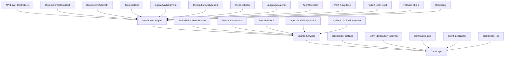

# Distribution Module Complete Specification

<Note>
**Status:** Active — fully implemented  
**Module Path:** `src/modules/crm/distribution/`
</Note>

## Overview

The Distribution Module automates lead assignment within organizations. When a new lead is created, the system evaluates org-defined rules to automatically assign the lead to the most appropriate agent — based on lead attributes, agent availability, language compatibility, and capacity.

### Design Principles

| Principle | Decision |
|-----------|----------|
| **Async distribution** | `createLead()` emits `LEAD_CREATED`; a pg-boss worker handles distribution — lead creation is never blocked |
| **Stakeholder system reuse** | Distribution creates `EntityStakeholder` records via `EntityStakeholderService`, not a new paradigm |
| **First-match-wins rules** | Rules are evaluated top-to-bottom by priority; the first matching rule wins |
| **Idempotency** | Distribution engine checks for existing stakeholders or pending offers before running |
| **No retroactive distribution** | Existing leads are unaffected when rules are created; only new leads trigger distribution |
| **pg-boss scheduling** | Distribution queue uses pg-boss for reliability and retry guarantees |
| **RLS compliance** | All entities carry `organization_id` for row-level security |

### Distribution Paths

The engine supports two execution paths:

<Tabs>
  <Tab title="Path A - Org-level">
    **Org-level distribution** (`runDistribution`): triggered when a lead enters the org with no team context. Evaluates org-scoped rules, applies the org default method, and can bridge to Path B if a rule or default method routes to a team that has `distributionEnabled = true`.
  </Tab>
  <Tab title="Path B - Team-level">
    **Team-level distribution** (`runTeamDistribution`): triggered directly when:
    - A lead is created with a `teamId` in the event payload (team pool assignment)
    - Path A determines the lead belongs to an auto-distributing team
    - Idempotency check finds a single team-only stakeholder with auto-distribute enabled
  </Tab>
</Tabs>

Path B evaluates team-scoped rules, uses team settings (with org fallback for capacity), and logs the team FK on the resulting `DistributionLog` record.

## Architecture

### High-Level Diagram



### Component Responsibilities

<AccordionGroup>
  <Accordion title="Core Engine Components">
    | Component | Responsibility |
    |-----------|----------------|
    | **DistributionEngine** | Orchestrator: receives a lead, evaluates rules, selects agent, creates assignment. Supports Path A (org) and Path B (team). |
    | **RuleEvaluator** | Evaluates rule conditions against lead data; returns first matching rule |
    | **LanguageMatcher** | Filters and ranks agents by language compatibility with the lead's person |
    | **AgentSelector** | Applies the distribution method (round-robin, weighted, weighted-round-robin, direct) to the filtered agent pool |
  </Accordion>
  
  <Accordion title="Service Layer">
    | Component | Responsibility |
    |-----------|----------------|
    | **AgentAvailabilityService** | Checks agent capacity, business hours, leave status. Two-phase capacity enforcement with advisory locks. |
    | **UserStatusService** | Pre-filters candidate agents to only those with ONLINE status |
    | **DistributionListener** | Listens for `LEAD_CREATED` events and enqueues pg-boss jobs |
    | **DistributionJobHandler** | pg-boss worker that processes distribution jobs |
  </Accordion>
</AccordionGroup>

## Entity Specifications

### DistributionSettings

<Info>
Org-level configuration for the distribution engine. Auto-created with defaults on first access via `getOrgSettingsRaw()`. Unique constraint on `organization_id`.
</Info>

| Column | Type | Notes |
|--------|------|-------|
| id | uuid PK | |
| organization_id | uuid FK UNIQUE | RLS |
| distribution_enabled | bool | default `false`. Master on/off switch — when `false`, no pg-boss jobs are enqueued. |
| max_active_leads_per_agent | int | default 50 |
| max_new_leads_per_day | int | default 15 |
| capacity_enforcement_enabled | bool | default `false` |
| respect_business_hours | bool | default `true`. Gating uses `Organization.settings.businessHours` |
| outside_hours_action | enum | `QUEUE`, `POOL`, `DUTY_AGENT` |
| duty_agent_id | uuid FK nullable | used when `outside_hours_action = DUTY_AGENT` |
| default_method | enum | `ROUND_ROBIN`, `POOL`, `SPECIFIC_TEAM` |
| default_team_id | uuid FK nullable | used when `default_method = SPECIFIC_TEAM` |
| default_language_matching_mode | enum | `STRICT`, `PREFERRED` |
| default_balancing_factors | jsonb nullable | Optional balancing configuration |
| pool_alert_enabled | bool | Whether to send pool-overload alerts |
| pool_alert_threshold | int | Lead count that triggers an alert |
| pool_alert_window_minutes | int | Rolling window for counting unassigned leads |
| updated_by | uuid FK nullable | |
| created_at, updated_at | timestamp | |

<Warning>
**Master toggle behavior:**
- `distributionEnabled = false` (new-org default): Engine is off. No pg-boss jobs created.
- `distributionEnabled = true`: Engine is active. When toggled from `false` → `true`, if `defaultMethod` is still `POOL` it is auto-upgraded to `ROUND_ROBIN`.
</Warning>

### TeamDistributionSettings

<Info>
Per-team distribution configuration. One record per `(organization, team)` pair — unique index `uq_team_distribution_settings_org_team`. Auto-created on first access.
</Info>

| Column | Type | Notes |
|--------|------|-------|
| id | uuid PK | |
| organization_id | uuid FK | RLS |
| team_id | uuid FK | (required, not nullable) |
| distribution_enabled | bool | default `false`. When `true`, leads in this team's pool are auto-distributed via Path B. |
| distribution_method | enum | default `ROUND_ROBIN`. Method for this team's auto-distribution. |
| agent_weights | jsonb nullable | `{ [userId]: weight }` — used with WEIGHTED method |
| language_matching_enabled | bool | default `false` |
| language_matching_mode | enum nullable | Language matching mode override |
| capacity_enforcement_enabled | bool | default `false`. Independent from org toggle. |
| max_active_leads_per_agent | int nullable | `null` = inherit from org settings |
| max_new_leads_per_day | int nullable | `null` = inherit from org settings |
| respect_business_hours | bool | default `false`. Whether BH gating applies for this team's distributions. |
| last_assigned_index | int | default 0. Round-robin cursor for the team-fallback path |
| default_balancing_factors | jsonb nullable | |
| updated_by | uuid FK nullable | |
| created_at, updated_at | timestamp | |

<Tip>
**Effective capacity resolution** (`DistributionSettingsService.resolveEffectiveCapacity`):
```typescript
if (team.capacityEnforcementEnabled) {
  maxActive = team.maxActiveLeadsPerAgent ?? org.maxActiveLeadsPerAgent
  maxDaily  = team.maxNewLeadsPerDay ?? org.maxNewLeadsPerDay
} else {
  // no capacity checks applied for this team's distributions
}
```
</Tip>

### DistributionRule

Rules are evaluated in ascending `priority` order (lower number = higher priority). First match wins.

| Column | Type | Notes |
|--------|------|-------|
| id | uuid PK | |
| organization_id | uuid FK | RLS |
| name | varchar | |
| priority | int | lower = higher priority |
| is_active | bool | default true |
| scope | enum | `ORGANIZATION`, `TEAM` |
| team_id | uuid FK nullable | for team-scoped rules |
| condition_groups | jsonb | `[{conditions:[{field,operator,value}]}]` — AND-within-OR groups |
| method | enum | `ROUND_ROBIN`, `WEIGHTED`, `WEIGHTED_ROUND_ROBIN`, `DIRECT` |
| recipients | jsonb | `{agentIds?, teamId?, poolId?, weights?}` |
| language_matching_enabled | bool | default true |
| language_matching_mode | enum | `STRICT`, `PREFERRED` |
| balancing_factors | jsonb nullable | Optional balancing configuration |
| last_assigned_index | int | round-robin cursor; updated atomically |
| created_by | uuid FK | |
| created_at, updated_at | timestamp | |
| is_deleted | bool | soft delete |

#### Rule Conditions - Supported Fields

| Field | Operator(s) | Example Value |
|-------|-------------|---------------|
| `leadSource` | `eq`, `in` | `'WEBSITE'`, `['WEBSITE', 'REFERRAL']` |
| `temperature` | `eq`, `in` | `'HOT'` |
| `language` | `eq` | `'ar'` (matched against `person.preferredLanguage`) |
| `budget` | `gte`, `lte`, `between` | `500000` |
| `tags` | `contains` | `['vip']` |
| `sourceChannel` | `eq`, `in` | `'WHATSAPP'` |
| `intent` | `eq` | `'BUY'` |
| `area` | `eq`, `in`, `contains` | `'Dubai Marina'`, `['JBR', 'Downtown Dubai']` |

<Note>
All string-based condition fields use **case-insensitive matching**. The `area` field requires data from `LeadPropertyInterest.preferredAreas[]` — the engine pre-loads the lead's property interests before calling the evaluator.
</Note>

**Scope & Team Rules:**
- **Org-level rules** (`scope = ORGANIZATION`): `team` is null. Evaluated during Path A.
- **Team-scoped rules** (`scope = TEAM`): `team` is set. Only evaluated during Path B for the matching team.

## Type Definitions

### Core Enums

```typescript
enum DistributionMethod {
  ROUND_ROBIN = 'ROUND_ROBIN',
  WEIGHTED = 'WEIGHTED', 
  WEIGHTED_ROUND_ROBIN = 'WEIGHTED_ROUND_ROBIN',
  DIRECT = 'DIRECT',
  POOL = 'POOL',
  SPECIFIC_TEAM = 'SPECIFIC_TEAM'
}

enum LanguageMatchingMode {
  STRICT = 'STRICT',     // Agent must speak lead's language
  PREFERRED = 'PREFERRED' // Prefer agents who speak lead's language
}

enum OutsideHoursAction {
  QUEUE = 'QUEUE',       // Hold until business hours
  POOL = 'POOL',         // Send to unassigned pool
  DUTY_AGENT = 'DUTY_AGENT' // Assign to designated duty agent
}

enum RuleScope {
  ORGANIZATION = 'ORGANIZATION',
  TEAM = 'TEAM'
}
```

### Distribution Context

```typescript
interface DistributionContext {
  leadId: string;
  organizationId: string;
  teamId?: string;
  triggeredBy?: string;
  metadata?: Record<string, any>;
}

interface DistributionResult {
  success: boolean;
  assignedTo?: string;
  method?: DistributionMethod;
  ruleId?: string;
  teamId?: string;
  reason?: string;
  error?: string;
}
```

## Distribution Engine

### Engine Flow

<Steps>
  <Step title="Idempotency Check">
    Engine verifies no existing stakeholders or pending offers exist for the lead
  </Step>
  
  <Step title="Path Determination">
    - If `teamId` in context → Path B (team-level)
    - If org-only lead → Path A (org-level)
    - Path A can bridge to Path B if routed to auto-distributing team
  </Step>
  
  <Step title="Rule Evaluation">
    Rules evaluated in priority order (ascending). First match wins.
  </Step>
  
  <Step title="Agent Selection">
    Apply distribution method to filtered candidate pool
  </Step>
  
  <Step title="Assignment Creation">
    Create `EntityStakeholder` record via `EntityStakeholderService`
  </Step>
</Steps>

### Language Matching

<Tabs>
  <Tab title="STRICT Mode">
    ```typescript
    // Agent MUST speak the lead's preferred language
    const compatibleAgents = agents.filter(agent => 
      agent.languages.includes(lead.person.preferredLanguage)
    );
    ```
  </Tab>
  
  <Tab title="PREFERRED Mode">
    ```typescript
    // Prefer agents who speak the language, but allow fallback
    const preferred = agents.filter(agent => 
      agent.languages.includes(lead.person.preferredLanguage)
    );
    
    return preferred.length > 0 ? preferred : agents;
    ```
  </Tab>
</Tabs>

### Capacity Enforcement

<Warning>
Two-phase capacity checking with advisory locks prevents race conditions:
1. **Pre-check:** Quick capacity validation
2. **Lock & verify:** Acquire advisory lock and re-check capacity
3. **Assignment:** Create stakeholder record while holding lock
</Warning>

```typescript
// Phase 1: Quick pre-check
if (!hasCapacity(agent)) return null;

// Phase 2: Lock and verify
const lock = await acquireAdvisoryLock(agent.id);
try {
  if (!hasCapacity(agent)) return null;
  return await createAssignment(lead, agent);
} finally {
  await releaseLock(lock);
}
```

## pg-boss Job Configuration

### Distribution Queue

| Setting | Value | Purpose |
|---------|-------|---------|
| **Queue name** | `distribution` | Dedicated queue for lead distribution |
| **Retry attempts** | 3 | Handle transient failures |
| **Retry delay** | exponential backoff | Prevent cascade failures |
| **Job timeout** | 30 seconds | Prevent hanging jobs |
| **Concurrency** | 5 | Balance throughput and resource usage |

### Job Payload

```typescript
interface DistributionJobPayload {
  leadId: string;
  organizationId: string;
  teamId?: string;
  triggeredBy?: string;
  metadata?: {
    source?: string;
    priority?: number;
    retryCount?: number;
  };
}
```

### Error Handling

<AccordionGroup>
  <Accordion title="Retriable Errors">
    - Database connection timeouts
    - Temporary capacity service unavailability  
    - Advisory lock acquisition failures
  </Accordion>
  
  <Accordion title="Non-retriable Errors">
    - Invalid lead ID (lead not found)
    - Organization not found
    - Malformed job payload
    - Distribution disabled for organization
  </Accordion>
</AccordionGroup>

## API Endpoints

### Distribution Settings

<CodeGroup>
```typescript GET /api/crm/distribution/settings
// Get organization distribution settings
{
  id: string;
  distributionEnabled: boolean;
  maxActiveLeadsPerAgent: number;
  maxNewLeadsPerDay: number;
  capacityEnforcementEnabled: boolean;
  respectBusinessHours: boolean;
  outsideHoursAction: OutsideHoursAction;
  dutyAgentId?: string;
  defaultMethod: DistributionMethod;
  defaultTeamId?: string;
  // ... other fields
}
```

```typescript PUT /api/crm/distribution/settings
// Update organization distribution settings
{
  distributionEnabled?: boolean;
  maxActiveLeadsPerAgent?: number;
  maxNewLeadsPerDay?: number;
  capacityEnforcementEnabled?: boolean;
  respectBusinessHours?: boolean;
  outsideHoursAction?: OutsideHoursAction;
  dutyAgentId?: string;
  defaultMethod?: DistributionMethod;
  defaultTeamId?: string;
  // ... other updateable fields
}
```
</CodeGroup>

### Distribution Rules

<CodeGroup>
```typescript GET /api/crm/distribution/rules
// List organization distribution rules
{
  rules: DistributionRule[];
  total: number;
  page: number;
  limit: number;
}
```

```typescript POST /api/crm/distribution/rules
// Create new distribution rule
{
  name: string;
  priority: number;
  scope: RuleScope;
  teamId?: string;
  conditionGroups: ConditionGroup[];
  method: DistributionMethod;
  recipients: RuleRecipients;
  languageMatchingEnabled?: boolean;
  languageMatchingMode?: LanguageMatchingMode;
}
```

```typescript PUT /api/crm/distribution/rules/:id
// Update distribution rule
{
  name?: string;
  priority?: number;
  isActive?: boolean;
  conditionGroups?: ConditionGroup[];
  method?: DistributionMethod;
  recipients?: RuleRecipients;
  // ... other updateable fields
}
```
</CodeGroup>

### Team Distribution

<CodeGroup>
```typescript GET /api/crm/distribution/teams/:teamId/settings
// Get team distribution settings
{
  id: string;
  teamId: string;
  distributionEnabled: boolean;
  distributionMethod: DistributionMethod;
  agentWeights?: Record<string, number>;
  languageMatchingEnabled: boolean;
  // ... other fields
}
```

```typescript PUT /api/crm/distribution/teams/:teamId/settings
// Update team distribution settings
{
  distributionEnabled?: boolean;
  distributionMethod?: DistributionMethod;
  agentWeights?: Record<string, number>;
  languageMatchingEnabled?: boolean;
  languageMatchingMode?: LanguageMatchingMode;
  capacityEnforcementEnabled?: boolean;
  // ... other updateable fields
}
```
</CodeGroup>

### Agent Availability

<CodeGroup>
```typescript GET /api/crm/distribution/agents/availability
// Get agent availability status
{
  agents: Array<{
    id: string;
    name: string;
    status: UserStatus;
    capacity: {
      current: number;
      maximum: number;
      available: boolean;
    };
    businessHours: {
      available: boolean;
      nextAvailable?: Date;
    };
  }>;
}
```

```typescript PUT /api/crm/distribution/agents/:agentId/availability
// Update agent availability
{
  maxActiveLeads?: number;
  maxNewLeadsPerDay?: number;
  isOnLeave?: boolean;
  leaveStartDate?: Date;
  leaveEndDate?: Date;
}
```
</CodeGroup>

### Distribution Analytics

<CodeGroup>
```typescript GET /api/crm/distribution/analytics/summary
// Distribution performance summary
{
  period: {
    start: Date;
    end: Date;
  };
  metrics: {
    totalDistributed: number;
    successRate: number;
    averageAssignmentTime: number;
    ruleUtilization: Array<{
      ruleId: string;
      ruleName: string;
      usageCount: number;
    }>;
    agentWorkload: Array<{
      agentId: string;
      agentName: string;
      assignedLeads: number;
      capacity: number;
    }>;
  };
}
```

```typescript GET /api/crm/distribution/analytics/logs
// Distribution execution logs
{
  logs: Array<{
    id: string;
    leadId: string;
    success: boolean;
    method: DistributionMethod;
    assignedTo?: string;
    ruleId?: string;
    executionTime: number;
    createdAt: Date;
  }>;
  total: number;
  // ... pagination
}
```
</CodeGroup>

## Security & Permissions

### Required Permissions

| Action | Permission | Scope |
|--------|------------|-------|
| View distribution settings | `CRM_DISTRIBUTION_VIEW` | Organization |
| Update distribution settings | `CRM_DISTRIBUTION_MANAGE` | Organization |
| Create/edit distribution rules | `CRM_DISTRIBUTION_RULES_MANAGE` | Organization |
| View distribution analytics | `CRM_DISTRIBUTION_ANALYTICS_VIEW` | Organization |
| Manage team distribution | `CRM_TEAM_DISTRIBUTION_MANAGE` | Team |
| Update agent availability | `CRM_AGENT_AVAILABILITY_MANAGE` | Self or Organization |

### Row Level Security (RLS)

<Warning>
All distribution entities include `organization_id` for RLS compliance. RLS policies ensure users can only access data from their organization.
</Warning>

```sql
-- Example RLS policy for distribution_settings
CREATE POLICY distribution_settings_org_policy ON distribution_settings
  FOR ALL USING (organization_id = current_organization_id());

-- Example RLS policy for distribution_rule  
CREATE POLICY distribution_rule_org_policy ON distribution_rule
  FOR ALL USING (organization_id = current_organization_id());
```

### API Security

<Tabs>
  <Tab title="Authentication">
    All endpoints require valid JWT authentication with organization context
  </Tab>
  
  <Tab title="Authorization">
    Permission-based access control using organization and team-level permissions
  </Tab>
  
  <Tab title="Rate Limiting">
    API endpoints are subject to standard rate limiting (1000 requests/hour per user)
  </Tab>
</Tabs>

## Observability & Audit

### Distribution Logging

Every distribution attempt creates a `DistributionLog` record:

| Field | Type | Purpose |
|-------|------|---------|
| id | uuid | Unique log entry ID |
| lead_id | uuid | Associated lead |
| organization_id | uuid | RLS compliance |
| team_id | uuid nullable | Team context (Path B) |
| success | boolean | Distribution outcome |
| method | enum | Method used |
| rule_id | uuid nullable | Matched rule (if any) |
| assigned_to | uuid nullable | Selected agent |
| execution_time_ms | int | Performance tracking |
| error_message | text nullable | Failure details |
| metadata | jsonb | Additional context |

### Event Emission

<Check>
The distribution engine emits events for external system integration:
</Check>

- `LEAD_DISTRIBUTED` - Successful assignment
- `LEAD_DISTRIBUTION_FAILED` - Assignment failure  
- `DISTRIBUTION_RULE_MATCHED` - Rule evaluation success
- `AGENT_CAPACITY_EXCEEDED` - Capacity enforcement triggered

### Metrics & Monitoring

<CardGroup cols={2}>
  <Card title="Performance Metrics" icon="chart-line">
    - Distribution success rate
    - Average assignment time
    - Queue processing time
    - Rule evaluation latency
  </Card>
  
  <Card title="Business Metrics" icon="briefcase">
    - Agent utilization rates
    - Rule effectiveness
    - Capacity overflow incidents
    - Business hours compliance
  </Card>
</CardGroup>

## Analytics & Metrics

### Distribution Performance Dashboard

The analytics service provides comprehensive distribution metrics:

```typescript
interface DistributionMetrics {
  overview: {
    totalDistributed: number;
    successRate: number;
    averageAssignmentTime: number;
    queueBacklog: number;
  };
  
  rulePerformance: Array<{
    ruleId: string;
    ruleName: string;
    matchCount: number;
    successRate: number;
    averageExecutionTime: number;
  }>;
  
  agentWorkload: Array<{
    agentId: string;
    agentName: string;
    assignedLeads: number;
    capacityUtilization: number;
    responseTime: number;
  }>;
  
  timeSeriesData: {
    distributionVolume: TimeSeriesPoint[];
    successRate: TimeSeriesPoint[];
    capacityUsage: TimeSeriesPoint[];
  };
}
```

### Alerting

<Warning>
Built-in alerting for distribution health:
</Warning>

- **Pool Overflow:** When unassigned leads exceed threshold
- **Low Success Rate:** When distribution success drops below 90%
- **Queue Backlog:** When pg-boss queue depth exceeds limits
- **Capacity Exhaustion:** When all agents reach capacity limits

## Edge Case Handling

### Common Edge Cases

<AccordionGroup>
  <Accordion title="No Available Agents">
    **Scenario:** All agents at capacity or offline during business hours
    
    **Handling:**
    1. Check for duty agent (if configured)
    2. Fall back to pool assignment
    3. Emit `DISTRIBUTION_NO_AGENTS_AVAILABLE` event
    4. Log with reason code for analytics
  </Accordion>
  
  <Accordion title="Rule Evaluation Failures">
    **Scenario:** Rule condition references missing lead data
    
    **Handling:**
    1. Skip malformed rule with warning log
    2. Continue to next rule in priority order
    3. Fall back to default method if no rules match
    4. Report rule validation issues in analytics
  </Accordion>
  
  <Accordion title="Concurrent Distribution Attempts">
    **Scenario:** Multiple workers attempt to distribute same lead
    
    **Handling:**
    1. Idempotency check prevents duplicate assignments
    2. Advisory locks prevent race conditions
    3. Second attempt logs as "already assigned"
    4. No error thrown - graceful handling
  </Accordion>
  
  <Accordion title="Team Dissolution During Distribution">
    **Scenario:** Team deleted while lead in queue for team distribution
    
    **Handling:**
    1. Validate team existence before distribution
    2. Fall back to org-level distribution if team not found
    3. Update team-scoped rules to inactive status
    4. Log team reference errors for cleanup
  </Accordion>
</AccordionGroup>

### Error Recovery

<Steps>
  <Step title="Transient Failures">
    Automatically retry with exponential backoff (max 3 attempts)
  </Step>
  
  <Step title="Persistent Failures">
    Move to dead letter queue for manual investigation
  </Step>
  
  <Step title="Fallback Assignment">
    Route to pool if all distribution methods fail
  </Step>
  
  <Step title="Alert Generation">
    Notify administrators of persistent distribution issues
  </Step>
</Steps>

## Performance & Scaling

### Performance Characteristics

| Metric | Target | Current |
|--------|--------|---------|
| **Distribution latency** | < 2 seconds | ~800ms |
| **Rule evaluation time** | < 100ms | ~45ms |
| **Concurrent capacity** | 100 leads/minute | 150 leads/minute |
| **Memory usage** | < 50MB per worker | ~35MB |

### Scaling Considerations

<Tabs>
  <Tab title="Horizontal Scaling">
    - pg-boss workers can be scaled across multiple instances
    - Database read replicas for analytics queries
    - Redis caching for frequently accessed settings
  </Tab>
  
  <Tab title="Vertical Scaling">
    - Increase worker concurrency based on CPU cores
    - Optimize database indexes for rule evaluation
    - Connection pooling for database efficiency
  </Tab>
  
  <Tab title="Optimization Strategies">
    - Cache organization settings in Redis (TTL: 5 minutes)
    - Batch agent availability checks
    - Pre-compile rule conditions for faster evaluation
    - Use materialized views for analytics queries
  </Tab>
</Tabs>

### Database Optimization

```sql
-- Critical indexes for performance
CREATE INDEX CONCURRENTLY idx_distribution_rule_org_priority 
  ON distribution_rule(organization_id, priority) 
  WHERE is_active = true AND is_deleted = false;

CREATE INDEX CONCURRENTLY idx_distribution_log_lead_created 
  ON distribution_log(lead_id, created_at);

CREATE INDEX CONCURRENTLY idx_agent_availability_org_user 
  ON agent_availability(organization_id, user_id);
```

## Module Structure

### File Organization

```
src/modules/crm/distribution/
├── controllers/
│   ├── distribution-settings.controller.ts
│   ├── distribution-rules.controller.ts
│   ├── team-distribution.controller.ts
│   ├── agent-availability.controller.ts
│   └── distribution-analytics.controller.ts
├── services/
│   ├── distribution-engine.service.ts
│   ├── distribution-settings.service.ts
│   ├── distribution-rules.service.ts
│   ├── agent-availability.service.ts
│   ├── rule-evaluator.service.ts
│   ├── language-matcher.service.ts
│   └── agent-selector.service.ts
├── entities/
│   ├── distribution-settings.entity.ts
│   ├── team-distribution-settings.entity.ts
│   ├── distribution-rule.entity.ts
│   ├── agent-availability.entity.ts
│   └── distribution-log.entity.ts
├── listeners/
│   └── distribution.listener.ts
├── jobs/
│   └── distribution-job.handler.ts
├── types/
│   ├── distribution.types.ts
│   ├── rule-condition.types.ts
│   └── analytics.types.ts
├── guards/
│   └── distribution-permissions.guard.ts
└── distribution.module.ts
```

### Module Dependencies

<CardGroup cols={2}>
  <Card title="Internal Dependencies" icon="cube">
    - `EntityStakeholderModule`
    - `UserStatusModule`
    - `OrganizationModule`
    - `TeamModule`
    - `LeadModule`
  </Card>
  
  <Card title="External Dependencies" icon="plug">
    - `pg-boss` (job queue)
    - `@nestjs/event-emitter` (events)
    - `@mikro-orm/postgresql` (ORM)
    - `@nestjs/cache-manager` (caching)
  </Card>
</CardGroup>

## Integration Points

### Lead Creation Integration

```typescript
// In LeadService.create()
async createLead(data: CreateLeadDto): Promise<Lead> {
  const lead = await this.leadRepository.create(data);
  
  // Emit event for distribution processing
  this.eventEmitter.emit('lead.created', {
    leadId: lead.id,
    organizationId: lead.organizationId,
    teamId: data.teamId,
    triggeredBy: 'lead_creation'
  });
  
  return lead;
}
```

### Import Service Integration

```typescript
// In LeadImportService.processImport()
async processImportedLeads(leads: ImportedLead[]): Promise<void> {
  const createdLeads = await this.createLeadsInBatch(leads);
  
  // Batch emit distribution events
  for (const lead of createdLeads) {
    if (this.shouldTriggerDistribution(lead)) {
      this.eventEmitter.emit('lead.created', {
        leadId: lead.id,
        organizationId: lead.organizationId,
        triggeredBy: 'lead_import'
      });
    }
  }
}
```

### Stakeholder System Integration

<Info>
Distribution creates assignments through the existing `EntityStakeholderService`, ensuring consistency with manual assignments and other stakeholder operations.
</Info>

```typescript
// Distribution creates stakeholder records
const assignment = await this.entityStakeholderService.create({
  entityType: 'LEAD',
  entityId: leadId,
  stakeholderType: 'USER',
  stakeholderId: selectedAgent.id,
  role: 'ASSIGNEE',
  assignedBy: 'SYSTEM',
  metadata: {
    distributionMethod: method,
    ruleId: matchedRule?.id,
    assignedAt: new Date()
  }
});
```

## Environment Configuration

### Required Environment Variables

```bash
# Distribution Engine
DISTRIBUTION_ENABLED=true
DISTRIBUTION_WORKER_CONCURRENCY=5
DISTRIBUTION_JOB_TIMEOUT=30000

# Business Hours
DEFAULT_BUSINESS_HOURS_ENABLED=true
DEFAULT_TIMEZONE=Asia/Dubai

# Capacity Management  
DEFAULT_MAX_ACTIVE_LEADS=50
DEFAULT_MAX_DAILY_LEADS=15
CAPACITY_CHECK_TIMEOUT=5000

# pg-boss Configuration
PGBOSS_MAX_POOL_SIZE=10
PGBOSS_ARCHIVE_COMPLETED_AFTER_SECONDS=3600
```

### Feature Flags

<Tabs>
  <Tab title="Distribution Features">
    ```typescript
    {
      DISTRIBUTION_ENGINE_V2: true,
      WEIGHTED_ROUND_ROBIN: true,
      LANGUAGE_MATCHING: true,
      CAPACITY_ENFORCEMENT: true,
      BUSINESS_HOURS_GATING: true
    }
    ```
  </Tab>
  
  <Tab title="Analytics Features">
    ```typescript
    {
      DISTRIBUTION_ANALYTICS: true,
      REAL_TIME_METRICS: true,
      ADVANCED_REPORTING: true,
      EXPORT_CAPABILITIES: true
    }
    ```
  </Tab>
</Tabs>

<Check>
The Distribution Module is fully implemented and production-ready, supporting both simple and complex lead assignment scenarios with comprehensive monitoring and analytics capabilities.
</Check>