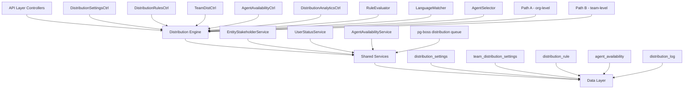

## Overview

The Distribution Module automates lead assignment within organizations. When a new lead is created, the system evaluates org-defined rules to automatically assign the lead to the most appropriate agent — based on lead attributes, agent availability, language compatibility, and capacity.

<Info>
The distribution engine operates asynchronously to ensure lead creation is never blocked by assignment processing.
</Info>

### Design Principles

| Principle | Decision |
|-----------|----------|
| Async distribution | `createLead()` emits `LEAD_CREATED`; a pg-boss worker handles distribution — lead creation is never blocked |
| Stakeholder system reuse | Distribution creates `EntityStakeholder` records via `EntityStakeholderService`, not a new paradigm |
| First-match-wins rules | Rules are evaluated top-to-bottom by priority; the first matching rule wins |
| Idempotency | Distribution engine checks for existing stakeholders or pending offers before running |
| No retroactive distribution | Existing leads are unaffected when rules are created; only new leads trigger distribution |
| pg-boss scheduling | Distribution queue uses pg-boss for reliability and retry guarantees |
| RLS compliance | All entities carry `organization_id` for row-level security |

### Distribution Paths

The engine supports two execution paths:

<Tabs>
<Tab title="Path A - Org-level">
**Path A — Org-level distribution** (`runDistribution`): triggered when a lead enters the org with no team context. Evaluates org-scoped rules, applies the org default method, and can bridge to Path B if a rule or default method routes to a team that has `distributionEnabled = true`.
</Tab>
<Tab title="Path B - Team-level">
**Path B — Team-level distribution** (`runTeamDistribution`): triggered directly when:
- A lead is created with a `teamId` in the event payload (team pool assignment)
- Path A determines the lead belongs to an auto-distributing team
- Idempotency check finds a single team-only stakeholder with auto-distribute enabled

Path B evaluates team-scoped rules, uses team settings (with org fallback for capacity), and logs the team FK on the resulting `DistributionLog` record.
</Tab>
</Tabs>

## Architecture

### High-Level System Design



### Component Responsibilities

<AccordionGroup>
<Accordion title="Core Engine Components">
| Component | Responsibility |
|-----------|----------------|
| **DistributionEngine** | Orchestrator: receives a lead, evaluates rules, selects agent, creates assignment. Supports Path A (org) and Path B (team). |
| **RuleEvaluator** | Evaluates rule conditions against lead data; returns first matching rule |
| **LanguageMatcher** | Filters and ranks agents by language compatibility with the lead's person |
| **AgentSelector** | Applies the distribution method (round-robin, weighted, weighted-round-robin, direct) to the filtered agent pool |
</Accordion>

<Accordion title="Service Components">
| Component | Responsibility |
|-----------|----------------|
| **AgentAvailabilityService** | Checks agent capacity, business hours, leave status. Two-phase capacity enforcement with advisory locks. |
| **UserStatusService** | Pre-filters candidate agents to only those with ONLINE status |
| **DistributionListener** | Listens for `LEAD_CREATED` events and enqueues pg-boss jobs |
| **DistributionJobHandler** | pg-boss worker that processes distribution jobs |
</Accordion>
</AccordionGroup>

## Entity Specifications

### Distribution Settings

<Warning>
The `DistributionSettings` entity maintains one record per organization and serves as the master configuration for all distribution behavior.
</Warning>

#### `DistributionSettings` (1 per org)

Org-level configuration for the distribution engine. Auto-created with defaults on first access via `getOrgSettingsRaw()`. Unique constraint on `organization_id`.

| Column | Type | Notes |
|--------|------|-------|
| id | uuid PK | |
| organization_id | uuid FK UNIQUE | RLS |
| distribution_enabled | bool | default `false`. Master on/off switch — when `false`, no pg-boss jobs are enqueued. |
| max_active_leads_per_agent | int | default 50 |
| max_new_leads_per_day | int | default 15 |
| capacity_enforcement_enabled | bool | default `false` |
| respect_business_hours | bool | default `true`. Gating uses `Organization.settings.businessHours` |
| outside_hours_action | enum | `QUEUE`, `POOL`, `DUTY_AGENT` |
| duty_agent_id | uuid FK nullable | used when `outside_hours_action = DUTY_AGENT` |
| default_method | enum | `ROUND_ROBIN`, `POOL`, `SPECIFIC_TEAM` |
| default_team_id | uuid FK nullable | used when `default_method = SPECIFIC_TEAM` |
| default_language_matching_mode | enum | `STRICT`, `PREFERRED` |
| default_balancing_factors | jsonb nullable | Optional balancing configuration |
| pool_alert_enabled | bool | Whether to send pool-overload alerts |
| pool_alert_threshold | int | Lead count that triggers an alert |
| pool_alert_window_minutes | int | Rolling window for counting unassigned leads |

<Note>
**Master toggle behavior:**
- `distributionEnabled = false` (new-org default): Engine is off. `DistributionListener` and `LeadImportService` skip enqueue entirely
- `distributionEnabled = true`: Engine is active. When toggled from `false` → `true`, if `defaultMethod` is still `POOL` it is auto-upgraded to `ROUND_ROBIN`
</Note>

### Team Distribution Settings

#### `TeamDistributionSettings` (1 per org+team)

Per-team distribution configuration. One record per `(organization, team)` pair — unique index `uq_team_distribution_settings_org_team`. Auto-created on first access.

| Column | Type | Notes |
|--------|------|-------|
| id | uuid PK | |
| organization_id | uuid FK | RLS |
| team_id | uuid FK | (required, not nullable) |
| distribution_enabled | bool | default `false`. When `true`, leads in this team's pool are auto-distributed via Path B. |
| distribution_method | enum | default `ROUND_ROBIN`. Method for this team's auto-distribution. |
| agent_weights | jsonb nullable | `{ [userId]: weight }` — used with WEIGHTED method |
| language_matching_enabled | bool | default `false` |
| language_matching_mode | enum nullable | Language matching mode override |
| capacity_enforcement_enabled | bool | default `false`. Independent from org toggle. |
| max_active_leads_per_agent | int nullable | `null` = inherit from org settings |
| max_new_leads_per_day | int nullable | `null` = inherit from org settings |
| respect_business_hours | bool | default `false`. Whether BH gating applies for this team's distributions. |
| last_assigned_index | int | default 0. Round-robin cursor for the team-fallback path |

<Tip>
**Effective capacity resolution** uses a fallback chain where team settings override org settings when specified.
</Tip>

### Distribution Rules

#### `DistributionRule`

Rules are evaluated in ascending `priority` order (lower number = higher priority). First match wins.

| Column | Type | Notes |
|--------|------|-------|
| id | uuid PK | |
| organization_id | uuid FK | RLS |
| name | varchar | |
| priority | int | lower = higher priority |
| is_active | bool | default true |
| scope | enum | `ORGANIZATION`, `TEAM` |
| team_id | uuid FK nullable | for team-scoped rules |
| condition_groups | jsonb | `[{conditions:[{field,operator,value}]}]` — AND-within-OR groups |
| method | enum | `ROUND_ROBIN`, `WEIGHTED`, `WEIGHTED_ROUND_ROBIN`, `DIRECT` |
| recipients | jsonb | `{agentIds?, teamId?, poolId?, weights?}` |
| language_matching_enabled | bool | default true |
| language_matching_mode | enum | `STRICT`, `PREFERRED` |
| balancing_factors | jsonb nullable | Optional balancing configuration |
| last_assigned_index | int | round-robin cursor; updated atomically |

#### Rule Conditions — Supported Fields

<CodeGroup>
```json Basic Conditions
{
  "field": "leadSource",
  "operator": "eq", 
  "value": "WEBSITE"
}
```

```json Array Conditions
{
  "field": "leadSource",
  "operator": "in",
  "value": ["WEBSITE", "REFERRAL"]
}
```

```json Range Conditions
{
  "field": "budget",
  "operator": "between",
  "value": [100000, 500000]
}
```
</CodeGroup>

| Field | Operator(s) | Example Value |
|-------|-------------|---------------|
| `leadSource` | `eq`, `in` | `'WEBSITE'`, `['WEBSITE', 'REFERRAL']` |
| `temperature` | `eq`, `in` | `'HOT'` |
| `language` | `eq` | `'ar'` (matched against `person.preferredLanguage`) |
| `budget` | `gte`, `lte`, `between` | `500000` |
| `tags` | `contains` | `['vip']` |
| `sourceChannel` | `eq`, `in` | `'WHATSAPP'` |
| `intent` | `eq` | `'BUY'` |
| `area` | `eq`, `in`, `contains` | `'Dubai Marina'`, `['JBR', 'Downtown Dubai']` |

<Warning>
All string-based condition fields use **case-insensitive matching**. The `area` field requires data from `LeadPropertyInterest.preferredAreas[]`.
</Warning>

## Type Definitions

### Core Types

<CodeGroup>
```typescript Distribution Method
enum DistributionMethod {
  ROUND_ROBIN = 'ROUND_ROBIN',
  WEIGHTED = 'WEIGHTED', 
  WEIGHTED_ROUND_ROBIN = 'WEIGHTED_ROUND_ROBIN',
  DIRECT = 'DIRECT',
  POOL = 'POOL',
  SPECIFIC_TEAM = 'SPECIFIC_TEAM'
}
```

```typescript Language Matching
enum LanguageMatchingMode {
  STRICT = 'STRICT',     // Agent must speak lead's language
  PREFERRED = 'PREFERRED' // Prefer matching agents, fallback to all
}
```

```typescript Outside Hours Action
enum OutsideHoursAction {
  QUEUE = 'QUEUE',       // Wait for business hours
  POOL = 'POOL',         // Send to pool immediately  
  DUTY_AGENT = 'DUTY_AGENT' // Assign to duty agent
}
```
</CodeGroup>

### Distribution Context

```typescript
interface DistributionContext {
  leadId: string;
  organizationId: string;
  teamId?: string;
  source: 'LEAD_CREATED' | 'MANUAL' | 'RULE_TEST';
  metadata?: Record<string, unknown>;
}

interface DistributionResult {
  success: boolean;
  assignedTo?: {
    userId: string;
    method: string;
    ruleId?: string;
  };
  reason?: string;
  error?: string;
}
```

## Distribution Engine

### Engine Flow

<Steps>
<Step title="Job Processing">
pg-boss worker receives distribution job from the queue with lead context
</Step>

<Step title="Idempotency Check">
Engine verifies no existing stakeholders or pending distribution for the lead
</Step>

<Step title="Path Selection">
- **Path A**: Lead has no team context → org-level distribution
- **Path B**: Lead has team context → team-level distribution  
</Step>

<Step title="Rule Evaluation">
Evaluate applicable rules in priority order, return first match
</Step>

<Step title="Agent Selection">
Apply distribution method to filtered agent pool based on availability and capacity
</Step>

<Step title="Assignment Creation">
Create `EntityStakeholder` record and log distribution result
</Step>
</Steps>

### Rule Evaluation Logic

```typescript
// Simplified rule evaluation pseudocode
function evaluateRules(lead: Lead, rules: DistributionRule[]): DistributionRule | null {
  for (const rule of rules.filter(r => r.isActive).sort(r => r.priority)) {
    if (evaluateConditionGroups(lead, rule.conditionGroups)) {
      return rule; // First match wins
    }
  }
  return null;
}

function evaluateConditionGroups(lead: Lead, groups: ConditionGroup[]): boolean {
  // OR logic between groups
  return groups.some(group => 
    // AND logic within group
    group.conditions.every(condition => 
      evaluateCondition(lead, condition)
    )
  );
}
```

### Agent Selection Methods

<Tabs>
<Tab title="Round Robin">
**ROUND_ROBIN**: Cycles through agents sequentially using `last_assigned_index`

```typescript
function selectRoundRobin(agents: User[], lastIndex: number): User {
  const nextIndex = (lastIndex + 1) % agents.length;
  return agents[nextIndex];
}
```
</Tab>

<Tab title="Weighted">
**WEIGHTED**: Random selection based on agent weights

```typescript
function selectWeighted(agents: User[], weights: Record<string, number>): User {
  const totalWeight = agents.reduce((sum, agent) => 
    sum + (weights[agent.id] || 1), 0);
  
  const random = Math.random() * totalWeight;
  // Select agent based on weighted probability
}
```
</Tab>

<Tab title="Weighted Round Robin">
**WEIGHTED_ROUND_ROBIN**: Combines round-robin with weights for balanced distribution

```typescript
function selectWeightedRoundRobin(
  agents: User[], 
  weights: Record<string, number>,
  lastIndex: number
): User {
  // Advanced algorithm that maintains round-robin fairness
  // while respecting agent weights over time
}
```
</Tab>

<Tab title="Direct Assignment">
**DIRECT**: Assigns to specific agent(s) defined in rule recipients

```typescript
function selectDirect(recipients: RuleRecipients): User[] {
  return recipients.agentIds?.map(id => findAgentById(id)) || [];
}
```
</Tab>
</Tabs>

## pg-boss Job Configuration

### Job Queue Setup

<CodeGroup>
```typescript Job Registration
// In AppModule or DistributionModule
@Module({
  imports: [
    PgBossModule.forFeature([
      {
        name: 'DISTRIBUTE_LEAD',
        handler: DistributionJobHandler,
        options: {
          retryLimit: 3,
          retryDelay: 30,
          retryBackoff: true,
          expireInHours: 1
        }
      }
    ])
  ]
})
```

```typescript Job Handler
@Injectable()
export class DistributionJobHandler {
  @OnJob('DISTRIBUTE_LEAD')
  async handleDistribution(job: Job<DistributionContext>): Promise<void> {
    const { leadId, organizationId, teamId } = job.data;
    
    try {
      if (teamId) {
        await this.engine.runTeamDistribution(leadId, teamId);
      } else {
        await this.engine.runDistribution(leadId, organizationId);
      }
    } catch (error) {
      this.logger.error('Distribution job failed', { leadId, error });
      throw error; // Triggers retry
    }
  }
}
```
</CodeGroup>

### Job Scheduling

<Note>
Jobs are enqueued by `DistributionListener` when `LEAD_CREATED` events are emitted, but only if `distributionEnabled = true` for the organization.
</Note>

```typescript
@Injectable()
export class DistributionListener {
  @OnEvent('LEAD_CREATED')
  async handleLeadCreated(event: LeadCreatedEvent): Promise<void> {
    const settings = await this.settingsService.getOrgSettings(event.organizationId);
    
    if (!settings.distributionEnabled) {
      return; // Skip distribution
    }
    
    await this.pgBoss.send('DISTRIBUTE_LEAD', {
      leadId: event.leadId,
      organizationId: event.organizationId,
      teamId: event.teamId,
      source: 'LEAD_CREATED'
    });
  }
}
```

## API Endpoints

### Distribution Settings

<CardGroup cols={2}>
<Card title="Get Settings" icon="gear">
**GET** `/api/distribution/settings`
```typescript
// Response
{
  distributionEnabled: boolean;
  maxActiveLeadsPerAgent: number;
  maxNewLeadsPerDay: number;
  capacityEnforcementEnabled: boolean;
  respectBusinessHours: boolean;
  outsideHoursAction: OutsideHoursAction;
  dutyAgentId?: string;
  defaultMethod: DistributionMethod;
  defaultTeamId?: string;
  // ... other settings
}
```
</Card>

<Card title="Update Settings" icon="pencil">
**PUT** `/api/distribution/settings`
```typescript
// Request body
{
  distributionEnabled?: boolean;
  maxActiveLeadsPerAgent?: number;
  maxNewLeadsPerDay?: number;
  capacityEnforcementEnabled?: boolean;
  respectBusinessHours?: boolean;
  outsideHoursAction?: OutsideHoursAction;
  dutyAgentId?: string;
  defaultMethod?: DistributionMethod;
  defaultTeamId?: string;
}
```
</Card>
</CardGroup>

### Distribution Rules

<CardGroup cols={2}>
<Card title="List Rules" icon="list">
**GET** `/api/distribution/rules`
```typescript
// Query params: scope?, teamId?, includeInactive?
// Response
{
  rules: DistributionRule[];
  total: number;
}
```
</Card>

<Card title="Create Rule" icon="plus">
**POST** `/api/distribution/rules`
```typescript
// Request body
{
  name: string;
  priority: number;
  scope: 'ORGANIZATION' | 'TEAM';
  teamId?: string;
  conditionGroups: ConditionGroup[];
  method: DistributionMethod;
  recipients: RuleRecipients;
  languageMatchingEnabled?: boolean;
  languageMatchingMode?: LanguageMatchingMode;
}
```
</Card>

<Card title="Update Rule" icon="pencil">
**PUT** `/api/distribution/rules/:id`
```typescript
// Same as create, all fields optional
```
</Card>

<Card title="Delete Rule" icon="trash">
**DELETE** `/api/distribution/rules/:id`
```typescript
// Soft delete (sets isDeleted = true)
```
</Card>
</CardGroup>

### Team Distribution

<CardGroup cols={2}>
<Card title="Get Team Settings" icon="users">
**GET** `/api/teams/:teamId/distribution`
```typescript
// Response
{
  distributionEnabled: boolean;
  distributionMethod: DistributionMethod;
  agentWeights?: Record<string, number>;
  languageMatchingEnabled: boolean;
  languageMatchingMode?: LanguageMatchingMode;
  capacityEnforcementEnabled: boolean;
  maxActiveLeadsPerAgent?: number;
  maxNewLeadsPerDay?: number;
  respectBusinessHours: boolean;
}
```
</Card>

<Card title="Update Team Settings" icon="gear">
**PUT** `/api/teams/:teamId/distribution`
```typescript
// Request body - all fields optional
{
  distributionEnabled?: boolean;
  distributionMethod?: DistributionMethod;
  agentWeights?: Record<string, number>;
  languageMatchingEnabled?: boolean;
  languageMatchingMode?: LanguageMatchingMode;
  capacityEnforcementEnabled?: boolean;
  maxActiveLeadsPerAgent?: number;
  maxNewLeadsPerDay?: number;
  respectBusinessHours?: boolean;
}
```
</Card>
</CardGroup>

### Agent Availability

<CardGroup cols={2}>
<Card title="Get Availability" icon="clock">
**GET** `/api/agents/availability`
```typescript
// Query: teamId?, includeCapacity?
// Response
{
  agents: Array<{
    userId: string;
    user: User;
    isAvailable: boolean;
    currentCapacity?: {
      activeLeads: number;
      dailyAssigned: number;
      atCapacity: boolean;
    };
    unavailabilityReason?: string;
  }>;
}
```
</Card>

<Card title="Update Availability" icon="toggle-on">
**PUT** `/api/agents/:agentId/availability`
```typescript
// Request body
{
  isAvailable: boolean;
  unavailabilityReason?: string;
}
```
</Card>
</CardGroup>

### Distribution Analytics

<CardGroup cols={2}>
<Card title="Get Analytics" icon="chart-line">
**GET** `/api/distribution/analytics`
```typescript
// Query: startDate, endDate, teamId?, agentId?
// Response
{
  totalDistributions: number;
  successRate: number;
  averageDistributionTime: number;
  methodBreakdown: Record<DistributionMethod, number>;
  agentStats: Array<{
    agentId: string;
    assignedLeads: number;
    acceptanceRate: number;
  }>;
  ruleStats: Array<{
    ruleId: string;
    ruleName: string;
    matchCount: number;
    successRate: number;
  }>;
}
```
</Card>

<Card title="Test Rule" icon="flask">
**POST** `/api/distribution/rules/:ruleId/test`
```typescript
// Request body
{
  leadId: string;
}

// Response
{
  matches: boolean;
  matchedConditions: string[];
  selectedAgents: Array<{
    userId: string;
    user: User;
    selectionReason: string;
  }>;
  wouldAssignTo?: string;
}
```
</Card>
</CardGroup>

## Security & Permissions

### Row-Level Security

<Check>
All distribution entities include `organization_id` for RLS enforcement
</Check>

```sql
-- Example RLS policy for distribution_settings
CREATE POLICY distribution_settings_org_isolation ON distribution_settings
  USING (organization_id = current_setting('app.current_organization_id')::uuid);

-- Example RLS policy for distribution_rule  
CREATE POLICY distribution_rule_org_isolation ON distribution_rule
  USING (organization_id = current_setting('app.current_organization_id')::uuid);
```

### Permission Requirements

| Action | Required Permission |
|--------|-------------------|
| View distribution settings | `READ_DISTRIBUTION_SETTINGS` |
| Update distribution settings | `MANAGE_DISTRIBUTION_SETTINGS` |
| Create/edit distribution rules | `MANAGE_DISTRIBUTION_RULES` |
| View distribution analytics | `READ_DISTRIBUTION_ANALYTICS` |
| Manage agent availability | `MANAGE_AGENT_AVAILABILITY` |
| Access team distribution settings | `MANAGE_TEAM` (for the specific team) |

### API Security Guards

```typescript
@UseGuards(JwtAuthGuard, RoleGuard)
@RequirePermissions('MANAGE_DISTRIBUTION_SETTINGS')
@Controller('distribution')
export class DistributionSettingsController {
  // Protected endpoints
}
```

## Observability & Audit

### Distribution Logging

The `DistributionLog` entity tracks every distribution attempt:

| Field | Type | Purpose |
|-------|------|---------|
| leadId | uuid | Lead that was distributed |
| organizationId | uuid | Organization context |
| teamId | uuid nullable | Team context (for Path B) |
| ruleId | uuid nullable | Rule that matched (if any) |
| method | enum | Distribution method used |
| assignedTo | uuid nullable | Agent assigned (if successful) |
| outcome | enum | `SUCCESS`, `NO_AGENTS`, `CAPACITY_EXCEEDED`, `ERROR` |
| reason | text nullable | Human-readable outcome reason |
| processingTimeMs | int | Time taken to process |
| createdAt | timestamp | When distribution occurred |

### Event Emissions

<CodeGroup>
```typescript Success Events
// Emitted when distribution succeeds
this.eventEmitter.emit('LEAD_DISTRIBUTED', {
  leadId,
  agentId: assignedTo,
  method,
  ruleId,
  organizationId,
  teamId
});
```

```typescript Failure Events
// Emitted when distribution fails
this.eventEmitter.emit('DISTRIBUTION_FAILED', {
  leadId,
  reason,
  organizationId,
  teamId,
  error
});
```
</CodeGroup>

### Metrics Collection

```typescript
// Key metrics tracked
interface DistributionMetrics {
  distributionAttempts: Counter;
  distributionSuccesses: Counter;
  distributionFailures: Counter;
  distributionDuration: Histogram;
  agentCapacityUtilization: Gauge;
  ruleMatchRate: Histogram;
}
```

## Analytics & Metrics

### Performance Metrics

<Tabs>
<Tab title="Distribution Metrics">
- **Distribution Rate**: Percentage of leads successfully assigned
- **Average Distribution Time**: Time from lead creation to assignment
- **Capacity Utilization**: Agent workload distribution
- **Rule Effectiveness**: Match rates for each rule
</Tab>

<Tab title="Agent Metrics">
- **Assignment Volume**: Leads assigned per agent per period
- **Acceptance Rate**: Percentage of assignments accepted by agent
- **Response Time**: Time from assignment to first agent action
- **Workload Balance**: Distribution of leads across agents
</Tab>

<Tab title="System Metrics">
- **Queue Processing Time**: pg-boss job processing latency
- **Rule Evaluation Performance**: Time to evaluate rule conditions
- **Database Performance**: Query execution times for capacity checks
- **Error Rates**: Failed distributions by reason
</Tab>
</Tabs>

### Analytics Queries

<CodeGroup>
```sql Distribution Success Rate
SELECT 
  DATE_TRUNC('day', created_at) as day,
  COUNT(*) as total_distributions,
  COUNT(*) FILTER (WHERE outcome = 'SUCCESS') as successful,
  ROUND(COUNT(*) FILTER (WHERE outcome = 'SUCCESS')::numeric / COUNT(*) * 100, 2) as success_rate
FROM distribution_log 
WHERE organization_id = $1 
  AND created_at >= $2 
GROUP BY day 
ORDER BY day;
```

```sql Agent Workload Distribution  
SELECT 
  u.id,
  u.first_name,
  u.last_name,
  COUNT(dl.id) as leads_assigned,
  AVG(dl.processing_time_ms) as avg_processing_time
FROM distribution_log dl
JOIN users u ON u.id = dl.assigned_to
WHERE dl.organization_id = $1 
  AND dl.created_at >= $2
  AND dl.outcome = 'SUCCESS'
GROUP BY u.id, u.first_name, u.last_name
ORDER BY leads_assigned DESC;
```

```sql Rule Performance Analysis
SELECT 
  dr.id,
  dr.name,
  dr.priority,
  COUNT(dl.id) as match_count,
  COUNT(dl.id) FILTER (WHERE dl.outcome = 'SUCCESS') as success_count,
  ROUND(COUNT(dl.id) FILTER (WHERE dl.outcome = 'SUCCESS')::numeric / COUNT(dl.id) * 100, 2) as success_rate
FROM distribution_rule dr
LEFT JOIN distribution_log dl ON dl.rule_id = dr.id
WHERE dr.organization_id = $1
  AND dr.is_active = true
  AND (dl.created_at >= $2 OR dl.id IS NULL)
GROUP BY dr.id, dr.name, dr.priority
ORDER BY dr.priority;
```
</CodeGroup>

## Edge Case Handling

### No Available Agents

<Warning>
When no agents are available for assignment, the distribution engine follows a fallback strategy based on configuration.
</Warning>

<Steps>
<Step title="Check Agent Availability">
Filter agents by online status, capacity limits, and business hours
</Step>

<Step title="Language Matching Fallback">
If language matching is enabled but no matching agents exist, fall back to all available agents (PREFERRED mode only)
</Step>

<Step title="Capacity Override">
If capacity enforcement causes no available agents, optionally override for high-priority leads
</Step>

<Step title="Pool Assignment">
If no agents can be assigned, route lead to the appropriate pool based on team or org settings
</Step>
</Steps>

### Business Hours Handling

<Tabs>
<Tab title="Outside Business Hours">
When `respectBusinessHours = true` and current time is outside business hours:

- **QUEUE**: Hold lead until business hours resume
- **POOL**: Immediately route to pool
- **DUTY_AGENT**: Assign to designated duty agent if available
</Tab>

<Tab title="Business Hours Configuration">
Business hours are configured at the organization level:

```typescript
interface BusinessHoursConfig {
  enabled: boolean;
  timezone: string;
  schedule: {
    [day: string]: {
      start: string; // "09:00"
      end: string;   // "18:00" 
      enabled: boolean;
    };
  };
}
```
</Tab>
</Tabs>

### Capacity Enforcement

```typescript
interface CapacityCheck {
  activeLeadsCount: number;
  dailyAssignedCount: number;
  maxActiveLeads: number;
  maxDailyLeads: number;
  atCapacity: boolean;
  canTakeNewLead: boolean;
}

// Two-phase capacity enforcement with advisory locks
async function checkAgentCapacity(agentId: string): Promise<CapacityCheck> {
  // 1. Advisory lock to prevent race conditions
  await this.db.raw('SELECT pg_advisory_lock(?)', [agentId]);
  
  try {
    // 2. Check current capacity
    const capacity = await this.calculateAgentCapacity(agentId);
    return capacity;
  } finally {
    // 3. Release lock
    await this.db.raw('SELECT pg_advisory_unlock(?)', [agentId]);
  }
}
```

## Performance & Scaling

### Database Optimization

<CardGroup cols={2}>
<Card title="Indexing Strategy" icon="database">
```sql
-- Critical indexes for performance
CREATE INDEX idx_distribution_rule_org_priority 
ON distribution_rule(organization_id, priority) 
WHERE is_active = true;

CREATE INDEX idx_distribution_log_lead_outcome 
ON distribution_log(lead_id, outcome);

CREATE INDEX idx_agent_availability_user_org 
ON agent_availability(user_id, organization_id);
```
</Card>

<Card title="Query Optimization" icon="magnifying-glass">
```sql
-- Optimized agent availability query
SELECT u.id, u.status, aa.is_available
FROM users u
LEFT JOIN agent_availability aa ON aa.user_id = u.id
WHERE u.organization_id = $1
  AND u.role IN ('AGENT', 'TEAM_LEAD')
  AND u.status = 'ONLINE'
  AND (aa.is_available IS NULL OR aa.is_available = true);
```
</Card>
</CardGroup>

### Caching Strategy

<Note>
The distribution engine implements multi-layer caching for frequently accessed data.
</Note>

```typescript
interface CacheStrategy {
  // Organization settings (TTL: 5 minutes)
  orgSettings: Map<string, DistributionSettings>;
  
  // Team settings (TTL: 5 minutes)  
  teamSettings: Map<string, TeamDistributionSettings>;
  
  // Active rules (TTL: 1 minute)
  activeRules: Map<string, DistributionRule[]>;
  
  // Agent availability (TTL: 30 seconds)
  agentAvailability: Map<string, AgentAvailability>;
}
```

### Horizontal Scaling

<Tabs>
<Tab title="pg-boss Scaling">
Multiple application instances can process distribution jobs concurrently:

```typescript
// Configure pg-boss for horizontal scaling
{
  retryLimit: 3,
  retryDelay: 30,
  teamSize: 5,        // Concurrent job processors per instance
  teamConcurrency: 2, // Max concurrent jobs per worker
  newJobCheckInterval: 5000,
  archiveCompletedAfterSeconds: 86400
}
```
</Tab>

<Tab title="Database Connection Pooling">
Optimize database connections for high-throughput distribution:

```typescript
// Database pool configuration
{
  min: 5,
  max: 20,
  acquireTimeoutMillis: 30000,
  createTimeoutMillis: 30000,
  destroyTimeoutMillis: 5000,
  idleTimeoutMillis: 30000,
  reapIntervalMillis: 1000,
  createRetryIntervalMillis: 100
}
```
</Tab>
</Tabs>

## Module Structure

### File Organization

```
src/modules/crm/distribution/
├── controllers/
│   ├── distribution-settings.controller.ts
│   ├── distribution-rules.controller.ts
│   ├── team-distribution.controller.ts
│   ├── agent-availability.controller.ts
│   └── distribution-analytics.controller.ts
├── services/
│   ├── distribution.service.ts
│   ├── distribution-settings.service.ts
│   ├── distribution-rules.service.ts
│   ├── agent-availability.service.ts
│   └── distribution-analytics.service.ts
├── engine/
│   ├── distribution.engine.ts
│   ├── rule-evaluator.service.ts
│   ├── language-matcher.service.ts
│   └── agent-selector.service.ts
├── entities/
│   ├── distribution-settings.entity.ts
│   ├── team-distribution-settings.entity.ts
│   ├── distribution-rule.entity.ts
│   ├── agent-availability.entity.ts
│   └── distribution-log.entity.ts
├── dto/
│   ├── distribution-settings.dto.ts
│   ├── distribution-rule.dto.ts
│   └── agent-availability.dto.ts
├── listeners/
│   └── distribution.listener.ts
├── jobs/
│   └── distribution-job.handler.ts
└── distribution.module.ts
```

### Module Dependencies

```typescript
@Module({
  imports: [
    MikroOrmModule.forFeature([
      DistributionSettings,
      TeamDistributionSettings, 
      DistributionRule,
      AgentAvailability,
      DistributionLog
    ]),
    PgBossModule.forFeature(['DISTRIBUTE_LEAD']),
    EventEmitterModule,
    // CRM module dependencies
    EntityStakeholderModule,
    LeadModule,
    UserModule,
    TeamModule,
    OrganizationModule
  ],
  controllers: [
    DistributionSettingsController,
    DistributionRulesController,
    TeamDistributionController,
    AgentAvailabilityController,
    DistributionAnalyticsController
  ],
  providers: [
    DistributionEngine,
    DistributionService,
    DistributionSettingsService,
    DistributionRulesService,
    AgentAvailabilityService,
    DistributionAnalyticsService,
    RuleEvaluatorService,
    LanguageMatcherService,
    AgentSelectorService,
    DistributionListener,
    DistributionJobHandler
  ],
  exports: [
    DistributionEngine,
    DistributionService,
    DistributionSettingsService
  ]
})
export class DistributionModule {}
```

## Integration Points

### Event System Integration

<CardGroup cols={2}>
<Card title="Inbound Events" icon="arrow-right">
- **LEAD_CREATED**: Triggers distribution job
- **LEAD_UPDATED**: May trigger redistribution rules
- **AGENT_STATUS_CHANGED**: Updates availability 
- **TEAM_MEMBER_ADDED**: Recalculates team capacity
</Card>

<Card title="Outbound Events" icon="arrow-left">
- **LEAD_DISTRIBUTED**: Successful assignment
- **DISTRIBUTION_FAILED**: Assignment failure
- **CAPACITY_EXCEEDED**: Agent overload
- **POOL_OVERLOAD**: Unassigned lead threshold exceeded
</Card>
</CardGroup>

### CRM Module Integration

```typescript
// Integration with EntityStakeholder system
async function createAssignment(leadId: string, agentId: string): Promise<void> {
  await this.stakeholderService.addStakeholder({
    entityType: 'LEAD',
    entityId: leadId,
    stakeholderType: 'USER',
    stakeholderId: agentId,
    role: 'ASSIGNED_AGENT',
    source: 'DISTRIBUTION_ENGINE'
  });
}

// Integration with Lead module
async function enrichLeadData(leadId: string): Promise<EnrichedLead> {
  const lead = await this.leadService.findById(leadId);
  const person = await this.personService.findById(lead.personId);
  const propertyInterests = await this.leadService.getPropertyInterests(leadId);
  
  return { lead, person, propertyInterests };
}
```

### External System Integration

<Note>
The distribution engine can integrate with external systems through webhooks and API callbacks.
</Note>

```typescript
// External CRM integration
interface ExternalCRMConfig {
  enabled: boolean;
  apiUrl: string;
  apiKey: string;
  syncDistributions: boolean;
}

// Webhook notification on distribution
async function notifyExternalSystem(distribution: DistributionResult): Promise<void> {
  if (this.config.externalCRM.enabled && this.config.externalCRM.syncDistributions) {
    await this.httpClient.post(`${this.config.externalCRM.apiUrl}/distributions`, {
      leadId: distribution.leadId,
      agentId: distribution.assignedTo?.userId,
      timestamp: new Date().toISOString(),
      method: distribution.assignedTo?.method
    }, {
      headers: {
        'Authorization': `Bearer ${this.config.externalCRM.apiKey}`
      }
    });
  }
}
```

## Environment Configuration

### Required Environment Variables

```bash
# Distribution Engine Configuration
DISTRIBUTION_ENABLED=true
DISTRIBUTION_DEFAULT_METHOD=ROUND_ROBIN
DISTRIBUTION_MAX_RETRIES=3
DISTRIBUTION_RETRY_DELAY=30000

# pg-boss Configuration
PGBOSS_MAX_CONNECTIONS=10
PGBOSS_ARCHIVE_COMPLETED_AFTER_SECONDS=86400

# Cache Configuration  
DISTRIBUTION_CACHE_TTL_SETTINGS=300000    # 5 minutes
DISTRIBUTION_CACHE_TTL_RULES=60000        # 1 minute
DISTRIBUTION_CACHE_TTL_AVAILABILITY=30000 # 30 seconds

# Performance Configuration
DISTRIBUTION_BATCH_SIZE=50
DISTRIBUTION_CONCURRENT_JOBS=5
DISTRIBUTION_TIMEOUT_MS=30000

# Analytics Configuration
DISTRIBUTION_ANALYTICS_RETENTION_DAYS=90
DISTRIBUTION_METRICS_ENABLED=true
```

### Feature Flags

```typescript
interface DistributionFeatureFlags {
  enableWeightedRoundRobin: boolean;
  enableLanguageMatching: boolean;  
  enableCapacityEnforcement: boolean;
  enableBusinessHoursGating: boolean;
  enablePoolOverloadAlerts: boolean;
  enableDistributionAnalytics: boolean;
  enableRuleConditionTesting: boolean;
}
```

<Check>
The distribution module is fully implemented and production-ready with comprehensive error handling, observability, and scaling capabilities.
</Check>