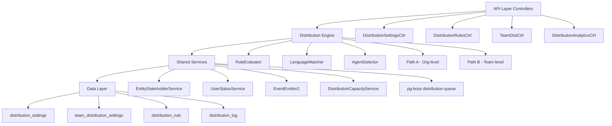

## Overview

The Distribution Module automates lead assignment within organizations. When a new lead is created, the system evaluates org-defined rules to automatically assign the lead to the most appropriate agent — based on lead attributes, agent availability, language compatibility, and capacity.

<Info>
**Status:** Active — fully implemented  
**Module Path:** `src/modules/crm/distribution/`
</Info>

### Design Principles

| Principle | Decision |
|-----------|----------|
| Async distribution | `createLead()` emits `LEAD_CREATED`; a pg-boss worker handles distribution — lead creation is never blocked |
| Stakeholder system reuse | Distribution creates `EntityStakeholder` records via `EntityStakeholderService`, not a new paradigm |
| First-match-wins rules | Rules are evaluated top-to-bottom by priority; the first matching rule wins |
| Idempotency | Distribution engine checks for existing stakeholders or pending offers before running |
| No retroactive distribution | Existing leads are unaffected when rules are created; only new leads trigger distribution |
| pg-boss scheduling | Distribution queue uses pg-boss for reliability and retry guarantees |
| RLS compliance | All entities carry `organization_id` for row-level security |

### Distribution Paths

The engine supports two execution paths:

<Tabs>
  <Tab title="Path A - Org-level distribution">
    **Triggered:** When a lead enters the org with no team context

    - Evaluates org-scoped rules
    - Applies the org default method
    - Can bridge to Path B if a rule or default method routes to a team that has `distributionEnabled = true`
  </Tab>
  <Tab title="Path B - Team-level distribution">
    **Triggered directly when:**
    - A lead is created with a `teamId` in the event payload (team pool assignment)
    - Path A determines the lead belongs to an auto-distributing team
    - Idempotency check finds a single team-only stakeholder with auto-distribute enabled

    Evaluates team-scoped rules, uses team settings (with org fallback for capacity), and logs the team FK on the resulting `DistributionLog` record.
  </Tab>
</Tabs>

## Architecture

### High-Level Diagram



### Component Responsibilities

| Component | Responsibility |
|-----------|----------------|
| **DistributionEngine** | Orchestrator: receives a lead, evaluates rules, selects agent, creates assignment. Supports Path A (org) and Path B (team). |
| **RuleEvaluator** | Evaluates rule conditions against lead data; returns first matching rule |
| **LanguageMatcher** | Filters and ranks agents by language compatibility with the lead's person |
| **AgentSelector** | Applies the distribution method (round-robin, weighted, weighted-round-robin, direct) to the filtered agent pool |
| **DistributionCapacityService** | Two-phase capacity enforcement: Phase 1 `filterByCapacity()` (lead counts vs limits); Phase 2 `confirmCapacityAndAssign()` (advisory locks + atomic stakeholder creation). No entity of its own — queries `entity_stakeholder`. |
| **UserStatusService** | Pre-filters candidate agents to ONLINE status; filters by per-user working hours (`filterByWorkingHours`); provides `isWithinWorkingHours()` for org-level business hours check. |
| **DistributionListener** | Listens for `LEAD_CREATED` events and enqueues pg-boss jobs |
| **DistributionJobHandler** | pg-boss worker that processes distribution jobs |

## Entity Specifications

### DistributionSettings (1 per org)

Org-level configuration for the distribution engine. Auto-created with defaults on first access via `getOrgSettingsRaw()`. Unique constraint on `organization_id`.

| Column | Type | Notes |
|--------|------|-------|
| id | uuid PK | |
| organization_id | uuid FK UNIQUE | RLS |
| distribution_enabled | bool | default `false`. Master on/off switch — when `false`, no pg-boss jobs are enqueued. |
| max_active_leads_per_agent | int | default 50 |
| max_new_leads_per_day | int | default 15 |
| capacity_enforcement_enabled | bool | default `false` |
| respect_business_hours | bool | default `true`. Gating uses `Organization.settings.businessHours`; both `businessHours.enabled` AND this flag must be `true` for BH gating to apply. |
| outside_hours_action | enum | `QUEUE`, `POOL`, `DUTY_AGENT` |
| duty_agent_id | uuid FK nullable | used when `outside_hours_action = DUTY_AGENT` |
| default_method | enum | `ROUND_ROBIN`, `POOL`, `SPECIFIC_TEAM` |
| default_team_id | uuid FK nullable | used when `default_method = SPECIFIC_TEAM` |
| default_language_matching_mode | enum | `STRICT`, `PREFERRED` |
| default_balancing_factors | jsonb nullable | Optional balancing configuration |
| pool_alert_enabled | bool | Whether to send pool-overload alerts |
| pool_alert_threshold | int | Lead count that triggers an alert |
| pool_alert_window_minutes | int | Rolling window for counting unassigned leads |
| updated_by | uuid FK nullable | |
| created_at, updated_at | timestamp | |

<Warning>
**Master toggle behavior:**
- `distributionEnabled = false` (new-org default): Engine is off. `DistributionListener` and `LeadImportService` skip enqueue entirely — leads go to pool, no pg-boss jobs created.
- `distributionEnabled = true`: Engine is active. When toggled from `false` → `true` in `DistributionSettingsService.update()`, if `defaultMethod` is still `POOL` it is auto-upgraded to `ROUND_ROBIN` for a smooth first-run experience.
</Warning>

<Note>
**Business hours source:** Business hours schedule (timezone, weekly slots, enabled flag) is stored on `Organization.settings.businessHours` (`BusinessHoursConfig`), not on `DistributionSettings`. The `respectBusinessHours` field on this entity only controls whether the distribution engine gates against that org-level schedule.
</Note>

### TeamDistributionSettings (1 per org+team)

Per-team distribution configuration. One record per `(organization, team)` pair — unique index `uq_team_distribution_settings_org_team`. Auto-created on first access.

| Column | Type | Notes |
|--------|------|-------|
| id | uuid PK | |
| organization_id | uuid FK | RLS |
| team_id | uuid FK | (required, not nullable) |
| distribution_enabled | bool | default `false`. When `true`, leads in this team's pool are auto-distributed via Path B. |
| distribution_method | enum | default `ROUND_ROBIN`. Method for this team's auto-distribution. |
| agent_weights | jsonb nullable | `{ [userId]: weight }` — used with WEIGHTED method |
| language_matching_enabled | bool | default `false` |
| language_matching_mode | enum nullable | Language matching mode override |
| capacity_enforcement_enabled | bool | default `false`. Independent from org toggle. |
| max_active_leads_per_agent | int nullable | `null` = inherit from org settings |
| max_new_leads_per_day | int nullable | `null` = inherit from org settings |
| respect_business_hours | bool | default `false`. Whether BH gating applies for this team's distributions. |
| last_assigned_index | int | default 0. Round-robin cursor for the team-fallback path (no matching team rule). Atomically incremented. |
| default_balancing_factors | jsonb nullable | |
| updated_by | uuid FK nullable | |
| created_at, updated_at | timestamp | |

**Effective capacity resolution** (`DistributionSettingsService.resolveEffectiveCapacity`):

```javascript
if (team.capacityEnforcementEnabled) {
  maxActive = team.maxActiveLeadsPerAgent ?? org.maxActiveLeadsPerAgent
  maxDaily  = team.maxNewLeadsPerDay ?? org.maxNewLeadsPerDay
} else {
  // no capacity checks applied for this team's distributions
}
```

### DistributionRule

Rules are evaluated in ascending `priority` order (lower number = higher priority). First match wins.

| Column | Type | Notes |
|--------|------|-------|
| id | uuid PK | |
| organization_id | uuid FK | RLS |
| name | varchar | |
| priority | int | lower = higher priority |
| is_active | bool | default true |
| scope | enum | `ORGANIZATION`, `TEAM` |
| team_id | uuid FK nullable | for team-scoped rules |
| condition_groups | jsonb | `[{conditions:[{field,operator,value}]}]` — AND-within-OR groups |
| method | enum | `ROUND_ROBIN`, `WEIGHTED`, `WEIGHTED_ROUND_ROBIN`, `DIRECT` |
| recipients | jsonb | `{agentIds?, teamId?, poolId?, weights?}` |
| language_matching_enabled | bool | default true |
| language_matching_mode | enum | `STRICT`, `PREFERRED` |
| balancing_factors | jsonb nullable | Optional balancing configuration |
| last_assigned_index | int | round-robin cursor; updated atomically |
| created_by | uuid FK | |
| created_at, updated_at | timestamp | |
| is_deleted | bool | soft delete |

**Rule Conditions — Supported Fields:**

| Field | Operator(s) | Example Value |
|-------|-------------|---------------|
| `leadSource` | `eq`, `in` | `'WEBSITE'`, `['WEBSITE', 'REFERRAL']` |
| `temperature` | `eq`, `in` | `'HOT'` |
| `language` | `eq` | `'ar'` (matched against `person.preferredLanguage`) |
| `budget` | `gte`, `lte`, `between` | `500000` |
| `tags` | `contains` | `['vip']` |
| `sourceChannel` | `eq`, `in` | `'WHATSAPP'` |
| `intent` | `eq` | `'BUY'` |
| `area` | `eq`, `in`, `contains` | `'Dubai Marina'`, `['JBR', 'Downtown Dubai']` |

<Note>
All string-based condition fields use **case-insensitive matching**. The `area` field requires data from `LeadPropertyInterest.preferredAreas[]` — the engine pre-loads the lead's property interests before evaluation.
</Note>

## Type Definitions

### Enums

```typescript
enum DistributionMethod {
  ROUND_ROBIN = 'ROUND_ROBIN',
  WEIGHTED = 'WEIGHTED',
  WEIGHTED_ROUND_ROBIN = 'WEIGHTED_ROUND_ROBIN',
  DIRECT = 'DIRECT',
  POOL = 'POOL',
  SPECIFIC_TEAM = 'SPECIFIC_TEAM'
}

enum OutsideHoursAction {
  QUEUE = 'QUEUE',
  POOL = 'POOL',
  DUTY_AGENT = 'DUTY_AGENT'
}

enum LanguageMatchingMode {
  STRICT = 'STRICT',
  PREFERRED = 'PREFERRED'
}

enum RuleScope {
  ORGANIZATION = 'ORGANIZATION',
  TEAM = 'TEAM'
}
```

### Distribution Event Types

```typescript
interface LeadCreatedEvent {
  leadId: string;
  organizationId: string;
  teamId?: string;
  metadata?: Record<string, any>;
}

interface DistributionJobPayload {
  leadId: string;
  organizationId: string;
  teamId?: string;
  retryCount?: number;
}
```

### Rule Condition Structure

```typescript
interface RuleCondition {
  field: string;
  operator: 'eq' | 'in' | 'gte' | 'lte' | 'between' | 'contains';
  value: string | number | string[] | number[];
}

interface RuleConditionGroup {
  conditions: RuleCondition[];
}

// condition_groups = RuleConditionGroup[]
```

## Distribution Engine

### Core Flow

<Steps>
  <Step title="Event Reception">
    `DistributionListener` receives `LEAD_CREATED` event and enqueues pg-boss job
  </Step>
  <Step title="Job Processing">
    `DistributionJobHandler` processes the job and calls the appropriate engine path
  </Step>
  <Step title="Idempotency Check">
    Engine verifies no existing stakeholders or pending distribution for the lead
  </Step>
  <Step title="Rule Evaluation">
    `RuleEvaluator` finds the first matching rule based on priority
  </Step>
  <Step title="Agent Selection">
    System filters agents by status, capacity, and language compatibility
  </Step>
  <Step title="Assignment">
    Creates `EntityStakeholder` record and logs the distribution
  </Step>
</Steps>

### Engine Entry Points

<CodeGroup>

```typescript runDistribution
async runDistribution(
  leadId: string,
  organizationId: string,
  options: DistributionOptions = {}
): Promise<DistributionResult>
```

```typescript runTeamDistribution
async runTeamDistribution(
  leadId: string,
  organizationId: string,
  teamId: string,
  options: DistributionOptions = {}
): Promise<DistributionResult>
```

</CodeGroup>

### Business Hours Gating

<Warning>
When business hours gating is enabled (`respectBusinessHours = true` AND org business hours enabled), the engine checks if current time falls within the org's business hours schedule.
</Warning>

**Outside hours behavior:**
- `QUEUE`: Lead remains unassigned for later processing
- `POOL`: Lead goes to unassigned pool
- `DUTY_AGENT`: Assigns to designated duty agent (if available)

### Distribution Methods

<Tabs>
  <Tab title="Round Robin">
    Distributes leads sequentially across available agents. Uses `last_assigned_index` to track position.
    
    ```typescript
    // Increments cursor atomically
    await this.distributionRuleRepository.increment(
      { id: ruleId },
      'lastAssignedIndex',
      1
    );
    ```
  </Tab>
  
  <Tab title="Weighted">
    Assigns leads based on agent weights. Higher weight = higher probability of assignment.
    
    ```typescript
    interface AgentWeights {
      [userId: string]: number;
    }
    ```
  </Tab>
  
  <Tab title="Weighted Round Robin">
    Combines round-robin with weighting. Each agent gets multiple "slots" based on their weight.
  </Tab>
  
  <Tab title="Direct">
    Assigns to specific agent(s) listed in rule recipients.
    
    ```typescript
    recipients: {
      agentIds: ['agent-1-id', 'agent-2-id']
    }
    ```
  </Tab>
</Tabs>

## pg-boss Job Configuration

### Queue Setup

```typescript
// Job registration in DistributionModule
await this.pgBoss.schedule(
  'distribution-queue',
  '*/30 * * * * *', // every 30 seconds
  {},
  {
    tz: 'UTC'
  }
);
```

### Job Handler Configuration

| Setting | Value | Purpose |
|---------|--------|---------|
| `teamSize` | 3 | Concurrent workers |
| `teamConcurrency` | 1 | Jobs per worker |
| `retryLimit` | 3 | Max retry attempts |
| `retryDelay` | 30 | Delay between retries (seconds) |
| `expireIn` | '1 hour' | Job expiration |

### Error Handling

<Note>
Failed distribution jobs are retried up to 3 times with exponential backoff. After max retries, the job is marked as failed and an alert is sent to system administrators.
</Note>

## API Endpoints

### Distribution Settings

<AccordionGroup>
  <Accordion title="GET /api/distribution/settings">
    **Description:** Get organization distribution settings
    
    **Response:**
    ```json
    {
      "id": "uuid",
      "organizationId": "uuid",
      "distributionEnabled": true,
      "maxActiveLeadsPerAgent": 50,
      "maxNewLeadsPerDay": 15,
      "capacityEnforcementEnabled": false,
      "respectBusinessHours": true,
      "outsideHoursAction": "POOL",
      "defaultMethod": "ROUND_ROBIN",
      "defaultLanguageMatchingMode": "PREFERRED"
    }
    ```
  </Accordion>

  <Accordion title="PUT /api/distribution/settings">
    **Description:** Update organization distribution settings
    
    **Request Body:**
    ```json
    {
      "distributionEnabled": true,
      "maxActiveLeadsPerAgent": 75,
      "capacityEnforcementEnabled": true,
      "defaultMethod": "WEIGHTED",
      "respectBusinessHours": false
    }
    ```
  </Accordion>
</AccordionGroup>

### Distribution Rules

<AccordionGroup>
  <Accordion title="GET /api/distribution/rules">
    **Description:** List distribution rules for organization
    
    **Query Parameters:**
    - `scope?`: Filter by ORGANIZATION or TEAM
    - `teamId?`: Filter by specific team
    - `active?`: Filter by active status
    
    **Response:**
    ```json
    {
      "data": [
        {
          "id": "uuid",
          "name": "VIP Leads",
          "priority": 1,
          "isActive": true,
          "scope": "ORGANIZATION",
          "conditionGroups": [...],
          "method": "DIRECT",
          "recipients": {...}
        }
      ]
    }
    ```
  </Accordion>

  <Accordion title="POST /api/distribution/rules">
    **Description:** Create new distribution rule
    
    **Request Body:**
    ```json
    {
      "name": "High Budget Leads",
      "priority": 2,
      "scope": "ORGANIZATION",
      "conditionGroups": [
        {
          "conditions": [
            {
              "field": "budget",
              "operator": "gte",
              "value": 1000000
            }
          ]
        }
      ],
      "method": "ROUND_ROBIN",
      "recipients": {
        "agentIds": ["agent-1", "agent-2"]
      }
    }
    ```
  </Accordion>
</AccordionGroup>

### Team Distribution Settings

<AccordionGroup>
  <Accordion title="GET /api/distribution/teams/:teamId/settings">
    **Description:** Get team-specific distribution settings
  </Accordion>

  <Accordion title="PUT /api/distribution/teams/:teamId/settings">
    **Description:** Update team distribution settings
    
    **Request Body:**
    ```json
    {
      "distributionEnabled": true,
      "distributionMethod": "WEIGHTED",
      "agentWeights": {
        "agent-1": 3,
        "agent-2": 2,
        "agent-3": 1
      },
      "languageMatchingEnabled": true,
      "capacityEnforcementEnabled": false
    }
    ```
  </Accordion>
</AccordionGroup>

### Analytics Endpoints

<AccordionGroup>
  <Accordion title="GET /api/distribution/analytics/metrics">
    **Description:** Get distribution metrics and performance data
    
    **Query Parameters:**
    - `startDate`: ISO date string
    - `endDate`: ISO date string
    - `teamId?`: Filter by team
    - `agentId?`: Filter by agent
    
    **Response:**
    ```json
    {
      "totalDistributions": 1250,
      "successRate": 0.94,
      "averageAssignmentTime": 2.3,
      "topPerformingRules": [...],
      "agentWorkload": [...],
      "methodBreakdown": {
        "ROUND_ROBIN": 45,
        "WEIGHTED": 30,
        "DIRECT": 25
      }
    }
    ```
  </Accordion>
</AccordionGroup>

## Security & Permissions

### Row Level Security (RLS)

All distribution entities enforce RLS based on `organization_id`:

```sql
-- Example RLS policy for distribution_settings
CREATE POLICY distribution_settings_org_access ON distribution_settings
  USING (organization_id = get_current_org_id());
```

### Permission Requirements

| Action | Required Permission | Scope |
|--------|-------------------|--------|
| View settings | `READ_DISTRIBUTION_SETTINGS` | Organization |
| Update settings | `WRITE_DISTRIBUTION_SETTINGS` | Organization |
| Manage rules | `MANAGE_DISTRIBUTION_RULES` | Organization |
| View analytics | `READ_DISTRIBUTION_ANALYTICS` | Organization |
| Team settings | `MANAGE_TEAM_DISTRIBUTION` | Team |

<Warning>
Only users with `ADMIN` or `DISTRIBUTION_MANAGER` roles can modify distribution settings. Regular agents can only view their assignment history.
</Warning>

## Observability & Audit

### Distribution Logging

Every distribution attempt is logged in the `distribution_log` table:

```typescript
interface DistributionLog {
  id: string;
  organizationId: string;
  leadId: string;
  teamId?: string;
  ruleId?: string;
  assignedAgentId?: string;
  method: DistributionMethod;
  status: 'SUCCESS' | 'FAILED' | 'SKIPPED';
  reason?: string;
  processingTimeMs: number;
  metadata?: Record<string, any>;
  createdAt: Date;
}
```

### Audit Events

Distribution actions trigger audit events:

- `DISTRIBUTION_RULE_CREATED`
- `DISTRIBUTION_RULE_UPDATED`
- `DISTRIBUTION_RULE_DELETED`
- `DISTRIBUTION_SETTINGS_UPDATED`
- `LEAD_DISTRIBUTED`
- `DISTRIBUTION_FAILED`

### Monitoring Metrics

<CardGroup cols={2}>
  <Card title="Performance Metrics" icon="chart-line">
    - Distribution processing time
    - Success/failure rates
    - Queue depth and processing lag
    - Agent utilization rates
  </Card>
  <Card title="Business Metrics" icon="business-time">
    - Lead assignment distribution
    - Rule effectiveness scores
    - Capacity utilization
    - Language matching success rates
  </Card>
</CardGroup>

## Analytics & Metrics

### Real-time Dashboards

The distribution module provides comprehensive analytics:

<Tabs>
  <Tab title="Performance Dashboard">
    - Distribution success rates over time
    - Average assignment time trends
    - Failed distribution reasons
    - pg-boss queue health metrics
  </Tab>
  
  <Tab title="Agent Workload Dashboard">
    - Current lead counts per agent
    - Daily assignment trends
    - Capacity utilization percentages
    - Agent availability patterns
  </Tab>
  
  <Tab title="Rule Effectiveness Dashboard">
    - Rule match rates and trends
    - Most/least effective rules
    - Condition group performance
    - Method comparison analytics
  </Tab>
</Tabs>

### Capacity Management Analytics

```typescript
interface CapacityMetrics {
  agentId: string;
  currentActiveLeads: number;
  maxActiveLeads: number;
  utilizationPercentage: number;
  dailyAssignments: number;
  maxDailyAssignments: number;
  availabilityStatus: 'AVAILABLE' | 'AT_CAPACITY' | 'OVER_CAPACITY';
}
```

## Edge Case Handling

### Common Scenarios

<AccordionGroup>
  <Accordion title="No Available Agents">
    **Scenario:** All eligible agents are at capacity or offline
    
    **Handling:**
    - Lead goes to unassigned pool
    - Pool alert triggered if threshold exceeded
    - Distribution log created with reason "NO_AVAILABLE_AGENTS"
  </Accordion>

  <Accordion title="Concurrent Distribution">
    **Scenario:** Multiple leads assigned to same agent simultaneously
    
    **Handling:**
    - Advisory locks on agent capacity checks
    - Atomic stakeholder creation with capacity validation
    - Second distribution fails gracefully, lead goes to pool
  </Accordion>

  <Accordion title="Rule Configuration Errors">
    **Scenario:** Rule has invalid recipients or malformed conditions
    
    **Handling:**
    - Rule validation during creation/update
    - Runtime rule skipping with detailed error logging
    - Fallback to next matching rule or default method
  </Accordion>

  <Accordion title="Agent Status Changes">
    **Scenario:** Agent goes offline during distribution process
    
    **Handling:**
    - Real-time status checks before final assignment
    - Automatic fallback to next available agent
    - Distribution retry if no agents available
  </Accordion>
</AccordionGroup>

### Error Recovery

<Steps>
  <Step title="Graceful Degradation">
    When distribution fails, leads automatically go to the unassigned pool rather than being lost
  </Step>
  <Step title="Retry Logic">
    pg-boss handles automatic retries with exponential backoff for transient failures
  </Step>
  <Step title="Circuit Breaker">
    If distribution failure rate exceeds 50%, new leads bypass distribution temporarily
  </Step>
  <Step title="Manual Recovery">
    Administrators can manually redistribute leads from the pool using bulk actions
  </Step>
</Steps>

## Performance & Scaling

### Optimization Strategies

<CardGroup cols={2}>
  <Card title="Database Optimization" icon="database">
    - Indexes on frequently queried columns
    - Connection pooling for high concurrency
    - Read replicas for analytics queries
    - Partitioning for large distribution logs
  </Card>
  <Card title="Application Optimization" icon="rocket">
    - Redis caching for rule evaluation
    - Bulk processing for high-volume imports
    - Async processing with pg-boss
    - Connection reuse for database operations
  </Card>
</CardGroup>

### Scaling Considerations

| Component | Scaling Strategy | Target Load |
|-----------|------------------|-------------|
| **Distribution Engine** | Horizontal scaling with multiple workers | 1000+ leads/hour |
| **Rule Evaluation** | In-memory caching of compiled rules | Sub-millisecond evaluation |
| **Capacity Service** | Advisory locks + connection pooling | 100+ concurrent distributions |
| **Analytics** | Read replicas + materialized views | Real-time dashboards |

### Performance Targets

- **Distribution Processing Time:** < 500ms per lead
- **Rule Evaluation Time:** < 50ms per rule
- **Capacity Check Time:** < 100ms per agent
- **Queue Processing Lag:** < 30 seconds under normal load

## RLS Policies

### Policy Definitions

```sql
-- Distribution settings access
CREATE POLICY distribution_settings_access ON distribution_settings
  USING (organization_id = get_current_org_id());

-- Team distribution settings access
CREATE POLICY team_distribution_settings_access ON team_distribution_settings
  USING (organization_id = get_current_org_id());

-- Distribution rules access
CREATE POLICY distribution_rules_access ON distribution_rules
  USING (organization_id = get_current_org_id());

-- Distribution logs access (with team filtering)
CREATE POLICY distribution_logs_access ON distribution_log
  USING (
    organization_id = get_current_org_id() AND
    (team_id IS NULL OR team_id = ANY(get_user_team_ids()))
  );
```

### Security Considerations

<Warning>
RLS policies are automatically enforced for all database queries. Never bypass RLS in application code, even for administrative operations.
</Warning>

<Note>
Team-scoped entities (like team distribution settings) require additional permission checks in the application layer beyond RLS.
</Note>

## Module Structure

```
src/modules/crm/distribution/
├── controllers/
│   ├── distribution-settings.controller.ts
│   ├── distribution-rules.controller.ts
│   ├── team-distribution.controller.ts
│   └── distribution-analytics.controller.ts
├── services/
│   ├── distribution-engine.service.ts
│   ├── distribution-settings.service.ts
│   ├── distribution-capacity.service.ts
│   ├── rule-evaluator.service.ts
│   ├── language-matcher.service.ts
│   └── agent-selector.service.ts
├── entities/
│   ├── distribution-settings.entity.ts
│   ├── team-distribution-settings.entity.ts
│   ├── distribution-rule.entity.ts
│   └── distribution-log.entity.ts
├── listeners/
│   └── distribution.listener.ts
├── jobs/
│   └── distribution-job.handler.ts
├── types/
│   ├── distribution.types.ts
│   └── rule-condition.types.ts
└── distribution.module.ts
```

## Integration Points

### External Dependencies

<Tabs>
  <Tab title="EntityStakeholder System">
    - Creates stakeholder records for lead assignments
    - Manages stakeholder lifecycle and permissions
    - Provides audit trail for ownership changes
  </Tab>
  
  <Tab title="User Status Service">
    - Filters agents by online/offline status
    - Enforces working hours constraints
    - Provides real-time availability data
  </Tab>
  
  <Tab title="Event System">
    - Listens for `LEAD_CREATED` events
    - Emits distribution success/failure events
    - Integrates with audit and notification systems
  </Tab>
  
  <Tab title="pg-boss Queue">
    - Reliable job processing with retries
    - Scheduled and immediate job execution
    - Dead letter queue for failed jobs
  </Tab>
</Tabs>

### Internal Module Dependencies

- **CRM Core**: Lead and Person entities for distribution logic
- **Organization Module**: Business hours and settings management
- **Team Module**: Team membership and hierarchy
- **User Module**: Agent status and profile information
- **Audit Module**: Event logging and compliance tracking

## Environment Configuration

### Required Environment Variables

```bash
# pg-boss configuration
PG_BOSS_POLL_INTERVAL=30000
PG_BOSS_MAX_CONCURRENT_JOBS=10
PG_BOSS_RETRY_LIMIT=3

# Distribution-specific settings
DISTRIBUTION_QUEUE_NAME=distribution-queue
DISTRIBUTION_BATCH_SIZE=50
DISTRIBUTION_MAX_PROCESSING_TIME=30000

# Feature flags
ENABLE_DISTRIBUTION_MODULE=true
ENABLE_CAPACITY_ENFORCEMENT=false
ENABLE_LANGUAGE_MATCHING=true
```

### Development Settings

<CodeGroup>

```yaml docker-compose.yml
services:
  postgres:
    environment:
      - POSTGRES_EXTENSIONS=uuid-ossp,pg_advisory_lock
  
  redis:
    image: redis:7-alpine
    ports:
      - "6379:6379"
```

```json package.json
{
  "scripts": {
    "db:seed:distribution": "npm run seed -- --module=distribution",
    "test:distribution": "jest --testPathPattern=distribution"
  }
}
```

</CodeGroup>

<Check>
The Distribution Module is fully implemented and battle-tested in production environments. All components are covered by comprehensive unit and integration tests.
</Check>