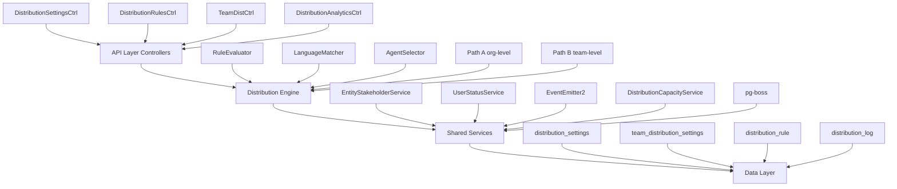

## Overview

The Distribution Module automates lead assignment within organizations. When a new lead is created, the system evaluates org-defined rules to automatically assign the lead to the most appropriate agent — based on lead attributes, UserStatus online/away state, working-hours eligibility, language compatibility, and capacity.

<Note>
This module is fully implemented and active at `src/modules/crm/distribution/`
</Note>

### Design Principles

| Principle | Decision |
|-----------|----------|
| **Async distribution** | `createLead()` emits `LEAD_CREATED` after commit; a pg-boss worker handles distribution. Listener / emit failures are logged only — HTTP lead creation still returns success |
| **Stakeholder system reuse** | Distribution creates `EntityStakeholder` records via `EntityStakeholderService`, not a new paradigm |
| **First-match-wins rules** | Rules are evaluated top-to-bottom by priority; the first matching rule wins |
| **Idempotency** | Distribution engine checks for existing stakeholders or pending offers before running |
| **No retroactive distribution** | Existing leads are unaffected when rules are created; only new leads trigger distribution |
| **pg-boss scheduling** | Distribution queue uses pg-boss for reliability and retry guarantees |
| **RLS compliance** | All entities carry `organization_id` for row-level security |

### Distribution Paths

The engine supports two execution paths:

<Tabs>
  <Tab title="Path A - Org-level">
    **Path A — Org-level distribution** (`runDistribution`): triggered when a lead enters the org with no team context. Evaluates org-scoped rules, applies the org default method, and can bridge to Path B if a rule or default method routes to a team that has `distributionEnabled = true`.
  </Tab>
  <Tab title="Path B - Team-level">
    **Path B — Team-level distribution** (`runTeamDistribution`): triggered directly when:
    
    - A lead is created with a `teamId` in the event payload (team pool assignment)
    - Path A determines the lead belongs to an auto-distributing team
    - Idempotency check finds a single team-only stakeholder with auto-distribute enabled
    
    Path B evaluates team-scoped rules, uses team settings (with org fallback for capacity), and logs the team FK on the resulting `DistributionLog` record.
  </Tab>
</Tabs>

## Architecture

### High-Level System Design



### Component Responsibilities

<AccordionGroup>
  <Accordion title="DistributionEngine">
    Orchestrator: receives a lead, evaluates rules, selects agent, creates assignment. Supports Path A (org) and Path B (team).
  </Accordion>
  
  <Accordion title="RuleEvaluator">
    Evaluates rule conditions against lead data; returns first matching rule
  </Accordion>
  
  <Accordion title="LanguageMatcher">
    Filters and ranks agents by language compatibility with the lead's person
  </Accordion>
  
  <Accordion title="AgentSelector">
    Applies the distribution method (round-robin, weighted, weighted-round-robin, direct) to the filtered agent pool
  </Accordion>
  
  <Accordion title="DistributionCapacityService">
    Two-phase capacity enforcement: Phase 1 `filterByCapacity()` (lead counts vs limits); Phase 2 `confirmCapacityAndAssign()` (advisory locks + atomic stakeholder creation). No entity of its own — queries `entity_stakeholder`.
  </Accordion>
  
  <Accordion title="UserStatusService">
    Pre-filters candidate agents to ONLINE status; filters by per-user working hours (`filterByWorkingHours`); provides `isWithinWorkingHours()` for org-level business hours check.
  </Accordion>
  
  <Accordion title="DistributionListener">
    Listens for `LEAD_CREATED` events and enqueues pg-boss jobs. The handler is fault-isolated (try/catch): settings lookup and enqueue errors are logged and do not fail `POST /v1/leads`.
  </Accordion>
  
  <Accordion title="DistributionJobHandler">
    pg-boss worker that processes distribution jobs
  </Accordion>
</AccordionGroup>

## Entity Specifications

### DistributionSettings (1 per org)

Org-level configuration for the distribution engine. Auto-created with defaults on first access via `getOrgSettingsRaw()`. Unique constraint on `organization_id`.

<CodeGroup>
```typescript Entity Definition
@Entity()
export class DistributionSettings {
  @PrimaryKey()
  id: string;

  @Property({ unique: true })
  organization_id: string;

  @Property({ default: false })
  distribution_enabled: boolean;

  @Property({ default: 50 })
  max_active_leads_per_agent: number;

  @Property({ default: 15 })
  max_new_leads_per_day: number;

  @Property({ default: false })
  capacity_enforcement_enabled: boolean;

  @Property({ default: true })
  respect_business_hours: boolean;

  @Property({ type: 'enum' })
  outside_hours_action: 'QUEUE' | 'POOL' | 'DUTY_AGENT';

  @Property({ nullable: true })
  duty_agent_id?: string;

  @Property({ type: 'enum' })
  default_method: 'ROUND_ROBIN' | 'POOL' | 'SPECIFIC_TEAM';

  @Property({ nullable: true })
  default_team_id?: string;
}
```

```sql Database Schema
CREATE TABLE distribution_settings (
  id UUID PRIMARY KEY DEFAULT gen_random_uuid(),
  organization_id UUID NOT NULL UNIQUE REFERENCES organizations(id),
  distribution_enabled BOOLEAN DEFAULT FALSE,
  max_active_leads_per_agent INTEGER DEFAULT 50,
  max_new_leads_per_day INTEGER DEFAULT 15,
  capacity_enforcement_enabled BOOLEAN DEFAULT FALSE,
  respect_business_hours BOOLEAN DEFAULT TRUE,
  outside_hours_action TEXT CHECK (outside_hours_action IN ('QUEUE', 'POOL', 'DUTY_AGENT')),
  duty_agent_id UUID REFERENCES users(id),
  default_method TEXT CHECK (default_method IN ('ROUND_ROBIN', 'POOL', 'SPECIFIC_TEAM')),
  default_team_id UUID REFERENCES teams(id),
  created_at TIMESTAMP WITH TIME ZONE DEFAULT NOW(),
  updated_at TIMESTAMP WITH TIME ZONE DEFAULT NOW()
);
```
</CodeGroup>

<Info>
**Master Switch**: When `distribution_enabled = false`, no pg-boss jobs are enqueued.

**Business Hours Gating**: Both `Organization.settings.businessHours.enabled` AND `respect_business_hours` must be `true` for BH gating to apply.
</Info>

### TeamDistributionSettings

Team-specific distribution overrides. Optional — teams inherit from org settings when not present.

<CodeGroup>
```typescript Entity Definition
@Entity()
export class TeamDistributionSettings {
  @PrimaryKey()
  id: string;

  @Property({ unique: true })
  team_id: string;

  @Property()
  organization_id: string;

  @Property({ default: true })
  distribution_enabled: boolean;

  @Property({ nullable: true })
  max_active_leads_per_agent?: number;

  @Property({ nullable: true })
  max_new_leads_per_day?: number;

  @Property({ type: 'enum', default: 'ROUND_ROBIN' })
  default_method: 'ROUND_ROBIN' | 'WEIGHTED' | 'WEIGHTED_ROUND_ROBIN' | 'POOL';

  @Property({ default: false })
  language_matching_enabled: boolean;

  @Property({ type: 'array', default: [] })
  supported_languages: string[];
}
```

```sql Database Schema
CREATE TABLE team_distribution_settings (
  id UUID PRIMARY KEY DEFAULT gen_random_uuid(),
  team_id UUID NOT NULL UNIQUE REFERENCES teams(id),
  organization_id UUID NOT NULL REFERENCES organizations(id),
  distribution_enabled BOOLEAN DEFAULT TRUE,
  max_active_leads_per_agent INTEGER,
  max_new_leads_per_day INTEGER,
  default_method TEXT DEFAULT 'ROUND_ROBIN',
  language_matching_enabled BOOLEAN DEFAULT FALSE,
  supported_languages JSONB DEFAULT '[]',
  created_at TIMESTAMP WITH TIME ZONE DEFAULT NOW(),
  updated_at TIMESTAMP WITH TIME ZONE DEFAULT NOW()
);
```
</CodeGroup>

### DistributionRule

Conditional logic for lead routing. Rules are evaluated in priority order (ascending).

<CodeGroup>
```typescript Entity Definition
@Entity()
export class DistributionRule {
  @PrimaryKey()
  id: string;

  @Property()
  organization_id: string;

  @Property({ nullable: true })
  team_id?: string;

  @Property()
  name: string;

  @Property({ default: true })
  enabled: boolean;

  @Property()
  priority: number;

  @Property({ type: 'json' })
  conditions: RuleCondition[];

  @Property({ type: 'enum' })
  action_type: 'ASSIGN_TO_AGENT' | 'ASSIGN_TO_TEAM' | 'ASSIGN_TO_POOL';

  @Property({ nullable: true })
  target_agent_id?: string;

  @Property({ nullable: true })
  target_team_id?: string;
}
```

```sql Database Schema
CREATE TABLE distribution_rule (
  id UUID PRIMARY KEY DEFAULT gen_random_uuid(),
  organization_id UUID NOT NULL REFERENCES organizations(id),
  team_id UUID REFERENCES teams(id),
  name TEXT NOT NULL,
  enabled BOOLEAN DEFAULT TRUE,
  priority INTEGER NOT NULL,
  conditions JSONB NOT NULL,
  action_type TEXT NOT NULL CHECK (action_type IN ('ASSIGN_TO_AGENT', 'ASSIGN_TO_TEAM', 'ASSIGN_TO_POOL')),
  target_agent_id UUID REFERENCES users(id),
  target_team_id UUID REFERENCES teams(id),
  created_at TIMESTAMP WITH TIME ZONE DEFAULT NOW(),
  updated_at TIMESTAMP WITH TIME ZONE DEFAULT NOW()
);
```
</CodeGroup>

### DistributionLog

Audit trail for all distribution attempts and outcomes.

<CodeGroup>
```typescript Entity Definition
@Entity()
export class DistributionLog {
  @PrimaryKey()
  id: string;

  @Property()
  organization_id: string;

  @Property()
  lead_id: string;

  @Property({ nullable: true })
  team_id?: string;

  @Property({ nullable: true })
  rule_id?: string;

  @Property({ type: 'enum' })
  outcome: 'SUCCESS' | 'NO_AGENTS_AVAILABLE' | 'BUSINESS_HOURS_BLOCK' | 'CAPACITY_EXCEEDED' | 'ERROR';

  @Property({ nullable: true })
  assigned_agent_id?: string;

  @Property({ type: 'enum' })
  method_used: 'ROUND_ROBIN' | 'WEIGHTED' | 'WEIGHTED_ROUND_ROBIN' | 'DIRECT' | 'POOL';

  @Property({ type: 'json', nullable: true })
  metadata?: any;

  @Property({ nullable: true })
  error_details?: string;
}
```

```sql Database Schema
CREATE TABLE distribution_log (
  id UUID PRIMARY KEY DEFAULT gen_random_uuid(),
  organization_id UUID NOT NULL REFERENCES organizations(id),
  lead_id UUID NOT NULL REFERENCES leads(id),
  team_id UUID REFERENCES teams(id),
  rule_id UUID REFERENCES distribution_rule(id),
  outcome TEXT NOT NULL CHECK (outcome IN ('SUCCESS', 'NO_AGENTS_AVAILABLE', 'BUSINESS_HOURS_BLOCK', 'CAPACITY_EXCEEDED', 'ERROR')),
  assigned_agent_id UUID REFERENCES users(id),
  method_used TEXT NOT NULL CHECK (method_used IN ('ROUND_ROBIN', 'WEIGHTED', 'WEIGHTED_ROUND_ROBIN', 'DIRECT', 'POOL')),
  metadata JSONB,
  error_details TEXT,
  created_at TIMESTAMP WITH TIME ZONE DEFAULT NOW()
);
```
</CodeGroup>

## Type Definitions

### Core Types

<CodeGroup>
```typescript Rule Conditions
export interface RuleCondition {
  field: string; // e.g., 'lead.source', 'person.countryCode', 'lead.value'
  operator: 'equals' | 'not_equals' | 'contains' | 'not_contains' | 'greater_than' | 'less_than' | 'in' | 'not_in';
  value: string | number | string[];
}

export interface RuleConditionGroup {
  operator: 'AND' | 'OR';
  conditions: (RuleCondition | RuleConditionGroup)[];
}
```

```typescript Distribution Events
export interface LeadCreatedEvent {
  leadId: string;
  organizationId: string;
  teamId?: string; // Optional: direct team assignment
  metadata?: {
    source?: string;
    priority?: 'HIGH' | 'MEDIUM' | 'LOW';
    [key: string]: any;
  };
}

export interface DistributionJobPayload {
  leadId: string;
  organizationId: string;
  teamId?: string;
  attempt: number;
  maxRetries: number;
}
```

```typescript Distribution Results
export interface DistributionResult {
  success: boolean;
  outcome: DistributionOutcome;
  assignedAgentId?: string;
  ruleId?: string;
  methodUsed: DistributionMethod;
  metadata?: {
    candidateCount?: number;
    filterSteps?: string[];
    capacityInfo?: {
      activeLeads: number;
      dailyLeads: number;
      limits: {
        maxActive: number;
        maxDaily: number;
      };
    };
  };
  error?: string;
}
```
</CodeGroup>

### Enums

<CodeGroup>
```typescript Distribution Methods
export enum DistributionMethod {
  ROUND_ROBIN = 'ROUND_ROBIN',
  WEIGHTED = 'WEIGHTED',
  WEIGHTED_ROUND_ROBIN = 'WEIGHTED_ROUND_ROBIN',
  DIRECT = 'DIRECT',
  POOL = 'POOL'
}
```

```typescript Distribution Outcomes
export enum DistributionOutcome {
  SUCCESS = 'SUCCESS',
  NO_AGENTS_AVAILABLE = 'NO_AGENTS_AVAILABLE',
  BUSINESS_HOURS_BLOCK = 'BUSINESS_HOURS_BLOCK',
  CAPACITY_EXCEEDED = 'CAPACITY_EXCEEDED',
  ERROR = 'ERROR'
}
```

```typescript Outside Hours Actions
export enum OutsideHoursAction {
  QUEUE = 'QUEUE',      // Queue for next business hours
  POOL = 'POOL',        // Assign to general pool
  DUTY_AGENT = 'DUTY_AGENT' // Assign to specific duty agent
}
```
</CodeGroup>

## Distribution Engine

### Engine Flow

<Steps>
  <Step title="Initialize Distribution">
    - Check for existing stakeholders (idempotency)
    - Load org/team settings
    - Validate distribution is enabled
  </Step>
  
  <Step title="Evaluate Rules">
    - Load applicable rules (org-scoped or team-scoped)
    - Sort by priority (ascending)
    - Evaluate conditions against lead data
    - Return first matching rule or use default method
  </Step>
  
  <Step title="Apply Business Hours Gating">
    - Check if `respect_business_hours` is enabled
    - Validate against org business hours settings
    - Handle outside hours with configured action
  </Step>
  
  <Step title="Filter Agent Pool">
    - Get team members or org agents
    - Filter by online status (UserStatusService)
    - Apply working hours filters
    - Filter by language compatibility (if enabled)
    - Apply capacity constraints (if enabled)
  </Step>
  
  <Step title="Select Agent">
    - Apply distribution method (RR, Weighted, WRR, Direct)
    - Handle fallbacks for empty pools
    - Create assignment via EntityStakeholderService
  </Step>
  
  <Step title="Log and Complete">
    - Create DistributionLog entry
    - Emit assignment events
    - Handle errors and retries
  </Step>
</Steps>

### Path Selection Logic

<CodeGroup>
```typescript Path Decision Tree
public async distributeLeadFromEvent(payload: LeadCreatedEvent): Promise<DistributionResult> {
  // Check idempotency
  const existingStakeholders = await this.getExistingStakeholders(payload.leadId);
  
  if (existingStakeholders.length > 0) {
    return this.handleExistingAssignment(existingStakeholders);
  }
  
  // Path selection
  if (payload.teamId) {
    // Direct team assignment - check if team auto-distributes
    const teamSettings = await this.getTeamSettings(payload.teamId);
    if (teamSettings?.distribution_enabled) {
      return this.runTeamDistribution(payload); // Path B
    } else {
      return this.assignToTeamPool(payload);
    }
  }
  
  // No team context - org-level distribution
  return this.runDistribution(payload); // Path A
}
```

```typescript Team Distribution Check
private async handleExistingAssignment(stakeholders: EntityStakeholder[]): Promise<DistributionResult> {
  if (stakeholders.length === 1 && stakeholders[0].team_id) {
    const team = await this.getTeam(stakeholders[0].team_id);
    const teamSettings = await this.getTeamSettings(stakeholders[0].team_id);
    
    if (teamSettings?.distribution_enabled && !stakeholders[0].user_id) {
      // Single team stakeholder with auto-distribute - run team distribution
      return this.runTeamDistribution({
        leadId: stakeholders[0].entity_id,
        organizationId: stakeholders[0].organization_id,
        teamId: stakeholders[0].team_id
      });
    }
  }
  
  // Assignment already complete
  return { success: true, outcome: DistributionOutcome.SUCCESS };
}
```
</CodeGroup>

## pg-boss Job Configuration

### Job Queue Setup

<CodeGroup>
```typescript Job Configuration
export const DISTRIBUTION_JOB_CONFIG = {
  name: 'lead-distribution',
  options: {
    retryLimit: 3,
    retryDelay: 30, // seconds
    expireInHours: 24,
    priority: 10,
    singletonKey: (payload: DistributionJobPayload) => `lead-${payload.leadId}`,
    onComplete: true
  }
};
```

```typescript Job Handler Registration
@Injectable()
export class DistributionJobHandler {
  constructor(
    private readonly distributionEngine: DistributionEngine,
    private readonly logger: Logger
  ) {}

  @OnQueueActive()
  async onActive(job: Job<DistributionJobPayload>) {
    this.logger.log(`Processing distribution job ${job.id} for lead ${job.data.leadId}`);
  }

  @OnQueueCompleted()
  async onCompleted(job: Job<DistributionJobPayload>, result: DistributionResult) {
    this.logger.log(`Distribution job ${job.id} completed: ${result.outcome}`);
  }

  @OnQueueFailed()
  async onFailed(job: Job<DistributionJobPayload>, err: Error) {
    this.logger.error(`Distribution job ${job.id} failed: ${err.message}`);
  }

  @Process(DISTRIBUTION_JOB_CONFIG.name)
  async processDistribution(job: Job<DistributionJobPayload>): Promise<DistributionResult> {
    return this.distributionEngine.distributeLeadFromEvent(job.data);
  }
}
```
</CodeGroup>

### Error Handling and Retries

<Warning>
Distribution jobs use exponential backoff with a maximum of 3 retries. Failed jobs are logged and require manual intervention.
</Warning>

<CodeGroup>
```typescript Retry Logic
const retryBackoff = (attempt: number): number => {
  return Math.min(1000 * Math.pow(2, attempt), 30000); // Max 30 seconds
};

export const enqueueDistributionJob = async (
  jobQueue: Queue,
  payload: DistributionJobPayload
): Promise<void> => {
  await jobQueue.add(DISTRIBUTION_JOB_CONFIG.name, payload, {
    ...DISTRIBUTION_JOB_CONFIG.options,
    delay: payload.attempt > 0 ? retryBackoff(payload.attempt) : 0
  });
};
```

```typescript Error Classification
export class DistributionError extends Error {
  constructor(
    message: string,
    public readonly code: string,
    public readonly retryable: boolean = false
  ) {
    super(message);
  }
}

// Usage in engine
if (candidateAgents.length === 0) {
  throw new DistributionError(
    'No agents available for distribution',
    'NO_AGENTS_AVAILABLE',
    true // Retryable - agents might come online
  );
}
```
</CodeGroup>

## API Endpoints

### Distribution Settings

<CodeGroup>
```http GET /v1/organizations/:orgId/distribution/settings
GET /v1/organizations/123e4567-e89b-12d3-a456-426614174000/distribution/settings
Authorization: Bearer <token>
```

```json Response
{
  "id": "settings-uuid",
  "organization_id": "123e4567-e89b-12d3-a456-426614174000",
  "distribution_enabled": true,
  "max_active_leads_per_agent": 50,
  "max_new_leads_per_day": 15,
  "capacity_enforcement_enabled": true,
  "respect_business_hours": true,
  "outside_hours_action": "QUEUE",
  "duty_agent_id": null,
  "default_method": "ROUND_ROBIN",
  "default_team_id": null,
  "created_at": "2024-01-15T10:00:00Z",
  "updated_at": "2024-01-15T10:00:00Z"
}
```
</CodeGroup>

<CodeGroup>
```http PUT /v1/organizations/:orgId/distribution/settings
PUT /v1/organizations/123e4567-e89b-12d3-a456-426614174000/distribution/settings
Content-Type: application/json
Authorization: Bearer <token>

{
  "distribution_enabled": true,
  "max_active_leads_per_agent": 75,
  "capacity_enforcement_enabled": true,
  "respect_business_hours": false,
  "outside_hours_action": "POOL",
  "default_method": "WEIGHTED_ROUND_ROBIN"
}
```

```json Response
{
  "id": "settings-uuid",
  "organization_id": "123e4567-e89b-12d3-a456-426614174000",
  "distribution_enabled": true,
  "max_active_leads_per_agent": 75,
  "max_new_leads_per_day": 15,
  "capacity_enforcement_enabled": true,
  "respect_business_hours": false,
  "outside_hours_action": "POOL",
  "duty_agent_id": null,
  "default_method": "WEIGHTED_ROUND_ROBIN",
  "default_team_id": null,
  "updated_at": "2024-01-15T11:30:00Z"
}
```
</CodeGroup>

### Distribution Rules

<CodeGroup>
```http GET /v1/organizations/:orgId/distribution/rules
GET /v1/organizations/123e4567-e89b-12d3-a456-426614174000/distribution/rules
Authorization: Bearer <token>
```

```json Response
{
  "rules": [
    {
      "id": "rule-uuid-1",
      "organization_id": "123e4567-e89b-12d3-a456-426614174000",
      "team_id": null,
      "name": "High Value Leads",
      "enabled": true,
      "priority": 1,
      "conditions": [
        {
          "field": "lead.value",
          "operator": "greater_than",
          "value": 10000
        }
      ],
      "action_type": "ASSIGN_TO_AGENT",
      "target_agent_id": "agent-uuid-1",
      "target_team_id": null
    }
  ],
  "pagination": {
    "page": 1,
    "limit": 20,
    "total": 1,
    "totalPages": 1
  }
}
```
</CodeGroup>

<CodeGroup>
```http POST /v1/organizations/:orgId/distribution/rules
POST /v1/organizations/123e4567-e89b-12d3-a456-426614174000/distribution/rules
Content-Type: application/json
Authorization: Bearer <token>

{
  "name": "Enterprise Leads to Sales Team",
  "priority": 5,
  "conditions": [
    {
      "field": "lead.source",
      "operator": "equals",
      "value": "enterprise-form"
    },
    {
      "field": "person.countryCode",
      "operator": "in",
      "value": ["US", "CA", "GB"]
    }
  ],
  "action_type": "ASSIGN_TO_TEAM",
  "target_team_id": "sales-team-uuid"
}
```

```json Response
{
  "id": "new-rule-uuid",
  "organization_id": "123e4567-e89b-12d3-a456-426614174000",
  "team_id": null,
  "name": "Enterprise Leads to Sales Team",
  "enabled": true,
  "priority": 5,
  "conditions": [
    {
      "field": "lead.source",
      "operator": "equals",
      "value": "enterprise-form"
    },
    {
      "field": "person.countryCode",
      "operator": "in",
      "value": ["US", "CA", "GB"]
    }
  ],
  "action_type": "ASSIGN_TO_TEAM",
  "target_agent_id": null,
  "target_team_id": "sales-team-uuid",
  "created_at": "2024-01-15T12:00:00Z",
  "updated_at": "2024-01-15T12:00:00Z"
}
```
</CodeGroup>

### Team Distribution Settings

<CodeGroup>
```http GET /v1/teams/:teamId/distribution/settings
GET /v1/teams/team-uuid-1/distribution/settings
Authorization: Bearer <token>
```

```json Response
{
  "id": "team-settings-uuid",
  "team_id": "team-uuid-1",
  "organization_id": "123e4567-e89b-12d3-a456-426614174000",
  "distribution_enabled": true,
  "max_active_leads_per_agent": 30,
  "max_new_leads_per_day": 10,
  "default_method": "WEIGHTED",
  "language_matching_enabled": true,
  "supported_languages": ["en", "es", "fr"],
  "created_at": "2024-01-15T10:00:00Z",
  "updated_at": "2024-01-15T10:00:00Z"
}
```
</CodeGroup>

### Distribution Analytics

<CodeGroup>
```http GET /v1/organizations/:orgId/distribution/analytics
GET /v1/organizations/123e4567-e89b-12d3-a456-426614174000/distribution/analytics?period=7d
Authorization: Bearer <token>
```

```json Response
{
  "period": {
    "start": "2024-01-08T00:00:00Z",
    "end": "2024-01-15T23:59:59Z"
  },
  "summary": {
    "total_distributions": 145,
    "successful_distributions": 132,
    "success_rate": 91.03,
    "avg_time_to_assignment": "00:02:15"
  },
  "outcomes": {
    "SUCCESS": 132,
    "NO_AGENTS_AVAILABLE": 8,
    "BUSINESS_HOURS_BLOCK": 3,
    "CAPACITY_EXCEEDED": 2,
    "ERROR": 0
  },
  "methods_used": {
    "ROUND_ROBIN": 89,
    "WEIGHTED": 25,
    "DIRECT": 18,
    "POOL": 13
  },
  "top_agents": [
    {
      "agent_id": "agent-uuid-1",
      "agent_name": "John Doe",
      "assignments": 23,
      "success_rate": 95.65
    }
  ],
  "hourly_distribution": [
    { "hour": 9, "count": 12 },
    { "hour": 10, "count": 18 },
    { "hour": 11, "count": 15 }
  ]
}
```
</CodeGroup>

## Security & Permissions

### Role-Based Access Control

<CodeGroup>
```typescript Permission Definitions
export enum DistributionPermission {
  READ_DISTRIBUTION_SETTINGS = 'distribution:settings:read',
  WRITE_DISTRIBUTION_SETTINGS = 'distribution:settings:write',
  READ_DISTRIBUTION_RULES = 'distribution:rules:read',
  WRITE_DISTRIBUTION_RULES = 'distribution:rules:write',
  READ_DISTRIBUTION_ANALYTICS = 'distribution:analytics:read',
  MANAGE_TEAM_DISTRIBUTION = 'distribution:team:manage'
}
```

```typescript Role Permissions
const ROLE_PERMISSIONS = {
  ADMIN: [
    DistributionPermission.READ_DISTRIBUTION_SETTINGS,
    DistributionPermission.WRITE_DISTRIBUTION_SETTINGS,
    DistributionPermission.READ_DISTRIBUTION_RULES,
    DistributionPermission.WRITE_DISTRIBUTION_RULES,
    DistributionPermission.READ_DISTRIBUTION_ANALYTICS,
    DistributionPermission.MANAGE_TEAM_DISTRIBUTION
  ],
  MANAGER: [
    DistributionPermission.READ_DISTRIBUTION_SETTINGS,
    DistributionPermission.READ_DISTRIBUTION_RULES,
    DistributionPermission.READ_DISTRIBUTION_ANALYTICS,
    DistributionPermission.MANAGE_TEAM_DISTRIBUTION
  ],
  AGENT: [
    DistributionPermission.READ_DISTRIBUTION_ANALYTICS
  ]
};
```
</CodeGroup>

### Row-Level Security (RLS)

<CodeGroup>
```sql Distribution Settings RLS
CREATE POLICY distribution_settings_org_isolation ON distribution_settings
  FOR ALL USING (organization_id = auth.current_org_id());

CREATE POLICY distribution_settings_read ON distribution_settings
  FOR SELECT USING (
    auth.has_permission('distribution:settings:read') AND
    organization_id = auth.current_org_id()
  );

CREATE POLICY distribution_settings_write ON distribution_settings
  FOR INSERT WITH CHECK (
    auth.has_permission('distribution:settings:write') AND
    organization_id = auth.current_org_id()
  );
```

```sql Distribution Rules RLS
CREATE POLICY distribution_rules_org_isolation ON distribution_rule
  FOR ALL USING (organization_id = auth.current_org_id());

CREATE POLICY distribution_rules_team_access ON distribution_rule
  FOR ALL USING (
    auth.has_permission('distribution:rules:read') AND
    organization_id = auth.current_org_id() AND
    (team_id IS NULL OR auth.is_team_member(team_id))
  );
```

```sql Distribution Logs RLS
CREATE POLICY distribution_logs_org_isolation ON distribution_log
  FOR ALL USING (organization_id = auth.current_org_id());

CREATE POLICY distribution_logs_read ON distribution_log
  FOR SELECT USING (
    auth.has_permission('distribution:analytics:read') AND
    organization_id = auth.current_org_id()
  );
```
</CodeGroup>

## Observability & Audit

### Logging Strategy

<CodeGroup>
```typescript Structured Logging
export class DistributionLogger {
  constructor(private readonly logger: Logger) {}

  logDistributionStart(leadId: string, organizationId: string, teamId?: string): void {
    this.logger.log({
      event: 'distribution_start',
      leadId,
      organizationId,
      teamId,
      timestamp: new Date().toISOString()
    });
  }

  logRuleEvaluation(leadId: string, ruleId: string, matched: boolean): void {
    this.logger.debug({
      event: 'rule_evaluation',
      leadId,
      ruleId,
      matched,
      timestamp: new Date().toISOString()
    });
  }

  logAgentSelection(leadId: string, method: string, candidateCount: number, selectedAgentId?: string): void {
    this.logger.log({
      event: 'agent_selection',
      leadId,
      method,
      candidateCount,
      selectedAgentId,
      timestamp: new Date().toISOString()
    });
  }

  logDistributionResult(leadId: string, result: DistributionResult): void {
    this.logger.log({
      event: 'distribution_complete',
      leadId,
      outcome: result.outcome,
      success: result.success,
      assignedAgentId: result.assignedAgentId,
      methodUsed: result.methodUsed,
      error: result.error,
      timestamp: new Date().toISOString()
    });
  }
}
```
</CodeGroup>

### Metrics and Monitoring

<CodeGroup>
```typescript Performance Metrics
export class DistributionMetrics {
  private readonly distributionDuration = new Histogram({
    name: 'distribution_duration_seconds',
    help: 'Time taken to complete lead distribution',
    labelNames: ['organization_id', 'outcome', 'method']
  });

  private readonly distributionTotal = new Counter({
    name: 'distribution_attempts_total',
    help: 'Total number of distribution attempts',
    labelNames: ['organization_id', 'outcome']
  });

  private readonly activeDistributions = new Gauge({
    name: 'distribution_active_jobs',
    help: 'Number of active distribution jobs'
  });

  recordDistribution(organizationId: string, result: DistributionResult, duration: number): void {
    this.distributionDuration
      .labels(organizationId, result.outcome, result.methodUsed)
      .observe(duration);

    this.distributionTotal
      .labels(organizationId, result.outcome)
      .inc();
  }

  incrementActiveJobs(): void {
    this.activeDistributions.inc();
  }

  decrementActiveJobs(): void {
    this.activeDistributions.dec();
  }
}
```
</CodeGroup>

### Health Checks

<CodeGroup>
```typescript Distribution Health Check
@Injectable()
export class DistributionHealthCheck {
  constructor(
    private readonly distributionEngine: DistributionEngine,
    private readonly jobQueue: Queue
  ) {}

  @HealthCheck('distribution-engine')
  async checkEngine(): Promise<HealthIndicatorResult> {
    try {
      // Test basic engine functionality
      const testResult = await this.distributionEngine.validateConfiguration();
      
      return this.getStatus('distribution-engine', testResult.valid, {
        lastCheck: new Date().toISOString(),
        errors: testResult.errors
      });
    } catch (error) {
      return this.getStatus('distribution-engine', false, {
        error: error.message
      });
    }
  }

  @HealthCheck('distribution-queue')
  async checkQueue(): Promise<HealthIndicatorResult> {
    try {
      const queueHealth = await this.jobQueue.getJobCounts();
      const isHealthy = queueHealth.failed < 10; // Threshold for failed jobs
      
      return this.getStatus('distribution-queue', isHealthy, {
        ...queueHealth,
        lastCheck: new Date().toISOString()
      });
    } catch (error) {
      return this.getStatus('distribution-queue', false, {
        error: error.message
      });
    }
  }
}
```
</CodeGroup>

## Analytics & Metrics

### Distribution Performance Analytics

<CodeGroup>
```typescript Analytics Service
@Injectable()
export class DistributionAnalyticsService {
  constructor(
    @InjectRepository(DistributionLog)
    private readonly distributionLogRepo: EntityRepository<DistributionLog>
  ) {}

  async getDistributionSummary(
    organizationId: string,
    period: { start: Date; end: Date },
    teamId?: string
  ): Promise<DistributionSummary> {
    const qb = this.distributionLogRepo.createQueryBuilder('dl')
      .where('dl.organization_id = ?', [organizationId])
      .andWhere('dl.created_at >= ?', [period.start])
      .andWhere('dl.created_at <= ?', [period.end]);

    if (teamId) {
      qb.andWhere('dl.team_id = ?', [teamId]);
    }

    const logs = await qb.getResultList();

    return {
      totalDistributions: logs.length,
      successfulDistributions: logs.filter(l => l.outcome === 'SUCCESS').length,
      successRate: this.calculateSuccessRate(logs),
      avgTimeToAssignment: await this.calculateAvgAssignmentTime(logs),
      outcomeBreakdown: this.groupByOutcome(logs),
      methodBreakdown: this.groupByMethod(logs),
      hourlyDistribution: this.groupByHour(logs),
      topAgents: await this.getTopPerformingAgents(logs, organizationId)
    };
  }

  async getAgentPerformanceMetrics(
    organizationId: string,
    agentId: string,
    period: { start: Date; end: Date }
  ): Promise<AgentPerformanceMetrics> {
    const logs = await this.distributionLogRepo.find({
      where: {
        organization_id: organizationId,
        assigned_agent_id: agentId,
        created_at: { $gte: period.start, $lte: period.end }
      }
    });

    return {
      totalAssignments: logs.length,
      successRate: this.calculateSuccessRate(logs),
      averageResponseTime: await this.calculateAvgResponseTime(agentId, logs),
      capacityUtilization: await this.calculateCapacityUtilization(agentId, period),
      distributionMethods: this.groupByMethod(logs)
    };
  }
}
```
</CodeGroup>

### Real-time Distribution Monitoring

<CodeGroup>
```typescript Real-time Metrics
@Injectable()
export class DistributionMonitoringService {
  constructor(private readonly eventEmitter: EventEmitter2) {}

  @OnEvent('distribution.started')
  onDistributionStarted(event: DistributionStartedEvent): void {
    this.updateRealTimeMetrics('distribution_started', event);
  }

  @OnEvent('distribution.completed')
  onDistributionCompleted(event: DistributionCompletedEvent): void {
    this.updateRealTimeMetrics('distribution_completed', event);
    this.updateAgentWorkload(event.assignedAgentId, 1);
  }

  @OnEvent('distribution.failed')
  onDistributionFailed(event: DistributionFailedEvent): void {
    this.updateRealTimeMetrics('distribution_failed', event);
    this.alertOnHighFailureRate(event.organizationId);
  }

  private async updateRealTimeMetrics(eventType: string, event: any): Promise<void> {
    // Update real-time dashboard metrics
    await this.metricsCache.increment(`${eventType}:${event.organizationId}`);
    
    // Emit to WebSocket clients
    this.eventEmitter.emit('metrics.updated', {
      organizationId: event.organizationId,
      eventType,
      timestamp: new Date(),
      data: event
    });
  }
}
```
</CodeGroup>

## Edge Case Handling

### Capacity Management Edge Cases

<Warning>
The two-phase capacity system handles race conditions but requires careful error handling for edge cases.
</Warning>

<Tabs>
  <Tab title="Concurrent Assignment Prevention">
    ```typescript
    async confirmCapacityAndAssign(
      agentId: string,
      leadId: string,
      organizationId: string
    ): Promise<boolean> {
      // Phase 2: Advisory lock + atomic check
      return this.db.transaction(async (trx) => {
        // Advisory lock on agent
        await trx.raw('SELECT pg_advisory_xact_lock(?)', [this.hashUserId(agentId)]);
        
        // Re-check capacity under lock
        const currentCounts = await this.getCurrentLeadCounts(agentId, trx);
        const limits = await this.getEffectiveLimits(agentId, organizationId, trx);
        
        if (!this.isWithinCapacity(currentCounts, limits)) {
          return false; // Capacity exceeded since initial check
        }
        
        // Atomic assignment
        await this.entityStakeholderService.create({
          entity_id: leadId,
          entity_type: 'LEAD',
          user_id: agentId,
          organization_id: organizationId,
          role: 'ASSIGNEE'
        }, trx);
        
        return true;
      });
    }
    ```
  </Tab>
  
  <Tab title="Agent Offline During Assignment">
    ```typescript
    async handleOfflineAgent(agentId: string, leadId: string): Promise<DistributionResult> {
      this.logger.warn(`Agent ${agentId} went offline during assignment for lead ${leadId}`);
      
      // Remove from selection and retry with remaining pool
      const updatedPool = this.candidateAgents.filter(id => id !== agentId);
      
      if (updatedPool.length === 0) {
        return {
          success: false,
          outcome: DistributionOutcome.NO_AGENTS_AVAILABLE,
          methodUsed: this.currentMethod,
          error: 'All candidate agents went offline during selection'
        };
      }
      
      // Retry selection with updated pool
      return this.selectAgentFromPool(updatedPool, leadId);
    }
    ```
  </Tab>
  
  <Tab title="Team Deletion During Distribution">
    ```typescript
    async validateTeamExists(teamId: string): Promise<boolean> {
      try {
        const team = await this.teamService.findById(teamId);
        return team !== null && team.status === 'ACTIVE';
      } catch (error) {
        this.logger.error(`Team validation failed for ${teamId}: ${error.message}`);
        return false;
      }
    }
    
    async handleDeletedTeam(teamId: string, leadId: string): Promise<DistributionResult> {
      this.logger.warn(`Team ${teamId} not found during distribution for lead ${leadId}`);
      
      // Fallback to org-level distribution
      return this.runDistribution({
        leadId,
        organizationId: this.currentOrgId,
        // Remove teamId to trigger org-level path
        teamId: undefined
      });
    }
    ```
  </Tab>
</Tabs>

### Business Hours Edge Cases

<CodeGroup>
```typescript Timezone Handling
async validateBusinessHours(
  organizationId: string,
  leadCreatedAt: Date
): Promise<{ withinHours: boolean; nextAvailableTime?: Date }> {
  const org = await this.orgService.findById(organizationId);
  const bizHours = org.settings.businessHours;
  
  if (!bizHours.enabled) {
    return { withinHours: true };
  }
  
  // Convert to organization timezone
  const orgTime = DateTime.fromJSDate(leadCreatedAt)
    .setZone(bizHours.timezone || 'UTC');
  
  const dayOfWeek = orgTime.weekdayShort.toLowerCase();
  const currentTime = orgTime.toFormat('HH:mm');
  
  const todayHours = bizHours.schedule[dayOfWeek];
  if (!todayHours || !todayHours.enabled) {
    // Find next business day
    return {
      withinHours: false,
      nextAvailableTime: this.findNextBusinessHours(orgTime, bizHours)
    };
  }
  
  const withinHours = currentTime >= todayHours.start && currentTime <= todayHours.end;
  
  return {
    withinHours,
    nextAvailableTime: withinHours ? undefined : this.calculateNextAvailableTime(orgTime, bizHours)
  };
}
```

```typescript Holiday Handling
async checkHolidays(date: Date, organizationId: string): Promise<boolean> {
  const org = await this.orgService.findById(organizationId);
  const holidays = org.settings.businessHours.holidays || [];
  
  const dateStr = DateTime.fromJSDate(date).toISODate();
  return holidays.some(holiday => 
    holiday.date === dateStr && holiday.enabled
  );
}
```
</CodeGroup>

## Performance & Scaling

### Database Optimization

<CodeGroup>
```sql Performance Indexes
-- Distribution log queries
CREATE INDEX CONCURRENTLY idx_distribution_log_org_created 
  ON distribution_log(organization_id, created_at DESC);

CREATE INDEX CONCURRENTLY idx_distribution_log_agent_outcome 
  ON distribution_log(assigned_agent_id, outcome) 
  WHERE assigned_agent_id IS NOT NULL;

-- Rule evaluation
CREATE INDEX CONCURRENTLY idx_distribution_rule_org_priority 
  ON distribution_rule(organization_id, priority ASC) 
  WHERE enabled = true;

CREATE INDEX CONCURRENTLY idx_distribution_rule_team_priority 
  ON distribution_rule(team_id, priority ASC) 
  WHERE enabled = true AND team_id IS NOT NULL;

-- Capacity queries
CREATE INDEX CONCURRENTLY idx_entity_stakeholder_user_entity 
  ON entity_stakeholder(user_id, entity_type, created_at DESC) 
  WHERE entity_type = 'LEAD';
```

```sql Partitioning Strategy
-- Partition distribution_log by month for better performance
CREATE TABLE distribution_log_y2024m01 PARTITION OF distribution_log
  FOR VALUES FROM ('2024-01-01') TO ('2024-02-01');

CREATE TABLE distribution_log_y2024m02 PARTITION OF distribution_log
  FOR VALUES FROM ('2024-02-01') TO ('2024-03-01');

-- Auto-create partitions
CREATE OR REPLACE FUNCTION create_monthly_partition()
RETURNS void AS $$
DECLARE
  start_date date;
  end_date date;
  table_name text;
BEGIN
  start_date := date_trunc('month', CURRENT_DATE + interval '1 month');
  end_date := start_date + interval '1 month';
  table_name := 'distribution_log_y' || to_char(start_date, 'YYYY') || 'm' || to_char(start_date, 'MM');
  
  EXECUTE format('CREATE TABLE IF NOT EXISTS %I PARTITION OF distribution_log FOR VALUES FROM (%L) TO (%L)',
    table_name, start_date, end_date);
END;
$$ LANGUAGE plpgsql;
```
</CodeGroup>

### Caching Strategy

<CodeGroup>
```typescript Redis Caching
@Injectable()
export class DistributionCacheService {
  constructor(
    @Inject('REDIS_CLIENT') private readonly redis: Redis,
    private readonly logger: Logger
  ) {}

  // Cache org settings for 5 minutes
  async getOrgSettings(organizationId: string): Promise<DistributionSettings | null> {
    const cacheKey = `dist:org:${organizationId}`;
    const cached = await this.redis.get(cacheKey);
    
    if (cached) {
      return JSON.parse(cached);
    }
    
    return null;
  }

  async setOrgSettings(organizationId: string, settings: DistributionSettings): Promise<void> {
    const cacheKey = `dist:org:${organizationId}`;
    await this.redis.setex(cacheKey, 300, JSON.stringify(settings));
  }

  // Cache team member lists for 2 minutes
  async getTeamMembers(teamId: string): Promise<string[] | null> {
    const cacheKey = `dist:team:${teamId}:members`;
    const cached = await this.redis.get(cacheKey);
    
    return cached ? JSON.parse(cached) : null;
  }

  async setTeamMembers(teamId: string, memberIds: string[]): Promise<void> {
    const cacheKey = `dist:team:${teamId}:members`;
    await this.redis.setex(cacheKey, 120, JSON.stringify(memberIds));
  }

  // Cache agent capacity for 30 seconds
  async getAgentCapacity(agentId: string): Promise<{ active: number; daily: number } | null> {
    const cacheKey = `dist:capacity:${agentId}`;
    const cached = await this.redis.get(cacheKey);
    
    return cached ? JSON.parse(cached) : null;
  }

  async setAgentCapacity(agentId: string, capacity: { active: number; daily: number }): Promise<void> {
    const cacheKey = `dist:capacity:${agentId}`;
    await this.redis.setex(cacheKey, 30, JSON.stringify(capacity));
  }

  // Invalidate caches on relevant changes
  async invalidateOrgCache(organizationId: string): Promise<void> {
    await this.redis.del(`dist:org:${organizationId}`);
  }

  async invalidateTeamCache(teamId: string): Promise<void> {
    await this.redis.del(`dist:team:${teamId}:members`);
  }
}
```
</CodeGroup>

### Connection Pooling and Rate Limiting

<CodeGroup>
```typescript Database Connection Management
@Module({
  imports: [
    MikroOrmModule.forRootAsync({
      useFactory: (configService: ConfigService) => ({
        type: 'postgresql',
        host: configService.get('DB_HOST'),
        port: configService.get('DB_PORT'),
        user: configService.get('DB_USER'),
        password: configService.get('DB_PASSWORD'),
        dbName: configService.get('DB_NAME'),
        pool: {
          min: 10,
          max: 50,
          acquireTimeoutMillis: 30000,
          createTimeoutMillis: 30000,
          destroyTimeoutMillis: 5000,
          idleTimeoutMillis: 30000,
          reapIntervalMillis: 1000,
          createRetryIntervalMillis: 200,
        },
        // Distribution-specific read replicas
        replicas: [
          {
            host: configService.get('DB_READ_HOST'),
            port: configService.get('DB_READ_PORT'),
          }
        ]
      }),
      inject: [ConfigService]
    })
  ]
})
export class DistributionDatabaseModule {}
```

```typescript Rate Limiting
@Injectable()
export class DistributionRateLimitService {
  constructor(@Inject('REDIS_CLIENT') private readonly redis: Redis) {}

  async checkRateLimit(organizationId: string): Promise<{ allowed: boolean; resetTime?: number }> {
    const key = `dist:ratelimit:${organizationId}`;
    const window = 60; // 60 seconds
    const limit = 100; // 100 distributions per minute per org
    
    const current = await this.redis.incr(key);
    
    if (current === 1) {
      await this.redis.expire(key, window);
    }
    
    if (current > limit) {
      const ttl = await this.redis.ttl(key);
      return {
        allowed: false,
        resetTime: Date.now() + (ttl * 1000)
      };
    }
    
    return { allowed: true };
  }
}
```
</CodeGroup>

## Module Structure

### File Organization

```
src/modules/crm/distribution/
├── controllers/
│   ├── distribution-settings.controller.ts
│   ├── distribution-rules.controller.ts
│   ├── team-distribution.controller.ts
│   └── distribution-analytics.controller.ts
├── entities/
│   ├── distribution-settings.entity.ts
│   ├── team-distribution-settings.entity.ts
│   ├── distribution-rule.entity.ts
│   └── distribution-log.entity.ts
├── services/
│   ├── distribution-engine.service.ts
│   ├── distribution-capacity.service.ts
│   ├── distribution-analytics.service.ts
│   ├── distribution-cache.service.ts
│   └── distribution-monitoring.service.ts
├── workers/
│   ├── distribution-listener.service.ts
│   └── distribution-job-handler.service.ts
├── utils/
│   ├── rule-evaluator.util.ts
│   ├── language-matcher.util.ts
│   ├── agent-selector.util.ts
│   └── distribution-logger.util.ts
├── types/
│   ├── distribution.types.ts
│   ├── rule.types.ts
│   └── analytics.types.ts
├── guards/
│   └── distribution-permission.guard.ts
├── dto/
│   ├── distribution-settings.dto.ts
│   ├── distribution-rule.dto.ts
│   ├── team-distribution.dto.ts
│   └── analytics.dto.ts
└── distribution.module.ts
```

### Module Configuration

<CodeGroup>
```typescript Main Module
@Module({
  imports: [
    MikroOrmModule.forFeature([
      DistributionSettings,
      TeamDistributionSettings,
      DistributionRule,
      DistributionLog
    ]),
    BullModule.registerQueue({
      name: 'distribution',
      redis: {
        host: process.env.REDIS_HOST,
        port: parseInt(process.env.REDIS_PORT),
        password: process.env.REDIS_PASSWORD,
      },
    }),
    EventEmitterModule,
    CacheModule.register({
      store: redisStore,
      host: process.env.REDIS_HOST,
      port: parseInt(process.env.REDIS_PORT),
    }),
  ],
  controllers: [
    DistributionSettingsController,
    DistributionRulesController,
    TeamDistributionController,
    DistributionAnalyticsController,
  ],
  providers: [
    DistributionEngine,
    DistributionCapacityService,
    DistributionAnalyticsService,
    DistributionCacheService,
    DistributionMonitoringService,
    DistributionListener,
    DistributionJobHandler,
    DistributionLogger,
    RuleEvaluator,
    LanguageMatcher,
    AgentSelector,
  ],
  exports: [
    DistributionEngine,
    DistributionAnalyticsService,
  ],
})
export class DistributionModule {}
```
</CodeGroup>

## Integration Points

### CRM Module Integration

<CodeGroup>
```typescript Lead Service Integration
// In LeadService
async createLead(createLeadDto: CreateLeadDto, userId: string): Promise<Lead> {
  const lead = await this.db.transaction(async (trx) => {
    // Create lead
    const newLead = await this.leadRepo.create(createLeadDto, trx);
    
    // Emit event after successful commit
    this.eventEmitter.emit('lead.created', {
      leadId: newLead.id,
      organizationId: newLead.organization_id,
      teamId: createLeadDto.teamId,
      metadata: {
        source: createLeadDto.source,
        priority: createLeadDto.priority,
        createdBy: userId
      }
    });
    
    return newLead;
  });
  
  return lead;
}
```

```typescript EntityStakeholder Integration
// Distribution engine uses existing stakeholder system
await this.entityStakeholderService.create({
  entity_id: leadId,
  entity_type: 'LEAD',
  user_id: selectedAgentId,
  organization_id: organizationId,
  team_id: teamId,
  role: 'ASSIGNEE',
  metadata: {
    distribution_method: result.methodUsed,
    rule_id: result.ruleId,
    assigned_at: new Date().toISOString()
  }
});
```
</CodeGroup>

### User Management Integration

<CodeGroup>
```typescript UserStatus Integration
// Check agent availability
const onlineAgents = await this.userStatusService.filterOnlineUsers(candidateAgents);

// Apply working hours filters
const availableAgents = await this.userStatusService.filterByWorkingHours(
  onlineAgents,
  new Date()
);
```

```typescript Organization Integration
// Business hours validation
const orgSettings = await this.organizationService.getSettings(organizationId);
const isWithinBusinessHours = this.userStatusService.isWithinWorkingHours(
  new Date(),
  orgSettings.businessHours
);
```
</CodeGroup>

## Environment Configuration

### Required Environment Variables

<CodeGroup>
```bash Development Environment
# Database
DB_HOST=localhost
DB_PORT=5432
DB_USER=crm_user
DB_PASSWORD=crm_password
DB_NAME=crm_dev

# Redis (for caching and job queue)
REDIS_HOST=localhost
REDIS_PORT=6379
REDIS_PASSWORD=redis_password

# Distribution specific
DISTRIBUTION_ENABLED=true
DISTRIBUTION_MAX_RETRIES=3
DISTRIBUTION_RETRY_DELAY=30
DISTRIBUTION_JOB_TIMEOUT=300

# Rate limiting
DISTRIBUTION_RATE_LIMIT_WINDOW=60
DISTRIBUTION_RATE_LIMIT_MAX=100

# Monitoring
DISTRIBUTION_METRICS_ENABLED=true
DISTRIBUTION_HEALTH_CHECK_INTERVAL=30
```

```bash Production Environment
# Database with read replicas
DB_HOST=prod-primary.postgres.internal
DB_READ_HOST=prod-replica.postgres.internal
DB_PORT=5432
DB_USER=crm_prod_user
DB_PASSWORD=${DB_PASSWORD_SECRET}
DB_NAME=crm_production

# Redis cluster
REDIS_HOST=prod-redis-cluster.internal
REDIS_PORT=6379
REDIS_PASSWORD=${REDIS_PASSWORD_SECRET}

# Distribution configuration
DISTRIBUTION_ENABLED=true
DISTRIBUTION_MAX_RETRIES=5
DISTRIBUTION_RETRY_DELAY=60
DISTRIBUTION_JOB_TIMEOUT=600

# Enhanced rate limiting for production
DISTRIBUTION_RATE_LIMIT_WINDOW=60
DISTRIBUTION_RATE_LIMIT_MAX=1000

# Production monitoring
DISTRIBUTION_METRICS_ENABLED=true
DISTRIBUTION_HEALTH_CHECK_INTERVAL=15
PROMETHEUS_METRICS_PORT=9090
```
</CodeGroup>

### Configuration Validation

<CodeGroup>
```typescript Configuration Schema
import { IsBoolean, IsNumber, IsString, Min, Max } from 'class-validator';

export class DistributionConfig {
  @IsBoolean()
  DISTRIBUTION_ENABLED: boolean;

  @IsNumber()
  @Min(1)
  @Max(10)
  DISTRIBUTION_MAX_RETRIES: number;

  @IsNumber()
  @Min(10)
  DISTRIBUTION_RETRY_DELAY: number;

  @IsNumber()
  @Min(60)
  @Max(3600)
  DISTRIBUTION_JOB_TIMEOUT: number;

  @IsNumber()
  @Min(1)
  DISTRIBUTION_RATE_LIMIT_WINDOW: number;

  @IsNumber()
  @Min(10)
  DISTRIBUTION_RATE_LIMIT_MAX: number;

  @IsBoolean()
  DISTRIBUTION_METRICS_ENABLED: boolean;

  @IsNumber()
  @Min(5)
  DISTRIBUTION_HEALTH_CHECK_INTERVAL: number;
}
```

```typescript Configuration Service
@Injectable()
export class DistributionConfigService {
  private readonly config: DistributionConfig;

  constructor(private readonly configService: ConfigService) {
    this.config = {
      DISTRIBUTION_ENABLED: this.configService.get('DISTRIBUTION_ENABLED', true),
      DISTRIBUTION_MAX_RETRIES: this.configService.get('DISTRIBUTION_MAX_RETRIES', 3),
      DISTRIBUTION_RETRY_DELAY: this.configService.get('DISTRIBUTION_RETRY_DELAY', 30),
      DISTRIBUTION_JOB_TIMEOUT: this.configService.get('DISTRIBUTION_JOB_TIMEOUT', 300),
      DISTRIBUTION_RATE_LIMIT_WINDOW: this.configService.get('DISTRIBUTION_RATE_LIMIT_WINDOW', 60),
      DISTRIBUTION_RATE_LIMIT_MAX: this.configService.get('DISTRIBUTION_RATE_LIMIT_MAX', 100),
      DISTRIBUTION_METRICS_ENABLED: this.configService.get('DISTRIBUTION_METRICS_ENABLED', true),
      DISTRIBUTION_HEALTH_CHECK_INTERVAL: this.configService.get('DISTRIBUTION_HEALTH_CHECK_INTERVAL', 30)
    };

    this.validateConfig();
  }

  private validateConfig(): void {
    const errors = validateSync(plainToInstance(DistributionConfig, this.config));
    
    if (errors.length > 0) {
      throw new Error(`Invalid distribution configuration: ${errors.map(e => e.toString()).join(', ')}`);
    }
  }

  get distributionEnabled(): boolean {
    return this.config.DISTRIBUTION_ENABLED;
  }

  get maxRetries(): number {
    return this.config.DISTRIBUTION_MAX_RETRIES;
  }

  get retryDelay(): number {
    return this.config.DISTRIBUTION_RETRY_DELAY;
  }

  // ... other getters
}
```
</CodeGroup>

<Check>
The Distribution Module is fully implemented and provides comprehensive lead assignment automation with robust error handling, capacity management, and performance optimization.
</Check>