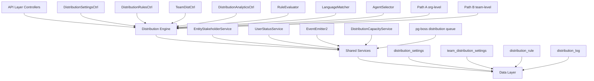

## Overview

The Distribution Module automates lead assignment within organizations. When a new lead is created, the system evaluates org-defined rules to automatically assign the lead to the most appropriate agent — based on lead attributes, agent availability, language compatibility, and capacity.

<Info>
This module is fully implemented and active with path: `src/modules/crm/distribution/`
</Info>

### Design Principles

| Principle | Decision |
|-----------|----------|
| **Async distribution** | `createLead()` emits `LEAD_CREATED`; a pg-boss worker handles distribution — lead creation is never blocked |
| **Stakeholder system reuse** | Distribution creates `EntityStakeholder` records via `EntityStakeholderService`, not a new paradigm |
| **First-match-wins rules** | Rules are evaluated top-to-bottom by priority; the first matching rule wins |
| **Idempotency** | Distribution engine checks for existing stakeholders or pending offers before running |
| **No retroactive distribution** | Existing leads are unaffected when rules are created; only new leads trigger distribution |
| **pg-boss scheduling** | Distribution queue uses pg-boss for reliability and retry guarantees |
| **RLS compliance** | All entities carry `organization_id` for row-level security |

### Distribution Paths

The engine supports two execution paths:

<Tabs>
<Tab title="Path A - Org-level">
**Org-level distribution** (`runDistribution`): triggered when a lead enters the org with no team context. Evaluates org-scoped rules, applies the org default method, and can bridge to Path B if a rule or default method routes to a team that has `distributionEnabled = true`.
</Tab>
<Tab title="Path B - Team-level">
**Team-level distribution** (`runTeamDistribution`): triggered directly when:
- A lead is created with a `teamId` in the event payload (team pool assignment)
- Path A determines the lead belongs to an auto-distributing team
- Idempotency check finds a single team-only stakeholder with auto-distribute enabled

Path B evaluates team-scoped rules, uses team settings (with org fallback for capacity), and logs the team FK on the resulting `DistributionLog` record.
</Tab>
</Tabs>

## Architecture

### High-Level Diagram



### Component Responsibilities

<AccordionGroup>
<Accordion title="DistributionEngine">
Orchestrator: receives a lead, evaluates rules, selects agent, creates assignment. Supports Path A (org) and Path B (team).
</Accordion>

<Accordion title="RuleEvaluator">
Evaluates rule conditions against lead data; returns first matching rule
</Accordion>

<Accordion title="LanguageMatcher">
Filters and ranks agents by language compatibility with the lead's person
</Accordion>

<Accordion title="AgentSelector">
Applies the distribution method (round-robin, weighted, weighted-round-robin, direct) to the filtered agent pool
</Accordion>

<Accordion title="DistributionCapacityService">
Two-phase capacity enforcement: Phase 1 `filterByCapacity()` (lead counts vs limits); Phase 2 `confirmCapacityAndAssign()` (advisory locks + atomic stakeholder creation). No entity of its own — queries `entity_stakeholder`.
</Accordion>

<Accordion title="UserStatusService">
Pre-filters candidate agents to ONLINE status; filters by per-user working hours (`filterByWorkingHours`); provides `isWithinWorkingHours()` for org-level business hours check.
</Accordion>

<Accordion title="DistributionListener">
Listens for `LEAD_CREATED` events and enqueues pg-boss jobs
</Accordion>

<Accordion title="DistributionJobHandler">
pg-boss worker that processes distribution jobs
</Accordion>
</AccordionGroup>

## Entity Specifications

### DistributionSettings (1 per org)

Org-level configuration for the distribution engine. Auto-created with defaults on first access via `getOrgSettingsRaw()`. Unique constraint on `organization_id`.

<CodeGroup>
```sql Entity Schema
CREATE TABLE distribution_settings (
    id UUID PRIMARY KEY,
    organization_id UUID UNIQUE NOT NULL,
    distribution_enabled BOOLEAN DEFAULT false,
    max_active_leads_per_agent INTEGER DEFAULT 50,
    max_new_leads_per_day INTEGER DEFAULT 15,
    capacity_enforcement_enabled BOOLEAN DEFAULT false,
    respect_business_hours BOOLEAN DEFAULT true,
    outside_hours_action VARCHAR CHECK (outside_hours_action IN ('QUEUE', 'POOL', 'DUTY_AGENT')),
    duty_agent_id UUID,
    default_method VARCHAR CHECK (default_method IN ('ROUND_ROBIN', 'POOL', 'SPECIFIC_TEAM')),
    default_team_id UUID,
    default_language_matching_mode VARCHAR CHECK (default_language_matching_mode IN ('STRICT', 'PREFERRED')),
    default_balancing_factors JSONB,
    pool_alert_enabled BOOLEAN,
    pool_alert_threshold INTEGER,
    pool_alert_window_minutes INTEGER,
    updated_by UUID,
    created_at TIMESTAMP DEFAULT NOW(),
    updated_at TIMESTAMP DEFAULT NOW()
);
```

```typescript TypeScript Interface
interface DistributionSettings {
  id: string;
  organizationId: string;
  distributionEnabled: boolean;
  maxActiveLeadsPerAgent: number;
  maxNewLeadsPerDay: number;
  capacityEnforcementEnabled: boolean;
  respectBusinessHours: boolean;
  outsideHoursAction: 'QUEUE' | 'POOL' | 'DUTY_AGENT';
  dutyAgentId?: string;
  defaultMethod: 'ROUND_ROBIN' | 'POOL' | 'SPECIFIC_TEAM';
  defaultTeamId?: string;
  defaultLanguageMatchingMode: 'STRICT' | 'PREFERRED';
  defaultBalancingFactors?: Record<string, any>;
  poolAlertEnabled: boolean;
  poolAlertThreshold: number;
  poolAlertWindowMinutes: number;
  updatedBy?: string;
  createdAt: Date;
  updatedAt: Date;
}
```
</CodeGroup>

<Warning>
**Master toggle behavior:**
- `distributionEnabled = false` (new-org default): Engine is off. `DistributionListener` and `LeadImportService` skip enqueue entirely — leads go to pool, no pg-boss jobs created.
- `distributionEnabled = true`: Engine is active. When toggled from `false` → `true` in `DistributionSettingsService.update()`, if `defaultMethod` is still `POOL` it is auto-upgraded to `ROUND_ROBIN` for a smooth first-run experience.
</Warning>

<Note>
**Business hours source:** Business hours schedule (timezone, weekly slots, enabled flag) is stored on `Organization.settings.businessHours` (`BusinessHoursConfig`), not on `DistributionSettings`. The `respectBusinessHours` field on this entity only controls whether the distribution engine gates against that org-level schedule.
</Note>

### TeamDistributionSettings (1 per org+team)

Per-team distribution configuration. One record per `(organization, team)` pair — unique index `uq_team_distribution_settings_org_team`. Auto-created on first access.

<CodeGroup>
```sql Entity Schema
CREATE TABLE team_distribution_settings (
    id UUID PRIMARY KEY,
    organization_id UUID NOT NULL,
    team_id UUID NOT NULL,
    distribution_enabled BOOLEAN DEFAULT false,
    distribution_method VARCHAR DEFAULT 'ROUND_ROBIN',
    agent_weights JSONB,
    language_matching_enabled BOOLEAN DEFAULT false,
    language_matching_mode VARCHAR,
    capacity_enforcement_enabled BOOLEAN DEFAULT false,
    max_active_leads_per_agent INTEGER,
    max_new_leads_per_day INTEGER,
    respect_business_hours BOOLEAN DEFAULT false,
    last_assigned_index INTEGER DEFAULT 0,
    default_balancing_factors JSONB,
    updated_by UUID,
    created_at TIMESTAMP DEFAULT NOW(),
    updated_at TIMESTAMP DEFAULT NOW(),
    UNIQUE(organization_id, team_id)
);
```

```typescript Capacity Resolution
// Effective capacity resolution (DistributionSettingsService.resolveEffectiveCapacity)
if (team.capacityEnforcementEnabled) {
  const maxActive = team.maxActiveLeadsPerAgent ?? org.maxActiveLeadsPerAgent;
  const maxDaily = team.maxNewLeadsPerDay ?? org.maxNewLeadsPerDay;
} else {
  // no capacity checks applied for this team's distributions
}
```
</CodeGroup>

### DistributionRule

Rules are evaluated in ascending `priority` order (lower number = higher priority). First match wins.

<CodeGroup>
```sql Entity Schema
CREATE TABLE distribution_rule (
    id UUID PRIMARY KEY,
    organization_id UUID NOT NULL,
    name VARCHAR NOT NULL,
    priority INTEGER NOT NULL,
    is_active BOOLEAN DEFAULT true,
    scope VARCHAR CHECK (scope IN ('ORGANIZATION', 'TEAM')),
    team_id UUID,
    condition_groups JSONB NOT NULL,
    method VARCHAR CHECK (method IN ('ROUND_ROBIN', 'WEIGHTED', 'WEIGHTED_ROUND_ROBIN', 'DIRECT')),
    recipients JSONB NOT NULL,
    language_matching_enabled BOOLEAN DEFAULT true,
    language_matching_mode VARCHAR CHECK (language_matching_mode IN ('STRICT', 'PREFERRED')),
    balancing_factors JSONB,
    last_assigned_index INTEGER DEFAULT 0,
    created_by UUID NOT NULL,
    created_at TIMESTAMP DEFAULT NOW(),
    updated_at TIMESTAMP DEFAULT NOW(),
    is_deleted BOOLEAN DEFAULT false
);
```

```json Condition Groups Example
{
  "conditionGroups": [
    {
      "conditions": [
        {
          "field": "leadSource",
          "operator": "eq",
          "value": "WEBSITE"
        },
        {
          "field": "temperature",
          "operator": "in",
          "value": ["HOT", "WARM"]
        }
      ]
    }
  ]
}
```
</CodeGroup>

**Rule Conditions — Supported Fields:**

| Field | Operator(s) | Example Value | Notes |
|-------|-------------|---------------|-------|
| `leadSource` | `eq`, `in` | `'WEBSITE'`, `['WEBSITE', 'REFERRAL']` | Case-insensitive |
| `temperature` | `eq`, `in` | `'HOT'` | Case-insensitive |
| `language` | `eq` | `'ar'` | Matched against `person.languages[].code` |
| `budget` | `gte`, `lte`, `between` | `500000` | Numeric comparison |
| `tags` | `contains` | `['vip']` | Array contains check |
| `sourceChannel` | `eq`, `in` | `'WHATSAPP'` | Case-insensitive |
| `intent` | `eq` | `'BUY'` | Case-insensitive |
| `area` | `eq`, `in`, `contains` | `'Dubai Marina'`, `['JBR', 'Downtown Dubai']` | Requires `LeadPropertyInterest.preferredAreas[]` |

<Note>
All string-based condition fields use **case-insensitive matching**. The `area` field requires data from `LeadPropertyInterest.preferredAreas[]` — the engine pre-loads the lead's property interests before evaluation.
</Note>

## Distribution Engine

The core orchestration logic supporting both org-level (Path A) and team-level (Path B) distribution flows.

### Engine Flow

<Steps>
<Step title="Lead Event Processing">
Listen for `LEAD_CREATED` events and enqueue pg-boss jobs for async processing
</Step>

<Step title="Idempotency Check">
Verify no existing stakeholders or pending distribution offers exist for the lead
</Step>

<Step title="Rule Evaluation">
Evaluate rules in priority order (lower number = higher priority) until first match
</Step>

<Step title="Agent Selection">
Apply distribution method (round-robin, weighted, etc.) to filtered agent pool
</Step>

<Step title="Capacity Enforcement">
Two-phase capacity checking with advisory locks for atomic assignment
</Step>

<Step title="Assignment Creation">
Create `EntityStakeholder` record via `EntityStakeholderService`
</Step>

<Step title="Audit Logging">
Record distribution decision in `DistributionLog` with full context
</Step>
</Steps>

### Distribution Methods

<Tabs>
<Tab title="Round Robin">
**ROUND_ROBIN**: Cycles through agents sequentially using `last_assigned_index` cursor. Ensures even distribution across team members.

```typescript
// Simplified round-robin logic
const nextIndex = (settings.lastAssignedIndex + 1) % eligibleAgents.length;
const selectedAgent = eligibleAgents[nextIndex];
await this.updateLastAssignedIndex(settings, nextIndex);
```
</Tab>

<Tab title="Weighted">
**WEIGHTED**: Assigns leads based on agent weights. Higher weight = more leads assigned.

```typescript
// Weight-based selection
const totalWeight = agents.reduce((sum, agent) => sum + weights[agent.id], 0);
const randomValue = Math.random() * totalWeight;
// Select agent based on cumulative weight ranges
```
</Tab>

<Tab title="Weighted Round Robin">
**WEIGHTED_ROUND_ROBIN**: Combines round-robin fairness with weighted preferences. Each agent gets their weighted share over time.

```typescript
// WRR maintains per-agent counters and expected ratios
const expectedRatio = weight / totalWeight;
const actualRatio = assignedCount / totalAssignments;
// Select agent with largest deficit from expected ratio
```
</Tab>

<Tab title="Direct Assignment">
**DIRECT**: Assigns to specific agent(s) or routes to team/pool based on rule configuration.

```typescript
// Direct assignment from rule recipients
if (rule.recipients.agentIds?.length) {
  return this.selectFromAgentIds(rule.recipients.agentIds);
}
if (rule.recipients.teamId) {
  return this.routeToTeam(rule.recipients.teamId);
}
```
</Tab>
</Tabs>

## pg-boss Job Configuration

The distribution system uses pg-boss for reliable, retryable job processing.

### Job Configuration

<CodeGroup>
```typescript Job Setup
// Distribution job configuration
const JOB_NAME = 'lead-distribution';
const JOB_OPTIONS = {
  retryLimit: 3,
  retryDelay: 60, // seconds
  expireInMinutes: 60,
  singletonKey: (payload) => `lead-${payload.leadId}`, // Prevent duplicate jobs
};

// Job handler registration
await this.pgBoss.work(JOB_NAME, JOB_OPTIONS, this.handleDistributionJob.bind(this));
```

```typescript Job Payload
interface DistributionJobPayload {
  leadId: string;
  organizationId: string;
  teamId?: string; // For team-level distribution (Path B)
  source: 'LEAD_CREATED' | 'MANUAL_TRIGGER' | 'IMPORT';
  priority?: number;
  metadata?: Record<string, any>;
}
```
</CodeGroup>

### Error Handling & Retry Logic

<Warning>
**Retry Strategy:**
- **Attempt 1**: Immediate processing
- **Attempt 2**: 60-second delay
- **Attempt 3**: 120-second delay  
- **Attempt 4**: 240-second delay
- **Final failure**: Lead remains in pool, error logged to `DistributionLog`
</Warning>

<CodeGroup>
```typescript Error Classification
// Retryable errors
const RETRYABLE_ERRORS = [
  'TEMPORARY_CAPACITY_LOCK',
  'AGENT_STATUS_CHANGED',
  'DATABASE_CONNECTION_ERROR'
];

// Non-retryable errors (immediate failure)
const FATAL_ERRORS = [
  'LEAD_NOT_FOUND',
  'ORGANIZATION_NOT_FOUND', 
  'INVALID_RULE_CONFIGURATION',
  'NO_ELIGIBLE_AGENTS'
];
```

```typescript Job Handler
async handleDistributionJob(job: Job<DistributionJobPayload>) {
  try {
    const { leadId, organizationId, teamId } = job.data;
    
    if (teamId) {
      await this.distributionEngine.runTeamDistribution(leadId, organizationId, teamId);
    } else {
      await this.distributionEngine.runDistribution(leadId, organizationId);
    }
    
    return { success: true, leadId };
  } catch (error) {
    if (RETRYABLE_ERRORS.includes(error.code)) {
      throw error; // pg-boss will retry
    } else {
      // Log fatal error and complete job
      await this.logDistributionFailure(leadId, error);
      return { success: false, error: error.message };
    }
  }
}
```
</CodeGroup>

## API Endpoints

### Distribution Settings

<CodeGroup>
```http Get Organization Settings
GET /api/distribution/settings
Authorization: Bearer <token>

Response:
{
  "distributionEnabled": true,
  "maxActiveLeadsPerAgent": 50,
  "maxNewLeadsPerDay": 15,
  "capacityEnforcementEnabled": false,
  "respectBusinessHours": true,
  "outsideHoursAction": "QUEUE",
  "defaultMethod": "ROUND_ROBIN",
  "defaultLanguageMatchingMode": "PREFERRED"
}
```

```http Update Organization Settings  
PUT /api/distribution/settings
Authorization: Bearer <token>
Content-Type: application/json

{
  "distributionEnabled": true,
  "maxActiveLeadsPerAgent": 75,
  "capacityEnforcementEnabled": true,
  "defaultMethod": "WEIGHTED_ROUND_ROBIN"
}

Response: 200 OK
```
</CodeGroup>

### Team Distribution Settings

<CodeGroup>
```http Get Team Settings
GET /api/distribution/teams/:teamId/settings
Authorization: Bearer <token>

Response:
{
  "distributionEnabled": true,
  "distributionMethod": "ROUND_ROBIN",
  "languageMatchingEnabled": false,
  "capacityEnforcementEnabled": false,
  "maxActiveLeadsPerAgent": null, // inherits from org
  "respectBusinessHours": false
}
```

```http Update Team Settings
PUT /api/distribution/teams/:teamId/settings
Authorization: Bearer <token>
Content-Type: application/json

{
  "distributionEnabled": true,
  "distributionMethod": "WEIGHTED",
  "agentWeights": {
    "user-123": 3,
    "user-456": 2,
    "user-789": 1
  }
}

Response: 200 OK
```
</CodeGroup>

### Distribution Rules

<CodeGroup>
```http List Rules
GET /api/distribution/rules?scope=ORGANIZATION&page=1&limit=10
Authorization: Bearer <token>

Response:
{
  "rules": [
    {
      "id": "rule-123",
      "name": "VIP Leads to Senior Team",
      "priority": 1,
      "isActive": true,
      "scope": "ORGANIZATION",
      "conditionGroups": [/* ... */],
      "method": "DIRECT",
      "recipients": { "teamId": "senior-team-id" }
    }
  ],
  "total": 5,
  "page": 1,
  "limit": 10
}
```

```http Create Rule
POST /api/distribution/rules
Authorization: Bearer <token>
Content-Type: application/json

{
  "name": "Hot Leads to Top Performers",
  "priority": 2,
  "scope": "ORGANIZATION",
  "conditionGroups": [
    {
      "conditions": [
        {
          "field": "temperature",
          "operator": "eq", 
          "value": "HOT"
        }
      ]
    }
  ],
  "method": "WEIGHTED",
  "recipients": {
    "agentIds": ["agent1", "agent2"],
    "weights": { "agent1": 3, "agent2": 2 }
  }
}

Response: 201 Created
```
</CodeGroup>

### Distribution Analytics

<CodeGroup>
```http Distribution Metrics
GET /api/distribution/analytics/metrics?period=30d&teamId=optional
Authorization: Bearer <token>

Response:
{
  "totalDistributed": 1250,
  "successRate": 0.94,
  "averageDistributionTime": 1.3,
  "methodBreakdown": {
    "ROUND_ROBIN": 800,
    "WEIGHTED": 300,
    "DIRECT": 150
  },
  "agentPerformance": [
    {
      "agentId": "agent-123",
      "assignedCount": 45,
      "acceptedCount": 42,
      "acceptanceRate": 0.93
    }
  ]
}
```

```http Distribution Logs
GET /api/distribution/logs?leadId=lead-123&limit=50&offset=0
Authorization: Bearer <token>

Response:
{
  "logs": [
    {
      "id": "log-123",
      "leadId": "lead-123", 
      "result": "ASSIGNED",
      "assignedAgentId": "agent-456",
      "distributionMethod": "ROUND_ROBIN",
      "ruleId": null,
      "processingTimeMs": 850,
      "createdAt": "2024-01-15T10:30:00Z"
    }
  ],
  "total": 1,
  "hasMore": false
}
```
</CodeGroup>

## Security & Permissions

### Role-Based Access Control

<AccordionGroup>
<Accordion title="Distribution Admin">
**Permissions:**
- Full access to org distribution settings
- Create, edit, delete distribution rules
- View all distribution analytics and logs
- Manage team distribution settings
- Configure capacity limits and business hours

**Typical Roles:** Operations Manager, CRM Admin
</Accordion>

<Accordion title="Team Lead">
**Permissions:**
- View org distribution settings (read-only)
- Manage team distribution settings for assigned teams
- View team-specific analytics and logs
- Create team-scoped distribution rules

**Restrictions:** Cannot modify org-level settings or view other teams' data
</Accordion>

<Accordion title="Agent">
**Permissions:**
- View personal distribution metrics
- View leads assigned through distribution
- Basic read access to team distribution status

**Restrictions:** No configuration access, limited analytics visibility
</Accordion>

<Accordion title="Viewer">
**Permissions:**
- Read-only access to distribution analytics
- View distribution logs (filtered by accessible leads)

**Restrictions:** No configuration or management capabilities
</Accordion>
</AccordionGroup>

### API Security

<CodeGroup>
```typescript Permission Decorators
// Distribution settings endpoints
@Roles('DISTRIBUTION_ADMIN', 'ORG_ADMIN')
@Put('settings')
async updateOrgSettings() { /* ... */ }

// Team settings endpoints  
@Roles('DISTRIBUTION_ADMIN', 'TEAM_LEAD')
@TeamAccess() // Validates team membership
@Put('teams/:teamId/settings')
async updateTeamSettings() { /* ... */ }

// Rule management
@Roles('DISTRIBUTION_ADMIN')
@Post('rules')
async createRule() { /* ... */ }
```

```typescript Row-Level Security
// All distribution entities include organization_id for RLS
CREATE POLICY distribution_settings_policy ON distribution_settings
  FOR ALL TO authenticated
  USING (organization_id = current_setting('app.current_organization_id')::uuid);

CREATE POLICY distribution_rules_policy ON distribution_rule  
  FOR ALL TO authenticated
  USING (organization_id = current_setting('app.current_organization_id')::uuid);
```
</CodeGroup>

### Data Privacy & Compliance

<Warning>
**PII Handling:**
- Distribution logs contain lead references but no direct PII
- Agent weights and capacity data are considered sensitive
- All distribution decisions are auditable for compliance
- Soft deletes preserve audit trails for deleted rules
</Warning>

<Note>
**GDPR Compliance:**
- Distribution settings can be exported as part of organization data export
- When leads are deleted, corresponding distribution logs are anonymized
- Agent performance metrics are aggregated to protect individual privacy
</Note>

## RLS Policies

All distribution entities implement Row-Level Security policies for multi-tenant isolation.

<CodeGroup>
```sql Distribution Settings RLS
-- distribution_settings policies
CREATE POLICY "distribution_settings_org_isolation" ON distribution_settings
  FOR ALL TO authenticated
  USING (organization_id = current_setting('app.current_organization_id')::uuid);

-- Ensure users can only access their organization's settings
CREATE POLICY "distribution_settings_insert" ON distribution_settings
  FOR INSERT TO authenticated
  WITH CHECK (organization_id = current_setting('app.current_organization_id')::uuid);
```

```sql Team Settings RLS  
-- team_distribution_settings policies
CREATE POLICY "team_distribution_settings_org_isolation" ON team_distribution_settings
  FOR ALL TO authenticated  
  USING (organization_id = current_setting('app.current_organization_id')::uuid);

-- Additional team membership validation in application layer
-- RLS ensures org-level isolation, app logic validates team access
```

```sql Distribution Rules RLS
-- distribution_rule policies  
CREATE POLICY "distribution_rule_org_isolation" ON distribution_rule
  FOR ALL TO authenticated
  USING (organization_id = current_setting('app.current_organization_id')::uuid 
         AND is_deleted = false);

-- Separate policy for viewing deleted rules (audit purposes)
CREATE POLICY "distribution_rule_deleted_view" ON distribution_rule
  FOR SELECT TO authenticated
  USING (organization_id = current_setting('app.current_organization_id')::uuid
         AND is_deleted = true
         AND has_role('DISTRIBUTION_ADMIN'));
```

```sql Distribution Logs RLS
-- distribution_log policies
CREATE POLICY "distribution_log_org_isolation" ON distribution_log  
  FOR ALL TO authenticated
  USING (organization_id = current_setting('app.current_organization_id')::uuid);

-- Read-only policy for most users
CREATE POLICY "distribution_log_readonly" ON distribution_log
  FOR SELECT TO authenticated
  USING (organization_id = current_setting('app.current_organization_id')::uuid);
```
</CodeGroup>

## Performance & Scaling

### Database Optimization

<CodeGroup>
```sql Indexes
-- Performance-critical indexes
CREATE INDEX CONCURRENTLY idx_distribution_settings_org_id 
  ON distribution_settings(organization_id);

CREATE INDEX CONCURRENTLY idx_team_distribution_settings_org_team
  ON team_distribution_settings(organization_id, team_id);

CREATE INDEX CONCURRENTLY idx_distribution_rule_active_priority
  ON distribution_rule(organization_id, is_active, priority)
  WHERE is_active = true AND is_deleted = false;

CREATE INDEX CONCURRENTLY idx_distribution_rule_scope_team
  ON distribution_rule(organization_id, scope, team_id)
  WHERE is_active = true AND is_deleted = false;

CREATE INDEX CONCURRENTLY idx_distribution_log_lead_org
  ON distribution_log(lead_id, organization_id, created_at DESC);

CREATE INDEX CONCURRENTLY idx_distribution_log_analytics
  ON distribution_log(organization_id, result, created_at)
  WHERE result IN ('ASSIGNED', 'POOLED', 'FAILED');
```

```typescript Connection Pooling
// pg-boss configuration for distribution jobs
const pgBossOptions = {
  connectionString: process.env.DATABASE_URL,
  max: 20, // Maximum pool size
  application_name: 'distribution-worker',
  retryLimit: 3,
  retryDelay: 60,
  expireInMinutes: 60,
  archiveCompletedAfterSeconds: 3600, // Archive completed jobs after 1 hour
};
```
</CodeGroup>

### Capacity Management

<Tip>
**Two-Phase Capacity Enforcement:**

**Phase 1** - `filterByCapacity()`: Quick filter based on current lead counts vs. limits
**Phase 2** - `confirmCapacityAndAssign()`: Advisory locks + atomic stakeholder creation to prevent race conditions
</Tip>

<CodeGroup>
```typescript Phase 1: Quick Filter
async filterByCapacity(agents: User[], settings: CapacitySettings): Promise<User[]> {
  if (!settings.enforcementEnabled) return agents;
  
  const agentIds = agents.map(a => a.id);
  const capacityData = await this.getCapacityData(agentIds, settings);
  
  return agents.filter(agent => {
    const data = capacityData[agent.id];
    return data.activeLeads < settings.maxActive && 
           data.dailyLeads < settings.maxDaily;
  });
}
```

```typescript Phase 2: Atomic Assignment
async confirmCapacityAndAssign(
  leadId: string, 
  agentId: string, 
  settings: CapacitySettings
): Promise<boolean> {
  return await this.db.transaction(async (em) => {
    // Acquire advisory lock for agent
    await em.getConnection().execute(
      'SELECT pg_advisory_xact_lock($1)', 
      [hashCode(agentId)]
    );
    
    // Recheck capacity under lock
    const currentCounts = await this.getCurrentCounts(agentId, settings);
    if (currentCounts.activeLeads >= settings.maxActive ||
        currentCounts.dailyLeads >= settings.maxDaily) {
      return false;
    }
    
    // Create stakeholder assignment
    await this.entityStakeholderService.create({
      entityType: 'LEAD',
      entityId: leadId,
      userId: agentId,
      role: 'ASSIGNEE',
      organizationId: settings.organizationId
    });
    
    return true;
  });
}
```
</CodeGroup>

### Monitoring & Alerting

<CardGroup cols={2}>
<Card title="Distribution Metrics" icon="chart-line">
- **Processing Time**: P50, P95, P99 latencies
- **Success Rate**: Percentage of successful assignments  
- **Queue Depth**: Pending pg-boss jobs
- **Agent Utilization**: Load distribution across agents
</Card>

<Card title="System Health" icon="heart-pulse">
- **Database Connections**: Pool utilization and wait times
- **pg-boss Status**: Worker health and job processing rates
- **Memory Usage**: Distribution engine memory consumption
- **Error Rates**: Failed distributions by error type
</Card>
</CardGroup>

<CodeGroup>
```typescript Metrics Collection
// Distribution metrics service
class DistributionMetricsService {
  async recordDistribution(result: DistributionResult) {
    // Record processing time
    this.histogram.record('distribution.processing_time', result.processingTimeMs);
    
    // Record outcome
    this.counter.increment('distribution.outcomes', { result: result.status });
    
    // Record method usage
    this.counter.increment('distribution.methods', { method: result.method });
    
    // Update agent utilization
    if (result.assignedAgentId) {
      this.gauge.set('agent.active_leads', result.agentActiveLeads, {
        agentId: result.assignedAgentId
      });
    }
  }
}
```

```typescript Health Checks
// Distribution system health check
@Get('health')
async getDistributionHealth(): Promise<DistributionHealth> {
  const pgBossStatus = await this.pgBoss.getQueueSize('lead-distribution');
  const activeSettings = await this.distributionSettingsService.getActiveOrgsCount();
  
  return {
    status: pgBossStatus.waiting > 1000 ? 'DEGRADED' : 'HEALTHY',
    queueDepth: pgBossStatus.waiting,
    activeOrganizations: activeSettings,
    lastProcessed: await this.getLastProcessedTimestamp(),
    workerHealth: await this.checkWorkerHealth()
  };
}
```
</CodeGroup>

## Integration Points

### Event System Integration

<CodeGroup>
```typescript Lead Created Event
// Event payload when lead is created
interface LeadCreatedEvent {
  leadId: string;
  organizationId: string;
  teamId?: string; // Optional team assignment
  personId: string;
  source: LeadSource;
  temperature: LeadTemperature;
  tags: string[];
  createdBy: string;
  metadata?: Record<string, any>;
}

// Distribution listener
@EventListener('lead.created')
async handleLeadCreated(event: LeadCreatedEvent) {
  const settings = await this.getOrgSettings(event.organizationId);
  
  if (!settings.distributionEnabled) {
    this.logger.debug('Distribution disabled for org', event.organizationId);
    return;
  }
  
  // Enqueue distribution job
  await this.pgBoss.send('lead-distribution', {
    leadId: event.leadId,
    organizationId: event.organizationId,
    teamId: event.teamId,
    source: 'LEAD_CREATED'
  });
}
```

```typescript Stakeholder Integration
// Integration with EntityStakeholder system
interface StakeholderAssignment {
  entityType: 'LEAD';
  entityId: string;
  userId: string;
  role: 'ASSIGNEE';
  organizationId: string;
  metadata?: {
    distributionMethod: DistributionMethod;
    ruleId?: string;
    assignedAt: Date;
    source: 'DISTRIBUTION_ENGINE';
  };
}

// Create assignment through EntityStakeholderService
const assignment = await this.entityStakeholderService.create({
  entityType: 'LEAD',
  entityId: leadId,
  userId: selectedAgentId,
  role: 'ASSIGNEE',
  organizationId,
  metadata: {
    distributionMethod: result.method,
    ruleId: result.ruleId,
    assignedAt: new Date(),
    source: 'DISTRIBUTION_ENGINE'
  }
});
```
</CodeGroup>

### CRM Workflow Integration

<Steps>
<Step title="Lead Import Integration">
**LeadImportService** checks distribution settings before processing imported leads. If distribution is enabled, leads are created normally and trigger distribution events.
</Step>

<Step title="Manual Assignment Override">
When users manually assign leads, the distribution system respects the manual assignment and does not trigger automatic distribution.
</Step>

<Step title="Team Transfer Handling">
When leads are transferred between teams, if the target team has `distributionEnabled = true`, the system triggers Path B team-level distribution.
</Step>

<Step title="Lead Status Changes">
Distribution system monitors lead status changes to update agent capacity calculations and trigger redistribution if needed.
</Step>
</Steps>

### External System Webhooks

<CodeGroup>
```typescript Webhook Integration
// External lead sources can trigger distribution
@Post('webhooks/lead-created')
async handleWebhookLead(@Body() payload: ExternalLeadPayload) {
  // Validate webhook signature
  await this.validateWebhookSignature(payload);
  
  // Transform external format to internal lead
  const lead = await this.leadService.createFromWebhook(payload);
  
  // Distribution will be triggered by lead.created event
  return { success: true, leadId: lead.id };
}
```

```typescript Third-party CRM Sync
// Sync distribution results to external CRMs
@EventListener('distribution.completed')
async syncToExternalCRM(event: DistributionCompletedEvent) {
  if (event.result === 'ASSIGNED') {
    // Notify external CRM of assignment
    await this.crmIntegrationService.updateLeadAssignment({
      externalLeadId: event.lead.externalId,
      assignedTo: event.assignedAgent.email,
      assignedAt: event.assignedAt,
      method: event.distributionMethod
    });
  }
}
```
</CodeGroup>

<Check>
The Distribution Module is fully integrated with the existing CRM architecture and provides comprehensive lead assignment automation with enterprise-grade reliability and performance.
</Check>