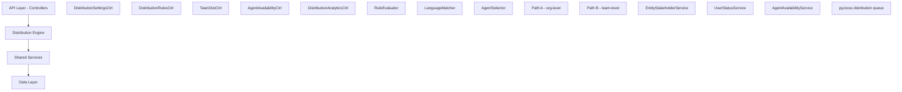

The Distribution Module automates lead assignment within organizations through a sophisticated rule-based engine that evaluates lead attributes, agent availability, and capacity constraints to make optimal assignments.

<Note>
**Status:** Active — fully implemented  
**Module Path:** `src/modules/crm/distribution/`
</Note>

## Overview

When a new lead is created, the system evaluates organization-defined rules to automatically assign the lead to the most appropriate agent based on lead attributes, agent availability, language compatibility, and capacity.

### Design Principles

<CardGroup cols={2}>
  <Card title="Async Distribution" icon="clock">
    `createLead()` emits `LEAD_CREATED`; a pg-boss worker handles distribution — lead creation is never blocked
  </Card>
  <Card title="Stakeholder System Reuse" icon="users">
    Distribution creates `EntityStakeholder` records via `EntityStakeholderService`, not a new paradigm
  </Card>
  <Card title="First-Match-Wins Rules" icon="target">
    Rules are evaluated top-to-bottom by priority; the first matching rule wins
  </Card>
  <Card title="Idempotency" icon="shield-check">
    Distribution engine checks for existing stakeholders or pending offers before running
  </Card>
</CardGroup>

### Distribution Paths

The engine supports two execution paths:

<Tabs>
  <Tab title="Path A - Organization Level">
    **Org-level distribution** (`runDistribution`): triggered when a lead enters the org with no team context. Evaluates org-scoped rules, applies the org default method, and can bridge to Path B if a rule or default method routes to a team that has `distributionEnabled = true`.
  </Tab>
  <Tab title="Path B - Team Level">
    **Team-level distribution** (`runTeamDistribution`): triggered directly when:
    - A lead is created with a `teamId` in the event payload (team pool assignment)
    - Path A determines the lead belongs to an auto-distributing team
    - Idempotency check finds a single team-only stakeholder with auto-distribute enabled
  </Tab>
</Tabs>

## Architecture

### High-Level Architecture



### Component Responsibilities

| Component | Responsibility |
|-----------|----------------|
| **DistributionEngine** | Orchestrator: receives a lead, evaluates rules, selects agent, creates assignment. Supports Path A (org) and Path B (team). |
| **RuleEvaluator** | Evaluates rule conditions against lead data; returns first matching rule |
| **LanguageMatcher** | Filters and ranks agents by language compatibility with the lead's person |
| **AgentSelector** | Applies the distribution method (round-robin, weighted, weighted-round-robin, direct) to the filtered agent pool |
| **AgentAvailabilityService** | Checks agent capacity, business hours, leave status. Two-phase capacity enforcement with advisory locks. |
| **UserStatusService** | Pre-filters candidate agents to only those with ONLINE status |

## Entity Specifications

### DistributionSettings

<Info>
One record per organization. Auto-created with defaults on first access via `getOrgSettingsRaw()`.
</Info>

| Column | Type | Description |
|--------|------|-------------|
| `id` | uuid PK | Primary key |
| `organization_id` | uuid FK UNIQUE | Organization reference (RLS) |
| `distribution_enabled` | bool | Master on/off switch (default: `false`) |
| `max_active_leads_per_agent` | int | Default: 50 |
| `max_new_leads_per_day` | int | Default: 15 |
| `capacity_enforcement_enabled` | bool | Default: `false` |
| `respect_business_hours` | bool | Default: `true` |
| `outside_hours_action` | enum | `QUEUE`, `POOL`, `DUTY_AGENT` |
| `duty_agent_id` | uuid FK nullable | Used when outside_hours_action = DUTY_AGENT |
| `default_method` | enum | `ROUND_ROBIN`, `POOL`, `SPECIFIC_TEAM` |
| `default_team_id` | uuid FK nullable | Used when default_method = SPECIFIC_TEAM |
| `default_language_matching_mode` | enum | `STRICT`, `PREFERRED` |
| `default_balancing_factors` | jsonb nullable | Optional balancing configuration |

<Warning>
**Master Toggle Behavior:**
- `distributionEnabled = false` (default): Engine is off. No pg-boss jobs created.
- `distributionEnabled = true`: Engine is active. Auto-upgrades `defaultMethod` from `POOL` to `ROUND_ROBIN` for smooth first-run experience.
</Warning>

### TeamDistributionSettings

<Info>
One record per `(organization, team)` pair. Auto-created on first access.
</Info>

| Column | Type | Description |
|--------|------|-------------|
| `id` | uuid PK | Primary key |
| `organization_id` | uuid FK | Organization reference (RLS) |
| `team_id` | uuid FK | Team reference (required) |
| `distribution_enabled` | bool | Default: `false` |
| `distribution_method` | enum | Default: `ROUND_ROBIN` |
| `agent_weights` | jsonb nullable | `{ [userId]: weight }` for WEIGHTED method |
| `language_matching_enabled` | bool | Default: `false` |
| `language_matching_mode` | enum nullable | Language matching mode override |
| `capacity_enforcement_enabled` | bool | Default: `false` |
| `max_active_leads_per_agent` | int nullable | `null` = inherit from org settings |
| `max_new_leads_per_day` | int nullable | `null` = inherit from org settings |
| `last_assigned_index` | int | Round-robin cursor (default: 0) |

### DistributionRule

<Info>
Rules are evaluated in ascending `priority` order (lower number = higher priority). First match wins.
</Info>

| Column | Type | Description |
|--------|------|-------------|
| `id` | uuid PK | Primary key |
| `organization_id` | uuid FK | Organization reference (RLS) |
| `name` | varchar | Rule name |
| `priority` | int | Lower = higher priority |
| `is_active` | bool | Default: true |
| `scope` | enum | `ORGANIZATION`, `TEAM` |
| `team_id` | uuid FK nullable | For team-scoped rules |
| `condition_groups` | jsonb | `[{conditions:[{field,operator,value}]}]` |
| `method` | enum | `ROUND_ROBIN`, `WEIGHTED`, `WEIGHTED_ROUND_ROBIN`, `DIRECT` |
| `recipients` | jsonb | `{agentIds?, teamId?, poolId?, weights?}` |
| `language_matching_enabled` | bool | Default: true |
| `language_matching_mode` | enum | `STRICT`, `PREFERRED` |
| `last_assigned_index` | int | Round-robin cursor |

#### Supported Rule Conditions

| Field | Operators | Example |
|-------|-----------|---------|
| `leadSource` | `eq`, `in` | `'WEBSITE'`, `['WEBSITE', 'REFERRAL']` |
| `temperature` | `eq`, `in` | `'HOT'` |
| `language` | `eq` | `'ar'` (matched against `person.preferredLanguage`) |
| `budget` | `gte`, `lte`, `between` | `500000` |
| `tags` | `contains` | `['vip']` |
| `sourceChannel` | `eq`, `in` | `'WHATSAPP'` |
| `intent` | `eq` | `'BUY'` |
| `area` | `eq`, `in`, `contains` | `'Dubai Marina'`, `['JBR', 'Downtown Dubai']` |

<Note>
All string-based condition fields use **case-insensitive matching**. The `area` field requires data from `LeadPropertyInterest.preferredAreas[]`.
</Note>

## Type Definitions

### Core Enums

```typescript
enum DistributionMethod {
  ROUND_ROBIN = 'ROUND_ROBIN',
  WEIGHTED = 'WEIGHTED', 
  WEIGHTED_ROUND_ROBIN = 'WEIGHTED_ROUND_ROBIN',
  DIRECT = 'DIRECT',
  POOL = 'POOL'
}

enum OutsideHoursAction {
  QUEUE = 'QUEUE',
  POOL = 'POOL', 
  DUTY_AGENT = 'DUTY_AGENT'
}

enum LanguageMatchingMode {
  STRICT = 'STRICT',
  PREFERRED = 'PREFERRED'
}

enum RuleScope {
  ORGANIZATION = 'ORGANIZATION',
  TEAM = 'TEAM'
}
```

### Distribution Context

```typescript
interface DistributionContext {
  lead: Lead;
  person: Person;
  propertyInterests: LeadPropertyInterest[];
  organization: Organization;
  teamId?: string;
  skipIdempotencyCheck?: boolean;
}

interface DistributionResult {
  success: boolean;
  assignedAgent?: User;
  assignedTeam?: Team;
  method: DistributionMethod;
  matchedRule?: DistributionRule;
  logs: string[];
  error?: string;
}
```

## Distribution Engine

### Core Distribution Flow

<Steps>
  <Step title="Idempotency Check">
    Verify the lead doesn't already have stakeholders or pending assignments
  </Step>
  <Step title="Rule Evaluation">
    Process rules in priority order (ascending) until first match is found
  </Step>
  <Step title="Agent Filtering">
    Apply business hours, capacity, and availability filters
  </Step>
  <Step title="Language Matching">
    Filter and rank agents by language compatibility
  </Step>
  <Step title="Assignment Method">
    Apply the specified distribution method (round-robin, weighted, etc.)
  </Step>
  <Step title="Stakeholder Creation">
    Create EntityStakeholder record and log the assignment
  </Step>
</Steps>

### Language Matching

The `LanguageMatcher` service provides two matching modes:

<Tabs>
  <Tab title="STRICT Mode">
    Only agents with exact language match are considered. If no agents match the lead's preferred language, the distribution fails and the lead goes to pool.
  </Tab>
  <Tab title="PREFERRED Mode">
    Agents with exact language match are prioritized, but if none are available, all agents in the team are considered as fallback options.
  </Tab>
</Tabs>

### Agent Selection Methods

<AccordionGroup>
  <Accordion title="ROUND_ROBIN">
    Agents are assigned in sequential order based on the `last_assigned_index` cursor. The cursor is atomically incremented after each assignment.
  </Accordion>
  <Accordion title="WEIGHTED">
    Agents are selected based on weighted probability distribution. Weights are defined in the rule's `recipients.weights` or team's `agent_weights`.
  </Accordion>
  <Accordion title="WEIGHTED_ROUND_ROBIN">
    Combines round-robin with weights. Each agent gets assigned leads proportional to their weight before moving to the next agent.
  </Accordion>
  <Accordion title="DIRECT">
    Assigns to a specific agent defined in the rule's `recipients.agentIds[0]`.
  </Accordion>
</AccordionGroup>

## pg-boss Job Configuration

### Job Queue Setup

```typescript
interface DistributionJobData {
  leadId: string;
  organizationId: string;
  teamId?: string;
  eventMetadata?: any;
  priority?: number;
}

// Job configuration
const jobOptions = {
  name: 'crm.distribution.process',
  retryLimit: 3,
  retryDelay: 30, // seconds
  expireInHours: 24
};
```

<Warning>
Jobs are only enqueued when `DistributionSettings.distribution_enabled = true`. When disabled, leads go directly to pool without processing.
</Warning>

## API Endpoints

### Distribution Settings

<CodeGroup>
```typescript GET /api/crm/distribution/settings
// Get organization distribution settings
GET /api/crm/distribution/settings
Authorization: Bearer <token>

Response: {
  distributionEnabled: boolean;
  maxActiveLeadsPerAgent: number;
  maxNewLeadsPerDay: number;
  // ... other settings
}
```

```typescript PUT /api/crm/distribution/settings
// Update organization distribution settings
PUT /api/crm/distribution/settings
Authorization: Bearer <token>
Content-Type: application/json

{
  "distributionEnabled": true,
  "defaultMethod": "ROUND_ROBIN",
  "respectBusinessHours": true
}
```
</CodeGroup>

### Distribution Rules

<CodeGroup>
```typescript GET /api/crm/distribution/rules
// List distribution rules
GET /api/crm/distribution/rules?scope=ORGANIZATION&teamId=uuid
Authorization: Bearer <token>

Response: {
  rules: DistributionRule[];
  total: number;
}
```

```typescript POST /api/crm/distribution/rules
// Create distribution rule
POST /api/crm/distribution/rules
Authorization: Bearer <token>
Content-Type: application/json

{
  "name": "VIP Leads to Senior Team",
  "priority": 1,
  "scope": "ORGANIZATION",
  "conditionGroups": [
    {
      "conditions": [
        {
          "field": "tags",
          "operator": "contains", 
          "value": ["vip"]
        }
      ]
    }
  ],
  "method": "ROUND_ROBIN",
  "recipients": {
    "teamId": "senior-team-uuid"
  }
}
```
</CodeGroup>

### Team Distribution

<CodeGroup>
```typescript GET /api/crm/teams/:teamId/distribution
// Get team distribution settings
GET /api/crm/teams/uuid/distribution
Authorization: Bearer <token>

Response: {
  distributionEnabled: boolean;
  distributionMethod: string;
  agentWeights: Record<string, number>;
  // ... other team settings
}
```

```typescript PUT /api/crm/teams/:teamId/distribution
// Update team distribution settings
PUT /api/crm/teams/uuid/distribution
Authorization: Bearer <token>
Content-Type: application/json

{
  "distributionEnabled": true,
  "distributionMethod": "WEIGHTED",
  "agentWeights": {
    "agent-1-uuid": 3,
    "agent-2-uuid": 2
  }
}
```
</CodeGroup>

## Security & Permissions

### Required Permissions

| Action | Required Permission |
|--------|-------------------|
| View distribution settings | `CRM_SETTINGS_VIEW` |
| Update distribution settings | `CRM_SETTINGS_MANAGE` |
| Manage distribution rules | `CRM_DISTRIBUTION_RULES_MANAGE` |
| View team distribution | `CRM_TEAMS_VIEW` |
| Manage team distribution | `CRM_TEAMS_MANAGE` |

### Row-Level Security (RLS)

All distribution entities include `organization_id` for RLS enforcement:

```sql
-- Distribution Settings RLS Policy
CREATE POLICY distribution_settings_org_access ON distribution_settings
  FOR ALL TO authenticated_role
  USING (organization_id = get_current_org_id());

-- Distribution Rules RLS Policy  
CREATE POLICY distribution_rules_org_access ON distribution_rules
  FOR ALL TO authenticated_role
  USING (organization_id = get_current_org_id());
```

## Observability & Audit

### Distribution Logging

Every distribution attempt creates a `DistributionLog` record:

| Field | Description |
|-------|-------------|
| `lead_id` | Lead being distributed |
| `organization_id` | Organization context |
| `team_id` | Team context (for Path B) |
| `matched_rule_id` | Rule that matched (if any) |
| `assigned_agent_id` | Resulting agent assignment |
| `method_used` | Distribution method applied |
| `execution_time_ms` | Performance metric |
| `logs` | Detailed execution logs |
| `error_message` | Error details (if failed) |

### Event Emission

<CodeGroup>
```typescript Events
// Events emitted during distribution
EventEmitter2.emit('distribution.started', { leadId, organizationId });
EventEmitter2.emit('distribution.completed', { leadId, assignedAgentId, method });
EventEmitter2.emit('distribution.failed', { leadId, error, logs });
EventEmitter2.emit('distribution.rule.matched', { leadId, ruleId, ruleName });
```
</CodeGroup>

## Analytics & Metrics

### Distribution Metrics

<CodeGroup>
```typescript GET /api/crm/distribution/analytics/summary
// Get distribution performance summary
GET /api/crm/distribution/analytics/summary?period=7d&teamId=uuid
Authorization: Bearer <token>

Response: {
  totalLeads: number;
  distributedLeads: number;
  distributionRate: number;
  averageResponseTime: number;
  topPerformingAgents: AgentMetric[];
  ruleEffectiveness: RuleMetric[];
}
```
</CodeGroup>

### Key Performance Indicators

| Metric | Description | Calculation |
|--------|-------------|-------------|
| Distribution Rate | Percentage of leads successfully auto-assigned | `(distributed / total) * 100` |
| Average Response Time | Mean time from lead creation to assignment | `sum(response_times) / count(assignments)` |
| Rule Match Rate | Percentage of distributions using rules vs. defaults | `(rule_matches / distributions) * 100` |
| Capacity Utilization | Agent workload distribution | `active_leads / max_capacity` |

## Edge Case Handling

<AccordionGroup>
  <Accordion title="No Available Agents">
    When no agents are available (offline, at capacity, outside business hours):
    - Lead remains in pool
    - Pool overflow alert triggered if threshold exceeded  
    - Duty agent assignment if configured
  </Accordion>
  <Accordion title="Business Hours Enforcement">
    When distribution occurs outside business hours:
    - `QUEUE`: Lead queued for next business day
    - `POOL`: Lead goes to pool immediately
    - `DUTY_AGENT`: Assigned to designated duty agent
  </Accordion>
  <Accordion title="Language Mismatch">
    When no agents speak the lead's preferred language:
    - `STRICT` mode: Distribution fails, lead goes to pool
    - `PREFERRED` mode: Falls back to any available agent
  </Accordion>
  <Accordion title="Rule Conflicts">
    Multiple rules with same priority:
    - First rule by creation date wins
    - Warning logged for ambiguous priority
  </Accordion>
</AccordionGroup>

## Performance & Scaling

### Optimization Strategies

<Tabs>
  <Tab title="Database Optimization">
    - Indexes on `organization_id`, `priority`, `is_active` for rule queries
    - Atomic updates using advisory locks for round-robin cursors
    - Connection pooling for high-throughput scenarios
  </Tab>
  <Tab title="Caching Strategy">
    - Distribution settings cached for 5 minutes
    - Agent availability cached for 1 minute  
    - Rule evaluation results cached per lead context
  </Tab>
  <Tab title="Queue Management">
    - pg-boss job batching for high-volume periods
    - Priority queues for urgent lead types
    - Dead letter queue for failed distributions
  </Tab>
</Tabs>

### Capacity Planning

| Load Level | Leads/Hour | Recommended Setup |
|------------|------------|-------------------|
| Low | < 100 | Single pg-boss worker |
| Medium | 100-1000 | 3-5 workers with job batching |
| High | > 1000 | Dedicated distribution service cluster |

## Module Structure

```
src/modules/crm/distribution/
├── controllers/
│   ├── distribution-settings.controller.ts
│   ├── distribution-rules.controller.ts  
│   ├── team-distribution.controller.ts
│   ├── agent-availability.controller.ts
│   └── distribution-analytics.controller.ts
├── services/
│   ├── distribution-engine.service.ts
│   ├── distribution-settings.service.ts
│   ├── rule-evaluator.service.ts
│   ├── language-matcher.service.ts
│   ├── agent-selector.service.ts
│   └── agent-availability.service.ts
├── entities/
│   ├── distribution-settings.entity.ts
│   ├── team-distribution-settings.entity.ts
│   ├── distribution-rule.entity.ts
│   ├── agent-availability.entity.ts
│   └── distribution-log.entity.ts
├── jobs/
│   ├── distribution.listener.ts
│   └── distribution-job.handler.ts
├── dtos/
└── types/
```

## Integration Points

### External Service Dependencies

<CardGroup cols={2}>
  <Card title="EntityStakeholder Service" icon="link">
    Creates lead-agent assignments through standardized stakeholder records
  </Card>
  <Card title="User Status Service" icon="user-check">
    Filters agents by online/offline status before distribution
  </Card>
  <Card title="Organization Service" icon="building">
    Retrieves business hours and organizational settings
  </Card>
  <Card title="Team Service" icon="users">
    Validates team membership and retrieves team configurations
  </Card>
</CardGroup>

### Event Integration

```typescript
// Incoming events
EventEmitter2.on('lead.created', (payload) => {
  // Enqueue distribution job
});

// Outgoing events  
EventEmitter2.emit('lead.assigned', {
  leadId,
  agentId, 
  assignmentMethod: 'AUTO_DISTRIBUTION'
});
```

## Environment Configuration

<CodeGroup>
```bash Environment Variables
# Distribution Engine Configuration
DISTRIBUTION_QUEUE_CONCURRENCY=5
DISTRIBUTION_RETRY_LIMIT=3
DISTRIBUTION_RETRY_DELAY=30

# Business Hours
DEFAULT_BUSINESS_HOURS_ENABLED=true
DEFAULT_TIMEZONE=Asia/Dubai

# Capacity Enforcement
DEFAULT_MAX_ACTIVE_LEADS=50
DEFAULT_MAX_DAILY_LEADS=15

# Performance
DISTRIBUTION_CACHE_TTL=300
AGENT_AVAILABILITY_CACHE_TTL=60
```
</CodeGroup>

<Check>
The Distribution Module is fully implemented and production-ready, supporting both organization-level and team-level distribution with comprehensive rule evaluation, capacity management, and observability features.
</Check>