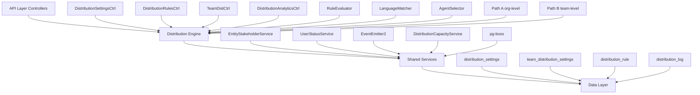

## Overview

The Distribution Module automates lead assignment within organizations. When a new lead is created, the system evaluates org-defined rules to automatically assign the lead to the most appropriate agent — based on lead attributes, agent availability, language compatibility, and capacity.

<Note>
**Status:** Active — fully implemented  
**Module Path:** `src/modules/crm/distribution/`
</Note>

### Design Principles

| Principle | Decision |
|-----------|----------|
| Async distribution | `createLead()` emits `LEAD_CREATED`; a pg-boss worker handles distribution — lead creation is never blocked |
| Stakeholder system reuse | Distribution creates `EntityStakeholder` records via `EntityStakeholderService`, not a new paradigm |
| First-match-wins rules | Rules are evaluated top-to-bottom by priority; the first matching rule wins |
| Idempotency | Distribution engine checks for existing stakeholders or pending offers before running |
| No retroactive distribution | Existing leads are unaffected when rules are created; only new leads trigger distribution |
| pg-boss scheduling | Distribution queue uses pg-boss for reliability and retry guarantees |
| RLS compliance | All entities carry `organization_id` for row-level security |

### Distribution Paths

The engine supports two execution paths:

<Tabs>
  <Tab title="Path A - Organization Level">
    **Org-level distribution** (`runDistribution`): triggered when a lead enters the org with no team context. Evaluates org-scoped rules, applies the org default method, and can bridge to Path B if a rule or default method routes to a team that has `distributionEnabled = true`.
  </Tab>
  <Tab title="Path B - Team Level">
    **Team-level distribution** (`runTeamDistribution`): triggered directly when:
    - A lead is created with a `teamId` in the event payload (team pool assignment)
    - Path A determines the lead belongs to an auto-distributing team
    - Idempotency check finds a single team-only stakeholder with auto-distribute enabled

    Path B evaluates team-scoped rules, uses team settings (with org fallback for capacity), and logs the team FK on the resulting `DistributionLog` record.
  </Tab>
</Tabs>

## Architecture

### High-Level System Overview



### Component Responsibilities

| Component | Responsibility |
|-----------|----------------|
| **DistributionEngine** | Orchestrator: receives a lead, evaluates rules, selects agent, creates assignment. Supports Path A (org) and Path B (team). |
| **RuleEvaluator** | Evaluates rule conditions against lead data; returns first matching rule |
| **LanguageMatcher** | Filters and ranks agents by language compatibility with the lead's person |
| **AgentSelector** | Applies the distribution method (round-robin, weighted, weighted-round-robin, direct) to the filtered agent pool |
| **DistributionCapacityService** | Two-phase capacity enforcement: Phase 1 `filterByCapacity()` (lead counts vs limits); Phase 2 `confirmCapacityAndAssign()` (advisory locks + atomic stakeholder creation). |
| **UserStatusService** | Pre-filters candidate agents to ONLINE status; filters by per-user working hours (`filterByWorkingHours`); provides `isWithinWorkingHours()` for org-level business hours check. |
| **DistributionListener** | Listens for `LEAD_CREATED` events and enqueues pg-boss jobs |
| **DistributionJobHandler** | pg-boss worker that processes distribution jobs |

## Entity Specifications

### DistributionSettings (Organization Level)

Org-level configuration for the distribution engine. Auto-created with defaults on first access via `getOrgSettingsRaw()`. Unique constraint on `organization_id`.

<AccordionGroup>
  <Accordion title="Schema Definition">
    | Column | Type | Notes |
    |--------|------|-------|
    | id | uuid PK | |
    | organization_id | uuid FK UNIQUE | RLS |
    | distribution_enabled | bool | default `false`. Master on/off switch |
    | max_active_leads_per_agent | int | default 50 |
    | max_new_leads_per_day | int | default 15 |
    | capacity_enforcement_enabled | bool | default `false` |
    | respect_business_hours | bool | default `true` |
    | outside_hours_action | enum | `QUEUE`, `POOL`, `DUTY_AGENT` |
    | duty_agent_id | uuid FK nullable | used when `outside_hours_action = DUTY_AGENT` |
    | default_method | enum | `ROUND_ROBIN`, `POOL`, `SPECIFIC_TEAM` |
    | default_team_id | uuid FK nullable | used when `default_method = SPECIFIC_TEAM` |
    | default_language_matching_mode | enum | `STRICT`, `PREFERRED` |
    | default_balancing_factors | jsonb nullable | Optional balancing configuration |
    | pool_alert_enabled | bool | Whether to send pool-overload alerts |
    | pool_alert_threshold | int | Lead count that triggers an alert |
    | pool_alert_window_minutes | int | Rolling window for counting unassigned leads |
    | updated_by | uuid FK nullable | |
    | created_at, updated_at | timestamp | |
  </Accordion>
</AccordionGroup>

<Warning>
**Master Toggle Behavior:**
- `distributionEnabled = false` (new-org default): Engine is off. No pg-boss jobs created.
- `distributionEnabled = true`: Engine is active. When toggled from `false` → `true`, if `defaultMethod` is still `POOL` it auto-upgrades to `ROUND_ROBIN`.
</Warning>

<Info>
**Business Hours Source:** Business hours schedule is stored on `Organization.settings.businessHours`, not on `DistributionSettings`. The `respectBusinessHours` field only controls whether the distribution engine gates against that org-level schedule.
</Info>

### TeamDistributionSettings

Per-team distribution configuration. One record per `(organization, team)` pair with unique index `uq_team_distribution_settings_org_team`.

<AccordionGroup>
  <Accordion title="Schema Definition">
    | Column | Type | Notes |
    |--------|------|-------|
    | id | uuid PK | |
    | organization_id | uuid FK | RLS |
    | team_id | uuid FK | (required, not nullable) |
    | distribution_enabled | bool | default `false`. Enables Path B auto-distribution |
    | distribution_method | enum | default `ROUND_ROBIN` |
    | agent_weights | jsonb nullable | `{ [userId]: weight }` for WEIGHTED method |
    | language_matching_enabled | bool | default `false` |
    | language_matching_mode | enum nullable | Language matching mode override |
    | capacity_enforcement_enabled | bool | default `false`. Independent from org toggle |
    | max_active_leads_per_agent | int nullable | `null` = inherit from org settings |
    | max_new_leads_per_day | int nullable | `null` = inherit from org settings |
    | respect_business_hours | bool | default `false` |
    | last_assigned_index | int | default 0. Round-robin cursor |
    | default_balancing_factors | jsonb nullable | |
    | updated_by | uuid FK nullable | |
    | created_at, updated_at | timestamp | |
  </Accordion>
</AccordionGroup>

**Effective Capacity Resolution:**

```typescript
if (team.capacityEnforcementEnabled) {
  maxActive = team.maxActiveLeadsPerAgent ?? org.maxActiveLeadsPerAgent
  maxDaily = team.maxNewLeadsPerDay ?? org.maxNewLeadsPerDay
} else {
  // no capacity checks applied for this team's distributions
}
```

### DistributionRule

Rules are evaluated in ascending `priority` order (lower number = higher priority). First match wins.

<AccordionGroup>
  <Accordion title="Schema Definition">
    | Column | Type | Notes |
    |--------|------|-------|
    | id | uuid PK | |
    | organization_id | uuid FK | RLS |
    | name | varchar | |
    | priority | int | lower = higher priority |
    | is_active | bool | default true |
    | scope | enum | `ORGANIZATION`, `TEAM` |
    | team_id | uuid FK nullable | for team-scoped rules |
    | condition_groups | jsonb | `[{conditions:[{field,operator,value}]}]` |
    | method | enum | `ROUND_ROBIN`, `WEIGHTED`, `WEIGHTED_ROUND_ROBIN`, `DIRECT` |
    | recipients | jsonb | `{agentIds?, teamId?, poolId?, weights?}` |
    | language_matching_enabled | bool | default true |
    | language_matching_mode | enum | `STRICT`, `PREFERRED` |
    | balancing_factors | jsonb nullable | |
    | last_assigned_index | int | round-robin cursor |
    | created_by | uuid FK | |
    | created_at, updated_at | timestamp | |
    | is_deleted | bool | soft delete |
  </Accordion>
  
  <Accordion title="Supported Rule Conditions">
    | Field | Operator(s) | Example Value |
    |-------|-------------|---------------|
    | `leadSource` | `eq`, `in` | `'WEBSITE'`, `['WEBSITE', 'REFERRAL']` |
    | `temperature` | `eq`, `in` | `'HOT'` |
    | `language` | `eq` | `'ar'` (matched against `person.preferredLanguage`) |
    | `budget` | `gte`, `lte`, `between` | `500000` |
    | `tags` | `contains` | `['vip']` |
    | `sourceChannel` | `eq`, `in` | `'WHATSAPP'` |
    | `intent` | `eq` | `'BUY'` |
    | `area` | `eq`, `in`, `contains` | `'Dubai Marina'`, `['JBR', 'Downtown Dubai']` |

    <Note>
    All string-based condition fields use **case-insensitive matching**. The `area` field requires data from `LeadPropertyInterest.preferredAreas[]`.
    </Note>
  </Accordion>
</AccordionGroup>

## Type Definitions

### Core Distribution Types

<CodeGroup>

```typescript Distribution Method Types
export enum DistributionMethod {
  ROUND_ROBIN = 'ROUND_ROBIN',
  WEIGHTED = 'WEIGHTED', 
  WEIGHTED_ROUND_ROBIN = 'WEIGHTED_ROUND_ROBIN',
  DIRECT = 'DIRECT',
  POOL = 'POOL',
  SPECIFIC_TEAM = 'SPECIFIC_TEAM'
}

export enum OutsideHoursAction {
  QUEUE = 'QUEUE',
  POOL = 'POOL', 
  DUTY_AGENT = 'DUTY_AGENT'
}

export enum LanguageMatchingMode {
  STRICT = 'STRICT',    // exact match required
  PREFERRED = 'PREFERRED' // prefer match, fallback allowed
}

export enum RuleScope {
  ORGANIZATION = 'ORGANIZATION',
  TEAM = 'TEAM'
}
```

```typescript Rule Condition Types
export interface RuleCondition {
  field: string;
  operator: 'eq' | 'in' | 'gte' | 'lte' | 'between' | 'contains';
  value: any;
}

export interface RuleConditionGroup {
  conditions: RuleCondition[];
}

export interface RuleRecipients {
  agentIds?: string[];
  teamId?: string;
  poolId?: string;
  weights?: Record<string, number>;
}
```

```typescript Distribution Context
export interface DistributionContext {
  leadId: string;
  organizationId: string;
  teamId?: string;
  triggeredBy: 'LEAD_CREATED' | 'MANUAL' | 'RULE_CHANGED';
  metadata?: Record<string, any>;
}

export interface DistributionResult {
  success: boolean;
  assignedAgentId?: string;
  assignedTeamId?: string;
  method: DistributionMethod;
  ruleId?: string;
  reason: string;
  logId?: string;
}
```

</CodeGroup>

## Distribution Engine

### Engine Flow

<Steps>
  <Step title="Idempotency Check">
    Check if lead already has stakeholders or pending distribution jobs
  </Step>
  <Step title="Path Determination">
    Determine whether to use Path A (org-level) or Path B (team-level) distribution
  </Step>
  <Step title="Business Hours Gating">
    Check if distribution should be gated by business hours
  </Step>
  <Step title="Rule Evaluation">
    Evaluate applicable rules in priority order (first match wins)
  </Step>
  <Step title="Agent Selection">
    Apply distribution method to filtered agent pool
  </Step>
  <Step title="Capacity Enforcement">
    Verify and atomically assign respecting capacity limits
  </Step>
  <Step title="Stakeholder Creation">
    Create EntityStakeholder record and log distribution
  </Step>
</Steps>

### Rule Evaluation Logic

The `RuleEvaluator` processes rules using AND-within-OR condition groups:

```typescript
// Example rule evaluation
const ruleMatches = (rule: DistributionRule, lead: Lead): boolean => {
  return rule.conditionGroups.some(group => 
    group.conditions.every(condition => 
      evaluateCondition(condition, lead)
    )
  );
};
```

<Note>
Rules are evaluated in ascending `priority` order. The first matching active rule wins - subsequent rules are ignored.
</Note>

### Agent Selection Methods

<Tabs>
  <Tab title="Round Robin">
    Cycles through agents sequentially using `last_assigned_index` cursor.
    
    ```typescript
    const selectRoundRobin = (agents: User[], cursor: number): User => {
      const nextIndex = (cursor + 1) % agents.length;
      return agents[nextIndex];
    };
    ```
  </Tab>
  
  <Tab title="Weighted">
    Assigns based on configured weights using weighted random selection.
    
    ```typescript
    const selectWeighted = (agents: User[], weights: Record<string, number>): User => {
      const totalWeight = agents.reduce((sum, agent) => 
        sum + (weights[agent.id] || 1), 0
      );
      // Random selection based on cumulative weights
    };
    ```
  </Tab>
  
  <Tab title="Weighted Round Robin">
    Combines round-robin with weights - agents with higher weights appear more frequently in rotation.
  </Tab>
  
  <Tab title="Direct">
    Assigns to specific agent(s) defined in rule recipients.
  </Tab>
</Tabs>

## pg-boss Job Configuration

### Job Queue Setup

<CodeGroup>

```typescript Job Handler Registration
// Distribution job handler
await this.jobService.createJob('lead-distribution', {
  retryLimit: 3,
  retryDelay: 30,
  expireInHours: 24
});

// Job processing
this.jobService.subscribe('lead-distribution', async (job) => {
  const { leadId, organizationId, teamId } = job.data;
  await this.distributionEngine.processDistribution({
    leadId,
    organizationId, 
    teamId,
    triggeredBy: 'LEAD_CREATED'
  });
});
```

```typescript Job Enqueueing
// From DistributionListener
@EventListener(LeadEvents.LEAD_CREATED)
async handleLeadCreated(event: LeadCreatedEvent) {
  const orgSettings = await this.getOrgSettings(event.organizationId);
  
  if (!orgSettings.distributionEnabled) {
    return; // Skip when distribution disabled
  }
  
  await this.jobService.enqueue('lead-distribution', {
    leadId: event.leadId,
    organizationId: event.organizationId,
    teamId: event.teamId // optional
  });
}
```

</CodeGroup>

<Warning>
Jobs are only enqueued when `distributionEnabled = true` at the organization level. When disabled, leads remain in the pool without triggering distribution.
</Warning>

## API Endpoints

### Distribution Settings Management

<AccordionGroup>
  <Accordion title="GET /api/distribution/settings">
    Get organization distribution settings with computed defaults.
    
    **Response:**
    ```json
    {
      "id": "uuid",
      "organizationId": "uuid", 
      "distributionEnabled": false,
      "maxActiveLeadsPerAgent": 50,
      "maxNewLeadsPerDay": 15,
      "capacityEnforcementEnabled": false,
      "respectBusinessHours": true,
      "outsideHoursAction": "POOL",
      "dutyAgentId": null,
      "defaultMethod": "POOL",
      "defaultTeamId": null,
      "defaultLanguageMatchingMode": "PREFERRED"
    }
    ```
  </Accordion>
  
  <Accordion title="PATCH /api/distribution/settings">
    Update organization distribution settings.
    
    **Request Body:**
    ```json
    {
      "distributionEnabled": true,
      "defaultMethod": "ROUND_ROBIN",
      "capacityEnforcementEnabled": true,
      "maxActiveLeadsPerAgent": 40
    }
    ```
    
    <Note>
    When enabling distribution (`distributionEnabled: false → true`), if `defaultMethod` is `POOL`, it auto-upgrades to `ROUND_ROBIN`.
    </Note>
  </Accordion>
</AccordionGroup>

### Team Distribution Settings

<AccordionGroup>
  <Accordion title="GET /api/distribution/teams/:teamId/settings">
    Get team-specific distribution settings.
    
    **Response:**
    ```json
    {
      "id": "uuid",
      "teamId": "uuid",
      "distributionEnabled": false,
      "distributionMethod": "ROUND_ROBIN", 
      "agentWeights": {"agent1": 2, "agent2": 1},
      "languageMatchingEnabled": false,
      "capacityEnforcementEnabled": false,
      "maxActiveLeadsPerAgent": null,
      "respectBusinessHours": false
    }
    ```
  </Accordion>
  
  <Accordion title="PATCH /api/distribution/teams/:teamId/settings">
    Update team distribution settings.
    
    **Request Body:**
    ```json
    {
      "distributionEnabled": true,
      "distributionMethod": "WEIGHTED",
      "agentWeights": {"agent1": 3, "agent2": 1}
    }
    ```
  </Accordion>
</AccordionGroup>

### Distribution Rules Management

<AccordionGroup>
  <Accordion title="GET /api/distribution/rules">
    List distribution rules for organization or team.
    
    **Query Parameters:**
    - `scope`: `ORGANIZATION` | `TEAM` 
    - `teamId`: required when scope=TEAM
    - `includeInactive`: boolean (default false)
    
    **Response:**
    ```json
    {
      "rules": [
        {
          "id": "uuid",
          "name": "VIP Leads",
          "priority": 1,
          "isActive": true,
          "scope": "ORGANIZATION",
          "conditionGroups": [
            {
              "conditions": [
                {"field": "tags", "operator": "contains", "value": ["vip"]}
              ]
            }
          ],
          "method": "DIRECT",
          "recipients": {"agentIds": ["agent1"]},
          "languageMatchingEnabled": true
        }
      ]
    }
    ```
  </Accordion>
  
  <Accordion title="POST /api/distribution/rules">
    Create a new distribution rule.
    
    **Request Body:**
    ```json
    {
      "name": "Arabic Speakers",
      "priority": 5,
      "scope": "ORGANIZATION", 
      "conditionGroups": [
        {
          "conditions": [
            {"field": "language", "operator": "eq", "value": "ar"}
          ]
        }
      ],
      "method": "ROUND_ROBIN",
      "recipients": {"agentIds": ["agent1", "agent2"]},
      "languageMatchingEnabled": true,
      "languageMatchingMode": "STRICT"
    }
    ```
  </Accordion>
  
  <Accordion title="PUT /api/distribution/rules/:ruleId">
    Update an existing distribution rule.
  </Accordion>
  
  <Accordion title="DELETE /api/distribution/rules/:ruleId">
    Soft delete a distribution rule.
  </Accordion>
  
  <Accordion title="POST /api/distribution/rules/reorder">
    Reorder rule priorities.
    
    **Request Body:**
    ```json
    {
      "ruleIds": ["rule1", "rule2", "rule3"]
    }
    ```
  </Accordion>
</AccordionGroup>

### Manual Distribution & Testing

<AccordionGroup>
  <Accordion title="POST /api/distribution/manual/:leadId">
    Manually trigger distribution for a specific lead.
    
    **Request Body:**
    ```json
    {
      "force": false // whether to force redistribution
    }
    ```
  </Accordion>
  
  <Accordion title="POST /api/distribution/test">
    Test rule evaluation against sample lead data.
    
    **Request Body:**
    ```json
    {
      "leadData": {
        "leadSource": "WEBSITE",
        "temperature": "HOT", 
        "person": {"preferredLanguage": "ar"},
        "propertyInterests": [
          {"preferredAreas": ["Dubai Marina"]}
        ]
      },
      "scope": "ORGANIZATION",
      "teamId": null
    }
    ```
    
    **Response:**
    ```json
    {
      "matchedRule": {
        "id": "uuid",
        "name": "Arabic Speakers",
        "priority": 5
      },
      "eligibleAgents": ["agent1", "agent2"],
      "selectedAgent": "agent1", 
      "method": "ROUND_ROBIN",
      "simulationOnly": true
    }
    ```
  </Accordion>
</AccordionGroup>

### Analytics & Reporting

<AccordionGroup>
  <Accordion title="GET /api/distribution/analytics/overview">
    Get distribution analytics overview.
    
    **Query Parameters:**
    - `startDate`: ISO date string
    - `endDate`: ISO date string  
    - `teamId`: optional team filter
    
    **Response:**
    ```json
    {
      "totalDistributions": 150,
      "successfulDistributions": 142,
      "failedDistributions": 8,
      "averageDistributionTime": 1.2,
      "topPerformingRules": [
        {"ruleId": "uuid", "name": "VIP Leads", "hits": 25}
      ],
      "agentWorkload": [
        {"agentId": "uuid", "activeLeads": 15, "newLeadsToday": 3}
      ]
    }
    ```
  </Accordion>
  
  <Accordion title="GET /api/distribution/analytics/capacity">
    Get current capacity status across agents.
    
    **Response:**
    ```json
    {
      "agents": [
        {
          "agentId": "uuid",
          "name": "John Doe", 
          "activeLeads": 15,
          "maxActiveLeads": 50,
          "newLeadsToday": 3,
          "maxNewLeadsPerDay": 15,
          "utilizationPercent": 30,
          "isAtCapacity": false
        }
      ],
      "organizationAverageUtilization": 45.2
    }
    ```
  </Accordion>
</AccordionGroup>

## Security & Permissions

### Row Level Security (RLS)

All distribution entities include `organization_id` for RLS enforcement:

<CodeGroup>

```sql Distribution Settings RLS
CREATE POLICY "distribution_settings_org_isolation" ON distribution_settings
  USING (organization_id = current_setting('app.current_organization_id')::uuid);
```

```sql Distribution Rules RLS  
CREATE POLICY "distribution_rules_org_isolation" ON distribution_rule
  USING (organization_id = current_setting('app.current_organization_id')::uuid);
```

```sql Team Settings RLS
CREATE POLICY "team_distribution_settings_org_isolation" ON team_distribution_settings
  USING (organization_id = current_setting('app.current_organization_id')::uuid);
```

</CodeGroup>

### Permission Requirements

| Action | Required Permission |
|--------|-------------------|
| View distribution settings | `CRM:SETTINGS:READ` |
| Update distribution settings | `CRM:SETTINGS:WRITE` |
| Manage distribution rules | `CRM:DISTRIBUTION:MANAGE` |
| View team distribution settings | `TEAM:SETTINGS:READ` |
| Update team distribution settings | `TEAM:SETTINGS:WRITE` |
| Manual distribution trigger | `CRM:LEADS:ASSIGN` |
| View distribution analytics | `CRM:ANALYTICS:READ` |

<Warning>
Team-scoped operations require additional validation that the user has access to the specified team through team membership or appropriate role permissions.
</Warning>

## Observability & Audit

### Distribution Logging

Every distribution attempt is logged in the `distribution_log` table:

<AccordionGroup>
  <Accordion title="Distribution Log Schema">
    | Column | Type | Notes |
    |--------|------|-------|
    | id | uuid PK | |
    | organization_id | uuid FK | RLS |
    | lead_id | uuid FK | |
    | team_id | uuid FK nullable | Set for Path B distributions |
    | rule_id | uuid FK nullable | Which rule matched (if any) |
    | agent_id | uuid FK nullable | Assigned agent |
    | method | enum | Distribution method used |
    | status | enum | `SUCCESS`, `FAILED`, `SKIPPED` |
    | reason | text | Human-readable explanation |
    | execution_time_ms | int | Processing duration |
    | metadata | jsonb | Additional context |
    | created_at | timestamp | |
  </Accordion>
</AccordionGroup>

### Audit Trail Events

<CodeGroup>

```typescript Distribution Events
export const DistributionEvents = {
  DISTRIBUTION_STARTED: 'distribution.started',
  DISTRIBUTION_COMPLETED: 'distribution.completed', 
  DISTRIBUTION_FAILED: 'distribution.failed',
  RULE_MATCHED: 'distribution.rule.matched',
  AGENT_ASSIGNED: 'distribution.agent.assigned',
  CAPACITY_EXCEEDED: 'distribution.capacity.exceeded',
  BUSINESS_HOURS_GATED: 'distribution.business_hours.gated'
} as const;
```

```typescript Event Payload Example
{
  eventType: 'distribution.completed',
  timestamp: '2024-01-15T10:30:00Z',
  organizationId: 'uuid',
  leadId: 'uuid', 
  agentId: 'uuid',
  ruleId: 'uuid',
  method: 'ROUND_ROBIN',
  executionTimeMs: 120,
  metadata: {
    path: 'ORGANIZATION',
    eligibleAgentsCount: 5,
    capacityCheckPassed: true
  }
}
```

</CodeGroup>

## Analytics & Metrics

### Key Performance Indicators

<CardGroup cols={2}>
  <Card title="Distribution Success Rate" icon="chart-line">
    Percentage of leads successfully assigned vs. total distribution attempts
  </Card>
  <Card title="Average Assignment Time" icon="clock">
    Mean time from lead creation to agent assignment 
  </Card>
  <Card title="Agent Utilization" icon="users">
    Current active leads vs. capacity limits per agent
  </Card>
  <Card title="Rule Effectiveness" icon="target">
    Hit rate and success rate for each distribution rule
  </Card>
</CardGroup>

### Capacity Monitoring

The system tracks agent capacity in real-time:

- **Active Leads**: Current count of leads assigned to each agent
- **Daily Lead Count**: New leads assigned today (resets at midnight in org timezone)  
- **Utilization Percentage**: Active leads / max capacity * 100
- **Capacity Alerts**: Triggered when utilization exceeds thresholds

### Business Intelligence Queries

<AccordionGroup>
  <Accordion title="Agent Workload Distribution">
    ```sql
    SELECT 
      u.id,
      u.name,
      COUNT(es.entity_id) as active_leads,
      ds.max_active_leads_per_agent,
      ROUND(COUNT(es.entity_id)::numeric / ds.max_active_leads_per_agent * 100, 2) as utilization_pct
    FROM users u
    LEFT JOIN entity_stakeholder es ON es.user_id = u.id AND es.entity_type = 'LEAD'
    CROSS JOIN distribution_settings ds
    WHERE u.organization_id = $1
    GROUP BY u.id, u.name, ds.max_active_leads_per_agent
    ORDER BY utilization_pct DESC;
    ```
  </Accordion>
  
  <Accordion title="Rule Performance Analysis">
    ```sql
    SELECT 
      dr.name,
      dr.priority,
      COUNT(dl.id) as total_hits,
      COUNT(dl.id) FILTER (WHERE dl.status = 'SUCCESS') as successful_hits,
      ROUND(COUNT(dl.id) FILTER (WHERE dl.status = 'SUCCESS')::numeric / COUNT(dl.id) * 100, 2) as success_rate
    FROM distribution_rule dr
    LEFT JOIN distribution_log dl ON dl.rule_id = dr.id
    WHERE dr.organization_id = $1 
      AND dr.is_active = true
      AND dl.created_at >= $2
    GROUP BY dr.id, dr.name, dr.priority
    ORDER BY dr.priority;
    ```
  </Accordion>
</AccordionGroup>

## Edge Case Handling

### Common Failure Scenarios

<Tabs>
  <Tab title="No Eligible Agents">
    **Scenario**: All agents are at capacity or offline
    
    **Handling**:
    - Log failure with reason "NO_ELIGIBLE_AGENTS"
    - Lead remains in pool
    - Optional alert sent to administrators
    - Retry logic via pg-boss job scheduling
  </Tab>
  
  <Tab title="Rule Configuration Errors">
    **Scenario**: Rule references deleted agents or invalid data
    
    **Handling**:
    - Skip invalid rule, continue to next rule
    - Log warning with rule validation errors
    - Fall back to organization default method
    - Admin notification for rule cleanup
  </Tab>
  
  <Tab title="Capacity Race Conditions">
    **Scenario**: Multiple distributions competing for last available capacity slot
    
    **Handling**:
    - Advisory locks prevent race conditions
    - Atomic capacity check + assignment
    - Failed attempts get NO_CAPACITY status
    - Automatic retry with fresh agent selection
  </Tab>
  
  <Tab title="Business Hours Edge Cases">
    **Scenario**: Lead created exactly at business hours boundary
    
    **Handling**:
    - Use lead creation timestamp for BH evaluation
    - Account for organization timezone properly
    - Grace period for transitions (configurable)
    - Clear audit trail of BH gating decisions
  </Tab>
</Tabs>

### Error Recovery

<Steps>
  <Step title="Automatic Retry">
    pg-boss handles automatic retries with exponential backoff (max 3 attempts)
  </Step>
  <Step title="Dead Letter Queue">
    Failed jobs after max retries go to dead letter queue for manual review
  </Step>
  <Step title="Admin Notifications">
    Critical failures trigger immediate alerts to org administrators
  </Step>
  <Step title="Graceful Degradation">
    If distribution fails, lead remains accessible in pool for manual assignment
  </Step>
</Steps>

## Performance & Scaling

### Database Optimization

<AccordionGroup>
  <Accordion title="Essential Indexes">
    ```sql
    -- Distribution rule evaluation
    CREATE INDEX idx_distribution_rule_org_active_priority 
    ON distribution_rule (organization_id, is_active, priority)
    WHERE is_deleted = false;

    -- Capacity queries
    CREATE INDEX idx_entity_stakeholder_user_type_active
    ON entity_stakeholder (user_id, entity_type)  
    WHERE deleted_at IS NULL;

    -- Distribution log analysis
    CREATE INDEX idx_distribution_log_org_created
    ON distribution_log (organization_id, created_at);

    -- Team distribution lookups
    CREATE INDEX idx_team_distribution_settings_team
    ON team_distribution_settings (team_id, distribution_enabled);
    ```
  </Accordion>
  
  <Accordion title="Query Performance">
    **Capacity Queries**: Use window functions and CTEs to minimize database round-trips
    
    **Rule Evaluation**: Load and cache rules per organization to avoid repeated DB hits
    
    **Agent Filtering**: Leverage database-level filtering before application logic
    
    **Round-Robin Updates**: Use atomic increment operations for cursor management
  </Accordion>
</AccordionGroup>

### Scaling Considerations

<Warning>
**High-Volume Organizations**: For orgs with >1000 agents or >10,000 leads/day, consider:
- Partitioning distribution_log by organization and date
- Read replicas for analytics queries  
- Caching of distribution settings and rules
- Dedicated pg-boss worker pools
</Warning>

<Tip>
**Performance Monitoring**: Track key metrics:
- Distribution job queue depth
- Average rule evaluation time
- Capacity query execution time
- Database lock contention on high-throughput updates
</Tip>

## Module Structure

### File Organization

```
src/modules/crm/distribution/
├── controllers/
│   ├── distribution-settings.controller.ts
│   ├── distribution-rules.controller.ts  
│   ├── team-distribution.controller.ts
│   └── distribution-analytics.controller.ts
├── services/
│   ├── distribution-engine.service.ts
│   ├── distribution-settings.service.ts
│   ├── distribution-capacity.service.ts
│   ├── rule-evaluator.service.ts
│   ├── language-matcher.service.ts
│   └── agent-selector.service.ts
├── entities/
│   ├── distribution-settings.entity.ts
│   ├── team-distribution-settings.entity.ts
│   ├── distribution-rule.entity.ts
│   └── distribution-log.entity.ts
├── dto/
│   ├── distribution-settings.dto.ts
│   ├── distribution-rule.dto.ts
│   └── distribution-analytics.dto.ts
├── listeners/
│   └── distribution.listener.ts
├── jobs/
│   └── distribution-job.handler.ts
└── distribution.module.ts
```

### Key Dependencies

<CardGroup cols={2}>
  <Card title="Internal Modules" icon="box">
    - CRM Core Module (Lead, Person entities)
    - Entity Stakeholder Module  
    - User Management Module
    - Team Management Module
    - Job Queue Module (pg-boss)
  </Card>
  <Card title="External Libraries" icon="package">
    - @mikro-orm/core (Database ORM)
    - @nestjs/event-emitter (Event handling)
    - @nestjs/schedule (Cron jobs)
    - uuid (ID generation)
  </Card>
</CardGroup>

## Integration Points

### Event Integration

<CodeGroup>

```typescript Lead Creation Integration
// From Lead Service
async createLead(data: CreateLeadDto): Promise<Lead> {
  const lead = await this.leadRepository.create(data);
  
  // Emit event for distribution
  this.eventEmitter.emit(LeadEvents.LEAD_CREATED, {
    leadId: lead.id,
    organizationId: lead.organizationId,
    teamId: data.teamId, // optional
    source: 'API'
  });
  
  return lead;
}
```

```typescript Import Integration  
// From Lead Import Service
async processImportedLeads(leads: ImportLeadData[]): Promise<void> {
  for (const leadData of leads) {
    const lead = await this.createLead(leadData);
    
    // Batch distribution events
    this.eventEmitter.emit(LeadEvents.LEAD_CREATED, {
      leadId: lead.id,
      organizationId: lead.organizationId, 
      source: 'IMPORT'
    });
  }
}
```

</CodeGroup>

### Stakeholder Integration

The distribution module leverages the existing `EntityStakeholderService` for all lead assignments:

```typescript
// Distribution creates standard stakeholder records
await this.stakeholderService.create({
  entityType: EntityType.LEAD,
  entityId: leadId,
  userId: selectedAgentId,
  role: StakeholderRole.ASSIGNEE,
  organizationId,
  assignedBy: 'DISTRIBUTION_ENGINE',
  metadata: {
    ruleId: matchedRule?.id,
    method: distributionMethod,
    distributionLogId: logRecord.id
  }
});
```

<Check>
This approach ensures consistency with manual assignments and other lead assignment flows throughout the CRM.
</Check>

## Environment Configuration

### Required Environment Variables

<CodeGroup>

```bash Production Settings
# pg-boss Configuration
PG_BOSS_SCHEMA=pgboss
PG_BOSS_MAX_CONNECTIONS=10

# Distribution Feature Flags
DISTRIBUTION_MODULE_ENABLED=true
DISTRIBUTION_ANALYTICS_ENABLED=true

# Performance Tuning
DISTRIBUTION_RULE_CACHE_TTL=300
DISTRIBUTION_MAX_CONCURRENT_JOBS=50
```

```bash Development Settings  
# Development overrides
DISTRIBUTION_MODULE_ENABLED=true
DISTRIBUTION_DEBUG_LOGGING=true
DISTRIBUTION_SKIP_BUSINESS_HOURS=false

# Testing
DISTRIBUTION_TEST_MODE=false
DISTRIBUTION_SIMULATE_DELAYS=false
```

</CodeGroup>

### Feature Flags

| Flag | Default | Description |
|------|---------|-------------|
| `DISTRIBUTION_MODULE_ENABLED` | `true` | Master feature toggle |
| `DISTRIBUTION_ANALYTICS_ENABLED` | `true` | Enable analytics endpoints |
| `DISTRIBUTION_CAPACITY_ENFORCEMENT` | `true` | Enable capacity checking |
| `DISTRIBUTION_LANGUAGE_MATCHING` | `true` | Enable language-based filtering |
| `DISTRIBUTION_BUSINESS_HOURS` | `true` | Enable business hours gating |

<Info>
Feature flags provide granular control over distribution functionality, allowing for gradual rollouts and quick disabling of specific features if issues arise.
</Info>