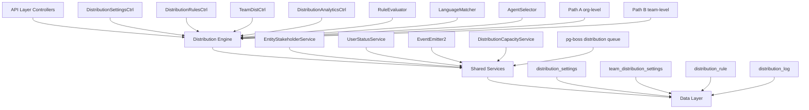

# Distribution Module - Final Specification

<Note>
**Status:** Active — fully implemented  
**Module Path:** `src/modules/crm/distribution/`
</Note>

## Overview

The Distribution Module automates lead assignment within organizations. When a new lead is created, the system evaluates org-defined rules to automatically assign the lead to the most appropriate agent — based on lead attributes, agent availability, language compatibility, and capacity.

### Design Principles

<CardGroup cols={2}>
  <Card title="Async Distribution" icon="clock">
    `createLead()` emits `LEAD_CREATED`; a pg-boss worker handles distribution — lead creation is never blocked
  </Card>
  <Card title="Stakeholder System Reuse" icon="link">
    Distribution creates `EntityStakeholder` records via `EntityStakeholderService`, not a new paradigm
  </Card>
  <Card title="First-Match-Wins Rules" icon="trophy">
    Rules are evaluated top-to-bottom by priority; the first matching rule wins
  </Card>
  <Card title="Idempotency" icon="shield-check">
    Distribution engine checks for existing stakeholders or pending offers before running
  </Card>
</CardGroup>

<Info>
**No Retroactive Distribution:** Existing leads are unaffected when rules are created; only new leads trigger distribution
</Info>

### Distribution Paths

The engine supports two execution paths:

<Tabs>
  <Tab title="Path A - Org-level">
    **Org-level distribution** (`runDistribution`): Triggered when a lead enters the org with no team context. Evaluates org-scoped rules, applies the org default method, and can bridge to Path B if a rule or default method routes to a team that has `distributionEnabled = true`.
  </Tab>
  <Tab title="Path B - Team-level">
    **Team-level distribution** (`runTeamDistribution`): Triggered directly when:
    - A lead is created with a `teamId` in the event payload (team pool assignment)
    - Path A determines the lead belongs to an auto-distributing team
    - Idempotency check finds a single team-only stakeholder with auto-distribute enabled
  </Tab>
</Tabs>

## Architecture

### High-Level Diagram



### Component Responsibilities

<AccordionGroup>
  <Accordion title="DistributionEngine">
    Orchestrator: receives a lead, evaluates rules, selects agent, creates assignment. Supports Path A (org) and Path B (team).
  </Accordion>
  <Accordion title="RuleEvaluator">
    Evaluates rule conditions against lead data; returns first matching rule
  </Accordion>
  <Accordion title="LanguageMatcher">
    Filters and ranks agents by language compatibility with the lead's person
  </Accordion>
  <Accordion title="AgentSelector">
    Applies the distribution method (round-robin, weighted, weighted-round-robin, direct) to the filtered agent pool
  </Accordion>
  <Accordion title="DistributionCapacityService">
    Two-phase capacity enforcement: Phase 1 `filterByCapacity()` (lead counts vs limits); Phase 2 `confirmCapacityAndAssign()` (advisory locks + atomic stakeholder creation). No entity of its own — queries `entity_stakeholder`.
  </Accordion>
  <Accordion title="UserStatusService">
    Pre-filters candidate agents to ONLINE status; filters by per-user working hours (`filterByWorkingHours`); provides `isWithinWorkingHours()` for org-level business hours check.
  </Accordion>
</AccordionGroup>

## Entity Specifications

### DistributionSettings (1 per org)

Org-level configuration for the distribution engine. Auto-created with defaults on first access via `getOrgSettingsRaw()`. Unique constraint on `organization_id`.

<CodeGroup>
```sql Schema
CREATE TABLE distribution_settings (
  id uuid PRIMARY KEY,
  organization_id uuid UNIQUE REFERENCES organizations(id),
  distribution_enabled boolean DEFAULT false,
  max_active_leads_per_agent integer DEFAULT 50,
  max_new_leads_per_day integer DEFAULT 15,
  capacity_enforcement_enabled boolean DEFAULT false,
  respect_business_hours boolean DEFAULT true,
  outside_hours_action text CHECK (outside_hours_action IN ('QUEUE', 'POOL', 'DUTY_AGENT')),
  duty_agent_id uuid REFERENCES users(id),
  default_method text CHECK (default_method IN ('ROUND_ROBIN', 'POOL', 'SPECIFIC_TEAM')),
  default_team_id uuid REFERENCES teams(id),
  default_language_matching_mode text CHECK (default_language_matching_mode IN ('STRICT', 'PREFERRED')),
  default_balancing_factors jsonb,
  pool_alert_enabled boolean,
  pool_alert_threshold integer,
  pool_alert_window_minutes integer,
  updated_by uuid REFERENCES users(id),
  created_at timestamp DEFAULT now(),
  updated_at timestamp DEFAULT now()
);
```

```typescript Entity
@Entity()
export class DistributionSettings {
  @PrimaryKey()
  id!: string;

  @Property()
  organizationId!: string;

  @Property({ default: false })
  distributionEnabled!: boolean;

  @Property({ default: 50 })
  maxActiveLeadsPerAgent!: number;

  @Property({ default: 15 })
  maxNewLeadsPerDay!: number;

  @Property({ default: false })
  capacityEnforcementEnabled!: boolean;

  @Property({ default: true })
  respectBusinessHours!: boolean;

  @Enum(() => OutsideHoursAction)
  outsideHoursAction?: OutsideHoursAction;

  @Property({ nullable: true })
  dutyAgentId?: string;

  @Enum(() => DistributionMethod)
  defaultMethod!: DistributionMethod;

  @Property({ nullable: true })
  defaultTeamId?: string;

  @Enum(() => LanguageMatchingMode)
  defaultLanguageMatchingMode!: LanguageMatchingMode;

  @Property({ type: 'jsonb', nullable: true })
  defaultBalancingFactors?: BalancingFactors;

  @Property({ default: false })
  poolAlertEnabled!: boolean;

  @Property({ nullable: true })
  poolAlertThreshold?: number;

  @Property({ nullable: true })
  poolAlertWindowMinutes?: number;
}
```
</CodeGroup>

<Warning>
**Master Toggle Behavior:**
- `distributionEnabled = false` (new-org default): Engine is off. `DistributionListener` and `LeadImportService` skip enqueue entirely — leads go to pool, no pg-boss jobs created.
- `distributionEnabled = true`: Engine is active. When toggled from `false` → `true`, if `defaultMethod` is still `POOL` it is auto-upgraded to `ROUND_ROBIN`.
</Warning>

### TeamDistributionSettings (1 per org+team)

Per-team distribution configuration. One record per `(organization, team)` pair — unique index `uq_team_distribution_settings_org_team`. Auto-created on first access.

<CodeGroup>
```sql Schema
CREATE TABLE team_distribution_settings (
  id uuid PRIMARY KEY,
  organization_id uuid NOT NULL REFERENCES organizations(id),
  team_id uuid NOT NULL REFERENCES teams(id),
  distribution_enabled boolean DEFAULT false,
  distribution_method text DEFAULT 'ROUND_ROBIN',
  agent_weights jsonb,
  language_matching_enabled boolean DEFAULT false,
  language_matching_mode text,
  capacity_enforcement_enabled boolean DEFAULT false,
  max_active_leads_per_agent integer,
  max_new_leads_per_day integer,
  respect_business_hours boolean DEFAULT false,
  last_assigned_index integer DEFAULT 0,
  default_balancing_factors jsonb,
  updated_by uuid REFERENCES users(id),
  created_at timestamp DEFAULT now(),
  updated_at timestamp DEFAULT now(),
  UNIQUE(organization_id, team_id)
);
```

```typescript Capacity Resolution
// DistributionSettingsService.resolveEffectiveCapacity
if (team.capacityEnforcementEnabled) {
  const maxActive = team.maxActiveLeadsPerAgent ?? org.maxActiveLeadsPerAgent;
  const maxDaily = team.maxNewLeadsPerDay ?? org.maxNewLeadsPerDay;
  return { maxActive, maxDaily };
} else {
  // no capacity checks applied for this team's distributions
  return null;
}
```
</CodeGroup>

### DistributionRule

Rules are evaluated in ascending `priority` order (lower number = higher priority). First match wins.

<CodeGroup>
```sql Schema
CREATE TABLE distribution_rule (
  id uuid PRIMARY KEY,
  organization_id uuid NOT NULL REFERENCES organizations(id),
  name varchar NOT NULL,
  priority integer NOT NULL,
  is_active boolean DEFAULT true,
  scope text CHECK (scope IN ('ORGANIZATION', 'TEAM')),
  team_id uuid REFERENCES teams(id),
  condition_groups jsonb NOT NULL,
  method text NOT NULL,
  recipients jsonb NOT NULL,
  language_matching_enabled boolean DEFAULT true,
  language_matching_mode text CHECK (language_matching_mode IN ('STRICT', 'PREFERRED')),
  balancing_factors jsonb,
  last_assigned_index integer DEFAULT 0,
  created_by uuid REFERENCES users(id),
  created_at timestamp DEFAULT now(),
  updated_at timestamp DEFAULT now(),
  is_deleted boolean DEFAULT false
);
```

```json Condition Structure
{
  "conditionGroups": [
    {
      "conditions": [
        {
          "field": "leadSource",
          "operator": "eq",
          "value": "WEBSITE"
        },
        {
          "field": "temperature", 
          "operator": "in",
          "value": ["HOT", "WARM"]
        }
      ]
    }
  ]
}
```
</CodeGroup>

#### Supported Rule Conditions

<AccordionGroup>
  <Accordion title="Lead Source Conditions">
    **Field:** `leadSource`  
    **Operators:** `eq`, `in`  
    **Example:** `'WEBSITE'`, `['WEBSITE', 'REFERRAL']`
  </Accordion>
  <Accordion title="Temperature Conditions">
    **Field:** `temperature`  
    **Operators:** `eq`, `in`  
    **Example:** `'HOT'`
  </Accordion>
  <Accordion title="Language Conditions">
    **Field:** `language`  
    **Operators:** `eq`  
    **Example:** `'ar'` (matched against `person.languages[].code`)
  </Accordion>
  <Accordion title="Budget Conditions">
    **Field:** `budget`  
    **Operators:** `gte`, `lte`, `between`  
    **Example:** `500000`
  </Accordion>
  <Accordion title="Tags Conditions">
    **Field:** `tags`  
    **Operators:** `contains`  
    **Example:** `['vip']`
  </Accordion>
  <Accordion title="Source Channel Conditions">
    **Field:** `sourceChannel`  
    **Operators:** `eq`, `in`  
    **Example:** `'WHATSAPP'`
  </Accordion>
  <Accordion title="Intent Conditions">
    **Field:** `intent`  
    **Operators:** `eq`  
    **Example:** `'BUY'`
  </Accordion>
  <Accordion title="Area Conditions">
    **Field:** `area`  
    **Operators:** `eq`, `in`, `contains`  
    **Example:** `'Dubai Marina'`, `['JBR', 'Downtown Dubai']`
  </Accordion>
</AccordionGroup>

<Info>
All string-based condition fields use **case-insensitive matching**. The `area` field requires data from `LeadPropertyInterest.preferredAreas[]` — the engine pre-loads the lead's property interests before evaluation.
</Info>

## Distribution Engine

### Core Distribution Flow

<Steps>
  <Step title="Event Reception">
    `DistributionListener` receives `LEAD_CREATED` event and enqueues pg-boss job
  </Step>
  <Step title="Idempotency Check">
    Engine verifies no existing stakeholders or pending distribution jobs
  </Step>
  <Step title="Business Hours Gating">
    If enabled, checks if distribution should proceed based on working hours
  </Step>
  <Step title="Rule Evaluation">
    `RuleEvaluator` processes rules in priority order, returns first match
  </Step>
  <Step title="Agent Selection">
    `AgentSelector` applies distribution method to filtered agent pool
  </Step>
  <Step title="Capacity Enforcement">
    Two-phase capacity check with advisory locks for atomic assignment
  </Step>
  <Step title="Assignment Creation">
    Creates `EntityStakeholder` record and logs distribution outcome
  </Step>
</Steps>

### Distribution Methods

<Tabs>
  <Tab title="Round Robin">
    **Method:** `ROUND_ROBIN`  
    Cycles through available agents sequentially using `last_assigned_index` cursor.
    
    ```typescript
    const nextIndex = (rule.lastAssignedIndex + 1) % eligibleAgents.length;
    const selectedAgent = eligibleAgents[nextIndex];
    await this.updateRuleIndex(rule.id, nextIndex);
    ```
  </Tab>
  
  <Tab title="Weighted">
    **Method:** `WEIGHTED`  
    Selects agent based on configured weights using weighted random selection.
    
    ```typescript
    const weights = rule.recipients.weights || {};
    const totalWeight = eligibleAgents.reduce((sum, agent) => 
      sum + (weights[agent.id] || 1), 0
    );
    const randomValue = Math.random() * totalWeight;
    // Select agent based on cumulative weight
    ```
  </Tab>
  
  <Tab title="Weighted Round Robin">
    **Method:** `WEIGHTED_ROUND_ROBIN`  
    Combines round-robin fairness with weighted preferences.
    
    ```typescript
    // Create weighted pool where agents appear multiple times
    // based on their weights, then apply round-robin
    const weightedPool = eligibleAgents.flatMap(agent => 
      Array(weights[agent.id] || 1).fill(agent)
    );
    ```
  </Tab>
  
  <Tab title="Direct Assignment">
    **Method:** `DIRECT`  
    Assigns to specific agent(s) defined in rule recipients.
    
    ```typescript
    const targetAgentIds = rule.recipients.agentIds;
    const availableTargets = eligibleAgents.filter(agent => 
      targetAgentIds.includes(agent.id)
    );
    ```
  </Tab>
</Tabs>

### Language Matching

The `LanguageMatcher` component provides language-based agent filtering:

<CodeGroup>
```typescript Strict Mode
// STRICT: Agent must have exact language match
filterAgentsByLanguage(agents: User[], leadLanguages: string[], mode: 'STRICT') {
  return agents.filter(agent => 
    agent.languages.some(lang => 
      leadLanguages.includes(lang.code)
    )
  );
}
```

```typescript Preferred Mode
// PREFERRED: Exact matches first, then fallback to all agents
filterAgentsByLanguage(agents: User[], leadLanguages: string[], mode: 'PREFERRED') {
  const exactMatches = agents.filter(agent => 
    agent.languages.some(lang => leadLanguages.includes(lang.code))
  );
  
  return exactMatches.length > 0 ? exactMatches : agents;
}
```
</CodeGroup>

## pg-boss Job Configuration

The distribution system uses pg-boss for reliable job processing:

<CodeGroup>
```typescript Job Configuration
export const DISTRIBUTION_JOB_CONFIG = {
  name: 'lead-distribution',
  options: {
    retryLimit: 3,
    retryDelay: 30,
    retryBackoff: true,
    expireInHours: 2,
    singletonKey: (payload) => `lead-${payload.leadId}`,
  }
};
```

```typescript Job Handler
@OnWorkerEvent({ name: 'lead-distribution' })
async handleDistributionJob(job: Job<DistributionJobPayload>) {
  const { leadId, organizationId, teamId } = job.data;
  
  try {
    if (teamId) {
      await this.distributionEngine.runTeamDistribution(leadId, teamId);
    } else {
      await this.distributionEngine.runDistribution(leadId);
    }
  } catch (error) {
    this.logger.error('Distribution job failed', { leadId, error });
    throw error; // Triggers retry
  }
}
```
</CodeGroup>

## API Endpoints

### Distribution Settings Management

<CodeGroup>
```typescript GET /distribution/settings
@Get('settings')
@RequirePermission('distribution:read')
async getSettings(@CurrentOrg() orgId: string) {
  return this.distributionSettingsService.getOrgSettings(orgId);
}
```

```typescript PUT /distribution/settings  
@Put('settings')
@RequirePermission('distribution:write')
async updateSettings(
  @CurrentOrg() orgId: string,
  @Body() dto: UpdateDistributionSettingsDto
) {
  return this.distributionSettingsService.update(orgId, dto);
}
```
</CodeGroup>

### Distribution Rules Management

<CodeGroup>
```typescript GET /distribution/rules
@Get('rules')
@RequirePermission('distribution:read')
async getRules(@CurrentOrg() orgId: string) {
  return this.distributionRulesService.findByOrganization(orgId);
}
```

```typescript POST /distribution/rules
@Post('rules')
@RequirePermission('distribution:write')
async createRule(
  @CurrentOrg() orgId: string,
  @Body() dto: CreateDistributionRuleDto
) {
  return this.distributionRulesService.create(orgId, dto);
}
```
</CodeGroup>

### Team Distribution Settings

<CodeGroup>
```typescript GET /teams/:teamId/distribution
@Get(':teamId/distribution')
@RequirePermission('team:read')
async getTeamSettings(@Param('teamId') teamId: string) {
  return this.teamDistributionService.getSettings(teamId);
}
```

```typescript PUT /teams/:teamId/distribution
@Put(':teamId/distribution')
@RequirePermission('team:write')
async updateTeamSettings(
  @Param('teamId') teamId: string,
  @Body() dto: UpdateTeamDistributionSettingsDto
) {
  return this.teamDistributionService.updateSettings(teamId, dto);
}
```
</CodeGroup>

## Security & Permissions

### Permission Requirements

<AccordionGroup>
  <Accordion title="Distribution Settings">
    - `distribution:read` - View distribution settings and rules
    - `distribution:write` - Modify distribution settings and rules
    - `distribution:admin` - Full distribution management access
  </Accordion>
  
  <Accordion title="Team Distribution">
    - `team:read` - View team distribution settings
    - `team:write` - Modify team distribution settings
    - `team:admin` - Full team distribution management
  </Accordion>
  
  <Accordion title="Analytics & Reporting">
    - `analytics:read` - View distribution analytics
    - `analytics:export` - Export distribution reports
  </Accordion>
</AccordionGroup>

### Row-Level Security (RLS)

All distribution entities carry `organization_id` for RLS compliance:

<CodeGroup>
```sql Distribution Settings RLS
CREATE POLICY distribution_settings_org_isolation ON distribution_settings
  USING (organization_id = current_setting('app.current_organization_id')::uuid);
```

```sql Distribution Rules RLS  
CREATE POLICY distribution_rule_org_isolation ON distribution_rule
  USING (organization_id = current_setting('app.current_organization_id')::uuid);
```

```sql Team Settings RLS
CREATE POLICY team_distribution_settings_org_isolation ON team_distribution_settings
  USING (organization_id = current_setting('app.current_organization_id')::uuid);
```
</CodeGroup>

## Observability & Audit

### Distribution Logging

Every distribution attempt is logged in the `distribution_log` table:

<CodeGroup>
```sql Distribution Log Schema
CREATE TABLE distribution_log (
  id uuid PRIMARY KEY,
  organization_id uuid NOT NULL,
  lead_id uuid NOT NULL,
  team_id uuid,
  rule_id uuid,
  agent_id uuid,
  method text NOT NULL,
  outcome text NOT NULL, -- SUCCESS, NO_AGENTS, CAPACITY_EXCEEDED, etc.
  processing_time_ms integer,
  agent_pool_size integer,
  filtered_pool_size integer,
  metadata jsonb,
  created_at timestamp DEFAULT now()
);
```

```typescript Log Entry Example
{
  "id": "123e4567-e89b-12d3-a456-426614174000",
  "organizationId": "org-uuid",
  "leadId": "lead-uuid", 
  "ruleId": "rule-uuid",
  "agentId": "agent-uuid",
  "method": "ROUND_ROBIN",
  "outcome": "SUCCESS",
  "processingTimeMs": 145,
  "agentPoolSize": 5,
  "filteredPoolSize": 3,
  "metadata": {
    "languageMatching": "PREFERRED",
    "capacityChecked": true,
    "businessHoursActive": true
  }
}
```
</CodeGroup>

### Analytics & Metrics

<Tabs>
  <Tab title="Distribution Metrics">
    - Total distributions per period
    - Success rate by method
    - Average processing time
    - Agent utilization rates
    - Rule effectiveness scores
  </Tab>
  
  <Tab title="Capacity Metrics">
    - Agent capacity utilization
    - Capacity overflow events
    - Lead queue depths
    - SLA compliance rates
  </Tab>
  
  <Tab title="Performance Metrics">
    - Distribution job queue depth
    - Processing latency percentiles
    - Error rates by component
    - Database query performance
  </Tab>
</Tabs>

## Edge Case Handling

### Common Edge Cases

<AccordionGroup>
  <Accordion title="No Available Agents">
    **Scenario:** All agents are offline, at capacity, or outside working hours  
    **Handling:** Lead remains in pool, optional alert sent to admins
    
    ```typescript
    if (eligibleAgents.length === 0) {
      await this.logDistribution(lead.id, 'NO_AGENTS', { 
        reason: 'No eligible agents available',
        originalPoolSize: allAgents.length 
      });
      return { success: false, reason: 'NO_AGENTS' };
    }
    ```
  </Accordion>
  
  <Accordion title="Concurrent Distribution">
    **Scenario:** Multiple distribution jobs for same lead  
    **Handling:** Singleton job keys prevent duplicates, idempotency checks catch edge cases
    
    ```typescript
    const existingStakeholder = await this.entityStakeholderService
      .findStakeholder(lead.id, 'LEAD');
    if (existingStakeholder) {
      return { success: false, reason: 'ALREADY_ASSIGNED' };
    }
    ```
  </Accordion>
  
  <Accordion title="Agent Becomes Unavailable">
    **Scenario:** Agent goes offline between selection and assignment  
    **Handling:** Advisory locks in `confirmCapacityAndAssign()` catch state changes
    
    ```typescript
    const lockAcquired = await this.acquireAgentLock(selectedAgent.id);
    if (!lockAcquired) {
      // Agent state changed, retry with remaining pool
      return this.selectFromRemainingAgents(eligibleAgents, selectedAgent.id);
    }
    ```
  </Accordion>
</AccordionGroup>

## Performance & Scaling

### Optimization Strategies

<CardGroup cols={2}>
  <Card title="Database Indexing" icon="database">
    - Composite indexes on `(organization_id, priority)` for rules
    - Partial indexes on active rules only
    - Covering indexes for frequent queries
  </Card>
  
  <Card title="Caching Strategy" icon="bolt">
    - Redis cache for distribution settings
    - Agent availability status caching
    - Rule evaluation result caching
  </Card>
  
  <Card title="Batch Processing" icon="layer-group">
    - Bulk lead import with batched distribution
    - Concurrent processing with worker pools
    - Queue depth monitoring and scaling
  </Card>
  
  <Card title="Connection Pooling" icon="network-wired">
    - pg-boss dedicated connection pool
    - Read replicas for analytics queries
    - Connection pool sizing optimization
  </Card>
</CardGroup>

### Scaling Considerations

<Warning>
**High-Volume Scenarios:**
- Monitor pg-boss queue depth and processing rates
- Implement circuit breakers for external dependencies
- Consider sharding by organization for massive scale
- Use read replicas for analytics and reporting queries
</Warning>

## Module Structure

```
src/modules/crm/distribution/
├── controllers/
│   ├── distribution-settings.controller.ts
│   ├── distribution-rules.controller.ts  
│   ├── team-distribution.controller.ts
│   └── distribution-analytics.controller.ts
├── services/
│   ├── distribution-engine.service.ts
│   ├── distribution-settings.service.ts
│   ├── distribution-rules.service.ts
│   ├── team-distribution.service.ts
│   ├── distribution-capacity.service.ts
│   └── distribution-analytics.service.ts
├── components/
│   ├── rule-evaluator.ts
│   ├── language-matcher.ts
│   ├── agent-selector.ts
│   └── business-hours-checker.ts
├── entities/
│   ├── distribution-settings.entity.ts
│   ├── team-distribution-settings.entity.ts
│   ├── distribution-rule.entity.ts
│   └── distribution-log.entity.ts
├── listeners/
│   └── distribution.listener.ts
├── jobs/
│   └── distribution-job.handler.ts
├── dto/
│   ├── create-distribution-rule.dto.ts
│   ├── update-distribution-settings.dto.ts
│   └── distribution-analytics.dto.ts
└── types/
    ├── distribution-method.enum.ts
    ├── language-matching-mode.enum.ts
    └── distribution-interfaces.ts
```

## Integration Points

### External Dependencies

<Tabs>
  <Tab title="EntityStakeholder Service">
    Used for creating lead assignments and checking existing stakeholders
    
    ```typescript
    await this.entityStakeholderService.create({
      entityId: lead.id,
      entityType: 'LEAD',
      userId: selectedAgent.id,
      role: 'ASSIGNEE',
      organizationId: lead.organizationId
    });
    ```
  </Tab>
  
  <Tab title="User Status Service">
    Provides agent availability and working hours filtering
    
    ```typescript
    const onlineAgents = await this.userStatusService
      .filterOnlineUsers(candidateAgents);
    
    const availableAgents = await this.userStatusService
      .filterByWorkingHours(onlineAgents, timezone);
    ```
  </Tab>
  
  <Tab title="Event System">
    Listens for `LEAD_CREATED` events and emits distribution outcomes
    
    ```typescript
    @OnEvent('LEAD_CREATED')
    async handleLeadCreated(payload: LeadCreatedEvent) {
      if (!await this.shouldEnqueueDistribution(payload.organizationId)) {
        return;
      }
      
      await this.distributionJobService.enqueue({
        leadId: payload.leadId,
        organizationId: payload.organizationId,
        teamId: payload.teamId
      });
    }
    ```
  </Tab>
</Tabs>

## Environment Configuration

<CodeGroup>
```env Development
# Distribution Module Configuration
DISTRIBUTION_ENABLED=true
DISTRIBUTION_JOB_RETRY_LIMIT=3
DISTRIBUTION_JOB_RETRY_DELAY=30
DISTRIBUTION_JOB_EXPIRE_HOURS=2
DISTRIBUTION_CONCURRENT_JOBS=5

# Capacity Configuration  
DISTRIBUTION_DEFAULT_MAX_ACTIVE_LEADS=50
DISTRIBUTION_DEFAULT_MAX_DAILY_LEADS=15
DISTRIBUTION_CAPACITY_CHECK_TIMEOUT=5000

# Performance Configuration
DISTRIBUTION_CACHE_TTL=300
DISTRIBUTION_BATCH_SIZE=100
DISTRIBUTION_QUERY_TIMEOUT=10000
```

```env Production
# Distribution Module Configuration
DISTRIBUTION_ENABLED=true
DISTRIBUTION_JOB_RETRY_LIMIT=5
DISTRIBUTION_JOB_RETRY_DELAY=60
DISTRIBUTION_JOB_EXPIRE_HOURS=4
DISTRIBUTION_CONCURRENT_JOBS=20

# Capacity Configuration
DISTRIBUTION_DEFAULT_MAX_ACTIVE_LEADS=100
DISTRIBUTION_DEFAULT_MAX_DAILY_LEADS=25
DISTRIBUTION_CAPACITY_CHECK_TIMEOUT=3000

# Performance Configuration  
DISTRIBUTION_CACHE_TTL=600
DISTRIBUTION_BATCH_SIZE=500
DISTRIBUTION_QUERY_TIMEOUT=15000

# Monitoring
DISTRIBUTION_METRICS_ENABLED=true
DISTRIBUTION_ALERT_WEBHOOK_URL=https://alerts.company.com/distribution
```
</CodeGroup>

<Check>
The Distribution Module provides a comprehensive, scalable solution for automated lead assignment with robust error handling, detailed observability, and flexible configuration options.
</Check>