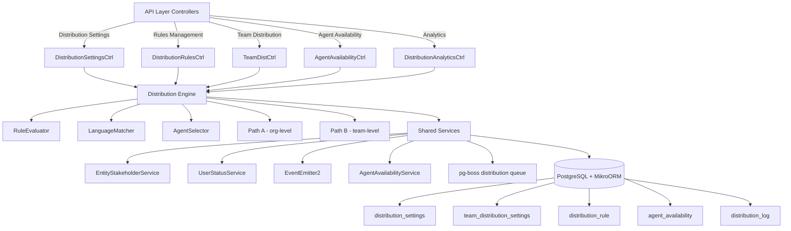

## Overview

The Distribution Module automates lead assignment within organizations. When a new lead is created, the system evaluates org-defined rules to automatically assign the lead to the most appropriate agent — based on lead attributes, agent availability, language compatibility, and capacity.

<Note>
This module is fully implemented and actively deployed in the `src/modules/crm/distribution/` path.
</Note>

### Design Principles

| Principle | Decision |
|-----------|----------|
| **Async distribution** | `createLead()` emits `LEAD_CREATED`; a pg-boss worker handles distribution — lead creation is never blocked |
| **Stakeholder system reuse** | Distribution creates `EntityStakeholder` records via `EntityStakeholderService`, not a new paradigm |
| **First-match-wins rules** | Rules are evaluated top-to-bottom by priority; the first matching rule wins |
| **Idempotency** | Distribution engine checks for existing stakeholders or pending offers before running |
| **No retroactive distribution** | Existing leads are unaffected when rules are created; only new leads trigger distribution |
| **pg-boss scheduling** | Distribution queue uses pg-boss for reliability and retry guarantees |
| **RLS compliance** | All entities carry `organization_id` for row-level security |

### Distribution Paths

The engine supports two execution paths:

<Tabs>
  <Tab title="Path A - Org-level Distribution">
    **Path A** (`runDistribution`): Triggered when a lead enters the org with no team context. Evaluates org-scoped rules, applies the org default method, and can bridge to Path B if a rule or default method routes to a team that has `distributionEnabled = true`.
  </Tab>
  <Tab title="Path B - Team-level Distribution">
    **Path B** (`runTeamDistribution`): Triggered directly when:
    - A lead is created with a `teamId` in the event payload (team pool assignment)
    - Path A determines the lead belongs to an auto-distributing team
    - Idempotency check finds a single team-only stakeholder with auto-distribute enabled

    Path B evaluates team-scoped rules, uses team settings (with org fallback for capacity), and logs the team FK on the resulting `DistributionLog` record.
  </Tab>
</Tabs>

## Architecture

### High-Level Diagram



### Component Responsibilities

<AccordionGroup>
  <Accordion title="Distribution Engine">
    Orchestrator that receives a lead, evaluates rules, selects agent, and creates assignment. Supports both Path A (org) and Path B (team) execution flows.
  </Accordion>
  
  <Accordion title="RuleEvaluator">
    Evaluates rule conditions against lead data using AND-within-OR logic. Returns the first matching rule based on priority order.
  </Accordion>
  
  <Accordion title="LanguageMatcher">
    Filters and ranks agents by language compatibility with the lead's person, supporting both STRICT and PREFERRED matching modes.
  </Accordion>
  
  <Accordion title="AgentSelector">
    Applies the distribution method (round-robin, weighted, weighted-round-robin, direct) to the filtered agent pool.
  </Accordion>
  
  <Accordion title="AgentAvailabilityService">
    Checks agent capacity, business hours, and leave status. Implements two-phase capacity enforcement with advisory locks.
  </Accordion>
  
  <Accordion title="UserStatusService">
    Pre-filters candidate agents to only those with ONLINE status before distribution consideration.
  </Accordion>
</AccordionGroup>

## Entity Specifications

### DistributionSettings

<Info>
One record per organization. Auto-created with defaults on first access via `getOrgSettingsRaw()`.
</Info>

| Column | Type | Notes |
|--------|------|-------|
| `id` | uuid PK | Primary key |
| `organization_id` | uuid FK UNIQUE | Row-level security identifier |
| `distribution_enabled` | bool | Master on/off switch (default: `false`) |
| `max_active_leads_per_agent` | int | Default: 50 |
| `max_new_leads_per_day` | int | Default: 15 |
| `capacity_enforcement_enabled` | bool | Default: `false` |
| `respect_business_hours` | bool | Default: `true` |
| `outside_hours_action` | enum | `QUEUE`, `POOL`, `DUTY_AGENT` |
| `duty_agent_id` | uuid FK nullable | Used when outside_hours_action = DUTY_AGENT |
| `default_method` | enum | `ROUND_ROBIN`, `POOL`, `SPECIFIC_TEAM` |
| `default_team_id` | uuid FK nullable | Used when default_method = SPECIFIC_TEAM |
| `default_language_matching_mode` | enum | `STRICT`, `PREFERRED` |
| `default_balancing_factors` | jsonb nullable | Optional balancing configuration |
| `pool_alert_enabled` | bool | Whether to send pool-overload alerts |
| `pool_alert_threshold` | int | Lead count that triggers an alert |
| `pool_alert_window_minutes` | int | Rolling window for counting unassigned leads |
| `updated_by` | uuid FK nullable | Last modifier |
| `created_at`, `updated_at` | timestamp | Audit timestamps |

<Warning>
When `distribution_enabled = false` (default for new orgs), the engine is completely off. No pg-boss jobs are enqueued and leads go directly to the pool.
</Warning>

### TeamDistributionSettings

<Info>
One record per `(organization, team)` pair with unique index `uq_team_distribution_settings_org_team`.
</Info>

| Column | Type | Notes |
|--------|------|-------|
| `id` | uuid PK | Primary key |
| `organization_id` | uuid FK | Row-level security identifier |
| `team_id` | uuid FK | Required team reference |
| `distribution_enabled` | bool | Default: `false` (enables Path B auto-distribution) |
| `distribution_method` | enum | Default: `ROUND_ROBIN` |
| `agent_weights` | jsonb nullable | `{ [userId]: weight }` for WEIGHTED method |
| `language_matching_enabled` | bool | Default: `false` |
| `language_matching_mode` | enum nullable | Language matching mode override |
| `capacity_enforcement_enabled` | bool | Default: `false` (independent from org toggle) |
| `max_active_leads_per_agent` | int nullable | `null` = inherit from org settings |
| `max_new_leads_per_day` | int nullable | `null` = inherit from org settings |
| `respect_business_hours` | bool | Default: `false` |
| `last_assigned_index` | int | Default: 0 (round-robin cursor, atomically incremented) |
| `default_balancing_factors` | jsonb nullable | Optional balancing configuration |
| `updated_by` | uuid FK nullable | Last modifier |
| `created_at`, `updated_at` | timestamp | Audit timestamps |

### DistributionRule

<Note>
Rules are evaluated in ascending `priority` order (lower number = higher priority). First match wins.
</Note>

| Column | Type | Notes |
|--------|------|-------|
| `id` | uuid PK | Primary key |
| `organization_id` | uuid FK | Row-level security identifier |
| `name` | varchar | Human-readable rule name |
| `priority` | int | Lower = higher priority |
| `is_active` | bool | Default: `true` |
| `scope` | enum | `ORGANIZATION`, `TEAM` |
| `team_id` | uuid FK nullable | For team-scoped rules |
| `condition_groups` | jsonb | `[{conditions:[{field,operator,value}]}]` (AND-within-OR) |
| `method` | enum | `ROUND_ROBIN`, `WEIGHTED`, `WEIGHTED_ROUND_ROBIN`, `DIRECT` |
| `recipients` | jsonb | `{agentIds?, teamId?, poolId?, weights?}` |
| `language_matching_enabled` | bool | Default: `true` |
| `language_matching_mode` | enum | `STRICT`, `PREFERRED` |
| `balancing_factors` | jsonb nullable | Optional balancing configuration |
| `last_assigned_index` | int | Round-robin cursor (updated atomically) |
| `created_by` | uuid FK | Rule creator |
| `created_at`, `updated_at` | timestamp | Audit timestamps |
| `is_deleted` | bool | Soft delete flag |

#### Supported Rule Conditions

<Tabs>
  <Tab title="Lead Properties">
    | Field | Operator(s) | Example Value |
    |-------|-------------|---------------|
    | `leadSource` | `eq`, `in` | `'WEBSITE'`, `['WEBSITE', 'REFERRAL']` |
    | `temperature` | `eq`, `in` | `'HOT'` |
    | `language` | `eq` | `'ar'` (matched against `person.preferredLanguage`) |
    | `budget` | `gte`, `lte`, `between` | `500000` |
    | `tags` | `contains` | `['vip']` |
    | `sourceChannel` | `eq`, `in` | `'WHATSAPP'` |
    | `intent` | `eq` | `'BUY'` |
    | `area` | `eq`, `in`, `contains` | `'Dubai Marina'`, `['JBR', 'Downtown Dubai']` |
  </Tab>
  <Tab title="Matching Rules">
    <Check>All string-based condition fields use **case-insensitive matching**</Check>
    <Check>The `area` field requires data from `LeadPropertyInterest.preferredAreas[]`</Check>
    <Check>The engine pre-loads the lead's property interests before calling the evaluator</Check>
  </Tab>
</Tabs>

## Distribution Engine

### Core Engine Logic

<Steps>
  <Step title="Event Detection">
    `DistributionListener` listens for `LEAD_CREATED` events and enqueues pg-boss jobs when distribution is enabled.
  </Step>
  
  <Step title="Job Processing">
    `DistributionJobHandler` processes jobs and determines the appropriate distribution path.
  </Step>
  
  <Step title="Path Selection">
    - **Path A**: Org-level distribution when no team context exists
    - **Path B**: Team-level distribution for team-assigned leads or when bridged from Path A
  </Step>
  
  <Step title="Rule Evaluation">
    `RuleEvaluator` processes rules in priority order using AND-within-OR condition logic.
  </Step>
  
  <Step title="Agent Selection">
    `AgentSelector` applies the chosen distribution method to filtered candidates.
  </Step>
  
  <Step title="Assignment Creation">
    Creates `EntityStakeholder` records via `EntityStakeholderService`.
  </Step>
</Steps>

### Distribution Methods

<CodeGroup>

```typescript Round Robin
// Cycles through agents in order
// Uses last_assigned_index cursor
const nextAgent = candidateAgents[
  (lastIndex + 1) % candidateAgents.length
];
```

```typescript Weighted
// Random selection based on weights
// Higher weight = higher probability
const weightedPool = agents.flatMap(agent => 
  Array(weight).fill(agent)
);
const selected = weightedPool[Math.floor(Math.random() * weightedPool.length)];
```

```typescript Weighted Round Robin
// Combines round-robin with weights
// Each agent appears weight times in rotation
const weightedSequence = agents.flatMap(agent =>
  Array(agent.weight).fill(agent)
);
```

```typescript Direct
// Assigns to specific agent(s)
// No rotation or weighting logic
const assignedAgents = rule.recipients.agentIds;
```

</CodeGroup>

### Language Matching

<Tabs>
  <Tab title="STRICT Mode">
    ```typescript
    // Exact language match required
    const candidates = agents.filter(agent => 
      agent.languages.includes(lead.person.preferredLanguage)
    );
    
    if (candidates.length === 0) {
      // Fallback to pool or escalation
      return handleNoLanguageMatch();
    }
    ```
  </Tab>
  
  <Tab title="PREFERRED Mode">
    ```typescript
    // Prefer language match, allow fallback
    const preferredCandidates = agents.filter(agent =>
      agent.languages.includes(lead.person.preferredLanguage)
    );
    
    const finalCandidates = preferredCandidates.length > 0 
      ? preferredCandidates 
      : agents; // All agents if no language match
    ```
  </Tab>
</Tabs>

## pg-boss Job Configuration

The distribution module uses pg-boss for reliable, asynchronous lead processing.

### Job Configuration

```typescript
{
  name: 'distribution',
  concurrency: parseInt(process.env.DISTRIBUTION_CONCURRENCY || '5'),
  expireInSeconds: 60 * 15, // 15 minutes
  retryLimit: 3,
  retryDelay: 30, // 30 seconds
  retryBackoff: true
}
```

<Warning>
Failed jobs are logged to `DistributionLog` with `outcome = ERROR` and detailed error information in the `details` field.
</Warning>

### Job Payload

```typescript
interface DistributionJobPayload {
  leadId: string;
  organizationId: string;
  teamId?: string; // For Path B (team-level distribution)
  eventMetadata?: Record<string, any>;
}
```

## API Endpoints

### Distribution Settings

<CodeGroup>

```typescript GET /api/crm/distribution/settings
// Get organization distribution settings
Response: {
  distributionEnabled: boolean;
  maxActiveLeadsPerAgent: number;
  maxNewLeadsPerDay: number;
  capacityEnforcementEnabled: boolean;
  respectBusinessHours: boolean;
  outsideHoursAction: 'QUEUE' | 'POOL' | 'DUTY_AGENT';
  dutyAgentId?: string;
  defaultMethod: 'ROUND_ROBIN' | 'POOL' | 'SPECIFIC_TEAM';
  defaultTeamId?: string;
  defaultLanguageMatchingMode: 'STRICT' | 'PREFERRED';
  // ... additional settings
}
```

```typescript PATCH /api/crm/distribution/settings
// Update organization distribution settings
Request: Partial<DistributionSettingsDto>

Response: {
  success: boolean;
  settings: DistributionSettingsDto;
}
```

```typescript GET /api/crm/distribution/teams/:teamId/settings
// Get team-specific distribution settings
Response: TeamDistributionSettingsDto
```

```typescript PATCH /api/crm/distribution/teams/:teamId/settings
// Update team distribution settings  
Request: Partial<TeamDistributionSettingsDto>
Response: TeamDistributionSettingsDto
```

</CodeGroup>

### Distribution Rules

<CodeGroup>

```typescript GET /api/crm/distribution/rules
// List organization distribution rules
Query: {
  scope?: 'ORGANIZATION' | 'TEAM';
  teamId?: string;
  isActive?: boolean;
}

Response: {
  rules: DistributionRuleDto[];
  total: number;
}
```

```typescript POST /api/crm/distribution/rules
// Create new distribution rule
Request: {
  name: string;
  priority: number;
  scope: 'ORGANIZATION' | 'TEAM';
  teamId?: string;
  conditionGroups: ConditionGroup[];
  method: DistributionMethod;
  recipients: RuleRecipients;
  languageMatchingEnabled?: boolean;
  languageMatchingMode?: 'STRICT' | 'PREFERRED';
}

Response: DistributionRuleDto
```

```typescript GET /api/crm/distribution/rules/:ruleId
// Get specific rule details
Response: DistributionRuleDto
```

```typescript PATCH /api/crm/distribution/rules/:ruleId
// Update existing rule
Request: Partial<CreateDistributionRuleDto>
Response: DistributionRuleDto
```

```typescript DELETE /api/crm/distribution/rules/:ruleId
// Soft delete rule (sets is_deleted = true)
Response: { success: boolean }
```

</CodeGroup>

### Agent Availability

<CodeGroup>

```typescript GET /api/crm/distribution/agents/availability
// Get agent availability status
Response: {
  agents: Array<{
    userId: string;
    isAvailable: boolean;
    currentCapacity: {
      activeLeads: number;
      dailyLeads: number;
    };
    businessHoursStatus: 'WITHIN' | 'OUTSIDE' | 'UNKNOWN';
    userStatus: 'ONLINE' | 'OFFLINE' | 'AWAY' | 'BUSY';
  }>;
}
```

```typescript POST /api/crm/distribution/agents/:agentId/availability
// Update agent availability
Request: {
  isAvailable: boolean;
  unavailableUntil?: Date;
  reason?: string;
}

Response: { success: boolean }
```

</CodeGroup>

### Distribution Analytics

<CodeGroup>

```typescript GET /api/crm/distribution/analytics/summary
// Get distribution summary metrics
Query: {
  startDate: string;
  endDate: string;
  teamId?: string;
}

Response: {
  totalDistributions: number;
  successfulDistributions: number;
  failedDistributions: number;
  averageDistributionTime: number;
  topPerformingAgents: Array<{
    agentId: string;
    assignedLeads: number;
    conversionRate: number;
  }>;
}
```

```typescript GET /api/crm/distribution/analytics/logs
// Get detailed distribution logs
Query: {
  leadId?: string;
  agentId?: string;
  outcome?: 'SUCCESS' | 'NO_AGENTS' | 'ERROR';
  startDate?: string;
  endDate?: string;
  limit?: number;
  offset?: number;
}

Response: {
  logs: DistributionLogDto[];
  total: number;
}
```

</CodeGroup>

## Security & Permissions

### Row-Level Security (RLS)

All distribution entities implement organization-based RLS:

```sql
-- Distribution Settings RLS
CREATE POLICY "distribution_settings_org_isolation" ON distribution_settings
  FOR ALL USING (organization_id = current_setting('app.current_org_id')::uuid);

-- Distribution Rules RLS  
CREATE POLICY "distribution_rules_org_isolation" ON distribution_rule
  FOR ALL USING (organization_id = current_setting('app.current_org_id')::uuid);

-- Team Distribution Settings RLS
CREATE POLICY "team_distribution_settings_org_isolation" ON team_distribution_settings
  FOR ALL USING (organization_id = current_setting('app.current_org_id')::uuid);
```

### Permission Requirements

| Endpoint | Required Permission |
|----------|-------------------|
| Read distribution settings | `CRM_READ` |
| Update distribution settings | `CRM_ADMIN` |
| Manage distribution rules | `CRM_ADMIN` |
| View distribution analytics | `CRM_READ` |
| Update agent availability | `CRM_WRITE` (own) or `CRM_ADMIN` (others) |

<Tip>
The distribution engine runs with elevated privileges during pg-boss job processing to ensure proper stakeholder creation regardless of the creating user's permissions.
</Tip>

## Observability & Audit

### Distribution Logging

Every distribution attempt is logged to the `distribution_log` table:

```typescript
interface DistributionLog {
  id: string;
  organizationId: string;
  leadId: string;
  teamId?: string; // Set for Path B distributions
  ruleId?: string; // Which rule matched (if any)
  assignedAgentId?: string;
  outcome: 'SUCCESS' | 'NO_AGENTS' | 'CAPACITY_EXCEEDED' | 'OUTSIDE_HOURS' | 'ERROR';
  details: {
    evaluatedRules?: string[];
    selectedMethod?: string;
    candidateAgents?: string[];
    processingTimeMs?: number;
    errorMessage?: string;
    fallbackReason?: string;
  };
  createdAt: Date;
}
```

### Metrics & Monitoring

<Check>**Distribution Success Rate**: Percentage of successful assignments vs. total attempts</Check>
<Check>**Average Processing Time**: Time from job pickup to completion</Check>
<Check>**Agent Load Distribution**: Even distribution across available agents</Check>
<Check>**Queue Depth**: Number of pending distribution jobs</Check>
<Check>**Capacity Utilization**: Agent capacity usage across the organization</Check>

## Analytics & Metrics

### Key Performance Indicators

<CardGroup cols={2}>
  <Card title="Distribution Efficiency" icon="chart-line">
    - Assignment success rate
    - Time to assignment
    - Rule match effectiveness
  </Card>
  
  <Card title="Agent Performance" icon="users">
    - Leads per agent distribution
    - Conversion rates by agent
    - Capacity utilization
  </Card>
  
  <Card title="System Health" icon="heart-pulse">
    - Queue processing times
    - Error rates by category
    - Business hours coverage
  </Card>
  
  <Card title="Business Impact" icon="chart-bar">
    - Lead response times
    - Pool overflow incidents
    - Language matching success
  </Card>
</CardGroup>

### Reporting Queries

<CodeGroup>

```sql Agent Workload Distribution
SELECT 
  u.id as agent_id,
  u.full_name,
  COUNT(CASE WHEN dl.outcome = 'SUCCESS' THEN 1 END) as assigned_leads,
  AVG(EXTRACT(EPOCH FROM (dl.created_at - l.created_at))) as avg_response_time
FROM distribution_log dl
JOIN leads l ON dl.lead_id = l.id
JOIN users u ON dl.assigned_agent_id = u.id
WHERE dl.created_at >= NOW() - INTERVAL '30 days'
  AND dl.organization_id = $1
GROUP BY u.id, u.full_name
ORDER BY assigned_leads DESC;
```

```sql Rule Effectiveness Analysis
SELECT 
  dr.name as rule_name,
  COUNT(*) as total_matches,
  COUNT(CASE WHEN dl.outcome = 'SUCCESS' THEN 1 END) as successful_assignments,
  ROUND(
    COUNT(CASE WHEN dl.outcome = 'SUCCESS' THEN 1 END)::numeric / COUNT(*)::numeric * 100, 
    2
  ) as success_rate
FROM distribution_log dl
JOIN distribution_rule dr ON dl.rule_id = dr.id
WHERE dl.created_at >= NOW() - INTERVAL '30 days'
  AND dl.organization_id = $1
GROUP BY dr.id, dr.name
ORDER BY total_matches DESC;
```

</CodeGroup>

## Edge Case Handling

### No Available Agents

<Steps>
  <Step title="Check Active Agents">
    Filter agents by online status and availability settings
  </Step>
  
  <Step title="Apply Capacity Limits">
    Remove agents who have reached their capacity limits (if enforcement is enabled)
  </Step>
  
  <Step title="Language Filtering">
    Apply language matching requirements based on rule/settings
  </Step>
  
  <Step title="Fallback Strategy">
    If no agents remain:
    - Log outcome as `NO_AGENTS`
    - Lead remains in pool
    - Trigger pool alert if configured
  </Step>
</Steps>

### Business Hours Handling

<Tabs>
  <Tab title="Outside Business Hours">
    When `respectBusinessHours = true` and current time is outside business hours:
    
    - **QUEUE**: Lead waits for next business hours period
    - **POOL**: Lead goes to unassigned pool immediately  
    - **DUTY_AGENT**: Assign to designated duty agent (if available)
  </Tab>
  
  <Tab title="Business Hours Configuration">
    Business hours are configured at the organization level:
    
    ```typescript
    interface BusinessHoursConfig {
      enabled: boolean;
      timezone: string;
      schedule: {
        [day: string]: {
          enabled: boolean;
          start: string; // "09:00"
          end: string;   // "18:00"
        }
      }
    }
    ```
  </Tab>
</Tabs>

### Capacity Overflow

When an agent reaches their capacity limits:

<Warning>
The system uses advisory locks during capacity checks to prevent race conditions in high-concurrency scenarios.
</Warning>

1. **Two-phase enforcement**: 
   - Phase 1: Check current capacity
   - Phase 2: Acquire lock and re-check before final assignment
2. **Graceful degradation**: Remove over-capacity agents from candidate pool
3. **Fallback options**: Continue with remaining agents or fall back to pool

## Performance & Scaling

### Optimization Strategies

<Tabs>
  <Tab title="Database Optimization">
    - Indexed columns: `organization_id`, `team_id`, `priority`, `is_active`
    - Partial indexes on active rules only
    - Connection pooling for pg-boss workers
    - Read replicas for analytics queries
  </Tab>
  
  <Tab title="Concurrency Control">
    - Advisory locks for capacity checks
    - Atomic updates for round-robin cursors
    - Configurable pg-boss concurrency levels
    - Idempotent job processing
  </Tab>
  
  <Tab title="Caching Strategy">
    - Redis caching for active rules
    - Agent availability status caching
    - Business hours calculation caching
    - Distribution settings caching
  </Tab>
</Tabs>

### Scaling Considerations

<Info>
The distribution module is designed to handle high-volume lead processing with these scaling patterns:
</Info>

- **Horizontal scaling**: Multiple pg-boss workers across application instances
- **Database partitioning**: `distribution_log` table can be partitioned by date
- **Queue sharding**: Different organizations can use separate job queues
- **Read scaling**: Analytics and reporting can use read replicas

## Module Structure

```
src/modules/crm/distribution/
├── controllers/
│   ├── distribution-settings.controller.ts
│   ├── distribution-rules.controller.ts
│   ├── team-distribution.controller.ts
│   ├── agent-availability.controller.ts
│   └── distribution-analytics.controller.ts
├── services/
│   ├── distribution-engine.service.ts
│   ├── distribution-settings.service.ts
│   ├── distribution-rules.service.ts
│   ├── agent-availability.service.ts
│   ├── rule-evaluator.service.ts
│   ├── language-matcher.service.ts
│   └── agent-selector.service.ts
├── entities/
│   ├── distribution-settings.entity.ts
│   ├── team-distribution-settings.entity.ts
│   ├── distribution-rule.entity.ts
│   ├── agent-availability.entity.ts
│   └── distribution-log.entity.ts
├── listeners/
│   └── distribution.listener.ts
├── jobs/
│   └── distribution.job-handler.ts
├── dto/
│   ├── distribution-settings.dto.ts
│   ├── distribution-rule.dto.ts
│   └── agent-availability.dto.ts
├── types/
│   ├── distribution.types.ts
│   └── rule-condition.types.ts
└── distribution.module.ts
```

## Integration Points

### External Service Dependencies

<AccordionGroup>
  <Accordion title="EntityStakeholderService">
    Used for creating lead assignments. The distribution engine creates `EntityStakeholder` records with `role = ASSIGNEE` when assigning leads to agents.
  </Accordion>
  
  <Accordion title="UserStatusService">
    Provides real-time user online/offline status for filtering available agents during distribution.
  </Accordion>
  
  <Accordion title="pg-boss">
    Handles the asynchronous job queue for lead distribution processing with retry logic and concurrency control.
  </Accordion>
  
  <Accordion title="EventEmitter2">
    Publishes distribution events for audit logging and external system integration.
  </Accordion>
</AccordionGroup>

### Event Emissions

The distribution module emits these events for external consumption:

```typescript
// Successful distribution
eventEmitter.emit('distribution.lead.assigned', {
  leadId: string;
  agentId: string;
  organizationId: string;
  ruleId?: string;
  method: string;
});

// Distribution failure
eventEmitter.emit('distribution.lead.failed', {
  leadId: string;
  organizationId: string;
  reason: string;
  details: Record<string, any>;
});

// Pool alert triggered
eventEmitter.emit('distribution.pool.alert', {
  organizationId: string;
  unassignedCount: number;
  threshold: number;
});
```

## Environment Configuration

### Required Environment Variables

```bash
# pg-boss configuration
DISTRIBUTION_CONCURRENCY=5          # Number of concurrent workers
DISTRIBUTION_RETRY_LIMIT=3          # Max retry attempts
DISTRIBUTION_RETRY_DELAY=30         # Retry delay in seconds

# Performance tuning
DISTRIBUTION_BATCH_SIZE=100         # Batch size for bulk operations
DISTRIBUTION_CACHE_TTL=300          # Cache TTL in seconds

# Feature flags
DISTRIBUTION_ANALYTICS_ENABLED=true # Enable analytics collection
DISTRIBUTION_METRICS_ENABLED=true   # Enable metrics collection
```

### Optional Configuration

```bash
# Business hours default timezone
DEFAULT_BUSINESS_HOURS_TIMEZONE=Asia/Dubai

# Default capacity limits for new organizations
DEFAULT_MAX_ACTIVE_LEADS=50
DEFAULT_MAX_DAILY_LEADS=15

# Pool alert defaults
DEFAULT_POOL_ALERT_THRESHOLD=25
DEFAULT_POOL_ALERT_WINDOW=60
```

<Note>
All configuration values have sensible defaults and the system will function without explicit environment variable configuration.
</Note>