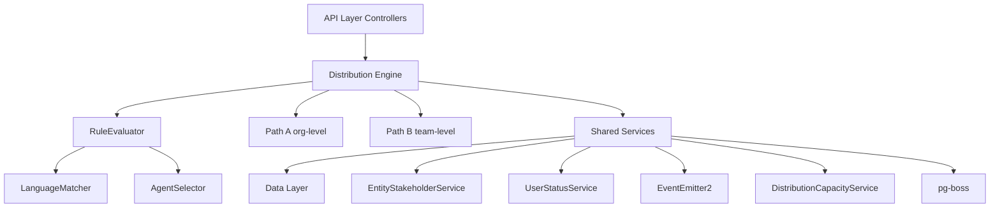

## Overview

The Distribution Module automates lead assignment within organizations. When a new lead is created, the system evaluates org-defined rules to automatically assign the lead to the most appropriate agent — based on lead attributes, UserStatus online/away state, working-hours eligibility, language compatibility, and capacity.

<Note>
**Status:** Active — fully implemented  
**Module Path:** `src/modules/crm/distribution/`
</Note>

### Design Principles

<CardGroup cols={2}>
  <Card title="Async Distribution" icon="clock">
    `createLead()` emits `LEAD_CREATED` after commit; a pg-boss worker handles distribution
  </Card>
  <Card title="Stakeholder System Reuse" icon="users">
    Distribution creates `EntityStakeholder` records via `EntityStakeholderService`
  </Card>
  <Card title="First-Match-Wins Rules" icon="list-ol">
    Rules are evaluated top-to-bottom by priority; the first matching rule wins
  </Card>
  <Card title="Idempotency" icon="shield-check">
    Distribution engine checks for existing stakeholders or pending offers before running
  </Card>
</CardGroup>

<Info>
**No Retroactive Distribution:** Existing leads are unaffected when rules are created; only new leads trigger distribution.
</Info>

<Accordion title="Additional Design Principles">
- **Default routing control:** Organizations can disable default routing via `defaultRoutingEnabled` setting; when disabled, only explicit rule matches trigger distribution
- **pg-boss scheduling:** Distribution queue uses pg-boss for reliability and retry guarantees
- **RLS compliance:** All entities carry `organization_id` for row-level security
</Accordion>

### Distribution Paths

The engine supports two execution paths:

<Tabs>
  <Tab title="Path A — Org-level">
    **Org-level distribution** (`runDistribution`): triggered when a lead enters the org with no team context. Evaluates org-scoped rules, applies the org default method, and can bridge to Path B if a rule or default method routes to a team that has `distributionEnabled = true`.
  </Tab>
  <Tab title="Path B — Team-level">
    **Team-level distribution** (`runTeamDistribution`): triggered directly when:
    - A lead is created with a `teamId` in the event payload (team pool assignment)
    - A bulk-imported lead has a team-only assignment; `LeadImportService` batch-enqueues the job with `teamId`
    - Path A determines the lead belongs to an auto-distributing team
    - Idempotency check finds a single team-only stakeholder with auto-distribute enabled

    Path B consults active distribution rules via the rule service when `defaultRoutingEnabled` is disabled, ensuring team-level distribution respects rule-based routing controls.

    Path B evaluates team-scoped rules, uses team settings (with org fallback for capacity), and logs the team FK on the resulting `DistributionLog` record.
  </Tab>
</Tabs>

---

## Architecture

### High-Level Diagram



### Component Responsibilities

<AccordionGroup>
  <Accordion title="DistributionEngine">
    Orchestrator: receives a lead, evaluates rules, selects agent, creates assignment. Supports Path A (org) and Path B (team).
  </Accordion>

  <Accordion title="RuleEvaluator">
    Evaluates rule conditions against lead data; returns first matching rule
  </Accordion>

  <Accordion title="LanguageMatcher">
    Filters and ranks agents by language compatibility with the lead's person
  </Accordion>

  <Accordion title="AgentSelector">
    Applies the distribution method (round-robin, weighted, weighted-round-robin, direct) to the filtered agent pool
  </Accordion>

  <Accordion title="DistributionCapacityService">
    Two-phase capacity enforcement:
    - **Phase 1:** `filterByCapacity()` (lead counts vs limits)
    - **Phase 2:** `confirmCapacityAndAssign()` (advisory locks + atomic stakeholder creation)
    
    No entity of its own — queries `entity_stakeholder`.
  </Accordion>

  <Accordion title="UserStatusService">
    Pre-filters candidate agents to ONLINE status; filters by per-user working hours (`filterByWorkingHours`); provides `isWithinWorkingHours()` for org-level business hours check.
  </Accordion>

  <Accordion title="DistributionListener">
    Listens for `LEAD_CREATED` events and enqueues pg-boss jobs. The handler is fault-isolated (try/catch): settings lookup and enqueue errors are logged and do not fail `POST /v1/leads`.
  </Accordion>

  <Accordion title="DistributionJobHandler">
    pg-boss worker that processes distribution jobs
  </Accordion>
</AccordionGroup>

---

## Entity Specifications

### DistributionSettings (1 per org)

<Info>
Org-level configuration for the distribution engine. Auto-created with defaults on first access via `getOrgSettingsRaw()`. Unique constraint on `organization_id`.
</Info>

| Column | Type | Notes |
|--------|------|-------|
| `id` | uuid PK | Primary key |
| `organization_id` | uuid FK UNIQUE | RLS enforced |
| `default_method` | enum | `ROUND_ROBIN`, `WEIGHTED`, `WEIGHTED_ROUND_ROBIN`, `DIRECT` (default: `ROUND_ROBIN`) |
| `default_routing_enabled` | boolean | When `false`, only explicit rule matches trigger distribution (default: `true`) |
| `respect_working_hours` | boolean | Gate distribution by org business hours (default: `true`) |
| `respect_user_working_hours` | boolean | Filter agents by their individual working hours (default: `true`) |
| `max_leads_per_agent` | integer | Global capacity limit (nullable; 0 = unlimited) |
| `capacity_window_hours` | integer | Rolling window for capacity calculation (default: 24) |
| `business_hours_start` | time | Org business hours start (default: `09:00:00`) |
| `business_hours_end` | time | Org business hours end (default: `17:00:00`) |
| `business_days` | integer[] | Array of weekday integers 0-6 (0=Sunday; default: `[1,2,3,4,5]`) |
| `timezone` | varchar | IANA timezone (default: `UTC`) |
| `language_matching_enabled` | boolean | Enable language-based agent filtering (default: `true`) |
| `require_exact_language_match` | boolean | Require exact language match (default: `false`) |
| `auto_fallback_to_manager` | boolean | Assign to team manager if no agents available (default: `false`) |
| `enable_lead_notifications` | boolean | Send notifications on assignment (default: `true`) |
| `created_at` | timestamptz | Auto-set |
| `updated_at` | timestamptz | Auto-updated |

<CodeGroup>
```typescript Entity Definition
@Entity({ tableName: 'distribution_settings' })
@Index({ properties: ['organization_id'], unique: true })
export class DistributionSettings {
  @PrimaryKey({ type: 'uuid', defaultRaw: 'gen_random_uuid()' })
  id!: string;

  @Property({ type: 'uuid', columnType: 'uuid' })
  @Index()
  organization_id!: string;

  @Enum(() => DistributionMethod)
  default_method: DistributionMethod = DistributionMethod.ROUND_ROBIN;

  @Property({ type: 'boolean' })
  default_routing_enabled: boolean = true;

  // ... additional fields
}
```

```sql Schema
CREATE TABLE distribution_settings (
  id UUID PRIMARY KEY DEFAULT gen_random_uuid(),
  organization_id UUID NOT NULL REFERENCES organizations(id) ON DELETE CASCADE,
  default_method VARCHAR(50) NOT NULL DEFAULT 'ROUND_ROBIN',
  default_routing_enabled BOOLEAN NOT NULL DEFAULT true,
  respect_working_hours BOOLEAN NOT NULL DEFAULT true,
  respect_user_working_hours BOOLEAN NOT NULL DEFAULT true,
  max_leads_per_agent INTEGER,
  capacity_window_hours INTEGER NOT NULL DEFAULT 24,
  business_hours_start TIME NOT NULL DEFAULT '09:00:00',
  business_hours_end TIME NOT NULL DEFAULT '17:00:00',
  business_days INTEGER[] NOT NULL DEFAULT '{1,2,3,4,5}',
  timezone VARCHAR(50) NOT NULL DEFAULT 'UTC',
  language_matching_enabled BOOLEAN NOT NULL DEFAULT true,
  require_exact_language_match BOOLEAN NOT NULL DEFAULT false,
  auto_fallback_to_manager BOOLEAN NOT NULL DEFAULT false,
  enable_lead_notifications BOOLEAN NOT NULL DEFAULT true,
  created_at TIMESTAMPTZ NOT NULL DEFAULT NOW(),
  updated_at TIMESTAMPTZ NOT NULL DEFAULT NOW(),
  CONSTRAINT uq_distribution_settings_org UNIQUE (organization_id)
);
```
</CodeGroup>

### TeamDistributionSettings (1 per team)

<Note>
Team-level overrides for distribution configuration. Only populated when a team enables distribution or overrides org defaults.
</Note>

| Column | Type | Notes |
|--------|------|-------|
| `id` | uuid PK | Primary key |
| `organization_id` | uuid FK | RLS enforced |
| `team_id` | uuid FK UNIQUE | References `teams(id)` |
| `distribution_enabled` | boolean | Enable auto-distribution for this team (default: `false`) |
| `method` | enum | Team-specific method override (nullable) |
| `max_leads_per_agent` | integer | Team capacity limit (nullable; falls back to org setting) |
| `capacity_window_hours` | integer | Team capacity window (nullable) |
| `respect_working_hours` | boolean | Team-level working hours gate (nullable) |
| `auto_fallback_to_manager` | boolean | Team-specific fallback (nullable) |
| `created_at` | timestamptz | Auto-set |
| `updated_at` | timestamptz | Auto-updated |

<CodeGroup>
```typescript Entity Definition
@Entity({ tableName: 'team_distribution_settings' })
@Index({ properties: ['team_id'], unique: true })
export class TeamDistributionSettings {
  @PrimaryKey({ type: 'uuid', defaultRaw: 'gen_random_uuid()' })
  id!: string;

  @Property({ type: 'uuid', columnType: 'uuid' })
  @Index()
  organization_id!: string;

  @Property({ type: 'uuid', columnType: 'uuid' })
  @Index()
  team_id!: string;

  @Property({ type: 'boolean' })
  distribution_enabled: boolean = false;

  @Enum(() => DistributionMethod, { nullable: true })
  method?: DistributionMethod;

  // ... additional fields
}
```

```sql Schema
CREATE TABLE team_distribution_settings (
  id UUID PRIMARY KEY DEFAULT gen_random_uuid(),
  organization_id UUID NOT NULL REFERENCES organizations(id) ON DELETE CASCADE,
  team_id UUID NOT NULL REFERENCES teams(id) ON DELETE CASCADE,
  distribution_enabled BOOLEAN NOT NULL DEFAULT false,
  method VARCHAR(50),
  max_leads_per_agent INTEGER,
  capacity_window_hours INTEGER,
  respect_working_hours BOOLEAN,
  auto_fallback_to_manager BOOLEAN,
  created_at TIMESTAMPTZ NOT NULL DEFAULT NOW(),
  updated_at TIMESTAMPTZ NOT NULL DEFAULT NOW(),
  CONSTRAINT uq_team_distribution_settings_team UNIQUE (team_id)
);
```
</CodeGroup>

### DistributionRule

<Info>
Defines conditional routing rules evaluated before applying the default distribution method. Rules are evaluated in priority order (lower number = higher priority).
</Info>

| Column | Type | Notes |
|--------|------|-------|
| `id` | uuid PK | Primary key |
| `organization_id` | uuid FK | RLS enforced |
| `team_id` | uuid FK | Team scope (nullable for org-level rules) |
| `name` | varchar | Rule display name |
| `description` | text | Optional description |
| `priority` | integer | Evaluation order (lower = higher priority) |
| `is_active` | boolean | Enable/disable rule (default: `true`) |
| `conditions` | jsonb | Rule conditions object |
| `action` | jsonb | Assignment action configuration |
| `created_by` | uuid FK | User who created the rule |
| `created_at` | timestamptz | Auto-set |
| `updated_at` | timestamptz | Auto-updated |

<Warning>
Rules with the same priority level have undefined evaluation order. Always assign unique priorities.
</Warning>

<CodeGroup>
```typescript Conditions Schema
interface RuleConditions {
  leadSource?: string[];
  leadStatus?: string[];
  industry?: string[];
  country?: string[];
  dealValue?: { min?: number; max?: number };
  customFields?: Record<string, any>;
  matchType: 'ALL' | 'ANY'; // AND vs OR logic
}
```

```typescript Action Schema
interface RuleAction {
  type: 'ASSIGN_TO_TEAM' | 'ASSIGN_TO_USER' | 'USE_TEAM_DISTRIBUTION' | 'USE_ORG_DISTRIBUTION';
  targetTeamId?: string;
  targetUserId?: string;
  method?: DistributionMethod; // Override for this rule
}
```

```sql Schema
CREATE TABLE distribution_rule (
  id UUID PRIMARY KEY DEFAULT gen_random_uuid(),
  organization_id UUID NOT NULL REFERENCES organizations(id) ON DELETE CASCADE,
  team_id UUID REFERENCES teams(id) ON DELETE CASCADE,
  name VARCHAR(255) NOT NULL,
  description TEXT,
  priority INTEGER NOT NULL DEFAULT 0,
  is_active BOOLEAN NOT NULL DEFAULT true,
  conditions JSONB NOT NULL,
  action JSONB NOT NULL,
  created_by UUID NOT NULL REFERENCES users(id),
  created_at TIMESTAMPTZ NOT NULL DEFAULT NOW(),
  updated_at TIMESTAMPTZ NOT NULL DEFAULT NOW()
);

CREATE INDEX idx_distribution_rule_org_priority 
  ON distribution_rule(organization_id, priority) 
  WHERE is_active = true;
```
</CodeGroup>

### DistributionLog

<Info>
Audit trail for all distribution attempts. Records both successful assignments and failures for analysis and debugging.
</Info>

| Column | Type | Notes |
|--------|------|-------|
| `id` | uuid PK | Primary key |
| `organization_id` | uuid FK | RLS enforced |
| `lead_id` | uuid FK | Lead being distributed |
| `team_id` | uuid FK | Team context (nullable) |
| `assigned_user_id` | uuid FK | User assigned (nullable if failed) |
| `rule_id` | uuid FK | Rule that triggered assignment (nullable) |
| `method` | enum | Distribution method used |
| `status` | enum | `SUCCESS`, `FAILED`, `SKIPPED` |
| `reason` | text | Failure reason or skip reason |
| `candidate_count` | integer | Number of eligible agents |
| `execution_time_ms` | integer | Distribution execution time |
| `metadata` | jsonb | Additional context (filters applied, capacity states, etc.) |
| `created_at` | timestamptz | Auto-set |

<CodeGroup>
```typescript Entity Definition
@Entity({ tableName: 'distribution_log' })
export class DistributionLog {
  @PrimaryKey({ type: 'uuid', defaultRaw: 'gen_random_uuid()' })
  id!: string;

  @Property({ type: 'uuid', columnType: 'uuid' })
  @Index()
  organization_id!: string;

  @Property({ type: 'uuid', columnType: 'uuid' })
  @Index()
  lead_id!: string;

  @Property({ type: 'uuid', columnType: 'uuid', nullable: true })
  team_id?: string;

  @Property({ type: 'uuid', columnType: 'uuid', nullable: true })
  assigned_user_id?: string;

  @Enum(() => DistributionLogStatus)
  status!: DistributionLogStatus;

  // ... additional fields
}
```

```sql Schema
CREATE TABLE distribution_log (
  id UUID PRIMARY KEY DEFAULT gen_random_uuid(),
  organization_id UUID NOT NULL REFERENCES organizations(id) ON DELETE CASCADE,
  lead_id UUID NOT NULL REFERENCES leads(id) ON DELETE CASCADE,
  team_id UUID REFERENCES teams(id) ON DELETE SET NULL,
  assigned_user_id UUID REFERENCES users(id) ON DELETE SET NULL,
  rule_id UUID REFERENCES distribution_rule(id) ON DELETE SET NULL,
  method VARCHAR(50) NOT NULL,
  status VARCHAR(20) NOT NULL,
  reason TEXT,
  candidate_count INTEGER,
  execution_time_ms INTEGER,
  metadata JSONB,
  created_at TIMESTAMPTZ NOT NULL DEFAULT NOW()
);

CREATE INDEX idx_distribution_log_lead ON distribution_log(lead_id);
CREATE INDEX idx_distribution_log_org_created ON distribution_log(organization_id, created_at DESC);
```
</CodeGroup>

---

## Type Definitions

### Distribution Methods

<Tabs>
  <Tab title="ROUND_ROBIN">
    Assigns leads sequentially to agents in rotation. Uses `last_lead_assigned_at` timestamp to determine next agent.
    
    **Use case:** Equal workload distribution across all agents
  </Tab>
  
  <Tab title="WEIGHTED">
    Random selection based on agent weights. Higher weight = higher probability.
    
    **Use case:** Senior agents handle more leads than juniors
  </Tab>
  
  <Tab title="WEIGHTED_ROUND_ROBIN">
    Combines round-robin fairness with weighting. Each agent receives `floor(weight/min_weight)` consecutive assignments.
    
    **Use case:** Balanced distribution respecting capacity differences
  </Tab>
  
  <Tab title="DIRECT">
    Manual assignment to specific user (via rule action or API override).
    
    **Use case:** VIP leads, specific expertise required
  </Tab>
</Tabs>

<CodeGroup>
```typescript Distribution Method Enum
export enum DistributionMethod {
  ROUND_ROBIN = 'ROUND_ROBIN',
  WEIGHTED = 'WEIGHTED',
  WEIGHTED_ROUND_ROBIN = 'WEIGHTED_ROUND_ROBIN',
  DIRECT = 'DIRECT',
}
```

```typescript Distribution Result
export interface DistributionResult {
  success: boolean;
  assignedUserId?: string;
  method: DistributionMethod;
  ruleId?: string;
  candidateCount: number;
  executionTimeMs: number;
  reason?: string;
  metadata?: Record<string, any>;
}
```
</CodeGroup>

### Log Status Types

```typescript
export enum DistributionLogStatus {
  SUCCESS = 'SUCCESS',
  FAILED = 'FAILED',
  SKIPPED = 'SKIPPED',
}
```

<AccordionGroup>
  <Accordion title="SUCCESS">
    Lead was successfully assigned to an agent. `assigned_user_id` will be populated.
  </Accordion>
  
  <Accordion title="FAILED">
    Distribution attempted but failed (no eligible agents, capacity exceeded, system error). `reason` field contains details.
  </Accordion>
  
  <Accordion title="SKIPPED">
    Distribution was skipped (lead already assigned, outside business hours, distribution disabled). `reason` field contains details.
  </Accordion>
</AccordionGroup>

---

## Distribution Engine

### Core Engine Logic

<Steps>
  <Step title="Idempotency Check">
    Check if lead already has stakeholders or pending distribution
    
    ```typescript
    const existingStakeholders = await em.find(EntityStakeholder, {
      entity_type: EntityType.LEAD,
      entity_id: leadId,
      organization_id: orgId,
    });
    
    if (existingStakeholders.length > 0) {
      return { success: false, reason: 'Lead already has stakeholders' };
    }
    ```
  </Step>

  <Step title="Rule Evaluation">
    Evaluate active rules in priority order
    
    ```typescript
    const matchedRule = await ruleEvaluator.evaluateRules({
      lead,
      person,
      organizationId: orgId,
      teamId,
    });
    
    if (matchedRule) {
      return await executeRuleAction(matchedRule, lead);
    }
    ```
  </Step>

  <Step title="Business Hours Gate">
    Check if distribution should proceed based on working hours
    
    ```typescript
    if (settings.respect_working_hours) {
      const isWithinHours = await userStatusService.isWithinWorkingHours(
        settings,
        new Date()
      );
      
      if (!isWithinHours) {
        return { success: false, reason: 'Outside business hours' };
      }
    }
    ```
  </Step>

  <Step title="Agent Pool Filtering">
    Build and filter candidate agent pool
    
    ```typescript
    // 1. Get team members or org users
    let candidates = await getEligibleAgents(orgId, teamId);
    
    // 2. Filter by online status
    candidates = await userStatusService.filterOnlineAgents(candidates);
    
    // 3. Filter by user working hours
    if (settings.respect_user_working_hours) {
      candidates = await userStatusService.filterByWorkingHours(candidates);
    }
    
    // 4. Filter by language compatibility
    if (settings.language_matching_enabled && person?.language_preferences) {
      candidates = await languageMatcher.filterByLanguage(
        candidates,
        person.language_preferences,
        settings.require_exact_language_match
      );
    }
    
    // 5. Filter by capacity (Phase 1)
    candidates = await capacityService.filterByCapacity(
      candidates,
      settings.max_leads_per_agent,
      settings.capacity_window_hours
    );
    ```
  </Step>

  <Step title="Agent Selection">
    Apply distribution method to select agent
    
    ```typescript
    const selectedAgent = await agentSelector.selectAgent({
      candidates,
      method: settings.default_method,
      organizationId: orgId,
    });
    
    if (!selectedAgent) {
      // Fallback to manager if configured
      if (settings.auto_fallback_to_manager && teamId) {
        selectedAgent = await getTeamManager(teamId);
      }
    }
    ```
  </Step>

  <Step title="Assignment with Capacity Lock">
    Create stakeholder with atomic capacity check (Phase 2)
    
    ```typescript
    const assignment = await capacityService.confirmCapacityAndAssign({
      userId: selectedAgent.id,
      leadId,
      organizationId: orgId,
      maxLeadsPerAgent: settings.max_leads_per_agent,
      capacityWindowHours: settings.capacity_window_hours,
    });
    
    if (!assignment.success) {
      // Retry with next candidate or fail
      return { success: false, reason: 'Capacity limit reached' };
    }
    ```
  </Step>

  <Step title="Audit Logging">
    Create distribution log entry
    
    ```typescript
    await em.persistAndFlush(
      em.create(DistributionLog, {
        organization_id: orgId,
        lead_id: leadId,
        team_id: teamId,
        assigned_user_id: selectedAgent.id,
        rule_id: matchedRule?.id,
        method: settings.default_method,
        status: DistributionLogStatus.SUCCESS,
        candidate_count: candidates.length,
        execution_time_ms: Date.now() - startTime,
      })
    );
    ```
  </Step>
</Steps>

### RuleEvaluator Algorithm

<CodeGroup>
```typescript Rule Evaluation
export class RuleEvaluator {
  async evaluateRules(context: RuleContext): Promise<DistributionRule | null> {
    const rules = await this.em.find(
      DistributionRule,
      {
        organization_id: context.organizationId,
        team_id: context.teamId ?? null,
        is_active: true,
      },
      {
        orderBy: { priority: 'ASC' },
      }
    );

    for (const rule of rules) {
      if (await this.matchesConditions(rule.conditions, context)) {
        return rule;
      }
    }

    return null;
  }

  private async matchesConditions(
    conditions: RuleConditions,
    context: RuleContext
  ): Promise<boolean> {
    const checks: boolean[] = [];

    if (conditions.leadSource) {
      checks.push(conditions.leadSource.includes(context.lead.source));
    }

    if (conditions.leadStatus) {
      checks.push(conditions.leadStatus.includes(context.lead.status));
    }

    if (conditions.industry && context.person?.industry) {
      checks.push(conditions.industry.includes(context.person.industry));
    }

    if (conditions.country && context.person?.country) {
      checks.push(conditions.country.includes(context.person.country));
    }

    if (conditions.dealValue) {
      const value = context.lead.estimated_value ?? 0;
      const min = conditions.dealValue.min ?? -Infinity;
      const max = conditions.dealValue.max ?? Infinity;
      checks.push(value >= min && value <= max);
    }

    // Apply match type logic
    return conditions.matchType === 'ALL'
      ? checks.every(Boolean)
      : checks.some(Boolean);
  }
}
```

```typescript Language Matching
export class LanguageMatcher {
  async filterByLanguage(
    candidates: User[],
    leadLanguages: string[],
    requireExact: boolean
  ): Promise<User[]> {
    const filtered = candidates.filter(user => {
      const userLanguages = user.language_preferences ?? [];
      
      if (requireExact) {
        return leadLanguages.every(lang => userLanguages.includes(lang));
      } else {
        return leadLanguages.some(lang => userLanguages.includes(lang));
      }
    });

    // Rank by number of matching languages
    return filtered.sort((a, b) => {
      const aMatches = this.countMatches(a.language_preferences, leadLanguages);
      const bMatches = this.countMatches(b.language_preferences, leadLanguages);
      return bMatches - aMatches;
    });
  }

  private countMatches(userLangs: string[], leadLangs: string[]): number {
    return userLangs.filter(lang => leadLangs.includes(lang)).length;
  }
}
```
</CodeGroup>

### AgentSelector Methods

<Tabs>
  <Tab title="Round Robin">
    ```typescript
    async selectRoundRobin(candidates: User[]): Promise<User | null> {
      if (candidates.length === 0) return null;

      // Sort by last_lead_assigned_at (oldest first)
      const sorted = candidates.sort((a, b) => {
        const aTime = a.last_lead_assigned_at?.getTime() ?? 0;
        const bTime = b.last_lead_assigned_at?.getTime() ?? 0;
        return aTime - bTime;
      });

      const selected = sorted[0];

      // Update timestamp
      selected.last_lead_assigned_at = new Date();
      await this.em.persistAndFlush(selected);

      return selected;
    }
    ```
  </Tab>

  <Tab title="Weighted Random">
    ```typescript
    async selectWeighted(candidates: User[]): Promise<User | null> {
      if (candidates.length === 0) return null;

      const totalWeight = candidates.reduce(
        (sum, user) => sum + (user.distribution_weight ?? 1),
        0
      );

      let random = Math.random() * totalWeight;

      for (const candidate of candidates) {
        random -= candidate.distribution_weight ?? 1;
        if (random <= 0) {
          return candidate;
        }
      }

      return candidates[0]; // Fallback
    }
    ```
  </Tab>

  <Tab title="Weighted Round Robin">
    ```typescript
    async selectWeightedRoundRobin(candidates: User[]): Promise<User | null> {
      if (candidates.length === 0) return null;

      // Calculate min weight
      const minWeight = Math.min(
        ...candidates.map(u => u.distribution_weight ?? 1)
      );

      // Build weighted pool with repeated entries
      const weightedPool: User[] = [];
      for (const candidate of candidates) {
        const weight = candidate.distribution_weight ?? 1;
        const repetitions = Math.floor(weight / minWeight);
        for (let i = 0; i < repetitions; i++) {
          weightedPool.push(candidate);
        }
      }

      // Apply round-robin to weighted pool
      return this.selectRoundRobin(weightedPool);
    }
    ```
  </Tab>
</Tabs>

---

## pg-boss Job Configuration

### Job Registration

<CodeGroup>
```typescript Job Handler
@Injectable()
export class DistributionJobHandler {
  constructor(
    private readonly distributionEngine: DistributionEngine,
    private readonly logger: Logger
  ) {}

  @OnWorkerEvent()
  async onReady() {
    await this.pgBoss.work(
      'distribution.assign-lead',
      { teamSize: 5, teamConcurrency: 2 },
      async (job: Job<DistributionJobPayload>) => {
        const startTime = Date.now();
        
        try {
          const result = job.data.teamId
            ? await this.distributionEngine.runTeamDistribution(
                job.data.leadId,
                job.data.organizationId,
                job.data.teamId
              )
            : await this.distributionEngine.runDistribution(
                job.data.leadId,
                job.data.organizationId
              );

          this.logger.log(
            `Distribution job completed in ${Date.now() - startTime}ms`,
            { jobId: job.id, result }
          );
        } catch (error) {
          this.logger.error('Distribution job failed', error, {
            jobId: job.id,
            payload: job.data,
          });
          throw error; // Trigger retry
        }
      }
    );
  }
}
```

```typescript Job Payload
export interface DistributionJobPayload {
  leadId: string;
  organizationId: string;
  teamId?: string;
  personId?: string;
  skipEmitLeadCreated?: boolean;
}
```
</CodeGroup>

### Retry Configuration

<Info>
pg-boss automatically handles retries with exponential backoff. Failed jobs are retried up to 3 times before moving to the failed queue.
</Info>

```typescript
const jobOptions = {
  retryLimit: 3,
  retryDelay: 60, // 60 seconds
  retryBackoff: true,
  expireInHours: 24,
  priority: 10, // Higher priority than background jobs
};

await this.pgBoss.send('distribution.assign-lead', payload, jobOptions);
```

### Batch Enqueueing

<Tip>
Use `enqueueBatch()` for bulk lead imports to optimize job creation performance.
</Tip>

```typescript
export class DistributionJobHandler {
  async enqueueBatch(
    leads: Array<{ leadId: string; organizationId: string; teamId?: string }>
  ): Promise<void> {
    const jobs = leads.map(lead => ({
      name: 'distribution.assign-lead',
      data: {
        leadId: lead.leadId,
        organizationId: lead.organizationId,
        teamId: lead.teamId,
      },
      options: {
        priority: 10,
        retryLimit: 3,
      },
    }));

    await this.pgBoss.insert(jobs);
    
    this.logger.log(`Enqueued ${jobs.length} distribution jobs`);
  }
}
```

---

## API Endpoints

### Distribution Settings

<CodeGroup>
```typescript GET /v1/distribution/settings
/**
 * Get organization distribution settings
 */
@Get('settings')
@UseGuards(JwtAuthGuard, PermissionsGuard)
@RequirePermissions('settings.distribution.read')
async getSettings(
  @CurrentUser() user: User
): Promise<DistributionSettingsDto> {
  return this.distributionService.getOrgSettings(user.organization_id);
}
```

```typescript PUT /v1/distribution/settings
/**
 * Update organization distribution settings
 */
@Put('settings')
@UseGuards(JwtAuthGuard, PermissionsGuard)
@RequirePermissions('settings.distribution.write')
async updateSettings(
  @CurrentUser() user: User,
  @Body() dto: UpdateDistributionSettingsDto
): Promise<DistributionSettingsDto> {
  return this.distributionService.updateOrgSettings(
    user.organization_id,
    dto
  );
}
```

```typescript POST /v1/distribution/settings/test
/**
 * Test distribution with dry-run mode
 */
@Post('settings/test')
@UseGuards(JwtAuthGuard, PermissionsGuard)
@RequirePermissions('settings.distribution.read')
async testDistribution(
  @CurrentUser() user: User,
  @Body() dto: TestDistributionDto
): Promise<DistributionTestResultDto> {
  return this.distributionService.testDistribution(
    user.organization_id,
    dto.leadId
  );
}
```
</CodeGroup>

### Team Distribution Settings

<CodeGroup>
```typescript GET /v1/teams/:teamId/distribution
/**
 * Get team distribution settings
 */
@Get(':teamId/distribution')
@UseGuards(JwtAuthGuard, PermissionsGuard)
@RequirePermissions('teams.distribution.read')
async getTeamSettings(
  @Param('teamId') teamId: string,
  @CurrentUser() user: User
): Promise<TeamDistributionSettingsDto> {
  return this.teamDistributionService.getSettings(
    teamId,
    user.organization_id
  );
}
```

```typescript PUT /v1/teams/:teamId/distribution
/**
 * Update team distribution settings
 */
@Put(':teamId/distribution')
@UseGuards(JwtAuthGuard, PermissionsGuard)
@RequirePermissions('teams.distribution.write')
async updateTeamSettings(
  @Param('teamId') teamId: string,
  @CurrentUser() user: User,
  @Body() dto: UpdateTeamDistributionSettingsDto
): Promise<TeamDistributionSettingsDto> {
  return this.teamDistributionService.updateSettings(
    teamId,
    user.organization_id,
    dto
  );
}
```
</CodeGroup>

### Distribution Rules

<CodeGroup>
```typescript GET /v1/distribution/rules
/**
 * List distribution rules
 */
@Get('rules')
@UseGuards(JwtAuthGuard, PermissionsGuard)
@RequirePermissions('distribution.rules.read')
async listRules(
  @CurrentUser() user: User,
  @Query() query: ListRulesQuery
): Promise<PaginatedResponse<DistributionRuleDto>> {
  return this.ruleService.listRules(user.organization_id, query);
}
```

```typescript POST /v1/distribution/rules
/**
 * Create distribution rule
 */
@Post('rules')
@UseGuards(JwtAuthGuard, PermissionsGuard)
@RequirePermissions('distribution.rules.write')
async createRule(
  @CurrentUser() user: User,
  @Body() dto: CreateDistributionRuleDto
): Promise<DistributionRuleDto> {
  return this.ruleService.createRule(user.organization_id, user.id, dto);
}
```

```typescript PUT /v1/distribution/rules/:ruleId
/**
 * Update distribution rule
 */
@Put('rules/:ruleId')
@UseGuards(JwtAuthGuard, PermissionsGuard)
@RequirePermissions('distribution.rules.write')
async updateRule(
  @Param('ruleId') ruleId: string,
  @CurrentUser() user: User,
  @Body() dto: UpdateDistributionRuleDto
): Promise<DistributionRuleDto> {
  return this.ruleService.updateRule(
    ruleId,
    user.organization_id,
    dto
  );
}
```

```typescript DELETE /v1/distribution/rules/:ruleId
/**
 * Delete distribution rule
 */
@Delete('rules/:ruleId')
@UseGuards(JwtAuthGuard, PermissionsGuard)
@RequirePermissions('distribution.rules.write')
async deleteRule(
  @Param('ruleId') ruleId: string,
  @CurrentUser() user: User
): Promise<void> {
  return this.ruleService.deleteRule(ruleId, user.organization_id);
}
```

```typescript PATCH /v1/distribution/rules/:ruleId/priority
/**
 * Update rule priority (reorder rules)
 */
@Patch('rules/:ruleId/priority')
@UseGuards(JwtAuthGuard, PermissionsGuard)
@RequirePermissions('distribution.rules.write')
async updatePriority(
  @Param('ruleId') ruleId: string,
  @CurrentUser() user: User,
  @Body() dto: UpdateRulePriorityDto
): Promise<DistributionRuleDto> {
  return this.ruleService.updatePriority(
    ruleId,
    user.organization_id,
    dto.priority
  );
}
```
</CodeGroup>

### Distribution Logs & Analytics

<CodeGroup>
```typescript GET /v1/distribution/logs
/**
 * Get distribution audit logs
 */
@Get('logs')
@UseGuards(JwtAuthGuard, PermissionsGuard)
@RequirePermissions('distribution.logs.read')
async getLogs(
  @CurrentUser() user: User,
  @Query() query: DistributionLogsQuery
): Promise<PaginatedResponse<DistributionLogDto>> {
  return this.logsService.getLogs(user.organization_id, query);
}
```

```typescript GET /v1/distribution/analytics
/**
 * Get distribution analytics and metrics
 */
@Get('analytics')
@UseGuards(JwtAuthGuard, PermissionsGuard)
@RequirePermissions('distribution.analytics.read')
async getAnalytics(
  @CurrentUser() user: User,
  @Query() query: DistributionAnalyticsQuery
): Promise<DistributionAnalyticsDto> {
  return this.analyticsService.getAnalytics(user.organization_id, query);
}
```

```typescript GET /v1/distribution/capacity
/**
 * Get current capacity status for all agents
 */
@Get('capacity')
@UseGuards(JwtAuthGuard, PermissionsGuard)
@RequirePermissions('distribution.capacity.read')
async getCapacityStatus(
  @CurrentUser() user: User,
  @Query('teamId') teamId?: string
): Promise<CapacityStatusDto[]> {
  return this.capacityService.getCapacityStatus(
    user.organization_id,
    teamId
  );
}
```
</CodeGroup>

---

## Security & Permissions

### Required Permissions

<CardGroup cols={2}>
  <Card title="settings.distribution.read" icon="eye">
    View organization distribution settings
  </Card>
  <Card title="settings.distribution.write" icon="pen">
    Modify organization distribution settings
  </Card>
  <Card title="teams.distribution.read" icon="eye">
    View team distribution settings
  </Card>
  <Card title="teams.distribution.write" icon="pen">
    Modify team distribution settings
  </Card>
  <Card title="distribution.rules.read" icon="eye">
    View distribution rules
  </Card>
  <Card title="distribution.rules.write" icon="pen">
    Create, update, delete distribution rules
  </Card>
  <Card title="distribution.logs.read" icon="eye">
    View distribution audit logs
  </Card>
  <Card title="distribution.analytics.read" icon="chart-line">
    View distribution analytics and metrics
  </Card>
  <Card title="distribution.capacity.read" icon="gauge">
    View agent capacity status
  </Card>
  <Card title="distribution.override" icon="shield-halved">
    Manually override automatic distribution
  </Card>
</CardGroup>

### Row-Level Security

<Warning>
All distribution entities enforce RLS through `organization_id` foreign keys. Cross-organization access is prevented at the database level.
</Warning>

```sql
-- Example RLS policy for distribution_settings
CREATE POLICY distribution_settings_tenant_isolation ON distribution_settings
  USING (organization_id = current_setting('app.current_organization_id')::uuid);

-- Example RLS policy for distribution_rule
CREATE POLICY distribution_rule_tenant_isolation ON distribution_rule
  USING (organization_id = current_setting('app.current_organization_id')::uuid);
```

---

## Observability & Audit

### Logging Strategy

<Tabs>
  <Tab title="Distribution Events">
    ```typescript
    // Successful distribution
    this.logger.log('Lead distributed successfully', {
      leadId,
      assignedUserId,
      method: result.method,
      ruleId: result.ruleId,
      candidateCount: result.candidateCount,
      executionTimeMs: result.executionTimeMs,
    });

    // Distribution failure
    this.logger.warn('Lead distribution failed', {
      leadId,
      reason: result.reason,
      candidateCount: result.candidateCount,
      metadata: result.metadata,
    });

    // Distribution skipped
    this.logger.debug('Lead distribution skipped', {
      leadId,
      reason: 'Already has stakeholders',
    });
    ```
  </Tab>

  <Tab title="Rule Evaluation">
    ```typescript
    this.logger.debug('Evaluating distribution rules', {
      leadId,
      organizationId,
      teamId,
      activeRuleCount: rules.length,
    });

    this.logger.debug('Rule matched', {
      leadId,
      ruleId: rule.id,
      ruleName: rule.name,
      priority: rule.priority,
    });
    ```
  </Tab>

  <Tab title="Capacity Events">
    ```typescript
    this.logger.warn('Agent at capacity limit', {
      userId,
      currentCount: count,
      maxAllowed: maxLeadsPerAgent,
      windowHours: capacityWindowHours,
    });

    this.logger.error('Capacity lock acquisition failed', {
      userId,
      leadId,
      lockKey: `capacity:${userId}`,
    });
    ```
  </Tab>
</Tabs>

### Audit Trail

<Info>
All distribution attempts are logged to `distribution_log` table regardless of success/failure. This provides a complete audit trail for compliance and debugging.
</Info>

<Steps>
  <Step title="Log Creation">
    Every distribution attempt creates a log entry with:
    - Lead ID and organization context
    - Assigned user (if successful)
    - Rule that triggered assignment
    - Method used
    - Status (SUCCESS/FAILED/SKIPPED)
    - Failure reason
    - Candidate pool size
    - Execution time
    - Additional metadata
  </Step>

  <Step title="Log Retention">
    Distribution logs are retained indefinitely by default. Organizations can configure custom retention policies via settings.
  </Step>

  <Step title="Log Access">
    Logs are accessible via:
    - API endpoint: `GET /v1/distribution/logs`
    - Analytics dashboard
    - Direct database queries (for admins)
  </Step>
</Steps>

---

## Analytics & Metrics

### Key Metrics

<CardGroup cols={2}>
  <Card title="Distribution Success Rate" icon="percent">
    Percentage of leads successfully assigned vs. failed/skipped
  </Card>
  <Card title="Average Assignment Time" icon="clock">
    Mean execution time for successful distributions
  </Card>
  <Card title="Rule Hit Rate" icon="bullseye">
    Frequency of rule-based assignments vs. default method
  </Card>
  <Card title="Agent Workload Balance" icon="scale-balanced">
    Standard deviation of lead counts across agents
  </Card>
  <Card title="Capacity Utilization" icon="gauge-high">
    Current lead count vs. capacity limit per agent
  </Card>
  <Card title="Language Match Rate" icon="language">
    Percentage of assignments with language compatibility
  </Card>
</CardGroup>

### Analytics Queries

<CodeGroup>
```sql Success Rate by Period
SELECT
  DATE_TRUNC('day', created_at) as date,
  COUNT(*) FILTER (WHERE status = 'SUCCESS') as successful,
  COUNT(*) FILTER (WHERE status = 'FAILED') as failed,
  COUNT(*) FILTER (WHERE status = 'SKIPPED') as skipped,
  ROUND(
    100.0 * COUNT(*) FILTER (WHERE status = 'SUCCESS') / NULLIF(COUNT(*), 0),
    2
  ) as success_rate_pct
FROM distribution_log
WHERE organization_id = $1
  AND created_at >= $2
  AND created_at < $3
GROUP BY DATE_TRUNC('day', created_at)
ORDER BY date DESC;
```

```sql Agent Workload Distribution
SELECT
  u.id,
  u.first_name,
  u.last_name,
  COUNT(dl.id) as total_assignments,
  COUNT(dl.id) FILTER (WHERE dl.created_at >= NOW() - INTERVAL '24 hours') as last_24h,
  COUNT(dl.id) FILTER (WHERE dl.created_at >= NOW() - INTERVAL '7 days') as last_7d,
  u.distribution_weight,
  COALESCE(dcs.max_leads_per_agent, dos.max_leads_per_agent) as capacity_limit
FROM users u
LEFT JOIN distribution_log dl ON dl.assigned_user_id = u.id
LEFT JOIN distribution_settings dos ON dos.organization_id = u.organization_id
LEFT JOIN team_members tm ON tm.user_id = u.id
LEFT JOIN team_distribution_settings dcs ON dcs.team_id = tm.team_id
WHERE u.organization_id = $1
  AND u.is_active = true
GROUP BY u.id, u.first_name, u.last_name, u.distribution_weight, 
         dcs.max_leads_per_agent, dos.max_leads_per_agent
ORDER BY total_assignments DESC;
```

```sql Rule Performance
SELECT
  dr.id,
  dr.name,
  dr.priority,
  COUNT(dl.id) as hit_count,
  COUNT(dl.id) FILTER (WHERE dl.status = 'SUCCESS') as successful_assignments,
  ROUND(AVG(dl.execution_time_ms), 2) as avg_execution_ms,
  MIN(dl.created_at) as first_hit,
  MAX(dl.created_at) as last_hit
FROM distribution_rule dr
LEFT JOIN distribution_log dl ON dl.rule_id = dr.id
WHERE dr.organization_id = $1
  AND dr.is_active = true
GROUP BY dr.id, dr.name, dr.priority
ORDER BY hit_count DESC;
```
</CodeGroup>

---

## Edge Case Handling

### No Eligible Agents

<Steps>
  <Step title="Scenario">
    All agents are offline, at capacity, or filtered out by language/working hours
  </Step>

  <Step title="Fallback Chain">
    1. Check `auto_fallback_to_manager` setting
    2. If enabled and team context exists, assign to team manager
    3. If disabled or no manager available, log as FAILED
    4. Send admin notification for failed assignments
  </Step>

  <Step title="Manual Intervention">
    Admin can:
    - Manually assign via API override
    - Adjust capacity limits
    - Modify working hours settings
    - Disable language matching temporarily
  </Step>
</Steps>

### Concurrent Distribution Attempts

<Warning>
Race conditions can occur when multiple leads are distributed simultaneously to the same agent pool.
</Warning>

**Mitigation:** Two-phase capacity enforcement with advisory locks

```typescript
// Phase 2: Atomic capacity check + assignment
const lockKey = `capacity:${userId}`;
await this.em.getConnection().execute(
  'SELECT pg_advisory_xact_lock($1)',
  [hashString(lockKey)]
);

// Re-check capacity within lock
const currentCount = await this.getCurrentLeadCount(userId, windowHours);

if (currentCount >= maxLeadsPerAgent) {
  return { success: false, reason: 'Capacity limit reached' };
}

// Create stakeholder atomically
const stakeholder = await this.stakeholderService.create({
  entity_type: EntityType.LEAD,
  entity_id: leadId,
  user_id: userId,
  role: StakeholderRole.OWNER,
  organization_id: orgId,
});

return { success: true, stakeholder };
```

### Rule Priority Conflicts

<Info>
When multiple rules have the same priority, evaluation order is undefined. The UI should prevent this, but the engine handles it gracefully.
</Info>

**Resolution:**
- Rules with identical priority are sorted by `created_at DESC` (newer first)
- API enforces unique priorities on create/update
- Bulk rule imports auto-increment priorities

### Business Hours Edge Cases

<Accordion title="Timezone Handling">
All business hours calculations use the organization's configured timezone. When `respect_working_hours` is enabled:

1. Convert current UTC time to org timezone
2. Check if current time falls within `business_hours_start` and `business_hours_end`
3. Check if current day (0-6) is in `business_days` array
4. If outside hours, log as SKIPPED with reason "Outside business hours"
</Accordion>

<Accordion title="User Working Hours Override">
When `respect_user_working_hours` is enabled, individual agent working hours take precedence over org-level business hours:

1. For each candidate agent, check their personal working hours
2. Filter out agents currently outside their configured hours
3. Remaining pool is evaluated for assignment
4. If no agents are within working hours, apply fallback chain
</Accordion>

<Accordion title="Daylight Saving Time">
MikroORM + PostgreSQL handle DST transitions automatically via IANA timezone database. No special handling required.
</Accordion>

### Language Matching Edge Cases

<CardGroup cols={2}>
  <Card title="No Language Preference" icon="circle-question">
    If lead has no language preference, language matching is skipped entirely
  </Card>
  <Card title="Exact Match Impossible" icon="xmark">
    When `require_exact_language_match = true` but no agents match, falls back to any available agent
  </Card>
  <Card title="Multiple Languages" icon="globe">
    Agents with more matching languages are ranked higher
  </Card>
  <Card title="Unsupported Language" icon="triangle-exclamation">
    If lead's language isn't in any agent's preferences, all agents are considered eligible
  </Card>
</CardGroup>

---

## Performance & Scaling

### Database Indexes

<CodeGroup>
```sql Critical Indexes
-- Distribution log queries
CREATE INDEX idx_distribution_log_lead 
  ON distribution_log(lead_id);

CREATE INDEX idx_distribution_log_org_created 
  ON distribution_log(organization_id, created_at DESC);

CREATE INDEX idx_distribution_log_user_created 
  ON distribution_log(assigned_user_id, created_at DESC)
  WHERE assigned_user_id IS NOT NULL;

-- Rule evaluation
CREATE INDEX idx_distribution_rule_org_priority 
  ON distribution_rule(organization_id, priority) 
  WHERE is_active = true;

CREATE INDEX idx_distribution_rule_team_priority 
  ON distribution_rule(team_id, priority) 
  WHERE is_active = true AND team_id IS NOT NULL;

-- Capacity queries
CREATE INDEX idx_entity_stakeholder_user_created 
  ON entity_stakeholder(user_id, created_at DESC)
  WHERE entity_type = 'LEAD' AND role = 'OWNER';

-- Settings lookups
CREATE INDEX idx_distribution_settings_org 
  ON distribution_settings(organization_id);

CREATE INDEX idx_team_distribution_settings_team 
  ON team_distribution_settings(team_id);
```

```sql Covering Indexes for Analytics
-- Workload queries
CREATE INDEX idx_distribution_log_analytics_coverage
  ON distribution_log(organization_id, assigned_user_id, status, created_at)
  INCLUDE (rule_id, method, execution_time_ms);

-- Rule performance
CREATE INDEX idx_distribution_log_rule_coverage
  ON distribution_log(rule_id, status, created_at)
  INCLUDE (execution_time_ms)
  WHERE rule_id IS NOT NULL;
```
</CodeGroup>

### Query Optimization

<Tabs>
  <Tab title="Capacity Queries">
    ```typescript
    // Efficient capacity check using indexed query
    const count = await this.em.getConnection().execute(
      `
      SELECT COUNT(*) as count
      FROM entity_stakeholder
      WHERE user_id = $1
        AND entity_type = 'LEAD'
        AND role = 'OWNER'
        AND created_at >= NOW() - INTERVAL '1 hour' * $2
      `,
      [userId, capacityWindowHours]
    );
    ```
  </Tab>

  <Tab title="Rule Evaluation">
    ```typescript
    // Single query with conditions pushed to database
    const rules = await this.em.find(
      DistributionRule,
      {
        organization_id: orgId,
        team_id: teamId ?? null,
        is_active: true,
      },
      {
        orderBy: { priority: 'ASC' },
        limit: 50, // Reasonable limit to prevent full table scans
      }
    );
    ```
  </Tab>

  <Tab title="Agent Pool Filtering">
    ```typescript
    // Batch status check instead of N+1 queries
    const onlineUserIds = await this.userStatusService.getOnlineUserIds(
      candidateIds
    );

    const onlineCandidates = candidates.filter(u => 
      onlineUserIds.includes(u.id)
    );
    ```
  </Tab>
</Tabs>

### Caching Strategy

<Info>
Distribution settings are cached in-memory for 5 minutes to reduce database load. Cache is invalidated on settings updates.
</Info>

```typescript
@Injectable()
export class DistributionService {
  private readonly settingsCache = new Map<string, CacheEntry>();
  private readonly CACHE_TTL_MS = 5 * 60 * 1000; // 5 minutes

  async getOrgSettings(orgId: string): Promise<DistributionSettings> {
    const cached = this.settingsCache.get(orgId);
    
    if (cached && Date.now() - cached.timestamp < this.CACHE_TTL_MS) {
      return cached.settings;
    }

    const settings = await this.getOrgSettingsRaw(orgId);
    
    this.settingsCache.set(orgId, {
      settings,
      timestamp: Date.now(),
    });

    return settings;
  }

  async updateOrgSettings(orgId: string, dto: UpdateDto): Promise<DistributionSettings> {
    const settings = await this.updateOrgSettingsRaw(orgId, dto);
    
    // Invalidate cache
    this.settingsCache.delete(orgId);
    
    return settings;
  }
}
```

### Scaling Considerations

<Steps>
  <Step title="pg-boss Worker Scaling">
    Increase `teamSize` and `teamConcurrency` for high-volume orgs:
    
    ```typescript
    await this.pgBoss.work(
      'distribution.assign-lead',
      { 
        teamSize: 10,        // Process 10 jobs per batch
        teamConcurrency: 5   // Run 5 batches concurrently
      },
      handler
    );
    ```
  </Step>

  <Step title="Database Connection Pooling">
    Ensure adequate connection pool size:
    
    ```typescript
    {
      type: 'postgresql',
      pool: {
        min: 10,
        max: 50,
      },
    }
    ```
  </Step>

  <Step title="Read Replicas for Analytics">
    Route analytics queries to read replicas:
    
    ```typescript
    const analytics = await this.em.fork({ 
      useReplica: true 
    }).find(...);
    ```
  </Step>

  <Step title="Partitioning Distribution Logs">
    For orgs with millions of logs, partition by month:
    
    ```sql
    CREATE TABLE distribution_log (
      -- columns
    ) PARTITION BY RANGE (created_at);

    CREATE TABLE distribution_log_2024_01 
      PARTITION OF distribution_log
      FOR VALUES FROM ('2024-01-01') TO ('2024-02-01');
    ```
  </Step>
</Steps>

---

## RLS Policies

### Policy Definitions

<CodeGroup>
```sql distribution_settings
-- Tenant isolation
CREATE POLICY distribution_settings_tenant_isolation 
  ON distribution_settings
  FOR ALL
  USING (organization_id = current_setting('app.current_organization_id')::uuid);

-- Admins can update, others read-only
CREATE POLICY distribution_settings_admin_write 
  ON distribution_settings
  FOR UPDATE
  USING (
    organization_id = current_setting('app.current_organization_id')::uuid
    AND current_setting('app.current_user_role') IN ('ADMIN', 'OWNER')
  );
```

```sql team_distribution_settings
-- Tenant isolation
CREATE POLICY team_distribution_settings_tenant_isolation 
  ON team_distribution_settings
  FOR ALL
  USING (organization_id = current_setting('app.current_organization_id')::uuid);

-- Team managers can update their team settings
CREATE POLICY team_distribution_settings_manager_write 
  ON team_distribution_settings
  FOR UPDATE
  USING (
    organization_id = current_setting('app.current_organization_id')::uuid
    AND (
      current_setting('app.current_user_role') IN ('ADMIN', 'OWNER')
      OR team_id IN (
        SELECT team_id FROM team_members 
        WHERE user_id = current_setting('app.current_user_id')::uuid 
        AND role IN ('MANAGER', 'LEAD')
      )
    )
  );
```

```sql distribution_rule
-- Tenant isolation
CREATE POLICY distribution_rule_tenant_isolation 
  ON distribution_rule
  FOR ALL
  USING (organization_id = current_setting('app.current_organization_id')::uuid);

-- Team-scoped rules only visible to team members
CREATE POLICY distribution_rule_team_visibility 
  ON distribution_rule
  FOR SELECT
  USING (
    organization_id = current_setting('app.current_organization_id')::uuid
    AND (
      team_id IS NULL -- Org-level rules visible to all
      OR team_id IN (
        SELECT team_id FROM team_members 
        WHERE user_id = current_setting('app.current_user_id')::uuid
      )
    )
  );
```

```sql distribution_log
-- Tenant isolation
CREATE POLICY distribution_log_tenant_isolation 
  ON distribution_log
  FOR ALL
  USING (organization_id = current_setting('app.current_organization_id')::uuid);

-- Agents can only see their own assignments
CREATE POLICY distribution_log_agent_visibility 
  ON distribution_log
  FOR SELECT
  USING (
    organization_id = current_setting('app.current_organization_id')::uuid
    AND (
      current_setting('app.current_user_role') IN ('ADMIN', 'OWNER', 'MANAGER')
      OR assigned_user_id = current_setting('app.current_user_id')::uuid
    )
  );
```
</CodeGroup>

---

## Module Structure

### File Organization

```
src/modules/crm/distribution/
├── controllers/
│   ├── distribution-settings.controller.ts
│   ├── distribution-rules.controller.ts
│   ├── team-distribution.controller.ts
│   └── distribution-analytics.controller.ts
├── services/
│   ├── distribution.service.ts
│   ├── distribution-engine.service.ts
│   ├── distribution-rule.service.ts
│   ├── distribution-capacity.service.ts
│   ├── team-distribution.service.ts
│   └── distribution-analytics.service.ts
├── engine/
│   ├── rule-evaluator.ts
│   ├── language-matcher.ts
│   ├── agent-selector.ts
│   └── distribution-helpers.ts
├── jobs/
│   ├── distribution-job.handler.ts
│   └── distribution-listener.ts
├── entities/
│   ├── distribution-settings.entity.ts
│   ├── team-distribution-settings.entity.ts
│   ├── distribution-rule.entity.ts
│   └── distribution-log.entity.ts
├── dto/
│   ├── distribution-settings.dto.ts
│   ├── distribution-rule.dto.ts
│   ├── distribution-analytics.dto.ts
│   └── distribution-test.dto.ts
├── types/
│   ├── distribution-method.enum.ts
│   ├── distribution-result.interface.ts
│   └── rule-condition.types.ts
└── distribution.module.ts
```

### Module Dependencies

```typescript
@Module({
  imports: [
    MikroOrmModule.forFeature([
      DistributionSettings,
      TeamDistributionSettings,
      DistributionRule,
      DistributionLog,
    ]),
    EntityStakeholderModule,
    UserStatusModule,
    LeadModule,
    TeamModule,
    NotificationModule,
  ],
  controllers: [
    DistributionSettingsController,
    DistributionRulesController,
    TeamDistributionController,
    DistributionAnalyticsController,
  ],
  providers: [
    DistributionService,
    DistributionEngine,
    RuleEvaluator,
    LanguageMatcher,
    AgentSelector,
    DistributionCapacityService,
    DistributionRuleService,
    TeamDistributionService,
    DistributionAnalyticsService,
    DistributionJobHandler,
    DistributionListener,
  ],
  exports: [
    DistributionService,
    DistributionEngine,
  ],
})
export class DistributionModule {}
```

---

## Integration Points

### Event Listeners

<CodeGroup>
```typescript LEAD_CREATED Event
@Injectable()
export class DistributionListener {
  @OnEvent('LEAD_CREATED')
  async handleLeadCreated(payload: LeadCreatedEvent): Promise<void> {
    if (payload.skipEmitLeadCreated) {
      return; // Bulk import handles distribution separately
    }

    try {
      // Get org settings to check if distribution is enabled
      const settings = await this.distributionService.getOrgSettings(
        payload.organizationId
      );

      if (!settings) {
        this.logger.debug('Distribution not configured for org', {
          organizationId: payload.organizationId,