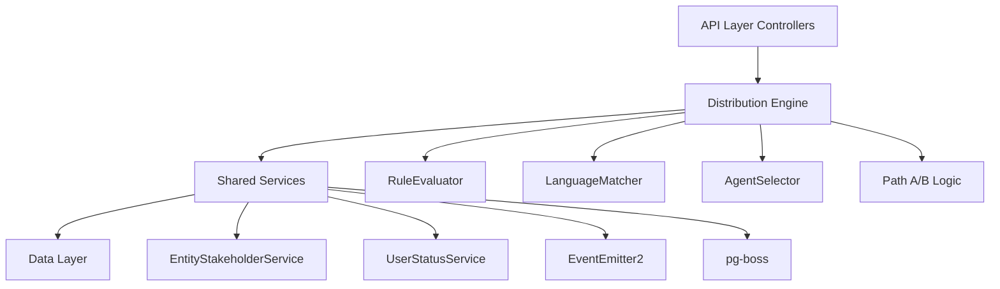

## Overview

The Distribution Module automates lead assignment within organizations. When a new lead is created, the system evaluates org-defined rules to automatically assign the lead to the most appropriate agent — based on lead attributes, UserStatus online/away state, working-hours eligibility, language compatibility, and capacity.

<Note>
**Status:** Active — fully implemented  
**Module Path:** `src/modules/crm/distribution/`
</Note>

### Design Principles

<AccordionGroup>
  <Accordion title="Async distribution">
    `createLead()` emits `LEAD_CREATED` after commit; a pg-boss worker handles distribution. Listener / emit failures are logged only — HTTP lead creation still returns success; manual assignment or backfill may be needed if enqueue never ran. Bulk lead import sets `skipEmitLeadCreated` per row and calls `DistributionJobHandler.enqueueBatch()` once after the import loop.
  </Accordion>

  <Accordion title="Stakeholder system reuse">
    Distribution creates `EntityStakeholder` records via `EntityStakeholderService`, not a new paradigm
  </Accordion>

  <Accordion title="First-match-wins rules">
    Rules are evaluated top-to-bottom by priority; the first matching rule wins
  </Accordion>

  <Accordion title="Idempotency">
    Distribution engine checks for existing stakeholders or pending offers before running
  </Accordion>

  <Accordion title="No retroactive distribution">
    Existing leads are unaffected when rules are created; only new leads trigger distribution
  </Accordion>

  <Accordion title="Default routing control">
    Organizations can disable default routing via `defaultRoutingEnabled` setting; when disabled, only explicit rule matches trigger distribution
  </Accordion>

  <Accordion title="pg-boss scheduling">
    Distribution queue uses pg-boss for reliability and retry guarantees
  </Accordion>

  <Accordion title="RLS compliance">
    All entities carry `organization_id` for row-level security
  </Accordion>
</AccordionGroup>

### Distribution Paths

The engine supports two execution paths:

<Tabs>
  <Tab title="Path A — Org-level">
    **Org-level distribution** (`runDistribution`): triggered when a lead enters the org with no team context. Evaluates org-scoped rules, applies the org default method, and can bridge to Path B if a rule or default method routes to a team that has `distributionEnabled = true`.
  </Tab>
  
  <Tab title="Path B — Team-level">
    **Team-level distribution** (`runTeamDistribution`): triggered directly when:

    - A lead is created with a `teamId` in the event payload (team pool assignment)
    - A bulk-imported lead has a team-only assignment; `LeadImportService` batch-enqueues the job with `teamId`
    - Path A determines the lead belongs to an auto-distributing team
    - Idempotency check finds a single team-only stakeholder with auto-distribute enabled

    Path B consults active distribution rules via the rule service when `defaultRoutingEnabled` is disabled, ensuring team-level distribution respects rule-based routing controls.

    Path B evaluates team-scoped rules, uses team settings (with org fallback for capacity), and logs the team FK on the resulting `DistributionLog` record.
  </Tab>
</Tabs>

## Architecture

### High-level diagram



### Component responsibilities

| Component | Responsibility |
|-----------|---------------|
| **DistributionEngine** | Orchestrator: receives a lead, evaluates rules, selects agent, creates assignment. Supports Path A (org) and Path B (team). |
| **RuleEvaluator** | Evaluates rule conditions against lead data; returns first matching rule |
| **LanguageMatcher** | Filters and ranks agents by language compatibility with the lead's person |
| **AgentSelector** | Applies the distribution method (round-robin, weighted, weighted-round-robin, direct) to the filtered agent pool |
| **DistributionCapacityService** | Two-phase capacity enforcement: Phase 1 `filterByCapacity()` (lead counts vs limits); Phase 2 `confirmCapacityAndAssign()` (advisory locks + atomic stakeholder creation). No entity of its own — queries `entity_stakeholder`. |
| **UserStatusService** | Pre-filters candidate agents to ONLINE status; filters by per-user working hours (`filterByWorkingHours`); provides `isWithinWorkingHours()` for org-level business hours check. |
| **DistributionListener** | Listens for `LEAD_CREATED` events and enqueues pg-boss jobs. The handler is fault-isolated (try/catch): settings lookup and enqueue errors are logged and do not fail `POST /v1/leads`. |
| **DistributionJobHandler** | pg-boss worker that processes distribution jobs |

## Entity Specifications

### DistributionSettings (1 per org)

Org-level configuration for the distribution engine. Auto-created with defaults on first access via `getOrgSettingsRaw()`. Unique constraint on `organization_id`.

<Info>
Auto-created with defaults on first access to ensure organizations always have distribution settings available.
</Info>

| Column | Type | Notes |
|--------|------|-------|
| id | uuid PK | Primary key |
| organization_id | uuid FK UNIQUE | RLS anchor; references `organizations.id` |
| enabled | boolean | Master toggle for org-level distribution |
| default_method | enum | `ROUND_ROBIN`, `WEIGHTED`, `WEIGHTED_ROUND_ROBIN`, `DIRECT` |
| default_routing_enabled | boolean | When `false`, only explicit rule matches trigger distribution |
| fallback_method | enum | Fallback if no agent matches |
| business_hours_enabled | boolean | Whether to gate distribution by org business hours |
| language_matching_enabled | boolean | Whether to filter agents by language compatibility |
| capacity_enabled | boolean | Whether to enforce agent capacity limits |
| max_leads_per_agent | integer | Default capacity limit (nullable) |
| updated_at | timestamptz | Auto-updated on save |

### TeamDistributionSettings (0 or 1 per team)

Team-level overrides for distribution behavior. If missing, team inherits org settings. Auto-created with defaults on first access via `getTeamSettingsRaw()`.

| Column | Type | Notes |
|--------|------|-------|
| id | uuid PK | Primary key |
| organization_id | uuid FK | RLS anchor |
| team_id | uuid FK UNIQUE | References `teams.id` |
| enabled | boolean | Master toggle for team distribution |
| method | enum | Distribution method (nullable = inherit) |
| capacity_enabled | boolean nullable | Nullable = inherit from org |
| max_leads_per_agent | integer nullable | Nullable = inherit from org |
| updated_at | timestamptz | Auto-updated |

<Warning>
When `team_id` is provided, team settings take precedence over org settings for capacity and method configuration.
</Warning>

### DistributionRule

Defines conditional routing logic. Rules are evaluated in ascending `priority` order (lower = higher priority). First match wins.

| Column | Type | Notes |
|--------|------|-------|
| id | uuid PK | Primary key |
| organization_id | uuid FK | RLS anchor |
| team_id | uuid FK nullable | If set, rule applies only to team-level distribution |
| name | string(255) | Human-readable rule name |
| priority | integer | Lower number = higher priority |
| is_active | boolean | Whether rule is enabled |
| conditions | jsonb | Array of condition objects |
| actions | jsonb | Array of action objects |
| created_at | timestamptz | Immutable creation timestamp |
| updated_at | timestamptz | Auto-updated |

<Tabs>
  <Tab title="Condition Schema">
```json
{
  "field": "source",
  "operator": "equals",
  "value": "website"
}
```

**Operators:** `equals`, `not_equals`, `contains`, `not_contains`, `in`, `not_in`, `greater_than`, `less_than`, `is_empty`, `is_not_empty`

**Fields:** `source`, `status`, `value`, `priority`, `tags`, `company_name`, `company_industry`, `company_size`, `person_country`, `person_state`, `person_city`, `person_language`
  </Tab>

  <Tab title="Action Schema">
```json
{
  "type": "assign_to_team",
  "value": "team-uuid"
}
```

**Action Types:**
- `assign_to_team`: Routes to team (if team has `distributionEnabled`, triggers Path B)
- `assign_to_user`: Direct assignment to specific user
- `assign_with_method`: Override distribution method for this rule
  </Tab>
</Tabs>

### DistributionLog

Audit trail of all distribution attempts. One row per attempt, whether successful or failed.

| Column | Type | Notes |
|--------|------|-------|
| id | uuid PK | Primary key |
| organization_id | uuid FK | RLS anchor |
| team_id | uuid FK nullable | Set for Path B distributions |
| lead_id | uuid FK | References `leads.id` |
| assigned_to_user_id | uuid FK nullable | User assigned (if successful) |
| method_used | enum nullable | Distribution method applied |
| rule_id | uuid FK nullable | Rule that matched (if any) |
| status | enum | `success`, `no_agents_available`, `all_at_capacity`, `no_matching_rule`, `error` |
| error_message | text nullable | Error details if status = error |
| metadata | jsonb | Additional context (candidate count, filters applied, etc.) |
| distributed_at | timestamptz | When distribution occurred |

<Check>
All distribution attempts are logged, providing complete audit trail and debugging capabilities.
</Check>

## Type Definitions

### Distribution method enum

```typescript
export enum DistributionMethod {
  ROUND_ROBIN = 'ROUND_ROBIN',
  WEIGHTED = 'WEIGHTED',
  WEIGHTED_ROUND_ROBIN = 'WEIGHTED_ROUND_ROBIN',
  DIRECT = 'DIRECT'
}
```

### Distribution status enum

```typescript
export enum DistributionStatus {
  SUCCESS = 'success',
  NO_AGENTS_AVAILABLE = 'no_agents_available',
  ALL_AT_CAPACITY = 'all_at_capacity',
  NO_MATCHING_RULE = 'no_matching_rule',
  ERROR = 'error'
}
```

### Condition operator types

```typescript
export enum ConditionOperator {
  EQUALS = 'equals',
  NOT_EQUALS = 'not_equals',
  CONTAINS = 'contains',
  NOT_CONTAINS = 'not_contains',
  IN = 'in',
  NOT_IN = 'not_in',
  GREATER_THAN = 'greater_than',
  LESS_THAN = 'less_than',
  IS_EMPTY = 'is_empty',
  IS_NOT_EMPTY = 'is_not_empty'
}
```

## Distribution Engine

### Core workflow

<Steps>
  <Step title="Job dequeue">
    pg-boss worker receives `{ leadId, organizationId, teamId?, userId, requestId }`
  </Step>

  <Step title="Idempotency check">
    Query for existing `EntityStakeholder` or pending offer records for this lead
    
    - If stakeholder exists: log skip, return early
    - If pending offer exists: log skip, return early
  </Step>

  <Step title="Path determination">
    - If `teamId` in payload → **Path B** (team-level)
    - Else → **Path A** (org-level)
  </Step>

  <Step title="Settings & eligibility">
    Load settings, check business hours, build candidate pool
  </Step>

  <Step title="Rule evaluation">
    `RuleEvaluator.findFirstMatch()` against active rules
  </Step>

  <Step title="Agent selection">
    Apply filters (status, language, capacity), then distribution method
  </Step>

  <Step title="Assignment">
    `DistributionCapacityService.confirmCapacityAndAssign()` creates stakeholder
  </Step>

  <Step title="Logging">
    Insert `DistributionLog` record with outcome
  </Step>
</Steps>

### Path A: Org-level distribution

```typescript
async runDistribution(payload: DistributionJobPayload): Promise<void>
```

<Accordion title="Detailed flow">
1. Load org settings; if `!enabled`, skip
2. Check business hours (if configured)
3. Load org-scoped rules; evaluate conditions
4. If rule matches:
   - If action = `assign_to_team` and team has `distributionEnabled` → bridge to Path B
   - If action = `assign_to_user` → direct assign
   - If action = `assign_with_method` → apply method override
5. If no rule match and `defaultRoutingEnabled = false` → log `NO_MATCHING_RULE`
6. Else apply default method to org-wide pool
7. Language match → capacity filter → method select → assign
</Accordion>

### Path B: Team-level distribution

```typescript
async runTeamDistribution(payload: DistributionJobPayload): Promise<void>
```

<Accordion title="Detailed flow">
1. Load team settings (with org fallback)
2. If team `!enabled`, skip
3. Check business hours (org-level check)
4. Load team-scoped rules if `defaultRoutingEnabled = false`
5. Evaluate rules; if match, apply action
6. Build candidate pool from team members with `role = agent | admin`
7. Filter by user status, working hours, language, capacity
8. Apply distribution method → assign
9. Log with `team_id` FK
</Accordion>

### Rule evaluation logic

The `RuleEvaluator` class implements condition matching:

```typescript
class RuleEvaluator {
  findFirstMatch(
    rules: DistributionRule[],
    lead: Lead,
    context: EvaluationContext
  ): DistributionRule | null {
    const sorted = rules
      .filter(r => r.isActive)
      .sort((a, b) => a.priority - b.priority);

    for (const rule of sorted) {
      if (this.evaluateConditions(rule.conditions, lead, context)) {
        return rule;
      }
    }
    return null;
  }

  private evaluateConditions(
    conditions: RuleCondition[],
    lead: Lead,
    context: EvaluationContext
  ): boolean {
    // AND logic: all conditions must pass
    return conditions.every(cond => 
      this.evaluateCondition(cond, lead, context)
    );
  }
}
```

<Info>
Rules use AND logic by default. All conditions in a rule must match for the rule to trigger.
</Info>

### Agent selection methods

<CardGroup cols={2}>
  <Card title="Round Robin" icon="circle-arrow-right">
    Tracks `last_assigned_at` timestamps per user; selects agent with oldest timestamp. Updates timestamp on assignment.
  </Card>

  <Card title="Weighted" icon="weight-scale">
    Each agent has a weight (default 1). Random selection probability proportional to weight. Higher weight = more leads.
  </Card>

  <Card title="Weighted Round Robin" icon="arrows-rotate">
    Hybrid: maintains round-robin ordering but allows weight-based skip probability. Balances fairness with workload distribution.
  </Card>

  <Card title="Direct Assignment" icon="user-check">
    Assigns to specific user ID from rule action. No selection algorithm needed.
  </Card>
</CardGroup>

### Language matching

```typescript
class LanguageMatcher {
  filterAndRankByLanguage(
    agents: User[],
    leadLanguages: string[]
  ): User[] {
    if (!leadLanguages.length) return agents;

    const scored = agents.map(agent => {
      const agentLangs = agent.languages || [];
      const matchCount = leadLanguages.filter(lang =>
        agentLangs.includes(lang)
      ).length;

      return {
        agent,
        score: matchCount,
        hasMatch: matchCount > 0
      };
    });

    // Return agents with at least one language match, sorted by score
    return scored
      .filter(s => s.hasMatch)
      .sort((a, b) => b.score - a.score)
      .map(s => s.agent);
  }
}
```

<Tip>
Language matching is opt-in via `language_matching_enabled`. When disabled, all agents are eligible regardless of language.
</Tip>

### Capacity enforcement

Two-phase approach for concurrency safety:

<Steps>
  <Step title="Phase 1: filterByCapacity()">
    Pre-filters candidates based on current lead counts vs. limits. Non-blocking query:
    
    ```sql
    SELECT u.id, COUNT(es.id) as current_leads
    FROM users u
    LEFT JOIN entity_stakeholder es ON es.user_id = u.id
      AND es.entity_type = 'lead'
      AND es.role = 'owner'
    WHERE u.id = ANY($1)
    GROUP BY u.id
    HAVING COUNT(es.id) < $2
    ```
  </Step>

  <Step title="Phase 2: confirmCapacityAndAssign()">
    Advisory lock + atomic stakeholder creation:
    
    ```typescript
    await em.transactional(async em => {
      await em.execute('SELECT pg_advisory_xact_lock($1)', [userId]);
      
      const current = await this.stakeholderService.countLeadsForAgent(
        userId,
        organizationId,
        em
      );
      
      if (current >= limit) {
        throw new CapacityExceededException();
      }
      
      await this.stakeholderService.create({
        entityType: 'lead',
        entityId: leadId,
        userId,
        role: 'owner',
        ...
      }, em);
    });
    ```
  </Step>
</Steps>

<Warning>
Advisory locks are user-scoped. High-concurrency orgs may experience contention if many leads route to the same agent simultaneously.
</Warning>

## pg-boss Job Configuration

### Queue name

`distribution`

### Job payload schema

```typescript
interface DistributionJobPayload {
  leadId: string;
  organizationId: string;
  teamId?: string;        // If set, triggers Path B
  userId: string;         // Creator user ID for audit
  requestId?: string;     // Request correlation ID
}
```

### Queue options

```typescript
{
  retryLimit: 3,
  retryDelay: 60,        // seconds
  retryBackoff: true,
  expireInHours: 24,
  singletonKey: leadId   // Prevents duplicate jobs for same lead
}
```

### Job handler registration

```typescript
@Injectable()
export class DistributionJobHandler {
  constructor(
    private readonly pgBoss: PgBossService,
    private readonly engine: DistributionEngine
  ) {}

  async onModuleInit() {
    await this.pgBoss.work(
      'distribution',
      { teamSize: 5, teamConcurrency: 2 },
      async (job) => this.handle(job)
    );
  }

  private async handle(job: PgBoss.Job<DistributionJobPayload>) {
    try {
      await this.engine.distribute(job.data);
    } catch (error) {
      this.logger.error('Distribution job failed', error);
      throw error; // pg-boss will retry
    }
  }

  async enqueueBatch(payloads: DistributionJobPayload[]) {
    const jobs = payloads.map(data => ({
      name: 'distribution',
      data,
      options: {
        singletonKey: data.leadId,
        retryLimit: 3
      }
    }));

    await this.pgBoss.sendBatch(jobs);
  }
}
```

<Info>
`teamSize: 5, teamConcurrency: 2` means pg-boss will process up to 5 jobs in parallel, fetching them in batches of 2.
</Info>

## API Endpoints

### Distribution settings

<CodeGroup>
```typescript GET /v1/distribution/settings
@Get('settings')
@UseGuards(JwtAuthGuard, OrganizationGuard)
async getSettings(@CurrentUser() user: User) {
  return this.service.getSettings(user.organizationId);
}
```

```typescript PATCH /v1/distribution/settings
@Patch('settings')
@UseGuards(JwtAuthGuard, RolesGuard)
@Roles('admin')
async updateSettings(
  @CurrentUser() user: User,
  @Body() dto: UpdateDistributionSettingsDto
) {
  return this.service.updateSettings(user.organizationId, dto);
}
```
</CodeGroup>

### Team distribution settings

<CodeGroup>
```typescript GET /v1/teams/:teamId/distribution/settings
@Get(':teamId/distribution/settings')
@UseGuards(JwtAuthGuard, TeamMemberGuard)
async getTeamSettings(@Param('teamId') teamId: string) {
  return this.service.getTeamSettings(teamId);
}
```

```typescript PATCH /v1/teams/:teamId/distribution/settings
@Patch(':teamId/distribution/settings')
@UseGuards(JwtAuthGuard, TeamAdminGuard)
async updateTeamSettings(
  @Param('teamId') teamId: string,
  @Body() dto: UpdateTeamDistributionSettingsDto
) {
  return this.service.updateTeamSettings(teamId, dto);
}
```
</CodeGroup>

### Distribution rules

<Tabs>
  <Tab title="List Rules">
```typescript
@Get('rules')
@UseGuards(JwtAuthGuard, OrganizationGuard)
async listRules(
  @CurrentUser() user: User,
  @Query('teamId') teamId?: string
) {
  return this.rulesService.list(user.organizationId, { teamId });
}
```
  </Tab>

  <Tab title="Create Rule">
```typescript
@Post('rules')
@UseGuards(JwtAuthGuard, RolesGuard)
@Roles('admin')
async createRule(
  @CurrentUser() user: User,
  @Body() dto: CreateDistributionRuleDto
) {
  return this.rulesService.create(user.organizationId, dto);
}
```
  </Tab>

  <Tab title="Update Rule">
```typescript
@Patch('rules/:ruleId')
@UseGuards(JwtAuthGuard, RolesGuard)
@Roles('admin')
async updateRule(
  @Param('ruleId') ruleId: string,
  @Body() dto: UpdateDistributionRuleDto
) {
  return this.rulesService.update(ruleId, dto);
}
```
  </Tab>

  <Tab title="Delete Rule">
```typescript
@Delete('rules/:ruleId')
@UseGuards(JwtAuthGuard, RolesGuard)
@Roles('admin')
async deleteRule(@Param('ruleId') ruleId: string) {
  return this.rulesService.delete(ruleId);
}
```
  </Tab>

  <Tab title="Reorder Rules">
```typescript
@Post('rules/reorder')
@UseGuards(JwtAuthGuard, RolesGuard)
@Roles('admin')
async reorderRules(
  @CurrentUser() user: User,
  @Body() dto: ReorderRulesDto
) {
  // dto: { ruleIds: string[] } — new priority order
  return this.rulesService.reorder(user.organizationId, dto.ruleIds);
}
```
  </Tab>
</Tabs>

### Distribution analytics

```typescript
@Get('analytics/distribution-metrics')
@UseGuards(JwtAuthGuard, OrganizationGuard)
async getDistributionMetrics(
  @CurrentUser() user: User,
  @Query('startDate') startDate: string,
  @Query('endDate') endDate: string,
  @Query('teamId') teamId?: string
) {
  return this.analyticsService.getDistributionMetrics(
    user.organizationId,
    { startDate: new Date(startDate), endDate: new Date(endDate), teamId }
  );
}
```

<Info>
Analytics endpoint returns success rate, average assignment time, leads per agent, and rule hit counts.
</Info>

### Manual distribution trigger

```typescript
@Post('leads/:leadId/distribute')
@UseGuards(JwtAuthGuard, RolesGuard)
@Roles('admin', 'agent')
async manualDistribute(
  @CurrentUser() user: User,
  @Param('leadId') leadId: string
) {
  // Re-enqueue distribution job
  await this.jobHandler.enqueue({
    leadId,
    organizationId: user.organizationId,
    userId: user.id,
    requestId: context.requestId
  });

  return { message: 'Distribution queued' };
}
```

## Security & Permissions

### Role requirements

| Endpoint | Required Role | Guard |
|----------|--------------|-------|
| Get settings | Any authenticated | `OrganizationGuard` |
| Update settings | `admin` | `RolesGuard` + `Roles('admin')` |
| List rules | Any authenticated | `OrganizationGuard` |
| Create/update/delete rule | `admin` | `RolesGuard` + `Roles('admin')` |
| Team settings (get) | Team member | `TeamMemberGuard` |
| Team settings (update) | Team admin | `TeamAdminGuard` |
| Manual distribution | `admin`, `agent` | `RolesGuard` + `Roles('admin', 'agent')` |

### Data access controls

<Warning>
All entities include `organization_id` for RLS enforcement. Queries automatically scope to the user's organization via global filters in MikroORM.
</Warning>

<Steps>
  <Step title="Organization isolation">
    All queries filtered by `organization_id` via global MikroORM filter
  </Step>

  <Step title="Team visibility">
    Team-scoped rules only visible to team members; enforced in `TeamMemberGuard`
  </Step>

  <Step title="Stakeholder creation">
    Distribution engine creates stakeholders via `EntityStakeholderService`, which enforces same-org constraints
  </Step>

  <Step title="Audit logging">
    All distribution attempts logged with `userId` and `organizationId` for compliance
  </Step>
</Steps>

## Observability & Audit

### Distribution log queries

```typescript
// Get distribution history for a lead
async getLeadDistributionHistory(leadId: string) {
  return this.em.find(DistributionLog, {
    leadId,
    $or: [{ status: 'success' }, { status: 'error' }]
  }, {
    orderBy: { distributedAt: 'DESC' }
  });
}

// Get failed distributions for debugging
async getFailedDistributions(organizationId: string, since: Date) {
  return this.em.find(DistributionLog, {
    organizationId,
    status: { $in: ['error', 'no_agents_available', 'all_at_capacity'] },
    distributedAt: { $gte: since }
  }, {
    orderBy: { distributedAt: 'DESC' },
    limit: 100
  });
}
```

### Metadata structure

The `metadata` jsonb field captures:

```json
{
  "candidateCount": 5,
  "filtersApplied": ["status", "language", "capacity"],
  "languageMatches": ["en", "es"],
  "capacityInfo": {
    "beforeFiltering": 8,
    "afterFiltering": 5
  },
  "ruleEvaluated": true,
  "businessHoursCheck": true,
  "timings": {
    "ruleEvalMs": 12,
    "agentFilterMs": 45,
    "totalMs": 89
  }
}
```

### Logging best practices

<Tip>
Use structured logging with correlation IDs to trace distribution flows across async boundaries.
</Tip>

```typescript
this.logger.log({
  message: 'Distribution started',
  leadId,
  organizationId,
  teamId,
  requestId,
  path: teamId ? 'team' : 'org'
});

this.logger.warn({
  message: 'No agents available',
  leadId,
  organizationId,
  teamId,
  reason: 'all_offline',
  candidateCount: 0
});

this.logger.error({
  message: 'Distribution engine error',
  leadId,
  error: error.message,
  stack: error.stack
});
```

## Analytics & Metrics

### Key metrics tracked

<CardGroup cols={2}>
  <Card title="Success rate" icon="chart-line">
    Percentage of distribution attempts that result in successful assignment
  </Card>

  <Card title="Average assignment time" icon="clock">
    Time from lead creation to stakeholder record creation
  </Card>

  <Card title="Leads per agent" icon="users">
    Distribution of lead assignments across agents
  </Card>

  <Card title="Rule hit rate" icon="bullseye">
    How often each rule matches vs. default routing
  </Card>

  <Card title="Capacity utilization" icon="gauge">
    Percentage of agent capacity limits in use
  </Card>

  <Card title="Failure reasons" icon="triangle-exclamation">
    Breakdown of distribution failures by reason
  </Card>
</CardGroup>

### Analytics query examples

```typescript
// Success rate by period
async getSuccessRate(orgId: string, start: Date, end: Date) {
  const result = await this.em.getConnection().execute(`
    SELECT
      COUNT(*) FILTER (WHERE status = 'success') as successes,
      COUNT(*) as total,
      (COUNT(*) FILTER (WHERE status = 'success')::float / COUNT(*)) as rate
    FROM distribution_log
    WHERE organization_id = $1
      AND distributed_at >= $2
      AND distributed_at <= $3
  `, [orgId, start, end]);

  return result[0];
}

// Leads per agent
async getLeadsPerAgent(orgId: string, start: Date, end: Date) {
  return this.em.getConnection().execute(`
    SELECT
      u.id,
      u.first_name,
      u.last_name,
      COUNT(dl.id) as lead_count
    FROM distribution_log dl
    JOIN users u ON u.id = dl.assigned_to_user_id
    WHERE dl.organization_id = $1
      AND dl.status = 'success'
      AND dl.distributed_at >= $2
      AND dl.distributed_at <= $3
    GROUP BY u.id, u.first_name, u.last_name
    ORDER BY lead_count DESC
  `, [orgId, start, end]);
}

// Rule effectiveness
async getRuleHitCounts(orgId: string, start: Date, end: Date) {
  return this.em.getConnection().execute(`
    SELECT
      dr.id,
      dr.name,
      COUNT(dl.id) as hit_count
    FROM distribution_rule dr
    LEFT JOIN distribution_log dl ON dl.rule_id = dr.id
      AND dl.distributed_at >= $2
      AND dl.distributed_at <= $3
    WHERE dr.organization_id = $1
    GROUP BY dr.id, dr.name
    ORDER BY hit_count DESC
  `, [orgId, start, end]);
}
```

## Edge Case Handling

### No agents available

<Accordion title="Scenario">
All agents are offline, away, or outside working hours.
</Accordion>

<Accordion title="Behavior">
- Log `DistributionLog` with status `NO_AGENTS_AVAILABLE`
- Lead remains unassigned
- Admin can manually assign or wait for agent availability
- Consider implementing fallback notification system
</Accordion>

### All agents at capacity

<Accordion title="Scenario">
All eligible agents have reached their lead limit.
</Accordion>

<Accordion title="Behavior">
- Log `DistributionLog` with status `ALL_AT_CAPACITY`
- Lead remains unassigned
- Consider implementing waitlist or overflow team logic
- Analytics dashboard should highlight capacity issues
</Accordion>

### No matching rule (when default routing disabled)

<Accordion title="Scenario">
`defaultRoutingEnabled = false` and no rule conditions match the lead.
</Accordion>

<Accordion title="Behavior">
- Log `DistributionLog` with status `NO_MATCHING_RULE`
- Lead remains unassigned
- Admin must manually assign or create broader rules
- Helps enforce strict routing policies
</Accordion>

### Team distribution with no team members

<Accordion title="Scenario">
Path B triggered but team has no agents or all agents filtered out.
</Accordion>

<Accordion title="Behavior">
- Log `DistributionLog` with status `NO_AGENTS_AVAILABLE`, `team_id` set
- No fallback to org-level pool (team isolation)
- Admin must add agents to team or reassign lead
</Accordion>

### Concurrent distribution attempts

<Accordion title="Scenario">
Multiple jobs enqueued for same lead due to race condition.
</Accordion>

<Accordion title="Behavior">
- pg-boss `singletonKey` prevents duplicate jobs in queue
- Engine idempotency check at start of distribution
- If stakeholder exists, skip gracefully
- Second job logs skip and exits early
</Accordion>

### Business hours boundary

<Accordion title="Scenario">
Lead created at 8:59 PM when business hours end at 9:00 PM.
</Accordion>

<Accordion title="Behavior">
- Business hours check uses org-level `working_hours` configuration
- If outside hours, log `DistributionLog` with metadata note
- Lead remains unassigned until next business day
- Consider implementing scheduled retry for next open window
</Accordion>

### Language mismatch

<Accordion title="Scenario">
Lead has language requirement but no agents speak that language.
</Accordion>

<Accordion title="Behavior">
- If `language_matching_enabled = true`, no agents pass filter
- Log `NO_AGENTS_AVAILABLE` with metadata showing language requirement
- If disabled, proceed with any agent (ignoring language)
- Consider implementing language-based fallback teams
</Accordion>

### Rule priority conflicts

<Accordion title="Scenario">
Multiple rules could match same lead.
</Accordion>

<Accordion title="Behavior">
- Rules evaluated in ascending `priority` order
- First match wins, remaining rules ignored
- Admin UI should warn about overlapping conditions
- Consider dry-run simulation tool for rule testing
</Accordion>

## Performance & Scaling

### Database indexes

```sql
-- Org settings lookup
CREATE UNIQUE INDEX idx_dist_settings_org 
ON distribution_settings(organization_id);

-- Team settings lookup
CREATE UNIQUE INDEX idx_team_dist_settings_team 
ON team_distribution_settings(team_id);

-- Rule evaluation
CREATE INDEX idx_dist_rules_org_active_priority 
ON distribution_rule(organization_id, is_active, priority) 
WHERE is_active = true;

-- Team-scoped rules
CREATE INDEX idx_dist_rules_team_active_priority 
ON distribution_rule(team_id, is_active, priority) 
WHERE team_id IS NOT NULL AND is_active = true;

-- Distribution log queries
CREATE INDEX idx_dist_log_org_date 
ON distribution_log(organization_id, distributed_at DESC);

CREATE INDEX idx_dist_log_lead 
ON distribution_log(lead_id, distributed_at DESC);

CREATE INDEX idx_dist_log_status 
ON distribution_log(organization_id, status, distributed_at DESC);

-- Capacity counting
CREATE INDEX idx_stakeholder_user_lead_owner 
ON entity_stakeholder(user_id, entity_type, role) 
WHERE entity_type = 'lead' AND role = 'owner';
```

### Query optimization

<Tip>
Use `EXPLAIN ANALYZE` to verify index usage on high-volume queries.
</Tip>

```sql
-- Good: Uses idx_dist_rules_org_active_priority
EXPLAIN ANALYZE
SELECT * FROM distribution_rule
WHERE organization_id = $1
  AND is_active = true
ORDER BY priority ASC;

-- Good: Uses idx_stakeholder_user_lead_owner
EXPLAIN ANALYZE
SELECT COUNT(*) FROM entity_stakeholder
WHERE user_id = $1
  AND entity_type = 'lead'
  AND role = 'owner';
```

### Concurrency considerations

<Warning>
Advisory locks are per-user. High concurrent load on a single agent can cause lock contention and slow down assignments.
</Warning>

**Mitigation strategies:**

1. **Increase pg-boss concurrency** to process more jobs in parallel
2. **Implement staggered retries** for capacity-exceeded cases
3. **Pre-warm candidate pools** during rule evaluation to reduce lock hold time
4. **Consider lock timeout** in `confirmCapacityAndAssign()` to fail fast

```typescript
// Add lock timeout
await em.execute('SET LOCAL lock_timeout = 5000'); // 5 seconds
await em.execute('SELECT pg_advisory_xact_lock($1)', [userId]);
```

### Scaling recommendations

| Org Size | pg-boss Workers | Concurrency | Notes |
|----------|----------------|-------------|-------|
| < 100 agents | 2 | 3 | Default config sufficient |
| 100-500 agents | 5 | 5 | Increase worker count |
| 500-1000 agents | 10 | 8 | Consider dedicated queue instances |
| > 1000 agents | 15+ | 10+ | Shard by organization or region |

### Monitoring queries

```sql
-- Check pg-boss queue depth
SELECT COUNT(*) FROM pgboss.job
WHERE name = 'distribution'
  AND state = 'created';

-- Check average distribution time
SELECT
  AVG(EXTRACT(EPOCH FROM (distributed_at - created_at))) as avg_seconds
FROM distribution_log
WHERE distributed_at >= NOW() - INTERVAL '1 hour';

-- Identify slow distributions
SELECT
  lead_id,
  distributed_at - created_at as duration,
  metadata
FROM distribution_log
WHERE distributed_at - created_at > INTERVAL '10 seconds'
ORDER BY duration DESC
LIMIT 20;
```

## RLS Policies

### DistributionSettings

```sql
-- Users can view their org's settings
CREATE POLICY dist_settings_select ON distribution_settings
FOR SELECT USING (organization_id = current_setting('app.current_org_id')::uuid);

-- Only admins can update
CREATE POLICY dist_settings_update ON distribution_settings
FOR UPDATE USING (
  organization_id = current_setting('app.current_org_id')::uuid
  AND current_setting('app.current_user_role') = 'admin'
);
```

### TeamDistributionSettings

```sql
-- Team members can view team settings
CREATE POLICY team_dist_settings_select ON team_distribution_settings
FOR SELECT USING (
  organization_id = current_setting('app.current_org_id')::uuid
  AND EXISTS (
    SELECT 1 FROM team_members
    WHERE team_id = team_distribution_settings.team_id
      AND user_id = current_setting('app.current_user_id')::uuid
  )
);

-- Team admins can update
CREATE POLICY team_dist_settings_update ON team_distribution_settings
FOR UPDATE USING (
  organization_id = current_setting('app.current_org_id')::uuid
  AND EXISTS (
    SELECT 1 FROM team_members
    WHERE team_id = team_distribution_settings.team_id
      AND user_id = current_setting('app.current_user_id')::uuid
      AND role IN ('admin', 'owner')
  )
);
```

### DistributionRule

```sql
-- Users can view org/team rules
CREATE POLICY dist_rules_select ON distribution_rule
FOR SELECT USING (
  organization_id = current_setting('app.current_org_id')::uuid
  AND (
    team_id IS NULL
    OR EXISTS (
      SELECT 1 FROM team_members
      WHERE team_id = distribution_rule.team_id
        AND user_id = current_setting('app.current_user_id')::uuid
    )
  )
);

-- Admins can create/update/delete
CREATE POLICY dist_rules_write ON distribution_rule
FOR ALL USING (
  organization_id = current_setting('app.current_org_id')::uuid
  AND current_setting('app.current_user_role') = 'admin'
);
```

### DistributionLog

```sql
-- All org users can view distribution logs
CREATE POLICY dist_log_select ON distribution_log
FOR SELECT USING (
  organization_id = current_setting('app.current_org_id')::uuid
);

-- System can insert (no user-facing writes)
CREATE POLICY dist_log_insert ON distribution_log
FOR INSERT WITH CHECK (
  organization_id = current_setting('app.current_org_id')::uuid
);
```

<Check>
RLS policies enforce org-level isolation and role-based write access across all distribution entities.
</Check>

## Module Structure

```
src/modules/crm/distribution/
├── distribution.module.ts
├── controllers/
│   ├── distribution-settings.controller.ts
│   ├── distribution-rules.controller.ts
│   ├── team-distribution.controller.ts
│   └── distribution-analytics.controller.ts
├── services/
│   ├── distribution-engine.service.ts
│   ├── distribution-settings.service.ts
│   ├── distribution-rules.service.ts
│   ├── distribution-capacity.service.ts
│   ├── distribution-analytics.service.ts
│   ├── rule-evaluator.service.ts
│   ├── language-matcher.service.ts
│   └── agent-selector.service.ts
├── jobs/
│   ├── distribution-job-handler.ts
│   └── distribution.listener.ts
├── entities/
│   ├── distribution-settings.entity.ts
│   ├── team-distribution-settings.entity.ts
│   ├── distribution-rule.entity.ts
│   └── distribution-log.entity.ts
├── dto/
│   ├── update-distribution-settings.dto.ts
│   ├── update-team-distribution-settings.dto.ts
│   ├── create-distribution-rule.dto.ts
│   ├── update-distribution-rule.dto.ts
│   ├── reorder-rules.dto.ts
│   └── distribution-analytics.dto.ts
├── types/
│   ├── distribution-method.enum.ts
│   ├── distribution-status.enum.ts
│   ├── condition-operator.enum.ts
│   └── interfaces.ts
└── tests/
    ├── distribution-engine.service.spec.ts
    ├── rule-evaluator.service.spec.ts
    ├── agent-selector.service.spec.ts
    └── distribution-capacity.service.spec.ts
```

## Integration Points

### EntityStakeholderService

<Accordion title="Integration details">
Distribution creates stakeholder records via the shared `EntityStakeholderService`:

```typescript
await this.stakeholderService.create({
  entityType: 'lead',
  entityId: leadId,
  userId: selectedAgent.id,
  role: 'owner',
  organizationId,
  createdBy: userId
}, em);
```

This ensures consistency with other stakeholder-creating flows (manual assignment, task assignment, etc.).
</Accordion>

### UserStatusService

<Accordion title="Integration details">
Provides real-time agent availability:

```typescript
// Filter to ONLINE agents
const onlineAgents = await this.userStatusService.filterOnlineUsers(
  candidates,
  organizationId
);

// Check working hours
const eligibleAgents = await this.userStatusService.filterByWorkingHours(
  onlineAgents,
  organizationId
);
```

Depends on `user_status` table updated by presence service.
</Accordion>

### EventEmitter2

<Accordion title="Integration details">
Lead creation emits events that trigger distribution:

```typescript
// In LeadService.create()
await this.em.flush(); // Persist lead

if (!skipEmitLeadCreated) {
  this.eventEmitter.emit('lead.created', {
    leadId: lead.id,
    organizationId: lead.organizationId,
    teamId: dto.teamId,
    userId: currentUser.id,
    requestId: context.requestId
  });
}
```

`DistributionListener` subscribes to this event.
</Accordion>

### TeamService

<Accordion title="Integration details">
Distribution queries team membership and roles:

```typescript
const teamMembers = await this.teamService.getMembers(teamId);
const agents = teamMembers.filter(m => 
  m.role === 'agent' || m.role === 'admin'
);
```

Team settings determine whether team has distribution enabled.
</Accordion>

### LeadImportService

<Accordion title="Integration details">
Bulk import bypasses event emission and batch-enqueues jobs:

```typescript
// In LeadImportService.importLeads()
const payloads: DistributionJobPayload[] = [];

for (const row of validRows) {
  const lead = await this.leadService.create({
    ...row,
    skipEmitLeadCreated: true
  });

  if (shouldAutoDistribute(row)) {
    payloads.push({
      leadId: lead.id,
      organizationId: lead.organizationId,
      teamId: row.teamId,
      userId: currentUser.id
    });
  }
}

if (payloads.length > 0) {
  await this.distributionJobHandler.enqueueBatch(payloads);
}
```
</Accordion>

## Environment Configuration

### Required environment variables

```bash
# pg-boss configuration
PGBOSS_DB_HOST=localhost
PGBOSS_DB_PORT=5432
PGBOSS_DB_NAME=crm_db
PGBOSS_DB_USER=postgres
PGBOSS_DB_PASSWORD=secret

# Distribution queue tuning
DISTRIBUTION_WORKER_COUNT=5
DISTRIBUTION_CONCURRENCY=5
DISTRIBUTION_RETRY_LIMIT=3
DISTRIBUTION_RETRY_DELAY=60

# Feature flags
DISTRIBUTION_ENABLED=true
DISTRIBUTION_LANGUAGE_MATCHING_ENABLED=true
DISTRIBUTION_CAPACITY_ENABLED=true

# Business hours default (ISO 8601 duration)
DEFAULT_BUSINESS_HOURS_START=09:00
DEFAULT_BUSINESS_HOURS_END=17:00
DEFAULT_BUSINESS_HOURS_TIMEZONE=America/New_York
```

### Feature toggles

<Tabs>
  <Tab title="DISTRIBUTION_ENABLED">
    Master kill switch. When `false`, distribution listener does not enqueue jobs. Existing settings and rules remain intact but inactive.
  </Tab>

  <Tab title="DISTRIBUTION_LANGUAGE_MATCHING_ENABLED">
    Global toggle for language matching. Overrides per-org `language_matching_enabled` setting. Useful for A/B testing.
  </Tab>

  <Tab title="DISTRIBUTION_CAPACITY_ENABLED">
    Global toggle for capacity enforcement. When `false`, agents can receive unlimited leads regardless of settings.
  </Tab>
</Tabs>

### Deployment considerations

<Steps>
  <Step title="Database migrations">
    Run migrations to create distribution tables:
    
    ```bash
    npm run migration:up
    ```
  </Step>

  <Step title="pg-boss initialization">
    Ensure pg-boss schema exists:
    
    ```bash
    npm run pgboss:init
    ```
  </Step>

  <Step title="Worker startup">
    Distribution workers auto-register on module init. Verify in logs:
    
    ```
    [DistributionJobHandler] Worker registered: distribution (teamSize=5)
    ```
  </Step>

  <Step title="Default settings">
    First API call to get settings auto-creates defaults for org. No manual seed required.
  </Step>

  <Step title="Monitoring">
    Set up alerts for:
    - High `NO_AGENTS_AVAILABLE` rate
    - Growing pg-boss queue depth
    - Distribution log error rate
  </Step>
</Steps>

---

<Card title="Related Documentation" icon="book" href="/backend/crm/entity-stakeholder">
  Learn about the EntityStakeholder system that distribution integrates with
</Card>