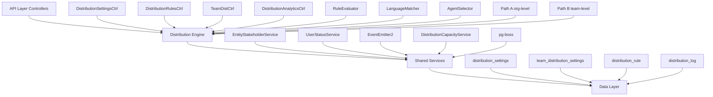

The Distribution Module automates lead assignment within organizations. When a new lead is created, the system evaluates org-defined rules to automatically assign the lead to the most appropriate agent — based on lead attributes, UserStatus online/away state, working-hours eligibility, language compatibility, and capacity.

## Design Principles

<CardGroup cols={2}>
  <Card title="Async Distribution" icon="clock">
    `createLead()` emits `LEAD_CREATED` after commit; a pg-boss worker handles distribution
  </Card>
  <Card title="Stakeholder System Reuse" icon="users">
    Distribution creates `EntityStakeholder` records via `EntityStakeholderService`
  </Card>
  <Card title="First-Match-Wins Rules" icon="trophy">
    Rules are evaluated top-to-bottom by priority; the first matching rule wins
  </Card>
  <Card title="Idempotency" icon="shield-check">
    Distribution engine checks for existing stakeholders or pending offers before running
  </Card>
</CardGroup>

<Note>
No retroactive distribution: Existing leads are unaffected when rules are created; only new leads trigger distribution
</Note>

### Distribution Paths

The engine supports two execution paths:

<Tabs>
  <Tab title="Path A - Org Level">
    **Org-level distribution** (`runDistribution`): triggered when a lead enters the org with no team context. Evaluates org-scoped rules, applies the org default method, and can bridge to Path B if a rule or default method routes to a team that has `distributionEnabled = true`.
  </Tab>
  <Tab title="Path B - Team Level">
    **Team-level distribution** (`runTeamDistribution`): triggered directly when:
    - A lead is created with a `teamId` in the event payload (team pool assignment)
    - A bulk-imported lead has a team-only assignment
    - Path A determines the lead belongs to an auto-distributing team
    - Idempotency check finds a single team-only stakeholder with auto-distribute enabled
  </Tab>
</Tabs>

## Architecture

### High-Level System Overview



### Component Responsibilities

<AccordionGroup>
  <Accordion title="Distribution Engine">
    Orchestrator: receives a lead, evaluates rules, selects agent, creates assignment. Supports Path A (org) and Path B (team).
  </Accordion>
  <Accordion title="RuleEvaluator">
    Evaluates rule conditions against lead data; returns first matching rule
  </Accordion>
  <Accordion title="LanguageMatcher">
    Filters and ranks agents by language compatibility with the lead's person
  </Accordion>
  <Accordion title="AgentSelector">
    Applies the distribution method (round-robin, weighted, weighted-round-robin, direct) to the filtered agent pool
  </Accordion>
  <Accordion title="DistributionCapacityService">
    Two-phase capacity enforcement: Phase 1 `filterByCapacity()` (lead counts vs limits); Phase 2 `confirmCapacityAndAssign()` (advisory locks + atomic stakeholder creation)
  </Accordion>
  <Accordion title="UserStatusService">
    Pre-filters candidate agents to ONLINE status; filters by per-user working hours; provides `isWithinWorkingHours()` for org-level business hours check
  </Accordion>
</AccordionGroup>

## Entity Specifications

### DistributionSettings (1 per org)

Org-level configuration for the distribution engine. Auto-created with defaults on first access via `getOrgSettingsRaw()`.

<CodeGroup>
```sql Schema
CREATE TABLE distribution_settings (
  id uuid PRIMARY KEY,
  organization_id uuid UNIQUE NOT NULL,
  default_method distribution_method DEFAULT 'round_robin',
  default_routing_enabled boolean DEFAULT true,
  business_hours_enabled boolean DEFAULT false,
  business_hours_timezone varchar(50) DEFAULT 'UTC',
  business_hours jsonb DEFAULT '{}',
  language_matching_enabled boolean DEFAULT false,
  created_at timestamptz DEFAULT now(),
  updated_at timestamptz DEFAULT now()
);
```

```typescript Types
interface DistributionSettings {
  id: string;
  organizationId: string;
  defaultMethod: DistributionMethod;
  defaultRoutingEnabled: boolean;
  businessHoursEnabled: boolean;
  businessHoursTimezone: string;
  businessHours: Record<string, any>;
  languageMatchingEnabled: boolean;
  createdAt: Date;
  updatedAt: Date;
}
```
</CodeGroup>

<Warning>
Unique constraint on `organization_id`. Auto-creation ensures every org has settings without manual setup.
</Warning>

### TeamDistributionSettings

Team-level overrides and settings for distribution behavior.

<CodeGroup>
```sql Schema
CREATE TABLE team_distribution_settings (
  id uuid PRIMARY KEY,
  team_id uuid UNIQUE NOT NULL,
  organization_id uuid NOT NULL,
  distribution_enabled boolean DEFAULT false,
  method distribution_method,
  capacity_limit integer,
  created_at timestamptz DEFAULT now(),
  updated_at timestamptz DEFAULT now()
);
```

```typescript Types
interface TeamDistributionSettings {
  id: string;
  teamId: string;
  organizationId: string;
  distributionEnabled: boolean;
  method?: DistributionMethod;
  capacityLimit?: number;
  createdAt: Date;
  updatedAt: Date;
}
```
</CodeGroup>

### DistributionRule

Conditional routing rules that override default distribution behavior.

<CodeGroup>
```sql Schema
CREATE TABLE distribution_rule (
  id uuid PRIMARY KEY,
  organization_id uuid NOT NULL,
  team_id uuid,
  name varchar(255) NOT NULL,
  priority integer NOT NULL,
  is_active boolean DEFAULT true,
  conditions jsonb NOT NULL,
  action jsonb NOT NULL,
  created_at timestamptz DEFAULT now(),
  updated_at timestamptz DEFAULT now()
);
```

```typescript Types
interface DistributionRule {
  id: string;
  organizationId: string;
  teamId?: string;
  name: string;
  priority: number;
  isActive: boolean;
  conditions: RuleConditions;
  action: RuleAction;
  createdAt: Date;
  updatedAt: Date;
}
```
</CodeGroup>

### DistributionLog

Audit trail for all distribution events and decisions.

<CodeGroup>
```sql Schema
CREATE TABLE distribution_log (
  id uuid PRIMARY KEY,
  organization_id uuid NOT NULL,
  lead_id uuid NOT NULL,
  team_id uuid,
  assigned_user_id uuid,
  method distribution_method,
  rule_id uuid,
  status distribution_status NOT NULL,
  error_message text,
  metadata jsonb,
  created_at timestamptz DEFAULT now()
);
```

```typescript Types
interface DistributionLog {
  id: string;
  organizationId: string;
  leadId: string;
  teamId?: string;
  assignedUserId?: string;
  method?: DistributionMethod;
  ruleId?: string;
  status: DistributionStatus;
  errorMessage?: string;
  metadata?: Record<string, any>;
  createdAt: Date;
}
```
</CodeGroup>

## Type Definitions

### Core Enums

<CodeGroup>
```typescript Distribution Methods
enum DistributionMethod {
  ROUND_ROBIN = 'round_robin',
  WEIGHTED = 'weighted', 
  WEIGHTED_ROUND_ROBIN = 'weighted_round_robin',
  DIRECT = 'direct'
}
```

```typescript Distribution Status
enum DistributionStatus {
  SUCCESS = 'success',
  NO_AGENTS_AVAILABLE = 'no_agents_available',
  CAPACITY_EXCEEDED = 'capacity_exceeded',
  BUSINESS_HOURS_RESTRICTION = 'business_hours_restriction',
  LANGUAGE_MISMATCH = 'language_mismatch',
  ERROR = 'error',
  SKIPPED_EXISTING_ASSIGNMENT = 'skipped_existing_assignment'
}
```

```typescript Rule Conditions
interface RuleConditions {
  leadSource?: string[];
  leadValue?: { min?: number; max?: number };
  personLocation?: { countries?: string[]; regions?: string[] };
  personLanguage?: string[];
  customFields?: Record<string, any>;
  timeOfDay?: { start: string; end: string };
  dayOfWeek?: string[];
}
```
</CodeGroup>

### Rule Actions

<CodeGroup>
```typescript Rule Action Types
interface RuleAction {
  type: 'assign_to_team' | 'assign_to_user' | 'apply_method';
  teamId?: string;
  userId?: string;
  method?: DistributionMethod;
  weights?: Record<string, number>; // for weighted methods
}
```

```typescript Distribution Context
interface DistributionContext {
  lead: Lead;
  person: Person;
  organizationId: string;
  teamId?: string;
  triggeredBy: 'lead_created' | 'manual' | 'bulk_import';
  skipBusinessHours?: boolean;
  metadata?: Record<string, any>;
}
```
</CodeGroup>

## Distribution Engine

### Core Distribution Flow

<Steps>
  <Step title="Initialize Context">
    Validate input parameters, load lead and person data, determine execution path (A or B)
  </Step>
  <Step title="Idempotency Check">
    Check for existing stakeholder assignments or pending offers to prevent duplicate distribution
  </Step>
  <Step title="Business Hours Validation">
    If enabled, verify current time falls within configured business hours for the organization
  </Step>
  <Step title="Rule Evaluation">
    Evaluate active distribution rules in priority order, return first matching rule or use default method
  </Step>
  <Step title="Agent Pool Building">
    Gather eligible agents based on team membership, online status, and working hours
  </Step>
  <Step title="Language Filtering">
    If enabled, filter agents by language compatibility with lead's person
  </Step>
  <Step title="Capacity Filtering">
    Apply capacity limits using two-phase enforcement with advisory locks
  </Step>
  <Step title="Agent Selection">
    Apply distribution method (round-robin, weighted, etc.) to select final agent
  </Step>
  <Step title="Assignment Creation">
    Create EntityStakeholder record and log distribution event
  </Step>
</Steps>

### Distribution Methods

<Tabs>
  <Tab title="Round Robin">
    Distributes leads evenly across all eligible agents in sequence. Uses modulo arithmetic based on agent count and distribution counter.
    
    ```typescript
    selectAgentRoundRobin(agents: User[]): User | null {
      if (agents.length === 0) return null;
      const index = this.distributionCounter % agents.length;
      this.distributionCounter++;
      return agents[index];
    }
    ```
  </Tab>
  
  <Tab title="Weighted">
    Distributes leads based on assigned weights for each agent. Higher weights receive proportionally more leads.
    
    ```typescript
    selectAgentWeighted(agents: User[], weights: Record<string, number>): User | null {
      const totalWeight = agents.reduce((sum, agent) => sum + (weights[agent.id] || 1), 0);
      const random = Math.random() * totalWeight;
      // Select based on cumulative weight ranges
    }
    ```
  </Tab>
  
  <Tab title="Weighted Round Robin">
    Combines round-robin fairness with weighted distribution. Each agent gets multiple "slots" in the rotation based on their weight.
    
    ```typescript
    selectAgentWeightedRoundRobin(agents: User[], weights: Record<string, number>): User | null {
      const expandedPool = this.expandPoolByWeights(agents, weights);
      return this.selectAgentRoundRobin(expandedPool);
    }
    ```
  </Tab>
  
  <Tab title="Direct">
    Assigns leads directly to a specified agent, bypassing distribution logic. Used for rule-based direct assignments.
    
    ```typescript
    selectAgentDirect(targetUserId: string, agents: User[]): User | null {
      return agents.find(agent => agent.id === targetUserId) || null;
    }
    ```
  </Tab>
</Tabs>

## pg-boss Job Configuration

The distribution system uses pg-boss for reliable background processing of lead assignments.

### Job Configuration

<CodeGroup>
```typescript Job Definition
interface DistributionJob {
  name: 'lead_distribution';
  data: {
    leadId: string;
    organizationId: string;
    teamId?: string;
    triggeredBy: 'lead_created' | 'manual' | 'bulk_import';
    skipBusinessHours?: boolean;
    metadata?: Record<string, any>;
  };
  options: {
    retryLimit: 3;
    retryDelay: 30; // seconds
    expireInHours: 24;
    singletonKey?: string; // for idempotency
  };
}
```

```typescript Batch Processing
interface BatchDistributionJob {
  name: 'batch_lead_distribution';
  data: {
    leadIds: string[];
    organizationId: string;
    teamId?: string;
    batchSize: number;
    metadata?: Record<string, any>;
  };
  options: {
    retryLimit: 2;
    retryDelay: 60;
    expireInHours: 48;
  };
}
```
</CodeGroup>

### Error Handling

<Warning>
Job failures are logged but do not prevent lead creation. Manual assignment or backfill may be needed if distribution fails.
</Warning>

<Steps>
  <Step title="Retry Logic">
    Failed jobs are automatically retried up to 3 times with exponential backoff
  </Step>
  <Step title="Dead Letter Queue">
    Jobs that exceed retry limits are moved to a dead letter queue for manual investigation
  </Step>
  <Step title="Monitoring">
    Job metrics and failure rates are tracked for system health monitoring
  </Step>
</Steps>

## API Endpoints

### Distribution Settings

<CodeGroup>
```http GET /api/v1/distribution/settings
GET /api/v1/distribution/settings
Authorization: Bearer <token>

Response:
{
  "data": {
    "id": "uuid",
    "defaultMethod": "round_robin",
    "defaultRoutingEnabled": true,
    "businessHoursEnabled": false,
    "businessHoursTimezone": "UTC",
    "businessHours": {},
    "languageMatchingEnabled": false
  }
}
```

```http PUT /api/v1/distribution/settings
PUT /api/v1/distribution/settings
Authorization: Bearer <token>
Content-Type: application/json

{
  "defaultMethod": "weighted",
  "defaultRoutingEnabled": true,
  "businessHoursEnabled": true,
  "businessHoursTimezone": "America/New_York",
  "businessHours": {
    "monday": { "start": "09:00", "end": "17:00" },
    "tuesday": { "start": "09:00", "end": "17:00" }
  }
}
```
</CodeGroup>

### Distribution Rules

<CodeGroup>
```http GET /api/v1/distribution/rules
GET /api/v1/distribution/rules
Authorization: Bearer <token>

Response:
{
  "data": [
    {
      "id": "uuid",
      "name": "High Value Leads",
      "priority": 1,
      "isActive": true,
      "conditions": {
        "leadValue": { "min": 10000 }
      },
      "action": {
        "type": "assign_to_user",
        "userId": "senior-agent-uuid"
      }
    }
  ]
}
```

```http POST /api/v1/distribution/rules
POST /api/v1/distribution/rules
Authorization: Bearer <token>
Content-Type: application/json

{
  "name": "Enterprise Leads",
  "priority": 2,
  "conditions": {
    "leadSource": ["enterprise_form"],
    "personLocation": {
      "countries": ["US", "CA"]
    }
  },
  "action": {
    "type": "assign_to_team",
    "teamId": "enterprise-team-uuid"
  }
}
```
</CodeGroup>

### Team Distribution Settings

<CodeGroup>
```http GET /api/v1/teams/{teamId}/distribution
GET /api/v1/teams/uuid/distribution
Authorization: Bearer <token>

Response:
{
  "data": {
    "id": "uuid",
    "distributionEnabled": true,
    "method": "weighted_round_robin",
    "capacityLimit": 50
  }
}
```

```http PUT /api/v1/teams/{teamId}/distribution
PUT /api/v1/teams/uuid/distribution
Authorization: Bearer <token>
Content-Type: application/json

{
  "distributionEnabled": true,
  "method": "round_robin",
  "capacityLimit": 25
}
```
</CodeGroup>

## Security & Permissions

### Row-Level Security (RLS)

All distribution entities implement RLS based on `organization_id`:

<CodeGroup>
```sql Distribution Settings RLS
CREATE POLICY distribution_settings_org_isolation 
ON distribution_settings 
USING (organization_id = current_setting('app.current_organization_id')::uuid);
```

```sql Distribution Rules RLS  
CREATE POLICY distribution_rule_org_isolation 
ON distribution_rule 
USING (organization_id = current_setting('app.current_organization_id')::uuid);
```

```sql Distribution Logs RLS
CREATE POLICY distribution_log_org_isolation 
ON distribution_log 
USING (organization_id = current_setting('app.current_organization_id')::uuid);
```
</CodeGroup>

### Permission Requirements

<Note>
Distribution operations require appropriate permissions within the organization context
</Note>

| Operation | Required Permission |
|-----------|-------------------|
| View distribution settings | `distribution:read` |
| Modify distribution settings | `distribution:write` |
| Create/edit rules | `distribution:rules:write` |
| View distribution logs | `distribution:audit:read` |
| Manual distribution trigger | `leads:assign` |
| Team distribution settings | `teams:manage` |

## Observability & Audit

### Distribution Logging

Every distribution attempt creates a detailed log entry:

<CodeGroup>
```typescript Log Entry Example
{
  "id": "uuid",
  "organizationId": "uuid",
  "leadId": "uuid",
  "teamId": "uuid",
  "assignedUserId": "uuid", 
  "method": "round_robin",
  "ruleId": "uuid",
  "status": "success",
  "metadata": {
    "candidateCount": 5,
    "evaluatedRules": 3,
    "matchedRule": "High Value Leads",
    "processingTimeMs": 45,
    "businessHoursCheck": true,
    "languageFiltering": false
  },
  "createdAt": "2024-01-01T12:00:00Z"
}
```

```typescript Error Log Example
{
  "id": "uuid", 
  "organizationId": "uuid",
  "leadId": "uuid",
  "status": "no_agents_available",
  "errorMessage": "No online agents found matching criteria",
  "metadata": {
    "totalAgents": 10,
    "onlineAgents": 0,
    "businessHoursActive": true,
    "languageRequired": "es"
  },
  "createdAt": "2024-01-01T12:00:00Z"
}
```
</CodeGroup>

### Metrics & Monitoring

<Info>
Key metrics are tracked for distribution system performance and health monitoring
</Info>

| Metric | Description | Alert Threshold |
|--------|-------------|----------------|
| Distribution success rate | % of successful assignments | < 95% |
| Average processing time | Time from job creation to assignment | > 10 seconds |
| Queue depth | Pending distribution jobs | > 100 jobs |
| Failed job rate | % of jobs requiring manual intervention | > 5% |
| Agent utilization | Distribution across available agents | Skew > 20% |

## Analytics & Metrics

### Distribution Analytics Endpoints

<CodeGroup>
```http GET /api/v1/distribution/analytics/summary
GET /api/v1/distribution/analytics/summary?period=30d
Authorization: Bearer <token>

Response:
{
  "data": {
    "totalDistributions": 1250,
    "successRate": 0.96,
    "averageProcessingTime": "2.3s",
    "topMethods": {
      "round_robin": 45,
      "weighted": 30,
      "direct": 25
    },
    "agentUtilization": {
      "agent1": 23,
      "agent2": 19,
      "agent3": 21
    }
  }
}
```

```http GET /api/v1/distribution/analytics/performance
GET /api/v1/distribution/analytics/performance?groupBy=day
Authorization: Bearer <token>

Response:
{
  "data": [
    {
      "date": "2024-01-01",
      "distributions": 45,
      "successRate": 0.98,
      "avgProcessingTime": 1.8,
      "failureReasons": {
        "no_agents_available": 1,
        "capacity_exceeded": 0
      }
    }
  ]
}
```
</CodeGroup>

## Edge Case Handling

### Capacity Management

<Warning>
Two-phase capacity enforcement prevents race conditions during high-volume distribution
</Warning>

<Steps>
  <Step title="Phase 1: Soft Filtering">
    Filter agents based on current lead counts vs capacity limits using fast queries
  </Step>
  <Step title="Phase 2: Lock & Verify">
    Acquire advisory lock, re-check capacity, and atomically create assignment
  </Step>
  <Step title="Rollback on Conflict">
    Release lock and retry with next available agent if capacity exceeded
  </Step>
</Steps>

### Business Hours Edge Cases

<Tabs>
  <Tab title="Timezone Transitions">
    Handle daylight saving time transitions and timezone changes gracefully using moment-timezone library
  </Tab>
  <Tab title="Holiday Handling">
    Support for holiday calendars and special business hour exceptions
  </Tab>
  <Tab title="Multi-Region Teams">
    Teams spanning multiple timezones use team-specific business hours configuration
  </Tab>
</Tabs>

### Language Matching Fallbacks

<CodeGroup>
```typescript Language Fallback Chain
const languageFallback = [
  // Exact match
  agents.filter(a => a.languages.includes(leadLanguage)),
  // Language family match (e.g., es-ES -> es)
  agents.filter(a => a.languages.some(lang => 
    lang.startsWith(leadLanguage.split('-')[0])
  )),
  // English as universal fallback
  agents.filter(a => a.languages.includes('en')),
  // All agents if no language constraints
  agents
];
```
</CodeGroup>

## Performance & Scaling

### Optimization Strategies

<CardGroup cols={2}>
  <Card title="Database Indexing" icon="database">
    Strategic indexes on high-query columns like `organization_id`, `team_id`, `is_active`
  </Card>
  <Card title="Caching" icon="bolt">
    Redis caching for frequently accessed settings and agent availability
  </Card>
  <Card title="Batch Processing" icon="layer-group">
    Bulk import operations use batch job processing to avoid overwhelming the queue
  </Card>
  <Card title="Advisory Locks" icon="lock">
    PostgreSQL advisory locks prevent race conditions during capacity checks
  </Card>
</CardGroup>

### Scaling Considerations

<Tip>
The system is designed to handle high-volume lead processing with minimal latency
</Tip>

| Component | Scaling Strategy |
|-----------|------------------|
| Distribution Queue | Horizontal scaling of pg-boss workers |
| Database | Read replicas for analytics queries |
| Cache Layer | Redis cluster for high availability |
| API Layer | Stateless design enables horizontal scaling |

## Module Structure

```
src/modules/crm/distribution/
├── controllers/
│   ├── distribution-settings.controller.ts
│   ├── distribution-rules.controller.ts
│   ├── team-distribution.controller.ts
│   └── distribution-analytics.controller.ts
├── services/
│   ├── distribution.service.ts
│   ├── distribution-engine.service.ts
│   ├── distribution-rules.service.ts
│   ├── distribution-capacity.service.ts
│   └── distribution-analytics.service.ts
├── entities/
│   ├── distribution-settings.entity.ts
│   ├── team-distribution-settings.entity.ts
│   ├── distribution-rule.entity.ts
│   └── distribution-log.entity.ts
├── jobs/
│   ├── distribution-job.handler.ts
│   └── distribution-listener.ts
├── types/
│   ├── distribution.types.ts
│   └── rule.types.ts
└── utils/
    ├── rule-evaluator.ts
    ├── language-matcher.ts
    └── agent-selector.ts
```

## Integration Points

### Event System Integration

<CodeGroup>
```typescript Event Listeners
@OnEvent('lead.created')
async handleLeadCreated(payload: LeadCreatedEvent) {
  await this.distributionJobHandler.enqueue({
    leadId: payload.leadId,
    organizationId: payload.organizationId,
    triggeredBy: 'lead_created'
  });
}
```

```typescript Event Emitters
// After successful distribution
this.eventEmitter.emit('lead.assigned', {
  leadId,
  assignedUserId,
  assignedBy: 'auto_distribution',
  timestamp: new Date()
});
```
</CodeGroup>

### CRM System Integration

<Note>
The distribution module integrates seamlessly with existing CRM entities and workflows
</Note>

- **EntityStakeholder**: Creates standard stakeholder relationships
- **UserStatus**: Leverages existing online/offline status tracking  
- **Teams**: Respects team membership and hierarchy
- **Permissions**: Uses organization permission system
- **Audit**: Integrates with system-wide audit logging

## Environment Configuration

<CodeGroup>
```bash Environment Variables
# Distribution Queue Configuration
DISTRIBUTION_QUEUE_ENABLED=true
DISTRIBUTION_WORKER_CONCURRENCY=5
DISTRIBUTION_JOB_RETRY_LIMIT=3
DISTRIBUTION_JOB_RETRY_DELAY=30

# Performance Settings  
DISTRIBUTION_BATCH_SIZE=50
DISTRIBUTION_CACHE_TTL=300
DISTRIBUTION_LOCK_TIMEOUT=5000

# Feature Flags
DISTRIBUTION_LANGUAGE_MATCHING=true
DISTRIBUTION_BUSINESS_HOURS=true
DISTRIBUTION_CAPACITY_ENFORCEMENT=true
```

```yaml Docker Compose
services:
  distribution-worker:
    image: crm-app
    environment:
      - NODE_ENV=production
      - DISTRIBUTION_WORKER_MODE=true
      - DISTRIBUTION_WORKER_CONCURRENCY=10
    depends_on:
      - postgres
      - redis
```
</CodeGroup>

<Check>
The Distribution Module is fully implemented and operational, providing robust automated lead assignment capabilities with comprehensive audit trails and analytics.
</Check>