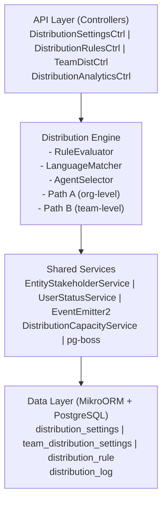

# Distribution Module Specification

<Note>
**Status:** Active — fully implemented  
**Module Path:** `src/modules/crm/distribution/`
</Note>

## Overview

The Distribution Module automates lead assignment within organizations. When a new lead is created, the system evaluates org-defined rules to automatically assign the lead to the most appropriate agent — based on lead attributes, UserStatus online/away state, working-hours eligibility, language compatibility, and capacity.

### Design Principles

<AccordionGroup>
<Accordion title="Core Design Decisions">

| Principle | Decision |
|-----------|----------|
| Async distribution | `createLead()` emits `LEAD_CREATED` after commit; a pg-boss worker handles distribution. Listener / emit failures are logged only — HTTP lead creation still returns success; manual assignment or backfill may be needed if enqueue never ran. Bulk lead import sets `skipEmitLeadCreated` per row and calls `DistributionJobHandler.enqueueBatch()` once after the import loop. |
| Stakeholder system reuse | Distribution creates `EntityStakeholder` records via `EntityStakeholderService`, not a new paradigm |
| First-match-wins rules | Rules are evaluated top-to-bottom by priority; the first matching rule wins |
| Idempotency | Distribution engine checks for existing stakeholders or pending offers before running |
| No retroactive distribution | Existing leads are unaffected when rules are created; only new leads trigger distribution |
| Default routing control | Organizations can disable default routing via `defaultRoutingEnabled` setting; when disabled, only explicit rule matches trigger distribution |
| pg-boss scheduling | Distribution queue uses pg-boss for reliability and retry guarantees |
| RLS compliance | All entities carry `organization_id` for row-level security |

</Accordion>
</AccordionGroup>

### Distribution Paths

The engine supports two execution paths:

<Tabs>
<Tab title="Path A — Org-level distribution">
**Path A** (`runDistribution`): triggered when a lead enters the org with no team context. Evaluates org-scoped rules, applies the org default method, and can bridge to Path B if a rule or default method routes to a team that has `distributionEnabled = true`.
</Tab>

<Tab title="Path B — Team-level distribution">
**Path B** (`runTeamDistribution`): triggered directly when:

- A lead is created with a `teamId` in the event payload (team pool assignment)
- A bulk-imported lead has a team-only assignment; `LeadImportService` batch-enqueues the job with `teamId`
- Path A determines the lead belongs to an auto-distributing team
- Idempotency check finds a single team-only stakeholder with auto-distribute enabled

Path B consults active distribution rules via the rule service when `defaultRoutingEnabled` is disabled, ensuring team-level distribution respects rule-based routing controls.

Path B evaluates team-scoped rules, uses team settings (with org fallback for capacity), and logs the team FK on the resulting `DistributionLog` record.
</Tab>
</Tabs>

## Architecture

### High-Level Diagram



### Component Responsibilities

<CardGroup cols={2}>
<Card title="DistributionEngine" icon="gear">
Orchestrator: receives a lead, evaluates rules, selects agent, creates assignment. Supports Path A (org) and Path B (team).
</Card>

<Card title="RuleEvaluator" icon="list-check">
Evaluates rule conditions against lead data; returns first matching rule
</Card>

<Card title="LanguageMatcher" icon="language">
Filters and ranks agents by language compatibility with the lead's person
</Card>

<Card title="AgentSelector" icon="user-group">
Applies the distribution method (round-robin, weighted, weighted-round-robin, direct) to the filtered agent pool
</Card>

<Card title="DistributionCapacityService" icon="scale-balanced">
Two-phase capacity enforcement: Phase 1 `filterByCapacity()` (lead counts vs limits); Phase 2 `confirmCapacityAndAssign()` (advisory locks + atomic stakeholder creation).
</Card>

<Card title="UserStatusService" icon="clock">
Pre-filters candidate agents to ONLINE status; filters by per-user working hours; provides `isWithinWorkingHours()` for org-level business hours check.
</Card>

<Card title="DistributionListener" icon="bell">
Listens for `LEAD_CREATED` events and enqueues pg-boss jobs. The handler is fault-isolated (try/catch): settings lookup and enqueue errors are logged and do not fail `POST /v1/leads`.
</Card>

<Card title="DistributionJobHandler" icon="briefcase">
pg-boss worker that processes distribution jobs
</Card>
</CardGroup>

## Entity Specifications

### DistributionSettings (1 per org)

<Info>
Org-level configuration for the distribution engine. Auto-created with defaults on first access via `getOrgSettingsRaw()`. Unique constraint on `organization_id`.
</Info>

| Column | Type | Notes |
|--------|------|-------|
| id | uuid PK | |
| organization_id | uuid FK UNIQUE | RLS |
| defaultMethod | enum | `ROUND_ROBIN`, `WEIGHTED`, `WEIGHTED_ROUND_ROBIN`, `DIRECT` |
| defaultRoutingEnabled | boolean | Default: `true`. When false, only explicit rule matches trigger distribution |
| fallbackToFirstAvailable | boolean | Default: `false`. If no agents match criteria, assign to first available agent |
| enableBusinessHours | boolean | Default: `false`. When true, distribution only occurs during business hours |
| businessHourStart | time | Default: `09:00:00` |
| businessHourEnd | time | Default: `17:00:00` |
| businessDays | text[] | Default: `['monday','tuesday','wednesday','thursday','friday']` |
| timezone | varchar | Default: `UTC` |
| maxCapacityPerAgent | integer | Default: `null` (unlimited) |
| distributionDelay | integer | Seconds to delay distribution. Default: `0` |
| created_at | timestamptz | |
| updated_at | timestamptz | |

### TeamDistributionSettings (1 per team, optional)

<Info>
Team-specific overrides for distribution settings. Inherits from org settings when not specified.
</Info>

| Column | Type | Notes |
|--------|------|-------|
| id | uuid PK | |
| organization_id | uuid FK | RLS |
| team_id | uuid FK UNIQUE | |
| distributionEnabled | boolean | Default: `false`. Must be true for the team to participate in auto-distribution |
| defaultMethod | enum | Overrides org setting when specified |
| fallbackToFirstAvailable | boolean | Overrides org setting when specified |
| maxCapacityPerAgent | integer | Overrides org setting when specified |
| created_at | timestamptz | |
| updated_at | timestamptz | |

### DistributionRule

<Note>
Rules define conditions for lead assignment. Evaluated in priority order (lower number = higher priority).
</Note>

| Column | Type | Notes |
|--------|------|-------|
| id | uuid PK | |
| organization_id | uuid FK | RLS |
| name | varchar(255) | Human-readable rule name |
| isActive | boolean | Default: `true` |
| priority | integer | Lower number = higher priority. Unique per org. |
| conditions | jsonb | Rule conditions object |
| target | jsonb | Assignment target (user, team, or method override) |
| created_at | timestamptz | |
| updated_at | timestamptz | |

#### Rule Conditions Schema

<CodeGroup>
```typescript Rule Conditions
interface RuleConditions {
  leadSource?: string[];           // Match lead.leadSource
  leadType?: string[];             // Match lead.leadType  
  leadValue?: {                    // Match lead.leadValue
    min?: number;
    max?: number;
  };
  personLanguage?: string[];       // Match lead.person.language
  personCountry?: string[];        // Match lead.person.country
  personRegion?: string[];         // Match lead.person.region
  personCity?: string[];           // Match lead.person.city
  customFields?: {                 // Match lead.customFields
    [key: string]: string | number | boolean | string[];
  };
}
```
</CodeGroup>

#### Rule Target Schema

<CodeGroup>
```typescript Rule Target
interface RuleTarget {
  type: 'USER' | 'TEAM' | 'METHOD_OVERRIDE';
  
  // For type: 'USER'
  userId?: string;
  
  // For type: 'TEAM'  
  teamId?: string;
  
  // For type: 'METHOD_OVERRIDE'
  method?: 'ROUND_ROBIN' | 'WEIGHTED' | 'WEIGHTED_ROUND_ROBIN' | 'DIRECT';
  teamId?: string; // Optional: apply method to specific team
}
```
</CodeGroup>

### DistributionLog

<Info>
Audit trail for all distribution attempts and outcomes.
</Info>

| Column | Type | Notes |
|--------|------|-------|
| id | uuid PK | |
| organization_id | uuid FK | RLS |
| lead_id | uuid FK | |
| team_id | uuid FK nullable | Set for Path B (team-level) distribution |
| assigned_user_id | uuid FK nullable | Final assigned agent (null if no assignment) |
| matched_rule_id | uuid FK nullable | Rule that matched (null if default routing) |
| distribution_method | enum | Method used: `ROUND_ROBIN`, `WEIGHTED`, etc. |
| status | enum | `SUCCESS`, `NO_ELIGIBLE_AGENTS`, `CAPACITY_EXCEEDED`, `BUSINESS_HOURS_RESTRICTED`, `ALREADY_ASSIGNED`, `ERROR` |
| eligible_agent_count | integer | Number of agents considered |
| execution_time_ms | integer | Processing duration |
| error_message | text nullable | Error details if status = 'ERROR' |
| metadata | jsonb nullable | Additional context (rule conditions, agent selection details, etc.) |
| created_at | timestamptz | |

## Type Definitions

<CodeGroup>
```typescript Distribution Types
enum DistributionMethod {
  ROUND_ROBIN = 'ROUND_ROBIN',
  WEIGHTED = 'WEIGHTED', 
  WEIGHTED_ROUND_ROBIN = 'WEIGHTED_ROUND_ROBIN',
  DIRECT = 'DIRECT'
}

enum DistributionStatus {
  SUCCESS = 'SUCCESS',
  NO_ELIGIBLE_AGENTS = 'NO_ELIGIBLE_AGENTS', 
  CAPACITY_EXCEEDED = 'CAPACITY_EXCEEDED',
  BUSINESS_HOURS_RESTRICTED = 'BUSINESS_HOURS_RESTRICTED',
  ALREADY_ASSIGNED = 'ALREADY_ASSIGNED',
  ERROR = 'ERROR'
}

interface DistributionJobPayload {
  leadId: string;
  organizationId: string;
  teamId?: string; // For Path B (team-level distribution)
  triggeredBy: 'LEAD_CREATED' | 'MANUAL' | 'BULK_IMPORT';
  metadata?: Record<string, any>;
}

interface DistributionResult {
  status: DistributionStatus;
  assignedUserId?: string;
  matchedRuleId?: string;
  distributionMethod: DistributionMethod;
  eligibleAgentCount: number;
  executionTimeMs: number;
  errorMessage?: string;
  metadata?: Record<string, any>;
}
```
</CodeGroup>

## Distribution Engine

### Core Distribution Flow

<Steps>
<Step title="Initialization">
- Validate lead exists and belongs to organization
- Check for existing assignments (idempotency)
- Load distribution settings and team settings (if applicable)
</Step>

<Step title="Business Hours Check">
- If `enableBusinessHours` is true, verify current time is within business hours
- Early exit with `BUSINESS_HOURS_RESTRICTED` if outside hours
</Step>

<Step title="Rule Evaluation">
- Load active rules ordered by priority (ascending)
- Evaluate each rule's conditions against lead data
- First matching rule wins and determines assignment target
</Step>

<Step title="Agent Pool Building">
- Get candidate agents based on target (org users, team members, or specific user)
- Filter by online status via `UserStatusService`
- Filter by working hours (per-user schedule)
- Filter by language compatibility with lead's person
- Filter by capacity limits
</Step>

<Step title="Agent Selection">
- Apply distribution method to filtered pool
- For round-robin: use last assignment tracking
- For weighted: use agent weights and random selection
- For direct: assign to specified user
</Step>

<Step title="Assignment Creation">
- Use `DistributionCapacityService.confirmCapacityAndAssign()`
- Creates `EntityStakeholder` record atomically
- Updates round-robin counters if applicable
</Step>

<Step title="Logging">
- Create `DistributionLog` record with full execution details
- Include performance metrics and metadata
</Step>
</Steps>

### Path A: Org-Level Distribution

<CodeGroup>
```typescript Path A Implementation
async runDistribution(leadId: string): Promise<DistributionResult> {
  const lead = await this.leadService.findOne(leadId);
  const settings = await this.getOrgSettings(lead.organizationId);
  
  // Business hours check
  if (settings.enableBusinessHours) {
    const isWithinHours = this.userStatusService.isWithinWorkingHours(
      settings.businessHourStart,
      settings.businessHourEnd, 
      settings.businessDays,
      settings.timezone
    );
    
    if (!isWithinHours) {
      return this.logAndReturn(lead, 'BUSINESS_HOURS_RESTRICTED');
    }
  }
  
  // Rule evaluation
  const matchedRule = await this.ruleEvaluator.evaluateRules(lead);
  
  let target: AssignmentTarget;
  if (matchedRule) {
    target = matchedRule.target;
  } else if (settings.defaultRoutingEnabled) {
    target = { type: 'METHOD_OVERRIDE', method: settings.defaultMethod };
  } else {
    return this.logAndReturn(lead, 'NO_ELIGIBLE_AGENTS');
  }
  
  // Handle team routing bridge to Path B
  if (target.type === 'TEAM') {
    const teamSettings = await this.getTeamSettings(target.teamId);
    if (teamSettings?.distributionEnabled) {
      return this.runTeamDistribution(leadId, target.teamId);
    }
  }
  
  // Continue with org-level assignment...
}
```
</CodeGroup>

### Path B: Team-Level Distribution

<CodeGroup>
```typescript Path B Implementation
async runTeamDistribution(leadId: string, teamId: string): Promise<DistributionResult> {
  const lead = await this.leadService.findOne(leadId);
  const teamSettings = await this.getTeamSettings(teamId);
  const orgSettings = await this.getOrgSettings(lead.organizationId);
  
  // Merge team and org settings
  const effectiveSettings = {
    ...orgSettings,
    ...teamSettings
  };
  
  // Business hours check (org-level)
  if (orgSettings.enableBusinessHours) {
    const isWithinHours = this.userStatusService.isWithinWorkingHours(
      orgSettings.businessHourStart,
      orgSettings.businessHourEnd,
      orgSettings.businessDays, 
      orgSettings.timezone
    );
    
    if (!isWithinHours) {
      return this.logAndReturn(lead, 'BUSINESS_HOURS_RESTRICTED', teamId);
    }
  }
  
  // Team-scoped rule evaluation
  let matchedRule = null;
  if (!orgSettings.defaultRoutingEnabled) {
    const activeRules = await this.distributionRulesService.getActiveRules(
      lead.organizationId
    );
    if (activeRules.length > 0) {
      matchedRule = await this.ruleEvaluator.evaluateRules(lead, activeRules);
      if (!matchedRule) {
        return this.logAndReturn(lead, 'NO_ELIGIBLE_AGENTS', teamId);
      }
    }
  }
  
  // Get team members as candidate pool
  const teamMembers = await this.teamService.getTeamMembers(teamId);
  
  // Apply filters and selection...
}
```
</CodeGroup>

## pg-boss Job Configuration

<Info>
The distribution system uses pg-boss for reliable async processing with retry logic and dead letter queues.
</Info>

### Job Configuration

<CodeGroup>
```typescript Job Setup
const DISTRIBUTION_JOB_NAME = 'distribution';

const jobOptions = {
  // Retry configuration
  retryLimit: 3,
  retryDelay: 30, // seconds
  retryBackoff: true,
  
  // Timing
  expireInHours: 24,
  
  // Concurrency  
  teamSize: 10,
  teamConcurrency: 5,
  
  // Dead letter queue
  deadLetter: 'distribution-failed'
};

// Register the job handler
boss.work(DISTRIBUTION_JOB_NAME, jobOptions, DistributionJobHandler.process);
```
</CodeGroup>

### Batch Processing

<CodeGroup>
```typescript Batch Enqueueing
async enqueueBatch(jobs: DistributionJobPayload[]): Promise<string[]> {
  const batchSize = 100;
  const jobIds: string[] = [];
  
  for (let i = 0; i < jobs.length; i += batchSize) {
    const batch = jobs.slice(i, i + batchSize);
    
    const batchJobs = batch.map(payload => ({
      name: DISTRIBUTION_JOB_NAME,
      data: payload,
      options: {
        singletonKey: `distribution-${payload.leadId}`, // Prevent duplicates
        priority: payload.triggeredBy === 'MANUAL' ? 10 : 0
      }
    }));
    
    const results = await this.boss.sendBatch(batchJobs);
    jobIds.push(...results.map(r => r.id));
  }
  
  return jobIds;
}
```
</CodeGroup>

## API Endpoints

### Distribution Settings

<Tabs>
<Tab title="GET /v1/organizations/{orgId}/distribution/settings">
**Get organization distribution settings**

```json Response
{
  "id": "uuid",
  "organizationId": "uuid", 
  "defaultMethod": "ROUND_ROBIN",
  "defaultRoutingEnabled": true,
  "fallbackToFirstAvailable": false,
  "enableBusinessHours": false,
  "businessHourStart": "09:00:00",
  "businessHourEnd": "17:00:00", 
  "businessDays": ["monday", "tuesday", "wednesday", "thursday", "friday"],
  "timezone": "UTC",
  "maxCapacityPerAgent": null,
  "distributionDelay": 0,
  "createdAt": "2024-01-01T00:00:00Z",
  "updatedAt": "2024-01-01T00:00:00Z"
}
```
</Tab>

<Tab title="PATCH /v1/organizations/{orgId}/distribution/settings">
**Update organization distribution settings**

```json Request
{
  "defaultMethod": "WEIGHTED",
  "defaultRoutingEnabled": false,
  "enableBusinessHours": true,
  "businessHourStart": "08:00:00",
  "businessHourEnd": "18:00:00",
  "timezone": "America/New_York",
  "maxCapacityPerAgent": 50
}
```
</Tab>
</Tabs>

### Distribution Rules

<Tabs>
<Tab title="POST /v1/organizations/{orgId}/distribution/rules">
**Create distribution rule**

```json Request
{
  "name": "High Value Leads to Senior Team",
  "priority": 1,
  "conditions": {
    "leadValue": { "min": 10000 },
    "leadSource": ["website", "referral"]
  },
  "target": {
    "type": "TEAM", 
    "teamId": "senior-sales-team-uuid"
  }
}
```

```json Response
{
  "id": "rule-uuid",
  "organizationId": "org-uuid",
  "name": "High Value Leads to Senior Team", 
  "isActive": true,
  "priority": 1,
  "conditions": { "leadValue": { "min": 10000 }, "leadSource": ["website", "referral"] },
  "target": { "type": "TEAM", "teamId": "senior-sales-team-uuid" },
  "createdAt": "2024-01-01T00:00:00Z",
  "updatedAt": "2024-01-01T00:00:00Z"
}
```
</Tab>

<Tab title="GET /v1/organizations/{orgId}/distribution/rules">
**List distribution rules**

```json Response
{
  "items": [
    {
      "id": "rule-uuid",
      "name": "High Value Leads to Senior Team",
      "isActive": true, 
      "priority": 1,
      "conditions": { "leadValue": { "min": 10000 } },
      "target": { "type": "TEAM", "teamId": "senior-sales-team-uuid" },
      "createdAt": "2024-01-01T00:00:00Z",
      "updatedAt": "2024-01-01T00:00:00Z"
    }
  ],
  "total": 1,
  "page": 1,
  "pageSize": 20
}
```
</Tab>

<Tab title="PUT /v1/organizations/{orgId}/distribution/rules/reorder">
**Reorder rule priorities**

```json Request
{
  "rules": [
    { "id": "rule-1-uuid", "priority": 1 },
    { "id": "rule-2-uuid", "priority": 2 }, 
    { "id": "rule-3-uuid", "priority": 3 }
  ]
}
```
</Tab>
</Tabs>

### Team Distribution Settings

<Tabs>
<Tab title="GET /v1/teams/{teamId}/distribution/settings">
**Get team distribution settings**

```json Response
{
  "id": "uuid",
  "organizationId": "org-uuid",
  "teamId": "team-uuid", 
  "distributionEnabled": true,
  "defaultMethod": "WEIGHTED_ROUND_ROBIN",
  "fallbackToFirstAvailable": true,
  "maxCapacityPerAgent": 25,
  "createdAt": "2024-01-01T00:00:00Z",
  "updatedAt": "2024-01-01T00:00:00Z"
}
```
</Tab>

<Tab title="PATCH /v1/teams/{teamId}/distribution/settings">
**Update team distribution settings**

```json Request
{
  "distributionEnabled": true,
  "defaultMethod": "ROUND_ROBIN", 
  "maxCapacityPerAgent": 30
}
```
</Tab>
</Tabs>

### Manual Distribution

<Tabs>
<Tab title="POST /v1/leads/{leadId}/distribute">
**Manually trigger distribution**

```json Request
{
  "teamId": "team-uuid" // Optional: force team-level distribution
}
```

```json Response
{
  "success": true,
  "distributionId": "log-uuid",
  "status": "SUCCESS", 
  "assignedUserId": "user-uuid",
  "executionTimeMs": 145
}
```
</Tab>

<Tab title="POST /v1/organizations/{orgId}/distribution/bulk">
**Bulk distribute multiple leads**

```json Request
{
  "leadIds": ["lead-1-uuid", "lead-2-uuid", "lead-3-uuid"],
  "teamId": "team-uuid" // Optional
}
```

```json Response
{
  "success": true,
  "enqueuedCount": 3,
  "jobIds": ["job-1-uuid", "job-2-uuid", "job-3-uuid"]
}
```
</Tab>
</Tabs>

### Distribution Analytics

<Tabs>
<Tab title="GET /v1/organizations/{orgId}/distribution/analytics">
**Get distribution analytics**

```json Query Parameters
{
  "startDate": "2024-01-01",
  "endDate": "2024-01-31", 
  "teamId": "team-uuid", // Optional
  "groupBy": "day|week|month" // Optional, default: day
}
```

```json Response
{
  "summary": {
    "totalDistributions": 1250,
    "successfulDistributions": 1180, 
    "successRate": 0.944,
    "averageExecutionTimeMs": 156,
    "topFailureReason": "NO_ELIGIBLE_AGENTS"
  },
  "timeSeries": [
    {
      "date": "2024-01-01",
      "totalDistributions": 45,
      "successful": 42,
      "failed": 3,
      "averageExecutionTimeMs": 145
    }
  ],
  "statusBreakdown": {
    "SUCCESS": 1180,
    "NO_ELIGIBLE_AGENTS": 45,
    "CAPACITY_EXCEEDED": 15,
    "BUSINESS_HOURS_RESTRICTED": 8,
    "ERROR": 2
  },
  "methodBreakdown": {
    "ROUND_ROBIN": 650,
    "WEIGHTED": 380,
    "WEIGHTED_ROUND_ROBIN": 150, 
    "DIRECT": 70
  }
}
```
</Tab>

<Tab title="GET /v1/organizations/{orgId}/distribution/logs">
**Get distribution logs**

```json Query Parameters
{
  "leadId": "lead-uuid", // Optional
  "teamId": "team-uuid", // Optional
  "status": "SUCCESS|NO_ELIGIBLE_AGENTS|...", // Optional
  "startDate": "2024-01-01", // Optional
  "endDate": "2024-01-31", // Optional
  "page": 1,
  "pageSize": 50
}
```

```json Response
{
  "items": [
    {
      "id": "log-uuid",
      "leadId": "lead-uuid",
      "teamId": "team-uuid",
      "assignedUserId": "user-uuid", 
      "matchedRuleId": "rule-uuid",
      "distributionMethod": "ROUND_ROBIN",
      "status": "SUCCESS",
      "eligibleAgentCount": 5,
      "executionTimeMs": 145,
      "errorMessage": null,
      "metadata": { "ruleMatched": true, "businessHoursCheck": true },
      "createdAt": "2024-01-01T10:30:00Z"
    }
  ],
  "total": 1250,
  "page": 1, 
  "pageSize": 50
}
```
</Tab>
</Tabs>

## Security & Permissions

### Row Level Security (RLS)

<Info>
All distribution entities implement RLS policies to ensure org-level data isolation.
</Info>

<CodeGroup>
```sql RLS Policies
-- Distribution Settings
CREATE POLICY "distribution_settings_org_isolation" 
ON distribution_settings 
FOR ALL 
TO authenticated 
USING (organization_id = get_current_organization_id());

-- Team Distribution Settings  
CREATE POLICY "team_distribution_settings_org_isolation"
ON team_distribution_settings
FOR ALL
TO authenticated  
USING (organization_id = get_current_organization_id());

-- Distribution Rules
CREATE POLICY "distribution_rules_org_isolation"
ON distribution_rules
FOR ALL
TO authenticated
USING (organization_id = get_current_organization_id());

-- Distribution Logs
CREATE POLICY "distribution_logs_org_isolation" 
ON distribution_logs
FOR ALL
TO authenticated
USING (organization_id = get_current_organization_id());
```
</CodeGroup>

### Permission Requirements

<AccordionGroup>
<Accordion title="Distribution Settings Management">
- **Read settings**: `CRM_READ` or `ADMIN`
- **Update settings**: `CRM_ADMIN` or `ADMIN`
- **View analytics**: `CRM_READ` or `ADMIN`
</Accordion>

<Accordion title="Distribution Rules Management">  
- **Read rules**: `CRM_READ` or `ADMIN`
- **Create/Update/Delete rules**: `CRM_ADMIN` or `ADMIN`
- **Reorder priorities**: `CRM_ADMIN` or `ADMIN`
</Accordion>

<Accordion title="Team Settings Management">
- **Read team settings**: `CRM_READ` or `TEAM_MEMBER` (for own team) or `ADMIN`
- **Update team settings**: `CRM_ADMIN` or `TEAM_MANAGER` (for own team) or `ADMIN`
</Accordion>

<Accordion title="Manual Distribution">
- **Trigger distribution**: `CRM_WRITE` or `ADMIN`  
- **Bulk distribution**: `CRM_ADMIN` or `ADMIN`
- **View logs**: `CRM_READ` or `ADMIN`
</Accordion>
</AccordionGroup>

## Observability & Audit

### Logging Strategy

<Warning>
Distribution operations are fully logged for audit and debugging purposes.
</Warning>

<CodeGroup>
```typescript Logging Examples
// Successful distribution
logger.info('Distribution completed successfully', {
  leadId,
  organizationId, 
  assignedUserId,
  distributionMethod,
  executionTimeMs,
  ruleMatched: !!matchedRule,
  eligibleAgentCount
});

// Failed distribution
logger.warn('Distribution failed - no eligible agents', {
  leadId,
  organizationId,
  teamId,
  eligibleAgentCount: 0,
  filters: {
    onlineAgents: onlineCount,
    languageFiltered: languageFilteredCount, 
    capacityFiltered: capacityFilteredCount
  }
});

// Business hours restriction
logger.info('Distribution skipped - outside business hours', {
  leadId,
  organizationId,
  currentTime: new Date().toISOString(),
  businessHours: {
    start: settings.businessHourStart,
    end: settings.businessHourEnd,
    days: settings.businessDays,
    timezone: settings.timezone
  }
});

// Rule evaluation
logger.debug('Rule evaluation completed', {
  leadId,
  organizationId,
  rulesEvaluated: rules.length,
  matchedRuleId: matchedRule?.id,
  matchedRuleName: matchedRule?.name,
  evaluationTimeMs
});
```
</CodeGroup>

### Metrics & Monitoring

<Tabs>
<Tab title="Application Metrics">
```typescript
// Distribution performance metrics
histogram('distribution_execution_time_ms', executionTimeMs, {
  organization_id: organizationId,
  distribution_method: method,
  status: result.status
});

// Success rate tracking
counter('distribution_attempts_total', 1, {
  organization_id: organizationId, 
  status: result.status,
  team_id: teamId
});

// Agent selection metrics
histogram('agent_pool_size', eligibleAgentCount, {
  organization_id: organizationId,
  distribution_method: method
});

// Rule evaluation metrics
counter('distribution_rules_evaluated', rulesEvaluated, {
  organization_id: organizationId
});

counter('distribution_rules_matched', matchedRule ? 1 : 0, {
  organization_id: organizationId,
  rule_id: matchedRule?.id
});
```
</Tab>

<Tab title="Database Metrics">
```sql
-- Query performance monitoring
SELECT 
  schemaname,
  tablename, 
  attname,
  n_distinct,
  correlation
FROM pg_stats 
WHERE tablename IN ('distribution_logs', 'distribution_rules');

-- Index usage analysis
SELECT
  schemaname,
  tablename,
  indexname,
  idx_scan,
  idx_tup_read, 
  idx_tup_fetch
FROM pg_stat_user_indexes
WHERE tablename LIKE 'distribution_%';
```
</Tab>

<Tab title="Job Queue Metrics">
```typescript
// pg-boss job metrics
counter('distribution_jobs_enqueued', 1, {
  organization_id: organizationId,
  triggered_by: payload.triggeredBy
});

counter('distribution_jobs_completed', 1, {
  organization_id: organizationId,
  status: 'success'
});

counter('distribution_jobs_failed', 1, {
  organization_id: organizationId,
  attempt: job.attempt,
  error: job.error?.name
});

histogram('distribution_job_duration_ms', processingTime, {
  organization_id: organizationId
});
```
</Tab>
</Tabs>

## Analytics & Metrics

### Distribution Analytics Service

<CodeGroup>
```typescript Analytics Interface
interface DistributionAnalytics {
  // Time-based analytics
  getDistributionTimeSeries(params: {
    organizationId: string;
    startDate: Date;
    endDate: Date;
    teamId?: string;
    groupBy: 'hour' | 'day' | 'week' | 'month';
  }): Promise<TimeSeriesPoint[]>;
  
  // Performance analytics
  getPerformanceMetrics(params: {
    organizationId: string; 
    startDate: Date;
    endDate: Date;
    teamId?: string;
  }): Promise<PerformanceMetrics>;
  
  // Agent analytics
  getAgentPerformance(params: {
    organizationId: string;
    startDate: Date;
    endDate: Date; 
    teamId?: string;
    agentId?: string;
  }): Promise<AgentPerformance[]>;
  
  // Rule analytics
  getRulePerformance(params: {
    organizationId: string;
    startDate: Date;
    endDate: Date;
  }): Promise<RulePerformance[]>;
}

interface TimeSeriesPoint {
  date: string;
  totalDistributions: number;
  successful: number;
  failed: number;
  averageExecutionTimeMs: number;
}

interface PerformanceMetrics {
  totalDistributions: number;
  successfulDistributions: number;
  successRate: number;
  averageExecutionTimeMs: number;
  medianExecutionTimeMs: number;
  p95ExecutionTimeMs: number;
  statusBreakdown: Record<DistributionStatus, number>;
  methodBreakdown: Record<DistributionMethod, number>;
  topFailureReason: DistributionStatus;
}
```
</CodeGroup>

### Key Performance Indicators

<CardGroup cols={2}>
<Card title="Distribution Success Rate" icon="chart-line">
Percentage of distributions that result in successful assignment
**Target**: >95%
</Card>

<Card title="Average Execution Time" icon="clock">
Mean time to complete distribution process
**Target**: <200ms
</Card>

<Card title="Agent Utilization" icon="users">
Distribution of leads across available agents
**Target**: Even distribution within ±10%
</Card>

<Card title="Rule Effectiveness" icon="bullseye">
Percentage of distributions matched by rules vs default routing
**Target**: >80% rule-matched
</Card>
</CardGroup>

## Edge Case Handling

### Common Edge Cases

<AccordionGroup>
<Accordion title="No Eligible Agents">
**Scenario**: All agents are offline, at capacity, or don't match criteria

**Handling**:
1. Check `fallbackToFirstAvailable` setting
2. If enabled, assign to first available agent ignoring some criteria
3. If disabled, log failure and leave unassigned
4. Emit event for manual intervention alert

```typescript
if (eligibleAgents.length === 0) {
  if (settings.fallbackToFirstAvailable) {
    const fallbackAgents = await this.getFallbackAgents(organizationId, teamId);
    if (fallbackAgents.length > 0) {
      return this.assignToAgent(fallbackAgents[0], lead, 'FALLBACK');
    }
  }
  
  return this.logAndReturn(lead, 'NO_ELIGIBLE_AGENTS');
}
```
</Accordion>

<Accordion title="Capacity Race Conditions">
**Scenario**: Multiple distributions try to assign leads to the same agent simultaneously

**Handling**:
1. Use advisory locks in `confirmCapacityAndAssign()`
2. Re-check capacity within transaction
3. Retry with next available agent if capacity exceeded
4. Atomic stakeholder creation prevents double-assignment

```typescript
async confirmCapacityAndAssign(agentId: string, leadId: string): Promise<boolean> {
  return await this.em.transactional(async (em) => {
    // Advisory lock on agent
    await em.execute('SELECT pg_advisory_xact_lock(?)', [agentId]);
    
    // Re-check capacity
    const currentCount = await this.getCurrentLeadCount(agentId);
    const limit = await this.getCapacityLimit(agentId);
    
    if (limit && currentCount >= limit) {
      return false; // Capacity exceeded
    }
    
    // Create assignment atomically
    await this.entityStakeholderService.create({
      entityType: 'LEAD',
      entityId: leadId, 
      stakeholderType: 'USER',
      stakeholderId: agentId,
      role: 'ASSIGNEE'
    });
    
    return true;
  });
}
```
</Accordion>

<Accordion title="Duplicate Distribution Jobs">
**Scenario**: Same lead gets multiple distribution jobs enqueued

**Handling**:
1. Use pg-boss singleton keys to prevent duplicate jobs
2. Idempotency check at job start
3. Early exit if lead already assigned

```typescript
const jobOptions = {
  singletonKey: `distribution-${leadId}`,
  singletonSeconds: 300 // Prevent duplicates for 5 minutes
};
```
</Accordion>

<Accordion title="Business Hours Edge Cases">
**Scenario**: Lead created right at business hour boundary

**Handling**:
1. Use consistent timezone calculations
2. Add small buffer for processing delays
3. Log timezone info for debugging

```typescript
isWithinWorkingHours(start: string, end: string, days: string[], timezone: string): boolean {
  const now = DateTime.now().setZone(timezone);
  const dayName = now.weekdayLong.toLowerCase();
  
  if (!days.includes(dayName)) {
    return false;
  }
  
  const startTime = DateTime.fromISO(`${now.toISODate()}T${start}`, { zone: timezone });
  const endTime = DateTime.fromISO(`${now.toISODate()}T${end}`, { zone: timezone });
  
  return now >= startTime && now <= endTime;
}
```
</Accordion>

<Accordion title="Language Matching Edge Cases">
**Scenario**: Lead person has multiple languages or unsupported language

**Handling**:
1. Support multiple languages per person (array)
2. Implement language matching priority
3. Fallback to agents with no language restriction

```typescript
async filterByLanguageCompatibility(agents: User[], person: Person): Promise<User[]> {
  if (!person.languages || person.languages.length === 0) {
    return agents; // No language requirement
  }
  
  // Find agents with matching languages
  const matchingAgents = agents.filter(agent => 
    agent.languages?.some(lang => person.languages.includes(lang))
  );
  
  if (matchingAgents.length > 0) {
    return matchingAgents;
  }
  
  // Fallback to agents with no language restrictions
  return agents.filter(agent => !agent.languages || agent.languages.length === 0);
}
```
</Accordion>
</AccordionGroup>

## Performance & Scaling

### Database Optimization

<CodeGroup>
```sql Key Indexes
-- Distribution logs performance
CREATE INDEX idx_distribution_logs_org_created 
ON distribution_logs (organization_id, created_at DESC);

CREATE INDEX idx_distribution_logs_lead_id 
ON distribution_logs (lead_id);

CREATE INDEX idx_distribution_logs_team_created
ON distribution_logs (team_id, created_at DESC) 
WHERE team_id IS NOT NULL;

-- Distribution rules priority
CREATE UNIQUE INDEX idx_distribution_rules_org_priority
ON distribution_rules (organization_id, priority)
WHERE is_active = true;

-- Settings lookups
CREATE UNIQUE INDEX idx_distribution_settings_org
ON distribution_settings (organization_id);

CREATE UNIQUE INDEX idx_team_distribution_settings_team  
ON team_distribution_settings (team_id);
```
</CodeGroup>

### Caching Strategy

<Info>
Distribution settings and rules are cached to improve performance and reduce database load.
</Info>

<CodeGroup>
```typescript Cache Implementation
@Injectable()
export class DistributionSettingsCache {
  private readonly cache = new Map<string, DistributionSettings>();
  private readonly ttl = 5 * 60 * 1000; // 5 minutes
  
  async getOrgSettings(organizationId: string): Promise<DistributionSettings> {
    const cacheKey = `org:${organizationId}`;
    const cached = this.cache.get(cacheKey);
    
    if (cached && !this.isExpired(cached)) {
      return cached;
    }
    
    const settings = await this.distributionSettingsService.getOrgSettingsRaw(organizationId);
    this.cache.set(cacheKey, { ...settings, _cachedAt: Date.now() });
    
    return settings;
  }
  
  async getTeamSettings(teamId: string): Promise<TeamDistributionSettings | null> {
    const cacheKey = `team:${teamId}`;
    const cached = this.cache.get(cacheKey);
    
    if (cached && !this.isExpired(cached)) {
      return cached;
    }
    
    const settings = await this.teamDistributionSettingsService.getByTeamId(teamId);
    if (settings) {
      this.cache.set(cacheKey, { ...settings, _cachedAt: Date.now() });
    }
    
    return settings;
  }
  
  invalidateOrg(organizationId: string): void {
    this.cache.delete(`org:${organizationId}`);
  }
  
  invalidateTeam(teamId: string): void {
    this.cache.delete(`team:${teamId}`);
  }
  
  private isExpired(cached: any): boolean {
    return Date.now() - cached._cachedAt > this.ttl;
  }
}
```
</CodeGroup>

### Scaling Considerations

<Tabs>
<Tab title="Job Queue Scaling">
```typescript
// Horizontal scaling with multiple worker instances
const distributionWorkerConfig = {
  // Each instance processes multiple jobs concurrently
  teamSize: 20,
  teamConcurrency: 10,
  
  // Batch processing for bulk operations
  batchSize: 50,
  
  // Resource isolation
  includeMetadata: false, // Reduce memory usage
  deleteAfterHours: 24,   // Clean up completed jobs
  
  // Load balancing
  newJobCheckIntervalSeconds: 1,
  maintenanceIntervalSeconds: 30
};
```
</Tab>

<Tab title="Database Connections">
```typescript
// Connection pooling for distribution operations
const distributionDbConfig = {
  // Dedicated connection pool for distribution
  poolName: 'distribution',
  min: 5,
  max: 20,
  
  // Query optimization
  statement_timeout: '30s',
  idle_in_transaction_session_timeout: '60s',
  
  // Read replicas for analytics
  readOnlyReplica: process.env.DATABASE_REPLICA_URL
};
```
</Tab>

<Tab title="Memory Optimization">
```typescript
// Efficient rule evaluation
class RuleEvaluator {
  // Cache compiled rule conditions
  private conditionCache = new WeakMap<DistributionRule, CompiledCondition>();
  
  // Stream large rule sets instead of loading all at once
  async evaluateRulesStream(lead: Lead): Promise<DistributionRule | null> {
    const ruleStream = this.distributionRulesService.getActiveRulesStream(
      lead.organizationId
    );
    
    for await (const rule of ruleStream) {
      if (await this.evaluateRule(rule, lead)) {
        return rule;
      }
    }
    
    return null;
  }
}
```
</Tab>
</Tabs>

### Performance Targets

<CardGroup cols={2}>
<Card title="Distribution Latency" icon="bolt">
**P95**: <300ms  
**P99**: <500ms  
**Mean**: <150ms
</Card>

<Card title="Throughput" icon="gauge-high">
**Single Worker**: 1000 distributions/min  
**Cluster**: 10,000 distributions/min
</Card>

<Card title="Job Queue Lag" icon="clock">
**Normal Load**: <10s  
**Peak Load**: <60s  
**Bulk Import**: <5min
</Card>

<Card title="Database Performance" icon="database">
**Settings Lookup**: <5ms  
**Rule Evaluation**: <20ms  
**Log Insert**: <10ms
</Card>
</CardGroup>

## Module Structure

<CodeGroup>
```
src/modules/crm/distribution/
├── controllers/
│   ├── DistributionSettingsController.ts
│   ├── DistributionRulesController.ts  
│   ├── TeamDistributionSettingsController.ts
│   ├── DistributionAnalyticsController.ts
│   └── ManualDistributionController.ts
├── services/
│   ├── DistributionEngine.ts
│   ├── DistributionSettingsService.ts
│   ├── TeamDistributionSettingsService.ts
│   ├── DistributionRulesService.ts
│   ├── DistributionCapacityService.ts
│   ├── DistributionAnalyticsService.ts
│   ├── RuleEvaluator.ts
│   ├── LanguageMatcher.ts
│   └── AgentSelector.ts
├── entities/
│   ├── DistributionSettings.ts
│   ├── TeamDistributionSettings.ts
│   ├── DistributionRule.ts
│   └── DistributionLog.ts
├── jobs/
│   ├── DistributionJobHandler.ts
│   └── DistributionListener.ts
├── dto/
│   ├── CreateDistributionRuleDto.ts
│   ├── UpdateDistributionSettingsDto.ts
│   ├── DistributionAnalyticsDto.ts
│   └── DistributionResponseDto.ts
├── types/
│   ├── DistributionTypes.ts
│   ├── RuleTypes.ts
│   └── AnalyticsTypes.ts
├── utils/
│   ├── DistributionHelpers.ts
│   └── RuleValidators.ts
└── distribution.module.ts
```
</CodeGroup>

## Integration Points

### Event System Integration

<CodeGroup>
```typescript Event Listeners
@Injectable()
export class DistributionListener {
  constructor(
    private readonly eventEmitter: EventEmitter2,
    private readonly distributionJobHandler: DistributionJobHandler
  ) {
    this.setupEventListeners();
  }
  
  private setupEventListeners(): void {
    // Primary distribution trigger
    this.eventEmitter.on('LEAD_CREATED', this.handleLeadCreated.bind(this));
    
    // Settings changes
    this.eventEmitter.on('DISTRIBUTION_SETTINGS_UPDATED', this.handleSettingsUpdated.bind(this));
    this.eventEmitter.on('DISTRIBUTION_RULE_CREATED', this.handleRuleCreated.bind(this));
    this.eventEmitter.on('DISTRIBUTION_RULE_UPDATED', this.handleRuleUpdated.bind(this));
    
    // Team changes
    this.eventEmitter.on('TEAM_MEMBER_ADDED', this.handleTeamMemberAdded.bind(this));
    this.eventEmitter.on('TEAM_MEMBER_REMOVED', this.handleTeamMemberRemoved.bind(this));
    
    // User status changes
    this.eventEmitter.on('USER_STATUS_CHANGED', this.handleUserStatusChanged.bind(this));
  }
  
  private async handleLeadCreated(event: LeadCreatedEvent): Promise<void> {
    try {
      if (event.skipDistribution) {
        return; // Bulk import or manual override
      }
      
      await this.distributionJobHandler.enqueue({
        leadId: event.leadId,
        organizationId: event.organizationId,
        teamId: event.teamId,
        triggeredBy: 'LEAD_CREATED',
        metadata: { 
          leadSource: event.leadSource,
          createdAt: event.createdAt
        }
      });
      
    } catch (error) {
      this.logger.error('Failed to enqueue distribution job', {
        leadId: event.leadId,
        error: error.message
      });
    }
  }
}
```
</CodeGroup>

### CRM Module Integration

<Info>
Distribution integrates with core CRM entities and services.
</Info>

<Tabs>
<Tab title="Lead Service Integration">
```typescript
// Lead creation with distribution
export class LeadService {
  async createLead(data: CreateLeadDto): Promise<Lead> {
    const lead = await this.leadRepository.create(data);
    
    // Emit event for distribution (unless skipped)
    if (!data.skipDistribution) {
      this.eventEmitter.emit('LEAD_CREATED', {
        leadId: lead.id,
        organizationId: lead.organizationId,
        teamId: data.teamId,
        leadSource: lead.leadSource,
        createdAt: lead.createdAt,
        skipDistribution: false
      });
    }
    
    return lead;
  }
}
```
</Tab>

<Tab title="EntityStakeholder Integration">
```typescript  
// Stakeholder creation for assignments
export class DistributionEngine {
  private async createAssignment(
    leadId: string,
    agentId: string, 
    method: DistributionMethod
  ): Promise<void> {
    await this.entityStakeholderService.create({
      entityType: 'LEAD',
      entityId: leadId,
      stakeholderType: 'USER', 
      stakeholderId: agentId,
      role: 'ASSIGNEE',
      metadata: {
        distributionMethod: method,
        assignedAt: new Date().toISOString(),
        assignedBy: 'DISTRIBUTION_ENGINE'
      }
    });
  }
}
```
</Tab>

<Tab title="Team Service Integration">
```typescript
// Team member filtering
export class AgentSelector {
  private async getTeamAgents(teamId: string): Promise<User[]> {
    const teamMembers = await this.teamService.getTeamMembers(teamId);
    
    return teamMembers
      .filter(member => member.isActive)
      .filter(member => member.permissions.includes('CRM_READ'))
      .map(member => member.user);
  }
}
```
</Tab>
</Tabs>

### User Status Integration  

<CodeGroup>
```typescript User Status Filtering
export class UserStatusService {
  async filterByOnlineStatus(agentIds: string[]): Promise<string[]> {
    const onlineStatuses = await this.userStatusRepository.find({
      where: { 
        userId: { $in: agentIds },
        status: 'ONLINE'
      }
    });
    
    return onlineStatuses.map(status => status.userId);
  }
  
  async filterByWorkingHours(agentIds: string[]): Promise<string[]> {
    const now = new Date();
    const eligibleAgents: string[] = [];
    
    for (const agentId of agentIds) {
      const workingHours = await this.getAgentWorkingHours(agentId);
      if (this.isWithinWorkingHours(workingHours, now)) {
        eligibleAgents.push(agentId);
      }
    }
    
    return eligibleAgents;
  }
}
```
</CodeGroup>

## Environment Configuration

<CodeGroup>
```env Environment Variables
# Distribution Job Queue
DISTRIBUTION_QUEUE_CONCURRENCY=10
DISTRIBUTION_QUEUE_RETRY_LIMIT=3
DISTRIBUTION_QUEUE_RETRY_DELAY=30

# Performance Settings  
DISTRIBUTION_CACHE_TTL=300
DISTRIBUTION_BATCH_SIZE=100
DISTRIBUTION_MAX_EXECUTION_TIME=5000

# Feature Flags
DISTRIBUTION_ENABLE_CACHING=true
DISTRIBUTION_ENABLE_ANALYTICS=true  
DISTRIBUTION_ENABLE_BUSINESS_HOURS=true

# Monitoring
DISTRIBUTION_LOG_LEVEL=info
DISTRIBUTION_METRICS_ENABLED=true
DISTRIBUTION_TRACE_SAMPLING=0.1

# Database
DISTRIBUTION_DB_POOL_SIZE=20
DISTRIBUTION_DB_TIMEOUT=30000
```
</CodeGroup>

<Warning>
Ensure all environment variables are properly configured in production environments. Missing configuration may result in degraded performance or feature limitations.
</Warning>