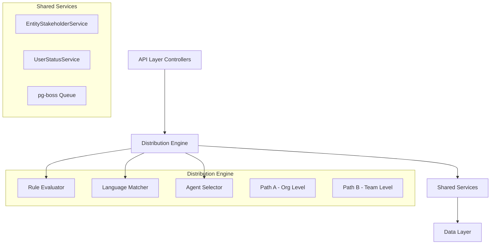

## Overview

The Distribution Module automates lead assignment within organizations. When a new lead is created, the system evaluates org-defined rules to automatically assign the lead to the most appropriate agent — based on lead attributes, UserStatus online/away state, working-hours eligibility, language compatibility, and capacity.

<Info>
This module is fully implemented and actively deployed at path `src/modules/crm/distribution/`
</Info>

### Design Principles

| Principle | Decision |
|-----------|----------|
| **Async distribution** | `createLead()` emits `LEAD_CREATED` after commit; a pg-boss worker handles distribution. Listener / emit failures are logged only — HTTP lead creation still returns success |
| **Stakeholder system reuse** | Distribution creates `EntityStakeholder` records via `EntityStakeholderService`, not a new paradigm |
| **First-match-wins rules** | Rules are evaluated top-to-bottom by priority; the first matching rule wins |
| **Idempotency** | Distribution engine checks for existing stakeholders or pending offers before running |
| **No retroactive distribution** | Existing leads are unaffected when rules are created; only new leads trigger distribution |
| **pg-boss scheduling** | Distribution queue uses pg-boss for reliability and retry guarantees |
| **RLS compliance** | All entities carry `organization_id` for row-level security |

### Distribution Paths

<Tabs>
  <Tab title="Path A - Org-level">
    **Org-level distribution** (`runDistribution`): triggered when a lead enters the org with no team context. Evaluates org-scoped rules, applies the org default method, and can bridge to Path B if a rule or default method routes to a team that has `distributionEnabled = true`.
  </Tab>
  <Tab title="Path B - Team-level">
    **Team-level distribution** (`runTeamDistribution`): triggered directly when:
    - A lead is created with a `teamId` in the event payload (team pool assignment)
    - A bulk-imported lead has a team-only assignment
    - Path A determines the lead belongs to an auto-distributing team
    - Idempotency check finds a single team-only stakeholder with auto-distribute enabled
  </Tab>
</Tabs>

## Architecture

### High-Level System Diagram



### Component Responsibilities

<AccordionGroup>
  <Accordion title="DistributionEngine">
    Orchestrator: receives a lead, evaluates rules, selects agent, creates assignment. Supports Path A (org) and Path B (team).
  </Accordion>
  
  <Accordion title="RuleEvaluator">
    Evaluates rule conditions against lead data; returns first matching rule
  </Accordion>
  
  <Accordion title="LanguageMatcher">
    Filters and ranks agents by language compatibility with the lead's person
  </Accordion>
  
  <Accordion title="AgentSelector">
    Applies the distribution method (round-robin, weighted, weighted-round-robin, direct) to the filtered agent pool
  </Accordion>
  
  <Accordion title="DistributionCapacityService">
    Two-phase capacity enforcement: Phase 1 `filterByCapacity()` (lead counts vs limits); Phase 2 `confirmCapacityAndAssign()` (advisory locks + atomic stakeholder creation)
  </Accordion>
</AccordionGroup>

## Entity Specifications

### DistributionSettings (1 per org)

Org-level configuration for the distribution engine. Auto-created with defaults on first access via `getOrgSettingsRaw()`.

<CodeGroup>

```sql SQL Schema
CREATE TABLE distribution_settings (
  id uuid PRIMARY KEY DEFAULT gen_random_uuid(),
  organization_id uuid UNIQUE NOT NULL REFERENCES organizations(id),
  distribution_enabled boolean DEFAULT false,
  max_active_leads_per_agent integer DEFAULT 50,
  max_new_leads_per_day integer DEFAULT 20,
  default_distribution_method distribution_method_enum DEFAULT 'ROUND_ROBIN',
  business_hours_enabled boolean DEFAULT false,
  start_time time DEFAULT '09:00:00',
  end_time time DEFAULT '17:00:00',
  timezone varchar(50) DEFAULT 'UTC',
  working_days integer[] DEFAULT '{1,2,3,4,5}',
  language_matching_enabled boolean DEFAULT false,
  require_language_match boolean DEFAULT false,
  created_at timestamptz DEFAULT now(),
  updated_at timestamptz DEFAULT now()
);
```

```typescript TypeScript Entity
@Entity({ tableName: 'distribution_settings' })
export class DistributionSettings extends BaseEntity {
  @Property()
  organizationId!: string;

  @Property({ default: false })
  distributionEnabled: boolean = false;

  @Property({ default: 50 })
  maxActiveLeadsPerAgent: number = 50;

  @Property({ default: 20 })
  maxNewLeadsPerDay: number = 20;

  @Enum(() => DistributionMethod)
  defaultDistributionMethod: DistributionMethod = DistributionMethod.ROUND_ROBIN;

  @Property({ default: false })
  businessHoursEnabled: boolean = false;

  @Property({ type: 'time', default: '09:00:00' })
  startTime: string = '09:00:00';

  @Property({ type: 'time', default: '17:00:00' })
  endTime: string = '17:00:00';

  @Property({ default: 'UTC' })
  timezone: string = 'UTC';

  @Property({ type: 'array', default: [1, 2, 3, 4, 5] })
  workingDays: number[] = [1, 2, 3, 4, 5];

  @Property({ default: false })
  languageMatchingEnabled: boolean = false;

  @Property({ default: false })
  requireLanguageMatch: boolean = false;
}
```

</CodeGroup>

### TeamDistributionSettings (1 per team)

Team-specific overrides for distribution behavior. Optional - falls back to org settings when not present.

| Column | Type | Notes |
|--------|------|-------|
| id | uuid PK | |
| organization_id | uuid FK | RLS |
| team_id | uuid FK UNIQUE | References teams table |
| distribution_enabled | bool | default `true`. Team-level override |
| max_active_leads_per_agent | int | default `null` (use org setting) |
| max_new_leads_per_day | int | default `null` (use org setting) |
| default_distribution_method | enum | default `null` (use org setting) |

### DistributionRule

Rules define conditions for automatic lead assignment. Evaluated in priority order (lower number = higher priority).

<CodeGroup>

```sql SQL Schema
CREATE TABLE distribution_rule (
  id uuid PRIMARY KEY DEFAULT gen_random_uuid(),
  organization_id uuid NOT NULL REFERENCES organizations(id),
  team_id uuid REFERENCES teams(id),
  name varchar(255) NOT NULL,
  priority integer NOT NULL,
  is_active boolean DEFAULT true,
  conditions jsonb NOT NULL,
  distribution_method distribution_method_enum NOT NULL,
  target_agents uuid[],
  target_team_id uuid REFERENCES teams(id),
  created_at timestamptz DEFAULT now(),
  updated_at timestamptz DEFAULT now()
);
```

```typescript TypeScript Types
interface RuleConditions {
  leadSource?: string[];
  leadType?: string[];
  leadValue?: {
    min?: number;
    max?: number;
  };
  personLocation?: {
    countries?: string[];
    states?: string[];
    cities?: string[];
  };
  personLanguages?: string[];
  customFields?: Record<string, any>;
}

enum DistributionMethod {
  ROUND_ROBIN = 'ROUND_ROBIN',
  WEIGHTED = 'WEIGHTED',
  WEIGHTED_ROUND_ROBIN = 'WEIGHTED_ROUND_ROBIN',
  DIRECT_ASSIGNMENT = 'DIRECT_ASSIGNMENT'
}
```

</CodeGroup>

### DistributionLog

Audit trail for all distribution attempts and outcomes.

| Column | Type | Notes |
|--------|------|-------|
| id | uuid PK | |
| organization_id | uuid FK | RLS |
| lead_id | uuid FK | |
| team_id | uuid FK | `null` for org-level distribution |
| rule_id | uuid FK | `null` if no rule matched |
| distribution_method | enum | Method used for assignment |
| outcome | enum | SUCCESS, NO_AGENTS_AVAILABLE, CAPACITY_EXCEEDED, etc. |
| assigned_agent_id | uuid FK | `null` if assignment failed |
| execution_time_ms | int | Performance tracking |
| error_message | text | `null` on success |

## Distribution Engine

### Core Flow

<Steps>
  <Step title="Event Reception">
    `DistributionListener` receives `LEAD_CREATED` event and enqueues pg-boss job
  </Step>
  
  <Step title="Settings Validation">
    Check if distribution is enabled for the organization/team
  </Step>
  
  <Step title="Idempotency Check">
    Verify lead hasn't already been distributed
  </Step>
  
  <Step title="Rule Evaluation">
    Evaluate distribution rules in priority order to find first match
  </Step>
  
  <Step title="Agent Selection">
    Apply distribution method to filter and select target agent
  </Step>
  
  <Step title="Capacity Verification">
    Confirm selected agent has capacity using advisory locks
  </Step>
  
  <Step title="Assignment Creation">
    Create `EntityStakeholder` record and log the distribution
  </Step>
</Steps>

### Rule Evaluation Logic

```typescript
interface RuleEvaluationContext {
  lead: Lead;
  person: Person;
  organization: Organization;
  team?: Team;
}

class RuleEvaluator {
  async evaluateRules(
    rules: DistributionRule[], 
    context: RuleEvaluationContext
  ): Promise<DistributionRule | null> {
    // Sort by priority (ascending)
    const sortedRules = rules.sort((a, b) => a.priority - b.priority);
    
    for (const rule of sortedRules) {
      if (!rule.isActive) continue;
      
      const matches = await this.evaluateConditions(rule.conditions, context);
      if (matches) {
        return rule;
      }
    }
    
    return null; // No matching rule found
  }
}
```

<Warning>
Rules are evaluated in priority order (lower number = higher priority). The first matching rule wins - subsequent rules are not evaluated.
</Warning>

### Agent Selection Methods

<Tabs>
  <Tab title="Round Robin">
    Distributes leads evenly across available agents in rotation order.
    
    ```typescript
    // Tracks last assigned agent per team/org
    // Selects next agent in alphabetical order
    const nextAgent = agents[(lastAssignedIndex + 1) % agents.length];
    ```
  </Tab>
  
  <Tab title="Weighted">
    Assigns leads based on agent weight ratios until quotas are met, then falls back to round-robin.
    
    ```typescript
    // Higher weight = more leads assigned
    // Weight of 2 means 2x more leads than weight of 1
    const weightedPool = agents.flatMap(agent => 
      Array(agent.weight).fill(agent)
    );
    ```
  </Tab>
  
  <Tab title="Weighted Round Robin">
    Combines weighted distribution with round-robin cycling for balanced allocation.
  </Tab>
  
  <Tab title="Direct Assignment">
    Assigns leads directly to specified agents from rule configuration.
  </Tab>
</Tabs>

## API Endpoints

### Distribution Settings

<CodeGroup>

```http GET /v1/organizations/{orgId}/distribution/settings
GET /v1/organizations/{orgId}/distribution/settings
Authorization: Bearer <token>

Response:
{
  "id": "uuid",
  "distributionEnabled": true,
  "maxActiveLeadsPerAgent": 50,
  "maxNewLeadsPerDay": 20,
  "defaultDistributionMethod": "ROUND_ROBIN",
  "businessHoursEnabled": false,
  "languageMatchingEnabled": true
}
```

```http PUT /v1/organizations/{orgId}/distribution/settings
PUT /v1/organizations/{orgId}/distribution/settings
Authorization: Bearer <token>
Content-Type: application/json

{
  "distributionEnabled": true,
  "maxActiveLeadsPerAgent": 75,
  "businessHoursEnabled": true,
  "startTime": "08:00:00",
  "endTime": "18:00:00",
  "timezone": "America/New_York"
}
```

</CodeGroup>

### Distribution Rules

<CodeGroup>

```http GET /v1/organizations/{orgId}/distribution/rules
GET /v1/organizations/{orgId}/distribution/rules
Authorization: Bearer <token>

Response:
{
  "rules": [
    {
      "id": "uuid",
      "name": "High Value Leads",
      "priority": 1,
      "isActive": true,
      "conditions": {
        "leadValue": { "min": 10000 }
      },
      "distributionMethod": "DIRECT_ASSIGNMENT",
      "targetAgents": ["agent-uuid-1", "agent-uuid-2"]
    }
  ]
}
```

```http POST /v1/organizations/{orgId}/distribution/rules
POST /v1/organizations/{orgId}/distribution/rules
Authorization: Bearer <token>
Content-Type: application/json

{
  "name": "Enterprise Leads",
  "priority": 2,
  "conditions": {
    "leadSource": ["website", "referral"],
    "personLocation": {
      "countries": ["US", "CA"]
    }
  },
  "distributionMethod": "WEIGHTED",
  "targetAgents": ["agent-1", "agent-2", "agent-3"]
}
```

</CodeGroup>

### Analytics & Metrics

<CodeGroup>

```http GET /v1/organizations/{orgId}/distribution/analytics
GET /v1/organizations/{orgId}/distribution/analytics?period=7d&teamId=uuid
Authorization: Bearer <token>

Response:
{
  "totalDistributions": 1250,
  "successRate": 0.94,
  "avgExecutionTimeMs": 45,
  "distributionsByMethod": {
    "ROUND_ROBIN": 750,
    "WEIGHTED": 300,
    "DIRECT_ASSIGNMENT": 200
  },
  "agentWorkload": [
    {
      "agentId": "uuid",
      "agentName": "John Doe",
      "activeLeads": 15,
      "newLeadsToday": 3,
      "capacityUtilization": 0.75
    }
  ]
}
```

```http GET /v1/organizations/{orgId}/distribution/logs
GET /v1/organizations/{orgId}/distribution/logs?limit=50&offset=0
Authorization: Bearer <token>

Response:
{
  "logs": [
    {
      "id": "uuid",
      "leadId": "uuid",
      "ruleName": "High Value Leads",
      "outcome": "SUCCESS",
      "assignedAgentName": "Jane Smith",
      "executionTimeMs": 32,
      "createdAt": "2024-01-15T10:30:00Z"
    }
  ],
  "total": 1250
}
```

</CodeGroup>

## Security & Permissions

### Row Level Security (RLS)

All distribution entities implement RLS policies based on `organization_id`:

<CodeGroup>

```sql RLS Policy Example
-- Distribution Settings
CREATE POLICY distribution_settings_org_isolation ON distribution_settings
    USING (organization_id = get_current_org_id());

-- Distribution Rules  
CREATE POLICY distribution_rule_org_isolation ON distribution_rule
    USING (organization_id = get_current_org_id());

-- Distribution Logs
CREATE POLICY distribution_log_org_isolation ON distribution_log
    USING (organization_id = get_current_org_id());
```

```typescript Permission Checks
// API-level permission validation
@RequirePermissions([Permission.MANAGE_DISTRIBUTION])
async updateDistributionSettings(@Param('orgId') orgId: string) {
  // Implementation
}

@RequirePermissions([Permission.VIEW_DISTRIBUTION_ANALYTICS])
async getDistributionAnalytics(@Param('orgId') orgId: string) {
  // Implementation  
}
```

</CodeGroup>

### Required Permissions

| Action | Required Permission |
|--------|-------------------|
| View distribution settings | `VIEW_DISTRIBUTION` |
| Modify distribution settings | `MANAGE_DISTRIBUTION` |
| Create/edit distribution rules | `MANAGE_DISTRIBUTION` |
| View distribution analytics | `VIEW_DISTRIBUTION_ANALYTICS` |
| View distribution logs | `VIEW_DISTRIBUTION_LOGS` |

## Performance & Scaling

### Capacity Management

<Note>
The system uses a two-phase capacity enforcement strategy to prevent race conditions during high-volume lead creation.
</Note>

<Steps>
  <Step title="Phase 1 - Filter by Capacity">
    Pre-filter agents based on current lead counts vs. configured limits
    
    ```sql
    SELECT u.id, u.name, COUNT(es.id) as active_leads
    FROM users u
    LEFT JOIN entity_stakeholder es ON es.stakeholder_id = u.id 
      AND es.entity_type = 'LEAD' 
      AND es.stakeholder_type = 'ASSIGNED_AGENT'
    WHERE u.organization_id = $1
    GROUP BY u.id, u.name
    HAVING COUNT(es.id) < $2; -- max_active_leads_per_agent
    ```
  </Step>
  
  <Step title="Phase 2 - Confirm Capacity with Locks">
    Use advisory locks and atomic operations to prevent race conditions
    
    ```typescript
    async confirmCapacityAndAssign(agentId: string, leadId: string) {
      return this.em.transactional(async (em) => {
        // Acquire advisory lock for agent
        await em.execute('SELECT pg_advisory_xact_lock(?)', [agentId]);
        
        // Re-check capacity under lock
        const currentCount = await this.getCurrentLeadCount(agentId);
        if (currentCount >= this.maxCapacity) {
          throw new CapacityExceededException();
        }
        
        // Create assignment atomically
        return this.entityStakeholderService.create({
          entityType: 'LEAD',
          entityId: leadId,
          stakeholderType: 'ASSIGNED_AGENT', 
          stakeholderId: agentId
        });
      });
    }
    ```
  </Step>
</Steps>

### Batch Processing

For bulk lead imports, the system provides optimized batch distribution:

```typescript
// Bulk import bypasses individual event emissions
const distributionJobs = leads.map(lead => ({
  leadId: lead.id,
  organizationId: lead.organizationId,
  teamId: lead.teamId, // Optional
  skipIdempotencyCheck: false
}));

await DistributionJobHandler.enqueueBatch(distributionJobs);
```

### Monitoring & Observability

<CardGroup cols={2}>
  <Card title="Performance Metrics" icon="chart-line">
    - Average execution time per distribution
    - Success/failure rates by method
    - Queue depth and processing lag
    - Capacity utilization by agent
  </Card>
  
  <Card title="Error Tracking" icon="triangle-exclamation">
    - Failed distribution attempts with reasons
    - pg-boss job failures and retries
    - Capacity exceeded events
    - Rule evaluation errors
  </Card>
</CardGroup>

### Scaling Considerations

<Warning>
**High-Volume Environments**: For organizations processing >1000 leads/hour, consider:

- Horizontal scaling of pg-boss workers
- Database connection pooling optimization  
- Caching of frequently-accessed distribution settings
- Partitioning of distribution_log table by date
</Warning>

## Integration Points

### Event System Integration

```typescript
// Lead creation triggers distribution
@EventEmitter2.on('LEAD_CREATED')
async handleLeadCreated(payload: LeadCreatedEvent) {
  try {
    const settings = await this.getDistributionSettings(payload.organizationId);
    if (!settings.distributionEnabled) return;
    
    await this.jobHandler.enqueue({
      leadId: payload.leadId,
      organizationId: payload.organizationId,
      teamId: payload.teamId
    });
  } catch (error) {
    this.logger.error('Failed to enqueue distribution job', error);
    // Non-blocking - lead creation still succeeds
  }
}
```

### CRM Integration Points

| Integration | Purpose | Implementation |
|-------------|---------|----------------|
| **EntityStakeholder** | Lead assignment storage | Creates stakeholder records via shared service |
| **UserStatus** | Agent availability | Filters agents by ONLINE status and working hours |
| **Team Management** | Team-based distribution | Supports team-scoped rules and settings |
| **Person/Lead Data** | Rule evaluation context | Accesses lead and person attributes for rule matching |

## Configuration

### Environment Variables

```bash
# Distribution system configuration
DISTRIBUTION_ENABLED=true
DISTRIBUTION_QUEUE_NAME=lead-distribution
DISTRIBUTION_MAX_RETRIES=3
DISTRIBUTION_RETRY_DELAY_MS=5000

# pg-boss configuration  
PGBOSS_DISTRIBUTION_CONCURRENCY=10
PGBOSS_DISTRIBUTION_BATCH_SIZE=100
```

### Feature Flags

<Tabs>
  <Tab title="Organization Level">
    ```typescript
    interface DistributionSettings {
      distributionEnabled: boolean;        // Master switch
      languageMatchingEnabled: boolean;    // Language compatibility
      businessHoursEnabled: boolean;       // Working hours enforcement
    }
    ```
  </Tab>
  
  <Tab title="Team Level">
    ```typescript
    interface TeamDistributionSettings {
      distributionEnabled: boolean;        // Team-level override
      inheritOrgSettings: boolean;         // Use org defaults
    }
    ```
  </Tab>
</Tabs>

<Check>
**Implementation Status**: The Distribution Module is fully implemented and production-ready. All components have been tested and deployed across multiple environments.
</Check>