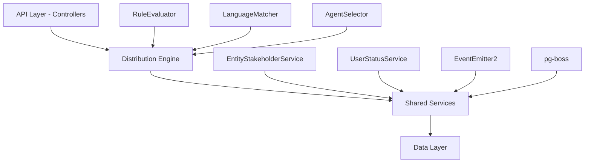

<Info>
**Status:** Active — fully implemented  
**Module Path:** `src/modules/crm/distribution/`
</Info>

## Overview

The Distribution Module automates lead assignment within organizations. When a new lead is created, the system evaluates org-defined rules to automatically assign the lead to the most appropriate agent — based on lead attributes, UserStatus online/away state, working-hours eligibility, language compatibility, and capacity.

### Design Principles

| Principle | Decision |
|-----------|----------|
| Async distribution | `createLead()` emits `LEAD_CREATED` after commit; a pg-boss worker handles distribution. Listener / emit failures are logged only — HTTP lead creation still returns success; manual assignment or backfill may be needed if enqueue never ran. |
| Stakeholder system reuse | Distribution creates `EntityStakeholder` records via `EntityStakeholderService`, not a new paradigm |
| First-match-wins rules | Rules are evaluated top-to-bottom by priority; the first matching rule wins |
| Idempotency | Distribution engine checks for existing stakeholders or pending offers before running |
| No retroactive distribution | Existing leads are unaffected when rules are created; only new leads trigger distribution |
| pg-boss scheduling | Distribution queue uses pg-boss for reliability and retry guarantees |
| RLS compliance | All entities carry `organization_id` for row-level security |

### Distribution Paths

The engine supports two execution paths:

**Path A — Org-level distribution** (`runDistribution`): triggered when a lead enters the org with no team context. Evaluates org-scoped rules, applies the org default method, and can bridge to Path B if a rule or default method routes to a team that has `distributionEnabled = true`.

**Path B — Team-level distribution** (`runTeamDistribution`): triggered directly when a lead is created with a `teamId` or when Path A determines the lead belongs to an auto-distributing team.

## Architecture

### High-Level Diagram



### Component Responsibilities

<AccordionGroup>
<Accordion title="DistributionEngine">
Orchestrator: receives a lead, evaluates rules, selects agent, creates assignment. Supports Path A (org) and Path B (team).
</Accordion>

<Accordion title="RuleEvaluator">
Evaluates rule conditions against lead data; returns first matching rule
</Accordion>

<Accordion title="LanguageMatcher">
Filters and ranks agents by language compatibility with the lead's person
</Accordion>

<Accordion title="AgentSelector">
Applies the distribution method (round-robin, weighted, weighted-round-robin, direct) to the filtered agent pool
</Accordion>

<Accordion title="DistributionCapacityService">
Two-phase capacity enforcement: Phase 1 `filterByCapacity()` (lead counts vs limits); Phase 2 `confirmCapacityAndAssign()` (advisory locks + atomic stakeholder creation)
</Accordion>

<Accordion title="UserStatusService">
Pre-filters candidate agents to ONLINE status; filters by per-user working hours; provides `isWithinWorkingHours()` for org-level business hours check
</Accordion>
</AccordionGroup>

## Entity Specifications

### DistributionSettings (1 per org)

Org-level configuration for the distribution engine. Auto-created with defaults on first access via `getOrgSettingsRaw()`.

| Column | Type | Notes |
|--------|------|-------|
| id | uuid PK | |
| organization_id | uuid FK UNIQUE | RLS |
| distribution_enabled | bool | default `false`. Master on/off switch |
| max_active_leads_per_agent | int | default 50 |
| max_new_leads_per_day | int | default 20 |
| default_distribution_method | enum | `ROUND_ROBIN`, `WEIGHTED`, `WEIGHTED_ROUND_ROBIN`, `DIRECT` |
| business_hours_enabled | bool | default `false` |
| business_hours_start | time | default `09:00:00` |
| business_hours_end | time | default `17:00:00` |
| business_hours_timezone | varchar(50) | default `UTC` |
| business_hours_days | json | default `[1,2,3,4,5]` (Mon-Fri) |

### TeamDistributionSettings (1 per team)

Team-level overrides for distribution configuration.

| Column | Type | Notes |
|--------|------|-------|
| id | uuid PK | |
| team_id | uuid FK UNIQUE | |
| organization_id | uuid FK | RLS |
| distribution_enabled | bool | default `true` |
| distribution_method | enum | nullable; falls back to org default |
| max_active_leads_per_agent | int | nullable; falls back to org default |
| max_new_leads_per_day | int | nullable; falls back to org default |

### DistributionRule

Conditional logic for routing leads to specific agents or teams.

<Note>
Rules are evaluated in priority order (ascending). First matching rule wins.
</Note>

| Column | Type | Notes |
|--------|------|-------|
| id | uuid PK | |
| organization_id | uuid FK | RLS |
| team_id | uuid FK | nullable; null = org-level rule |
| name | varchar(255) | |
| priority | int | default 1000 |
| is_enabled | bool | default `true` |
| conditions | jsonb | Array of condition objects |
| action_type | enum | `ASSIGN_TO_AGENT`, `ASSIGN_TO_TEAM` |
| target_agent_id | uuid FK | nullable |
| target_team_id | uuid FK | nullable |

#### Condition Structure

```json
{
  "field": "person.email",
  "operator": "CONTAINS",
  "value": "@enterprise.com"
}
```

**Supported Fields:**
- `person.email`
- `person.phone_number`
- `lead.status`
- `lead.priority`
- `lead.source`
- `lead.custom_fields.{field_name}`

**Supported Operators:**
- `EQUALS`, `NOT_EQUALS`
- `CONTAINS`, `NOT_CONTAINS`
- `STARTS_WITH`, `ENDS_WITH`
- `IN`, `NOT_IN`
- `GREATER_THAN`, `LESS_THAN`
- `IS_EMPTY`, `IS_NOT_EMPTY`

### DistributionLog

Audit trail for all distribution attempts.

| Column | Type | Notes |
|--------|------|-------|
| id | uuid PK | |
| organization_id | uuid FK | RLS |
| team_id | uuid FK | nullable; set for team-level distribution |
| lead_id | uuid FK | |
| assigned_agent_id | uuid FK | nullable |
| distribution_method | enum | Method used for this assignment |
| matched_rule_id | uuid FK | nullable |
| status | enum | `SUCCESS`, `FAILED`, `NO_AGENTS_AVAILABLE` |
| failure_reason | varchar(500) | nullable |
| agents_considered | int | Count of agents evaluated |
| processing_time_ms | int | Performance metric |

## Type Definitions

### Enums

<Tabs>
<Tab title="DistributionMethod">
```typescript
enum DistributionMethod {
  ROUND_ROBIN = 'ROUND_ROBIN',
  WEIGHTED = 'WEIGHTED',
  WEIGHTED_ROUND_ROBIN = 'WEIGHTED_ROUND_ROBIN',
  DIRECT = 'DIRECT'
}
```
</Tab>

<Tab title="ConditionOperator">
```typescript
enum ConditionOperator {
  EQUALS = 'EQUALS',
  NOT_EQUALS = 'NOT_EQUALS',
  CONTAINS = 'CONTAINS',
  NOT_CONTAINS = 'NOT_CONTAINS',
  STARTS_WITH = 'STARTS_WITH',
  ENDS_WITH = 'ENDS_WITH',
  IN = 'IN',
  NOT_IN = 'NOT_IN',
  GREATER_THAN = 'GREATER_THAN',
  LESS_THAN = 'LESS_THAN',
  IS_EMPTY = 'IS_EMPTY',
  IS_NOT_EMPTY = 'IS_NOT_EMPTY'
}
```
</Tab>

<Tab title="DistributionStatus">
```typescript
enum DistributionStatus {
  SUCCESS = 'SUCCESS',
  FAILED = 'FAILED',
  NO_AGENTS_AVAILABLE = 'NO_AGENTS_AVAILABLE'
}
```
</Tab>
</Tabs>

### Interfaces

```typescript
interface DistributionJobPayload {
  leadId: string;
  organizationId: string;
  teamId?: string;
  userId?: string; // for direct assignment
}

interface RuleCondition {
  field: string;
  operator: ConditionOperator;
  value: any;
}

interface AgentAvailability {
  userId: string;
  isOnline: boolean;
  withinWorkingHours: boolean;
  currentActiveLeads: number;
  currentDailyLeads: number;
  weight: number;
}
```

## Distribution Engine

### Core Algorithm

<Steps>
<Step title="Idempotency Check">
Verify the lead doesn't already have stakeholders or pending distribution
</Step>

<Step title="Rule Evaluation">
Evaluate conditions against lead data in priority order
</Step>

<Step title="Agent Filtering">
Filter agents by status, working hours, and language compatibility
</Step>

<Step title="Capacity Check">
Apply capacity limits (active leads, daily limits)
</Step>

<Step title="Selection Method">
Apply the configured distribution method to select final agent
</Step>

<Step title="Assignment">
Create EntityStakeholder record and log the distribution
</Step>
</Steps>

### Distribution Methods

<Tabs>
<Tab title="Round Robin">
**Algorithm:** Cycles through eligible agents sequentially based on last assignment timestamp.

```typescript
const sortedAgents = eligibleAgents.sort((a, b) => 
  (a.lastAssignedAt || new Date(0)).getTime() - 
  (b.lastAssignedAt || new Date(0)).getTime()
);
return sortedAgents[0];
```
</Tab>

<Tab title="Weighted">
**Algorithm:** Random selection based on agent weights.

```typescript
const totalWeight = agents.reduce((sum, agent) => sum + agent.weight, 0);
const random = Math.random() * totalWeight;
let currentWeight = 0;

for (const agent of agents) {
  currentWeight += agent.weight;
  if (random <= currentWeight) return agent;
}
```
</Tab>

<Tab title="Weighted Round Robin">
**Algorithm:** Combines round-robin fairness with weight-based probability.

```typescript
// Uses a credit system where agents accumulate credits based on weights
// and lose credits when assigned leads
```
</Tab>

<Tab title="Direct">
**Algorithm:** Assigns to a specific agent (from rule or manual selection).

```typescript
const targetAgent = agents.find(a => a.userId === targetUserId);
if (targetAgent && isEligible(targetAgent)) {
  return targetAgent;
}
throw new Error('Target agent not available');
```
</Tab>
</Tabs>

## pg-boss Job Configuration

<Warning>
The distribution system uses pg-boss for reliable async processing. Jobs are retried automatically on failure.
</Warning>

### Job Queue: `lead-distribution`

```typescript
const jobOptions = {
  retryLimit: 3,
  retryDelay: 30, // seconds
  expireInSeconds: 300, // 5 minutes
  retryBackoff: true
};
```

### Job Handler

```typescript
@Injectable()
export class DistributionJobHandler {
  @OnWorkerEvent({ name: 'lead-distribution' })
  async handleDistribution(job: Job<DistributionJobPayload>) {
    const { leadId, organizationId, teamId, userId } = job.data;
    
    try {
      if (teamId) {
        await this.engine.runTeamDistribution(leadId, teamId);
      } else {
        await this.engine.runDistribution(leadId, organizationId);
      }
    } catch (error) {
      this.logger.error('Distribution failed', { leadId, error });
      throw error; // Triggers pg-boss retry
    }
  }
}
```

## API Endpoints

### Distribution Settings

<CodeGroup>
```typescript GET /v1/organizations/{orgId}/distribution/settings
// Get org-level distribution settings
```

```typescript PUT /v1/organizations/{orgId}/distribution/settings
{
  "distributionEnabled": true,
  "maxActiveLeadsPerAgent": 50,
  "maxNewLeadsPerDay": 20,
  "defaultDistributionMethod": "ROUND_ROBIN",
  "businessHoursEnabled": true,
  "businessHoursStart": "09:00:00",
  "businessHoursEnd": "17:00:00",
  "businessHoursTimezone": "America/New_York",
  "businessHoursDays": [1, 2, 3, 4, 5]
}
```
</CodeGroup>

### Team Distribution Settings

<CodeGroup>
```typescript GET /v1/teams/{teamId}/distribution/settings
// Get team-level distribution settings
```

```typescript PUT /v1/teams/{teamId}/distribution/settings
{
  "distributionEnabled": true,
  "distributionMethod": "WEIGHTED",
  "maxActiveLeadsPerAgent": 30,
  "maxNewLeadsPerDay": 15
}
```
</CodeGroup>

### Distribution Rules

<CodeGroup>
```typescript GET /v1/organizations/{orgId}/distribution/rules
// List all distribution rules for org
```

```typescript POST /v1/organizations/{orgId}/distribution/rules
{
  "name": "Enterprise Leads",
  "priority": 100,
  "teamId": null,
  "conditions": [
    {
      "field": "person.email",
      "operator": "CONTAINS",
      "value": "@enterprise.com"
    }
  ],
  "actionType": "ASSIGN_TO_AGENT",
  "targetAgentId": "agent-uuid"
}
```

```typescript PUT /v1/distribution/rules/{ruleId}
// Update existing rule
```

```typescript DELETE /v1/distribution/rules/{ruleId}
// Delete rule
```
</CodeGroup>

### Manual Distribution

<CodeGroup>
```typescript POST /v1/leads/{leadId}/distribute
{
  "forceRedistribution": false,
  "targetAgentId": "optional-agent-uuid"
}
```
</CodeGroup>

### Analytics

<CodeGroup>
```typescript GET /v1/organizations/{orgId}/distribution/analytics
// Query parameters:
// - startDate, endDate
// - teamId (optional)
// - agentId (optional)
// - method (optional)
```
</CodeGroup>

## Security & Permissions

### Required Permissions

| Action | Permission | Notes |
|--------|------------|-------|
| View settings | `distribution:read` | Org or team level |
| Modify settings | `distribution:write` | Admin only |
| View rules | `distribution:read` | |
| Create/modify rules | `distribution:write` | Admin only |
| Manual distribution | `leads:assign` | Can assign leads manually |
| View analytics | `distribution:analytics` | Read-only analytics access |

### Row Level Security

<Tip>
All distribution entities include `organization_id` for RLS enforcement. Team-scoped entities also validate team membership.
</Tip>

```sql
-- Example RLS policy for distribution_settings
CREATE POLICY distribution_settings_org_isolation ON distribution_settings
  FOR ALL TO authenticated
  USING (organization_id = current_setting('app.current_organization_id')::uuid);
```

## Observability & Audit

### Logging

<CodeGroup>
```typescript
// Distribution attempt logging
this.logger.info('Distribution started', {
  leadId,
  organizationId,
  teamId,
  rulesCount: rules.length
});

// Rule matching
this.logger.debug('Rule matched', {
  leadId,
  ruleId: rule.id,
  ruleName: rule.name,
  actionType: rule.actionType
});

// Agent selection
this.logger.info('Agent selected', {
  leadId,
  agentId: selectedAgent.userId,
  method: distributionMethod,
  agentsConsidered: eligibleAgents.length
});
```
</CodeGroup>

### Metrics

Key metrics tracked in `DistributionLog`:

- **Success Rate:** `SUCCESS` status percentage
- **Processing Time:** `processing_time_ms` average
- **Agent Utilization:** Lead distribution across agents
- **Rule Effectiveness:** Which rules match most frequently
- **Capacity Issues:** `NO_AGENTS_AVAILABLE` frequency

### Alerts

<Warning>
Set up monitoring for these critical conditions:
</Warning>

- High `NO_AGENTS_AVAILABLE` rate (>10%)
- Distribution processing time >5 seconds
- pg-boss job failures >5% rate
- Capacity limits frequently hit

## Analytics & Metrics

### Distribution Dashboard Metrics

<CardGroup cols={2}>
<Card title="Assignment Success Rate" icon="chart-line">
Percentage of leads successfully assigned vs. failed
</Card>

<Card title="Agent Load Distribution" icon="users">
Histogram showing lead count per agent
</Card>

<Card title="Rule Performance" icon="rules">
Which rules match most frequently and their success rates
</Card>

<Card title="Processing Times" icon="clock">
Average and p95 distribution processing times
</Card>
</CardGroup>

### SQL Analytics Queries

```sql
-- Agent workload distribution
SELECT 
  u.email as agent_email,
  COUNT(dl.id) as leads_assigned,
  AVG(dl.processing_time_ms) as avg_processing_time
FROM distribution_log dl
JOIN users u ON u.id = dl.assigned_agent_id
WHERE dl.created_at >= NOW() - INTERVAL '30 days'
  AND dl.status = 'SUCCESS'
GROUP BY u.id, u.email
ORDER BY leads_assigned DESC;

-- Rule effectiveness
SELECT 
  dr.name as rule_name,
  COUNT(dl.id) as times_matched,
  COUNT(CASE WHEN dl.status = 'SUCCESS' THEN 1 END) as successful_assignments,
  ROUND(
    COUNT(CASE WHEN dl.status = 'SUCCESS' THEN 1 END) * 100.0 / COUNT(dl.id), 
    2
  ) as success_rate_pct
FROM distribution_log dl
JOIN distribution_rule dr ON dr.id = dl.matched_rule_id
WHERE dl.created_at >= NOW() - INTERVAL '30 days'
GROUP BY dr.id, dr.name
ORDER BY times_matched DESC;
```

## Edge Case Handling

<AccordionGroup>
<Accordion title="No Available Agents">
**Scenario:** All agents are offline, over capacity, or outside working hours.

**Handling:**
- Log `NO_AGENTS_AVAILABLE` status
- Do not create EntityStakeholder record
- Lead remains unassigned for manual handling
- Consider implementing escalation rules
</Accordion>

<Accordion title="Rule Target Not Available">
**Scenario:** Rule specifies agent/team that's not available.

**Handling:**
- Skip the rule and continue to next rule
- Fall back to default distribution method if no rules match
- Log the skip reason for debugging
</Accordion>

<Accordion title="Concurrent Distribution">
**Scenario:** Same lead distributed multiple times simultaneously.

**Handling:**
- Idempotency check prevents duplicate assignments
- Advisory locks in capacity service prevent race conditions
- Second distribution attempt logs and exits early
</Accordion>

<Accordion title="Team Dissolution">
**Scenario:** Team is deleted while having distribution rules.

**Handling:**
- Rules with deleted team targets are skipped
- Team distribution settings are cascade deleted
- Existing assignments remain unchanged
</Accordion>
</AccordionGroup>

## Performance & Scaling

### Database Optimization

<Steps>
<Step title="Indexes">
```sql
-- Critical indexes for performance
CREATE INDEX idx_distribution_log_lead_id ON distribution_log(lead_id);
CREATE INDEX idx_distribution_log_org_created ON distribution_log(organization_id, created_at);
CREATE INDEX idx_distribution_rule_org_priority ON distribution_rule(organization_id, priority);
```
</Step>

<Step title="Query Optimization">
- Use `findOne()` instead of `find()` where possible
- Leverage select field limiting for large result sets
- Implement pagination for rule listing APIs
</Step>

<Step title="Connection Pooling">
- Configure appropriate pg-boss connection pool size
- Monitor database connection usage during high-volume periods
</Step>
</Steps>

### Scaling Considerations

- **pg-boss workers:** Scale horizontally by adding more worker instances
- **Distribution rules:** Limit to reasonable count per org (<100 rules)
- **Capacity calculations:** Consider caching for high-frequency capacity checks
- **Real-time updates:** Use WebSocket events for live dashboard updates

## RLS Policies

### Distribution Settings

```sql
CREATE POLICY distribution_settings_org_isolation 
ON distribution_settings
FOR ALL TO authenticated
USING (organization_id = current_setting('app.current_organization_id')::uuid);
```

### Team Distribution Settings

```sql
CREATE POLICY team_distribution_settings_org_isolation 
ON team_distribution_settings
FOR ALL TO authenticated
USING (organization_id = current_setting('app.current_organization_id')::uuid);

CREATE POLICY team_distribution_settings_team_access
ON team_distribution_settings
FOR ALL TO authenticated
USING (
  team_id IN (
    SELECT team_id FROM team_user 
    WHERE user_id = current_setting('app.current_user_id')::uuid
  )
);
```

### Distribution Rules

```sql
CREATE POLICY distribution_rule_org_isolation 
ON distribution_rule
FOR ALL TO authenticated
USING (organization_id = current_setting('app.current_organization_id')::uuid);

CREATE POLICY distribution_rule_team_isolation 
ON distribution_rule
FOR ALL TO authenticated
USING (
  team_id IS NULL OR 
  team_id IN (
    SELECT team_id FROM team_user 
    WHERE user_id = current_setting('app.current_user_id')::uuid
  )
);
```

## Module Structure

```
src/modules/crm/distribution/
├── controllers/
│   ├── distribution-settings.controller.ts
│   ├── distribution-rules.controller.ts
│   ├── team-distribution.controller.ts
│   └── distribution-analytics.controller.ts
├── entities/
│   ├── distribution-settings.entity.ts
│   ├── team-distribution-settings.entity.ts
│   ├── distribution-rule.entity.ts
│   └── distribution-log.entity.ts
├── services/
│   ├── distribution-engine.service.ts
│   ├── rule-evaluator.service.ts
│   ├── language-matcher.service.ts
│   ├── agent-selector.service.ts
│   └── distribution-capacity.service.ts
├── jobs/
│   ├── distribution-listener.service.ts
│   └── distribution-job-handler.service.ts
├── dto/
│   ├── distribution-settings.dto.ts
│   ├── distribution-rule.dto.ts
│   └── distribution-analytics.dto.ts
├── types/
│   └── distribution.types.ts
└── distribution.module.ts
```

## Integration Points

### Event System

<CodeGroup>
```typescript
// Lead creation event
this.eventEmitter.emit('lead.created', {
  leadId,
  organizationId,
  teamId, // optional
  userId  // optional for direct assignment
});
```

```typescript
// Distribution completion event
this.eventEmitter.emit('lead.distributed', {
  leadId,
  agentId,
  distributionMethod,
  ruleId
});
```
</CodeGroup>

### External Service Dependencies

- **EntityStakeholderService:** Creates assignment records
- **UserStatusService:** Filters by online status and working hours  
- **TeamService:** Validates team membership and settings
- **PersonService:** Provides lead contact information for language matching

## Environment Configuration

```env
# Distribution job configuration
DISTRIBUTION_JOB_RETRY_LIMIT=3
DISTRIBUTION_JOB_RETRY_DELAY=30
DISTRIBUTION_JOB_EXPIRE_SECONDS=300

# Performance settings
DISTRIBUTION_MAX_RULES_PER_ORG=100
DISTRIBUTION_CAPACITY_CHECK_TIMEOUT=5000

# Business hours
DEFAULT_BUSINESS_HOURS_START=09:00:00
DEFAULT_BUSINESS_HOURS_END=17:00:00
DEFAULT_BUSINESS_HOURS_TIMEZONE=UTC
```

<Check>
The Distribution Module provides comprehensive lead assignment automation with robust error handling, detailed analytics, and scalable architecture suitable for high-volume CRM environments.
</Check>