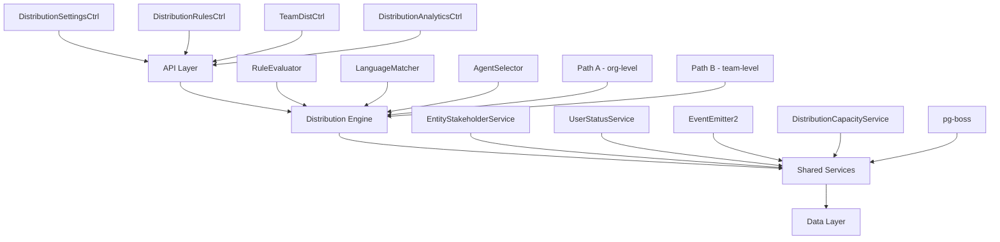

The Distribution Module automates lead assignment within organizations. When a new lead is created, the system evaluates org-defined rules to automatically assign the lead to the most appropriate agent based on lead attributes, UserStatus online/away state, working-hours eligibility, language compatibility, and capacity.

## Overview

<Note>
**Status:** Active — fully implemented  
**Module Path:** `src/modules/crm/distribution/`
</Note>

### Design Principles

The distribution module follows these core design principles:

| Principle | Decision |
|-----------|----------|
| **Async distribution** | `createLead()` emits `LEAD_CREATED` after commit; a pg-boss worker handles distribution. Listener / emit failures are logged only — HTTP lead creation still returns success; manual assignment or backfill may be needed if enqueue never ran. |
| **Stakeholder system reuse** | Distribution creates `EntityStakeholder` records via `EntityStakeholderService`, not a new paradigm |
| **First-match-wins rules** | Rules are evaluated top-to-bottom by priority; the first matching rule wins |
| **Idempotency** | Distribution engine checks for existing stakeholders or pending offers before running |
| **No retroactive distribution** | Existing leads are unaffected when rules are created; only new leads trigger distribution |
| **pg-boss scheduling** | Distribution queue uses pg-boss for reliability and retry guarantees |
| **RLS compliance** | All entities carry `organization_id` for row-level security |

### Distribution Paths

The engine supports two execution paths:

<Tabs>
<Tab title="Path A - Org-level">
**Org-level distribution** (`runDistribution`): triggered when a lead enters the org with no team context. Evaluates org-scoped rules, applies the org default method, and can bridge to Path B if a rule or default method routes to a team that has `distributionEnabled = true`.
</Tab>
<Tab title="Path B - Team-level">
**Team-level distribution** (`runTeamDistribution`): triggered directly when:
- A lead is created with a `teamId` in the event payload (team pool assignment)
- A bulk-imported lead has a team-only assignment; `LeadImportService` batch-enqueues the job with `teamId`
- Path A determines the lead belongs to an auto-distributing team
- Idempotency check finds a single team-only stakeholder with auto-distribute enabled
</Tab>
</Tabs>

## Architecture

### High-Level Diagram



### Component Responsibilities

<AccordionGroup>
<Accordion title="DistributionEngine">
Orchestrator: receives a lead, evaluates rules, selects agent, creates assignment. Supports Path A (org) and Path B (team).
</Accordion>

<Accordion title="RuleEvaluator">
Evaluates rule conditions against lead data; returns first matching rule
</Accordion>

<Accordion title="LanguageMatcher">
Filters and ranks agents by language compatibility with the lead's person
</Accordion>

<Accordion title="AgentSelector">
Applies the distribution method (round-robin, weighted, weighted-round-robin, direct) to the filtered agent pool
</Accordion>

<Accordion title="DistributionCapacityService">
Two-phase capacity enforcement: Phase 1 `filterByCapacity()` (lead counts vs limits); Phase 2 `confirmCapacityAndAssign()` (advisory locks + atomic stakeholder creation). No entity of its own — queries `entity_stakeholder`.
</Accordion>

<Accordion title="UserStatusService">
Pre-filters candidate agents to ONLINE status; filters by per-user working hours (`filterByWorkingHours`); provides `isWithinWorkingHours()` for org-level business hours check.
</Accordion>

<Accordion title="DistributionListener">
Listens for `LEAD_CREATED` events and enqueues pg-boss jobs. The handler is fault-isolated (try/catch): settings lookup and enqueue errors are logged and do not fail `POST /v1/leads`.
</Accordion>

<Accordion title="DistributionJobHandler">
pg-boss worker that processes distribution jobs
</Accordion>
</AccordionGroup>

## Entity Specifications

### DistributionSettings (1 per org)

Org-level configuration for the distribution engine. Auto-created with defaults on first access via `getOrgSettingsRaw()`. Unique constraint on `organization_id`.

| Column | Type | Notes |
|--------|------|-------|
| `id` | uuid PK | |
| `organization_id` | uuid FK UNIQUE | RLS |
| `distribution_enabled` | bool | default `false`. Master on/off switch — when `false`, no pg-boss jobs are enqueued. |
| `max_active_leads_per_agent` | int | default 50 |
| `max_new_leads_per_day` | int | default 25 |
| `default_distribution_method` | enum | `ROUND_ROBIN \| WEIGHTED \| WEIGHTED_ROUND_ROBIN \| DIRECT_ASSIGNMENT` |
| `business_hours_enabled` | bool | default `true` |
| `business_hours` | jsonb | `{ monday: { start: "09:00", end: "17:00", enabled: true }, ... }` |
| `timezone` | string | default `UTC` |
| `auto_assign_unqualified_leads` | bool | default `false` |
| `lead_response_time_threshold_minutes` | int | default 15 (analytics) |

<Note>
The `default_distribution_method` is used as fallback when no rules match, applied to all available agents in the org.
</Note>

### TeamDistributionSettings (1 per team)

Team-specific overrides for distribution behavior.

| Column | Type | Notes |
|--------|------|-------|
| `id` | uuid PK | |
| `team_id` | uuid FK UNIQUE | |
| `organization_id` | uuid FK | RLS |
| `distribution_enabled` | bool | default `false` |
| `max_active_leads_per_agent` | int | nullable, falls back to org setting |
| `max_new_leads_per_day` | int | nullable, falls back to org setting |
| `default_distribution_method` | enum | nullable, falls back to org setting |

### DistributionRule

Rules define conditions and actions for lead assignment.

| Column | Type | Notes |
|--------|------|-------|
| `id` | uuid PK | |
| `organization_id` | uuid FK | RLS |
| `team_id` | uuid FK | nullable, for team-scoped rules |
| `name` | string | |
| `is_active` | bool | default `true` |
| `priority` | int | lower = higher priority, evaluated top-to-bottom |
| `conditions` | jsonb | `{ field, operator, value }[]` array |
| `action_type` | enum | `ASSIGN_TO_AGENT \| ASSIGN_TO_TEAM \| DISTRIBUTE_TO_TEAM \| SKIP_DISTRIBUTION` |
| `action_config` | jsonb | contains target IDs or distribution method |

<Tabs>
<Tab title="Condition Structure">
```json
{
  "field": "lead.source",
  "operator": "equals",
  "value": "website"
}
```

Supported operators: `equals`, `not_equals`, `in`, `not_in`, `contains`, `not_contains`, `greater_than`, `less_than`, `greater_than_or_equal`, `less_than_or_equal`
</Tab>

<Tab title="Action Config Examples">
```json
// ASSIGN_TO_AGENT
{ "agentId": "uuid" }

// ASSIGN_TO_TEAM  
{ "teamId": "uuid" }

// DISTRIBUTE_TO_TEAM
{ "teamId": "uuid", "method": "ROUND_ROBIN" }

// SKIP_DISTRIBUTION
{}
```
</Tab>
</Tabs>

### DistributionLog

Audit trail for all distribution decisions and outcomes.

| Column | Type | Notes |
|--------|------|-------|
| `id` | uuid PK | |
| `organization_id` | uuid FK | RLS |
| `team_id` | uuid FK | nullable |
| `lead_id` | uuid FK | |
| `assigned_agent_id` | uuid FK | nullable if unassigned |
| `rule_id` | uuid FK | nullable if no rule matched |
| `distribution_method` | enum | method that was applied |
| `outcome` | enum | `SUCCESS \| NO_AGENTS_AVAILABLE \| CAPACITY_EXCEEDED \| BUSINESS_HOURS_VIOLATION \| SKIPPED_BY_RULE \| ERROR` |
| `outcome_reason` | string | human-readable explanation |
| `candidates_considered` | jsonb | `{ agentId, reason_excluded }[]` |
| `processing_time_ms` | int | performance metric |
| `created_at` | timestamp | |

## Distribution Engine

The distribution engine is the core component that orchestrates the lead assignment process.

### Engine Flow

<Steps>
<Step title="Validation & Idempotency">
- Check if lead already has stakeholders or pending offers
- Validate lead exists and organization matches
- Determine distribution path (org-level vs team-level)
</Step>

<Step title="Settings & Business Hours">
- Load distribution settings (org and team if applicable)
- Check if distribution is enabled
- Validate business hours if enabled
</Step>

<Step title="Rule Evaluation">
- Load applicable rules (org or team scope)
- Evaluate conditions against lead data
- Return first matching rule or proceed with default method
</Step>

<Step title="Agent Pool Building">
- Get team members or org agents
- Filter by UserStatus (ONLINE only)
- Filter by working hours
- Apply language matching if lead has person data
</Step>

<Step title="Capacity & Selection">
- Filter agents by capacity limits
- Apply distribution method (round-robin, weighted, etc.)
- Attempt assignment with advisory locks
</Step>

<Step title="Assignment & Logging">
- Create EntityStakeholder record
- Log distribution outcome
- Emit assignment events if successful
</Step>
</Steps>

### Distribution Methods

<CardGroup cols={2}>
<Card title="Round Robin" icon="arrows-rotate">
Sequential assignment rotating through available agents based on last assignment timestamps.
</Card>

<Card title="Weighted" icon="scale-balanced">
Random selection with probability weights based on agent capacity and performance metrics.
</Card>

<Card title="Weighted Round Robin" icon="chart-line">
Combines round-robin fairness with weighted probability for balanced but performance-aware distribution.
</Card>

<Card title="Direct Assignment" icon="user-plus">
Explicit assignment to a specific agent, typically used in rule actions.
</Card>
</CardGroup>

### Language Matching

The language matcher provides three levels of compatibility:

1. **Exact Match**: Agent speaks the lead's preferred language
2. **Fallback Match**: Agent speaks a fallback language for the lead's region  
3. **No Language Data**: Lead has no language preference specified

```typescript
interface LanguageMatchResult {
  agentId: string;
  matchType: 'EXACT' | 'FALLBACK' | 'NO_LANGUAGE_DATA';
  languages: string[];
}
```

## API Endpoints

### Distribution Settings

<CodeGroup>
```http GET /v1/organizations/{orgId}/distribution/settings
GET /v1/organizations/{orgId}/distribution/settings

# Response
{
  "distributionEnabled": true,
  "maxActiveLeadsPerAgent": 50,
  "maxNewLeadsPerDay": 25,
  "defaultDistributionMethod": "ROUND_ROBIN",
  "businessHoursEnabled": true,
  "businessHours": {
    "monday": { "start": "09:00", "end": "17:00", "enabled": true }
  },
  "timezone": "UTC"
}
```

```http PUT /v1/organizations/{orgId}/distribution/settings
PUT /v1/organizations/{orgId}/distribution/settings
Content-Type: application/json

{
  "distributionEnabled": true,
  "maxActiveLeadsPerAgent": 75,
  "businessHoursEnabled": false
}
```
</CodeGroup>

### Distribution Rules

<CodeGroup>
```http GET /v1/organizations/{orgId}/distribution/rules
GET /v1/organizations/{orgId}/distribution/rules?teamId=uuid

# Response
{
  "data": [
    {
      "id": "rule-uuid",
      "name": "Website leads to sales team",
      "isActive": true,
      "priority": 1,
      "conditions": [
        { "field": "lead.source", "operator": "equals", "value": "website" }
      ],
      "actionType": "DISTRIBUTE_TO_TEAM",
      "actionConfig": { "teamId": "team-uuid", "method": "ROUND_ROBIN" }
    }
  ]
}
```

```http POST /v1/organizations/{orgId}/distribution/rules
POST /v1/organizations/{orgId}/distribution/rules
Content-Type: application/json

{
  "name": "High-value leads to senior agents",
  "conditions": [
    { "field": "lead.value", "operator": "greater_than", "value": 10000 }
  ],
  "actionType": "ASSIGN_TO_AGENT",
  "actionConfig": { "agentId": "senior-agent-uuid" },
  "priority": 1
}
```
</CodeGroup>

### Manual Distribution

<CodeGroup>
```http POST /v1/leads/{leadId}/distribute
POST /v1/leads/{leadId}/distribute
Content-Type: application/json

{
  "forceRerun": false,
  "teamId": "optional-team-uuid"
}

# Response
{
  "outcome": "SUCCESS",
  "assignedAgentId": "agent-uuid",
  "ruleMatched": "rule-uuid",
  "distributionMethod": "ROUND_ROBIN"
}
```
</CodeGroup>

### Analytics

<CodeGroup>
```http GET /v1/organizations/{orgId}/distribution/analytics
GET /v1/organizations/{orgId}/distribution/analytics?startDate=2024-01-01&endDate=2024-01-31

# Response
{
  "totalDistributions": 1250,
  "successRate": 0.94,
  "averageResponseTime": 8.5,
  "topPerformingAgents": [
    {
      "agentId": "agent-uuid",
      "agentName": "John Smith", 
      "leadsReceived": 45,
      "averageResponseTime": 5.2
    }
  ],
  "distributionsByMethod": {
    "ROUND_ROBIN": 800,
    "WEIGHTED": 300,
    "DIRECT_ASSIGNMENT": 150
  }
}
```
</CodeGroup>

## Security & Permissions

<Warning>
All distribution entities enforce Row-Level Security (RLS) based on `organization_id`. Users can only access distribution data for their own organization.
</Warning>

### Required Permissions

| Action | Required Permission |
|--------|-------------------|
| View distribution settings | `distribution:read` |
| Modify distribution settings | `distribution:write` |
| Create/edit distribution rules | `distribution:rules:write` |
| View distribution analytics | `distribution:analytics:read` |
| Manual lead distribution | `leads:assign` |
| Team distribution settings | `teams:manage` |

### API Security

- All endpoints require authentication via JWT tokens
- Organization context is extracted from user session
- Team-scoped operations validate team membership
- Manual distribution respects lead assignment permissions

## Performance & Scaling

### Optimization Strategies

<Tips>
- **Database Indexing**: Optimized indexes on frequently queried columns (`organization_id`, `team_id`, `created_at`)
- **Connection Pooling**: Database connections are pooled and managed efficiently
- **Advisory Locks**: Prevent race conditions during capacity-constrained assignment
- **Async Processing**: Distribution runs asynchronously via pg-boss to avoid blocking lead creation
- **Batch Operations**: Bulk lead imports use batch job enqueueing for efficiency
</Tips>

### Scaling Considerations

| Component | Scaling Strategy |
|-----------|------------------|
| **pg-boss Workers** | Horizontal scaling via worker count configuration |
| **Database** | Read replicas for analytics queries, connection pooling |
| **Rule Evaluation** | Rules cached in memory with TTL, priority-ordered evaluation |
| **Language Matching** | User language preferences cached, fallback lookups optimized |
| **Capacity Calculations** | Efficient queries with proper indexing, advisory locks for concurrency |

### Performance Metrics

The system tracks key performance indicators:

- **Distribution Processing Time**: Average time from job pickup to assignment completion
- **Success Rate**: Percentage of distributions resulting in successful assignment  
- **Agent Response Time**: Time from assignment to first agent interaction with lead
- **Capacity Utilization**: Agent workload distribution and capacity efficiency

## Module Structure

```
src/modules/crm/distribution/
├── controllers/
│   ├── distribution-settings.controller.ts
│   ├── distribution-rules.controller.ts  
│   ├── team-distribution.controller.ts
│   └── distribution-analytics.controller.ts
├── entities/
│   ├── distribution-settings.entity.ts
│   ├── team-distribution-settings.entity.ts
│   ├── distribution-rule.entity.ts
│   └── distribution-log.entity.ts
├── services/
│   ├── distribution-engine.service.ts
│   ├── rule-evaluator.service.ts
│   ├── language-matcher.service.ts
│   ├── agent-selector.service.ts
│   └── distribution-capacity.service.ts
├── jobs/
│   ├── distribution-job.handler.ts
│   └── distribution.listener.ts
├── types/
│   └── distribution.types.ts
└── distribution.module.ts
```

## Integration Points

### Event System

<Info>
The distribution module integrates with the CRM event system for real-time lead processing and stakeholder notifications.
</Info>

**Consumed Events:**
- `LEAD_CREATED`: Triggers automatic distribution process
- `AGENT_STATUS_CHANGED`: Updates agent availability for distribution
- `TEAM_MEMBERSHIP_CHANGED`: Refreshes agent pools for teams

**Emitted Events:**
- `LEAD_ASSIGNED`: Notifies of successful lead assignment
- `DISTRIBUTION_FAILED`: Alerts of distribution failures requiring manual intervention
- `AGENT_CAPACITY_REACHED`: Triggers capacity management workflows

### External Services

- **UserStatus Service**: Real-time agent availability and working hours
- **EntityStakeholder Service**: Lead-agent relationship management  
- **Team Service**: Team membership and hierarchy data
- **Notification Service**: Assignment alerts and escalations
- **Analytics Service**: Distribution metrics and reporting

---

<Check>
This specification provides a comprehensive overview of the Distribution Module's architecture, entities, and functionality. For implementation details, refer to the source code in `src/modules/crm/distribution/`.
</Check>