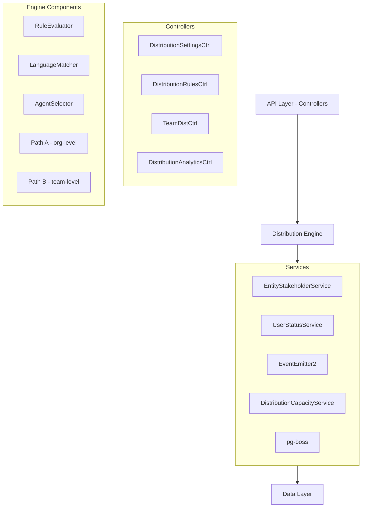

The Distribution Module automates lead assignment within organizations. When a new lead is created, the system evaluates org-defined rules to automatically assign the lead to the most appropriate agent — based on lead attributes, agent availability, language compatibility, and capacity.

## Overview

<Note>
**Module Status:** Active — fully implemented  
**Module Path:** `src/modules/crm/distribution/`
</Note>

### Design Principles

| Principle | Decision |
|-----------|----------|
| Async distribution | `createLead()` emits `LEAD_CREATED`; a pg-boss worker handles distribution — lead creation is never blocked |
| Stakeholder system reuse | Distribution creates `EntityStakeholder` records via `EntityStakeholderService`, not a new paradigm |
| First-match-wins rules | Rules are evaluated top-to-bottom by priority; the first matching rule wins |
| Idempotency | Distribution engine checks for existing stakeholders or pending offers before running |
| No retroactive distribution | Existing leads are unaffected when rules are created; only new leads trigger distribution |
| pg-boss scheduling | Distribution queue uses pg-boss for reliability and retry guarantees |
| RLS compliance | All entities carry `organization_id` for row-level security |

### Distribution Paths

The engine supports two execution paths:

<AccordionGroup>
  <Accordion title="Path A — Org-level distribution">
    Triggered when a lead enters the org with no team context. Evaluates org-scoped rules, applies the org default method, and can bridge to Path B if a rule or default method routes to a team that has `distributionEnabled = true`.
  </Accordion>
  
  <Accordion title="Path B — Team-level distribution">
    Triggered directly when:
    - A lead is created with a `teamId` in the event payload (team pool assignment)
    - Path A determines the lead belongs to an auto-distributing team
    - Idempotency check finds a single team-only stakeholder with auto-distribute enabled
    
    Path B evaluates team-scoped rules, uses team settings (with org fallback for capacity), and logs the team FK on the resulting `DistributionLog` record.
  </Accordion>
</AccordionGroup>

## Architecture

### High-Level Diagram



### Component Responsibilities

| Component | Responsibility |
|-----------|----------------|
| **DistributionEngine** | Orchestrator: receives a lead, evaluates rules, selects agent, creates assignment. Supports Path A (org) and Path B (team). |
| **RuleEvaluator** | Evaluates rule conditions against lead data; returns first matching rule |
| **LanguageMatcher** | Filters and ranks agents by language compatibility with the lead's person |
| **AgentSelector** | Applies the distribution method (round-robin, weighted, weighted-round-robin, direct) to the filtered agent pool |
| **DistributionCapacityService** | Two-phase capacity enforcement: Phase 1 `filterByCapacity()` (lead counts vs limits); Phase 2 `confirmCapacityAndAssign()` (advisory locks + atomic stakeholder creation). |
| **UserStatusService** | Pre-filters candidate agents to ONLINE status; filters by per-user working hours |
| **DistributionListener** | Listens for `LEAD_CREATED` events and enqueues pg-boss jobs |
| **DistributionJobHandler** | pg-boss worker that processes distribution jobs |

## Entity Specifications

### DistributionSettings

<Info>
Org-level configuration for the distribution engine. Auto-created with defaults on first access via `getOrgSettingsRaw()`. Unique constraint on `organization_id`.
</Info>

| Column | Type | Notes |
|--------|------|-------|
| id | uuid PK | |
| organization_id | uuid FK UNIQUE | RLS |
| distribution_enabled | bool | default `false`. Master on/off switch |
| max_active_leads_per_agent | int | default 50 |
| max_new_leads_per_day | int | default 15 |
| capacity_enforcement_enabled | bool | default `false` |
| respect_business_hours | bool | default `true` |
| outside_hours_action | enum | `QUEUE`, `POOL`, `DUTY_AGENT` |
| duty_agent_id | uuid FK nullable | used when `outside_hours_action = DUTY_AGENT` |
| default_method | enum | `ROUND_ROBIN`, `POOL`, `SPECIFIC_TEAM` |
| default_team_id | uuid FK nullable | used when `default_method = SPECIFIC_TEAM` |
| default_language_matching_mode | enum | `STRICT`, `PREFERRED` |
| default_balancing_factors | jsonb nullable | Optional balancing configuration |
| pool_alert_enabled | bool | Whether to send pool-overload alerts |
| pool_alert_threshold | int | Lead count that triggers an alert |
| pool_alert_window_minutes | int | Rolling window for counting unassigned leads |

<Warning>
**Master toggle behavior:**
- `distributionEnabled = false`: Engine is off. No pg-boss jobs created — leads go to pool
- `distributionEnabled = true`: Engine is active. When toggled from `false` → `true`, if `defaultMethod` is still `POOL` it is auto-upgraded to `ROUND_ROBIN`
</Warning>

### TeamDistributionSettings

Per-team distribution configuration. One record per `(organization, team)` pair — unique index `uq_team_distribution_settings_org_team`. Auto-created on first access.

| Column | Type | Notes |
|--------|------|-------|
| id | uuid PK | |
| organization_id | uuid FK | RLS |
| team_id | uuid FK | (required, not nullable) |
| distribution_enabled | bool | default `false`. When `true`, leads in this team's pool are auto-distributed via Path B |
| distribution_method | enum | default `ROUND_ROBIN` |
| agent_weights | jsonb nullable | `{ [userId]: weight }` — used with WEIGHTED method |
| language_matching_enabled | bool | default `false` |
| language_matching_mode | enum nullable | Language matching mode override |
| capacity_enforcement_enabled | bool | default `false`. Independent from org toggle |
| max_active_leads_per_agent | int nullable | `null` = inherit from org settings |
| max_new_leads_per_day | int nullable | `null` = inherit from org settings |
| respect_business_hours | bool | default `false` |
| last_assigned_index | int | default 0. Round-robin cursor |

### DistributionRule

<Note>
Rules are evaluated in ascending `priority` order (lower number = higher priority). First match wins.
</Note>

| Column | Type | Notes |
|--------|------|-------|
| id | uuid PK | |
| organization_id | uuid FK | RLS |
| name | varchar | |
| priority | int | lower = higher priority |
| is_active | bool | default true |
| scope | enum | `ORGANIZATION`, `TEAM` |
| team_id | uuid FK nullable | for team-scoped rules |
| condition_groups | jsonb | `[{conditions:[{field,operator,value}]}]` — AND-within-OR groups |
| method | enum | `ROUND_ROBIN`, `WEIGHTED`, `WEIGHTED_ROUND_ROBIN`, `DIRECT` |
| recipients | jsonb | `{agentIds?, teamId?, poolId?, weights?}` |
| language_matching_enabled | bool | default true |
| language_matching_mode | enum | `STRICT`, `PREFERRED` |
| balancing_factors | jsonb nullable | Optional balancing configuration |
| last_assigned_index | int | round-robin cursor |

**Rule Conditions — Supported Fields:**

| Field | Operator(s) | Example Value |
|-------|-------------|---------------|
| `leadSource` | `eq`, `in` | `'WEBSITE'`, `['WEBSITE', 'REFERRAL']` |
| `temperature` | `eq`, `in` | `'HOT'` |
| `language` | `eq` | `'ar'` (matched against `person.preferredLanguage`) |
| `budget` | `gte`, `lte`, `between` | `500000` |
| `tags` | `contains` | `['vip']` |
| `sourceChannel` | `eq`, `in` | `'WHATSAPP'` |
| `intent` | `eq` | `'BUY'` |
| `area` | `eq`, `in`, `contains` | `'Dubai Marina'`, `['JBR', 'Downtown Dubai']` |

<Tip>
All string-based condition fields use **case-insensitive matching**. The `area` field requires data from `LeadPropertyInterest.preferredAreas[]`.
</Tip>

## Distribution Engine

### Engine Flow

<Steps>
<Step title="Receive Lead Event">
Distribution listener receives `LEAD_CREATED` event and enqueues pg-boss job if distribution is enabled
</Step>

<Step title="Load Lead Context">
Engine loads lead with related entities (person, property interests, existing stakeholders)
</Step>

<Step title="Path Selection">
Determine execution path:
- **Path A**: Org-level distribution (no team context)
- **Path B**: Team-level distribution (team specified or routed from Path A)
</Step>

<Step title="Rule Evaluation">
Evaluate applicable rules in priority order until first match
</Step>

<Step title="Agent Selection">
Apply distribution method (round-robin, weighted, etc.) to filtered agent pool
</Step>

<Step title="Capacity Check">
Verify agent capacity if enforcement is enabled
</Step>

<Step title="Assignment">
Create entity stakeholder record and log distribution
</Step>
</Steps>

### Distribution Methods

<Tabs>
<Tab title="Round Robin">
Agents are assigned leads in rotation based on `last_assigned_index`. Index is atomically incremented after each assignment.

```typescript
// Simplified round-robin logic
const nextIndex = (currentIndex + 1) % eligibleAgents.length;
const selectedAgent = eligibleAgents[nextIndex];
```
</Tab>

<Tab title="Weighted">
Agents are selected based on assigned weights. Higher weights increase probability of assignment.

```typescript
// Weight-based selection
const totalWeight = weights.reduce((sum, w) => sum + w, 0);
const randomValue = Math.random() * totalWeight;
// Select agent based on weighted ranges
```
</Tab>

<Tab title="Weighted Round Robin">
Combines round-robin fairness with weight-based preferences. Agents with higher weights appear more frequently in the rotation.
</Tab>

<Tab title="Direct">
Lead is assigned directly to specified agent(s) without distribution logic.
</Tab>
</Tabs>

### Language Matching

<AccordionGroup>
<Accordion title="STRICT Mode">
Only agents with exact language match are eligible. If no matches found, lead goes to pool.
</Accordion>

<Accordion title="PREFERRED Mode">
Agents with matching languages are prioritized, but others remain eligible as fallback.
</Accordion>
</AccordionGroup>

## API Endpoints

### Distribution Settings

<CodeGroup>
```typescript GET /api/distribution/settings
// Get organization distribution settings
{
  "distributionEnabled": true,
  "maxActiveLeadsPerAgent": 50,
  "maxNewLeadsPerDay": 15,
  "capacityEnforcementEnabled": false,
  "respectBusinessHours": true,
  "outsideHoursAction": "POOL",
  "defaultMethod": "ROUND_ROBIN",
  "defaultLanguageMatchingMode": "PREFERRED"
}
```

```typescript PUT /api/distribution/settings
// Update organization distribution settings
{
  "distributionEnabled": true,
  "maxActiveLeadsPerAgent": 75,
  "capacityEnforcementEnabled": true,
  "defaultMethod": "WEIGHTED"
}
```
</CodeGroup>

### Distribution Rules

<CodeGroup>
```typescript GET /api/distribution/rules
// List distribution rules
{
  "data": [
    {
      "id": "rule-uuid",
      "name": "VIP Leads",
      "priority": 1,
      "isActive": true,
      "scope": "ORGANIZATION",
      "conditionGroups": [
        {
          "conditions": [
            {
              "field": "tags",
              "operator": "contains",
              "value": ["vip"]
            }
          ]
        }
      ],
      "method": "DIRECT",
      "recipients": {
        "agentIds": ["agent-uuid"]
      }
    }
  ]
}
```

```typescript POST /api/distribution/rules
// Create distribution rule
{
  "name": "Hot Arabic Leads",
  "priority": 2,
  "conditionGroups": [
    {
      "conditions": [
        {
          "field": "temperature",
          "operator": "eq",
          "value": "HOT"
        },
        {
          "field": "language",
          "operator": "eq", 
          "value": "ar"
        }
      ]
    }
  ],
  "method": "ROUND_ROBIN",
  "languageMatchingEnabled": true,
  "languageMatchingMode": "STRICT"
}
```
</CodeGroup>

### Team Distribution

<CodeGroup>
```typescript GET /api/teams/:teamId/distribution/settings
// Get team distribution settings
{
  "distributionEnabled": false,
  "distributionMethod": "ROUND_ROBIN",
  "languageMatchingEnabled": false,
  "capacityEnforcementEnabled": false,
  "maxActiveLeadsPerAgent": null, // inherits from org
  "respectBusinessHours": false
}
```

```typescript PUT /api/teams/:teamId/distribution/settings
// Update team distribution settings
{
  "distributionEnabled": true,
  "distributionMethod": "WEIGHTED",
  "agentWeights": {
    "agent-1-uuid": 3,
    "agent-2-uuid": 2,
    "agent-3-uuid": 1
  },
  "capacityEnforcementEnabled": true,
  "maxActiveLeadsPerAgent": 30
}
```
</CodeGroup>

### Analytics

<CodeGroup>
```typescript GET /api/distribution/analytics/summary
// Distribution analytics summary
{
  "totalDistributed": 1250,
  "totalToPool": 89,
  "averageDistributionTime": "2.3s",
  "topPerformingRules": [
    {
      "ruleName": "VIP Leads",
      "matchCount": 45,
      "successRate": 0.96
    }
  ],
  "agentWorkload": [
    {
      "agentId": "agent-uuid",
      "agentName": "John Doe",
      "activeLeads": 23,
      "dailyAssignments": 8,
      "capacityUtilization": 0.46
    }
  ]
}
```

```typescript GET /api/distribution/analytics/performance
// Distribution performance metrics
{
  "distributionMetrics": {
    "successRate": 0.94,
    "averageProcessingTime": 2300,
    "peakHourPerformance": {
      "hour": 14,
      "distributionCount": 45,
      "averageTime": 1800
    }
  },
  "capacityMetrics": {
    "organizationUtilization": 0.67,
    "agentsNearCapacity": 3,
    "agentsAtCapacity": 1
  }
}
```
</CodeGroup>

## Security & Permissions

### Permission Requirements

| Action | Required Permission | Notes |
|--------|-------------------|-------|
| View distribution settings | `distribution.settings.view` | Org-level permission |
| Modify distribution settings | `distribution.settings.manage` | Org admin or specific role |
| View distribution rules | `distribution.rules.view` | |
| Create/modify distribution rules | `distribution.rules.manage` | |
| View team distribution settings | `teams.distribution.view` | Team-level permission |
| Modify team distribution settings | `teams.distribution.manage` | Team admin or higher |
| View distribution analytics | `distribution.analytics.view` | |
| Force distribution | `distribution.force` | Debug/admin action |

### Row-Level Security (RLS)

All distribution entities include `organization_id` for RLS compliance:

```sql
-- Example RLS policy for distribution_settings
CREATE POLICY distribution_settings_org_isolation ON distribution_settings
FOR ALL TO authenticated
USING (organization_id = current_setting('app.current_organization_id')::uuid);

-- Example RLS policy for distribution_rule
CREATE POLICY distribution_rule_org_isolation ON distribution_rule
FOR ALL TO authenticated  
USING (organization_id = current_setting('app.current_organization_id')::uuid);
```

## Performance & Scaling

### Optimization Strategies

<CardGroup cols={2}>
<Card title="Database Optimization" icon="database">
- Indexes on frequently queried fields (`organization_id`, `team_id`, `priority`)
- Advisory locks for capacity enforcement
- Atomic counter updates for round-robin cursors
</Card>

<Card title="Caching Strategy" icon="bolt">
- Distribution settings cached with 5-minute TTL
- Team settings cached per team
- Agent availability cached for 30 seconds
</Card>

<Card title="Queue Management" icon="clock">
- pg-boss with retry policies
- Dead letter queue for failed distributions
- Monitoring for queue depth and processing time
</Card>

<Card title="Capacity Management" icon="users">
- Two-phase capacity checks
- Periodic capacity cleanup jobs
- Real-time capacity monitoring
</Card>
</CardGroup>

### Performance Metrics

| Metric | Target | Alert Threshold |
|--------|--------|----------------|
| Distribution processing time | < 3 seconds | > 10 seconds |
| Queue depth | < 50 jobs | > 200 jobs |
| Success rate | > 95% | < 90% |
| Agent capacity utilization | 60-80% | > 90% |

## Integration Points

### Event System

<Info>
The distribution module integrates with the event system for real-time processing and notifications.
</Info>

**Events Consumed:**
- `LEAD_CREATED`: Triggers distribution process
- `AGENT_STATUS_CHANGED`: Updates agent availability
- `TEAM_MEMBER_ADDED/REMOVED`: Updates agent pools

**Events Emitted:**
- `LEAD_DISTRIBUTED`: Lead assigned to agent
- `LEAD_POOLED`: Lead sent to pool (no available agents)
- `DISTRIBUTION_FAILED`: Distribution process failed
- `CAPACITY_WARNING`: Agent approaching capacity limits

### External Dependencies

| Service | Purpose | Failure Handling |
|---------|---------|------------------|
| EntityStakeholderService | Create lead assignments | Retry with exponential backoff |
| UserStatusService | Check agent availability | Graceful degradation (assume available) |
| OrganizationService | Business hours validation | Skip business hours check |
| TeamService | Team member validation | Use cached team data |

### Module Structure

```
src/modules/crm/distribution/
├── controllers/
│   ├── distribution-settings.controller.ts
│   ├── distribution-rules.controller.ts
│   ├── team-distribution.controller.ts
│   └── distribution-analytics.controller.ts
├── services/
│   ├── distribution-engine.service.ts
│   ├── distribution-settings.service.ts
│   ├── distribution-capacity.service.ts
│   ├── rule-evaluator.service.ts
│   ├── language-matcher.service.ts
│   └── agent-selector.service.ts
├── entities/
│   ├── distribution-settings.entity.ts
│   ├── team-distribution-settings.entity.ts
│   ├── distribution-rule.entity.ts
│   └── distribution-log.entity.ts
├── listeners/
│   └── distribution.listener.ts
├── jobs/
│   └── distribution-job.handler.ts
├── types/
│   └── distribution.types.ts
└── distribution.module.ts
```

<Check>
The Distribution Module provides comprehensive lead assignment automation with flexible rule configuration, capacity management, and detailed analytics for optimal agent workload distribution.
</Check>