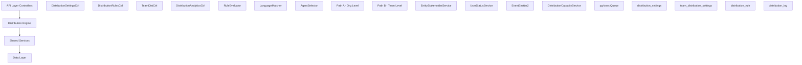

The Distribution Module automates lead assignment within organizations. When a new lead is created, the system evaluates org-defined rules to automatically assign the lead to the most appropriate agent — based on lead attributes, agent availability, language compatibility, and capacity.

## Overview

<Info>
**Module Status:** Active — fully implemented  
**Module Path:** `src/modules/crm/distribution/`
</Info>

### Design Principles

The distribution module follows these core design principles:

<CardGroup cols={2}>
  <Card title="Async Distribution" icon="clock">
    `createLead()` emits `LEAD_CREATED`; a pg-boss worker handles distribution — lead creation is never blocked
  </Card>
  <Card title="Stakeholder System Reuse" icon="users">
    Distribution creates `EntityStakeholder` records via `EntityStakeholderService`, not a new paradigm
  </Card>
  <Card title="First-Match-Wins Rules" icon="trophy">
    Rules are evaluated top-to-bottom by priority; the first matching rule wins
  </Card>
  <Card title="Idempotency" icon="shield-check">
    Distribution engine checks for existing stakeholders or pending offers before running
  </Card>
</CardGroup>

### Distribution Paths

The engine supports two execution paths:

<Tabs>
  <Tab title="Path A - Org-level">
    **Org-level distribution** (`runDistribution`): triggered when a lead enters the org with no team context. Evaluates org-scoped rules, applies the org default method, and can bridge to Path B if a rule or default method routes to a team that has `distributionEnabled = true`.
  </Tab>
  <Tab title="Path B - Team-level">
    **Team-level distribution** (`runTeamDistribution`): triggered directly when:
    - A lead is created with a `teamId` in the event payload (team pool assignment)
    - Path A determines the lead belongs to an auto-distributing team
    - Idempotency check finds a single team-only stakeholder with auto-distribute enabled
  </Tab>
</Tabs>

## Architecture

### High-Level Architecture



### Component Responsibilities

<AccordionGroup>
  <Accordion title="DistributionEngine">
    Orchestrator: receives a lead, evaluates rules, selects agent, creates assignment. Supports Path A (org) and Path B (team).
  </Accordion>
  <Accordion title="RuleEvaluator">
    Evaluates rule conditions against lead data; returns first matching rule
  </Accordion>
  <Accordion title="LanguageMatcher">
    Filters and ranks agents by language compatibility with the lead's person
  </Accordion>
  <Accordion title="AgentSelector">
    Applies the distribution method (round-robin, weighted, weighted-round-robin, direct) to the filtered agent pool
  </Accordion>
  <Accordion title="DistributionCapacityService">
    Two-phase capacity enforcement: Phase 1 `filterByCapacity()` (lead counts vs limits); Phase 2 `confirmCapacityAndAssign()` (advisory locks + atomic stakeholder creation). No entity of its own — queries `entity_stakeholder`.
  </Accordion>
  <Accordion title="UserStatusService">
    Pre-filters candidate agents to ONLINE status; filters by per-user working hours (`filterByWorkingHours`); provides `isWithinWorkingHours()` for org-level business hours check.
  </Accordion>
</AccordionGroup>

## Entity Specifications

### DistributionSettings (1 per org)

Org-level configuration for the distribution engine. Auto-created with defaults on first access via `getOrgSettingsRaw()`. Unique constraint on `organization_id`.

<CodeGroup>
```sql Schema
CREATE TABLE distribution_settings (
    id uuid PRIMARY KEY,
    organization_id uuid UNIQUE NOT NULL,
    distribution_enabled boolean DEFAULT false,
    max_active_leads_per_agent integer DEFAULT 50,
    max_new_leads_per_day integer DEFAULT 15,
    capacity_enforcement_enabled boolean DEFAULT false,
    respect_business_hours boolean DEFAULT true,
    outside_hours_action distribution_outside_hours_action,
    duty_agent_id uuid REFERENCES users(id),
    default_method distribution_method,
    default_team_id uuid REFERENCES teams(id),
    default_language_matching_mode language_matching_mode,
    default_balancing_factors jsonb,
    pool_alert_enabled boolean,
    pool_alert_threshold integer,
    pool_alert_window_minutes integer,
    updated_by uuid REFERENCES users(id),
    created_at timestamp DEFAULT now(),
    updated_at timestamp DEFAULT now()
);
```

```typescript Entity
export class DistributionSettings {
  @PrimaryKey()
  id: string = uuid();

  @Property({ columnType: 'uuid', unique: true })
  organizationId!: string;

  @Property({ default: false })
  distributionEnabled: boolean = false;

  @Property({ default: 50 })
  maxActiveLeadsPerAgent: number = 50;

  @Property({ default: 15 })
  maxNewLeadsPerDay: number = 15;

  @Property({ default: false })
  capacityEnforcementEnabled: boolean = false;

  @Property({ default: true })
  respectBusinessHours: boolean = true;

  @Enum(() => OutsideHoursAction)
  outsideHoursAction?: OutsideHoursAction;

  @Property({ nullable: true })
  dutyAgentId?: string;

  @Enum(() => DistributionMethod)
  defaultMethod?: DistributionMethod;

  @Property({ nullable: true })
  defaultTeamId?: string;

  @Enum(() => LanguageMatchingMode)
  defaultLanguageMatchingMode?: LanguageMatchingMode;

  @Property({ type: 'jsonb', nullable: true })
  defaultBalancingFactors?: any;

  @Property()
  poolAlertEnabled?: boolean;

  @Property()
  poolAlertThreshold?: number;

  @Property()
  poolAlertWindowMinutes?: number;
}
```
</CodeGroup>

<Note>
**Master toggle behavior:**
- `distributionEnabled = false` (new-org default): Engine is off. `DistributionListener` and `LeadImportService` skip enqueue entirely — leads go to pool, no pg-boss jobs created.
- `distributionEnabled = true`: Engine is active. When toggled from `false` → `true` in `DistributionSettingsService.update()`, if `defaultMethod` is still `POOL` it is auto-upgraded to `ROUND_ROBIN` for a smooth first-run experience.
</Note>

### TeamDistributionSettings (1 per org+team)

Per-team distribution configuration. One record per `(organization, team)` pair — unique index `uq_team_distribution_settings_org_team`. Auto-created on first access.

<CodeGroup>
```sql Schema
CREATE TABLE team_distribution_settings (
    id uuid PRIMARY KEY,
    organization_id uuid NOT NULL,
    team_id uuid NOT NULL,
    distribution_enabled boolean DEFAULT false,
    distribution_method distribution_method DEFAULT 'ROUND_ROBIN',
    agent_weights jsonb,
    language_matching_enabled boolean DEFAULT false,
    language_matching_mode language_matching_mode,
    capacity_enforcement_enabled boolean DEFAULT false,
    max_active_leads_per_agent integer,
    max_new_leads_per_day integer,
    respect_business_hours boolean DEFAULT false,
    last_assigned_index integer DEFAULT 0,
    default_balancing_factors jsonb,
    updated_by uuid REFERENCES users(id),
    created_at timestamp DEFAULT now(),
    updated_at timestamp DEFAULT now(),
    UNIQUE(organization_id, team_id)
);
```

```typescript Entity
export class TeamDistributionSettings {
  @PrimaryKey()
  id: string = uuid();

  @Property({ columnType: 'uuid' })
  organizationId!: string;

  @Property({ columnType: 'uuid' })
  teamId!: string;

  @Property({ default: false })
  distributionEnabled: boolean = false;

  @Enum(() => DistributionMethod)
  distributionMethod: DistributionMethod = DistributionMethod.ROUND_ROBIN;

  @Property({ type: 'jsonb', nullable: true })
  agentWeights?: Record<string, number>;

  @Property({ default: false })
  languageMatchingEnabled: boolean = false;

  @Enum(() => LanguageMatchingMode)
  languageMatchingMode?: LanguageMatchingMode;

  @Property({ default: false })
  capacityEnforcementEnabled: boolean = false;

  @Property({ nullable: true })
  maxActiveLeadsPerAgent?: number;

  @Property({ nullable: true })
  maxNewLeadsPerDay?: number;

  @Property({ default: false })
  respectBusinessHours: boolean = false;

  @Property({ default: 0 })
  lastAssignedIndex: number = 0;
}
```
</CodeGroup>

<Tip>
**Effective capacity resolution** (`DistributionSettingsService.resolveEffectiveCapacity`):
```javascript
if (team.capacityEnforcementEnabled) {
  maxActive = team.maxActiveLeadsPerAgent ?? org.maxActiveLeadsPerAgent
  maxDaily = team.maxNewLeadsPerDay ?? org.maxNewLeadsPerDay
} else {
  // no capacity checks applied for this team's distributions
}
```
</Tip>

### DistributionRule

Rules are evaluated in ascending `priority` order (lower number = higher priority). First match wins.

<CodeGroup>
```sql Schema
CREATE TABLE distribution_rule (
    id uuid PRIMARY KEY,
    organization_id uuid NOT NULL,
    name varchar NOT NULL,
    priority integer NOT NULL,
    is_active boolean DEFAULT true,
    scope rule_scope NOT NULL,
    team_id uuid REFERENCES teams(id),
    condition_groups jsonb NOT NULL,
    method distribution_method NOT NULL,
    recipients jsonb NOT NULL,
    language_matching_enabled boolean DEFAULT true,
    language_matching_mode language_matching_mode,
    balancing_factors jsonb,
    last_assigned_index integer DEFAULT 0,
    created_by uuid REFERENCES users(id),
    created_at timestamp DEFAULT now(),
    updated_at timestamp DEFAULT now(),
    is_deleted boolean DEFAULT false
);
```

```typescript Entity
export class DistributionRule {
  @PrimaryKey()
  id: string = uuid();

  @Property({ columnType: 'uuid' })
  organizationId!: string;

  @Property()
  name!: string;

  @Property()
  priority!: number;

  @Property({ default: true })
  isActive: boolean = true;

  @Enum(() => RuleScope)
  scope!: RuleScope;

  @Property({ nullable: true })
  teamId?: string;

  @Property({ type: 'jsonb' })
  conditionGroups!: ConditionGroup[];

  @Enum(() => DistributionMethod)
  method!: DistributionMethod;

  @Property({ type: 'jsonb' })
  recipients!: RuleRecipients;

  @Property({ default: true })
  languageMatchingEnabled: boolean = true;

  @Enum(() => LanguageMatchingMode)
  languageMatchingMode?: LanguageMatchingMode;

  @Property({ type: 'jsonb', nullable: true })
  balancingFactors?: any;

  @Property({ default: 0 })
  lastAssignedIndex: number = 0;
}
```
</CodeGroup>

#### Rule Conditions — Supported Fields

<AccordionGroup>
  <Accordion title="leadSource">
    **Operators:** `eq`, `in`  
    **Example:** `'WEBSITE'`, `['WEBSITE', 'REFERRAL']`
  </Accordion>
  <Accordion title="temperature">
    **Operators:** `eq`, `in`  
    **Example:** `'HOT'`
  </Accordion>
  <Accordion title="language">
    **Operators:** `eq`  
    **Example:** `'ar'` (matched against `person.preferredLanguage`)
  </Accordion>
  <Accordion title="budget">
    **Operators:** `gte`, `lte`, `between`  
    **Example:** `500000`
  </Accordion>
  <Accordion title="tags">
    **Operators:** `contains`  
    **Example:** `['vip']`
  </Accordion>
  <Accordion title="sourceChannel">
    **Operators:** `eq`, `in`  
    **Example:** `'WHATSAPP'`
  </Accordion>
  <Accordion title="intent">
    **Operators:** `eq`  
    **Example:** `'BUY'`
  </Accordion>
  <Accordion title="area">
    **Operators:** `eq`, `in`, `contains`  
    **Example:** `'Dubai Marina'`, `['JBR', 'Downtown Dubai']`
  </Accordion>
</AccordionGroup>

<Warning>
All string-based condition fields use **case-insensitive matching**. The `area` field requires data from `LeadPropertyInterest.preferredAreas[]` — the engine pre-loads the lead's property interests before evaluation.
</Warning>

## Distribution Engine

The Distribution Engine is the core orchestrator that handles lead assignment through two main paths.

### Core Engine Methods

<Steps>
  <Step title="runDistribution (Path A)">
    Org-level distribution for leads without team context:
    - Evaluates org-scoped rules by priority
    - Falls back to org default method if no rules match
    - Can bridge to Path B if routing to auto-distributing team
  </Step>
  <Step title="runTeamDistribution (Path B)">
    Team-level distribution for leads with team context:
    - Evaluates team-scoped rules by priority
    - Falls back to team distribution method
    - Uses team settings with org fallback for capacity
  </Step>
  <Step title="Idempotency Check">
    Before distribution, engine checks for:
    - Existing stakeholder assignments
    - Pending distribution offers
    - Already processed distribution logs
  </Step>
</Steps>

### Distribution Methods

<Tabs>
  <Tab title="Round Robin">
    **Method:** `ROUND_ROBIN`  
    Cycles through available agents sequentially using `lastAssignedIndex` cursor.
    ```typescript
    const nextIndex = (lastAssignedIndex + 1) % eligibleAgents.length;
    const selectedAgent = eligibleAgents[nextIndex];
    ```
  </Tab>
  <Tab title="Weighted">
    **Method:** `WEIGHTED`  
    Selects agents based on configured weights. Higher weight = higher probability.
    ```typescript
    const totalWeight = Object.values(weights).reduce((sum, w) => sum + w, 0);
    const random = Math.random() * totalWeight;
    // Select agent based on cumulative weight thresholds
    ```
  </Tab>
  <Tab title="Weighted Round Robin">
    **Method:** `WEIGHTED_ROUND_ROBIN`  
    Combines round-robin fairness with weighted preferences.
  </Tab>
  <Tab title="Direct Assignment">
    **Method:** `DIRECT`  
    Assigns to specific agent(s) defined in rule recipients.
  </Tab>
</Tabs>

### Language Matching

The engine supports two language matching modes:

<CardGroup cols={2}>
  <Card title="Strict Mode" icon="lock">
    Only agents with exact language match are considered. If no matches found, distribution fails and lead goes to pool.
  </Card>
  <Card title="Preferred Mode" icon="heart">
    Prefers agents with language match but falls back to all available agents if no exact matches exist.
  </Card>
</CardGroup>

### Capacity Enforcement

<Note>
Capacity enforcement uses a two-phase approach for race condition safety:
1. **Phase 1:** `filterByCapacity()` - Initial filtering based on current counts
2. **Phase 2:** `confirmCapacityAndAssign()` - Advisory locks + atomic assignment
</Note>

## pg-boss Job Configuration

The distribution system uses pg-boss for reliable asynchronous processing:

<CodeGroup>
```typescript Job Handler
@OnQueueActive('distribution')
async handleDistribution(job: Job<DistributionJobPayload>) {
  const { leadId, organizationId, teamId, eventId } = job.data;
  
  try {
    if (teamId) {
      await this.distributionEngine.runTeamDistribution(leadId, teamId);
    } else {
      await this.distributionEngine.runDistribution(leadId);
    }
  } catch (error) {
    this.logger.error('Distribution job failed', { leadId, error });
    throw error; // pg-boss handles retry logic
  }
}
```

```typescript Job Configuration
const jobOptions = {
  retryLimit: 3,
  retryDelay: 30, // seconds
  retryBackoff: true,
  expireInMinutes: 60,
  singletonKey: `distribution-${leadId}`, // Prevent duplicate jobs
};
```
</CodeGroup>

## API Endpoints

### Distribution Settings

<CodeGroup>
```http GET Org Settings
GET /api/crm/distribution/settings

Response:
{
  "distributionEnabled": true,
  "maxActiveLeadsPerAgent": 50,
  "maxNewLeadsPerDay": 15,
  "capacityEnforcementEnabled": false,
  "respectBusinessHours": true,
  "outsideHoursAction": "QUEUE",
  "defaultMethod": "ROUND_ROBIN",
  "defaultLanguageMatchingMode": "PREFERRED"
}
```

```http PUT Update Settings
PUT /api/crm/distribution/settings

Body:
{
  "distributionEnabled": true,
  "maxActiveLeadsPerAgent": 75,
  "defaultMethod": "WEIGHTED",
  "capacityEnforcementEnabled": true
}
```
</CodeGroup>

### Distribution Rules

<CodeGroup>
```http GET Rules
GET /api/crm/distribution/rules?scope=ORGANIZATION

Response:
{
  "rules": [
    {
      "id": "rule-uuid",
      "name": "VIP Leads",
      "priority": 1,
      "scope": "ORGANIZATION",
      "conditionGroups": [
        {
          "conditions": [
            {
              "field": "tags",
              "operator": "contains",
              "value": ["vip"]
            }
          ]
        }
      ],
      "method": "DIRECT",
      "recipients": {
        "agentIds": ["agent-uuid"]
      }
    }
  ]
}
```

```http POST Create Rule
POST /api/crm/distribution/rules

Body:
{
  "name": "Hot Arabic Leads",
  "priority": 2,
  "scope": "ORGANIZATION",
  "conditionGroups": [
    {
      "conditions": [
        { "field": "temperature", "operator": "eq", "value": "HOT" },
        { "field": "language", "operator": "eq", "value": "ar" }
      ]
    }
  ],
  "method": "ROUND_ROBIN",
  "recipients": {
    "agentIds": ["agent1-uuid", "agent2-uuid"]
  },
  "languageMatchingEnabled": true,
  "languageMatchingMode": "STRICT"
}
```
</CodeGroup>

### Team Distribution

<CodeGroup>
```http GET Team Settings
GET /api/crm/distribution/teams/{teamId}/settings

Response:
{
  "distributionEnabled": false,
  "distributionMethod": "ROUND_ROBIN",
  "languageMatchingEnabled": false,
  "capacityEnforcementEnabled": false,
  "respectBusinessHours": false
}
```

```http PUT Update Team Settings
PUT /api/crm/distribution/teams/{teamId}/settings

Body:
{
  "distributionEnabled": true,
  "distributionMethod": "WEIGHTED",
  "agentWeights": {
    "agent1-uuid": 3,
    "agent2-uuid": 2,
    "agent3-uuid": 1
  },
  "languageMatchingEnabled": true,
  "capacityEnforcementEnabled": true
}
```
</CodeGroup>

## Security & Permissions

All distribution entities implement Row Level Security (RLS) based on `organization_id`:

<CodeGroup>
```sql RLS Policy Example
CREATE POLICY distribution_settings_org_isolation 
ON distribution_settings 
FOR ALL 
TO authenticated 
USING (organization_id = current_setting('app.current_org_id')::uuid);
```

```typescript Permission Check
@RequirePermissions(['crm:distribution:manage'])
async updateSettings(@Body() dto: UpdateDistributionSettingsDto) {
  // Implementation
}

@RequirePermissions(['crm:distribution:view'])
async getAnalytics(@Query() query: DistributionAnalyticsQuery) {
  // Implementation  
}
```
</CodeGroup>

### Required Permissions

<AccordionGroup>
  <Accordion title="crm:distribution:manage">
    - Update distribution settings
    - Create/update/delete distribution rules
    - Update team distribution settings
  </Accordion>
  <Accordion title="crm:distribution:view">
    - View distribution settings and rules
    - Access distribution analytics
    - View distribution logs
  </Accordion>
  <Accordion title="crm:leads:assign">
    - Manual lead assignment (bypasses distribution)
    - Override automatic assignments
  </Accordion>
</AccordionGroup>

## Observability & Audit

### Distribution Logging

Every distribution attempt creates a `DistributionLog` record:

<CodeGroup>
```typescript DistributionLog
export class DistributionLog {
  @PrimaryKey()
  id: string = uuid();

  @Property()
  leadId!: string;

  @Property()
  organizationId!: string;

  @Property({ nullable: true })
  teamId?: string; // Set for Path B distributions

  @Property()
  executionPath!: 'PATH_A' | 'PATH_B';

  @Enum(() => DistributionOutcome)
  outcome!: DistributionOutcome;

  @Property({ nullable: true })
  assignedAgentId?: string;

  @Property({ nullable: true })
  matchedRuleId?: string;

  @Property()
  methodUsed!: string;

  @Property({ type: 'jsonb' })
  context!: DistributionContext;

  @Property({ nullable: true })
  failureReason?: string;

  @Property()
  processingTimeMs!: number;
}
```

```typescript Context Structure
interface DistributionContext {
  eligibleAgentsCount: number;
  filteredByStatus?: number;
  filteredByCapacity?: number;
  filteredByLanguage?: number;
  filteredByBusinessHours?: number;
  businessHoursEnabled?: boolean;
  capacityEnforcementEnabled?: boolean;
  languageMatchingMode?: string;
  ruleEvaluationResults?: RuleEvaluationResult[];
}
```
</CodeGroup>

### Event Emission

The distribution engine emits events for external integrations:

<CodeGroup>
```typescript Event Types
// Successful assignment
this.eventEmitter.emit('lead.distributed', {
  leadId,
  agentId: assignedAgent.id,
  organizationId,
  method: methodUsed,
  ruleId: matchedRule?.id,
  timestamp: new Date()
});

// Distribution failure
this.eventEmitter.emit('lead.distribution.failed', {
  leadId,
  organizationId,
  reason: failureReason,
  context: distributionContext,
  timestamp: new Date()
});

// Capacity threshold breach
this.eventEmitter.emit('distribution.capacity.warning', {
  organizationId,
  agentId,
  currentLoad: activeLeads,
  threshold: maxActive,
  timestamp: new Date()
});
```
</CodeGroup>

## Analytics & Metrics

### Key Metrics Tracked

<CardGroup cols={2}>
  <Card title="Distribution Success Rate" icon="chart-line">
    Percentage of leads successfully assigned vs. sent to pool
  </Card>
  <Card title="Agent Load Balancing" icon="balance-scale">
    Even distribution of leads across available agents
  </Card>
  <Card title="Rule Performance" icon="bullseye">
    Which rules are matching most frequently
  </Card>
  <Card title="Capacity Utilization" icon="gauge">
    Agent workload vs. configured limits
  </Card>
</CardGroup>

### Analytics Endpoints

<CodeGroup>
```http GET Distribution Analytics
GET /api/crm/distribution/analytics?period=30d&teamId=optional

Response:
{
  "summary": {
    "totalDistributions": 1250,
    "successfulAssignments": 1100,
    "poolAssignments": 150,
    "successRate": 0.88
  },
  "byAgent": [
    {
      "agentId": "agent-uuid",
      "agentName": "John Doe",
      "assignedLeads": 45,
      "activeLeads": 12,
      "capacityUtilization": 0.24
    }
  ],
  "byRule": [
    {
      "ruleId": "rule-uuid",
      "ruleName": "VIP Leads",
      "matchCount": 23,
      "successCount": 23,
      "successRate": 1.0
    }
  ],
  "timeline": [
    {
      "date": "2024-01-01",
      "distributions": 42,
      "successes": 38,
      "failures": 4
    }
  ]
}
```
</CodeGroup>

## Edge Case Handling

<AccordionGroup>
  <Accordion title="No Available Agents">
    **Scenario:** All agents are offline, at capacity, or outside business hours  
    **Handling:** Lead goes to pool with detailed failure reason logged
  </Accordion>
  <Accordion title="Language Mismatch (Strict Mode)">
    **Scenario:** Lead requires Arabic but no Arabic-speaking agents available  
    **Handling:** Distribution fails, lead goes to pool, language requirement logged
  </Accordion>
  <Accordion title="Rule Condition Data Missing">
    **Scenario:** Rule checks for budget but lead has no budget data  
    **Handling:** Condition evaluates to false, rule doesn't match, continues to next rule
  </Accordion>
  <Accordion title="Concurrent Capacity Breach">
    **Scenario:** Two distributions try to assign to same agent simultaneously  
    **Handling:** Advisory locks prevent race condition, second distribution gets different agent or fails gracefully
  </Accordion>
  <Accordion title="Team/Agent Deleted Mid-Distribution">
    **Scenario:** Target team or agent is deleted while distribution job is queued  
    **Handling:** Entity validation fails, fallback to next available option or pool assignment
  </Accordion>
</AccordionGroup>

## Performance & Scaling

### Optimization Strategies

<Steps>
  <Step title="Rule Evaluation Optimization">
    - Rules evaluated in priority order (short-circuit on first match)
    - Condition groups use AND-within-OR logic for efficient filtering
    - Database indexes on frequently queried lead fields
  </Step>
  <Step title="Agent Pool Caching">
    - Eligible agents cached per organization/team
    - Cache invalidated on agent status changes
    - Working hours pre-computed for current day
  </Step>
  <Step title="Capacity Check Batching">
    - Batch capacity queries for multiple agents
    - Use database advisory locks to prevent race conditions
    - Pre-filter agents before expensive capacity calculations
  </Step>
  <Step title="Distribution Queue Scaling">
    - pg-boss handles job distribution across multiple workers
    - Singleton keys prevent duplicate jobs for same lead
    - Exponential backoff for failed distributions
  </Step>
</Steps>

### Database Indexes

<CodeGroup>
```sql Performance Indexes
-- Distribution rules priority ordering
CREATE INDEX idx_distribution_rule_org_priority 
ON distribution_rule (organization_id, priority) 
WHERE is_active = true AND is_deleted = false;

-- Team rules lookup
CREATE INDEX idx_distribution_rule_team_priority 
ON distribution_rule (team_id, priority) 
WHERE is_active = true AND is_deleted = false;

-- Distribution logs for analytics
CREATE INDEX idx_distribution_log_org_created 
ON distribution_log (organization_id, created_at);

-- Capacity tracking
CREATE INDEX idx_entity_stakeholder_agent_active 
ON entity_stakeholder (user_id, entity_type) 
WHERE status = 'ACTIVE';
```
</CodeGroup>

## Integration Points

The Distribution Module integrates with several other system components:

<CardGroup cols={2}>
  <Card title="CRM Lead Management" icon="users">
    - Listens for `LEAD_CREATED` events
    - Creates `EntityStakeholder` assignments
    - Updates lead status and assignee
  </Card>
  <Card title="User Management" icon="user">
    - Checks agent online status
    - Validates working hours
    - Retrieves language preferences
  </Card>
  <Card title="Team Management" icon="users-gear">
    - Team membership validation
    - Team-specific distribution settings
    - Team capacity calculations
  </Card>
  <Card title="Notification System" icon="bell">
    - Assignment notifications to agents
    - Pool overload alerts to managers
    - Distribution failure notifications
  </Card>
</CardGroup>

## Environment Configuration

<CodeGroup>
```typescript Environment Variables
export interface DistributionConfig {
  // pg-boss queue configuration
  DISTRIBUTION_QUEUE_NAME: string; // default: 'distribution'
  DISTRIBUTION_JOB_RETRY_LIMIT: number; // default: 3
  DISTRIBUTION_JOB_RETRY_DELAY: number; // default: 30 seconds
  DISTRIBUTION_JOB_EXPIRE_MINUTES: number; // default: 60
  
  // Business hours timezone handling
  DEFAULT_TIMEZONE: string; // default: 'Asia/Dubai'
  
  // Capacity enforcement
  CAPACITY_ADVISORY_LOCK_TIMEOUT: number; // default: 5000ms
  CAPACITY_BATCH_SIZE: number; // default: 50 agents
  
  // Analytics and monitoring
  DISTRIBUTION_METRICS_ENABLED: boolean; // default: true
  DISTRIBUTION_LOG_RETENTION_DAYS: number; // default: 90
}
```

```yaml Docker Compose
services:
  api:
    environment:
      - DISTRIBUTION_QUEUE_NAME=distribution
      - DISTRIBUTION_JOB_RETRY_LIMIT=3
      - DISTRIBUTION_JOB_RETRY_DELAY=30
      - DEFAULT_TIMEZONE=Asia/Dubai
      - CAPACITY_ADVISORY_LOCK_TIMEOUT=5000
      - DISTRIBUTION_METRICS_ENABLED=true
```
</CodeGroup>

<Check>
The Distribution Module is fully implemented and production-ready with comprehensive error handling, observability, and scalability features.
</Check>