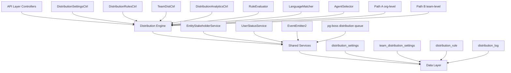

## Overview

The Distribution Module automates lead assignment within organizations. When a new lead is created, the system evaluates org-defined rules to automatically assign the lead to the most appropriate agent — based on lead attributes, UserStatus online/away state, working-hours eligibility, language compatibility, and capacity.

<Info>
**Module Status:** Active — fully implemented  
**Module Path:** `src/modules/crm/distribution/`
</Info>

### Design Principles

<CardGroup cols={2}>
  <Card title="Async Distribution" icon="clock">
    `createLead()` emits `LEAD_CREATED` after commit; a pg-boss worker handles distribution
  </Card>
  <Card title="Stakeholder System Reuse" icon="users">
    Distribution creates `EntityStakeholder` records via `EntityStakeholderService`
  </Card>
  <Card title="First-Match-Wins Rules" icon="trophy">
    Rules are evaluated top-to-bottom by priority; the first matching rule wins
  </Card>
  <Card title="Idempotency" icon="shield-check">
    Distribution engine checks for existing stakeholders or pending offers before running
  </Card>
</CardGroup>

<Warning>
**No Retroactive Distribution:** Existing leads are unaffected when rules are created; only new leads trigger distribution.
</Warning>

### Distribution Paths

The engine supports two execution paths:

<Tabs>
  <Tab title="Path A - Org-level">
    **Org-level distribution** (`runDistribution`): triggered when a lead enters the org with no team context. Evaluates org-scoped rules, applies the org default method, and can bridge to Path B if a rule or default method routes to a team that has `distributionEnabled = true`.
  </Tab>
  <Tab title="Path B - Team-level">
    **Team-level distribution** (`runTeamDistribution`): triggered directly when:
    - A lead is created with a `teamId` in the event payload
    - A bulk-imported lead has a team-only assignment
    - Path A determines the lead belongs to an auto-distributing team
    - Idempotency check finds a single team-only stakeholder with auto-distribute enabled
  </Tab>
</Tabs>

## Architecture

### High-Level System Design



### Component Responsibilities

<AccordionGroup>
  <Accordion title="DistributionEngine">
    Orchestrator: receives a lead, evaluates rules, selects agent, creates assignment. Supports Path A (org) and Path B (team).
  </Accordion>
  
  <Accordion title="RuleEvaluator">
    Evaluates rule conditions against lead data; returns first matching rule
  </Accordion>
  
  <Accordion title="LanguageMatcher">
    Filters and ranks agents by language compatibility with the lead's person
  </Accordion>
  
  <Accordion title="AgentSelector">
    Applies the distribution method (round-robin, weighted, weighted-round-robin, direct) to the filtered agent pool
  </Accordion>
  
  <Accordion title="DistributionCapacityService">
    Two-phase capacity enforcement: Phase 1 `filterByCapacity()` (lead counts vs limits); Phase 2 `confirmCapacityAndAssign()` (advisory locks + atomic stakeholder creation)
  </Accordion>
</AccordionGroup>

## Entity Specifications

### DistributionSettings (1 per org)

Org-level configuration for the distribution engine. Auto-created with defaults on first access via `getOrgSettingsRaw()`.

<Note>
Unique constraint on `organization_id`
</Note>

| Column | Type | Notes |
|--------|------|-------|
| `id` | uuid PK | Primary key |
| `organization_id` | uuid FK UNIQUE | RLS enforcement |
| `distribution_enabled` | bool | Default `false`. Master on/off switch |
| `max_active_leads_per_agent` | int | Default 50 |
| `max_new_leads_per_day` | int | Default 15 |
| `capacity_enforcement_enabled` | bool | Default `false` |
| `respect_business_hours` | bool | Default `true` |
| `outside_hours_action` | enum | `QUEUE`, `POOL`, `DUTY_AGENT` |
| `duty_agent_id` | uuid FK nullable | Used when `outside_hours_action = DUTY_AGENT` |
| `default_method` | enum | `ROUND_ROBIN`, `POOL`, `WEIGHTED`, `WEIGHTED_ROUND_ROBIN` |

### TeamDistributionSettings

Team-level overrides for distribution behavior.

| Column | Type | Notes |
|--------|------|-------|
| `id` | uuid PK | Primary key |
| `organization_id` | uuid FK | RLS enforcement |
| `team_id` | uuid FK UNIQUE | One record per team |
| `distribution_enabled` | bool | Default `false` |
| `max_active_leads_per_agent` | int nullable | Org fallback if null |
| `max_new_leads_per_day` | int nullable | Org fallback if null |
| `capacity_enforcement_enabled` | bool nullable | Org fallback if null |
| `default_method` | enum nullable | Org fallback if null |

### DistributionRule

Rule-based assignment logic with condition evaluation.

<Tip>
Rules are evaluated in priority order (ascending). First match wins.
</Tip>

| Column | Type | Notes |
|--------|------|-------|
| `id` | uuid PK | Primary key |
| `organization_id` | uuid FK | RLS enforcement |
| `team_id` | uuid FK nullable | Team-scoped rules |
| `name` | varchar(255) | User-friendly name |
| `priority` | int | Lower = higher priority |
| `is_active` | bool | Default `true` |
| `conditions` | JSONB | Rule conditions structure |
| `action` | JSONB | Assignment action configuration |

### DistributionLog

Audit trail for all distribution decisions and outcomes.

| Column | Type | Notes |
|--------|------|-------|
| `id` | uuid PK | Primary key |
| `organization_id` | uuid FK | RLS enforcement |
| `team_id` | uuid FK nullable | Set for team-level distributions |
| `lead_id` | uuid FK | Target lead |
| `assigned_agent_id` | uuid FK nullable | Successful assignment |
| `rule_id` | uuid FK nullable | Applied rule |
| `distribution_method` | enum | Method used |
| `status` | enum | `SUCCESS`, `NO_AGENTS`, `CAPACITY_FULL`, `ERROR` |
| `details` | JSONB | Additional context and metadata |

## Distribution Engine

### Core Distribution Flow

<Steps>
  <Step title="Event Trigger">
    Lead creation emits `LEAD_CREATED` event, enqueuing pg-boss distribution job
  </Step>
  
  <Step title="Path Selection">
    Engine determines Path A (org-level) or Path B (team-level) based on context
  </Step>
  
  <Step title="Rule Evaluation">
    RuleEvaluator processes conditions against lead data in priority order
  </Step>
  
  <Step title="Agent Pool Filtering">
    Apply filters: online status, working hours, language compatibility, capacity
  </Step>
  
  <Step title="Agent Selection">
    AgentSelector applies distribution method to filtered pool
  </Step>
  
  <Step title="Assignment Creation">
    Create EntityStakeholder record and log distribution outcome
  </Step>
</Steps>

### Rule Evaluation Logic

Rules support complex condition evaluation with the following structure:

```json
{
  "operator": "AND|OR",
  "conditions": [
    {
      "field": "person.firstName",
      "operator": "EQUALS|CONTAINS|STARTS_WITH|IN|GREATER_THAN",
      "value": "comparison_value",
      "caseSensitive": false
    }
  ],
  "groups": [
    {
      "operator": "AND|OR", 
      "conditions": [...]
    }
  ]
}
```

<Warning>
**Field Path Validation:** Only whitelisted field paths are allowed for security. See `ALLOWED_FIELD_PATHS` in RuleEvaluator.
</Warning>

### Distribution Methods

<Tabs>
  <Tab title="Round Robin">
    Cycles through agents based on last assignment tracking. Uses `user_metadata.lastAssignedAt` timestamp.
  </Tab>
  
  <Tab title="Weighted">
    Random selection with agent-specific weights. Higher weights = higher selection probability.
  </Tab>
  
  <Tab title="Weighted Round Robin">
    Combines round-robin fairness with weighted preferences. Maintains selection ratios over time.
  </Tab>
  
  <Tab title="Pool Assignment">
    Assigns to team/pool without specific agent selection. Creates team-level stakeholder record.
  </Tab>
</Tabs>

## pg-boss Job Configuration

The distribution system uses pg-boss for reliable async processing.

### Job Configuration

```typescript
{
  name: 'distribution',
  retry: 3,
  retryDelay: 30,
  retryBackoff: true,
  expireInHours: 24,
  singletonKey: (data) => `${data.organizationId}-${data.leadId}`,
  deadletter: 'distribution-failed'
}
```

<Note>
**Singleton Guarantee:** Each lead can only have one active distribution job using the singleton key pattern.
</Note>

### Error Handling

<CodeGroup>
```typescript Retry Logic
// Automatic retry for transient failures
const retryableErrors = [
  'CONNECTION_ERROR',
  'TIMEOUT_ERROR', 
  'CAPACITY_LOCK_FAILED'
];

if (retryableErrors.includes(error.code)) {
  throw error; // pg-boss will retry
}
```

```typescript Dead Letter
// Non-retryable errors go to dead letter queue
const fatalErrors = [
  'LEAD_NOT_FOUND',
  'ORG_NOT_FOUND',
  'INVALID_CONFIGURATION'
];

if (fatalErrors.includes(error.code)) {
  await this.logError(error);
  return; // Job completes without retry
}
```
</CodeGroup>

## API Endpoints

### Distribution Settings

<AccordionGroup>
  <Accordion title="GET /v1/distribution/settings">
    **Description:** Retrieve org-level distribution settings
    
    **Response:**
    ```json
    {
      "distributionEnabled": true,
      "maxActiveLeadsPerAgent": 50,
      "maxNewLeadsPerDay": 15,
      "capacityEnforcementEnabled": false,
      "respectBusinessHours": true,
      "outsideHoursAction": "QUEUE",
      "defaultMethod": "ROUND_ROBIN"
    }
    ```
  </Accordion>
  
  <Accordion title="PUT /v1/distribution/settings">
    **Description:** Update org-level distribution settings
    
    **Request Body:** Partial settings object
    **Validation:** Schema validation with business rule checks
  </Accordion>
</AccordionGroup>

### Distribution Rules

<AccordionGroup>
  <Accordion title="GET /v1/distribution/rules">
    **Description:** List distribution rules with filtering
    
    **Query Parameters:**
    - `teamId` (optional): Filter by team
    - `isActive` (optional): Filter by active status
    - `page`, `limit`: Pagination
  </Accordion>
  
  <Accordion title="POST /v1/distribution/rules">
    **Description:** Create new distribution rule
    
    **Request Body:**
    ```json
    {
      "name": "Enterprise Leads",
      "priority": 10,
      "teamId": "uuid",
      "conditions": { /* condition object */ },
      "action": {
        "type": "ASSIGN_TO_AGENT",
        "agentId": "uuid",
        "method": "ROUND_ROBIN"
      }
    }
    ```
  </Accordion>
</AccordionGroup>

### Team Distribution

<AccordionGroup>
  <Accordion title="GET /v1/teams/:teamId/distribution">
    **Description:** Get team distribution settings and status
  </Accordion>
  
  <Accordion title="PUT /v1/teams/:teamId/distribution">
    **Description:** Update team distribution configuration
  </Accordion>
</AccordionGroup>

## Security & Permissions

### Role-Based Access Control

<Tabs>
  <Tab title="Admin">
    - Full access to all distribution settings
    - Can create/modify/delete rules
    - Can view all distribution logs
    - Can override assignments
  </Tab>
  
  <Tab title="Manager">
    - Can modify settings for managed teams
    - Can create team-scoped rules
    - Can view team distribution analytics
    - Cannot modify org-level settings
  </Tab>
  
  <Tab title="Agent">
    - Read-only access to own assignment history
    - Can view capacity status
    - Cannot modify any settings
  </Tab>
</Tabs>

### Row-Level Security (RLS)

All distribution entities enforce RLS based on `organization_id`:

<CodeGroup>
```sql Organization Policy
CREATE POLICY distribution_settings_org_policy 
ON distribution_settings
FOR ALL
TO authenticated
USING (organization_id = get_current_org_id());
```

```sql Team Policy  
CREATE POLICY team_distribution_org_policy
ON team_distribution_settings  
FOR ALL
TO authenticated
USING (organization_id = get_current_org_id());
```
</CodeGroup>

## Observability & Audit

### Distribution Logging

Every distribution attempt is logged with comprehensive details:

```json
{
  "leadId": "uuid",
  "organizationId": "uuid", 
  "teamId": "uuid",
  "ruleId": "uuid",
  "distributionMethod": "ROUND_ROBIN",
  "status": "SUCCESS",
  "assignedAgentId": "uuid",
  "details": {
    "candidateCount": 5,
    "executionTimeMs": 150,
    "filters": ["ONLINE", "CAPACITY", "WORKING_HOURS"],
    "metadata": {}
  }
}
```

### Metrics & Monitoring

<CardGroup cols={2}>
  <Card title="Distribution Success Rate" icon="chart-line">
    Track successful assignments vs failures by org/team
  </Card>
  
  <Card title="Agent Workload Balance" icon="balance-scale">
    Monitor lead distribution fairness across agents
  </Card>
  
  <Card title="Capacity Utilization" icon="gauge">
    Track agent capacity usage and bottlenecks
  </Card>
  
  <Card title="Rule Performance" icon="stopwatch">
    Measure rule evaluation time and match rates
  </Card>
</CardGroup>

## Analytics & Metrics

### Distribution Analytics API

<AccordionGroup>
  <Accordion title="GET /v1/distribution/analytics/overview">
    **Description:** High-level distribution metrics
    
    **Response:**
    ```json
    {
      "totalDistributions": 1250,
      "successRate": 0.92,
      "averageAssignmentTime": "2.3s",
      "topPerformingRules": [...],
      "agentWorkloadBalance": {...}
    }
    ```
  </Accordion>
  
  <Accordion title="GET /v1/distribution/analytics/agents">
    **Description:** Agent-specific distribution metrics
    
    **Query Parameters:**
    - `dateRange`: Filter by time period
    - `teamId`: Filter by team
    - `includeCapacity`: Include capacity utilization
  </Accordion>
</AccordionGroup>

### Real-time Dashboards

<Tip>
The analytics endpoints support real-time data for dashboard integration with WebSocket updates for live metrics.
</Tip>

## Edge Case Handling

### Capacity Management

<Steps>
  <Step title="Phase 1 - Soft Filtering">
    `filterByCapacity()` removes agents over limits based on current counts
  </Step>
  
  <Step title="Phase 2 - Hard Enforcement">
    `confirmCapacityAndAssign()` uses advisory locks for atomic validation
  </Step>
  
  <Step title="Race Condition Protection">
    PostgreSQL advisory locks prevent concurrent assignment conflicts
  </Step>
</Steps>

### Business Hours Handling

When `respectBusinessHours = true` and outside business hours:

<Tabs>
  <Tab title="QUEUE Action">
    Distribution is deferred until next business hours. Job remains in queue.
  </Tab>
  
  <Tab title="POOL Action">
    Lead is assigned to team pool without specific agent selection.
  </Tab>
  
  <Tab title="DUTY_AGENT Action">
    Lead is assigned to the designated on-call duty agent.
  </Tab>
</Tabs>

<Warning>
**Timezone Considerations:** Business hours are evaluated in the organization's configured timezone using `Organization.settings.businessHours.timezone`.
</Warning>

## Performance & Scaling

### Database Optimizations

<CodeGroup>
```sql Indexes
-- Distribution rule evaluation
CREATE INDEX idx_distribution_rules_active_priority 
ON distribution_rules (organization_id, team_id, is_active, priority);

-- Capacity queries  
CREATE INDEX idx_entity_stakeholder_capacity
ON entity_stakeholder (agent_id, entity_type, status, created_at);

-- Analytics queries
CREATE INDEX idx_distribution_log_analytics
ON distribution_log (organization_id, created_at, status, team_id);
```

```sql Partitioning
-- Partition distribution_log by month for large datasets
CREATE TABLE distribution_log_y2024m01 
PARTITION OF distribution_log
FOR VALUES FROM ('2024-01-01') TO ('2024-02-01');
```
</CodeGroup>

### Caching Strategy

<CardGroup cols={2}>
  <Card title="Settings Cache" icon="cache">
    Redis cache for org/team distribution settings (TTL: 5 minutes)
  </Card>
  
  <Card title="Agent Status Cache" icon="user-clock">
    Redis cache for agent online/offline status (TTL: 30 seconds)
  </Card>
  
  <Card title="Capacity Cache" icon="memory">
    In-memory cache for agent capacity counts (TTL: 1 minute)
  </Card>
  
  <Card title="Rule Cache" icon="list">
    Redis cache for active distribution rules (TTL: 10 minutes)
  </Card>
</CardGroup>

## Module Structure

```
src/modules/crm/distribution/
├── controllers/
│   ├── distribution-settings.controller.ts
│   ├── distribution-rules.controller.ts  
│   ├── team-distribution.controller.ts
│   └── distribution-analytics.controller.ts
├── services/
│   ├── distribution-engine.service.ts
│   ├── rule-evaluator.service.ts
│   ├── agent-selector.service.ts
│   ├── language-matcher.service.ts
│   └── distribution-capacity.service.ts
├── entities/
│   ├── distribution-settings.entity.ts
│   ├── team-distribution-settings.entity.ts
│   ├── distribution-rule.entity.ts
│   └── distribution-log.entity.ts
├── jobs/
│   ├── distribution.handler.ts
│   └── distribution.listener.ts
├── dto/
│   ├── distribution-settings.dto.ts
│   ├── distribution-rule.dto.ts
│   └── distribution-analytics.dto.ts
└── types/
    ├── distribution.types.ts
    ├── rule-condition.types.ts
    └── agent-selection.types.ts
```

## Integration Points

### EntityStakeholder Integration

<Note>
Distribution creates standard `EntityStakeholder` records with `role = 'ASSIGNED'` and `assignmentType = 'AUTO'` for tracking automatic assignments.
</Note>

### UserStatus Integration

Real-time agent availability through UserStatus service:

```typescript
const onlineAgents = await this.userStatusService
  .filterByStatus(candidates, ['ONLINE']);

const workingHoursAgents = await this.userStatusService
  .filterByWorkingHours(onlineAgents);
```

### Organization Settings

Business hours configuration from `Organization.settings.businessHours`:

```json
{
  "enabled": true,
  "timezone": "America/New_York",
  "schedule": {
    "monday": { "start": "09:00", "end": "17:00" },
    "tuesday": { "start": "09:00", "end": "17:00" }
  }
}
```

## Environment Configuration

<AccordionGroup>
  <Accordion title="Distribution Settings">
    ```env
    DISTRIBUTION_ENABLED=true
    DISTRIBUTION_QUEUE_CONCURRENCY=5
    DISTRIBUTION_RETRY_ATTEMPTS=3
    DISTRIBUTION_RETRY_DELAY=30000
    ```
  </Accordion>
  
  <Accordion title="Performance Tuning">
    ```env
    DISTRIBUTION_CACHE_TTL=300
    DISTRIBUTION_BATCH_SIZE=100
    DISTRIBUTION_TIMEOUT_MS=30000
    DISTRIBUTION_ADVISORY_LOCK_TIMEOUT=5000
    ```
  </Accordion>
  
  <Accordion title="Feature Flags">
    ```env
    ENABLE_CAPACITY_ENFORCEMENT=true
    ENABLE_LANGUAGE_MATCHING=true
    ENABLE_WEIGHTED_DISTRIBUTION=true
    ENABLE_DISTRIBUTION_ANALYTICS=true
    ```
  </Accordion>
</AccordionGroup>

<Check>
The Distribution Module is fully implemented and production-ready with comprehensive error handling, observability, and scalability features.
</Check>