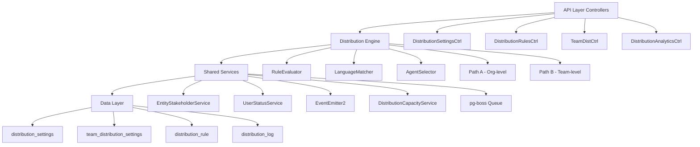

# Distribution Module - Final Specification

<Info>
**Status:** Active — fully implemented  
**Module Path:** `src/modules/crm/distribution/`
</Info>

## Overview

The Distribution Module automates lead assignment within organizations. When a new lead is created, the system evaluates org-defined rules to automatically assign the lead to the most appropriate agent — based on lead attributes, UserStatus online/away state, working-hours eligibility, language compatibility, and capacity.

### Design Principles

<CardGroup cols={2}>
  <Card title="Async Distribution" icon="clock">
    `createLead()` emits `LEAD_CREATED` after commit; a pg-boss worker handles distribution. Listener/emit failures are logged only — HTTP lead creation still returns success.
  </Card>
  <Card title="Stakeholder System Reuse" icon="recycle">
    Distribution creates `EntityStakeholder` records via `EntityStakeholderService`, not a new paradigm.
  </Card>
  <Card title="First-Match-Wins Rules" icon="trophy">
    Rules are evaluated top-to-bottom by priority; the first matching rule wins.
  </Card>
  <Card title="Idempotency" icon="shield-check">
    Distribution engine checks for existing stakeholders or pending offers before running.
  </Card>
</CardGroup>

<Note>
**No retroactive distribution**: Existing leads are unaffected when rules are created; only new leads trigger distribution.
</Note>

### Distribution Paths

The engine supports two execution paths:

**Path A — Org-level distribution** (`runDistribution`): triggered when a lead enters the org with no team context. Evaluates org-scoped rules, applies the org default method, and can bridge to Path B if a rule or default method routes to a team that has `distributionEnabled = true`.

**Path B — Team-level distribution** (`runTeamDistribution`): triggered directly when:
- A lead is created with a `teamId` in the event payload (team pool assignment)
- A bulk-imported lead has a team-only assignment
- Path A determines the lead belongs to an auto-distributing team
- Idempotency check finds a single team-only stakeholder with auto-distribute enabled

## Architecture

### High-Level Diagram



### Component Responsibilities

<AccordionGroup>
  <Accordion title="DistributionEngine">
    Orchestrator: receives a lead, evaluates rules, selects agent, creates assignment. Supports Path A (org) and Path B (team).
  </Accordion>
  
  <Accordion title="RuleEvaluator">
    Evaluates rule conditions against lead data; returns first matching rule.
  </Accordion>
  
  <Accordion title="LanguageMatcher">
    Filters and ranks agents by language compatibility with the lead's person.
  </Accordion>
  
  <Accordion title="AgentSelector">
    Applies the distribution method (round-robin, weighted, weighted-round-robin, direct) to the filtered agent pool.
  </Accordion>
  
  <Accordion title="DistributionCapacityService">
    Two-phase capacity enforcement: Phase 1 `filterByCapacity()` (lead counts vs limits); Phase 2 `confirmCapacityAndAssign()` (advisory locks + atomic stakeholder creation).
  </Accordion>
  
  <Accordion title="UserStatusService">
    Pre-filters candidate agents to ONLINE status; filters by per-user working hours; provides `isWithinWorkingHours()` for org-level business hours check.
  </Accordion>
</AccordionGroup>

## Entity Specifications

### DistributionSettings (1 per org)

Org-level configuration for the distribution engine. Auto-created with defaults on first access via `getOrgSettingsRaw()`. Unique constraint on `organization_id`.

<CodeGroup>
```typescript Entity Definition
interface DistributionSettings {
  id: string; // uuid PK
  organization_id: string; // uuid FK UNIQUE, RLS
  distribution_enabled: boolean; // default false
  max_active_leads_per_agent: number; // default 50
  max_new_leads_per_day: number; // default 10
  default_distribution_method: DistributionMethod; // default 'round_robin'
  business_hours_enabled: boolean; // default false
  business_hours_timezone: string; // default 'UTC'
  business_hours_config: BusinessHoursConfig;
  language_matching_enabled: boolean; // default false
  language_matching_strategy: 'strict' | 'fallback'; // default 'fallback'
  auto_assign_new_agents: boolean; // default true
  created_at: Date;
  updated_at: Date;
}
```

```sql Database Schema
CREATE TABLE distribution_settings (
  id UUID PRIMARY KEY DEFAULT gen_random_uuid(),
  organization_id UUID NOT NULL UNIQUE REFERENCES organizations(id) ON DELETE CASCADE,
  distribution_enabled BOOLEAN NOT NULL DEFAULT false,
  max_active_leads_per_agent INTEGER NOT NULL DEFAULT 50,
  max_new_leads_per_day INTEGER NOT NULL DEFAULT 10,
  default_distribution_method distribution_method NOT NULL DEFAULT 'round_robin',
  business_hours_enabled BOOLEAN NOT NULL DEFAULT false,
  business_hours_timezone TEXT NOT NULL DEFAULT 'UTC',
  business_hours_config JSONB NOT NULL DEFAULT '{}',
  language_matching_enabled BOOLEAN NOT NULL DEFAULT false,
  language_matching_strategy TEXT NOT NULL DEFAULT 'fallback',
  auto_assign_new_agents BOOLEAN NOT NULL DEFAULT true,
  created_at TIMESTAMPTZ NOT NULL DEFAULT NOW(),
  updated_at TIMESTAMPTZ NOT NULL DEFAULT NOW()
);
```
</CodeGroup>

### TeamDistributionSettings (0..1 per team)

Team-level overrides for distribution configuration. If a team has no record, it inherits from org settings.

<CodeGroup>
```typescript Entity Definition
interface TeamDistributionSettings {
  id: string;
  organization_id: string; // RLS
  team_id: string; // unique
  distribution_enabled: boolean;
  max_active_leads_per_agent?: number; // nullable override
  max_new_leads_per_day?: number; // nullable override
  distribution_method: DistributionMethod;
  language_matching_enabled?: boolean; // nullable override
  language_matching_strategy?: 'strict' | 'fallback';
  created_at: Date;
  updated_at: Date;
}
```

```sql Database Schema
CREATE TABLE team_distribution_settings (
  id UUID PRIMARY KEY DEFAULT gen_random_uuid(),
  organization_id UUID NOT NULL REFERENCES organizations(id) ON DELETE CASCADE,
  team_id UUID NOT NULL UNIQUE REFERENCES teams(id) ON DELETE CASCADE,
  distribution_enabled BOOLEAN NOT NULL DEFAULT true,
  max_active_leads_per_agent INTEGER,
  max_new_leads_per_day INTEGER,
  distribution_method distribution_method NOT NULL DEFAULT 'round_robin',
  language_matching_enabled BOOLEAN,
  language_matching_strategy TEXT,
  created_at TIMESTAMPTZ NOT NULL DEFAULT NOW(),
  updated_at TIMESTAMPTZ NOT NULL DEFAULT NOW()
);
```
</CodeGroup>

### DistributionRule

Conditional logic for lead assignment. Rules are evaluated in priority order (ascending).

<CodeGroup>
```typescript Entity Definition
interface DistributionRule {
  id: string;
  organization_id: string; // RLS
  team_id?: string; // nullable for org-wide rules
  name: string;
  description?: string;
  priority: number; // lower = higher priority
  is_active: boolean;
  conditions: RuleCondition[];
  action: RuleAction;
  created_at: Date;
  updated_at: Date;
}

interface RuleCondition {
  field: string; // e.g., 'lead.source', 'lead.value', 'person.country'
  operator: 'equals' | 'not_equals' | 'contains' | 'not_contains' | 'greater_than' | 'less_than' | 'in' | 'not_in';
  value: any;
}

interface RuleAction {
  type: 'assign_to_agent' | 'assign_to_team' | 'use_distribution_method';
  target_agent_id?: string;
  target_team_id?: string;
  distribution_method?: DistributionMethod;
}
```

```sql Database Schema
CREATE TABLE distribution_rules (
  id UUID PRIMARY KEY DEFAULT gen_random_uuid(),
  organization_id UUID NOT NULL REFERENCES organizations(id) ON DELETE CASCADE,
  team_id UUID REFERENCES teams(id) ON DELETE CASCADE,
  name TEXT NOT NULL,
  description TEXT,
  priority INTEGER NOT NULL DEFAULT 0,
  is_active BOOLEAN NOT NULL DEFAULT true,
  conditions JSONB NOT NULL DEFAULT '[]',
  action JSONB NOT NULL,
  created_at TIMESTAMPTZ NOT NULL DEFAULT NOW(),
  updated_at TIMESTAMPTZ NOT NULL DEFAULT NOW()
);
```
</CodeGroup>

### DistributionLog

Audit trail for all distribution attempts and outcomes.

<CodeGroup>
```typescript Entity Definition
interface DistributionLog {
  id: string;
  organization_id: string; // RLS
  team_id?: string; // nullable, set for Path B
  lead_id: string;
  assigned_agent_id?: string; // nullable if assignment failed
  rule_id?: string; // nullable if no rule matched
  distribution_method: DistributionMethod;
  status: 'success' | 'failed' | 'no_agents_available';
  failure_reason?: string;
  agent_pool_size: number;
  processing_duration_ms: number;
  created_at: Date;
}
```

```sql Database Schema
CREATE TABLE distribution_logs (
  id UUID PRIMARY KEY DEFAULT gen_random_uuid(),
  organization_id UUID NOT NULL REFERENCES organizations(id) ON DELETE CASCADE,
  team_id UUID REFERENCES teams(id) ON DELETE CASCADE,
  lead_id UUID NOT NULL REFERENCES leads(id) ON DELETE CASCADE,
  assigned_agent_id UUID REFERENCES users(id) ON DELETE SET NULL,
  rule_id UUID REFERENCES distribution_rules(id) ON DELETE SET NULL,
  distribution_method distribution_method NOT NULL,
  status TEXT NOT NULL,
  failure_reason TEXT,
  agent_pool_size INTEGER NOT NULL DEFAULT 0,
  processing_duration_ms INTEGER NOT NULL DEFAULT 0,
  created_at TIMESTAMPTZ NOT NULL DEFAULT NOW()
);
```
</CodeGroup>

## Type Definitions

<CodeGroup>
```typescript Distribution Types
type DistributionMethod = 'round_robin' | 'weighted' | 'weighted_round_robin' | 'direct';

interface BusinessHoursConfig {
  [key: string]: { // day of week (monday, tuesday, etc.)
    enabled: boolean;
    start_time: string; // HH:MM format
    end_time: string;   // HH:MM format
  };
}

interface DistributionJobPayload {
  leadId: string;
  organizationId: string;
  teamId?: string; // for Path B
  triggeredBy?: string;
  metadata?: Record<string, any>;
}

interface AgentCandidate {
  user_id: string;
  weight?: number;
  languages?: string[];
  current_lead_count: number;
  todays_lead_count: number;
}

interface DistributionResult {
  success: boolean;
  assigned_agent_id?: string;
  rule_id?: string;
  distribution_method: DistributionMethod;
  failure_reason?: string;
  agent_pool_size: number;
  processing_duration_ms: number;
}
```
</CodeGroup>

## Distribution Engine

### Core Algorithm

<Steps>
<Step title="Idempotency Check">
Check if lead already has stakeholders or pending distribution jobs to avoid duplicate assignment.
</Step>

<Step title="Settings Validation">
Verify distribution is enabled for the organization/team and load configuration.
</Step>

<Step title="Business Hours Gating">
If business hours are enabled, check if current time falls within configured hours.
</Step>

<Step title="Agent Pool Discovery">
Find eligible agents based on team membership, online status, and working hours.
</Step>

<Step title="Rule Evaluation">
Evaluate distribution rules in priority order; use first matching rule or fallback to default method.
</Step>

<Step title="Language Filtering">
If language matching is enabled, filter agents by language compatibility with the lead's person.
</Step>

<Step title="Capacity Filtering">
Remove agents who have reached their lead limits (active leads or daily new leads).
</Step>

<Step title="Agent Selection">
Apply the distribution method to select the final agent from the filtered pool.
</Step>

<Step title="Assignment & Audit">
Create EntityStakeholder record and log the distribution attempt in DistributionLog.
</Step>
</Steps>

### Distribution Methods

<Tabs>
<Tab title="Round Robin">
```typescript
// Selects next agent based on last assignment order
// Maintains fairness across all eligible agents
async selectByRoundRobin(agents: AgentCandidate[], context: DistributionContext): Promise<string> {
  const lastAssigned = await this.getLastAssignedAgent(context.organizationId, context.teamId);
  const sortedAgents = this.rotateAgentsFromLast(agents, lastAssigned);
  return sortedAgents[0].user_id;
}
```
</Tab>

<Tab title="Weighted">
```typescript
// Selects agent based on weighted probability
// Higher weight = higher chance of selection
async selectByWeighted(agents: AgentCandidate[]): Promise<string> {
  const totalWeight = agents.reduce((sum, agent) => sum + (agent.weight || 1), 0);
  const random = Math.random() * totalWeight;
  
  let cumulative = 0;
  for (const agent of agents) {
    cumulative += (agent.weight || 1);
    if (random <= cumulative) {
      return agent.user_id;
    }
  }
  
  return agents[0].user_id; // fallback
}
```
</Tab>

<Tab title="Weighted Round Robin">
```typescript
// Combines round robin fairness with weighted distribution
// Each agent gets multiple "slots" based on their weight
async selectByWeightedRoundRobin(agents: AgentCandidate[], context: DistributionContext): Promise<string> {
  const expandedPool = this.expandAgentsByWeight(agents);
  const lastAssigned = await this.getLastAssignedAgent(context.organizationId, context.teamId);
  const rotated = this.rotateAgentsFromLast(expandedPool, lastAssigned);
  return rotated[0].user_id;
}
```
</Tab>

<Tab title="Direct">
```typescript
// Assigns to specific agent (used by rules)
async selectDirect(targetAgentId: string, agents: AgentCandidate[]): Promise<string> {
  const targetAgent = agents.find(agent => agent.user_id === targetAgentId);
  if (!targetAgent) {
    throw new Error(`Target agent ${targetAgentId} not found in eligible pool`);
  }
  return targetAgentId;
}
```
</Tab>
</Tabs>

## pg-boss Job Configuration

<CodeGroup>
```typescript Job Setup
// Job registration in DistributionModule
@Injectable()
export class DistributionJobHandler {
  constructor(
    private readonly pgBoss: PgBossService,
    private readonly distributionEngine: DistributionEngine,
  ) {}

  async onModuleInit() {
    await this.pgBoss.work(
      'distribution.process-lead',
      {
        teamSize: 5,
        teamConcurrency: 2,
        retryLimit: 3,
        retryDelay: 30000, // 30 seconds
        expireInHours: 24,
      },
      this.processDistribution.bind(this)
    );
  }

  async processDistribution(job: Job<DistributionJobPayload>) {
    const { leadId, organizationId, teamId } = job.data;
    
    try {
      if (teamId) {
        await this.distributionEngine.runTeamDistribution(leadId, teamId);
      } else {
        await this.distributionEngine.runDistribution(leadId, organizationId);
      }
    } catch (error) {
      this.logger.error('Distribution job failed', { 
        jobId: job.id, 
        leadId, 
        error: error.message 
      });
      throw error; // Triggers retry
    }
  }
}
```

```typescript Job Enqueueing
// Event listener for LEAD_CREATED
@Injectable()
export class DistributionListener {
  @OnEvent('LEAD_CREATED')
  async handleLeadCreated(payload: LeadCreatedEvent) {
    try {
      if (payload.skipDistribution) return;

      const settings = await this.getDistributionSettings(payload.organizationId);
      if (!settings.distribution_enabled) return;

      await this.pgBoss.send('distribution.process-lead', {
        leadId: payload.leadId,
        organizationId: payload.organizationId,
        teamId: payload.teamId,
        triggeredBy: 'LEAD_CREATED',
        metadata: { source: payload.source }
      }, {
        singletonKey: `lead-${payload.leadId}`, // Prevent duplicates
        retryLimit: 3,
        startAfter: 5, // 5 second delay
      });

    } catch (error) {
      this.logger.error('Failed to enqueue distribution job', {
        leadId: payload.leadId,
        error: error.message
      });
      // Don't throw - lead creation should still succeed
    }
  }
}
```
</CodeGroup>

## API Endpoints

### Distribution Settings

<CodeGroup>
```http GET /v1/distribution/settings
GET /v1/distribution/settings HTTP/1.1
Authorization: Bearer {token}

Response:
{
  "distribution_enabled": true,
  "max_active_leads_per_agent": 50,
  "max_new_leads_per_day": 10,
  "default_distribution_method": "round_robin",
  "business_hours_enabled": false,
  "business_hours_timezone": "UTC",
  "business_hours_config": {},
  "language_matching_enabled": true,
  "language_matching_strategy": "fallback",
  "auto_assign_new_agents": true
}
```

```http PUT /v1/distribution/settings
PUT /v1/distribution/settings HTTP/1.1
Authorization: Bearer {token}
Content-Type: application/json

{
  "distribution_enabled": true,
  "max_active_leads_per_agent": 75,
  "business_hours_enabled": true,
  "business_hours_config": {
    "monday": { "enabled": true, "start_time": "09:00", "end_time": "17:00" },
    "tuesday": { "enabled": true, "start_time": "09:00", "end_time": "17:00" }
  }
}
```
</CodeGroup>

### Distribution Rules

<CodeGroup>
```http GET /v1/distribution/rules
GET /v1/distribution/rules HTTP/1.1
Authorization: Bearer {token}

Response:
{
  "data": [
    {
      "id": "rule-123",
      "name": "High Value Leads",
      "priority": 1,
      "is_active": true,
      "conditions": [
        { "field": "lead.value", "operator": "greater_than", "value": 10000 }
      ],
      "action": {
        "type": "assign_to_agent",
        "target_agent_id": "agent-456"
      }
    }
  ],
  "total": 1,
  "page": 1,
  "limit": 20
}
```

```http POST /v1/distribution/rules
POST /v1/distribution/rules HTTP/1.1
Authorization: Bearer {token}
Content-Type: application/json

{
  "name": "Enterprise Leads",
  "description": "Route enterprise leads to senior agents",
  "priority": 5,
  "conditions": [
    { "field": "lead.source", "operator": "equals", "value": "enterprise" }
  ],
  "action": {
    "type": "use_distribution_method",
    "distribution_method": "weighted"
  }
}
```
</CodeGroup>

### Team Distribution Settings

<CodeGroup>
```http GET /v1/teams/{teamId}/distribution/settings
GET /v1/teams/team-123/distribution/settings HTTP/1.1
Authorization: Bearer {token}

Response:
{
  "distribution_enabled": true,
  "max_active_leads_per_agent": 30,
  "max_new_leads_per_day": 8,
  "distribution_method": "weighted_round_robin",
  "language_matching_enabled": true
}
```

```http PUT /v1/teams/{teamId}/distribution/settings
PUT /v1/teams/team-123/distribution/settings HTTP/1.1
Authorization: Bearer {token}
Content-Type: application/json

{
  "distribution_enabled": false,
  "max_active_leads_per_agent": 25,
  "distribution_method": "round_robin"
}
```
</CodeGroup>

### Distribution Analytics

<CodeGroup>
```http GET /v1/distribution/analytics
GET /v1/distribution/analytics HTTP/1.1
Authorization: Bearer {token}
X-Params: period=7d&team_id=team-123

Response:
{
  "total_distributions": 156,
  "successful_distributions": 142,
  "failed_distributions": 14,
  "success_rate": 0.91,
  "avg_processing_time_ms": 234,
  "distribution_by_method": {
    "round_robin": 89,
    "weighted": 45,
    "direct": 8
  },
  "distribution_by_agent": [
    { "agent_id": "agent-1", "name": "John Doe", "lead_count": 23 },
    { "agent_id": "agent-2", "name": "Jane Smith", "lead_count": 19 }
  ],
  "failure_reasons": {
    "no_agents_available": 8,
    "capacity_exceeded": 4,
    "business_hours": 2
  }
}
```
</CodeGroup>

## Security & Permissions

<Warning>
All distribution entities include `organization_id` for Row-Level Security (RLS) enforcement. Users can only access distribution settings and rules within their organization.
</Warning>

### Required Permissions

<AccordionGroup>
<Accordion title="Distribution Settings Management">
- `distribution:settings:read` - View distribution settings
- `distribution:settings:write` - Modify distribution settings
- `org:admin` - Full access to organization distribution configuration
</Accordion>

<Accordion title="Distribution Rules Management">
- `distribution:rules:read` - View distribution rules
- `distribution:rules:write` - Create/modify distribution rules
- `distribution:rules:delete` - Delete distribution rules
</Accordion>

<Accordion title="Team Distribution Settings">
- `team:distribution:read` - View team distribution settings
- `team:distribution:write` - Modify team distribution settings
- Must be team member or have `org:admin` permission
</Accordion>

<Accordion title="Distribution Analytics">
- `distribution:analytics:read` - View distribution metrics and reports
- `lead:read` - Required for lead-related distribution data
</Accordion>
</AccordionGroup>

### RLS Policies

<CodeGroup>
```sql Distribution Settings RLS
-- Users can only access their organization's settings
CREATE POLICY distribution_settings_org_access ON distribution_settings
  FOR ALL TO authenticated
  USING (organization_id = current_setting('app.current_organization_id')::UUID);
```

```sql Distribution Rules RLS
-- Users can only access rules in their organization
CREATE POLICY distribution_rules_org_access ON distribution_rules
  FOR ALL TO authenticated  
  USING (organization_id = current_setting('app.current_organization_id')::UUID);

-- Team-specific rules require team membership
CREATE POLICY distribution_rules_team_access ON distribution_rules
  FOR ALL TO authenticated
  USING (
    organization_id = current_setting('app.current_organization_id')::UUID
    AND (
      team_id IS NULL 
      OR team_id IN (
        SELECT team_id FROM team_memberships 
        WHERE user_id = current_setting('app.current_user_id')::UUID
      )
    )
  );
```

```sql Distribution Logs RLS  
-- Users can only view distribution logs for their organization
CREATE POLICY distribution_logs_org_access ON distribution_logs
  FOR SELECT TO authenticated
  USING (organization_id = current_setting('app.current_organization_id')::UUID);
```
</CodeGroup>

## Observability & Audit

### Logging Strategy

<Tabs>
<Tab title="Distribution Events">
```typescript
// Key distribution events logged with structured data
this.logger.info('Distribution started', {
  leadId,
  organizationId,
  teamId,
  path: teamId ? 'team_level' : 'org_level'
});

this.logger.info('Distribution completed', {
  leadId,
  assignedAgentId,
  ruleId,
  distributionMethod,
  processingTimeMs,
  agentPoolSize
});

this.logger.warn('Distribution failed', {
  leadId,
  reason: 'no_agents_available',
  agentPoolSize: 0,
  businessHoursEnabled,
  currentTime
});
```
</Tab>

<Tab title="Performance Metrics">
```typescript
// Track distribution performance
const timer = this.metrics.timer('distribution.processing_time');
const stopTimer = timer.start();

try {
  const result = await this.runDistribution(leadId, organizationId);
  this.metrics.counter('distribution.success').increment();
  this.metrics.histogram('distribution.agent_pool_size').update(result.agent_pool_size);
} catch (error) {
  this.metrics.counter('distribution.failure').increment();
  this.metrics.counter(`distribution.failure.${error.code}`).increment();
} finally {
  stopTimer();
}
```
</Tab>

<Tab title="Capacity Monitoring">
```typescript
// Monitor agent capacity utilization
this.logger.debug('Agent capacity check', {
  agentId,
  currentActiveLeads,
  maxActiveLeads,
  todaysNewLeads,
  maxNewLeadsPerDay,
  capacityUtilization: currentActiveLeads / maxActiveLeads
});

// Alert on high capacity utilization
if (currentActiveLeads / maxActiveLeads > 0.9) {
  this.logger.warn('Agent approaching capacity limit', {
    agentId,
    utilizationPercent: Math.round((currentActiveLeads / maxActiveLeads) * 100)
  });
}
```
</Tab>
</Tabs>

## Analytics & Metrics

### Key Performance Indicators

<CardGroup cols={2}>
<Card title="Distribution Success Rate" icon="chart-line">
Percentage of leads successfully assigned to agents vs. failed distributions
</Card>

<Card title="Processing Time" icon="stopwatch">
Average time from distribution job start to completion (target: <500ms)
</Card>

<Card title="Agent Utilization" icon="users">
Distribution of leads across agents, capacity utilization rates
</Card>

<Card title="Rule Effectiveness" icon="bullseye">
Which rules are matching most frequently, rule hit rates
</Card>
</CardGroup>

### Monitoring Queries

<CodeGroup>
```sql Success Rate by Period
SELECT 
  DATE_TRUNC('day', created_at) as date,
  COUNT(*) as total_distributions,
  COUNT(*) FILTER (WHERE status = 'success') as successful,
  ROUND(
    COUNT(*) FILTER (WHERE status = 'success')::numeric / COUNT(*) * 100, 
    2
  ) as success_rate_pct
FROM distribution_logs 
WHERE created_at >= NOW() - INTERVAL '30 days'
  AND organization_id = $1
GROUP BY DATE_TRUNC('day', created_at)
ORDER BY date DESC;
```

```sql Agent Load Distribution
SELECT 
  u.name as agent_name,
  COUNT(dl.id) as leads_distributed,
  AVG(dl.processing_duration_ms) as avg_processing_time,
  COUNT(*) FILTER (WHERE dl.status = 'success') as successful_assignments
FROM distribution_logs dl
JOIN users u ON u.id = dl.assigned_agent_id
WHERE dl.created_at >= NOW() - INTERVAL '7 days'
  AND dl.organization_id = $1
GROUP BY u.id, u.name
ORDER BY leads_distributed DESC;
```

```sql Rule Performance Analysis
SELECT 
  dr.name as rule_name,
  COUNT(dl.id) as times_matched,
  COUNT(*) FILTER (WHERE dl.status = 'success') as successful_assignments,
  ROUND(AVG(dl.processing_duration_ms), 2) as avg_processing_time
FROM distribution_logs dl
JOIN distribution_rules dr ON dr.id = dl.rule_id  
WHERE dl.created_at >= NOW() - INTERVAL '30 days'
  AND dl.organization_id = $1
GROUP BY dr.id, dr.name
ORDER BY times_matched DESC;
```
</CodeGroup>

## Edge Case Handling

<AccordionGroup>
<Accordion title="No Agents Available">
**Scenario**: All agents are offline, at capacity, or outside working hours.

**Handling**: 
- Log distribution failure with reason `no_agents_available`
- Lead remains unassigned for manual intervention
- Consider implementing escalation rules or overflow agents
</Accordion>

<Accordion title="Agent Deleted During Distribution">
**Scenario**: Target agent is deleted between rule evaluation and assignment.

**Handling**:
- Catch foreign key constraint errors
- Retry distribution with fresh agent pool
- Log incident for investigation
</Accordion>

<Accordion title="Capacity Race Conditions">
**Scenario**: Multiple distributions targeting same agent simultaneously.

**Handling**:
- Use advisory locks in `confirmCapacityAndAssign()`
- Atomic check-and-assign operations
- Retry with different agent if capacity exceeded
</Accordion>

<Accordion title="Invalid Rule Conditions">
**Scenario**: Rule references non-existent lead fields or malformed conditions.

**Handling**:
- Validate rule conditions on creation/update
- Skip invalid rules during evaluation with warning logs
- Fallback to default distribution method
</Accordion>

<Accordion title="Bulk Import Performance">
**Scenario**: Large lead imports triggering thousands of distribution jobs.

**Handling**:
- Batch enqueue distribution jobs in chunks
- Use `skipEmitLeadCreated` flag during import
- Monitor pg-boss queue depth and processing rates
</Accordion>
</AccordionGroup>

## Performance & Scaling

### Optimization Strategies

<Tabs>
<Tab title="Database Indexing">
```sql
-- Core indexes for distribution performance
CREATE INDEX CONCURRENTLY idx_distribution_logs_org_created 
  ON distribution_logs(organization_id, created_at DESC);

CREATE INDEX CONCURRENTLY idx_distribution_rules_org_priority 
  ON distribution_rules(organization_id, priority ASC) 
  WHERE is_active = true;

CREATE INDEX CONCURRENTLY idx_entity_stakeholder_lead_role 
  ON entity_stakeholder(entity_id, entity_type, role) 
  WHERE entity_type = 'LEAD';

-- Partial indexes for capacity queries  
CREATE INDEX CONCURRENTLY idx_entity_stakeholder_active_leads
  ON entity_stakeholder(stakeholder_id) 
  WHERE entity_type = 'LEAD' AND role = 'ASSIGNEE' AND status = 'ACTIVE';
```
</Tab>

<Tab title="Query Optimization">
```typescript
// Optimized agent capacity query with single scan
async getAgentCapacities(agentIds: string[]): Promise<Map<string, AgentCapacity>> {
  const query = `
    SELECT 
      stakeholder_id as agent_id,
      COUNT(*) FILTER (
        WHERE status = 'ACTIVE'
      ) as active_leads,
      COUNT(*) FILTER (
        WHERE status = 'ACTIVE' 
        AND DATE(created_at) = CURRENT_DATE
      ) as todays_leads
    FROM entity_stakeholder es
    JOIN leads l ON l.id = es.entity_id
    WHERE es.entity_type = 'LEAD'
      AND es.role = 'ASSIGNEE' 
      AND es.stakeholder_id = ANY($1)
      AND l.organization_id = $2
    GROUP BY stakeholder_id
  `;
  
  return this.em.execute(query, [agentIds, organizationId]);
}
```
</Tab>

<Tab title="Caching Strategy">
```typescript
// Cache distribution settings with short TTL
@Cacheable('distribution:settings', { ttl: 300 }) // 5 minutes
async getDistributionSettings(organizationId: string): Promise<DistributionSettings> {
  return this.distributionSettingsRepository.findOne({ organization_id: organizationId });
}

// Cache agent eligibility for brief periods
@Cacheable('distribution:agents', { ttl: 60 }) // 1 minute  
async getEligibleAgents(organizationId: string, teamId?: string): Promise<AgentCandidate[]> {
  // Complex query to find online agents with capacity
  return this.buildEligibleAgentsList(organizationId, teamId);
}
```
</Tab>
</Tabs>

### Scaling Considerations

<Note>
**pg-boss Configuration**: Increase `teamSize` and `teamConcurrency` for higher throughput. Monitor queue depth and processing latency.
</Note>

<Warning>
**Advisory Lock Contention**: With high concurrency, advisory locks for capacity checks may become a bottleneck. Consider implementing agent-specific queues or capacity reservations.
</Warning>

<Tip>
**Database Connection Pooling**: Distribution jobs are CPU-bound with frequent DB access. Ensure adequate connection pool sizing for peak distribution loads.
</Tip>

## Module Structure

```
src/modules/crm/distribution/
├── controllers/
│   ├── distribution-settings.controller.ts
│   ├── distribution-rules.controller.ts  
│   ├── team-distribution-settings.controller.ts
│   └── distribution-analytics.controller.ts
├── entities/
│   ├── distribution-settings.entity.ts
│   ├── team-distribution-settings.entity.ts
│   ├── distribution-rule.entity.ts
│   └── distribution-log.entity.ts
├── services/
│   ├── distribution-engine.service.ts
│   ├── distribution-capacity.service.ts
│   ├── rule-evaluator.service.ts
│   ├── language-matcher.service.ts
│   ├── agent-selector.service.ts
│   └── distribution-analytics.service.ts
├── jobs/
│   ├── distribution-job.handler.ts
│   └── distribution.listener.ts
├── dto/
│   ├── distribution-settings.dto.ts
│   ├── distribution-rule.dto.ts
│   ├── team-distribution-settings.dto.ts
│   └── distribution-analytics.dto.ts
├── types/
│   └── distribution.types.ts
└── distribution.module.ts
```

## Integration Points

<CardGroup cols={2}>
<Card title="EntityStakeholder System" icon="link">
Creates ASSIGNEE stakeholder records for lead assignments. Reuses existing audit and relationship infrastructure.
</Card>

<Card title="UserStatus Service" icon="user-clock">
Filters agents by online status and working hours. Integrates with real-time presence system.
</Card>

<Card title="Team Management" icon="users-gear">
Respects team membership and permissions. Supports team-level distribution overrides.
</Card>

<Card title="Lead Lifecycle" icon="arrow-trend-up">
Triggered by LEAD_CREATED events. Participates in lead status transitions and audit trails.
</Card>
</CardGroup>

## Environment Configuration

<CodeGroup>
```env Production Configuration
# Distribution Job Processing
DISTRIBUTION_ENABLED=true
DISTRIBUTION_JOB_CONCURRENCY=5
DISTRIBUTION_JOB_RETRY_LIMIT=3
DISTRIBUTION_JOB_RETRY_DELAY_MS=30000

# Performance Tuning  
DISTRIBUTION_CACHE_TTL_SECONDS=300
DISTRIBUTION_AGENT_QUERY_TIMEOUT_MS=5000
DISTRIBUTION_MAX_AGENT_POOL_SIZE=100

# Monitoring & Alerting
DISTRIBUTION_SUCCESS_RATE_THRESHOLD=0.90
DISTRIBUTION_PROCESSING_TIME_THRESHOLD_MS=1000
DISTRIBUTION_QUEUE_DEPTH_ALERT_THRESHOLD=1000
```

```env Development Configuration  
# Distribution Job Processing
DISTRIBUTION_ENABLED=true
DISTRIBUTION_JOB_CONCURRENCY=2
DISTRIBUTION_JOB_RETRY_LIMIT=1
DISTRIBUTION_JOB_RETRY_DELAY_MS=5000

# Development Optimizations
DISTRIBUTION_CACHE_TTL_SECONDS=60
DISTRIBUTION_AGENT_QUERY_TIMEOUT_MS=2000
DISTRIBUTION_MAX_AGENT_POOL_SIZE=50

# Debug Settings
DISTRIBUTION_DEBUG_LOGGING=true
DISTRIBUTION_SIMULATE_FAILURES=false
```
</CodeGroup>

---

<Check>
The Distribution Module provides a robust, scalable solution for automated lead assignment with comprehensive rule-based routing, capacity management, and detailed audit trails.
</Check>