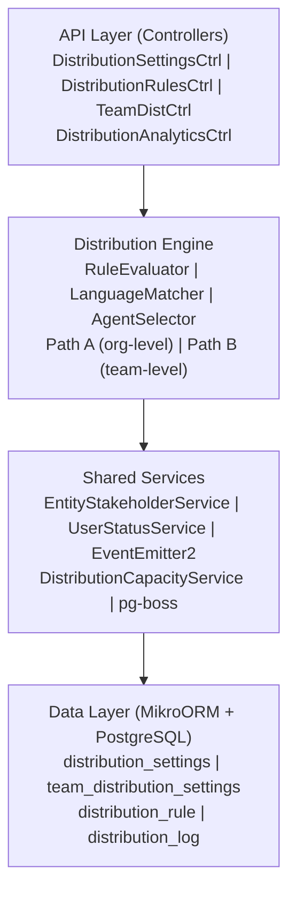

# Distribution Module Specification

<Note>
**Status:** Active — fully implemented  
**Module Path:** `src/modules/crm/distribution/`
</Note>

## Overview

The Distribution Module automates lead assignment within organizations. When a new lead is created, the system evaluates org-defined rules to automatically assign the lead to the most appropriate agent — based on lead attributes, UserStatus online/away state, working-hours eligibility, language compatibility, and capacity.

### Design Principles

<CardGroup cols={2}>
  <Card title="Async Distribution" icon="clock">
    `createLead()` emits `LEAD_CREATED` after commit; a pg-boss worker handles distribution
  </Card>
  <Card title="Stakeholder System Reuse" icon="users">
    Distribution creates `EntityStakeholder` records via `EntityStakeholderService`
  </Card>
  <Card title="First-Match-Wins Rules" icon="trophy">
    Rules are evaluated top-to-bottom by priority; the first matching rule wins
  </Card>
  <Card title="pg-boss Scheduling" icon="gear">
    Distribution queue uses pg-boss for reliability and retry guarantees
  </Card>
</CardGroup>

<Warning>
Listener / emit failures are logged only — HTTP lead creation still returns success; manual assignment or backfill may be needed if enqueue never ran
</Warning>

### Distribution Paths

The engine supports two execution paths:

<Tabs>
  <Tab title="Path A - Org-level">
    **Org-level distribution** (`runDistribution`): triggered when a lead enters the org with no team context. Evaluates org-scoped rules, applies the org default method, and can bridge to Path B if a rule or default method routes to a team that has `distributionEnabled = true`.
  </Tab>
  <Tab title="Path B - Team-level">
    **Team-level distribution** (`runTeamDistribution`): triggered directly when:
    - A lead is created with a `teamId` in the event payload (team pool assignment)
    - Path A determines the lead belongs to an auto-distributing team
    - Idempotency check finds a single team-only stakeholder with auto-distribute enabled
  </Tab>
</Tabs>

## Architecture

### High-Level Diagram



### Component Responsibilities

<AccordionGroup>
  <Accordion title="DistributionEngine">
    Orchestrator: receives a lead, evaluates rules, selects agent, creates assignment. Supports Path A (org) and Path B (team).
  </Accordion>
  <Accordion title="RuleEvaluator">
    Evaluates rule conditions against lead data; returns first matching rule
  </Accordion>
  <Accordion title="LanguageMatcher">
    Filters and ranks agents by language compatibility with the lead's person
  </Accordion>
  <Accordion title="AgentSelector">
    Applies the distribution method (round-robin, weighted, weighted-round-robin, direct) to the filtered agent pool
  </Accordion>
  <Accordion title="DistributionCapacityService">
    Two-phase capacity enforcement: Phase 1 `filterByCapacity()` (lead counts vs limits); Phase 2 `confirmCapacityAndAssign()` (advisory locks + atomic stakeholder creation)
  </Accordion>
</AccordionGroup>

## Entity Specifications

### DistributionSettings (1 per org)

Org-level configuration for the distribution engine. Auto-created with defaults on first access via `getOrgSettingsRaw()`.

| Column | Type | Default | Notes |
|--------|------|---------|-------|
| id | uuid PK | | |
| organization_id | uuid FK UNIQUE | | RLS |
| distribution_enabled | bool | `false` | Master on/off switch |
| max_active_leads_per_agent | int | 50 | |
| max_new_leads_per_day | int | 15 | |
| capacity_enforcement_enabled | bool | `false` | |
| respect_business_hours | bool | `true` | |
| outside_hours_action | enum | | `QUEUE`, `POOL`, `DUTY_AGENT` |
| duty_agent_id | uuid FK nullable | | used when `outside_hours_action = DUTY_AGENT` |
| default_method | enum | | `ROUND_ROBIN`, `POOL`, `SPECIFIC_TEAM` |
| default_team_id | uuid FK nullable | | used when `default_method = SPECIFIC_TEAM` |
| default_language_matching_mode | enum | | `STRICT`, `PREFERRED` |

<Info>
**Master toggle behavior:**
- `distributionEnabled = false` (new-org default): Engine is off. No pg-boss jobs created.
- `distributionEnabled = true`: Engine is active. Auto-upgrades `defaultMethod` from `POOL` to `ROUND_ROBIN`.
</Info>

### TeamDistributionSettings (1 per org+team)

Per-team distribution configuration. One record per `(organization, team)` pair.

| Column | Type | Default | Notes |
|--------|------|---------|-------|
| id | uuid PK | | |
| organization_id | uuid FK | | RLS |
| team_id | uuid FK | | Required |
| distribution_enabled | bool | `false` | Team-level auto-distribution toggle |
| distribution_method | enum | `ROUND_ROBIN` | Method for this team |
| agent_weights | jsonb nullable | | `{ [userId]: weight }` for WEIGHTED method |
| language_matching_enabled | bool | `false` | |
| capacity_enforcement_enabled | bool | `false` | Independent from org toggle |
| max_active_leads_per_agent | int nullable | | `null` = inherit from org |
| max_new_leads_per_day | int nullable | | `null` = inherit from org |
| last_assigned_index | int | 0 | Round-robin cursor |

### DistributionRule

Rules are evaluated in ascending `priority` order (lower number = higher priority). First match wins.

| Column | Type | Notes |
|--------|------|-------|
| id | uuid PK | |
| organization_id | uuid FK | RLS |
| team_id | uuid FK nullable | `null` = org-level rule |
| name | varchar(255) | |
| priority | int | Unique within scope (org or team) |
| is_active | bool | default `true` |
| conditions | jsonb | Rule evaluation criteria |
| actions | jsonb | What to do when rule matches |
| description | text nullable | |
| created_by | uuid FK nullable | |
| updated_by | uuid FK nullable | |

<Tip>
Active rules must have unique priorities within their evaluation scope. Inactive rules can share priorities.
</Tip>

### DistributionLog

Audit trail for all distribution attempts and outcomes.

| Column | Type | Notes |
|--------|------|-------|
| id | uuid PK | |
| organization_id | uuid FK | RLS |
| team_id | uuid FK nullable | Set for Path B distributions |
| lead_id | uuid FK | |
| assigned_user_id | uuid FK nullable | `null` for FALLBACK outcomes |
| outcome | enum | Distribution result |
| distribution_method | enum | Method used |
| matched_rule_id | uuid FK nullable | Rule that triggered assignment |
| execution_time_ms | int | Performance tracking |
| context | jsonb nullable | Additional metadata |

## Distribution Engine

### Path A: Org-Level Distribution

<Steps>
  <Step title="Rule Evaluation">
    Evaluate org-scoped rules by priority order. First match wins.
  </Step>
  <Step title="Default Method Fallback">
    If no rules match, apply the org's `default_method`.
  </Step>
  <Step title="Team Bridge Check">
    If outcome routes to a team with `distributionEnabled = true`, bridge to Path B.
  </Step>
  <Step title="Business Hours Gating">
    Check if distribution should proceed based on business hours settings.
  </Step>
</Steps>

### Path B: Team-Level Distribution

<Steps>
  <Step title="Team Context">
    Process distribution within a specific team context.
  </Step>
  <Step title="Team Rules">
    Evaluate team-scoped rules by priority.
  </Step>
  <Step title="Team Settings">
    Apply team-specific distribution method and capacity limits.
  </Step>
  <Step title="Capacity Resolution">
    Use team capacity settings with org fallback where applicable.
  </Step>
</Steps>

## API Endpoints

### Distribution Settings

<CodeGroup>
```typescript GET /api/v1/distribution/settings
// Get organization distribution settings
{
  "distributionEnabled": boolean,
  "maxActiveLeadsPerAgent": number,
  "maxNewLeadsPerDay": number,
  "capacityEnforcementEnabled": boolean,
  "respectBusinessHours": boolean,
  "defaultMethod": "ROUND_ROBIN" | "POOL" | "SPECIFIC_TEAM",
  // ... additional fields
}
```

```typescript PUT /api/v1/distribution/settings
// Update organization distribution settings
{
  "distributionEnabled": boolean,
  "maxActiveLeadsPerAgent": number,
  "capacityEnforcementEnabled": boolean,
  // ... other updateable fields
}
```
</CodeGroup>

### Distribution Rules

<CodeGroup>
```typescript GET /api/v1/distribution/rules
// List organization distribution rules
{
  "data": [
    {
      "id": "uuid",
      "name": "High Value Leads",
      "priority": 1,
      "isActive": true,
      "conditions": {...},
      "actions": {...}
    }
  ],
  "pagination": {...}
}
```

```typescript POST /api/v1/distribution/rules
// Create new distribution rule
{
  "name": "Rule Name",
  "priority": number,
  "conditions": {
    "leadSource": ["website", "referral"],
    "leadValue": {"min": 1000}
  },
  "actions": {
    "method": "DIRECT_ASSIGNMENT",
    "targetUserId": "uuid"
  }
}
```
</CodeGroup>

### Team Distribution

<CodeGroup>
```typescript GET /api/v1/teams/:teamId/distribution
// Get team distribution settings
{
  "distributionEnabled": boolean,
  "distributionMethod": "ROUND_ROBIN" | "WEIGHTED" | "WEIGHTED_ROUND_ROBIN",
  "agentWeights": {"userId": number},
  "capacityEnforcementEnabled": boolean
}
```

```typescript PUT /api/v1/teams/:teamId/distribution
// Update team distribution settings
{
  "distributionEnabled": boolean,
  "distributionMethod": "ROUND_ROBIN",
  "agentWeights": {"userId": 10}
}
```
</CodeGroup>

## Security & Permissions

<Warning>
All distribution entities include `organization_id` for Row-Level Security (RLS) enforcement.
</Warning>

### Permission Requirements

| Action | Required Permission |
|--------|-------------------|
| View distribution settings | `crm.distribution.read` |
| Update distribution settings | `crm.distribution.write` |
| Manage distribution rules | `crm.distribution_rules.write` |
| View team distribution | `teams.distribution.read` |
| Update team distribution | `teams.distribution.write` |

### RLS Policies

All distribution tables implement organization-based RLS:

```sql
-- Example RLS policy
CREATE POLICY distribution_settings_org_policy ON distribution_settings
FOR ALL USING (organization_id = current_user_organization_id());
```

## Analytics & Metrics

### Distribution Analytics

<CardGroup cols={2}>
  <Card title="Assignment Rates" icon="chart-line">
    Track successful vs failed distribution attempts
  </Card>
  <Card title="Agent Workload" icon="balance-scale">
    Monitor lead distribution across agents
  </Card>
  <Card title="Rule Performance" icon="bullseye">
    Analyze which rules are most/least effective
  </Card>
  <Card title="Capacity Utilization" icon="gauge">
    Track agent capacity usage and limits
  </Card>
</CardGroup>

### Key Metrics

- **Distribution Success Rate**: Percentage of leads successfully assigned
- **Average Assignment Time**: Time from lead creation to assignment
- **Rule Match Rate**: How often rules vs defaults are used
- **Capacity Overflow**: Frequency of capacity-based rejections

## Performance & Scaling

### Optimization Strategies

<Tabs>
  <Tab title="Database Optimization">
    - Indexed queries on `organization_id`, `team_id`, `priority`
    - Efficient rule evaluation with early termination
    - Advisory locks for capacity enforcement
  </Tab>
  <Tab title="Queue Management">
    - pg-boss for reliable job processing
    - Batch operations for bulk lead processing
    - Configurable retry policies
  </Tab>
  <Tab title="Caching">
    - Cache distribution settings and rules
    - User status and capacity data caching
    - Business hours calculation optimization
  </Tab>
</Tabs>

### Scaling Considerations

<Note>
The system is designed to handle high-volume lead processing through:
- Asynchronous distribution processing
- Efficient database queries and indexing
- Horizontal scaling of pg-boss workers
- Optimized rule evaluation algorithms
</Note>

## Integration Points

### Event System

The distribution module integrates with the organization's event system:

```typescript
// Lead creation triggers distribution
eventEmitter.emit('LEAD_CREATED', {
  leadId: 'uuid',
  organizationId: 'uuid',
  teamId: 'uuid', // optional
  // ... additional context
});
```

### External Services

<AccordionGroup>
  <Accordion title="EntityStakeholderService">
    Creates and manages lead assignments through the stakeholder system
  </Accordion>
  <Accordion title="UserStatusService">
    Provides real-time user availability and working hours information
  </Accordion>
  <Accordion title="NotificationService">
    Sends alerts for pool overflows and assignment notifications
  </Accordion>
</AccordionGroup>

## Environment Configuration

### Required Environment Variables

```bash
# pg-boss configuration
PGBOSS_DATABASE_URL=postgresql://...
PGBOSS_ARCHIVE_COMPLETED_AFTER_SECONDS=3600

# Distribution settings
DISTRIBUTION_JOB_RETRY_LIMIT=3
DISTRIBUTION_JOB_RETRY_DELAY=30000
DISTRIBUTION_BATCH_SIZE=100
```

### Feature Flags

- `DISTRIBUTION_MODULE_ENABLED`: Master feature flag
- `DISTRIBUTION_ANALYTICS_ENABLED`: Enable analytics collection
- `DISTRIBUTION_CAPACITY_ENFORCEMENT`: Global capacity enforcement toggle

<Check>
The Distribution Module provides a comprehensive, scalable solution for automated lead assignment with extensive configuration options and robust error handling.
</Check>